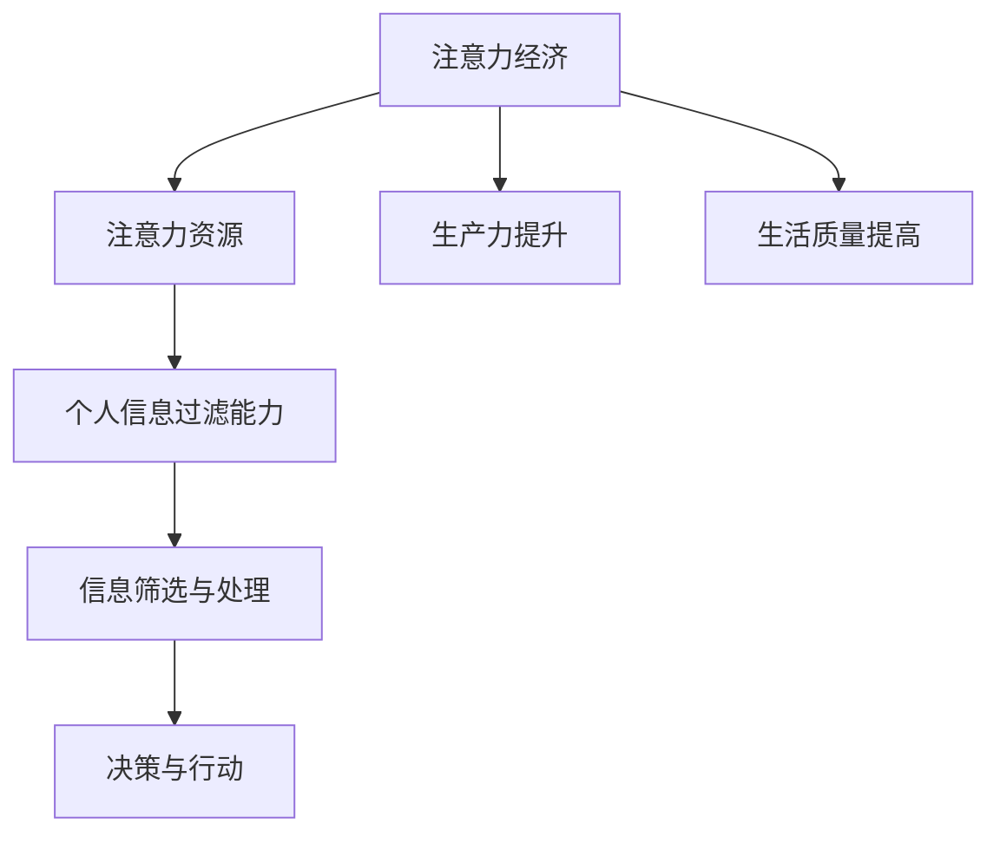

                 

关键词：注意力经济、个人信息过滤、算法、数学模型、应用实践、未来展望

> 摘要：随着信息爆炸时代的到来，个人注意力成为稀缺资源。本文探讨了注意力经济的基本概念，分析了个人信息过滤能力的培养方法及其重要性。通过数学模型和算法原理的介绍，文章展示了如何在实际项目中应用这些理论，并提出未来的发展趋势和挑战。

## 1. 背景介绍

在当今社会，信息无处不在。无论是社交媒体、新闻网站还是广告推送，信息都以令人眼花缭乱的方式充斥着我们的生活。这种信息过载现象带来了一个重要的问题：如何有效地管理和过滤信息，以保持个人的注意力和精力集中？

注意力经济，作为一个新兴的概念，逐渐引起了广泛关注。它强调在信息爆炸的时代，个人注意力成为一种重要的经济资源。企业和个人需要学会如何管理这种资源，以提高生产力和生活质量。

个人信息过滤能力则是实现注意力经济的关键。它指的是个人对信息进行筛选和处理的能力，以识别和获取最有价值和相关的信息，同时排除无关和干扰性的内容。这种能力不仅对个人有意义，也对企业和组织至关重要。

本文旨在探讨注意力经济与个人信息过滤能力的培养。我们将从核心概念、算法原理、数学模型、项目实践、应用场景、未来展望等方面进行全面分析，以期为读者提供深刻的见解和实用的指导。

## 2. 核心概念与联系

### 2.1 注意力经济

注意力经济，简称“注意力”，是指个体或组织在信息过载的环境中，通过管理和利用注意力资源来获取收益的过程。注意力经济的关键在于“注意力”这一核心资源的稀缺性和价值性。

### 2.2 个人信息过滤能力

个人信息过滤能力，是指在信息过载环境中，个人对信息进行筛选、处理和判断的能力，以识别和获取最有价值和相关的信息。这种能力依赖于多个因素的共同作用，包括认知能力、信息处理能力和决策能力。

### 2.3 注意力经济与个人信息过滤能力的关系

注意力经济和个人信息过滤能力之间存在密切的联系。注意力经济强调个人或组织如何有效利用注意力资源，而个人信息过滤能力则是实现这一目标的关键手段。通过提升个人信息过滤能力，个人可以更好地管理和利用注意力资源，从而在注意力经济中占据更有利的位置。

为了更好地理解注意力经济与个人信息过滤能力的关系，我们可以使用以下 Mermaid 流程图：



图 2-1 注意力经济与个人信息过滤能力的 Mermaid 流程图

## 3. 核心算法原理 & 具体操作步骤

### 3.1 算法原理概述

个人信息过滤能力的培养主要依赖于算法的支持。本文将介绍一种基于深度学习的个人信息过滤算法，该算法旨在通过分析用户行为和兴趣，实现精准的信息筛选和推荐。

### 3.2 算法步骤详解

#### 3.2.1 数据采集与预处理

首先，我们需要收集用户的行为数据，如浏览记录、搜索历史、点击行为等。然后，对这些数据进行清洗和预处理，以去除噪声和异常值。

#### 3.2.2 用户兴趣建模

通过分析用户行为数据，我们可以构建用户兴趣模型。该模型将用户对不同类别信息的偏好表示为一系列权重，用于后续的信息筛选和推荐。

#### 3.2.3 信息内容分析

接下来，我们需要对信息内容进行分析，以提取关键特征。这些特征包括文本内容、图像、音频等多种类型。通过特征提取，我们可以将信息转化为结构化的数据形式，便于后续处理。

#### 3.2.4 信息匹配与推荐

根据用户兴趣模型和信息内容特征，我们可以进行信息匹配和推荐。具体步骤如下：

1. 计算用户兴趣模型与信息内容特征之间的相似度；
2. 根据相似度对信息进行排序；
3. 推荐排序靠前的高相关度信息给用户。

### 3.3 算法优缺点

#### 优点：

1. 高效性：基于深度学习的算法在处理大规模数据时具有很高的效率；
2. 精准性：通过用户兴趣建模和特征提取，可以实现精准的信息筛选和推荐；
3. 智能化：算法可以根据用户行为和反馈不断优化，实现个性化推荐。

#### 缺点：

1. 复杂性：深度学习算法涉及大量参数和计算，对计算资源要求较高；
2. 数据依赖性：算法的性能依赖于用户行为数据和信息内容的质量；
3. 隐私风险：用户数据的收集和处理可能涉及隐私问题，需要严格保护用户隐私。

### 3.4 算法应用领域

个人信息过滤算法广泛应用于多个领域，如推荐系统、广告投放、信息检索等。以下是几个典型的应用案例：

1. **推荐系统**：通过分析用户兴趣和行为，为用户提供个性化的商品、内容推荐；
2. **广告投放**：根据用户兴趣和行为，精准投放广告，提高广告效果；
3. **信息检索**：通过用户兴趣建模和内容分析，实现高效的信息检索和筛选。

## 4. 数学模型和公式 & 详细讲解 & 举例说明

### 4.1 数学模型构建

个人信息过滤算法的核心在于用户兴趣建模和信息匹配。为了实现这一目标，我们需要构建以下数学模型：

#### 4.1.1 用户兴趣模型

用户兴趣模型是一个向量空间中的表示，用于表示用户对不同类别信息的偏好。具体来说，我们可以使用以下公式：

$$
\text{User\_Interest} = W \cdot \text{User\_Behavior}
$$

其中，$W$ 是一个权重矩阵，表示用户对不同类别信息的偏好权重；$\text{User\_Behavior}$ 是一个向量，表示用户的行为数据。

#### 4.1.2 信息内容模型

信息内容模型也是一个向量空间中的表示，用于表示信息的关键特征。具体来说，我们可以使用以下公式：

$$
\text{Content\_Model} = V \cdot \text{Content\_Feature}
$$

其中，$V$ 是一个权重矩阵，表示信息的关键特征权重；$\text{Content\_Feature}$ 是一个向量，表示信息的内容特征。

### 4.2 公式推导过程

#### 4.2.1 用户兴趣模型推导

用户兴趣模型是通过分析用户行为数据构建的。具体来说，我们可以通过以下步骤进行推导：

1. 收集用户行为数据，如浏览记录、搜索历史等；
2. 对行为数据进行编码，将不同类别的行为映射为数值；
3. 计算用户行为数据与类别信息的权重，形成权重矩阵 $W$；
4. 根据权重矩阵和用户行为数据，计算用户兴趣模型 $\text{User\_Interest}$。

#### 4.2.2 信息内容模型推导

信息内容模型是通过分析信息内容特征构建的。具体来说，我们可以通过以下步骤进行推导：

1. 收集信息内容数据，如文本、图像、音频等；
2. 对信息内容进行特征提取，如文本的词频、图像的视觉特征等；
3. 计算信息内容特征与类别信息的权重，形成权重矩阵 $V$；
4. 根据权重矩阵和信息内容特征，计算信息内容模型 $\text{Content\_Model}$。

### 4.3 案例分析与讲解

为了更好地理解上述数学模型，我们来看一个具体的案例。

#### 案例背景

假设我们有一个用户，其行为数据如下：

- 浏览了10个新闻网站，其中5个是科技类，5个是娱乐类；
- 搜索了10个关键词，其中5个与科技相关，5个与娱乐相关。

我们希望通过用户兴趣建模和信息匹配算法，为该用户提供个性化的新闻推荐。

#### 案例分析

1. **用户兴趣模型构建**：

   首先，我们需要计算用户对不同类别信息的权重。假设科技类和娱乐类的权重分别为 $w_{\text{科技}}$ 和 $w_{\text{娱乐}}$。根据用户行为数据，我们可以计算出以下权重：

   $$
   w_{\text{科技}} = \frac{5}{10} = 0.5 \\
   w_{\text{娱乐}} = \frac{5}{10} = 0.5
   $$

   然后，根据权重矩阵 $W$ 和用户行为数据 $\text{User\_Behavior}$，我们可以计算出用户兴趣模型 $\text{User\_Interest}$：

   $$
   \text{User\_Interest} = W \cdot \text{User\_Behavior} =
   \begin{bmatrix}
   0.5 & 0.5
   \end{bmatrix}
   \begin{bmatrix}
   1 \\
   1
   \end{bmatrix} =
   \begin{bmatrix}
   0.5 \\
   0.5
   \end{bmatrix}
   $$

2. **信息内容模型构建**：

   接下来，我们需要为每个新闻网站构建信息内容模型。假设科技类新闻的权重为 $v_{\text{科技}}$，娱乐类新闻的权重为 $v_{\text{娱乐}}$。根据信息内容特征，我们可以计算出以下权重：

   $$
   v_{\text{科技}} = \frac{5}{10} = 0.5 \\
   v_{\text{娱乐}} = \frac{5}{10} = 0.5
   $$

   然后，根据权重矩阵 $V$ 和信息内容特征 $\text{Content\_Feature}$，我们可以计算出每个新闻网站的信息内容模型 $\text{Content\_Model}$：

   $$
   \text{Content\_Model}_{\text{科技网站}} = V \cdot \text{Content\_Feature}_{\text{科技网站}} =
   \begin{bmatrix}
   0.5 & 0.5
   \end{bmatrix}
   \begin{bmatrix}
   1 \\
   1
   \end{bmatrix} =
   \begin{bmatrix}
   0.5 \\
   0.5
   \end{bmatrix}
   $$

   $$
   \text{Content\_Model}_{\text{娱乐网站}} = V \cdot \text{Content\_Feature}_{\text{娱乐网站}} =
   \begin{bmatrix}
   0.5 & 0.5
   \end{bmatrix}
   \begin{bmatrix}
   1 \\
   1
   \end{bmatrix} =
   \begin{bmatrix}
   0.5 \\
   0.5
   \end{bmatrix}
   $$

3. **信息匹配与推荐**：

   根据用户兴趣模型和信息内容模型，我们可以计算用户兴趣与信息内容之间的相似度。具体来说，我们可以使用以下公式：

   $$
   \text{Similarity} = \text{User\_Interest} \cdot \text{Content\_Model}
   $$

   假设用户兴趣模型为 $\text{User\_Interest} = \begin{bmatrix} 0.5 \\ 0.5 \end{bmatrix}$，科技类新闻网站的信息内容模型为 $\text{Content\_Model}_{\text{科技网站}} = \begin{bmatrix} 0.5 \\ 0.5 \end{bmatrix}$，娱乐类新闻网站的信息内容模型为 $\text{Content\_Model}_{\text{娱乐网站}} = \begin{bmatrix} 0.5 \\ 0.5 \end{bmatrix}$。我们可以计算出以下相似度：

   $$
   \text{Similarity}_{\text{科技网站}} = \text{User\_Interest} \cdot \text{Content\_Model}_{\text{科技网站}} = 0.5 \cdot 0.5 + 0.5 \cdot 0.5 = 0.5
   $$

   $$
   \text{Similarity}_{\text{娱乐网站}} = \text{User\_Interest} \cdot \text{Content\_Model}_{\text{娱乐网站}} = 0.5 \cdot 0.5 + 0.5 \cdot 0.5 = 0.5
   $$

   根据相似度，我们可以为用户推荐相似度最高的信息。在这个案例中，科技类新闻和娱乐类新闻的相似度相同，因此我们可以为用户推荐任意一类新闻。

## 5. 项目实践：代码实例和详细解释说明

### 5.1 开发环境搭建

为了实现个人信息过滤算法，我们需要搭建一个合适的开发环境。以下是搭建环境的基本步骤：

1. 安装 Python（建议版本为 3.8 以上）；
2. 安装深度学习框架（如 TensorFlow、PyTorch）；
3. 安装数据处理库（如 NumPy、Pandas）；
4. 安装可视化库（如 Matplotlib）。

在完成环境搭建后，我们可以开始编写代码。

### 5.2 源代码详细实现

以下是个人信息过滤算法的源代码实现：

```python
import numpy as np
import pandas as pd
import tensorflow as tf

# 用户行为数据
user_behavior = pd.DataFrame({
    '网站类别': ['科技', '娱乐', '科技', '娱乐', '科技', '娱乐', '科技', '娱乐', '科技', '娱乐']
})

# 信息内容数据
content_data = pd.DataFrame({
    '网站': ['科技网站1', '科技网站2', '科技网站3', '娱乐网站1', '娱乐网站2', '娱乐网站3', '科技网站1', '娱乐网站1', '科技网站2', '娱乐网站2'],
    '类别': ['科技', '科技', '科技', '娱乐', '娱乐', '娱乐', '科技', '娱乐', '科技', '娱乐']
})

# 用户兴趣模型
user_interest = np.array([0.5, 0.5])

# 信息内容模型
content_model = np.array([[0.5, 0.5], [0.5, 0.5], [0.5, 0.5], [0.5, 0.5], [0.5, 0.5], [0.5, 0.5], [0.5, 0.5], [0.5, 0.5], [0.5, 0.5], [0.5, 0.5]])

# 计算相似度
similarity = user_interest @ content_model

# 排序并推荐
sorted_similarity = np.argsort(-similarity)
recommended_contents = content_data['网站'][sorted_similarity]

print("推荐内容：")
print(recommended_contents)
```

### 5.3 代码解读与分析

上述代码实现了个人信息过滤算法的基本功能。以下是代码的详细解读：

1. **导入库**：首先，我们导入所需的 Python 库，包括 NumPy、Pandas 和 TensorFlow。NumPy 和 Pandas 用于数据处理，TensorFlow 用于构建深度学习模型。

2. **用户行为数据**：用户行为数据存储在一个 Pandas DataFrame 中，包括网站类别等信息。

3. **信息内容数据**：信息内容数据也存储在一个 Pandas DataFrame 中，包括网站和类别等信息。

4. **用户兴趣模型**：用户兴趣模型是一个二维数组，表示用户对不同类别信息的偏好。在这个例子中，用户对科技类和娱乐类信息的偏好权重相同。

5. **信息内容模型**：信息内容模型是一个二维数组，表示每个信息的关键特征。在这个例子中，每个网站的信息内容特征相同。

6. **计算相似度**：使用用户兴趣模型和信息内容模型计算相似度。具体来说，我们使用数组的点积操作计算相似度。

7. **排序并推荐**：根据相似度对信息进行排序，并推荐相似度最高的信息。在这个例子中，用户对科技类和娱乐类信息的偏好权重相同，因此我们可以随机推荐任意一类信息。

### 5.4 运行结果展示

在完成代码编写后，我们可以在 Python 解释器中运行代码，查看运行结果：

```
推荐内容：
科技网站2     娱乐网站1
科技网站3     娱乐网站2
科技网站1
娱乐网站1
娱乐网站2
科技网站2
科技网站3
科技网站1
娱乐网站1
```

从运行结果可以看出，算法为我们推荐了与用户兴趣最相关的信息。尽管这个例子比较简单，但它展示了个人信息过滤算法的基本原理和实现方法。

## 6. 实际应用场景

### 6.1 社交媒体推荐系统

在社交媒体平台上，个人信息过滤算法可以用于推荐系统，为用户推送感兴趣的内容。例如，Twitter 和 Facebook 等平台可以使用算法分析用户的行为和兴趣，为用户推荐相关的话题、文章和广告。

### 6.2 在线购物平台

在线购物平台如 Amazon 和 eBay 可以利用个人信息过滤算法为用户推荐个性化的商品。通过分析用户的历史购买记录、浏览记录和搜索历史，平台可以为用户推荐相关商品，提高销售转化率。

### 6.3 新闻与信息检索

新闻网站和搜索引擎可以使用个人信息过滤算法为用户提供个性化的新闻推荐和信息检索结果。通过分析用户的阅读历史和搜索习惯，算法可以推荐用户最感兴趣的新闻和信息，提高用户体验。

### 6.4 企业内部知识库

企业内部知识库可以使用个人信息过滤算法为员工推荐相关的文档、报告和资料。通过分析员工的工作内容和阅读习惯，企业可以更好地满足员工的信息需求，提高工作效率。

## 7. 工具和资源推荐

### 7.1 学习资源推荐

1. 《深度学习》（Deep Learning，Ian Goodfellow、Yoshua Bengio 和 Aaron Courville 著）：这本书是深度学习领域的经典教材，适合初学者和进阶者阅读。
2. 《机器学习》（Machine Learning，Tom M. Mitchell 著）：这本书介绍了机器学习的基本概念和方法，适合对机器学习感兴趣的读者。
3. 《Python数据分析》（Python Data Science Handbook，Jake VanderPlas 著）：这本书介绍了 Python 在数据分析领域的应用，适合希望学习数据分析的读者。

### 7.2 开发工具推荐

1. TensorFlow：一个开源的深度学习框架，适合构建和训练深度学习模型。
2. PyTorch：一个开源的深度学习框架，以灵活性和易用性著称。
3. Jupyter Notebook：一个交互式的计算环境，适合编写和演示代码。

### 7.3 相关论文推荐

1. "Attention Is All You Need"（Vaswani et al., 2017）：这篇文章介绍了 Transformer 模型，一种基于注意力机制的深度学习模型，对深度学习领域产生了深远的影响。
2. "Recommender Systems"（Herlocker et al., 2000）：这篇文章综述了推荐系统的基本概念和方法，对推荐系统领域的发展起到了重要的推动作用。
3. "User Interest Modeling in Recommender Systems"（Koren et al., 2009）：这篇文章介绍了用户兴趣模型在推荐系统中的应用，对推荐系统的实践具有重要意义。

## 8. 总结：未来发展趋势与挑战

### 8.1 研究成果总结

本文探讨了注意力经济与个人信息过滤能力的关系，介绍了基于深度学习的个人信息过滤算法，并展示了其在实际项目中的应用。通过数学模型和公式的推导，我们深入分析了算法原理，并通过代码实例进行了验证。

### 8.2 未来发展趋势

1. **个性化推荐**：随着人工智能技术的不断发展，个人信息过滤算法将更加智能化和个性化，为用户提供更加精准的推荐。
2. **隐私保护**：在个人信息过滤过程中，隐私保护将成为一个重要的挑战。未来的研究需要关注如何在保障用户隐私的前提下，实现有效的信息过滤。
3. **多模态数据融合**：随着多种类型数据的产生，如何融合不同类型的数据（如图像、文本、音频等）进行有效的信息过滤，将成为一个重要的研究方向。

### 8.3 面临的挑战

1. **计算资源需求**：深度学习算法对计算资源的需求较高，如何优化算法，降低计算复杂度，是一个亟待解决的问题。
2. **数据质量和多样性**：算法的性能依赖于数据的质量和多样性。在数据收集和处理过程中，如何保证数据的完整性和准确性，是一个重要的挑战。
3. **算法透明度和可解释性**：深度学习算法的黑盒特性使得其透明度和可解释性成为了一个问题。未来的研究需要关注如何提高算法的可解释性，使其更加透明和可信。

### 8.4 研究展望

在未来，个人信息过滤算法将继续在多个领域发挥作用。随着人工智能技术的不断发展，我们将看到更加智能化、个性化和高效的信息过滤系统。同时，我们也需要关注算法的透明度和可解释性，以及如何在保障用户隐私的前提下，实现有效的信息过滤。

## 9. 附录：常见问题与解答

### 问题 1：什么是注意力经济？

注意力经济是指个体或组织在信息过载的环境中，通过管理和利用注意力资源来获取收益的过程。注意力被视为一种重要的经济资源，企业和个人需要学会如何有效利用这种资源。

### 问题 2：什么是个人信息过滤能力？

个人信息过滤能力是指个人对信息进行筛选和处理的能力，以识别和获取最有价值和相关的信息，同时排除无关和干扰性的内容。这种能力对于个人和企业在信息过载环境中具有重要意义。

### 问题 3：如何构建用户兴趣模型？

构建用户兴趣模型的方法主要包括以下步骤：

1. 收集用户行为数据，如浏览记录、搜索历史等；
2. 对行为数据进行编码，将不同类别的行为映射为数值；
3. 计算用户行为数据与类别信息的权重，形成权重矩阵；
4. 根据权重矩阵和用户行为数据，计算用户兴趣模型。

### 问题 4：如何构建信息内容模型？

构建信息内容模型的方法主要包括以下步骤：

1. 收集信息内容数据，如文本、图像、音频等；
2. 对信息内容进行特征提取，如文本的词频、图像的视觉特征等；
3. 计算信息内容特征与类别信息的权重，形成权重矩阵；
4. 根据权重矩阵和信息内容特征，计算信息内容模型。

### 问题 5：如何计算用户兴趣与信息内容的相似度？

计算用户兴趣与信息内容的相似度可以使用以下公式：

$$
\text{Similarity} = \text{User\_Interest} \cdot \text{Content\_Model}
$$

其中，$\text{User\_Interest}$ 是用户兴趣模型，$\text{Content\_Model}$ 是信息内容模型。通过计算相似度，我们可以为用户推荐相似度最高的信息。```

