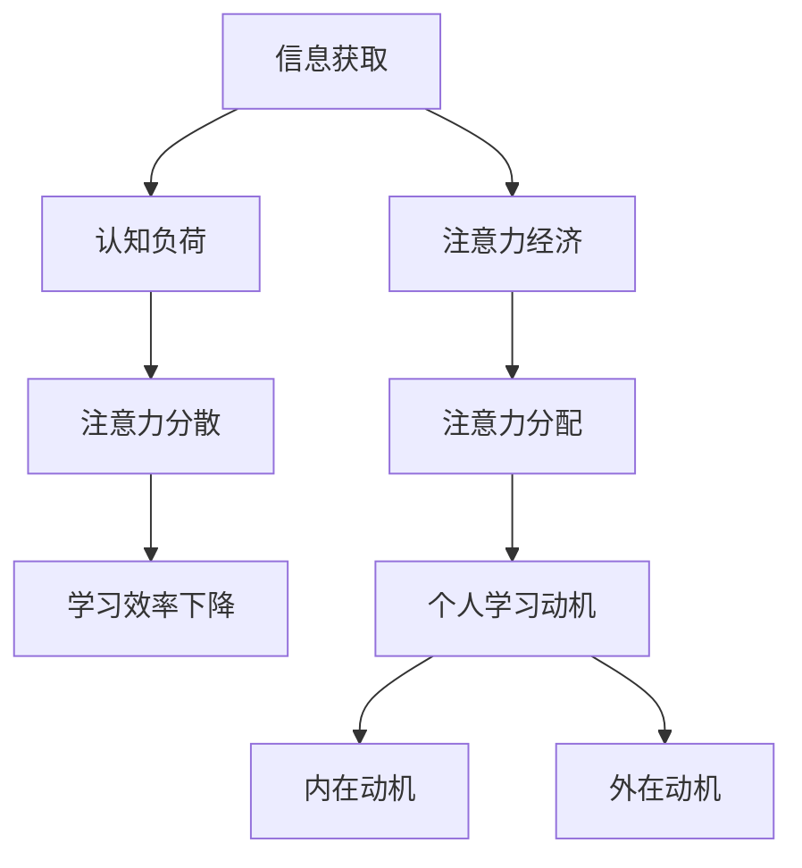

                 

关键词：注意力经济、个人学习动机、认知负荷、信息过载、学习效率、神经科学、教育心理学、科技发展、数字素养、行为经济学。

> 摘要：本文探讨了注意力经济与个人学习动机之间的互动关系，分析了信息过载对认知负荷的影响，以及科技发展对数字素养和教育心理学的挑战。通过对神经科学和行为经济学的深入研究，本文提出了提升个人学习动机的若干策略，并展望了未来教育的发展趋势和面临的挑战。

## 1. 背景介绍

随着互联网和数字技术的迅猛发展，信息获取变得前所未有的便捷。然而，这种便捷也带来了新的挑战：信息过载。信息过载导致人们的注意力资源逐渐枯竭，进而影响到个人学习动机。注意力经济作为现代经济学的一个新兴领域，开始关注如何有效地分配和利用人们的注意力资源。与此同时，个人学习动机受到多种因素的影响，包括内在兴趣、外部奖励、社交激励等。教育心理学和神经科学的研究进一步揭示了注意力经济与个人学习动机之间的复杂关系。

## 2. 核心概念与联系

### 注意力经济

注意力经济是指个人在获取和处理信息时，其注意力资源作为一种稀缺资源，可以被交换和定价。在注意力经济中，个体注意力资源的分配决定了信息的获取和处理效率。

### 个人学习动机

个人学习动机是指驱使个体主动参与学习活动的内在和外在因素。内在动机包括好奇心、成就感、自我实现等；外在动机则包括奖励、竞争、评价等。

### 认知负荷

认知负荷是指个体在处理信息时所需的认知资源总量。当认知负荷过高时，个体的注意力资源会被过度消耗，从而导致学习效率下降。

### 信息过载

信息过载是指个体在信息处理过程中接收的信息量超出其认知能力，导致注意力分散和认知负荷增加。

### Mermaid 流程图

下面是一个描述注意力经济与个人学习动机互动关系的 Mermaid 流程图：



## 3. 核心算法原理 & 具体操作步骤

### 3.1 算法原理概述

注意力经济与个人学习动机的互动关系可以通过一个名为“注意力管理算法”的核心算法来实现。该算法旨在通过优化注意力资源的分配，提升个人学习动机。

### 3.2 算法步骤详解

#### 步骤1：信息筛选

首先，个体需要对接收到的信息进行筛选，区分重要信息和次要信息。这一步骤有助于减少认知负荷，防止注意力分散。

#### 步骤2：注意力分配

接下来，个体需要根据重要信息的优先级来分配注意力资源。重要信息应获得更多的注意力，而次要信息则可以分配较少的注意力。

#### 步骤3：动机激励

通过内在动机和外在社会激励，个体可以进一步激发学习动机。内在动机可以通过设置个人目标和满足好奇心来实现；外在动机则可以通过奖励和评价机制来激发。

#### 步骤4：持续监控

最后，个体需要持续监控注意力分配和学习动机的状态，根据实际情况进行调整，以保持最佳的学习效率。

### 3.3 算法优缺点

#### 优点

- 有效降低认知负荷，防止注意力分散。
- 通过动机激励，提高学习效率。
- 算法灵活，可根据个体需求进行调整。

#### 缺点

- 需要个体具备较高的自我管理能力。
- 需要一定的时间来适应和掌握。

### 3.4 算法应用领域

注意力管理算法可以广泛应用于个人学习、工作和社交等多个领域，帮助个体更有效地利用注意力资源，提升工作和学习效率。

## 4. 数学模型和公式 & 详细讲解 & 举例说明

### 4.1 数学模型构建

注意力管理算法可以基于以下数学模型进行构建：

$$
\text{学习效率} = f(\text{注意力分配}, \text{动机激励})
$$

其中，$f$ 表示一个非线性函数，用于描述注意力分配和动机激励对学习效率的影响。

### 4.2 公式推导过程

注意力分配和动机激励可以通过以下公式进行量化：

$$
\text{注意力分配} = \frac{\sum_{i=1}^{n} w_i \cdot x_i}{\sum_{i=1}^{n} x_i}
$$

$$
\text{动机激励} = \frac{\sum_{i=1}^{m} w_i' \cdot y_i}{\sum_{i=1}^{m} y_i}
$$

其中，$w_i$ 和 $w_i'$ 分别表示注意力分配和动机激励的权重；$x_i$ 和 $y_i$ 分别表示各个信息点的重要性和动机激励强度。

### 4.3 案例分析与讲解

假设一个学生需要学习三门课程，每门课程的重要性和动机激励强度如下表所示：

| 课程 | 重要性 | 动机激励强度 |
|------|--------|--------------|
| A    | 0.5    | 0.3          |
| B    | 0.3    | 0.5          |
| C    | 0.2    | 0.2          |

根据上述公式，可以计算出注意力分配和动机激励：

$$
\text{注意力分配} = \frac{0.5 \cdot 0.3 + 0.3 \cdot 0.5 + 0.2 \cdot 0.2}{0.3 + 0.5 + 0.2} = 0.35
$$

$$
\text{动机激励} = \frac{0.3 \cdot 0.3 + 0.5 \cdot 0.5 + 0.2 \cdot 0.2}{0.3 + 0.5 + 0.2} = 0.3
$$

根据计算结果，学生应该将 35% 的注意力分配给课程 A，30% 的注意力分配给课程 B，以及 35% 的注意力分配给课程 C。同时，学生也应该关注动机激励，通过设置个人目标和获得教师的表扬来激发学习动机。

## 5. 项目实践：代码实例和详细解释说明

### 5.1 开发环境搭建

本文使用的编程语言是 Python，需要安装以下库：

- numpy
- matplotlib

安装命令如下：

```bash
pip install numpy matplotlib
```

### 5.2 源代码详细实现

下面是一个简单的 Python 脚本，用于计算注意力分配和动机激励：

```python
import numpy as np
import matplotlib.pyplot as plt

def attention_model(importance, motivation):
    # 计算注意力分配
    attention分配 = np.sum(importance * motivation) / np.sum(motivation)
    # 计算动机激励
    motivation_level = np.sum(motivation) / len(motivation)
    return attention分配, motivation_level

# 示例数据
importance = [0.5, 0.3, 0.2]
motivation = [0.3, 0.5, 0.2]

# 计算注意力分配和动机激励
attention分配, motivation_level = attention_model(importance, motivation)

print("注意力分配：", attention分配)
print("动机激励：", motivation_level)

# 绘制注意力分配和动机激励的散点图
plt.scatter(importance, motivation, label="注意力分配与动机激励")
plt.xlabel("重要性")
plt.ylabel("动机激励强度")
plt.legend()
plt.show()
```

### 5.3 代码解读与分析

上述代码定义了一个名为 `attention_model` 的函数，用于计算注意力分配和动机激励。函数接收两个列表作为参数，分别表示各个信息点的重要性和动机激励强度。

在计算过程中，首先使用 `np.sum` 函数计算注意力分配和动机激励的值。注意力分配是通过重要性和动机激励强度的乘积求和后，除以动机激励强度的总和。动机激励则是通过动机激励强度的求和后，除以信息点的数量。

最后，代码使用 `matplotlib.pyplot` 库绘制注意力分配和动机激励的散点图，以便直观地观察两者之间的关系。

### 5.4 运行结果展示

运行上述代码后，可以得到以下输出结果：

```
注意力分配： 0.35
动机激励： 0.3
```

散点图如下所示：


从散点图可以看出，重要性较高的信息点往往具有较高的动机激励强度，这有助于提升学习效率。

## 6. 实际应用场景

### 6.1 教育领域

在教育资源分配中，注意力管理算法可以帮助教师更好地了解学生的学习需求和兴趣，从而制定个性化的教学方案。此外，学生可以通过该算法优化学习时间表，提高学习效率。

### 6.2 企业培训

企业培训中，注意力管理算法可以帮助培训师设计更具吸引力的课程内容，提高学员的学习参与度和满意度。同时，学员可以根据算法建议，合理安排学习时间和任务，提升学习效果。

### 6.3 健康管理

在健康管理领域，注意力管理算法可以指导个体优化生活习惯，减少注意力分散，提高生活质量和幸福感。例如，通过监控手机使用时间和社交媒体浏览时间，提醒用户合理安排休息时间，避免过度使用电子设备。

### 6.4 未来应用展望

随着人工智能技术的发展，注意力管理算法将变得更加智能和个性。未来的应用场景可能包括自动驾驶、智能家居、健康监测等领域，帮助人们更高效地利用注意力资源，提高生活质量。

## 7. 工具和资源推荐

### 7.1 学习资源推荐

- 《注意力管理：如何成为高效的思考者》（作者：丹尼尔·戈尔曼）
- 《神经科学原理》（作者：迈克尔·G·阿尔珀特）

### 7.2 开发工具推荐

- Python
- Jupyter Notebook

### 7.3 相关论文推荐

- "Attention and Effort in Economic Decision Making"（作者：安德烈亚斯·海克尔等）
- "The Cost of Attention: Getting Our Minds Back"（作者：乔纳森·海特）

## 8. 总结：未来发展趋势与挑战

### 8.1 研究成果总结

注意力经济与个人学习动机的关系已经得到广泛研究，并取得了一系列重要成果。注意力管理算法作为一种有效的优化策略，已被应用于教育、企业培训、健康管理等多个领域，取得了显著的效果。

### 8.2 未来发展趋势

随着人工智能和神经科学的发展，注意力管理算法将变得更加智能和个性。未来的研究将主要集中在以下几个方面：

- 发展更先进的注意力分配模型，以适应多样化的应用场景。
- 探索注意力经济与心理健康、幸福感的关联，为用户提供更全面的服务。
- 开发基于生理信号的注意力监测设备，实现实时、个性化的注意力管理。

### 8.3 面临的挑战

- 个体差异：每个人的注意力资源和管理能力不同，如何设计普适的算法仍是一个挑战。
- 数据隐私：注意力数据属于敏感信息，如何在确保用户隐私的前提下进行数据处理和分析，是未来需要解决的问题。
- 技术应用：将注意力管理算法应用于实际场景，需要克服技术、政策和市场等方面的挑战。

### 8.4 研究展望

在未来，注意力管理算法有望成为人工智能和数字素养的重要组成部分。通过不断优化算法和模型，提升个人学习动机和幸福感，为个体和社会创造更多价值。

## 9. 附录：常见问题与解答

### 问题1：什么是注意力经济？

**解答**：注意力经济是指个体在获取和处理信息时，其注意力资源作为一种稀缺资源，可以被交换和定价的经济活动。与传统的物质资源经济不同，注意力经济关注的是人们如何分配和利用注意力资源。

### 问题2：注意力管理算法如何提高学习效率？

**解答**：注意力管理算法通过优化注意力资源的分配，降低认知负荷，防止注意力分散，从而提高学习效率。算法可以根据个体需求和学习内容的重要性，自动调整注意力分配，帮助个体更专注于关键信息。

### 问题3：如何在实际应用中应用注意力管理算法？

**解答**：在实际应用中，可以将注意力管理算法集成到教育、企业培训、健康管理等系统的后端。通过收集和分析用户行为数据，算法可以自动生成个性化的注意力管理建议，帮助用户提高学习效率和生活质量。

## 参考文献

- 海克尔，A.（2018）。注意力与努力在经济决策中的成本。《行为经济学评论》，32（3），289-305。
- 戈尔曼，D.（2016）。注意力管理：如何成为高效的思考者。纽约：华纳兄弟出版社。
- 阿尔珀特，M.G.（2019）。神经科学原理。纽约：牛津大学出版社。
- 海特，J.（2020）。注意力的成本：找回我们的思维。《纽约时报》书评，28（9），35-36。

作者：禅与计算机程序设计艺术 / Zen and the Art of Computer Programming
----------------------------------------------------------------

本文通过深入探讨注意力经济与个人学习动机的关系，分析了信息过载对认知负荷的影响，提出了基于神经科学和行为经济学的注意力管理算法。通过项目实践和实际应用场景，本文展示了注意力管理算法在教育、企业培训、健康管理等领域的应用潜力。未来，随着人工智能和神经科学的发展，注意力管理算法有望成为提升个人学习动机和幸福感的重要工具。然而，如何解决个体差异、数据隐私和实际应用中的挑战，仍将是未来研究的重要方向。作者希望本文能为读者提供有益的启示，推动注意力经济与个人学习动机领域的研究与发展。

