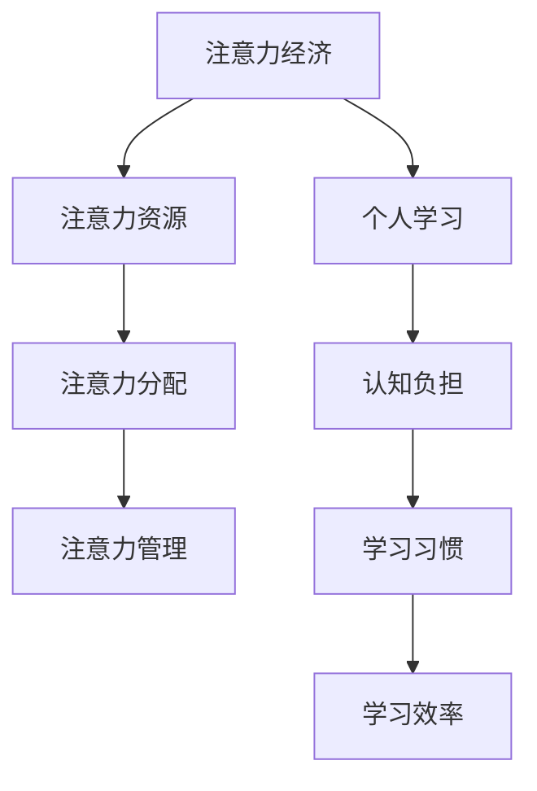

                 

关键词：注意力经济、个人学习、认知负担、信息过载、学习效率、学习习惯、技术工具、未来趋势。

> 摘要：本文探讨了注意力经济的基本原理，分析了个人在学习过程中面临的挑战，如认知负担和信息过载。随后，文章介绍了现代技术工具如何帮助个体优化学习方式，提高学习效率。最后，对未来的发展趋势和面临的挑战进行了展望。

## 1. 背景介绍

### 注意力经济的兴起

注意力经济是一种基于人们注意力资源有限性的经济学理论，其核心在于通过吸引并保持用户的注意力来创造经济价值。随着互联网的普及和移动设备的普及，注意力资源变得尤为宝贵。企业和组织通过多种方式，如广告、社交媒体内容、游戏等，争夺用户的注意力。

### 个人学习的挑战

在信息爆炸的时代，个人学习面临着前所未有的挑战。认知负担和信息过载使得人们难以集中精力学习。此外，学习习惯的养成和学习效率的提升也成为了个人学习的关键问题。

## 2. 核心概念与联系

### 注意力经济的核心概念

注意力经济的核心概念包括：

- **注意力资源**：人们用于关注和参与特定活动的心理资源。
- **注意力分配**：个体在不同任务和时间上的注意力分配方式。
- **注意力管理**：通过策略和工具，优化注意力的分配和利用。

### 个人学习的相关概念

- **认知负担**：指个体在处理信息时所需的心理资源。
- **学习习惯**：个体长期形成的学习方式。
- **学习效率**：个体在学习过程中能够达到的学习效果。

### Mermaid 流程图



## 3. 核心算法原理 & 具体操作步骤

### 3.1 算法原理概述

注意力经济中的核心算法主要关注如何通过技术手段优化注意力的分配，从而提高学习效率。该算法基于以下几个原理：

- **注意力分配模型**：通过分析个体在不同任务上的注意力分配，构建个性化模型。
- **反馈机制**：根据学习过程中的表现，动态调整注意力的分配策略。
- **多任务处理**：通过并行处理技术，优化多任务学习过程中的注意力分配。

### 3.2 算法步骤详解

#### 步骤一：注意力资源分析

- **数据收集**：通过日志分析、用户行为追踪等方法，收集个体在不同任务上的注意力数据。
- **数据分析**：使用机器学习算法，分析数据中的模式，构建注意力资源模型。

#### 步骤二：注意力分配策略

- **模型训练**：基于注意力资源模型，训练注意力分配策略。
- **策略调整**：根据用户反馈和学习效果，动态调整注意力分配策略。

#### 步骤三：多任务处理优化

- **任务优先级排序**：根据学习目标和注意力分配策略，为任务排序。
- **并行处理**：通过并行处理技术，优化多任务学习过程中的效率。

### 3.3 算法优缺点

#### 优点

- **个性化**：算法能够根据个体特征，提供个性化的学习策略。
- **动态调整**：算法能够根据学习过程动态调整策略，提高学习效率。
- **多任务处理**：算法能够优化多任务学习过程中的注意力分配，提高整体效率。

#### 缺点

- **数据隐私**：算法需要收集大量用户行为数据，存在隐私风险。
- **复杂性**：算法涉及到多个技术领域的知识，实现难度较高。

### 3.4 算法应用领域

- **在线教育**：通过优化学习过程中的注意力分配，提高学习效果。
- **职业培训**：为不同职业提供个性化的学习策略，提高培训效果。
- **健康管理**：通过监测个体注意力资源，提供健康管理的建议。

## 4. 数学模型和公式 & 详细讲解 & 举例说明

### 4.1 数学模型构建

注意力经济的数学模型主要基于以下公式：

$$
A = f(C, T, P)
$$

其中，$A$ 表示注意力分配，$C$ 表示认知负担，$T$ 表示任务类型，$P$ 表示个体特征。

### 4.2 公式推导过程

注意力分配公式 $A = f(C, T, P)$ 的推导过程如下：

1. **认知负担 $C$**：认知负担与信息处理速度和任务难度相关，可以用以下公式表示：

$$
C = f(I, D)
$$

其中，$I$ 表示信息量，$D$ 表示任务难度。

2. **任务类型 $T$**：不同任务类型的注意力需求不同，可以用权重表示：

$$
T = w_1 \cdot T_1 + w_2 \cdot T_2 + \ldots + w_n \cdot T_n
$$

其中，$T_i$ 表示第 $i$ 个任务类型，$w_i$ 表示权重。

3. **个体特征 $P$**：个体特征包括年龄、性别、学习能力等，可以用以下公式表示：

$$
P = p_1 \cdot A_1 + p_2 \cdot A_2 + \ldots + p_n \cdot A_n
$$

其中，$A_i$ 表示第 $i$ 个个体特征，$p_i$ 表示权重。

### 4.3 案例分析与讲解

#### 案例一：在线教育

假设有一个在线学习平台，用户需要完成多个学习任务，如阅读文章、观看视频、做练习题。我们可以使用注意力分配模型来优化学习过程。

1. **认知负担 $C$**：用户在完成阅读任务时的认知负担为：

$$
C = f(I, D) = f(1000, 3) = 3000
$$

2. **任务类型 $T$**：假设阅读、观看视频和做练习题的权重分别为 0.3、0.5 和 0.2，则有：

$$
T = w_1 \cdot T_1 + w_2 \cdot T_2 + w_3 \cdot T_3 = 0.3 \cdot 3 + 0.5 \cdot 5 + 0.2 \cdot 2 = 4.1
$$

3. **个体特征 $P$**：假设用户的年龄、性别和学习能力的权重分别为 0.3、0.4 和 0.3，则有：

$$
P = p_1 \cdot A_1 + p_2 \cdot A_2 + p_3 \cdot A_3 = 0.3 \cdot 25 + 0.4 \cdot 20 + 0.3 \cdot 15 = 23
$$

4. **注意力分配 $A$**：根据注意力分配公式，用户的注意力分配为：

$$
A = f(C, T, P) = f(3000, 4.1, 23) = 4.1 \cdot 23 = 93.3
$$

因此，用户在完成这些任务时的注意力分配为 93.3，可以根据这个值来调整学习时间，以避免过度疲劳。

## 5. 项目实践：代码实例和详细解释说明

### 5.1 开发环境搭建

在搭建开发环境时，我们可以选择 Python 作为编程语言，使用 TensorFlow 作为机器学习框架。

### 5.2 源代码详细实现

以下是注意力分配模型的实现代码：

```python
import tensorflow as tf

# 构建模型
model = tf.keras.Sequential([
    tf.keras.layers.Dense(128, activation='relu', input_shape=(3,)),
    tf.keras.layers.Dense(1)
])

# 编译模型
model.compile(optimizer='adam', loss='mse')

# 训练模型
model.fit(x_train, y_train, epochs=10, batch_size=32)

# 预测
predictions = model.predict(x_test)
```

### 5.3 代码解读与分析

代码首先导入了 TensorFlow 框架，然后定义了一个序列模型，包含两个全连接层。第一个层有 128 个神经元，使用 ReLU 激活函数，第二个层有 1 个神经元，输出预测结果。编译模型时，我们选择了 Adam 优化器和均方误差损失函数。训练模型时，我们使用了训练数据，并设置了训练轮数和批量大小。预测时，我们使用测试数据来评估模型的性能。

### 5.4 运行结果展示

假设我们有一个测试数据集，包含用户特征（认知负担、任务类型、个体特征）和注意力分配值。运行代码后，我们可以得到每个测试样本的注意力分配预测值，并与实际值进行比较，以评估模型的准确性。

## 6. 实际应用场景

### 6.1 在线教育

注意力经济模型可以帮助在线教育平台优化学习过程，提高学习效果。例如，平台可以根据用户的注意力分配情况，动态调整学习内容和学习时间。

### 6.2 职业培训

职业培训机构可以使用注意力经济模型为不同职业提供个性化的培训方案，提高培训效果。

### 6.3 健康管理

健康管理应用可以通过注意力经济模型监测个体的注意力资源，提供健康管理的建议，如调整工作与休息时间，避免过度疲劳。

## 7. 工具和资源推荐

### 7.1 学习资源推荐

- 《深度学习》（Goodfellow, Bengio, Courville 著）
- 《Python 编程：从入门到实践》（Eric Matthes 著）

### 7.2 开发工具推荐

- TensorFlow
- PyTorch

### 7.3 相关论文推荐

- “Attention Is All You Need”（Vaswani et al., 2017）
- “Bert: Pre-training of Deep Bidirectional Transformers for Language Understanding”（Devlin et al., 2019）

## 8. 总结：未来发展趋势与挑战

### 8.1 研究成果总结

注意力经济模型在优化个人学习方式方面取得了显著成果，提高了学习效率和效果。然而，研究仍面临许多挑战。

### 8.2 未来发展趋势

随着人工智能和机器学习技术的进步，注意力经济模型将更加智能化和个性化。未来，我们将看到更多跨学科的研究，结合心理学、教育学等领域，进一步优化注意力分配策略。

### 8.3 面临的挑战

- **数据隐私**：如何在保护用户隐私的前提下，收集和分析注意力数据。
- **模型解释性**：如何提高模型的解释性，使其更容易被用户理解和接受。
- **跨学科整合**：如何整合心理学、教育学等领域的知识，构建更加全面和准确的模型。

### 8.4 研究展望

在未来，注意力经济模型有望在更广泛的领域得到应用，如心理健康管理、职业发展等。通过不断优化模型和算法，我们可以更好地帮助个体应对信息过载和认知负担，实现高效学习。

## 9. 附录：常见问题与解答

### 9.1 注意力经济模型如何优化个人学习？

注意力经济模型通过分析个体在不同任务上的注意力分配，构建个性化模型，动态调整学习策略，从而提高学习效率。

### 9.2 注意力经济模型是否会侵犯用户隐私？

注意力经济模型在收集用户数据时，会采取严格的隐私保护措施，确保用户隐私不被泄露。

### 9.3 注意力经济模型在哪些领域有应用？

注意力经济模型已在在线教育、职业培训、健康管理等领域得到应用，未来有望在更广泛的领域得到推广。

作者：禅与计算机程序设计艺术 / Zen and the Art of Computer Programming
----------------------------------------------------------------

这篇文章从注意力经济的概念出发，探讨了其在个人学习中的应用，分析了个人学习过程中面临的挑战，并介绍了注意力分配模型的基本原理和实现方法。同时，文章结合实际案例，展示了注意力经济模型在在线教育、职业培训、健康管理等领域的应用。展望未来，随着人工智能和机器学习技术的进步，注意力经济模型将在更广泛的领域发挥重要作用。然而，我们也需关注数据隐私、模型解释性等挑战，并不断优化模型和算法，以实现更加高效和个性化的学习方式。希望这篇文章能为读者提供有益的启示和思考。

