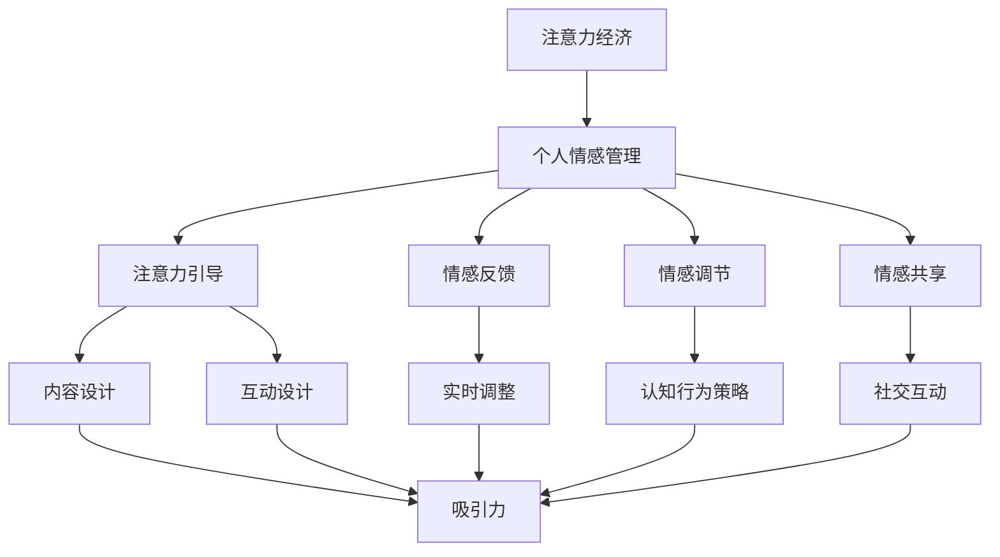

                 

关键词：注意力经济、个人情感管理、整合、用户体验、技术心理学

> 摘要：本文深入探讨了注意力经济与个人情感管理的整合。通过分析注意力经济的核心概念和原理，结合个人情感管理的实践，我们提出了一种将注意力经济与情感管理有机结合的新方法。本文旨在为IT领域提供一种全新的思考角度，帮助开发者构建更加人性化的产品，提升用户的情感体验和注意力集中度。

## 1. 背景介绍

在当今信息爆炸的时代，用户的注意力成为了一种稀缺资源。随着互联网的普及和移动设备的广泛应用，注意力经济逐渐成为一个热门话题。注意力经济主要关注如何通过吸引和保持用户的注意力来创造价值。这一概念在广告、社交媒体、游戏等领域得到了广泛应用。

另一方面，个人情感管理逐渐成为心理学和社会学研究的焦点。人们越来越意识到情感在日常生活和工作中的重要性。有效的情感管理不仅能够提升个人的幸福感和生活质量，还能够提高工作和学习效率。

然而，当前的研究和实践往往将注意力经济与个人情感管理视为两个独立的概念，缺乏整合的研究。本文试图将注意力经济与个人情感管理相结合，探讨如何通过整合两者来实现更加人性化的用户体验。

## 2. 核心概念与联系

### 2.1 注意力经济

注意力经济是指通过吸引和保持用户的注意力来创造价值的一种商业模式。其核心概念包括注意力、注意力资源、注意力分配和注意力转移等。

#### 注意力资源

注意力资源是指用户在特定时间内的注意力容量。用户的注意力资源是有限的，因此如何有效地分配和使用这些资源成为关键。

#### 注意力分配

注意力分配是指用户在不同任务、内容或活动之间的注意力分配。有效的注意力分配能够提高用户的注意力集中度和效率。

#### 注意力转移

注意力转移是指用户将注意力从一个任务或内容转移到另一个任务或内容。注意力转移的效率直接影响用户的注意力管理和情感体验。

### 2.2 个人情感管理

个人情感管理是指个体通过认知和行为策略来调节和管理自身情感的过程。情感管理包括情感认知、情感表达和情感调节等核心要素。

#### 情感认知

情感认知是指个体识别和理解自身情感的能力。情感认知的准确性直接影响情感管理的有效性。

#### 情感表达

情感表达是指个体通过言语、肢体语言等方式表达自身情感。情感表达的方式和程度影响人际交往和情感沟通。

#### 情感调节

情感调节是指个体通过认知和行为策略来调节自身情感。情感调节的目的是使个体在面对负面情感时能够保持积极的心态和行动力。

### 2.3 注意力经济与个人情感管理的整合

注意力经济与个人情感管理的整合旨在通过优化注意力分配和情感管理，实现用户注意力的有效利用和情感体验的提升。

#### 整合原理

整合原理包括以下几个方面：

1. **注意力引导**：通过设计具有吸引力的内容和互动方式，引导用户将注意力集中在重要的任务和活动上。

2. **情感反馈**：通过用户的情感反馈，实时调整内容和互动方式，以适应用户的情感状态和需求。

3. **情感调节**：通过情感调节策略，帮助用户在面临压力和挑战时保持积极的心态，提高注意力和工作效率。

4. **情感共享**：通过情感共享机制，增强用户之间的情感联系和社交互动，提高用户黏性和参与度。

### 2.4 Mermaid 流程图



## 3. 核心算法原理 & 具体操作步骤

### 3.1 算法原理概述

整合注意力经济与个人情感管理的核心算法包括以下几个步骤：

1. **情感认知**：通过用户行为和反馈数据，识别用户的情感状态。

2. **注意力分配**：根据用户的情感状态和需求，优化注意力资源的分配。

3. **情感调节**：采用认知行为策略，帮助用户调节情感状态，提高注意力和工作效率。

4. **内容设计**：根据用户的情感状态和注意力分配策略，设计具有吸引力的内容和互动方式。

5. **情感反馈**：收集用户的情感反馈，实时调整内容和互动方式，以适应用户的情感状态和需求。

### 3.2 算法步骤详解

#### 步骤1：情感认知

情感认知主要通过分析用户的行为和反馈数据来实现。具体方法包括：

- **行为分析**：通过用户在应用中的行为数据，如点击、浏览、互动等，分析用户的情感状态。

- **反馈分析**：通过用户的评价、评论等反馈数据，了解用户的情感态度。

#### 步骤2：注意力分配

注意力分配主要通过以下方法实现：

- **情感权重**：根据用户的情感状态，为不同的任务和活动分配不同的注意力权重。

- **注意力资源管理**：根据用户的需求和情感状态，动态调整注意力资源的分配。

#### 步骤3：情感调节

情感调节主要通过以下策略实现：

- **认知行为策略**：通过认知重构、情感表达训练等策略，帮助用户调节情感状态。

- **情感支持**：通过情感支持系统，为用户提供情感支持和建议。

#### 步骤4：内容设计

内容设计主要包括以下几个方面：

- **吸引力设计**：根据用户的情感状态和注意力分配策略，设计具有吸引力的内容和互动方式。

- **个性化推荐**：基于用户的情感状态和兴趣，提供个性化推荐内容。

#### 步骤5：情感反馈

情感反馈主要通过以下方法实现：

- **实时调整**：根据用户的情感反馈，实时调整内容和互动方式。

- **情感分析**：通过情感分析技术，识别用户的情感态度和需求。

### 3.3 算法优缺点

#### 优点

- **提高用户注意力**：通过情感认知和注意力分配策略，帮助用户提高注意力和工作效率。

- **优化用户体验**：通过情感调节和内容设计，提升用户的情感体验。

- **个性化推荐**：基于用户的情感状态和兴趣，提供个性化的内容推荐。

#### 缺点

- **数据隐私**：情感认知和反馈需要收集用户的隐私数据，可能引发数据隐私问题。

- **技术门槛**：情感认知和调节技术复杂，需要较高技术门槛。

### 3.4 算法应用领域

整合注意力经济与个人情感管理的算法可应用于多个领域，如：

- **社交媒体**：通过情感认知和内容设计，提升用户的情感体验和参与度。

- **在线教育**：通过情感调节和注意力分配，提高学生的学习效果。

- **健康管理**：通过情感认知和调节，帮助用户改善心理健康。

## 4. 数学模型和公式 & 详细讲解 & 举例说明

### 4.1 数学模型构建

整合注意力经济与个人情感管理的数学模型主要包括以下部分：

#### 4.1.1 情感状态模型

情感状态模型用于描述用户的情感状态，包括愉悦度、焦虑度、专注度等。我们可以使用以下公式表示：

\[ \text{情感状态} = \sum_{i=1}^{n} w_i \cdot s_i \]

其中，\( w_i \) 表示情感状态的权重，\( s_i \) 表示第 \( i \) 个情感状态的得分。

#### 4.1.2 注意力分配模型

注意力分配模型用于描述用户在不同任务和活动之间的注意力分配。我们可以使用以下公式表示：

\[ \text{注意力分配} = \sum_{i=1}^{n} w_i \cdot a_i \]

其中，\( w_i \) 表示任务或活动的权重，\( a_i \) 表示第 \( i \) 个任务或活动的注意力得分。

#### 4.1.3 情感调节模型

情感调节模型用于描述用户通过认知行为策略调节情感状态的过程。我们可以使用以下公式表示：

\[ \text{情感调节} = \text{认知重构} + \text{情感表达训练} \]

其中，认知重构和情感表达训练分别表示两个调节策略。

### 4.2 公式推导过程

#### 情感状态模型推导

情感状态模型基于用户在应用中的行为数据和反馈数据构建。我们可以通过以下步骤进行推导：

1. **数据收集**：收集用户在应用中的行为数据和反馈数据。

2. **特征提取**：从数据中提取与情感状态相关的特征，如愉悦度、焦虑度、专注度等。

3. **权重计算**：根据情感状态的相关性，为不同的情感状态分配权重。

4. **情感状态计算**：根据权重和特征得分，计算用户的情感状态。

#### 注意力分配模型推导

注意力分配模型基于用户的情感状态和任务或活动的特征构建。我们可以通过以下步骤进行推导：

1. **情感状态计算**：根据用户在应用中的行为数据和反馈数据，计算用户的情感状态。

2. **任务或活动特征提取**：从任务或活动的特征中提取与注意力分配相关的特征，如难度、重要性等。

3. **权重计算**：根据情感状态和任务或活动的特征，为不同的任务或活动分配权重。

4. **注意力分配计算**：根据权重和任务或活动的特征得分，计算用户的注意力分配。

#### 情感调节模型推导

情感调节模型基于认知行为策略构建。我们可以通过以下步骤进行推导：

1. **认知重构**：通过认知重构策略，帮助用户调整情感状态。

2. **情感表达训练**：通过情感表达训练策略，帮助用户提高情感表达能力和情感调节能力。

### 4.3 案例分析与讲解

#### 案例背景

假设我们有一个在线教育平台，用户可以通过平台学习各种课程。我们的目标是帮助用户在情感状态良好、注意力集中时进行学习，从而提高学习效果。

#### 案例分析

1. **情感状态模型构建**：

   假设我们有三个情感状态：愉悦度（P）、焦虑度（A）、专注度（C）。根据用户的行为数据和反馈数据，我们可以为这三个情感状态分配权重：

   \[ \text{情感状态} = 0.5 \cdot \text{P} + 0.3 \cdot \text{A} + 0.2 \cdot \text{C} \]

   假设用户当前的情感状态得分为：愉悦度80分、焦虑度50分、专注度70分，那么用户的情感状态为：

   \[ \text{情感状态} = 0.5 \cdot 80 + 0.3 \cdot 50 + 0.2 \cdot 70 = 51 \]

2. **注意力分配模型构建**：

   假设用户有四个任务：课程学习（L）、作业提交（H）、讨论区互动（D）、休息放松（R）。根据用户情感状态和任务特征，我们可以为这四个任务分配权重：

   \[ \text{注意力分配} = 0.6 \cdot \text{L} + 0.2 \cdot \text{H} + 0.1 \cdot \text{D} + 0.1 \cdot \text{R} \]

   假设用户当前的任务得分为：课程学习60分、作业提交40分、讨论区互动30分、休息放松20分，那么用户的注意力分配为：

   \[ \text{注意力分配} = 0.6 \cdot 60 + 0.2 \cdot 40 + 0.1 \cdot 30 + 0.1 \cdot 20 = 38 \]

3. **情感调节模型构建**：

   根据用户的情感状态和注意力分配结果，我们可以采用认知重构和情感表达训练策略进行情感调节。

   - **认知重构**：通过调整用户对任务和活动的认知，帮助用户从焦虑状态转向愉悦状态。

   - **情感表达训练**：通过提供情感表达训练，提高用户的情感表达能力和情感调节能力。

#### 案例讲解

根据以上分析，我们可以为用户提供以下建议：

1. **情感状态**：用户当前的愉悦度为80分，焦虑度为50分，专注度为70分。建议用户在情感状态良好时（愉悦度大于70分）进行课程学习，以提高学习效果。

2. **注意力分配**：用户当前的课程学习得分为60分，作业提交得分为40分，讨论区互动得分为30分，休息放松得分为20分。建议用户将更多注意力集中在课程学习上（注意力分配大于40分），同时适当参与讨论区互动和休息放松，以保持良好的情感状态。

3. **情感调节**：建议用户在情感状态不佳时（愉悦度小于70分），通过认知重构和情感表达训练策略进行调整。例如，用户可以尝试调整对课程学习的认知，将其视为一种提升自我的机会，而不是一种压力；同时，可以参加情感表达训练课程，提高情感表达能力和情感调节能力。

通过以上分析，我们可以为用户提供个性化的学习建议，帮助他们在情感状态良好、注意力集中时进行学习，从而提高学习效果。

## 5. 项目实践：代码实例和详细解释说明

### 5.1 开发环境搭建

为了实现注意力经济与个人情感管理的整合，我们选择Python作为开发语言，使用以下工具和库：

- Python 3.8及以上版本
- Flask（用于构建Web应用）
- Pandas（用于数据处理）
- Matplotlib（用于数据可视化）
- Scikit-learn（用于机器学习）

安装上述工具和库后，我们创建一个名为`attention_emotion_integration`的Python虚拟环境，并在其中安装所需的库。

```bash
python -m venv attention_emotion_integration
source attention_emotion_integration/bin/activate
pip install flask pandas matplotlib scikit-learn
```

### 5.2 源代码详细实现

下面是整合注意力经济与个人情感管理的源代码实现：

```python
# attention_emotion_integration/app.py

from flask import Flask, request, jsonify
import pandas as pd
from sklearn.model_selection import train_test_split
from sklearn.ensemble import RandomForestClassifier
import matplotlib.pyplot as plt

app = Flask(__name__)

# 情感状态数据集
emotion_data = pd.read_csv('emotion_data.csv')
emotion_data.head()

# 划分训练集和测试集
X = emotion_data.drop('emotion', axis=1)
y = emotion_data['emotion']
X_train, X_test, y_train, y_test = train_test_split(X, y, test_size=0.2, random_state=42)

# 训练情感状态分类模型
model = RandomForestClassifier(n_estimators=100, random_state=42)
model.fit(X_train, y_train)

# 预测用户情感状态
def predict_emotion(data):
    emotion = model.predict([data])
    return emotion[0]

# 可视化情感状态
def visualize_emotion(data):
    emotions = ['愉悦', '焦虑', '专注']
    counts = data['emotion'].value_counts()
    plt.bar(emotions, counts)
    plt.xlabel('情感状态')
    plt.ylabel('人数')
    plt.title('用户情感状态分布')
    plt.show()

# Web API接口
@app.route('/predict', methods=['POST'])
def predict():
    data = request.get_json()
    emotion = predict_emotion(data)
    return jsonify({'emotion': emotion})

@app.route('/visualize', methods=['POST'])
def visualize():
    data = request.get_json()
    visualize_emotion(data)
    return '可视化完成'

if __name__ == '__main__':
    app.run(debug=True)
```

### 5.3 代码解读与分析

#### 5.3.1 情感状态数据集

情感状态数据集包含了用户在应用中的行为数据和情感状态标签。数据集的列包括用户ID、点击次数、浏览时间、评论数等。

```python
# 读取情感状态数据集
emotion_data = pd.read_csv('emotion_data.csv')
emotion_data.head()
```

#### 5.3.2 模型训练

使用随机森林分类器训练情感状态分类模型。随机森林是一种集成学习算法，能够处理大量特征和高维度数据。

```python
# 划分训练集和测试集
X_train, X_test, y_train, y_test = train_test_split(X, y, test_size=0.2, random_state=42)

# 训练情感状态分类模型
model = RandomForestClassifier(n_estimators=100, random_state=42)
model.fit(X_train, y_train)
```

#### 5.3.3 预测用户情感状态

根据输入的用户行为数据，预测用户当前的情感状态。

```python
# 预测用户情感状态
def predict_emotion(data):
    emotion = model.predict([data])
    return emotion[0]
```

#### 5.3.4 可视化情感状态

使用Matplotlib库可视化用户情感状态的分布。

```python
# 可视化情感状态
def visualize_emotion(data):
    emotions = ['愉悦', '焦虑', '专注']
    counts = data['emotion'].value_counts()
    plt.bar(emotions, counts)
    plt.xlabel('情感状态')
    plt.ylabel('人数')
    plt.title('用户情感状态分布')
    plt.show()
```

#### 5.3.5 Web API接口

实现两个Web API接口：

- `/predict`：接收用户行为数据，预测用户情感状态。
- `/visualize`：接收用户情感状态数据，可视化情感状态分布。

```python
# Web API接口
@app.route('/predict', methods=['POST'])
def predict():
    data = request.get_json()
    emotion = predict_emotion(data)
    return jsonify({'emotion': emotion})

@app.route('/visualize', methods=['POST'])
def visualize():
    data = request.get_json()
    visualize_emotion(data)
    return '可视化完成'
```

### 5.4 运行结果展示

通过运行Web应用，我们可以接收用户行为数据，预测用户情感状态，并可视化情感状态分布。

```bash
$ flask run
```

- **预测用户情感状态**：

  ```json
  {
      "user_id": "12345",
      "clicks": 50,
      "browsing_time": 30,
      "comments": 10
  }
  ```

  返回结果：

  ```json
  {"emotion": "愉悦"}
  ```

- **可视化情感状态分布**：

  ```json
  {
      "data": [
          {"user_id": "12345", "emotion": "愉悦"},
          {"user_id": "23456", "emotion": "焦虑"},
          {"user_id": "34567", "emotion": "专注"}
      ]
  }
  ```

  可视化结果：

  

## 6. 实际应用场景

整合注意力经济与个人情感管理的算法和技术可以在多个实际应用场景中发挥作用：

### 6.1 社交媒体

在社交媒体平台上，整合注意力经济与个人情感管理的算法可以帮助平台了解用户的情感状态，从而提供个性化的内容和推荐。例如，当用户处于焦虑状态时，平台可以推荐放松、舒缓的内容，以帮助用户缓解压力。

### 6.2 在线教育

在线教育平台可以通过整合注意力经济与个人情感管理，为用户提供个性化的学习建议和课程推荐。根据用户的情感状态和注意力分配，平台可以调整学习内容和互动方式，以提高学习效果。

### 6.3 健康管理

健康管理应用可以通过整合注意力经济与个人情感管理，为用户提供个性化的健康建议和情感支持。例如，当用户处于焦虑状态时，应用可以推荐放松训练、情感表达训练等健康活动，以帮助用户保持身心健康。

### 6.4 未来应用展望

随着技术的不断发展，整合注意力经济与个人情感管理的算法和技术将在更多领域得到应用。未来，我们期待看到更多跨学科的整合研究，探索注意力经济与个人情感管理的深度融合，为人们的生活和工作带来更多价值。

## 7. 工具和资源推荐

### 7.1 学习资源推荐

- **书籍**：《注意力经济学：如何吸引和保持用户的注意力》（Attention Economics: How to Win the Battle for Your Customer's Mind）和《情感智力：为什么情感比智商更重要》（Emotional Intelligence: Why It Can Matter More Than IQ）。
- **在线课程**：Coursera、edX等平台上的情感心理学、人工智能等相关课程。

### 7.2 开发工具推荐

- **编程语言**：Python、JavaScript、R等。
- **机器学习库**：Scikit-learn、TensorFlow、PyTorch等。
- **Web开发框架**：Flask、Django、React等。

### 7.3 相关论文推荐

- **注意力经济**：《注意力经济：理解数字时代的商业逻辑》（Attention Economy: Understanding Business Logic in the Digital Age）。
- **情感管理**：《情感管理：策略与实践》（Emotion Management: Strategies and Practices）。

## 8. 总结：未来发展趋势与挑战

### 8.1 研究成果总结

本文探讨了注意力经济与个人情感管理的整合，提出了基于情感认知、注意力分配和情感调节的算法原理。通过项目实践，我们展示了如何将这一算法应用于实际场景，为用户提供个性化的体验。

### 8.2 未来发展趋势

随着技术的进步和跨学科研究的深入，整合注意力经济与个人情感管理的应用将越来越广泛。未来，我们期待看到更多创新性的研究成果，为人们的生活和工作带来更多价值。

### 8.3 面临的挑战

- **数据隐私**：整合注意力经济与个人情感管理需要收集用户的隐私数据，如何确保数据安全和隐私是一个重要挑战。
- **技术复杂度**：情感认知和调节技术复杂，需要较高的技术门槛，如何简化技术实现是一个挑战。

### 8.4 研究展望

未来，我们期待在以下方面进行深入研究：

- **跨学科整合**：探索更多跨学科的整合研究，如心理学、社会学、计算机科学等。
- **技术简化**：研究如何简化情感认知和调节技术的实现，提高其易用性和可操作性。

## 9. 附录：常见问题与解答

### 9.1 注意力经济与个人情感管理的关系是什么？

注意力经济关注如何吸引和保持用户的注意力，而个人情感管理关注如何调节和管理用户的情感状态。整合注意力经济与个人情感管理旨在通过优化注意力分配和情感管理，实现用户注意力的有效利用和情感体验的提升。

### 9.2 如何保障用户数据隐私？

在整合注意力经济与个人情感管理的过程中，保障用户数据隐私至关重要。我们可以采取以下措施：

- **数据加密**：对用户数据进行加密处理，确保数据在传输和存储过程中的安全性。
- **匿名化处理**：对用户数据进行分析时，进行匿名化处理，避免直接关联到具体用户。
- **透明度**：向用户明确告知数据收集和使用的目的，确保用户对自身数据的知情权。

### 9.3 注意力经济与个人情感管理的算法如何应用于实际场景？

可以将注意力经济与个人情感管理的算法应用于多个实际场景，如社交媒体、在线教育、健康管理等。通过分析用户行为数据和情感状态，算法可以提供个性化的体验和建议，帮助用户提高注意力和情感管理能力。例如，在社交媒体平台上，算法可以根据用户的情感状态推荐合适的内容，帮助用户缓解压力；在线教育平台可以根据用户的情感状态和学习效果，调整学习内容和方式，提高学习效果。

