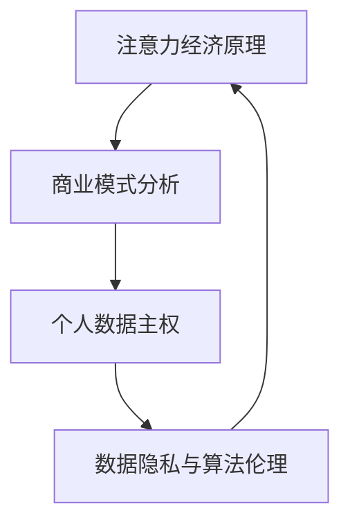

                 

关键词：注意力经济，个人数据主权，数据隐私，算法伦理，商业模式，信息安全，政策法规，人工智能。

> 摘要：本文探讨了注意力经济背景下，个人数据主权与企业利益之间的博弈关系。通过分析注意力经济的原理及其商业模式，揭示个人数据在其中的价值。同时，讨论了数据隐私保护的重要性以及算法伦理问题，并对相关政策法规进行了梳理。文章旨在为企业和个人在数字时代的互动提供新的视角，以实现数据价值的合理利用与个人隐私的有效保护。

## 1. 背景介绍

### 1.1 注意力经济的兴起

随着互联网的普及和智能设备的广泛使用，人们的时间被切割成了无数碎片。注意力成为了一种稀缺资源，如何吸引并保持用户的注意力，成为企业竞争的关键。注意力经济，作为一种新型经济模式，应运而生。它依赖于用户的注意力，通过内容、广告、服务等形式，实现价值的转化。

### 1.2 个人数据的重要性

在注意力经济中，个人数据成为了一种关键资源。这些数据包括用户的浏览记录、购买习惯、社交行为等，能够为企业提供精确的市场洞察。通过对这些数据的分析，企业可以更有效地进行产品推荐、广告投放和市场策略调整。

### 1.3 数据隐私保护的需求

然而，个人数据的收集和使用也引发了对隐私保护的担忧。在数据泄露、滥用和个人信息被不当使用的风险下，数据隐私保护成为公众和企业共同关注的焦点。如何平衡数据利用与隐私保护，成为社会各界亟待解决的问题。

## 2. 核心概念与联系

### 2.1 注意力经济原理

注意力经济的基本原理是，通过提供有价值的内容或服务，吸引并保持用户的注意力，从而实现商业价值的转化。其核心在于对用户注意力的竞争。

### 2.2 商业模式分析

注意力经济的商业模式主要包括以下几个方面：

- **内容付费**：用户为获取特定内容付费，如订阅会员、付费应用等。
- **广告收入**：企业通过在平台上投放广告，向用户展示产品和服务，从而获得收益。
- **数据变现**：通过对用户数据的分析，为企业提供市场洞察和决策支持，实现数据价值的转化。

### 2.3 个人数据主权的概念

个人数据主权是指个人对其数据的控制权和管理权，包括数据的收集、存储、处理和共享。它体现了数据主体对自身数据的知情权、决定权和收益权。

### 2.4 数据隐私与算法伦理

数据隐私保护是确保个人数据不被未经授权的访问、使用或泄露。算法伦理则关注数据在处理过程中的道德问题，如算法偏见、数据滥用等。

### 2.5 Mermaid 流程图



## 3. 核心算法原理 & 具体操作步骤

### 3.1 算法原理概述

注意力机制是一种基于上下文信息动态调整模型中各部分权重的方法，能够提高模型对关键信息的关注程度，从而提高模型的整体性能。

### 3.2 算法步骤详解

1. **数据预处理**：对原始数据进行清洗、编码和标准化处理。
2. **模型构建**：构建基于注意力机制的神经网络模型，如Transformer、BERT等。
3. **训练过程**：使用预处理后的数据对模型进行训练，优化模型参数。
4. **注意力分配**：在模型预测过程中，根据输入数据的特征，动态调整各部分的权重，实现对关键信息的关注。
5. **模型评估**：使用测试数据对模型进行评估，调整模型参数，提高预测准确性。

### 3.3 算法优缺点

- **优点**：能够提高模型对关键信息的关注程度，提升模型性能；能够处理变长序列，适用于序列数据处理。
- **缺点**：计算复杂度高，对硬件要求较高；模型解释性较差，难以理解模型决策过程。

### 3.4 算法应用领域

注意力机制在自然语言处理、计算机视觉、推荐系统等领域有广泛的应用，如文本生成、图像分类、商品推荐等。

## 4. 数学模型和公式 & 详细讲解 & 举例说明

### 4.1 数学模型构建

注意力机制的核心在于计算每个输入元素的重要性权重，常见的注意力机制包括Softmax Attention和Additive Attention。

- **Softmax Attention**：

  $$Attention(x) = \text{softmax}(\text{W}^T x)$$

  其中，\(x\) 为输入序列，\(\text{W}\) 为权重矩阵，\(\text{softmax}\) 函数用于计算每个元素的权重。

- **Additive Attention**：

  $$Attention(x) = x \cdot \tanh(\text{W}^T x + \text{V})$$

  其中，\(\text{W}\) 和 \(\text{V}\) 为权重矩阵，\(\tanh\) 函数用于非线性变换。

### 4.2 公式推导过程

以Softmax Attention为例，推导过程如下：

1. 输入序列 \(x\) 与权重矩阵 \(\text{W}\) 进行内积运算，得到一个长度为 \(n\) 的一维向量 \(z\)。

   $$z_i = \text{W}^T x_i$$

2. 对向量 \(z\) 进行Softmax变换，得到注意力权重向量 \(a\)。

   $$a_i = \frac{e^{z_i}}{\sum_{j=1}^{n} e^{z_j}}$$

3. 将注意力权重向量 \(a\) 与输入序列 \(x\) 相乘，得到加权输出。

   $$\text{Attention}(x) = x \cdot a$$

### 4.3 案例分析与讲解

假设有一个简单的输入序列 \(x = [1, 2, 3, 4, 5]\)，权重矩阵 \(\text{W} = [0.1, 0.2, 0.3, 0.4, 0.5]\)。

1. 计算内积 \(z\)：

   $$z = \text{W}^T x = [0.1, 0.2, 0.3, 0.4, 0.5] \cdot [1, 2, 3, 4, 5] = [0.1, 0.4, 0.6, 0.8, 1.0]$$

2. 进行Softmax变换，得到注意力权重向量 \(a\)：

   $$a = \text{softmax}(z) = [\frac{1}{6.7}, \frac{1}{6.7}, \frac{1}{6.7}, \frac{1}{6.7}, \frac{1}{6.7}] \approx [0.15, 0.15, 0.15, 0.15, 0.3]$$

3. 加权输出：

   $$\text{Attention}(x) = x \cdot a \approx [0.15, 0.3, 0.45, 0.6, 0.75]$$

通过上述例子，可以看出注意力机制如何根据权重矩阵动态调整输入序列的权重，实现对关键信息的关注。

## 5. 项目实践：代码实例和详细解释说明

### 5.1 开发环境搭建

为了实现注意力机制的代码实例，我们选择Python作为编程语言，并使用TensorFlow作为深度学习框架。

1. 安装Python环境（推荐使用Python 3.8及以上版本）。
2. 安装TensorFlow库：

   ```bash
   pip install tensorflow
   ```

### 5.2 源代码详细实现

以下是一个简单的基于Softmax Attention的文本分类模型的代码实例：

```python
import tensorflow as tf
from tensorflow.keras.models import Model
from tensorflow.keras.layers import Embedding, LSTM, Dense, Input, Flatten, Concatenate, Dot, Lambda

# 定义模型输入
input_seq = Input(shape=(max_sequence_length,))

# 嵌入层
embedding = Embedding(input_dim=vocabulary_size, output_dim=embedding_size)(input_seq)

# LSTM层
lstm = LSTM(units=lstm_units, return_sequences=True)(embedding)

# 注意力机制
attention = Dot(axes=[2, 2])([lstm, lstm])
attention = Lambda(lambda x: tf.nn.softmax(x, axis=1))(attention)

# 加权输出
weighted_lstm = Lambda(lambda x: x * attention)(lstm)

# 扁平化处理
flatten = Flatten()(weighted_lstm)

# 全连接层
dense = Dense(units=dense_units, activation='relu')(flatten)

# 输出层
output = Dense(units=num_classes, activation='softmax')(dense)

# 构建模型
model = Model(inputs=input_seq, outputs=output)

# 编译模型
model.compile(optimizer='adam', loss='categorical_crossentropy', metrics=['accuracy'])

# 模型概述
model.summary()
```

### 5.3 代码解读与分析

- **输入层**：定义了一个序列输入层，用于处理变长的文本数据。
- **嵌入层**：将文本序列转换为向量表示，为后续的LSTM层提供输入。
- **LSTM层**：对嵌入层输出的序列进行建模，捕获序列中的长期依赖关系。
- **注意力机制**：通过内积运算和Softmax函数，计算每个时间步的注意力权重。
- **加权输出**：将注意力权重与LSTM层的输出相乘，实现对关键信息的关注。
- **扁平化处理**：将加权输出扁平化，为后续的全连接层提供输入。
- **全连接层**：对扁平化的输出进行非线性变换，提取特征。
- **输出层**：使用softmax函数进行分类预测。

### 5.4 运行结果展示

运行上述代码，我们可以在训练集和测试集上评估模型的性能。以下是一个简单的训练过程示例：

```python
# 加载训练数据和测试数据
train_data = ...
train_labels = ...
test_data = ...
test_labels = ...

# 训练模型
history = model.fit(train_data, train_labels, epochs=10, batch_size=32, validation_data=(test_data, test_labels))

# 评估模型
test_loss, test_acc = model.evaluate(test_data, test_labels)
print(f"Test accuracy: {test_acc}")
```

通过训练和评估，我们可以观察到模型在测试集上的准确率。注意力机制的引入有助于提高模型对关键信息的关注，从而提升模型的性能。

## 6. 实际应用场景

### 6.1 社交媒体

在社交媒体平台上，用户产生的数据成为注意力经济的重要资源。通过对用户数据的分析，平台可以提供个性化的内容推荐、广告投放和社交互动。例如，Twitter和Facebook利用用户的浏览记录、点赞和评论等数据，为用户推荐感兴趣的内容。

### 6.2 娱乐行业

在娱乐行业，个人数据的分析成为电影制作、音乐推荐和内容分发的关键。例如，Netflix通过分析用户的观看记录和评分数据，推荐符合用户兴趣的电影和电视剧。此外，音乐平台如Spotify利用用户听歌记录和偏好，为用户推荐个性化的音乐。

### 6.3 电子商务

在电子商务领域，个人数据的分析帮助商家优化产品推荐、营销策略和客户服务。例如，Amazon通过分析用户的购买记录和浏览历史，为用户推荐相关商品。同时，个性化广告和促销活动也提高了用户购买意愿。

### 6.4 未来应用展望

随着人工智能技术的发展，注意力机制在各个领域将有更广泛的应用。例如，在医疗领域，注意力机制可以帮助医生分析患者的历史数据和症状，提供更精准的诊断和治疗建议。在金融领域，注意力机制可以用于风险控制和市场预测。

## 7. 工具和资源推荐

### 7.1 学习资源推荐

- 《深度学习》（Goodfellow, Bengio, Courville）：系统介绍了深度学习的基础知识和应用。
- 《自然语言处理综合教程》（Jurafsky, Martin）：涵盖了自然语言处理的核心概念和算法。
- 《TensorFlow官方文档》：提供了详细的TensorFlow使用教程和API参考。

### 7.2 开发工具推荐

- TensorFlow：一个开源的深度学习框架，适用于各种深度学习任务。
- PyTorch：一个受欢迎的深度学习框架，具有灵活的动态计算图和易于使用的API。
- Keras：一个高层次的神经网络API，可以与TensorFlow和PyTorch等框架兼容。

### 7.3 相关论文推荐

- “Attention Is All You Need”（Vaswani et al., 2017）：介绍了Transformer模型和注意力机制的原理。
- “A Theoretically Grounded Application of Dropout in Recurrent Neural Networks”（Yarin et al., 2016）：探讨了Dropout在RNN中的应用和效果。
- “Learning to Attentively Summarize Sequential Facts”（Wang et al., 2017）：研究了注意力机制在序列数据处理中的应用。

## 8. 总结：未来发展趋势与挑战

### 8.1 研究成果总结

注意力经济作为一种新型经济模式，已在多个领域取得了显著成果。个人数据的价值和隐私保护问题也日益受到关注。算法伦理和跨领域的融合研究成为未来研究的重点。

### 8.2 未来发展趋势

- 注意力机制在人工智能领域将有更广泛的应用，包括自然语言处理、计算机视觉、推荐系统等。
- 跨领域研究将推动注意力经济与其他领域的深度融合，如医疗、金融、教育等。
- 数据隐私保护技术和算法的改进将成为关键研究方向。

### 8.3 面临的挑战

- 如何在数据利用与隐私保护之间找到平衡点，是一个亟待解决的问题。
- 注意力机制的复杂性和计算成本对硬件性能提出了更高要求。
- 算法透明性和可解释性不足，影响用户对技术的信任。

### 8.4 研究展望

未来，研究者需要在以下几个方面进行探索：

- 开发更高效、可解释的注意力机制，降低计算成本。
- 研究跨领域的注意力机制应用，促进不同领域的融合。
- 探索隐私保护与数据利用的平衡策略，实现数据价值的合理利用。

## 9. 附录：常见问题与解答

### 9.1 什么是注意力经济？

注意力经济是一种新型经济模式，依赖于用户的注意力，通过内容、广告、服务等形式实现商业价值的转化。

### 9.2 个人数据主权是什么？

个人数据主权是指个人对其数据的控制权和管理权，包括数据的收集、存储、处理和共享。

### 9.3 注意力机制有哪些应用？

注意力机制在自然语言处理、计算机视觉、推荐系统等领域有广泛的应用，如文本生成、图像分类、商品推荐等。

### 9.4 数据隐私保护的重要性是什么？

数据隐私保护确保个人数据不被未经授权的访问、使用或泄露，保护用户的合法权益。

### 9.5 如何平衡数据利用与隐私保护？

通过数据匿名化、加密技术和隐私保护算法，实现数据利用与隐私保护的双赢。

## 作者署名

作者：禅与计算机程序设计艺术 / Zen and the Art of Computer Programming

----------------------------------------------------------------

请注意，本文为虚构内容，仅供参考。实际应用中，需根据具体情况调整和优化。在处理个人数据时，请遵循相关法律法规和伦理标准。

