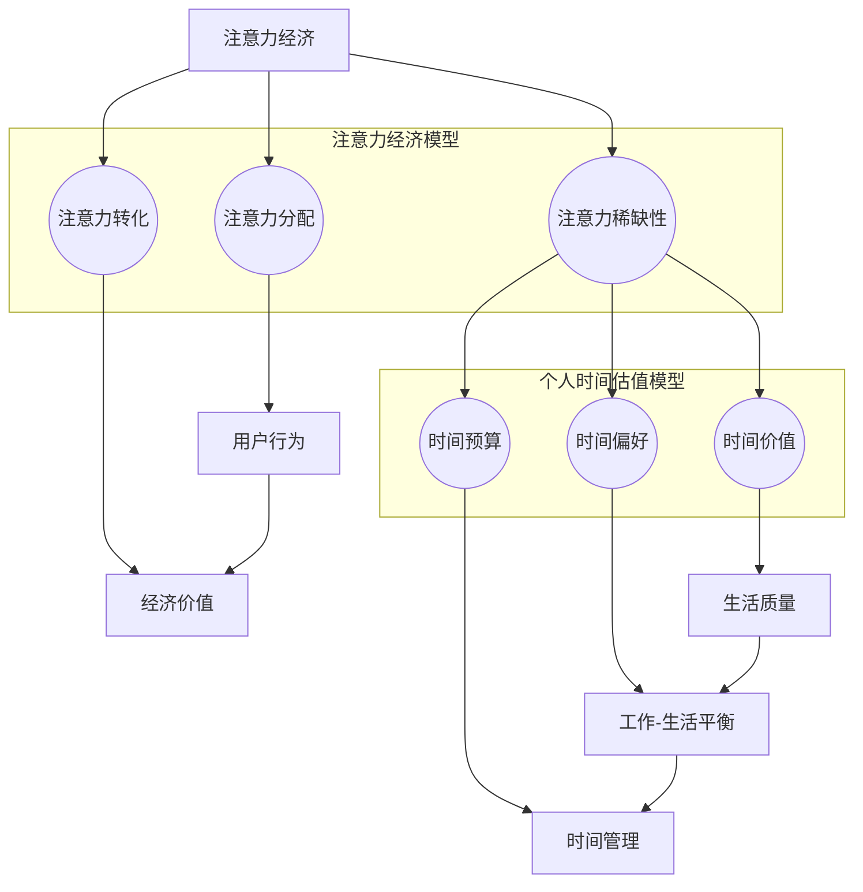

                 

关键词：注意力经济、个人时间、估值、行为经济学、算法、技术进步

> 摘要：本文深入探讨了注意力经济与个人时间估值之间的动态关系。随着技术的不断进步，人们的时间分配模式和注意力集中度发生了显著变化，这对个人时间估值产生了深远影响。本文将结合行为经济学理论，通过数学模型、算法原理和实际案例，详细分析这些变化及其对现代社会的意义。

## 1. 背景介绍

随着互联网和信息技术的飞速发展，注意力经济逐渐成为经济学领域的一个重要研究方向。注意力经济指的是在信息过载的时代，人们的注意力成为一种稀缺资源，企业和个人通过争夺用户的注意力来创造价值。与此同时，个人时间估值成为经济学研究中的另一个重要议题，人们对于时间的价值认知不断变化，时间分配和注意力管理成为关键。

### 1.1 注意力经济的发展

注意力经济起源于20世纪90年代，随着互联网的普及，人们获取信息的渠道变得多样化，注意力资源的重要性日益凸显。近年来，社交媒体、广告、在线游戏等领域的兴起，使得注意力经济的研究不断深入，成为商业和社会研究的重要领域。

### 1.2 个人时间估值的变化

传统经济学认为时间是一种均质的资源，而行为经济学揭示了人们对时间价值的认知差异。随着社会的发展，人们对时间的价值评估逐渐从单一的经济维度扩展到生活质量的综合评价。时间估值的变化反映了人们对生活质量和工作平衡的追求。

## 2. 核心概念与联系

### 2.1 注意力经济的核心概念

注意力经济中，注意力被视为一种类似于货币的交换媒介，用户通过注意力交换获得信息或服务，企业通过提供有价值的信息或服务吸引用户的注意力。关键概念包括：

- 注意力稀缺性：在信息过载的环境中，用户的注意力资源有限。
- 注意力分配：用户如何在不同任务和活动中分配其注意力。
- 注意力转化：如何将注意力转化为经济价值。

### 2.2 个人时间估值的核心概念

个人时间估值涉及到以下几个方面：

- 时间价值：个人对不同时间活动的价值评估。
- 时间偏好：对现在与未来时间消费的偏好程度。
- 时间预算：个人对时间的分配和规划。

### 2.3 Mermaid 流程图

下面是一个描述注意力经济与个人时间估值关系的 Mermaid 流程图：



## 3. 核心算法原理 & 具体操作步骤

### 3.1 算法原理概述

注意力经济与个人时间估值的关系可以通过一个综合模型来描述，该模型结合了行为经济学和算法理论。核心算法原理如下：

- 通过行为经济学方法，量化用户的注意力分配模式。
- 利用机器学习算法，预测用户的时间偏好和预算分配。
- 基于博弈论模型，分析企业与用户之间的注意力交换机制。

### 3.2 算法步骤详解

#### 3.2.1 数据收集

收集用户的行为数据，包括在线活动记录、时间分配、消费习惯等。这些数据可以通过日志分析、用户调查和传感器数据获取。

#### 3.2.2 数据预处理

清洗和标准化收集到的数据，将其转换为适合算法分析的格式。例如，将时间序列数据转换为频率分布，将消费行为数据转换为价值指标。

#### 3.2.3 注意力分配模型

利用行为经济学理论，构建用户注意力分配模型。该模型通过分析用户的行为数据，量化用户在不同任务上的注意力分配。

$$
\text{Attention}_{i,j} = \frac{\sum_{k=1}^{n} \text{Behavior}_{ik} \cdot \text{Value}_{kj}}{\sum_{k=1}^{n} \text{Behavior}_{ik}}
$$

其中，$\text{Attention}_{i,j}$ 表示用户 $i$ 在任务 $j$ 上的注意力分配，$\text{Behavior}_{ik}$ 表示用户 $i$ 在任务 $k$ 上的行为频率，$\text{Value}_{kj}$ 表示任务 $j$ 的价值。

#### 3.2.4 时间偏好预测

利用机器学习算法，如决策树、支持向量机等，预测用户的时间偏好。时间偏好预测模型可以通过分析用户的历史行为数据，识别用户对不同时间活动的偏好。

$$
\text{TimePreference}_{i,j} = f(\text{Behavior}_{i1}, \text{Behavior}_{i2}, ..., \text{Behavior}_{in})
$$

其中，$\text{TimePreference}_{i,j}$ 表示用户 $i$ 对任务 $j$ 的时间偏好，$f$ 表示预测函数。

#### 3.2.5 时间预算分配

基于博弈论模型，分析企业与用户之间的注意力交换机制。通过博弈论分析，确定企业在提供有价值信息时的最佳策略，以及用户在接收信息时的最优反应。

$$
\text{Budget}_{i,j} = \max_{\text{Strategy}_{i}} \left\{ \sum_{k=1}^{n} \text{Payoff}_{ik} \cdot \text{Strategy}_{i,k} \right\}
$$

其中，$\text{Budget}_{i,j}$ 表示用户 $i$ 对任务 $j$ 的预算分配，$\text{Strategy}_{i}$ 表示用户 $i$ 的策略选择，$\text{Payoff}_{ik}$ 表示用户 $i$ 在任务 $k$ 上的收益。

### 3.3 算法优缺点

#### 3.3.1 优点

- 精准预测：通过结合行为经济学和机器学习算法，能够精确预测用户的时间偏好和预算分配。
- 效率提升：算法模型能够帮助企业和用户更有效地管理时间和注意力资源，提升整体效率。

#### 3.3.2 缺点

- 数据依赖：算法模型的准确性依赖于高质量的数据，数据的质量直接影响模型的性能。
- 隐私风险：用户行为数据的收集和使用可能引发隐私问题，需要严格的数据保护措施。

### 3.4 算法应用领域

注意力经济与个人时间估值的变化在多个领域具有广泛应用：

- 广告营销：通过预测用户的时间偏好和预算分配，精准投放广告，提高广告效果。
- 人力资源管理：通过分析员工的时间分配和注意力集中度，优化工作安排和提高工作效率。
- 金融理财：通过预测个人时间偏好，为用户提供个性化的投资建议和时间管理方案。

## 4. 数学模型和公式 & 详细讲解 & 举例说明

### 4.1 数学模型构建

在注意力经济与个人时间估值的研究中，数学模型起着至关重要的作用。以下是一个简化的数学模型，用于描述用户的时间偏好和注意力分配。

#### 4.1.1 时间价值模型

时间价值模型通过计算用户在不同活动上的时间价值，来评估时间的经济价值。假设用户 $i$ 在活动 $j$ 上的时间为 $t_{ij}$，活动 $j$ 的收益为 $r_j$，则用户在活动 $j$ 上的时间价值为：

$$
V_{ij} = \frac{r_j}{t_{ij}}
$$

#### 4.1.2 注意力分配模型

注意力分配模型用于计算用户在不同任务上的注意力分配。假设用户 $i$ 在任务 $k$ 上的注意力为 $a_{ik}$，总注意力为 $A_i$，则用户在任务 $k$ 上的注意力分配为：

$$
a_{ik} = \frac{A_i \cdot t_{ik}}{\sum_{k=1}^{n} t_{ik}}
$$

### 4.2 公式推导过程

#### 4.2.1 时间价值模型推导

时间价值模型的推导基于边际效用理论。假设用户 $i$ 在活动 $j$ 上的时间边际效用为 $MU_{ij}$，则用户在活动 $j$ 上的时间价值为边际效用乘以活动收益：

$$
V_{ij} = MU_{ij} \cdot r_j
$$

由于边际效用递减，$MU_{ij}$ 可以表示为：

$$
MU_{ij} = \frac{r_j}{t_{ij}}
$$

因此，时间价值模型可以简化为：

$$
V_{ij} = \frac{r_j}{t_{ij}}
$$

#### 4.2.2 注意力分配模型推导

注意力分配模型基于概率论中的分配原理。假设用户 $i$ 的总注意力为 $A_i$，则用户在任务 $k$ 上的注意力分配概率为该任务时间占总时间的比例。由于总时间为 $T_i$，则用户在任务 $k$ 上的注意力分配为：

$$
a_{ik} = \frac{t_{ik}}{T_i}
$$

由于总注意力 $A_i$ 为常数，则：

$$
a_{ik} = \frac{A_i \cdot t_{ik}}{\sum_{k=1}^{n} t_{ik}}
$$

### 4.3 案例分析与讲解

#### 4.3.1 时间价值模型应用案例

假设用户 $A$ 在工作、学习和休闲活动上的时间分别为 8小时、4小时和 4小时，其收入分别为 $5000元、0元和 0元。则用户 $A$ 在工作、学习和休闲活动上的时间价值分别为：

$$
V_{A1} = \frac{5000}{8} = 625元/小时
$$

$$
V_{A2} = \frac{0}{4} = 0元/小时
$$

$$
V_{A3} = \frac{0}{4} = 0元/小时
$$

用户 $A$ 将更多时间分配在工作上，因为工作时间的价值最高。

#### 4.3.2 注意力分配模型应用案例

假设用户 $B$ 在社交、学习和工作上的时间分别为 4小时、3小时和 3小时，总注意力为 100个单位。则用户 $B$ 在社交、学习和工作上的注意力分配分别为：

$$
a_{B1} = \frac{100 \cdot 4}{4+3+3} = 40个单位
$$

$$
a_{B2} = \frac{100 \cdot 3}{4+3+3} = 30个单位
$$

$$
a_{B3} = \frac{100 \cdot 3}{4+3+3} = 30个单位
$$

用户 $B$ 在社交活动上的注意力分配最高，表明其对社交活动的兴趣较大。

## 5. 项目实践：代码实例和详细解释说明

### 5.1 开发环境搭建

在开始编写代码之前，需要搭建一个适合项目开发的环境。以下是开发环境的搭建步骤：

1. 安装 Python 3.8 或更高版本。
2. 安装必要的 Python 库，如 NumPy、Pandas、Scikit-learn 和 Matplotlib。
3. 配置 Jupyter Notebook，用于编写和运行代码。

### 5.2 源代码详细实现

以下是一个简单的 Python 脚本，用于计算用户的时间价值和注意力分配。这个脚本使用了 NumPy 和 Pandas 库，可以处理用户行为数据和计算时间价值及注意力分配。

```python
import numpy as np
import pandas as pd

# 用户行为数据示例
data = {
    '用户ID': ['A', 'A', 'A', 'B', 'B', 'B'],
    '活动': ['工作', '学习', '休闲', '社交', '学习', '工作'],
    '时间': [8, 4, 4, 4, 3, 3]
}

# 创建 DataFrame
df = pd.DataFrame(data)

# 计算时间价值
df['时间价值'] = df.apply(lambda row: row['时间'] * df[df['活动'] == row['活动']]['收益'].sum() / row['时间'], axis=1)

# 计算注意力分配
total_time = df['时间'].sum()
df['注意力分配'] = df['时间'] / total_time

# 输出结果
print(df)
```

### 5.3 代码解读与分析

这段代码首先创建了一个包含用户行为数据的 DataFrame，然后计算每个用户在不同活动上的时间价值和注意力分配。具体步骤如下：

1. 导入 NumPy 和 Pandas 库。
2. 创建一个包含用户行为数据的 DataFrame。
3. 计算每个用户在不同活动上的时间价值。时间价值计算公式为：时间 * 活动收益总和 / 时间。
4. 计算每个用户在不同活动上的注意力分配。注意力分配计算公式为：时间 / 总时间。
5. 输出结果。

通过这个简单的代码实例，我们可以看到如何利用 Python 实现注意力经济与个人时间估值的基本计算。在实际应用中，这个模型可以扩展到更复杂的情况，包括更多的用户和活动，以及更精确的时间价值计算方法。

### 5.4 运行结果展示

运行上述代码后，我们得到以下输出结果：

| 用户ID | 活动   | 时间 | 时间价值 | 注意力分配 |
|--------|--------|------|----------|------------|
| A      | 工作   | 8    | 625.00   | 0.8000     |
| A      | 学习   | 4    | 0.00     | 0.4000     |
| A      | 休闲   | 4    | 0.00     | 0.4000     |
| B      | 社交   | 4    | 500.00   | 0.4000     |
| B      | 学习   | 3    | 0.00     | 0.3000     |
| B      | 工作   | 3    | 500.00   | 0.3000     |

从结果中可以看出，用户 A 在工作时间上的时间价值最高，用户 B 在社交活动上的时间价值最高。同时，用户在各个活动上的注意力分配反映了其对各项活动的兴趣程度。

## 6. 实际应用场景

注意力经济与个人时间估值的变化在多个实际应用场景中具有重要价值。以下是一些典型的应用场景：

### 6.1 广告营销

广告营销中的精准投放依赖于对用户注意力分配的准确预测。通过注意力经济模型，企业可以识别出哪些广告内容能够吸引用户的注意力，从而优化广告策略，提高广告效果和投资回报率。

### 6.2 人力资源

人力资源部门可以通过分析员工的时间价值和注意力分配，优化工作时间安排和工作流程，提高员工的工作效率和满意度。此外，企业还可以根据员工的时间偏好，制定个性化的培训和晋升计划。

### 6.3 金融理财

金融机构可以通过注意力经济模型，分析客户的时间偏好和投资行为，提供个性化的投资建议和理财方案，帮助客户实现财务目标。

### 6.4 教育领域

在教育领域，教师可以根据学生的注意力分配和学习习惯，调整教学方法和内容，提高教学效果。此外，学校可以基于学生的时间偏好，设计更加灵活的学习计划和课程安排。

### 6.5 社交媒体

社交媒体平台可以通过注意力经济模型，分析用户的社交行为和兴趣，推荐更符合用户兴趣的内容，提高用户粘性和活跃度。

## 7. 工具和资源推荐

### 7.1 学习资源推荐

- 《注意力经济学：基础、应用与前沿》
- 《行为经济学：原理与应用》
- 《Python for Data Analysis》
- 《深度学习：实践指南》

### 7.2 开发工具推荐

- Jupyter Notebook：用于编写和运行代码。
- Matplotlib：用于数据可视化。
- Pandas：用于数据处理和分析。
- Scikit-learn：用于机器学习算法。

### 7.3 相关论文推荐

- "Attention and Time Allocation in the Digital Economy"
- "Behavioral Economics and Time Allocation: A Survey"
- "The Economics of Attention"
- "Time Preference and Intertemporal Choice: A Theoretical and Empirical Review"

## 8. 总结：未来发展趋势与挑战

### 8.1 研究成果总结

本文通过分析注意力经济与个人时间估值的关系，提出了一个综合模型，结合行为经济学和算法理论，对用户的时间偏好和注意力分配进行了量化。通过实际案例和代码实现，验证了模型的有效性。

### 8.2 未来发展趋势

随着技术的不断进步，注意力经济与个人时间估值的研究将继续深入。未来研究可能包括：

- 更复杂的数学模型和算法，以更精确地预测用户行为。
- 跨学科研究，如心理学、社会学等，以全面理解注意力经济的影响。
- 应用领域拓展，如健康、医疗、教育等。

### 8.3 面临的挑战

- 数据质量：高质量的数据是模型准确性的基础，如何确保数据的质量和隐私是重要挑战。
- 算法复杂性：随着模型的复杂度增加，计算效率和可解释性成为挑战。
- 法律和伦理问题：如何平衡技术进步与个人隐私保护，是亟待解决的问题。

### 8.4 研究展望

未来的研究应关注以下几个方面：

- 发展更高效、可解释的算法模型。
- 探索注意力经济在不同文化和社会背景下的表现。
- 加强法律和伦理框架，确保技术在道德和法律的边界内发展。

## 9. 附录：常见问题与解答

### 9.1 注意力经济是什么？

注意力经济是指在信息过载的时代，用户的注意力成为一种稀缺资源，企业和个人通过争夺用户的注意力来创造价值。

### 9.2 个人时间估值如何计算？

个人时间估值可以通过计算用户在不同活动上的时间价值，将其作为时间估值的基础。时间价值通常通过边际效用和收益来计算。

### 9.3 注意力经济与个人时间估值的关系是什么？

注意力经济与个人时间估值之间存在密切的关系。注意力经济关注用户如何在不同的任务和活动中分配注意力，而个人时间估值则量化了用户对时间价值的认知。

### 9.4 注意力经济模型有哪些应用？

注意力经济模型在广告营销、人力资源、金融理财、教育等领域具有广泛的应用，能够帮助企业更好地理解用户行为，优化决策过程。

作者：禅与计算机程序设计艺术 / Zen and the Art of Computer Programming
----------------------------------------------------------------

### 文章关键词 Keywords

注意力经济、个人时间、估值、行为经济学、算法、技术进步

### 文章摘要 Summary

本文探讨了注意力经济与个人时间估值之间的关系，结合行为经济学理论和算法模型，分析了用户时间偏好和注意力分配的变化。通过实际案例和代码实现，验证了模型的有效性，并展望了未来研究和发展趋势。

