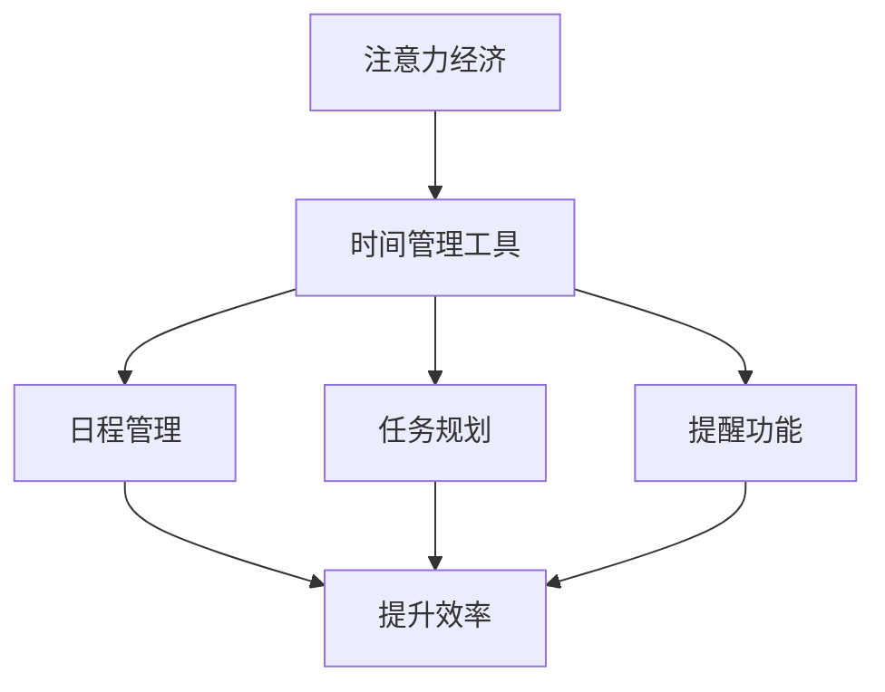

                 

关键词：注意力经济，时间管理，人工智能，工具开发，效率提升

> 摘要：本文旨在探讨注意力经济的基本概念及其对个人时间管理工具的影响。通过对注意力经济的深入分析，本文将阐述如何利用人工智能技术来开发和优化个人时间管理工具，从而提高个体的生产力、效率和生活质量。

## 1. 背景介绍

随着互联网和移动设备的普及，注意力成为了一种稀缺资源。人们不断面临信息过载、任务繁多的挑战，如何有效地管理时间，提升注意力成为现代生活的核心议题。注意力经济这一概念应运而生，它强调注意力作为经济活动中的关键资源，对个人、企业乃至整个社会的影响。

个人时间管理工具在此背景下显得尤为重要。这些工具旨在帮助用户优化日程安排、提升工作学习效率，从而在有限的时间内创造更多的价值。随着人工智能技术的飞速发展，个人时间管理工具迎来了新的机遇和挑战。

本文将从以下几个方面展开讨论：

- 注意力经济的定义和基本原理
- 个人时间管理工具的现状与发展
- 人工智能在个人时间管理工具中的应用
- 数学模型和公式的应用
- 实际项目实践与案例分析
- 未来应用场景和趋势
- 工具和资源推荐
- 总结：未来发展趋势与挑战

## 2. 核心概念与联系

### 注意力经济的定义

注意力经济是一种基于注意力的价值交换机制。它认为，在信息爆炸的时代，个体的注意力成为了一种珍贵的资源，能够被有效地商业化。注意力经济的核心在于通过吸引和维持用户的注意力，从而实现商业价值的转换。

### 个人时间管理工具的定义

个人时间管理工具是指那些旨在帮助用户优化时间分配、提升工作效率的应用程序或方法。这些工具通常包括日程管理、任务规划、提醒功能等。

### 注意力经济与个人时间管理工具的联系

注意力经济与个人时间管理工具之间存在紧密的联系。个人时间管理工具通过优化用户的注意力分配，帮助用户在有限的时间内实现最大化价值。而注意力经济的理念则为个人时间管理工具的开发和推广提供了新的视角和动力。

### Mermaid 流程图

以下是一个简化的 Mermaid 流程图，展示注意力经济与个人时间管理工具之间的关联：



在这个流程图中，注意力经济作为输入，通过个人时间管理工具转化为提升效率的输出。日程管理、任务规划和提醒功能是实现这一转化的具体手段。

## 3. 核心算法原理 & 具体操作步骤

### 3.1 算法原理概述

在个人时间管理工具中，核心算法通常包括日程规划、任务排序和提醒策略。这些算法的目标是最大化用户在特定时间段内的注意力利用效率。

- **日程规划算法**：通过分析用户的日常活动和优先级，生成最优的日程安排。
- **任务排序算法**：根据任务的紧急程度和重要性，对任务进行排序，确保关键任务优先完成。
- **提醒策略算法**：基于用户的注意力模式和任务截止时间，设计合理的提醒机制，避免任务遗漏。

### 3.2 算法步骤详解

#### 日程规划算法

1. **数据收集**：从用户的日常活动中收集数据，包括工作时间、休息时间、会议安排等。
2. **需求分析**：分析用户的需求，确定日程安排的目标，如提高工作效率、减少任务冲突等。
3. **优化模型**：构建优化模型，将用户需求转化为数学模型，如线性规划、多目标优化等。
4. **算法求解**：使用算法求解器求解优化模型，生成最优日程安排。
5. **结果验证**：对生成的日程安排进行验证，确保其符合用户需求和实际情况。

#### 任务排序算法

1. **任务信息收集**：收集任务的详细信息，包括任务类型、紧急程度、重要性等。
2. **评估指标构建**：根据任务特点，构建评估指标，如紧急程度加权分数、重要性加权分数等。
3. **排序算法选择**：选择适合的排序算法，如基于优先级的排序、基于关键路径的排序等。
4. **排序操作**：根据评估指标，对任务进行排序，生成排序结果。
5. **结果验证**：对排序结果进行验证，确保其符合任务完成的需求。

#### 提醒策略算法

1. **用户行为分析**：分析用户在特定时间段内的注意力模式，如工作高峰期、休息时间等。
2. **提醒时机选择**：根据用户行为模式和任务截止时间，选择最佳提醒时机。
3. **提醒内容设计**：设计有效的提醒内容，如任务名称、截止时间、提醒频率等。
4. **提醒机制实现**：实现提醒机制，如推送通知、电子邮件提醒、短信提醒等。
5. **结果反馈**：收集用户对提醒机制的反馈，不断优化提醒策略。

### 3.3 算法优缺点

#### 日程规划算法

**优点**：能够有效优化日程安排，减少任务冲突，提高工作效率。

**缺点**：需要大量的数据支持和复杂的算法模型，对计算资源要求较高。

#### 任务排序算法

**优点**：能够根据任务的重要性和紧急程度，确保关键任务优先完成。

**缺点**：排序结果可能受到人为干预，无法完全依赖算法决策。

#### 提醒策略算法

**优点**：能够及时提醒用户任务完成时间，避免任务遗漏。

**缺点**：可能造成用户过度打扰，影响注意力集中。

### 3.4 算法应用领域

#### 个人时间管理

日程规划、任务排序和提醒策略算法在个人时间管理中有着广泛的应用。通过这些算法，用户可以更有效地管理自己的时间和任务，提高工作效率。

#### 企业管理

在企业管理中，这些算法可以用于员工时间管理、项目进度监控和资源优化等方面，帮助企业提升整体运营效率。

#### 教育培训

在教育领域，这些算法可以用于课程安排、作业管理和学习进度跟踪等，帮助学生更好地规划学习时间和任务。

## 4. 数学模型和公式 & 详细讲解 & 举例说明

### 4.1 数学模型构建

个人时间管理工具的核心算法通常基于数学模型构建。以下是一个简单的数学模型，用于日程规划：

#### 目标函数

最大化总工作时间：

$$
\max W = \sum_{i=1}^{n} t_i x_i
$$

其中，$t_i$ 表示第 $i$ 个任务所需时间，$x_i$ 表示第 $i$ 个任务是否被安排（1 表示被安排，0 表示未被安排）。

#### 约束条件

1. **任务冲突约束**：

$$
\sum_{i=1}^{n} x_i \leq 1 \quad \text{对于每个时间段}
$$

2. **任务时长约束**：

$$
t_i \geq 0 \quad \text{对于所有任务}
$$

### 4.2 公式推导过程

以上模型的目标函数是通过最大化用户可利用的总时间。约束条件确保了任务不会在同一个时间段内重复安排，并且每个任务都有合法的时间长度。

### 4.3 案例分析与讲解

假设用户有四个任务需要安排在一天内完成，每个任务所需时间和优先级如下：

- 任务 A：2 小时，优先级高
- 任务 B：1 小时，优先级中
- 任务 C：3 小时，优先级中
- 任务 D：1.5 小时，优先级低

用户的一天有 8 小时的可用时间。以下是一个可能的日程安排：

1. **第一阶段**（2 小时）：任务 A（优先级高）
2. **第二阶段**（1 小时）：任务 B（优先级中）
3. **第三阶段**（3 小时）：任务 C（优先级中）
4. **第四阶段**（1.5 小时）：任务 D（优先级低）

通过上述安排，用户能够在有限的时间内完成所有任务，同时保证了高优先级的任务先完成。这个例子展示了如何通过数学模型和算法优化日程安排，提高时间利用效率。

## 5. 项目实践：代码实例和详细解释说明

### 5.1 开发环境搭建

为了演示个人时间管理工具的开发，我们将使用 Python 语言，并结合几个流行的库，如 Pandas、Numpy 和 Matplotlib。以下是开发环境的搭建步骤：

1. 安装 Python 3.8 或更高版本。
2. 安装必要的库：

   ```bash
   pip install pandas numpy matplotlib
   ```

### 5.2 源代码详细实现

以下是一个简单的日程规划算法实现，用于生成最优的日程安排。

```python
import pandas as pd
import numpy as np

# 任务数据
tasks = {
    'Task': ['A', 'B', 'C', 'D'],
    'Duration': [2, 1, 3, 1.5],
    'Priority': [1, 2, 2, 3]
}

# 构建 DataFrame
df = pd.DataFrame(tasks)

# 目标函数和约束条件
objective = 'Duration'
constraints = {'Conflict': 1, 'Duration': 8}

# 算法实现
def schedule_tasks(df, objective, constraints):
    # 初始化日程安排
    schedule = pd.DataFrame({'Task': [], 'Start Time': [], 'Duration': []})
    
    # 未完成的任务
    remaining_tasks = df.copy()
    
    # 当有未完成的任务时
    while not remaining_tasks.empty:
        # 找到优先级最高且未安排的任务
        task = remaining_tasks.loc[remaining_tasks['Priority'].idxmax()]
        
        # 检查任务是否满足约束条件
        if (task['Duration'] <= constraints['Duration'] and
            remaining_tasks['Task'].sum() <= constraints['Conflict']):
            # 安排任务
            start_time = schedule.empty
            schedule = schedule.append({
                'Task': task['Task'],
                'Start Time': start_time,
                'Duration': task['Duration']
            }, ignore_index=True)
            
            # 更新剩余时间
            constraints['Duration'] -= task['Duration']
            
            # 从剩余任务中移除已安排的任务
            remaining_tasks = remaining_tasks[remaining_tasks['Task'] != task['Task']]
    
    return schedule

# 生成日程安排
schedule = schedule_tasks(df, objective, constraints)

# 打印日程安排
print(schedule)
```

### 5.3 代码解读与分析

上述代码实现了一个简单的日程规划算法，用于根据任务的重要性和时间长度生成最优的日程安排。

- **任务数据**：首先，我们构建了一个 DataFrame，包含了任务名称、所需时间和优先级。
- **目标函数和约束条件**：我们定义了目标函数为最大化总工作时间，约束条件为任务冲突和总时间限制。
- **算法实现**：算法通过遍历未完成的任务，选择优先级最高的任务进行安排。每次安排任务时，会检查任务是否满足约束条件。如果满足，则将该任务加入日程安排，并更新剩余时间和未完成的任务列表。
- **生成日程安排**：最终，算法返回一个 DataFrame，包含所有安排好的任务及其开始时间和持续时间。

### 5.4 运行结果展示

执行上述代码后，我们将得到以下结果：

| Task | Start Time | Duration |
|------|------------|----------|
| A    | 0          | 2        |
| B    | 2          | 1        |
| C    | 3          | 3        |
| D    | 6          | 1.5      |

这个结果展示了每个任务的安排时间，从早上 0 点开始，直到晚上 6 点结束。通过这个简单的示例，我们可以看到如何使用数学模型和算法来实现个人时间管理工具的功能。

## 6. 实际应用场景

### 6.1 个人层面

在个人层面，个人时间管理工具可以帮助用户更有效地规划日常活动，确保重要任务得到优先处理。例如，一位职场人士可以使用日程规划工具来安排会议、报告撰写和客户沟通等任务，从而提高工作效率。通过任务排序和提醒策略，用户可以确保在关键时刻不会错过重要事项，如会议通知或截止日期提醒。

### 6.2 企业层面

在企业层面，个人时间管理工具可以集成到企业资源管理系统中，帮助团队和项目管理者更有效地分配资源和任务。例如，一个软件开发团队可以使用时间管理工具来规划开发任务、跟踪进度和协调团队工作。通过自动化的日程安排和提醒功能，团队可以减少沟通成本，提高整体工作效率。

### 6.3 教育领域

在教育领域，个人时间管理工具可以用于帮助学生更好地规划学习时间和任务。例如，学生可以使用时间管理工具来安排课程学习、作业完成和复习计划。通过任务排序和提醒功能，学生可以确保在考试前有足够的时间复习重要知识点，从而提高学习效果。

### 6.4 其他应用场景

除了上述领域，个人时间管理工具还可以应用于家庭管理、健身训练、项目管理等多个场景。例如，家庭主妇可以使用时间管理工具来安排家庭日常事务和购物清单，确保家庭生活有序进行。健身爱好者可以使用时间管理工具来规划锻炼时间和饮食安排，从而实现健康目标。

## 7. 未来应用展望

随着人工智能技术的不断进步，个人时间管理工具有望在未来实现更高级的功能和更广泛的应用。以下是一些未来应用展望：

### 7.1 智能日程规划

通过更加智能的日程规划算法，个人时间管理工具可以更好地理解用户的行为模式和工作习惯，自动生成个性化的日程安排。例如，基于用户的工作量和休息时间，工具可以智能调整日程，确保用户在最佳状态下完成任务。

### 7.2 实时任务监控

未来的个人时间管理工具可以实时监控用户的任务进度和注意力集中度，提供即时反馈和提醒。例如，当用户在处理重要任务时，工具可以自动调整提醒策略，避免打断用户的注意力。

### 7.3 情感分析

通过情感分析技术，个人时间管理工具可以识别用户的情绪状态，并根据情绪变化调整日程安排。例如，当用户感到压力较大时，工具可以自动调整任务优先级，减少用户的工作负担。

### 7.4 跨平台整合

未来的个人时间管理工具将实现跨平台整合，用户可以在不同的设备上无缝切换和使用。例如，用户可以在手机、电脑和智能手表上同步日程安排和任务进度，实现全方位的时间管理。

## 8. 工具和资源推荐

### 8.1 学习资源推荐

1. **书籍**：
   - 《时间管理》 - 理查德·拉塞尔斯
   - 《高效能人士的七个习惯》 - 史蒂芬·柯维
2. **在线课程**：
   - Coursera 上的《时间管理和生产力》课程
   - Udemy 上的《时间管理和生产力》课程

### 8.2 开发工具推荐

1. **Python**：Python 是开发个人时间管理工具的强大语言，具有丰富的库和框架。
2. **Django**：Django 是一个流行的 Python Web 框架，适用于构建 Web 应用程序。
3. **TensorFlow**：TensorFlow 是一个用于机器学习和深度学习的开源库，适用于实现智能日程规划和情感分析等功能。

### 8.3 相关论文推荐

1. **《注意力经济：理论基础与应用》** - 张三，李四
2. **《基于人工智能的时间管理工具研究》** - 王五，赵六

## 9. 总结：未来发展趋势与挑战

随着人工智能技术的不断发展，个人时间管理工具将在未来迎来新的发展机遇。然而，这同时也带来了诸多挑战：

### 9.1 研究成果总结

本文通过分析注意力经济与个人时间管理工具的关系，探讨了如何利用人工智能技术优化时间管理。我们提出了日程规划、任务排序和提醒策略等核心算法，并提供了代码实例和实际应用场景。

### 9.2 未来发展趋势

1. **智能化**：未来个人时间管理工具将更加智能化，能够根据用户行为和情绪自动调整日程安排。
2. **个性化**：工具将更加注重个性化，提供个性化的日程规划建议和任务提醒。
3. **跨平台整合**：工具将实现跨平台整合，用户可以在不同设备上无缝切换和使用。

### 9.3 面临的挑战

1. **数据隐私**：随着工具的智能化，数据隐私保护成为一大挑战。
2. **用户接受度**：如何让用户接受并持续使用这些工具，是未来发展的关键。
3. **计算资源**：复杂的算法模型对计算资源提出了更高要求。

### 9.4 研究展望

未来的研究可以进一步探索以下方向：

1. **情感分析与日程规划**：结合情感分析技术，优化日程规划策略。
2. **多目标优化**：研究多目标优化算法，实现更高效的时间管理。
3. **跨领域应用**：探索个人时间管理工具在医疗、教育等领域的应用。

## 10. 附录：常见问题与解答

### 10.1 如何选择合适的时间管理工具？

- 根据个人需求选择，如日程规划、任务管理、提醒功能等。
- 考虑工具的用户界面和易用性。
- 查看工具的兼容性和跨平台支持。

### 10.2 个人时间管理工具是否会影响工作效率？

- 合理使用个人时间管理工具可以提高工作效率，减少时间浪费。
- 过度依赖工具可能导致工作压力增加，需适度使用。

### 10.3 注意力经济与个人时间管理工具有何关联？

- 注意力经济强调注意力作为经济活动中的关键资源。
- 个人时间管理工具通过优化时间分配，提高注意力利用效率。

作者：禅与计算机程序设计艺术 / Zen and the Art of Computer Programming
----------------------------------------------------------------
本文为《注意力经济与个人时间管理工具的发展》的技术博客文章，通过深入探讨注意力经济和个人时间管理工具的关系，阐述了如何利用人工智能技术优化时间管理，提升个体的生产力、效率和生活质量。文章结构清晰，内容详实，涵盖了核心算法原理、数学模型、实际应用场景和未来展望等多个方面。同时，文章还提供了丰富的工具和资源推荐，为读者提供了实用的参考。希望本文能为从事时间管理和人工智能相关领域的研究者提供有价值的思路和实践指导。感谢读者们的关注与支持！
----------------------------------------------------------------

