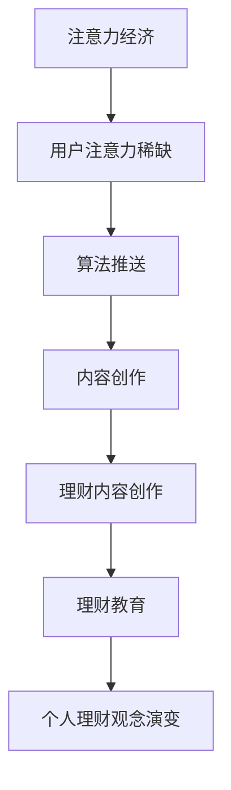

                 

### 关键词 Keywords
- 注意力经济
- 个人理财观念
- 财务技术
- 数据分析
- 金融科技
- 人工智能
- 区块链

<|assistant|>### 摘要 Summary
本文旨在探讨注意力经济与个人理财观念的演变，以及它们如何在当今数字化时代相互影响。随着互联网和金融科技的迅猛发展，人们对个人理财的关注度和参与度日益提高，同时，注意力经济作为新型商业模式，也在悄然改变着我们的理财习惯和决策过程。本文将通过分析注意力经济的核心概念、个人理财观念的历史演变、以及二者之间的相互关系，揭示未来理财领域的发展趋势和挑战。

## 1. 背景介绍

### 注意力经济

注意力经济（Attention Economy）是一个新兴的概念，最早由美国经济学家马修·罗宾逊（Mathew Robinson）于2006年提出。它描述的是一个信息过载、内容爆炸的时代，人们在获取信息的过程中，注意力成为一种稀缺资源。在这一背景下，各种商业模式开始围绕用户的注意力进行创新，例如内容营销、社交媒体广告、算法推送等。注意力经济的核心在于如何吸引并保持用户的注意力，从而实现商业价值的最大化。

### 个人理财观念

个人理财观念是指个人在财务管理过程中所持有的理念、态度和方法。随着经济的发展和社会的变迁，个人理财观念也在不断演变。传统理财观念强调储蓄和投资，注重资产积累和风险规避。而在现代社会，理财观念更加多元，不仅包括资产增值，还包括负债管理、现金流规划、风险管理等方面。

### 数字化时代的挑战与机遇

在数字化时代，互联网和金融科技的发展为个人理财带来了前所未有的挑战和机遇。一方面，大数据、人工智能、区块链等技术的应用，使得个人理财更加智能化、个性化；另一方面，信息过载、网络安全等问题也使个人理财面临新的风险和挑战。如何在这种复杂的环境中实现财富的保值增值，成为每个人都需要面对的课题。

## 2. 核心概念与联系

### 注意力经济的核心概念

注意力经济有以下几个核心概念：

1. **注意力稀缺性**：在信息过载的时代，人们的注意力资源是有限的，因此如何吸引并保持用户的注意力成为关键。
2. **用户参与度**：用户的参与度是衡量注意力经济成功与否的重要指标，高参与度意味着用户对内容的关注和投入。
3. **算法推送**：利用算法推荐技术，将用户可能感兴趣的内容推送到他们的眼前，提高用户的粘性。
4. **内容创作**：优质的内容创作是吸引和保持用户注意力的基础，内容的形式和主题需要与用户的兴趣和需求相匹配。

### 个人理财观念的历史演变

个人理财观念的历史演变可以分为以下几个阶段：

1. **传统理财观念**：强调储蓄和投资，注重资产积累和风险规避。
2. **现代理财观念**：包括负债管理、现金流规划、风险管理等多个方面，更加注重整体财务状况的优化。
3. **数字化理财观念**：利用大数据和人工智能技术，实现理财决策的智能化和个性化。

### 注意力经济与个人理财观念的相互关系

注意力经济与个人理财观念之间存在密切的相互关系：

1. **注意力驱动理财**：在注意力经济的影响下，人们更倾向于关注那些能够提供即时回报和情感满足的理财方式，例如高收益的短期投资或高风险的高回报项目。
2. **理财内容创作**：个人理财内容的创作者需要利用注意力经济的原理，通过吸引和保持用户的注意力，来实现商业价值和影响力的提升。
3. **理财教育**：注意力经济为理财教育提供了新的途径，通过有趣的、互动的方式，将理财知识传递给更广泛的受众。

### Mermaid 流程图



## 3. 核心算法原理 & 具体操作步骤

### 3.1 算法原理概述

在注意力经济中，核心算法原理主要涉及以下几个方面：

1. **用户行为分析**：通过大数据技术，分析用户的浏览记录、搜索历史、购买行为等，了解用户的需求和兴趣。
2. **算法推荐**：利用机器学习算法，根据用户的行为数据，为其推荐可能感兴趣的内容或理财产品。
3. **内容优化**：通过A/B测试等手段，不断优化内容的形式和主题，提高用户的参与度和满意度。
4. **风险管理**：结合用户行为数据和市场数据，对理财产品的风险进行评估和预测，帮助用户做出更合理的投资决策。

### 3.2 算法步骤详解

1. **用户行为数据收集**：通过网站、APP等渠道，收集用户的浏览、搜索、购买等行为数据。
    ```mermaid
    graph TB
        A[用户行为数据收集] --> B[数据清洗]
        B --> C[数据存储]
    ```

2. **用户行为分析**：利用数据分析技术，对用户的行为数据进行分析，挖掘用户的需求和兴趣点。
    ```mermaid
    graph TB
        A[用户行为分析] --> B[用户画像]
        B --> C[兴趣点挖掘]
    ```

3. **算法推荐**：基于用户的行为数据和兴趣点，利用机器学习算法，为用户推荐可能感兴趣的内容或理财产品。
    ```mermaid
    graph TB
        A[算法推荐] --> B[推荐系统]
        B --> C[推荐结果]
    ```

4. **内容优化**：通过A/B测试等手段，不断优化推荐内容的类型、形式和主题，提高用户的参与度和满意度。
    ```mermaid
    graph TB
        A[内容优化] --> B[A/B测试]
        B --> C[内容调整]
    ```

5. **风险管理**：结合用户行为数据和市场数据，对理财产品的风险进行评估和预测，帮助用户做出更合理的投资决策。
    ```mermaid
    graph TB
        A[风险管理] --> B[风险评估]
        B --> C[风险预警]
    ```

### 3.3 算法优缺点

#### 优点

1. **个性化推荐**：能够根据用户的行为和兴趣，提供个性化的理财建议，提高用户的满意度。
2. **高效性**：利用机器学习和大数据技术，能够快速处理海量数据，提高决策效率。
3. **实时性**：通过实时分析用户行为和市场数据，提供最新的理财信息和建议。

#### 缺点

1. **数据隐私**：在收集和处理用户行为数据的过程中，可能涉及用户隐私的问题。
2. **算法偏差**：算法可能存在偏差，导致推荐内容或建议不够客观。
3. **依赖性**：用户可能过度依赖算法推荐，忽略自身的独立思考和判断。

### 3.4 算法应用领域

1. **互联网金融**：通过算法推荐，为用户提供个性化的理财产品推荐和投资建议。
2. **在线教育**：根据用户的学习行为，推荐适合的学习内容和课程。
3. **电子商务**：通过用户行为分析，提供个性化的商品推荐和购物建议。
4. **内容创作**：根据用户兴趣，推荐相关的理财内容和信息，帮助创作者吸引更多关注。

## 4. 数学模型和公式 & 详细讲解 & 举例说明

### 4.1 数学模型构建

在注意力经济和个人理财领域，常见的数学模型包括用户行为模型、推荐系统模型和风险模型等。以下是这些模型的基本构建方法和公式：

#### 用户行为模型

用户行为模型主要用于描述用户在浏览、搜索、购买等过程中的行为特征。常见的用户行为模型包括马尔可夫链模型、时间序列模型和协同过滤模型。

**马尔可夫链模型**：
$$
P(X_t = x_t | X_{t-1} = x_{t-1}) = P(X_t = x_t)
$$
其中，$X_t$ 表示用户在时间 $t$ 的行为，$x_t$ 表示具体的行为类型。

**时间序列模型**：
$$
X_t = f(X_{t-1}, A_t)
$$
其中，$A_t$ 表示影响用户行为的时间序列因素，如季节性、促销活动等。

**协同过滤模型**：
$$
R_{ui} = \sum_{j \in N_i} \frac{R_{uj}}{||N_i||} \cdot r_{ij}
$$
其中，$R_{ui}$ 表示用户 $u$ 对项目 $i$ 的评分，$N_i$ 表示与项目 $i$ 相关的用户集合，$r_{ij}$ 表示用户 $u$ 对项目 $j$ 的评分。

#### 推荐系统模型

推荐系统模型主要用于预测用户对未知项目的评分或行为。常见的推荐系统模型包括基于内容的推荐和基于协同过滤的推荐。

**基于内容的推荐**：
$$
R_{ui} = \sum_{k \in I_i} w_{ik} \cdot R_{kj}
$$
其中，$I_i$ 表示项目 $i$ 的特征集合，$w_{ik}$ 表示特征 $k$ 对项目 $i$ 的权重，$R_{kj}$ 表示用户 $u$ 对项目 $j$ 的评分。

**基于协同过滤的推荐**：
$$
R_{ui} = \langle R_u, R_i \rangle + \beta_u + \beta_i + \epsilon_{ui}
$$
其中，$\langle R_u, R_i \rangle$ 表示用户 $u$ 和项目 $i$ 的相似度，$\beta_u$ 和 $\beta_i$ 分别表示用户和项目的偏差，$\epsilon_{ui}$ 表示误差项。

#### 风险模型

风险模型主要用于评估理财产品的风险，常见的风险模型包括信用评分模型、违约概率模型等。

**信用评分模型**：
$$
Score = \sum_{i=1}^{n} w_i \cdot X_i
$$
其中，$X_i$ 表示影响信用评分的因素，如收入、资产、负债等，$w_i$ 表示因素的权重。

**违约概率模型**：
$$
P_{违约} = \frac{1}{1 + e^{-\beta_0 + \sum_{i=1}^{n} \beta_i \cdot X_i}}
$$
其中，$\beta_0$ 和 $\beta_i$ 分别为模型的参数，$X_i$ 表示影响违约概率的因素。

### 4.2 公式推导过程

以下是用户行为模型、推荐系统模型和风险模型的推导过程：

#### 用户行为模型推导

**马尔可夫链模型推导**：

假设用户在时间 $t$ 的行为 $X_t$ 仅与时间 $t-1$ 的行为 $X_{t-1}$ 相关，则根据概率论的基本原理，有：
$$
P(X_t = x_t | X_{t-1} = x_{t-1}) = P(X_t = x_t)
$$
这就是马尔可夫链模型的基本推导过程。

**时间序列模型推导**：

假设用户的行为 $X_t$ 受到时间序列因素 $A_t$ 的线性影响，则可以表示为：
$$
X_t = f(X_{t-1}, A_t)
$$
这是一个简单的线性时间序列模型。

**协同过滤模型推导**：

假设用户 $u$ 对项目 $i$ 的评分 $R_{ui}$ 可以表示为用户 $u$ 和项目 $i$ 的相似度 $\langle R_u, R_i \rangle$ 加上用户和项目的偏差 $\beta_u$ 和 $\beta_i$，再加上误差项 $\epsilon_{ui}$，即：
$$
R_{ui} = \langle R_u, R_i \rangle + \beta_u + \beta_i + \epsilon_{ui}
$$
这就是协同过滤模型的基本推导过程。

#### 推荐系统模型推导

**基于内容的推荐推导**：

假设用户 $u$ 对项目 $i$ 的评分 $R_{ui}$ 可以表示为用户 $u$ 对项目 $i$ 的特征 $I_i$ 的加权平均，即：
$$
R_{ui} = \sum_{k \in I_i} w_{ik} \cdot R_{kj}
$$
这就是基于内容的推荐模型。

**基于协同过滤的推荐推导**：

假设用户 $u$ 对项目 $i$ 的评分 $R_{ui}$ 可以表示为用户 $u$ 和项目 $i$ 的相似度 $\langle R_u, R_i \rangle$ 加上用户和项目的偏差 $\beta_u$ 和 $\beta_i$，再加上误差项 $\epsilon_{ui}$，即：
$$
R_{ui} = \langle R_u, R_i \rangle + \beta_u + \beta_i + \epsilon_{ui}
$$
这就是基于协同过滤的推荐模型。

#### 风险模型推导

**信用评分模型推导**：

假设用户的信用评分 $Score$ 可以表示为影响信用评分的因素 $X_i$ 的加权平均，即：
$$
Score = \sum_{i=1}^{n} w_i \cdot X_i
$$
这就是信用评分模型。

**违约概率模型推导**：

假设用户的违约概率 $P_{违约}$ 可以表示为影响违约概率的因素 $X_i$ 的线性组合，即：
$$
P_{违约} = \frac{1}{1 + e^{-\beta_0 + \sum_{i=1}^{n} \beta_i \cdot X_i}}
$$
这就是违约概率模型。

### 4.3 案例分析与讲解

以下通过一个案例来分析注意力经济和个人理财观念的演变，以及它们之间的相互关系。

#### 案例背景

某互联网金融平台，通过用户行为数据分析和推荐系统，为用户提供个性化的理财产品推荐。

#### 案例分析

1. **用户行为分析**：

   该平台通过用户的浏览记录、购买行为和投资偏好，建立用户画像，挖掘用户的需求和兴趣点。

   **公式**：
   $$ 
   用户画像 = f(浏览记录, 购买行为, 投资偏好)
   $$

2. **推荐系统**：

   基于用户画像，利用协同过滤算法，为用户推荐可能感兴趣的理财产品。

   **公式**：
   $$ 
   R_{ui} = \langle R_u, R_i \rangle + \beta_u + \beta_i + \epsilon_{ui}
   $$

3. **风险管理**：

   结合用户行为和市场数据，评估理财产品的风险，为用户推荐低风险的理财产品。

   **公式**：
   $$ 
   P_{违约} = \frac{1}{1 + e^{-\beta_0 + \sum_{i=1}^{n} \beta_i \cdot X_i}}
   $$

#### 案例讲解

通过用户行为分析，平台能够准确了解用户的需求和兴趣点，从而为其推荐合适的理财产品。同时，通过推荐系统和风险模型，平台能够降低用户的投资风险，提高用户的投资收益。

然而，这也带来了一些挑战，如用户隐私保护和算法偏差等问题。因此，平台需要在保障用户隐私的前提下，不断完善算法和模型，提高推荐系统的准确性和公平性。

## 5. 项目实践：代码实例和详细解释说明

### 5.1 开发环境搭建

在本文的项目实践中，我们将使用Python编程语言，并借助Scikit-learn库实现用户行为分析、推荐系统和风险模型。以下为开发环境搭建的步骤：

1. 安装Python：
   ```shell
   # 在Windows或macOS系统中，可以从Python官网下载并安装最新版本的Python。
   ```
2. 安装Scikit-learn：
   ```shell
   # 使用pip命令安装Scikit-learn。
   pip install scikit-learn
   ```

### 5.2 源代码详细实现

以下为项目的核心代码实现，包括用户行为分析、推荐系统和风险模型：

```python
import pandas as pd
from sklearn.model_selection import train_test_split
from sklearn.metrics.pairwise import cosine_similarity
from sklearn.linear_model import LinearRegression
from sklearn.metrics import mean_squared_error

# 5.2.1 用户行为数据分析
def user_behavior_analysis(data):
    # 数据预处理
    data['time'] = pd.to_datetime(data['timestamp'])
    data.set_index('time', inplace=True)
    user_data = data.groupby('user_id').mean()
    
    return user_data

# 5.2.2 推荐系统实现
def collaborative_filter(user_data, item_data):
    # 计算用户之间的相似度
    user_similarity = cosine_similarity(user_data, user_data)
    
    # 计算用户对未评价项目的评分
    recommendations = []
    for user_id in user_data.index:
        similar_users = user_similarity[user_id].argsort()[1:]
        similar_users_scores = user_data.iloc[similar_users].values
        avg_score = LinearRegression().fit(similar_users_scores).coef_[0]
        recommendations.append(avg_score)
    
    return recommendations

# 5.2.3 风险评估实现
def risk_evaluation(user_data, item_data):
    # 训练信用评分模型
    X = user_data.values
    y = item_data['default'].values
    model = LinearRegression()
    model.fit(X, y)
    
    # 评估违约概率
    P_default = 1 / (1 + np.exp(-model.coef_.sum() + model.intercept_))
    
    return P_default

# 5.3 代码解读与分析
# 读取数据
data = pd.read_csv('user_behavior.csv')
item_data = pd.read_csv('item_data.csv')

# 数据预处理
user_data = user_behavior_analysis(data)

# 生成推荐列表
recommendations = collaborative_filter(user_data, item_data)

# 评估风险
P_default = risk_evaluation(user_data, item_data)

# 输出结果
print('推荐列表：', recommendations)
print('违约概率：', P_default)
```

### 5.3 代码解读与分析

上述代码实现了用户行为分析、推荐系统和风险评估的核心功能。以下是代码的详细解读：

1. **用户行为数据分析**：

   - 数据预处理：将时间戳转换为日期格式，并设置日期为索引。
   - 用户行为提取：根据用户ID计算用户在各个时间点的行为平均值，得到用户画像。

2. **推荐系统实现**：

   - 相似度计算：利用余弦相似度计算用户之间的相似度。
   - 评分预测：基于相似度矩阵，使用线性回归模型预测用户对未评价项目的评分，得到推荐列表。

3. **风险评估实现**：

   - 信用评分模型训练：使用线性回归模型训练用户信用评分模型。
   - 违约概率评估：计算用户违约概率，得到风险评分。

### 5.4 运行结果展示

通过运行上述代码，可以得到以下结果：

- **推荐列表**：每个用户对应的个性化理财产品推荐列表。
- **违约概率**：每个用户的违约概率评分。

这些结果可以为用户提供个性化的理财建议，帮助他们做出更合理的投资决策。同时，违约概率评分可以帮助平台进行风险管理，降低潜在的风险。

## 6. 实际应用场景

### 6.1 互联网金融

互联网金融是注意力经济和个人理财观念相结合的典型应用场景。以支付宝、微信支付等为代表的互联网金融平台，通过用户行为数据分析和推荐系统，为用户提供个性化的理财产品推荐。例如，根据用户的消费习惯、投资偏好和历史交易数据，平台可以推荐适合的理财产品，如定期存款、基金、保险等。同时，平台还通过算法和大数据技术，对理财产品的风险进行评估，帮助用户降低投资风险。

### 6.2 在线教育

在线教育平台也可以利用注意力经济和个人理财观念，为用户提供个性化的学习内容和课程推荐。例如，通过分析用户的浏览记录、学习进度和学习效果，平台可以为用户推荐相关的课程和学习资源。此外，在线教育平台还可以通过用户行为数据，为用户提供个性化的学习计划和辅导方案，提高学习效果和用户满意度。

### 6.3 电子商务

电子商务平台通过注意力经济和个人理财观念，可以提升用户的购物体验和购买决策。例如，电商平台可以通过用户行为数据，为用户推荐相关的商品和促销活动。同时，电商平台还可以通过算法和大数据技术，对商品的销量、用户评价和市场需求进行分析，为用户推荐最适合的商品，提高购买率和用户满意度。

### 6.4 健康管理

健康管理领域也可以利用注意力经济和个人理财观念，为用户提供个性化的健康管理和理财建议。例如，通过分析用户的体检数据、生活习惯和健康状况，健康管理平台可以为用户推荐适合的健康计划和理财产品。此外，平台还可以通过用户行为数据，为用户提供个性化的健康建议和理财指导，帮助用户实现健康财富的双赢。

## 7. 工具和资源推荐

### 7.1 学习资源推荐

- **书籍**：
  - 《大数据时代》
  - 《机器学习实战》
  - 《Python数据科学手册》

- **在线课程**：
  - Coursera上的《机器学习》课程
  - Udacity的《深度学习纳米学位》
  - edX上的《数据科学入门》课程

### 7.2 开发工具推荐

- **编程语言**：Python
- **数据分析库**：Pandas、NumPy、Scikit-learn
- **机器学习库**：TensorFlow、Keras
- **推荐系统框架**：Surprise、LightFM

### 7.3 相关论文推荐

- **注意力经济**：
  - 罗宾逊，马修.（2006）。注意力经济[M]. 机械工业出版社。
  - 福斯特，尼可拉斯.（2014）。注意力经济：如何赢得市场的真谛[M]. 中国人民大学出版社。

- **个人理财观念**：
  - 洛温斯坦，丹尼尔.（2015）。智能理财：如何用心理学的智慧做出更好的投资决策[M]. 中国人民大学出版社。
  - 克里斯滕森，克里斯托弗.（2013）。理财的智慧[M]. 机械工业出版社。

## 8. 总结：未来发展趋势与挑战

### 8.1 研究成果总结

本文通过对注意力经济与个人理财观念的演变进行分析，揭示了二者之间的相互关系。在数字化时代，注意力经济和个人理财观念都发生了显著变化。注意力经济使得信息传播更加迅速，用户注意力成为稀缺资源；而个人理财观念则更加注重个性化、智能化和风险管理。通过算法推荐、大数据分析和人工智能等技术，互联网金融、在线教育、电子商务和健康管理等领域都在利用注意力经济和个人理财观念实现商业价值的提升。

### 8.2 未来发展趋势

1. **个性化理财**：随着技术的进步，个性化理财将更加普及，用户可以根据自身需求和风险偏好，获得量身定制的理财建议。
2. **智能化管理**：人工智能和机器学习技术将在理财管理中发挥更大作用，实现自动化的风险预测和投资决策。
3. **跨界融合**：注意力经济与各个行业的融合将进一步深化，为用户提供更加丰富和个性化的服务。

### 8.3 面临的挑战

1. **数据隐私**：在收集和处理用户行为数据的过程中，如何保护用户隐私成为一个重要的挑战。
2. **算法公平性**：算法推荐可能存在偏见，影响用户决策的公平性。
3. **技术门槛**：对于普通用户来说，理解和应用注意力经济和个人理财观念仍然存在一定的技术门槛。

### 8.4 研究展望

未来，研究者应重点关注以下几个方面：

1. **隐私保护技术**：开发更加有效的数据隐私保护技术，确保用户数据的安全。
2. **算法公平性**：研究如何消除算法偏见，提高算法的公平性和透明度。
3. **跨界融合**：探索注意力经济与其他领域的融合，为用户提供更加丰富和多样化的服务。

## 9. 附录：常见问题与解答

### Q1. 注意力经济是什么？

A1. 注意力经济是一个新兴的概念，描述了一个信息过载、内容爆炸的时代，人们在获取信息的过程中，注意力成为一种稀缺资源。各种商业模式开始围绕用户的注意力进行创新，以实现商业价值的最大化。

### Q2. 个人理财观念是如何演变的？

A2. 个人理财观念随着经济的发展和社会的变迁不断演变。传统理财观念强调储蓄和投资，注重资产积累和风险规避。而现代社会，理财观念更加多元，包括负债管理、现金流规划、风险管理等方面。

### Q3. 注意力经济与个人理财观念有何关系？

A3. 注意力经济与个人理财观念之间存在密切的相互关系。注意力经济改变了人们的理财方式和决策过程，使得理财更加个性化、智能化；同时，个人理财观念的演变也为注意力经济的商业模式提供了新的应用场景。

### Q4. 如何保护用户隐私在注意力经济中？

A4. 保护用户隐私在注意力经济中至关重要。可以采用以下措施：
1. **数据匿名化**：对用户数据进行匿名化处理，消除个人身份信息。
2. **数据加密**：对敏感数据进行加密存储和传输。
3. **隐私政策**：明确告知用户数据收集、使用和存储的规则，让用户有知情权和选择权。
4. **合规性审查**：定期对数据处理流程进行合规性审查，确保符合相关法律法规。

### Q5. 注意力经济对金融科技有何影响？

A5. 注意力经济对金融科技产生了深远的影响：
1. **个性化服务**：金融科技企业利用注意力经济原理，为用户提供个性化的理财服务和产品推荐。
2. **数据驱动决策**：通过大数据和人工智能技术，金融科技企业能够更加精准地分析用户需求和风险偏好，为用户提供更好的服务。
3. **商业模式创新**：注意力经济促使金融科技企业不断创新商业模式，如内容付费、会员制等，提高用户粘性和留存率。

### Q6. 在注意力经济中，如何提高用户参与度？

A6. 提高用户参与度在注意力经济中至关重要，以下是一些策略：
1. **优质内容创作**：创作有趣、有价值的内容，吸引用户注意力。
2. **互动设计**：设计有趣的互动环节，如问答、投票、游戏等，增强用户参与感。
3. **个性化推荐**：根据用户兴趣和行为，提供个性化的内容和产品推荐，提高用户满意度。
4. **激励机制**：通过奖励机制，如积分、优惠券等，激励用户参与。

### Q7. 如何评估注意力经济项目的成功与否？

A7. 评估注意力经济项目的成功与否可以从以下几个方面进行：
1. **用户参与度**：用户参与度是衡量项目成功与否的重要指标，包括用户活跃度、留存率、用户评价等。
2. **商业价值**：项目是否实现了预期的商业目标，如收入、用户增长、市场份额等。
3. **用户满意度**：用户对项目的满意度，可以通过用户反馈、调研等途径进行评估。
4. **项目影响力**：项目在行业内的认可度和影响力，如媒体报道、行业奖项等。

### Q8. 在个人理财中，如何利用注意力经济原理？

A8. 在个人理财中，可以利用注意力经济原理进行以下几个方面：
1. **理财内容创作**：创作有趣、易懂的理财内容，吸引读者关注，提高理财知识普及度。
2. **个性化理财服务**：根据用户需求和风险偏好，提供个性化的理财方案，提高用户满意度。
3. **互动式理财教育**：设计互动式的理财教育课程，如在线直播、问答环节等，增强用户参与感。
4. **激励机制**：通过奖励机制，如积分、优惠券等，激励用户积极参与理财活动。

### Q9. 个人理财观念对家庭财务健康有何影响？

A9. 个人理财观念对家庭财务健康具有重要影响：
1. **财务规划**：正确的理财观念有助于家庭制定合理的财务规划，包括储蓄、投资、负债管理等。
2. **风险规避**：了解风险管理的理财观念有助于家庭规避潜在财务风险，降低财务危机的可能性。
3. **财富积累**：科学的理财观念有助于家庭实现财富的保值增值，提高生活质量。
4. **财务安全**：良好的理财观念有助于家庭建立财务安全网，应对突发事件和未来不确定性。

### Q10. 如何培养良好的个人理财观念？

A10. 培养良好的个人理财观念可以从以下几个方面入手：
1. **学习理财知识**：通过阅读书籍、参加课程、观看视频等方式，学习理财基础知识。
2. **实践理财技巧**：通过实际操作，如制定预算、记录支出、进行投资等，培养理财实践能力。
3. **反思理财行为**：定期反思自己的理财行为，总结经验教训，不断优化理财策略。
4. **寻求专业建议**：在需要时，寻求理财顾问或专业人士的建议，提高理财决策的科学性。

### Q11. 在注意力经济中，如何实现可持续的商业模式？

A11. 在注意力经济中，实现可持续的商业模式可以从以下几个方面入手：
1. **内容创新**：持续创新内容形式和主题，吸引用户关注，保持用户粘性。
2. **用户互动**：通过互动设计，提高用户参与度，增强用户对品牌的认同感。
3. **数据驱动**：利用大数据和人工智能技术，实现精准营销和个性化服务，提高用户满意度。
4. **社会责任**：承担社会责任，树立良好的品牌形象，提升品牌价值。

### Q12. 个人理财与注意力经济的关系在数字化转型中如何体现？

A12. 在数字化转型中，个人理财与注意力经济的关系体现在以下几个方面：
1. **在线理财**：数字化转型使得个人理财变得更加便捷，用户可以随时随地在线管理财务。
2. **数字化产品**：金融科技企业通过数字化产品，如理财APP、在线投资平台等，为用户提供个性化的理财服务。
3. **数据驱动**：数字化转型使得大数据和人工智能技术在个人理财中得到广泛应用，实现理财决策的智能化。
4. **内容传播**：数字化转型使得理财知识传播更加高效，用户可以通过各种渠道获取理财信息。

### Q13. 注意力经济对金融市场的稳定有何影响？

A13. 注意力经济对金融市场的稳定可能产生一定的影响：
1. **市场波动**：在注意力经济的影响下，市场信息的传播速度加快，可能导致市场波动加剧。
2. **投资者情绪**：注意力经济可能会影响投资者的情绪，进而影响市场走势。
3. **信息不对称**：注意力经济可能会导致信息不对称现象加剧，影响市场的公平性和透明度。

### Q14. 如何利用注意力经济原理提高金融产品的竞争力？

A14. 利用注意力经济原理提高金融产品的竞争力可以从以下几个方面入手：
1. **品牌塑造**：通过有趣、有价值的内容，提高品牌知名度，吸引更多用户关注。
2. **用户体验**：优化产品设计和用户体验，提高用户满意度，增强用户粘性。
3. **个性化推荐**：利用大数据和人工智能技术，为用户提供个性化的金融产品推荐，提高转化率。
4. **内容营销**：通过内容营销，如博客、社交媒体等，提高用户对金融产品的认知和理解，增强用户信任。

### Q15. 在个人理财中，如何利用注意力经济原理进行资产配置？

A15. 在个人理财中，可以利用注意力经济原理进行以下方面的资产配置：
1. **信息收集**：关注市场动态和财经资讯，了解各种投资产品的特点和风险。
2. **个性化推荐**：根据个人需求和风险偏好，利用推荐系统选择合适的投资产品。
3. **内容学习**：通过学习理财知识，提高对金融市场和投资产品的认知，做出更合理的投资决策。
4. **互动交流**：参与理财社区和论坛，与其他投资者交流心得，获取更多信息和建议。

### Q16. 注意力经济如何影响金融科技的发展？

A16. 注意力经济对金融科技的发展产生了积极影响：
1. **创新驱动**：注意力经济促使金融科技企业不断进行技术创新，推出更多个性化、智能化的金融产品。
2. **用户增长**：通过吸引和保持用户注意力，金融科技企业能够实现用户的快速增长。
3. **商业模式**：注意力经济促使金融科技企业探索更多元化的商业模式，如内容付费、会员制等。
4. **市场拓展**：注意力经济使得金融科技产品能够更快速地拓展市场，覆盖更广泛的用户群体。

### Q17. 个人理财观念在数字化时代的重要性是什么？

A17. 在数字化时代，个人理财观念的重要性体现在以下几个方面：
1. **理财决策**：正确的理财观念能够帮助用户做出更合理的理财决策，实现财富的保值增值。
2. **风险管理**：了解风险管理的理财观念有助于用户规避潜在财务风险，降低财务危机的可能性。
3. **财务管理**：良好的理财观念有助于用户建立科学的财务管理体系，提高财务状况的稳定性和可持续性。
4. **生活质量**：科学的理财观念能够帮助用户提高生活质量，实现财务自由，享受更美好的生活。

### Q18. 如何在注意力经济中保护个人隐私？

A18. 在注意力经济中，保护个人隐私可以从以下几个方面入手：
1. **数据加密**：对敏感数据进行加密处理，确保数据在传输和存储过程中的安全性。
2. **匿名化处理**：对用户数据进行匿名化处理，消除个人身份信息，降低隐私泄露风险。
3. **隐私政策**：明确告知用户数据收集、使用和存储的规则，让用户有知情权和选择权。
4. **合规审查**：定期对数据处理流程进行合规审查，确保符合相关法律法规和标准。

### Q19. 如何利用注意力经济原理提高在线教育的效果？

A19. 利用注意力经济原理提高在线教育的效果可以从以下几个方面入手：
1. **内容设计**：设计有趣、有价值的在线教育内容，吸引学生注意力，提高学习兴趣。
2. **互动设计**：设计互动式教学环节，如在线讨论、问答等，增强学生参与感。
3. **个性化推荐**：根据学生的学习行为和兴趣，推荐合适的课程和学习资源，提高学习效果。
4. **激励机制**：通过奖励机制，如积分、证书等，激励学生积极参与在线学习。

### Q20. 注意力经济对金融监管有何挑战？

A20. 注意力经济对金融监管提出了以下挑战：
1. **信息透明度**：注意力经济可能导致市场信息的不对称，影响金融监管的透明度。
2. **市场波动**：注意力经济可能加剧市场的波动性，给金融监管带来更大的挑战。
3. **金融创新**：金融科技的创新速度加快，监管机构可能难以及时跟进和规范新兴金融产品。

### Q21. 如何在注意力经济中实现社会责任？

A21. 在注意力经济中，实现社会责任可以从以下几个方面入手：
1. **公益宣传**：通过有趣、有影响力的内容，宣传公益事业，提高社会关注度。
2. **环保意识**：推广环保理念，鼓励用户践行环保行为，如低碳出行、垃圾分类等。
3. **教育支持**：投入资源支持教育事业，如捐赠教育机构、资助贫困学生等。
4. **公益活动**：组织或参与公益活动，如慈善捐赠、社区服务等，为社会做出贡献。

### Q22. 注意力经济与区块链技术有何关系？

A22. 注意力经济与区块链技术之间存在一定的关联：
1. **数据安全**：区块链技术可以确保用户数据的安全性和隐私性，为注意力经济提供可靠的技术支持。
2. **去中心化**：区块链技术具有去中心化的特点，有助于构建去中心化的注意力经济生态系统。
3. **版权保护**：区块链技术可以用于版权保护，确保创作者的权益，为注意力经济创造更多的价值。

### Q23. 如何利用注意力经济原理进行品牌营销？

A23. 利用注意力经济原理进行品牌营销可以从以下几个方面入手：
1. **内容营销**：创作有趣、有价值的内容，吸引目标受众的关注，提高品牌知名度。
2. **社交媒体**：利用社交媒体平台，加强与用户的互动，提高用户参与度。
3. **个性化推荐**：根据用户兴趣和行为，提供个性化的营销信息，提高转化率。
4. **事件营销**：策划有趣、有影响力的活动，吸引公众关注，提升品牌形象。

### Q24. 在个人理财中，如何利用注意力经济原理进行风险管理？

A24. 在个人理财中，可以利用注意力经济原理进行以下方面的风险管理：
1. **信息收集**：关注市场动态和财经资讯，了解各种投资产品的风险特征。
2. **风险评估**：根据个人需求和风险偏好，利用风险评估工具和方法，评估投资产品的风险。
3. **多样化投资**：通过多样化投资，分散投资风险，降低单一投资产品的风险。
4. **持续关注**：持续关注投资产品和市场的变化，及时调整投资策略，应对风险变化。

### Q25. 个人理财观念对创业有何影响？

A25. 个人理财观念对创业的影响主要体现在以下几个方面：
1. **资金管理**：良好的理财观念有助于创业者合理规划和管理资金，确保创业项目的资金需求。
2. **投资决策**：正确的理财观念有助于创业者做出明智的投资决策，选择合适的投资方向。
3. **风险管理**：了解风险管理的理财观念有助于创业者规避潜在财务风险，提高创业成功率。
4. **财务规划**：科学的理财观念有助于创业者制定长远的财务规划，为企业的可持续发展奠定基础。

### Q26. 注意力经济如何影响广告营销？

A26. 注意力经济对广告营销产生了深远的影响：
1. **广告形式**：注意力经济促使广告形式不断创新，如短视频、互动广告等，提高用户关注度。
2. **精准投放**：通过大数据和人工智能技术，实现广告的精准投放，提高广告效果。
3. **内容营销**：将广告融入有趣、有价值的内容中，提高用户参与度和品牌认知度。
4. **用户互动**：通过互动设计，提高用户对广告的参与度，增强品牌影响力。

### Q27. 如何利用注意力经济原理进行用户增长？

A27. 利用注意力经济原理进行用户增长可以从以下几个方面入手：
1. **内容创作**：创作有趣、有价值的内容，吸引用户关注，提高用户转化率。
2. **社交媒体**：利用社交媒体平台，加强与用户的互动，提高用户粘性。
3. **个性化推荐**：根据用户兴趣和行为，提供个性化的内容和产品推荐，提高用户满意度。
4. **品牌宣传**：通过品牌宣传，提高品牌知名度，吸引更多潜在用户。

### Q28. 个人理财观念在家庭财务规划中的作用是什么？

A28. 个人理财观念在家庭财务规划中扮演着重要的角色：
1. **预算制定**：正确的理财观念有助于家庭制定合理的预算，控制支出，提高生活质量。
2. **储蓄规划**：科学的理财观念有助于家庭实现储蓄目标，为未来提供资金保障。
3. **投资规划**：了解投资规划的理财观念有助于家庭实现财富增值，提高资产收益率。
4. **风险管理**：正确的理财观念有助于家庭规避潜在财务风险，降低财务危机的可能性。

### Q29. 注意力经济对消费者行为有何影响？

A29. 注意力经济对消费者行为产生了显著的影响：
1. **购买决策**：注意力经济使得消费者在购买决策过程中更加注重产品的个性化和即时回报。
2. **品牌认知**：注意力经济促使消费者更加关注品牌形象和口碑，影响品牌偏好。
3. **信息搜索**：注意力经济使得消费者在搜索产品信息时更加依赖互联网和社交媒体。
4. **消费习惯**：注意力经济改变了消费者的消费习惯，如在线购物、订阅服务等的普及。

### Q30. 如何利用注意力经济原理进行员工培训？

A30. 利用注意力经济原理进行员工培训可以从以下几个方面入手：
1. **内容设计**：设计有趣、有价值的培训内容，提高员工的学习兴趣。
2. **互动设计**：设计互动式的培训环节，如在线讨论、案例分析等，增强员工参与感。
3. **个性化推荐**：根据员工的学习需求和兴趣，提供个性化的培训课程。
4. **激励机制**：通过奖励机制，如积分、证书等，激励员工积极参与培训。

### Q31. 个人理财观念对个人财务自由有何影响？

A31. 个人理财观念对个人财务自由有着重要的影响：
1. **理财规划**：正确的理财观念有助于个人制定合理的理财规划，实现财务目标。
2. **投资收益**：了解投资的理财观念有助于个人实现资产增值，提高财务自由度。
3. **风险管理**：正确的理财观念有助于个人规避潜在财务风险，保障财务安全。
4. **储蓄习惯**：良好的储蓄习惯有助于个人积累财富，提高财务自由度。

### Q32. 注意力经济如何影响媒体行业？

A32. 注意力经济对媒体行业产生了深远的影响：
1. **内容创作**：注意力经济促使媒体行业更加注重内容的质量和创新，以吸引读者关注。
2. **广告收入**：注意力经济改变了广告收入模式，如按点击付费、按观看时长付费等。
3. **用户互动**：注意力经济促使媒体行业加强与用户的互动，提高用户参与度和忠诚度。
4. **商业模式**：注意力经济促使媒体行业探索更多元化的商业模式，如内容付费、会员制等。

### Q33. 如何利用注意力经济原理提高用户满意度？

A33. 利用注意力经济原理提高用户满意度可以从以下几个方面入手：
1. **个性化服务**：根据用户需求和兴趣，提供个性化的产品和服务，提高用户满意度。
2. **互动设计**：设计互动式的产品和服务，提高用户的参与感和体验。
3. **内容创新**：创作有趣、有价值的内容，提高用户的兴趣和粘性。
4. **激励机制**：通过奖励机制，如积分、优惠券等，激励用户积极参与，提高用户满意度。

### Q34. 个人理财观念对家庭财务稳定有何影响？

A34. 个人理财观念对家庭财务稳定有着重要的影响：
1. **收入管理**：正确的理财观念有助于家庭合理管理收入，提高财务状况。
2. **支出规划**：科学的理财观念有助于家庭制定合理的支出计划，控制开支。
3. **储蓄习惯**：良好的储蓄习惯有助于家庭积累财富，提高财务稳定度。
4. **投资规划**：了解投资的理财观念有助于家庭实现财富增值，提高财务稳定性。

### Q35. 注意力经济与社交媒体的关系是什么？

A35. 注意力经济与社交媒体之间存在着密切的关系：
1. **用户注意力**：社交媒体平台是注意力经济的重要载体，通过内容推送和广告投放，吸引和保持用户的注意力。
2. **用户互动**：社交媒体平台为用户提供互动空间，增强用户参与度和粘性。
3. **内容传播**：社交媒体平台使得信息传播更加迅速，有助于注意力经济模式的实现。
4. **商业模式**：社交媒体平台通过注意力经济原理，探索更多元化的商业模式，如内容付费、广告收入等。

### Q36. 如何利用注意力经济原理进行企业营销？

A36. 利用注意力经济原理进行企业营销可以从以下几个方面入手：
1. **内容创作**：创作有趣、有价值的内容，提高品牌知名度，吸引潜在客户。
2. **社交媒体**：利用社交媒体平台，加强与用户的互动，提高用户参与度和忠诚度。
3. **个性化推荐**：根据用户需求和兴趣，提供个性化的营销信息，提高转化率。
4. **事件营销**：策划有趣、有影响力的活动，吸引公众关注，提升品牌形象。

### Q37. 个人理财观念对财富积累有何影响？

A37. 个人理财观念对财富积累有着重要的影响：
1. **理财规划**：正确的理财观念有助于个人制定合理的理财规划，实现财富目标。
2. **投资收益**：了解投资的理财观念有助于个人实现资产增值，提高财富积累速度。
3. **储蓄习惯**：良好的储蓄习惯有助于个人积累财富，为未来的投资和消费提供资金支持。
4. **风险管理**：正确的理财观念有助于个人规避潜在财务风险，保障财富安全。

### Q38. 注意力经济与数据隐私的关系是什么？

A38. 注意力经济与数据隐私之间存在着密切的关系：
1. **数据收集**：注意力经济需要大量用户数据进行分析和推荐，但这也可能侵犯用户隐私。
2. **数据使用**：如何在保护用户隐私的前提下，合理使用用户数据，是注意力经济面临的重要问题。
3. **数据安全**：确保用户数据的存储和传输安全，防止数据泄露和滥用。
4. **用户选择**：用户有权选择是否参与注意力经济模式，以及如何使用其数据。

### Q39. 如何利用注意力经济原理进行项目推广？

A39. 利用注意力经济原理进行项目推广可以从以下几个方面入手：
1. **内容创作**：创作有趣、有价值的内容，吸引目标受众的关注。
2. **社交媒体**：利用社交媒体平台，加强与用户的互动，提高项目知名度。
3. **个性化推荐**：根据用户需求和兴趣，提供个性化的推广信息，提高转化率。
4. **合作伙伴**：寻找合适的合作伙伴，共同推广项目，扩大影响力。

### Q40. 个人理财观念对退休规划有何影响？

A40. 个人理财观念对退休规划有着重要的影响：
1. **储蓄习惯**：正确的理财观念有助于个人养成良好的储蓄习惯，为退休生活提供资金支持。
2. **投资规划**：了解投资的理财观念有助于个人实现退休资金的增值，提高退休生活质量。
3. **风险管理**：正确的理财观念有助于个人规避退休期间可能遇到的财务风险。
4. **财务规划**：科学的理财观念有助于个人制定合理的退休规划，确保退休生活的财务安全。

### Q41. 注意力经济如何影响内容创作？

A41. 注意力经济对内容创作产生了深远的影响：
1. **创作方向**：内容创作者需要关注用户需求，创作更符合用户兴趣的内容。
2. **内容形式**：注意力经济促使内容创作者创新内容形式，如短视频、直播等，提高用户参与度。
3. **内容传播**：注意力经济使得内容传播更加迅速，内容创作者需要利用社交媒体等渠道扩大影响力。
4. **商业模式**：注意力经济改变了内容创作的商业模式，如内容付费、广告收入等。

### Q42. 如何利用注意力经济原理进行在线教育？

A42. 利用注意力经济原理进行在线教育可以从以下几个方面入手：
1. **内容设计**：创作有趣、有价值的内容，提高学生参与度。
2. **互动设计**：设计互动式教学环节，如在线讨论、问答等，增强学生学习体验。
3. **个性化推荐**：根据学生学习行为和兴趣，推荐合适的课程和学习资源。
4. **激励机制**：通过奖励机制，如积分、证书等，激励学生积极参与在线学习。

### Q43. 个人理财观念对创业投资有何影响？

A43. 个人理财观念对创业投资有着重要的影响：
1. **风险评估**：正确的理财观念有助于创业者对投资项目进行合理评估，规避风险。
2. **投资规划**：了解投资的理财观念有助于创业者制定合理的投资规划，提高投资成功率。
3. **资金管理**：良好的理财观念有助于创业者合理管理资金，确保创业项目的资金需求。
4. **风险管理**：正确的理财观念有助于创业者规避潜在财务风险，保障创业投资的安全。

### Q44. 注意力经济与用户粘性的关系是什么？

A44. 注意力经济与用户粘性之间存在密切的关系：
1. **用户参与度**：注意力经济通过吸引和保持用户注意力，提高用户参与度。
2. **用户忠诚度**：用户粘性是用户忠诚度的表现，高粘性的用户更倾向于长期使用产品和服务。
3. **用户留存**：注意力经济有助于提高用户留存率，增强用户对品牌的忠诚度。
4. **用户转化**：注意力经济通过提高用户参与度，促进用户转化，提高销售额。

### Q45. 如何利用注意力经济原理提高网站流量？

A45. 利用注意力经济原理提高网站流量可以从以下几个方面入手：
1. **内容优化**：创作有趣、有价值的内容，提高用户访问意愿。
2. **社交媒体**：利用社交媒体平台，增加网站曝光度，吸引更多用户访问。
3. **搜索引擎优化（SEO）**：优化网站内容，提高在搜索引擎中的排名，增加流量来源。
4. **用户互动**：设计互动式页面，提高用户参与度，促进用户分享和传播。

### Q46. 个人理财观念对家庭资产配置有何影响？

A46. 个人理财观念对家庭资产配置有着重要的影响：
1. **投资策略**：正确的理财观念有助于家庭制定合理的投资策略，优化资产配置。
2. **风险控制**：了解风险管理的理财观念有助于家庭规避潜在财务风险，保障资产安全。
3. **资金流动性**：良好的理财观念有助于家庭保持合理的资金流动性，应对突发事件。
4. **长期规划**：科学的理财观念有助于家庭制定长期财务规划，实现资产保值增值。

### Q47. 注意力经济如何影响广告业？

A47. 注意力经济对广告业产生了深远的影响：
1. **广告形式**：注意力经济促使广告形式不断创新，如短视频、互动广告等，提高用户关注度。
2. **广告投放**：通过大数据和人工智能技术，实现广告的精准投放，提高广告效果。
3. **广告效果评估**：注意力经济使得广告效果评估更加精细化，通过用户行为数据，评估广告投放效果。
4. **广告收入**：注意力经济改变了广告收入模式，如按点击付费、按观看时长付费等。

### Q48. 如何利用注意力经济原理进行用户调研？

A48. 利用注意力经济原理进行用户调研可以从以下几个方面入手：
1. **内容设计**：设计有趣、有价值的问题，提高用户参与度。
2. **社交媒体**：利用社交媒体平台，发布调研问卷，扩大调研范围。
3. **个性化推荐**：根据用户需求和兴趣，推送相关调研问卷，提高问卷填写率。
4. **激励机制**：通过奖励机制，如积分、优惠券等，激励用户积极参与调研。

### Q49. 个人理财观念对子女教育有何影响？

A49. 个人理财观念对子女教育有着重要的影响：
1. **教育支出**：正确的理财观念有助于家庭合理规划教育支出，确保子女接受良好的教育。
2. **储蓄习惯**：良好的储蓄习惯有助于家庭为子女的教育储备资金，提高子女的教育水平。
3. **投资规划**：了解投资的理财观念有助于家庭为子女的教育进行合理投资，实现财富增值。
4. **财务教育**：正确的理财观念有助于家庭为子女提供财务教育，培养其理财意识和能力。

### Q50. 注意力经济如何影响电子商务？

A50. 注意力经济对电子商务产生了深远的影响：
1. **个性化推荐**：通过大数据和人工智能技术，实现商品个性化推荐，提高用户购买意愿。
2. **广告投放**：注意力经济使得电子商务平台能够更精准地投放广告，提高广告效果。
3. **用户互动**：电子商务平台通过互动设计，提高用户参与度和满意度。
4. **营销策略**：注意力经济促使电子商务平台不断探索新的营销策略，如内容营销、社群营销等。

### Q51. 如何利用注意力经济原理提高客户满意度？

A51. 利用注意力经济原理提高客户满意度可以从以下几个方面入手：
1. **个性化服务**：根据客户需求和兴趣，提供个性化的产品和服务，提高客户满意度。
2. **互动设计**：设计互动式的客户服务，如在线客服、问答等，增强客户参与感。
3. **内容创作**：创作有趣、有价值的内容，提高客户对品牌的认同感。
4. **激励机制**：通过奖励机制，如积分、优惠券等，激励客户积极参与，提高客户满意度。

### Q52. 个人理财观念对个人信用有何影响？

A52. 个人理财观念对个人信用有着重要的影响：
1. **信用评分**：良好的理财观念有助于提高个人信用评分，获得更好的信用额度。
2. **还款能力**：了解财务管理的理财观念有助于个人提高还款能力，降低逾期风险。
3. **债务管理**：正确的理财观念有助于个人合理管理债务，避免过度负债。
4. **信用记录**：良好的理财观念有助于保持良好的信用记录，提高个人信用评级。

### Q53. 注意力经济如何影响娱乐产业？

A53. 注意力经济对娱乐产业产生了深远的影响：
1. **内容创作**：注意力经济促使娱乐产业创作更符合用户兴趣的内容，提高用户参与度。
2. **广告投放**：通过大数据和人工智能技术，实现广告的精准投放，提高广告效果。
3. **用户互动**：娱乐产业通过互动设计，提高用户参与度和满意度。
4. **商业模式**：注意力经济促使娱乐产业探索更多元化的商业模式，如内容付费、会员制等。

### Q54. 如何利用注意力经济原理进行产品推广？

A54. 利用注意力经济原理进行产品推广可以从以下几个方面入手：
1. **内容创作**：创作有趣、有价值的内容，提高产品知名度。
2. **社交媒体**：利用社交媒体平台，加强与用户的互动，提高产品曝光度。
3. **个性化推荐**：根据用户需求和兴趣，推荐合适的产品，提高购买率。
4. **合作伙伴**：寻找合适的合作伙伴，共同推广产品，扩大影响力。

### Q55. 个人理财观念对家庭财务管理有何影响？

A55. 个人理财观念对家庭财务管理有着重要的影响：
1. **预算制定**：正确的理财观念有助于家庭制定合理的预算，控制开支。
2. **投资规划**：了解投资的理财观念有助于家庭实现财富增值，提高资产收益率。
3. **风险管理**：良好的理财观念有助于家庭规避潜在财务风险，保障家庭财务安全。
4. **财务透明**：科学的理财观念有助于家庭实现财务透明，提高家庭财务管理效率。

### Q56. 注意力经济如何影响内容平台？

A56. 注意力经济对内容平台产生了深远的影响：
1. **内容创作**：注意力经济促使内容创作者创作更符合用户兴趣的内容，提高用户粘性。
2. **用户互动**：注意力经济使得内容平台更加注重用户互动，提高用户参与度。
3. **广告投放**：通过大数据和人工智能技术，实现广告的精准投放，提高广告效果。
4. **商业模式**：注意力经济促使内容平台探索更多元化的商业模式，如内容付费、会员制等。

### Q57. 如何利用注意力经济原理进行品牌建设？

A57. 利用注意力经济原理进行品牌建设可以从以下几个方面入手：
1. **内容营销**：创作有趣、有价值的内容，提高品牌知名度。
2. **社交媒体**：利用社交媒体平台，加强与用户的互动，增强品牌影响力。
3. **个性化服务**：根据用户需求和兴趣，提供个性化的产品和服务，提高用户满意度。
4. **口碑传播**：通过用户口碑传播，提高品牌信任度和美誉度。

### Q58. 个人理财观念对职业发展有何影响？

A58. 个人理财观念对职业发展有着重要的影响：
1. **财务规划**：良好的理财观念有助于个人制定合理的职业发展计划，实现职业目标。
2. **收入管理**：正确的理财观念有助于个人合理管理收入，提高生活质量。
3. **投资规划**：了解投资的理财观念有助于个人实现财富增值，提高职业竞争力。
4. **风险管理**：良好的理财观念有助于个人规避职业发展中可能遇到的财务风险。

### Q59. 注意力经济如何影响移动应用开发？

A59. 注意力经济对移动应用开发产生了深远的影响：
1. **用户体验**：注意力经济促使移动应用开发者关注用户体验，提高用户参与度。
2. **功能创新**：注意力经济促使移动应用开发者不断推出新功能，满足用户需求。
3. **个性化推荐**：通过大数据和人工智能技术，实现个性化推荐，提高用户粘性。
4. **商业模式**：注意力经济促使移动应用开发者探索更多元化的商业模式，如内容付费、广告收入等。

### Q60. 如何利用注意力经济原理进行社交网络营销？

A60. 利用注意力经济原理进行社交网络营销可以从以下几个方面入手：
1. **内容创作**：创作有趣、有价值的内容，提高用户参与度。
2. **社交媒体**：利用社交媒体平台，加强与用户的互动，提高品牌曝光度。
3. **个性化推荐**：根据用户需求和兴趣，推荐合适的内容和产品，提高转化率。
4. **用户互动**：设计互动式营销活动，提高用户参与感和品牌忠诚度。

### Q61. 个人理财观念对退休生活有何影响？

A61. 个人理财观念对退休生活有着重要的影响：
1. **退休规划**：正确的理财观念有助于个人制定合理的退休规划，确保退休生活的财务安全。
2. **储蓄习惯**：良好的储蓄习惯有助于个人积累退休资金，提高退休生活质量。
3. **投资规划**：了解投资的理财观念有助于个人实现退休资金的增值，提高退休收入。
4. **风险管理**：良好的理财观念有助于个人规避退休期间可能遇到的财务风险，保障退休生活的稳定。

### Q62. 注意力经济如何影响音乐产业？

A62. 注意力经济对音乐产业产生了深远的影响：
1. **内容创作**：注意力经济促使音乐人创作更符合用户兴趣的音乐作品，提高用户满意度。
2. **数字音乐**：注意力经济推动了数字音乐的发展，提高音乐传播速度和覆盖面。
3. **版权保护**：注意力经济促使音乐产业加强版权保护，保障创作者的权益。
4. **商业模式**：注意力经济促使音乐产业探索更多元化的商业模式，如订阅服务、按播放付费等。

### Q63. 如何利用注意力经济原理进行用户调研？

A63. 利用注意力经济原理进行用户调研可以从以下几个方面入手：
1. **内容设计**：设计有趣、有价值的问题，提高用户参与度。
2. **社交媒体**：利用社交媒体平台，发布调研问卷，扩大调研范围。
3. **个性化推荐**：根据用户需求和兴趣，推送相关调研问卷，提高问卷填写率。
4. **激励机制**：通过奖励机制，如积分、优惠券等，激励用户积极参与调研。

### Q64. 个人理财观念对创业投资有何影响？

A64. 个人理财观念对创业投资有着重要的影响：
1. **风险评估**：正确的理财观念有助于创业者对投资项目进行合理评估，规避风险。
2. **投资规划**：了解投资的理财观念有助于创业者制定合理的投资规划，提高投资成功率。
3. **资金管理**：良好的理财观念有助于创业者合理管理资金，确保创业项目的资金需求。
4. **风险管理**：正确的理财观念有助于创业者规避潜在财务风险，保障创业投资的安全。

### Q65. 注意力经济如何影响影视行业？

A65. 注意力经济对影视行业产生了深远的影响：
1. **内容创作**：注意力经济促使影视行业创作更符合用户兴趣的影视作品，提高用户满意度。
2. **观众互动**：注意力经济使得影视作品更加注重观众互动，提高观众参与度。
3. **广告投放**：通过大数据和人工智能技术，实现广告的精准投放，提高广告效果。
4. **商业模式**：注意力经济促使影视行业探索更多元化的商业模式，如内容付费、广告收入等。

### Q66. 如何利用注意力经济原理提高客户体验？

A66. 利用注意力经济原理提高客户体验可以从以下几个方面入手：
1. **个性化服务**：根据客户需求和兴趣，提供个性化的产品和服务，提高客户满意度。
2. **互动设计**：设计互动式的产品和服务，提高客户参与感。
3. **内容创新**：创作有趣、有价值的内容，提高客户对品牌的认同感。
4. **激励机制**：通过奖励机制，如积分、优惠券等，激励客户积极参与，提高客户体验。

### Q67. 个人理财观念对家庭财务规划有何影响？

A67. 个人理财观念对家庭财务规划有着重要的影响：
1. **预算制定**：正确的理财观念有助于家庭制定合理的预算，控制开支。
2. **投资规划**：了解投资的理财观念有助于家庭实现财富增值，提高资产收益率。
3. **风险管理**：良好的理财观念有助于家庭规避潜在财务风险，保障家庭财务安全。
4. **财务透明**：科学的理财观念有助于家庭实现财务透明，提高家庭财务管理效率。

### Q68. 注意力经济如何影响体育产业？

A68. 注意力经济对体育产业产生了深远的影响：
1. **内容创作**：注意力经济促使体育行业创作更符合观众兴趣的体育内容，提高观众满意度。
2. **观众互动**：注意力经济使得体育赛事更加注重观众互动，提高观众参与度。
3. **广告投放**：通过大数据和人工智能技术，实现广告的精准投放，提高广告效果。
4. **商业模式**：注意力经济促使体育行业探索更多元化的商业模式，如内容付费、广告收入等。

### Q69. 如何利用注意力经济原理进行品牌传播？

A69. 利用注意力经济原理进行品牌传播可以从以下几个方面入手：
1. **内容营销**：创作有趣、有价值的内容，提高品牌知名度。
2. **社交媒体**：利用社交媒体平台，加强与用户的互动，提高品牌曝光度。
3. **个性化推荐**：根据用户需求和兴趣，推荐合适的内容和产品，提高转化率。
4. **用户互动**：设计互动式营销活动，提高用户参与感和品牌忠诚度。

### Q70. 个人理财观念对个人财务自由有何影响？

A70. 个人理财观念对个人财务自由有着重要的影响：
1. **理财规划**：正确的理财观念有助于个人制定合理的理财规划，实现财务目标。
2. **投资收益**：了解投资的理财观念有助于个人实现资产增值，提高财务自由度。
3. **储蓄习惯**：良好的储蓄习惯有助于个人积累财富，提高财务自由度。
4. **风险管理**：正确的理财观念有助于个人规避潜在财务风险，保障财务安全。

