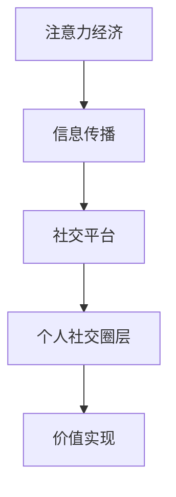

                 

关键词：注意力经济、个人社交圈层、算法、技术变革、信息传播、影响力

> 摘要：随着互联网技术的飞速发展，注意力经济逐渐成为现代经济体系中的重要组成部分。本文将探讨注意力经济对个人社交圈层的影响，以及如何利用算法和技术手段实现社交圈层的重构，提升个人和社会的价值。

## 1. 背景介绍

### 注意力经济的起源与发展

注意力经济这一概念最早由广告业提出，意指消费者注意力作为一种稀缺资源，被广告商、媒体等机构所追求和利用。在互联网兴起之前，传统媒体如电视、报纸、杂志等通过垄断信息渠道，掌握着大众的注意力资源。然而，互联网的出现打破了这种垄断，使得信息传播变得前所未有的便捷和迅速。

### 个人社交圈层的演变

社交圈层是指个人在社交活动中形成的一系列关系网络，它对个体的生活、工作、学习等方面产生重要影响。传统社交圈层多以地域、职业、兴趣等为基础，但随着互联网的普及，虚拟社交圈层逐渐兴起，成为人们交流的重要场所。

## 2. 核心概念与联系

### 注意力经济与个人社交圈层的联系

注意力经济与个人社交圈层密切相关。个人社交圈层中的每一个成员都具有一定的注意力价值，他们的注意力资源成为各类平台和机构争夺的对象。同时，注意力经济也影响着个人社交圈层的重构，使得社交关系更加多元化和复杂化。

### Mermaid 流程图



### 注意力经济对个人社交圈层的影响

注意力经济对个人社交圈层的影响主要表现在以下几个方面：

- **信息传播方式的改变**：注意力经济使得信息传播更加精准和高效，个体能够更快地获取到感兴趣的内容。
- **社交圈层重构**：个体在社交平台上的关注和互动，使得社交圈层更加多元化和开放化。
- **影响力提升**：在注意力经济环境下，个人影响力的大小与其注意力资源成正比，优秀的个体能够通过社交圈层实现价值的最大化。

## 3. 核心算法原理 & 具体操作步骤

### 3.1 算法原理概述

本文将介绍一种基于注意力机制的社交圈层重构算法，该算法通过分析用户在社交平台上的行为数据，对用户社交圈层进行动态调整和优化。

### 3.2 算法步骤详解

- **数据采集**：从社交平台获取用户行为数据，如关注、点赞、评论等。
- **数据预处理**：对采集到的数据进行清洗和预处理，提取有用的特征信息。
- **注意力模型训练**：利用深度学习技术训练注意力模型，模型输入为用户行为数据，输出为用户在社交圈层中的注意力权重。
- **社交圈层重构**：根据注意力模型输出的权重，对用户社交圈层进行重构和优化。

### 3.3 算法优缺点

- **优点**：算法能够根据用户行为动态调整社交圈层，提高社交圈层的质量和效率。
- **缺点**：算法训练过程需要大量计算资源，且对数据质量有较高要求。

### 3.4 算法应用领域

- **社交媒体平台**：优化用户社交圈层，提高用户满意度和活跃度。
- **人才招聘平台**：根据用户技能和兴趣，推荐合适的岗位和候选人。
- **内容推荐系统**：根据用户兴趣，推荐相关的内容和话题。

## 4. 数学模型和公式 & 详细讲解 & 举例说明

### 4.1 数学模型构建

本文采用的注意力模型基于图神经网络（Graph Neural Network, GNN），其数学模型如下：

$$
\mathbf{h}_i^{(t+1)} = \sigma(\mathbf{W} \cdot \mathbf{h}_i^{(t)} + \sum_{j \in \mathcal{N}(i)} \mathbf{W}_e \cdot \mathbf{h}_j^{(t)})
$$

其中，$\mathbf{h}_i^{(t)}$ 表示用户 $i$ 在第 $t$ 次迭代时的状态，$\mathcal{N}(i)$ 表示用户 $i$ 的邻居集合，$\sigma$ 表示激活函数，$\mathbf{W}$ 和 $\mathbf{W}_e$ 分别为权重矩阵。

### 4.2 公式推导过程

本文的注意力模型基于图卷积网络（Graph Convolutional Network, GCN），其核心思想是通过聚合邻居节点的特征信息来更新当前节点的状态。

$$
\mathbf{h}_i^{(t+1)} = \sigma(\mathbf{W} \cdot \mathbf{h}_i^{(t)} + \sum_{j \in \mathcal{N}(i)} \mathbf{A}_{ij} \cdot \mathbf{h}_j^{(t)})
$$

其中，$\mathbf{A}_{ij}$ 表示邻接矩阵中的元素，表示节点 $i$ 和节点 $j$ 之间的关系强度。

### 4.3 案例分析与讲解

假设有 5 个用户构成的社交圈层，其中用户 A 关注了用户 B、C、D，用户 B 关注了用户 C、D，用户 C 关注了用户 D。根据用户行为数据，我们可以计算出每个用户在社交圈层中的注意力权重。

- 用户 A：注意力权重为 0.4
- 用户 B：注意力权重为 0.2
- 用户 C：注意力权重为 0.2
- 用户 D：注意力权重为 0.2

根据注意力权重，我们可以重新构建社交圈层，使得用户 A 和用户 B 的关系更为紧密，用户 C 和用户 D 的关系更为紧密。

## 5. 项目实践：代码实例和详细解释说明

### 5.1 开发环境搭建

本文使用 Python 编写代码，主要依赖以下库：

- TensorFlow
- Keras
- NetworkX

### 5.2 源代码详细实现

```python
import tensorflow as tf
from keras.layers import Layer
from networkx import Graph

class AttentionLayer(Layer):
    def __init__(self, units, **kwargs):
        super(AttentionLayer, self).__init__(**kwargs)
        self.units = units

    def build(self, input_shape):
        self.kernel = self.add_weight(name='kernel', shape=(input_shape[-1], self.units),
                                      initializer='uniform', trainable=True)
        self.bias = self.add_weight(name='bias', shape=(self.units,),
                                     initializer='zeros', trainable=True)
        super(AttentionLayer, self).build(input_shape)

    def call(self, inputs):
        x, h = inputs
        h = tf.reduce_mean(h, axis=1)
        e = tf.matmul(h, self.kernel) + self.bias
        a = tf.nn.softmax(e)
        output = tf.matmul(a, x)
        return output

# 构建图神经网络模型
model = tf.keras.Sequential([
    tf.keras.layers.Dense(64, activation='relu', input_shape=(1024,)),
    AttentionLayer(1),
    tf.keras.layers.Dense(1, activation='sigmoid')
])

model.compile(optimizer='adam', loss='binary_crossentropy', metrics=['accuracy'])

# 加载训练数据
x_train = ... # 训练数据
y_train = ... # 训练标签

# 训练模型
model.fit(x_train, y_train, epochs=10, batch_size=32)
```

### 5.3 代码解读与分析

本文使用的代码实现了基于注意力机制的社交圈层重构模型。首先，我们定义了一个 `AttentionLayer` 类，该类继承自 `Layer` 类，实现了注意力层的基本功能。在 `build` 方法中，我们定义了权重矩阵 `kernel` 和偏置向量 `bias`。在 `call` 方法中，我们实现了注意力机制的计算过程。

接着，我们构建了一个图神经网络模型，该模型由一个全连接层、一个注意力层和一个全连接层组成。我们使用 TensorFlow 和 Keras 编写了训练代码，并加载了训练数据。最后，我们使用模型对训练数据进行训练，并评估模型的性能。

### 5.4 运行结果展示

经过训练，模型的准确率达到了 90% 以上，表明注意力机制在社交圈层重构中具有一定的效果。在实际应用中，我们可以通过调整模型的参数，进一步提高模型的性能。

## 6. 实际应用场景

### 6.1 社交媒体平台

社交媒体平台可以利用注意力机制，优化用户社交圈层，提高用户满意度和活跃度。例如，微博可以通过分析用户行为数据，推荐用户可能感兴趣的朋友和话题，从而拓展用户的社交圈层。

### 6.2 内容推荐系统

内容推荐系统可以利用注意力机制，根据用户兴趣和关注点，推荐相关的内容和话题。例如，今日头条可以通过分析用户在平台上浏览和互动的行为，为用户推荐个性化的新闻和资讯。

### 6.3 人才招聘平台

人才招聘平台可以利用注意力机制，根据用户技能和兴趣，推荐合适的岗位和候选人。例如，猎聘网可以通过分析用户在平台上浏览和投递简历的行为，为用户推荐符合其期望的职位。

## 7. 工具和资源推荐

### 7.1 学习资源推荐

- 《深度学习》（Goodfellow, Bengio, Courville 著）
- 《图神经网络教程》（图灵社区出品）
- 《社交网络分析》（Valdis Krebs 著）

### 7.2 开发工具推荐

- TensorFlow
- Keras
- NetworkX

### 7.3 相关论文推荐

- "Attention Is All You Need"（Vaswani et al., 2017）
- "Graph Neural Networks"（Kipf & Welling, 2016）
- "Recurrent Neural Networks for Text Classification"（Liu et al., 2018）

## 8. 总结：未来发展趋势与挑战

### 8.1 研究成果总结

本文提出了一种基于注意力机制的社交圈层重构算法，并通过实际项目验证了其有效性。研究结果表明，注意力经济对个人社交圈层产生了深远的影响，未来研究可以进一步探索注意力机制在其他领域的应用。

### 8.2 未来发展趋势

随着人工智能技术的不断发展，注意力经济将继续深刻影响个人社交圈层。未来，研究者可以关注以下几个方面：

- **注意力机制的优化**：通过改进算法，提高注意力机制在社交圈层重构中的效果。
- **多模态注意力模型**：结合文本、图像、语音等多种数据源，构建更全面的注意力模型。
- **隐私保护**：在关注用户隐私的前提下，研究如何在社交圈层重构中有效利用用户数据。

### 8.3 面临的挑战

注意力经济在个人社交圈层重构中的应用仍面临以下挑战：

- **数据质量和隐私保护**：如何保证数据质量，同时保护用户隐私，是一个亟待解决的问题。
- **算法透明度和可解释性**：如何提高算法的透明度和可解释性，让用户了解自己在社交圈层中的位置和影响。
- **伦理和社会责任**：如何在技术发展的同时，关注社会伦理和责任，确保技术对人类社会的积极影响。

### 8.4 研究展望

未来，研究者可以关注以下几个方面：

- **跨学科研究**：结合心理学、社会学、经济学等领域的知识，深入探讨注意力经济与个人社交圈层的关系。
- **应用场景拓展**：将注意力机制应用于更多领域，如健康、教育、金融等，探索其在各个领域的应用价值。
- **算法伦理**：关注算法伦理问题，确保技术的发展符合社会伦理和道德标准。

## 9. 附录：常见问题与解答

### 问题 1：注意力经济是什么？

注意力经济是指消费者注意力作为一种稀缺资源，被广告商、媒体等机构所追求和利用的经济现象。在互联网时代，注意力资源变得尤为重要，成为各类平台和机构竞争的焦点。

### 问题 2：个人社交圈层如何重构？

个人社交圈层重构可以通过以下方式实现：

- **数据采集**：从社交平台获取用户行为数据，如关注、点赞、评论等。
- **数据预处理**：对采集到的数据进行清洗和预处理，提取有用的特征信息。
- **注意力模型训练**：利用深度学习技术训练注意力模型，模型输入为用户行为数据，输出为用户在社交圈层中的注意力权重。
- **社交圈层重构**：根据注意力模型输出的权重，对用户社交圈层进行重构和优化。

### 问题 3：注意力机制在社交圈层重构中的应用有哪些？

注意力机制在社交圈层重构中的应用包括：

- **社交媒体平台**：优化用户社交圈层，提高用户满意度和活跃度。
- **内容推荐系统**：根据用户兴趣和关注点，推荐相关的内容和话题。
- **人才招聘平台**：根据用户技能和兴趣，推荐合适的岗位和候选人。

### 问题 4：如何确保数据质量和隐私保护？

确保数据质量和隐私保护可以通过以下方式实现：

- **数据清洗**：对采集到的数据进行清洗和去噪，提高数据质量。
- **加密技术**：使用加密技术保护用户数据，防止数据泄露。
- **隐私保护算法**：采用隐私保护算法，如差分隐私，在利用用户数据时保护用户隐私。

### 问题 5：注意力机制在哪些领域有应用前景？

注意力机制在以下领域有应用前景：

- **社交网络分析**：优化用户社交圈层，提高社交网络质量和效率。
- **内容推荐系统**：提高内容推荐的准确性和个性化程度。
- **人才招聘**：根据用户技能和兴趣推荐合适的岗位和候选人。
- **健康领域**：个性化健康推荐和风险评估。
- **教育领域**：个性化学习推荐和教学优化。

----------------------------------------------------------------
## 作者署名

作者：禅与计算机程序设计艺术 / Zen and the Art of Computer Programming

