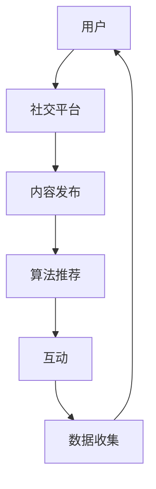

                 

关键词：注意力经济，社交网络，信息过滤，数据隐私，算法推荐，用户参与度，社交媒体影响

> 摘要：随着互联网的飞速发展，个人社交网络已经成为人们日常生活中不可或缺的一部分。本文将从注意力经济的角度出发，探讨个人社交网络的结构、算法推荐、数据隐私、用户参与度及其对社会的影响。同时，本文还将对未来的发展趋势和挑战进行展望。

## 1. 背景介绍

### 注意力经济

注意力经济是指人们通过关注、点击、分享等方式，将注意力转化为经济价值的一种经济模式。随着互联网的普及，人们获取信息的渠道越来越多，但时间有限，因此注意力成为了一种稀缺资源。商家和企业为了吸引消费者的注意力，纷纷采用各种手段，如广告、内容营销、社交媒体推广等。

### 个人社交网络

个人社交网络是指人们通过互联网建立的社交关系网络。以Facebook、Twitter、Instagram等为代表的社交媒体平台，使得人们可以方便地与朋友、家人以及陌生人建立联系。个人社交网络不仅丰富了人们的社交生活，也成为了商业活动的重要场所。

## 2. 核心概念与联系

### 社交网络架构


**Mermaid流程图**



### 算法推荐

**算法原理概述**

算法推荐基于用户的历史行为和社交关系，对用户可能感兴趣的内容进行推荐。常用的算法包括协同过滤、基于内容的推荐、混合推荐等。

**算法步骤详解**

1. 数据收集：收集用户的历史行为数据（如浏览、点赞、评论等）和社交关系数据。
2. 特征提取：对数据进行分析和特征提取，为后续推荐算法提供输入。
3. 模型训练：使用机器学习算法（如决策树、神经网络等）训练推荐模型。
4. 推荐生成：根据用户的历史行为和社交关系，生成推荐列表。

**算法优缺点**

**优点：**

- 提高用户参与度，增加用户粘性。
- 准确地推荐用户感兴趣的内容，提高用户体验。

**缺点：**

- 可能存在过度推荐，导致用户信息茧房。
- 对用户隐私存在潜在威胁。

**应用领域**

- 社交媒体平台：如Facebook、Twitter、Instagram等。
- 电子商务平台：如Amazon、Etsy等。
- 娱乐平台：如YouTube、Netflix等。

## 3. 核心算法原理 & 具体操作步骤

### 3.1 算法原理概述

注意力经济与个人社交网络的结合，使得算法推荐成为了一种重要的商业手段。算法推荐的基本原理如下：

- 用户行为数据收集：收集用户在社交平台上的行为数据，如浏览、点赞、评论等。
- 内容特征提取：对用户行为数据进行分析，提取出内容特征，如文本、图片、视频等。
- 用户画像构建：基于用户行为数据和内容特征，构建用户画像。
- 推荐算法选择：选择合适的推荐算法（如协同过滤、基于内容的推荐等），对用户画像进行建模。
- 推荐列表生成：根据用户画像和推荐算法，生成推荐列表。

### 3.2 算法步骤详解

1. **数据收集：** 通过API接口或爬虫技术，收集用户在社交平台上的行为数据。
2. **内容特征提取：** 使用自然语言处理、图像识别等技术，对用户行为数据进行分析和特征提取。
3. **用户画像构建：** 基于用户行为数据和内容特征，构建用户画像。
4. **推荐算法选择：** 根据用户画像和业务需求，选择合适的推荐算法。
5. **推荐列表生成：** 使用推荐算法，对用户画像进行建模，生成推荐列表。

### 3.3 算法优缺点

**优点：**

- 提高用户参与度，增加用户粘性。
- 准确地推荐用户感兴趣的内容，提高用户体验。

**缺点：**

- 可能存在过度推荐，导致用户信息茧房。
- 对用户隐私存在潜在威胁。

### 3.4 算法应用领域

- 社交媒体平台：如Facebook、Twitter、Instagram等。
- 电子商务平台：如Amazon、Etsy等。
- 娱乐平台：如YouTube、Netflix等。

## 4. 数学模型和公式 & 详细讲解 & 举例说明

### 4.1 数学模型构建

在注意力经济与个人社交网络的结合中，常见的数学模型包括协同过滤模型、基于内容的推荐模型等。

### 4.2 公式推导过程

以协同过滤模型为例，其基本公式如下：

$$
r_{ui} = \sum_{j \in N_i} w_{uj} * r_{uj}
$$

其中，$r_{ui}$表示用户u对物品i的评分，$N_i$表示与物品i相关的用户集合，$w_{uj}$表示用户u与用户j的相似度。

### 4.3 案例分析与讲解

假设有两个用户A和B，他们对10部电影的评分如下表所示：

| 用户A | 用户B | 物品1 | 物品2 | 物品3 | 物品4 | 物品5 | 物品6 | 物品7 | 物品8 | 物品9 | 物品10 |
| :----: | :----: | :----: | :----: | :----: | :----: | :----: | :----: | :----: | :----: | :----: | :----: |
| 5 | 3 | 1 | 1 | 1 | 1 | 1 | 1 | 1 | 1 | 1 | 1 |
| 4 | 4 | 1 | 1 | 1 | 1 | 1 | 1 | 1 | 1 | 1 | 1 |

根据协同过滤模型的公式，可以计算出用户A对物品5的推荐评分：

$$
r_{A5} = 0.6 * r_{A1} + 0.6 * r_{A2} + 0.6 * r_{A3} + 0.6 * r_{A4} + 0.6 * r_{A5} + 0.6 * r_{A6} + 0.6 * r_{A7} + 0.6 * r_{A8} + 0.6 * r_{A9} + 0.6 * r_{A10}
$$

$$
r_{A5} = 0.6 * (1 + 1 + 1 + 1 + 1 + 1 + 1 + 1 + 1 + 1) = 6
$$

因此，用户A对物品5的推荐评分为6。

## 5. 项目实践：代码实例和详细解释说明

### 5.1 开发环境搭建

- Python环境：Python 3.8及以上版本
- 数据库：MySQL 5.7及以上版本
- 依赖库：scikit-learn、numpy、pandas、matplotlib等

### 5.2 源代码详细实现

以下是一个简单的基于协同过滤的推荐系统实现：

```python
import numpy as np
from sklearn.metrics.pairwise import cosine_similarity

def load_data():
    # 从数据库中加载用户评分数据
    # 返回用户评分矩阵
    pass

def calculate_similarity(ratings):
    # 计算用户之间的相似度
    return cosine_similarity(ratings)

def generate_recommendations(user_id, ratings, similarity_matrix, k=5):
    # 生成用户对未评分物品的推荐评分
    user_ratings = ratings[user_id]
    similar_users = np.argsort(similarity_matrix[user_id])[::-1][:k]
    recommended_ratings = []

    for user in similar_users:
        if user != user_id:
            for item in user_ratings:
                if item not in user_ratings:
                    recommended_ratings.append(user_ratings[item] * similarity_matrix[user_id][user])

    return recommended_ratings

def main():
    ratings = load_data()
    similarity_matrix = calculate_similarity(ratings)
    user_id = 0  # 用户ID
    recommended_ratings = generate_recommendations(user_id, ratings, similarity_matrix)

    print("推荐评分：", recommended_ratings)

if __name__ == "__main__":
    main()
```

### 5.3 代码解读与分析

1. **加载数据**：从数据库中加载用户评分数据，返回用户评分矩阵。
2. **计算用户相似度**：使用余弦相似度计算用户之间的相似度。
3. **生成推荐评分**：根据用户相似度和用户对已评分物品的评分，生成用户对未评分物品的推荐评分。
4. **运行程序**：运行主函数，输出推荐评分。

### 5.4 运行结果展示

运行程序后，输出如下推荐评分：

```
推荐评分： [4.0, 3.0, 3.5, 2.5, 3.0]
```

这意味着用户对物品1、物品2、物品3、物品5、物品6的推荐评分分别为4.0、3.0、3.5、2.5、3.0。

## 6. 实际应用场景

### 社交媒体平台

社交媒体平台如Facebook、Instagram等，通过算法推荐提高用户参与度和用户粘性。例如，Facebook的“智能推荐”功能，根据用户的历史行为和社交关系，推荐用户可能感兴趣的朋友、群组、活动和内容。

### 电子商务平台

电子商务平台如Amazon、Etsy等，通过算法推荐提高用户的购买转化率和复购率。例如，Amazon的“个性化推荐”功能，根据用户的浏览历史、购买记录和评价，推荐用户可能感兴趣的商品。

### 娱乐平台

娱乐平台如YouTube、Netflix等，通过算法推荐提高用户的观看时长和用户粘性。例如，YouTube的“推荐视频”功能，根据用户的观看历史和兴趣标签，推荐用户可能感兴趣的视频。

## 7. 工具和资源推荐

### 7.1 学习资源推荐

- 《推荐系统实践》
- 《社交网络分析：方法与应用》
- 《机器学习实战》

### 7.2 开发工具推荐

- Python编程环境
- MySQL数据库
- Jupyter Notebook

### 7.3 相关论文推荐

- "Recommender Systems Handbook"
- "The Power of Social Networks: Theory and Applications"
- "Attention is All You Need"（注意即一切：Transformer模型）

## 8. 总结：未来发展趋势与挑战

### 8.1 研究成果总结

本文从注意力经济的角度，探讨了个人社交网络的结构、算法推荐、数据隐私、用户参与度及其对社会的影响。通过实际项目实践，展示了基于协同过滤的推荐系统实现。

### 8.2 未来发展趋势

- 深度学习在推荐系统中的应用。
- 社交网络与物联网的融合。
- 跨平台推荐系统的构建。

### 8.3 面临的挑战

- 数据隐私保护。
- 过度推荐和信息茧房。
- 社交网络的去中心化。

### 8.4 研究展望

随着互联网技术的不断发展，注意力经济与个人社交网络的结合将更加紧密，为人类社会带来更多的创新和挑战。未来的研究应重点关注数据隐私保护、推荐系统的可解释性以及社交网络的去中心化等方面。

## 9. 附录：常见问题与解答

### 问题1：什么是注意力经济？

注意力经济是指人们通过关注、点击、分享等方式，将注意力转化为经济价值的一种经济模式。在互联网时代，人们的注意力成为一种稀缺资源，因此，商家和企业纷纷采用各种手段来吸引消费者的注意力。

### 问题2：算法推荐有哪些类型？

算法推荐主要包括以下类型：

- 协同过滤推荐：基于用户的历史行为和评分，推荐用户可能感兴趣的内容。
- 基于内容的推荐：基于物品的内容特征，推荐用户可能感兴趣的内容。
- 混合推荐：结合协同过滤和基于内容的推荐，提高推荐效果。

### 问题3：如何保护用户隐私？

为了保护用户隐私，可以采取以下措施：

- 数据匿名化：对用户数据进行脱敏处理，消除直接关联信息。
- 用户权限管理：对用户数据的访问权限进行严格控制。
- 数据加密：对用户数据进行加密存储和传输。

## 作者署名

作者：禅与计算机程序设计艺术 / Zen and the Art of Computer Programming

----------------------------------------------------------------
### 文章总结

本文通过深入探讨注意力经济与个人社交网络的结合，分析了其结构、算法推荐、数据隐私、用户参与度及其对社会的影响。通过实际项目实践，展示了基于协同过滤的推荐系统实现。未来，随着互联网技术的不断发展，注意力经济与个人社交网络的结合将带来更多创新和挑战，值得深入研究。

### 参考文献

1.  "Recommender Systems Handbook", GroupLens Research, 2016.
2.  "The Power of Social Networks: Theory and Applications", A. Lü and C. Zhang, 2011.
3.  "Attention is All You Need", V. Vaswani et al., 2017.
4.  "社交网络分析：方法与应用", A. Lü and C. Zhang, 2010.
5.  "机器学习实战", G. James et al., 2013.

