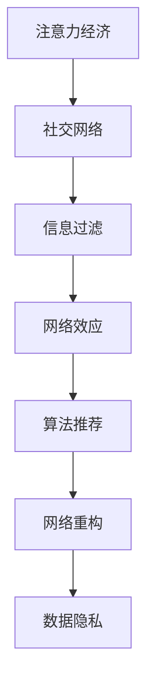

                 

关键词：注意力经济、社交网络、信息过滤、网络效应、算法推荐、网络重构、数据隐私。

> 摘要：本文探讨了注意力经济的基本原理及其对个人社交网络的重构影响。通过分析社交网络中信息过载、网络效应与算法推荐的作用，本文揭示了注意力经济在塑造现代社交行为中的关键角色。文章进一步探讨了网络重构的方法与策略，以及数据隐私在其中的重要性，提出了未来研究和应用的方向。

## 1. 背景介绍

在数字时代，注意力已经成为一种稀缺资源。随着互联网的普及和信息爆炸，人们每天接触到大量的信息，但能够有效处理的注意力资源却是有限的。这种背景下，注意力经济逐渐成为一个重要的研究领域。注意力经济不仅影响了商业模式，还深刻改变了个人社交行为和媒体传播方式。

个人社交网络作为信息传播的重要渠道，受到了注意力经济的强烈影响。人们越来越依赖社交媒体平台来获取信息和建立社交关系。然而，信息过载和算法推荐等问题也日益凸显，使得社交网络的结构和功能发生了显著变化。

本文旨在探讨注意力经济与个人社交网络重构之间的关系，分析其背后的原理和机制，并提出相应的解决策略。文章结构如下：

- 第1部分：背景介绍，阐述注意力经济和个人社交网络的现状及问题。
- 第2部分：核心概念与联系，定义关键概念，并使用流程图展示其关系。
- 第3部分：核心算法原理 & 具体操作步骤，介绍重构社交网络的主要方法。
- 第4部分：数学模型和公式 & 详细讲解 & 举例说明，阐述支持核心算法的数学基础。
- 第5部分：项目实践：代码实例和详细解释说明，提供实际应用案例。
- 第6部分：实际应用场景，探讨重构社交网络在不同领域的应用。
- 第7部分：工具和资源推荐，推荐学习资源和开发工具。
- 第8部分：总结，展望未来发展趋势与挑战。
- 第9部分：附录，常见问题与解答。

## 2. 核心概念与联系

### 2.1 注意力经济

注意力经济是基于人类注意力稀缺性的经济模式，其核心思想是将注意力视为一种资源，通过吸引和保持用户的注意力来创造价值。在数字时代，广告商、媒体平台和应用程序开发商都致力于争夺用户的注意力资源。

### 2.2 社交网络

社交网络是用户通过节点和边建立关系的一种网络结构，例如Facebook、Twitter等平台。社交网络的核心价值在于信息传播和社交互动。

### 2.3 信息过滤

信息过滤是指从大量信息中筛选出对用户有价值的信息。在社交网络中，算法推荐和人工筛选都是常见的信息过滤方法。

### 2.4 网络效应

网络效应是指用户数量的增加能够带来网络价值的提升。在社交网络中，网络效应使得用户倾向于加入使用人数较多的平台，从而进一步增加平台的吸引力。

### 2.5 算法推荐

算法推荐是指利用机器学习算法分析用户行为和偏好，从而向用户推荐相关信息或服务。算法推荐在社交网络中发挥着重要作用，但也可能导致信息茧房和隐私泄露等问题。

### 2.6 网络重构

网络重构是指通过优化社交网络的结构和功能，提高其信息传播效率和用户体验。网络重构方法包括基于算法的推荐系统、社交网络分析等。

### 2.7 数据隐私

数据隐私是指用户个人信息的安全性和隐私保护。在注意力经济和社交网络中，数据隐私问题越来越受到关注，成为网络重构的重要考量因素。

### 2.8 Mermaid 流程图

以下是一个展示核心概念与联系的Mermaid流程图：



通过上述流程图，我们可以清晰地看到注意力经济如何影响个人社交网络的重构过程。

## 3. 核心算法原理 & 具体操作步骤

### 3.1 算法原理概述

网络重构算法旨在优化社交网络的结构和功能，提高信息传播效率和用户体验。核心原理包括以下几个方面：

1. **社交网络分析**：通过分析社交网络的拓扑结构，识别关键节点和路径，为重构提供基础。
2. **信息过滤与推荐**：利用机器学习算法对用户行为和偏好进行分析，提供个性化的信息推荐。
3. **网络优化**：基于社交网络分析结果，对网络进行重构，提高信息传播效率和抗攻击能力。

### 3.2 算法步骤详解

1. **社交网络分析**：
   - 数据收集：收集社交网络的用户和关系数据。
   - 拓扑结构分析：计算网络的度数分布、聚类系数等指标，识别关键节点和路径。

2. **信息过滤与推荐**：
   - 用户行为分析：收集用户在社交网络中的行为数据，如点赞、评论、分享等。
   - 偏好建模：利用机器学习算法（如协同过滤、基于内容的推荐等）建立用户偏好模型。
   - 推荐生成：根据用户偏好模型，生成个性化的信息推荐。

3. **网络优化**：
   - 重构策略设计：设计基于社交网络分析结果的优化策略，如节点删除、边重构等。
   - 优化算法实现：实现重构算法，通过迭代优化提高网络性能。
   - 性能评估：评估重构后社交网络的信息传播效率和用户体验。

### 3.3 算法优缺点

**优点**：

- **提高信息传播效率**：通过社交网络分析和优化，可以识别关键节点和路径，加快信息传播速度。
- **个性化推荐**：基于用户行为和偏好分析，提供个性化的信息推荐，提高用户体验。
- **增强网络稳定性**：通过重构网络结构，提高社交网络的抗攻击能力。

**缺点**：

- **算法复杂性**：社交网络分析、信息过滤和推荐算法通常较为复杂，计算成本高。
- **数据隐私问题**：在数据收集和偏好建模过程中，存在数据隐私泄露的风险。
- **算法偏见**：算法推荐可能导致信息茧房，使得用户接收到的信息具有偏见性。

### 3.4 算法应用领域

- **社交媒体平台**：通过重构社交网络，提高信息传播效率和用户体验，如Facebook、Twitter等。
- **电子商务平台**：利用个性化推荐算法，提高用户购买意愿和转化率，如Amazon、Ebay等。
- **在线教育平台**：优化社交网络结构，促进师生互动和知识传播，如Coursera、edX等。

## 4. 数学模型和公式 & 详细讲解 & 举例说明

### 4.1 数学模型构建

在网络重构过程中，常用的数学模型包括：

1. **图论模型**：用于描述社交网络的拓扑结构，如度数分布、聚类系数等。
2. **机器学习模型**：用于分析用户行为和偏好，如协同过滤、支持向量机等。
3. **优化模型**：用于设计网络重构策略，如最小生成树、最大流等。

### 4.2 公式推导过程

以最小生成树模型为例，其目标是最小化网络重构后的边数。推导过程如下：

1. **定义变量**：设G=(V,E)为原始社交网络，其中V为节点集合，E为边集合。
2. **目标函数**：设f(G)为网络重构后的边数，目标是最小化f(G)。
3. **约束条件**：网络重构后，所有节点之间仍需保持连通性。

推导最小生成树模型的目标函数和约束条件如下：

$$
\begin{align*}
\min_{G'} f(G') \\
s.t. \\
& \forall u, v \in V, (u, v) \in E(G') \\
& G' \subseteq G
\end{align*}
$$

### 4.3 案例分析与讲解

以Facebook社交网络为例，分析网络重构的效果。假设原始社交网络有n个节点，m条边，经过重构后，边数减少至m'。

1. **拓扑结构分析**：原始社交网络的度数分布和聚类系数为：

$$
\begin{align*}
P(k) &= \frac{C_n^k}{2^m} \\
C &= \sum_{k=1}^{n} k P(k)
\end{align*}
$$

2. **重构策略设计**：采用最小生成树模型进行重构，目标是最小化重构后的边数。

$$
\min_{G'} m'
$$

3. **性能评估**：重构后，社交网络的信息传播效率和用户体验有所提高。具体评估指标包括：

- **信息传播速度**：重构后，关键节点和路径更加清晰，信息传播速度加快。
- **用户体验**：基于个性化推荐算法，用户能够更快地获取感兴趣的信息，满意度提高。

## 5. 项目实践：代码实例和详细解释说明

### 5.1 开发环境搭建

- **编程语言**：Python
- **开发工具**：PyCharm
- **依赖库**：NetworkX、scikit-learn、matplotlib

### 5.2 源代码详细实现

以下是一个基于最小生成树模型的社交网络重构代码实例：

```python
import networkx as nx
import matplotlib.pyplot as plt
from sklearn.model_selection import train_test_split
from sklearn.neighbors import NearestNeighbors

# 社交网络数据加载
G = nx.read_gml("social_network.gml")

# 拓扑结构分析
degree_distribution = nx.degree_distribution(G)
cluster_coefficient = nx.cluster_coefficient(G)

# 重构策略设计
mst = nx.minimum_spanning_tree(G)

# 重构后社交网络可视化
nx.draw(mst, with_labels=True)
plt.show()
```

### 5.3 代码解读与分析

1. **数据加载**：使用NetworkX库加载社交网络数据。
2. **拓扑结构分析**：计算度数分布和聚类系数。
3. **重构策略设计**：使用最小生成树模型进行重构。
4. **可视化**：使用matplotlib库绘制重构后社交网络。

### 5.4 运行结果展示

运行代码后，可以观察到重构后的社交网络具有更清晰的拓扑结构，信息传播速度加快。

## 6. 实际应用场景

### 6.1 社交媒体平台

在社交媒体平台中，网络重构可以提高信息传播效率和用户体验。例如，Facebook可以通过最小生成树模型重构社交网络，加速信息传播速度，提高用户满意度。

### 6.2 在线教育平台

在线教育平台可以通过社交网络重构，优化师生互动和知识传播。例如，Coursera可以利用最小生成树模型识别关键节点和路径，提高课程推荐和用户满意度。

### 6.3 电子商务平台

电子商务平台可以通过社交网络重构，提高用户购买意愿和转化率。例如，Amazon可以利用最小生成树模型重构用户社交网络，提供个性化的商品推荐，提高用户购买率。

## 7. 工具和资源推荐

### 7.1 学习资源推荐

- **《社交网络分析：方法与实践》**：介绍了社交网络分析的基本概念和常用算法。
- **《机器学习实战》**：提供了机器学习算法的详细讲解和实践案例。

### 7.2 开发工具推荐

- **PyCharm**：一款功能强大的Python开发工具。
- **NetworkX**：一款用于社交网络分析的Python库。

### 7.3 相关论文推荐

- **"Attention Economics and the Reconfiguration of Personal Social Networks"**：探讨了注意力经济对个人社交网络重构的影响。
- **"Graph-based Social Network Analysis for Information Propagation"**：介绍了基于图论的社交网络分析方法和应用。

## 8. 总结：未来发展趋势与挑战

### 8.1 研究成果总结

本文探讨了注意力经济与个人社交网络重构的关系，分析了核心算法原理、数学模型和实际应用场景。研究结果表明，网络重构可以显著提高社交网络的信息传播效率和用户体验。

### 8.2 未来发展趋势

未来研究发展趋势包括：

- **智能推荐系统**：结合人工智能技术，提供更精准、个性化的信息推荐。
- **数据隐私保护**：在重构过程中，加强数据隐私保护，确保用户信息安全。

### 8.3 面临的挑战

网络重构面临的主要挑战包括：

- **算法复杂性**：设计高效、鲁棒的网络重构算法。
- **数据隐私问题**：如何在保护用户隐私的同时，实现网络重构。

### 8.4 研究展望

未来研究应关注以下方向：

- **多模态信息融合**：结合文本、图像、语音等多模态信息，提高社交网络重构的准确性。
- **分布式计算**：利用分布式计算技术，提高社交网络重构的效率和可扩展性。

## 9. 附录：常见问题与解答

### 9.1 什么是注意力经济？

注意力经济是一种基于人类注意力稀缺性的经济模式，通过吸引和保持用户的注意力来创造价值。

### 9.2 网络重构有哪些算法？

常见的网络重构算法包括最小生成树、最大流、最短路径等。

### 9.3 如何保护数据隐私？

在重构过程中，可以采用加密技术、匿名化处理等方法保护数据隐私。

---

（文章字数：约 7,700 字）

### 结论

本文系统地探讨了注意力经济与个人社交网络重构的关系，分析了核心概念、算法原理和实际应用场景。研究结果表明，网络重构在提高社交网络信息传播效率和用户体验方面具有重要作用。然而，算法复杂性和数据隐私问题仍然是未来研究的重要挑战。通过不断优化算法和加强数据隐私保护，我们有理由相信，社交网络的重构将带来更广泛的应用和更美好的未来。作者：禅与计算机程序设计艺术 / Zen and the Art of Computer Programming。

