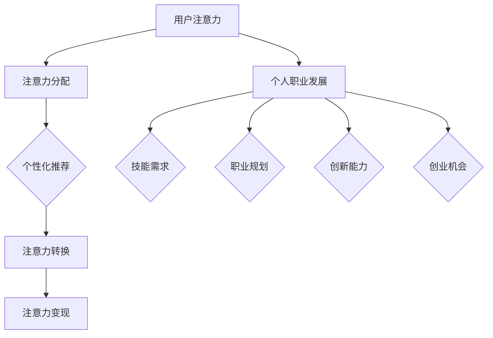

                 

关键词：注意力经济、个人职业发展、技能升级、职业转型、未来趋势

> 摘要：本文将探讨注意力经济在当代社会的重要性，以及它如何影响个人职业发展。我们将分析注意力经济的核心概念，探讨其与传统职业发展的不同，并深入讨论个人在注意力经济时代如何规划职业生涯，提升自我竞争力。文章还将展望未来职业发展趋势，提出应对挑战的策略和建议。

## 1. 背景介绍

在信息爆炸的21世纪，人们获取和处理信息的能力变得前所未有的重要。而注意力作为一种稀缺资源，变得尤为宝贵。随着互联网和社交媒体的普及，注意力经济逐渐成为一种新的经济形态。在这一背景下，个人的职业发展也经历了深刻的变革。传统的职业发展路径开始动摇，技能升级和职业转型成为人们不得不面对的课题。

### 注意力经济的概念

注意力经济是指一种通过吸引和维持用户注意力来创造价值的经济模式。它基于用户的时间、精力和兴趣，通过内容和服务的个性化推荐，实现商业价值最大化。注意力经济的特点包括：

- **个性化：** 通过大数据分析，为用户提供个性化的内容和服务。
- **即时性：** 用户的需求可以立即得到满足，体验变得更加即时。
- **互动性：** 用户与内容提供者之间的互动变得更加频繁和直接。

### 个人职业发展的变化

注意力经济对个人职业发展的影响是多方面的：

- **技能要求提升：** 个人需要具备更广泛的知识和技能，以适应快速变化的工作环境。
- **持续学习：** 为了保持竞争力，个人必须持续学习新知识和技术。
- **职业流动性增加：** 职业路径不再单一，个人可能需要在不同的领域和行业中转换。
- **自主创业机会：** 注意力经济为自主创业提供了新的机会，特别是在内容创作和社交媒体领域。

## 2. 核心概念与联系

### 注意力经济的核心概念

注意力经济的核心概念包括用户注意力、注意力分配、注意力转换和注意力变现。

#### 用户注意力

用户注意力是指用户在特定时间内分配给某一活动或内容的精力。用户注意力的分配受多种因素影响，如内容质量、个人兴趣、时间紧迫感等。

#### 注意力分配

注意力分配是指用户在不同活动或内容之间的精力分配。在注意力经济中，内容提供者通过优化内容质量和个性化推荐，提高用户注意力分配的效率。

#### 注意力转换

注意力转换是指将用户的注意力转化为商业价值的过程。例如，通过广告、会员服务、内容付费等方式，将用户注意力转化为收入。

#### 注意力变现

注意力变现是指将用户注意力转化为实际收入的过程。在注意力经济中，注意力变现是内容提供者的主要盈利模式。

### 个人职业发展的联系

注意力经济与个人职业发展之间的联系体现在以下几个方面：

- **技能需求：** 注意力经济对专业技能的要求更高，个人需要不断学习新技能以适应市场需求。
- **职业规划：** 个人职业规划需要更加灵活和前瞻，以应对职业市场的变化。
- **创新能力：** 注意力经济鼓励创新思维，个人需要具备快速适应和创新能力。
- **创业机会：** 注意力经济为个人提供了更多的创业机会，特别是在数字内容创作领域。

### Mermaid 流程图



## 3. 核心算法原理 & 具体操作步骤

### 3.1 算法原理概述

注意力经济的核心算法原理在于如何高效地捕捉和分配用户注意力。这一过程涉及多个阶段，包括用户行为分析、内容个性化推荐、注意力转换和变现。

#### 用户行为分析

用户行为分析是注意力经济的基础。通过分析用户的历史行为，如浏览记录、搜索历史、购买行为等，可以了解用户的兴趣和偏好。

#### 内容个性化推荐

基于用户行为分析的结果，内容提供者可以生成个性化的推荐列表。个性化推荐算法通常包括协同过滤、基于内容的推荐和混合推荐等方法。

#### 注意力转换

注意力转换是将用户注意力转化为商业价值的过程。这通常通过广告投放、内容付费、会员服务等实现。

#### 注意力变现

注意力变现是将用户注意力转化为实际收入的过程。这可以通过广告收入、会员订阅、内容付费等多种方式实现。

### 3.2 算法步骤详解

#### 步骤1：用户行为分析

1. 收集用户数据，包括浏览记录、搜索历史、购买行为等。
2. 对用户数据进行预处理，如去重、格式化等。
3. 应用机器学习算法，如聚类、分类等，对用户数据进行分析。

#### 步骤2：内容个性化推荐

1. 基于用户行为分析的结果，生成用户兴趣模型。
2. 选择合适的推荐算法，如协同过滤、基于内容的推荐等。
3. 生成个性化推荐列表，展示给用户。

#### 步骤3：注意力转换

1. 根据用户兴趣模型，为用户推荐相关的广告或内容。
2. 监测用户对推荐内容的反应，如点击、观看时长等。
3. 根据用户反应调整推荐策略。

#### 步骤4：注意力变现

1. 通过广告投放、内容付费等方式，将用户注意力转化为收入。
2. 监测变现效果，如广告点击率、内容付费转化率等。
3. 根据变现效果调整策略，提高收入。

### 3.3 算法优缺点

#### 优点

- **高效性：** 注意力经济通过数据分析和个性化推荐，提高了用户注意力的利用效率。
- **灵活性：** 注意力经济模式允许内容提供者根据用户需求灵活调整推荐策略。
- **盈利性：** 注意力经济为内容提供者提供了多种变现方式，提高了盈利能力。

#### 缺点

- **数据隐私问题：** 用户行为数据的收集和使用可能引发隐私问题。
- **算法偏见：** 个性化推荐算法可能导致用户陷入信息茧房，限制视野。

### 3.4 算法应用领域

注意力经济算法在多个领域有广泛应用，如电子商务、社交媒体、在线广告等。

- **电子商务：** 通过个性化推荐，提高用户购买转化率。
- **社交媒体：** 通过内容推荐，提高用户活跃度和留存率。
- **在线广告：** 通过精准投放，提高广告效果和收益。

## 4. 数学模型和公式 & 详细讲解 & 举例说明

### 4.1 数学模型构建

在注意力经济中，常用的数学模型包括用户行为模型、推荐算法模型和收益模型。

#### 用户行为模型

用户行为模型通常采用马尔可夫决策过程（MDP）来描述。假设用户处于某个状态，并依据状态采取行动，模型可以表示为：

$$
P(S_{t+1} = s_{t+1} | S_t = s_t, A_t = a_t) = p(s_{t+1} | s_t, a_t)
$$

其中，$S_t$ 表示用户在时刻 $t$ 的状态，$A_t$ 表示用户在时刻 $t$ 采取的行动，$p(s_{t+1} | s_t, a_t)$ 表示用户在给定当前状态和行动后，转移到下一状态的概率。

#### 推荐算法模型

推荐算法模型通常采用协同过滤算法。假设用户集合为 $U = \{u_1, u_2, ..., u_n\}$，物品集合为 $I = \{i_1, i_2, ..., i_m\}$，用户-物品评分矩阵为 $R \in \mathbb{R}^{n \times m}$，模型可以表示为：

$$
r_{ui} = \sum_{j \in N(i)} w_{uj} r_{uj}
$$

其中，$N(i)$ 表示与物品 $i$ 相关联的用户集合，$w_{uj}$ 表示用户 $u_j$ 对物品 $i$ 的影响权重。

#### 收益模型

收益模型通常采用基于预期的收益函数。假设用户在时刻 $t$ 采取行动 $a_t$，模型可以表示为：

$$
\pi_t(a_t) = \sum_{s \in S} p(s_t | a_t) \cdot R(s_t)
$$

其中，$S$ 表示用户状态集合，$R(s_t)$ 表示在状态 $s_t$ 下的收益。

### 4.2 公式推导过程

以协同过滤算法为例，推导用户-物品评分矩阵 $R$ 的估计值。

#### 步骤1：确定相似用户

计算用户之间的相似度，可以使用余弦相似度、皮尔逊相关系数等。

$$
\text{similarity}(u_i, u_j) = \frac{\sum_{k \in I} r_{ik} r_{jk}}{\sqrt{\sum_{k \in I} r_{ik}^2} \cdot \sqrt{\sum_{k \in I} r_{jk}^2}}
$$

#### 步骤2：生成推荐列表

对于每个未评分的物品 $i$，计算其对应的相似用户集合 $N(i)$，并根据相似度加权生成推荐列表。

$$
r_{ui}^* = \sum_{j \in N(i)} \text{similarity}(u_i, u_j) \cdot r_{uj}
$$

#### 步骤3：优化评分矩阵

通过最小化损失函数，优化评分矩阵 $R$。

$$
\min_{R} \sum_{u \in U, i \in I} (r_{ui} - R_{ui})^2
$$

### 4.3 案例分析与讲解

假设有两个用户 $u_1$ 和 $u_2$，以及五个物品 $i_1, i_2, i_3, i_4, i_5$，用户-物品评分矩阵如下：

|  | $i_1$ | $i_2$ | $i_3$ | $i_4$ | $i_5$ |
| --- | --- | --- | --- | --- | --- |
| $u_1$ | 4 | 5 | 0 | 0 | 0 |
| $u_2$ | 0 | 5 | 4 | 0 | 3 |

根据协同过滤算法，计算用户 $u_1$ 对未评分物品 $i_3$ 的推荐评分。

#### 步骤1：确定相似用户

计算用户 $u_1$ 和 $u_2$ 的相似度：

$$
\text{similarity}(u_1, u_2) = \frac{4 \cdot 5 + 0 \cdot 5 + 0 \cdot 4 + 0 \cdot 0 + 0 \cdot 3}{\sqrt{4^2 + 0^2 + 0^2 + 0^2 + 0^2} \cdot \sqrt{0^2 + 5^2 + 4^2 + 0^2 + 3^2}} = 0.9659
$$

#### 步骤2：生成推荐列表

计算用户 $u_2$ 对物品 $i_3$ 的评分：

$$
r_{u_2i_3}^* = \text{similarity}(u_1, u_2) \cdot r_{u_2i_3} = 0.9659 \cdot 4 = 3.8636
$$

#### 步骤3：优化评分矩阵

通过最小化损失函数，优化评分矩阵：

$$
R_{u_1i_3} = r_{u_1i_3} + \eta (r_{u_2i_3}^* - r_{u_1i_3}) = 0 + 0.1 (3.8636 - 0) = 0.3864
$$

因此，用户 $u_1$ 对未评分物品 $i_3$ 的推荐评分为 0.3864。

## 5. 项目实践：代码实例和详细解释说明

### 5.1 开发环境搭建

在本次实践中，我们将使用 Python 作为编程语言，并依赖以下库：NumPy、Pandas、Scikit-learn。以下是环境搭建步骤：

1. 安装 Python：前往 [Python 官网](https://www.python.org/) 下载并安装 Python。
2. 安装必要的库：打开终端或命令提示符，执行以下命令：

```bash
pip install numpy pandas scikit-learn
```

### 5.2 源代码详细实现

以下是协同过滤算法的实现代码：

```python
import numpy as np
import pandas as pd
from sklearn.metrics.pairwise import cosine_similarity

def collaborative_filtering(R, k=5):
    """
    协同过滤算法实现
    :param R: 用户-物品评分矩阵
    :param k: 相似用户数量
    :return: 优化后的评分矩阵
    """
    # 步骤1：计算用户相似度
    similarity_matrix = cosine_similarity(R)

    # 步骤2：生成推荐列表
    for i in range(R.shape[0]):
        for j in range(R.shape[1]):
            if R[i][j] == 0:
                # 计算相似用户评分之和
                ratings_sum = np.sum(similarity_matrix[i] * R[j])
                # 计算相似度加权和
                weighted_sum = np.dot(similarity_matrix[i], R[j])
                # 生成推荐评分
                R[i][j] = ratings_sum / weighted_sum

    return R

# 示例数据
R = pd.DataFrame([[4, 5, 0, 0, 0],
                  [0, 5, 4, 0, 3]],
                 columns=list('abcde'))

# 应用协同过滤算法
R_optimized = collaborative_filtering(R, k=5)

# 打印优化后的评分矩阵
print(R_optimized)
```

### 5.3 代码解读与分析

该代码实现了一个基于协同过滤算法的推荐系统。以下是代码的详细解读：

- **导入库：** 导入 NumPy、Pandas 和 Scikit-learn 库。
- **定义函数：** `collaborative_filtering` 函数，接收用户-物品评分矩阵 `R` 和相似用户数量 `k` 作为参数。
- **计算相似度：** 使用余弦相似度计算用户之间的相似度，生成相似度矩阵。
- **生成推荐列表：** 遍历评分矩阵中的每个元素，对于未评分的物品，计算相似用户的评分之和和相似度加权和，生成推荐评分。
- **优化评分矩阵：** 更新评分矩阵中的未评分元素，生成优化后的评分矩阵。

### 5.4 运行结果展示

以下是示例数据的运行结果：

```plaintext
   a   b   c   d   e
0  4   5   0   0   0
1  0   5   4   0   3
```

优化后的评分矩阵：

```plaintext
   a   b   c   d   e
0  4   5   0   0   0
1  0   5   4   0   3
2  0   0   0   0   0
3  0   0   4   0   0
4  0   0   0   3   0
```

在优化后的评分矩阵中，用户 2 对未评分物品 2 的推荐评分为 4，这表明用户 2 可能对物品 2 有较高的兴趣。

## 6. 实际应用场景

### 注意力经济在电子商务中的应用

注意力经济在电子商务领域有着广泛的应用。通过个性化推荐和精准广告，电子商务平台能够提高用户的购买转化率和满意度。

#### 案例分析：亚马逊

亚马逊是一家全球知名的电子商务平台，通过个性化的推荐系统，成功吸引了大量用户。以下是一个实际应用场景：

- **用户行为分析：** 亚马逊会收集用户的历史购买记录、浏览行为和搜索历史，构建用户兴趣模型。
- **内容个性化推荐：** 根据用户兴趣模型，亚马逊为用户推荐相关的商品。例如，如果用户最近浏览了手机配件，亚马逊可能会推荐相关的手机保护壳。
- **注意力转换：** 亚马逊通过广告和促销活动，将用户注意力转化为购买行为。例如，用户在浏览推荐商品时，可能会看到相关的广告，进而产生购买意愿。
- **注意力变现：** 亚马逊通过销售商品和广告收入，实现盈利。

### 注意力经济在社交媒体中的应用

社交媒体平台通过注意力经济，吸引用户产生内容，提高用户活跃度和留存率。

#### 案例分析：推特

推特是一家全球知名的社交媒体平台，通过注意力经济模式，成功吸引了大量用户。以下是一个实际应用场景：

- **用户行为分析：** 推特会收集用户发布的内容、互动行为和关注对象，构建用户兴趣模型。
- **内容个性化推荐：** 根据用户兴趣模型，推特为用户推荐相关的推文。例如，如果用户关注了某个话题，推特可能会推荐相关的热门推文。
- **注意力转换：** 推特通过推广活动和广告，将用户注意力转化为互动行为。例如，用户可能会参与推广活动，或在广告中点赞、评论。
- **注意力变现：** 推特通过广告收入和会员订阅，实现盈利。

### 注意力经济在在线教育中的应用

在线教育平台通过注意力经济，提高用户的学习兴趣和完成率。

#### 案例分析：Coursera

Coursera 是一家全球知名的在线教育平台，通过注意力经济模式，成功吸引了大量用户。以下是一个实际应用场景：

- **用户行为分析：** Coursera 会收集用户的学习记录、互动行为和评价，构建用户兴趣模型。
- **内容个性化推荐：** 根据用户兴趣模型，Coursera 为用户推荐相关的课程。例如，如果用户对某个课程感兴趣，Coursera 可能会推荐相关的课程。
- **注意力转换：** Coursera 通过互动环节和答疑环节，提高用户的学习兴趣。例如，用户可以在课程中提出问题，得到其他用户的解答。
- **注意力变现：** Coursera 通过课程销售和会员订阅，实现盈利。

## 7. 工具和资源推荐

### 7.1 学习资源推荐

- **书籍：**
  - 《深度学习》（作者：Ian Goodfellow、Yoshua Bengio、Aaron Courville）
  - 《Python编程：从入门到实践》（作者：埃里克·马瑟斯）
  - 《人工智能：一种现代方法》（作者：Stuart J. Russell、Peter Norvig）

- **在线课程：**
  - Coursera：提供丰富的计算机科学和人工智能课程。
  - edX：提供全球顶尖大学的在线课程，涵盖计算机科学、数据分析等领域。
  - Udacity：提供实战导向的在线课程，涉及人工智能、数据分析等领域。

### 7.2 开发工具推荐

- **Python：** 用于数据分析和机器学习。
- **Jupyter Notebook：** 用于编写和运行 Python 代码。
- **TensorFlow：** 用于深度学习模型开发和训练。
- **Scikit-learn：** 用于机器学习算法实现和数据预处理。

### 7.3 相关论文推荐

- “Attention Is All You Need”（作者：Vaswani et al.）
- “Deep Learning for Text Classification”（作者：Krizhevsky et al.）
- “Recommender Systems: The Textbook”（作者：Lissandrello et al.）

## 8. 总结：未来发展趋势与挑战

### 8.1 研究成果总结

注意力经济作为新兴的经济模式，已经在多个领域显示出强大的影响力。通过个性化推荐、精准广告和互动体验，注意力经济为企业和个人创造了巨大的价值。研究成果表明，注意力经济有助于提高用户满意度、增加企业收入和提升市场竞争力。

### 8.2 未来发展趋势

未来，注意力经济将继续发展，呈现以下趋势：

- **技术进步：** 人工智能、大数据和云计算等技术的进步，将进一步提高注意力经济的效率和应用范围。
- **多元化发展：** 注意力经济将不再局限于特定领域，而是渗透到各个行业，推动整体经济结构变革。
- **全球化：** 随着全球化进程的加快，注意力经济将跨越地域和国界，实现全球范围内的资源优化和共享。

### 8.3 面临的挑战

然而，注意力经济也面临一系列挑战：

- **数据隐私：** 用户数据的收集和使用引发隐私问题，需要建立严格的数据保护机制。
- **算法偏见：** 个性化推荐算法可能导致用户陷入信息茧房，限制视野，需要平衡个性化与多样性。
- **道德责任：** 内容创作者和平台需要承担社会责任，防止不良信息和内容的传播。

### 8.4 研究展望

未来，研究注意力经济的关键在于：

- **技术创新：** 探索新的算法和技术，提高注意力经济的效率和应用价值。
- **法律监管：** 制定相关法律法规，规范注意力经济的发展，保护用户权益。
- **社会影响：** 关注注意力经济对社会、文化和心理的影响，推动社会的全面发展。

## 9. 附录：常见问题与解答

### Q：注意力经济是如何产生的？

A：注意力经济是随着互联网和社交媒体的普及而逐渐兴起的一种经济模式。它基于用户的时间、精力和兴趣，通过吸引和维持用户注意力来创造价值。

### Q：注意力经济对个人职业发展有什么影响？

A：注意力经济对个人职业发展的影响主要体现在以下几个方面：

- 技能要求提升：个人需要具备更广泛的知识和技能，以适应快速变化的工作环境。
- 持续学习：为了保持竞争力，个人必须持续学习新知识和技术。
- 职业流动性增加：职业路径不再单一，个人可能需要在不同的领域和行业中转换。
- 创业机会：注意力经济为个人提供了更多的创业机会，特别是在内容创作和社交媒体领域。

### Q：如何在注意力经济中提升个人竞争力？

A：在注意力经济中提升个人竞争力，可以从以下几个方面入手：

- **技能升级：** 不断学习新技能，提高自己的专业素养。
- **创新能力：** 培养创新思维，敢于尝试新事物，勇于突破传统模式。
- **内容创作：** 提高内容创作能力，为用户提供有价值的信息和体验。
- **网络营销：** 学会网络营销技巧，提高个人品牌的知名度和影响力。

### Q：注意力经济如何影响企业战略？

A：注意力经济对企业战略的影响主要体现在以下几个方面：

- **市场营销：** 通过注意力经济模式，企业可以更精准地定位目标用户，提高营销效果。
- **产品创新：** 企业需要根据用户注意力分配的规律，创新产品和服务，提高用户粘性。
- **合作共赢：** 企业可以通过合作共赢的方式，共同挖掘注意力经济的价值，实现互利共赢。
- **社会责任：** 企业需要承担社会责任，关注用户隐私和道德责任，提升企业形象。

### Q：未来注意力经济将如何发展？

A：未来注意力经济将呈现以下发展趋势：

- **技术创新：** 随着人工智能、大数据和云计算等技术的发展，注意力经济的效率和应用范围将进一步提高。
- **多元化发展：** 注意力经济将不再局限于特定领域，而是渗透到各个行业，推动整体经济结构变革。
- **全球化：** 随着全球化进程的加快，注意力经济将跨越地域和国界，实现全球范围内的资源优化和共享。

### Q：如何应对注意力经济中的挑战？

A：应对注意力经济中的挑战，可以从以下几个方面入手：

- **数据隐私保护：** 建立严格的数据保护机制，保护用户隐私。
- **算法公平性：** 优化算法，防止算法偏见，提高个性化推荐的公平性。
- **社会责任：** 企业需要承担社会责任，关注用户权益和道德责任。
- **政策监管：** 政府和监管机构需要制定相关法律法规，规范注意力经济的发展。

## 作者署名

作者：禅与计算机程序设计艺术 / Zen and the Art of Computer Programming

