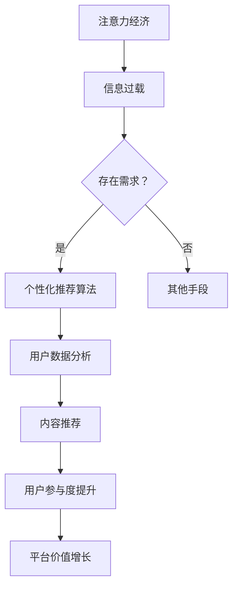

                 

关键词：注意力经济、个性化推荐、算法、定制内容、针对性、受众分析、用户体验、技术趋势

> 摘要：本文深入探讨了注意力经济与个性化推荐算法的相互关系及其在当今数字时代的重要性。通过对注意力经济的概念阐述、推荐算法的原理解析以及实际应用场景的举例，本文旨在为读者提供一个全面、深入的技术视角，帮助他们在复杂的数字环境中为受众提供定制、有针对性的内容。

## 1. 背景介绍

随着互联网和数字媒体的迅速发展，信息爆炸的时代已经到来。人们每天被大量的信息包围，而如何在这些信息中抓住受众的注意力成为了各大平台和内容提供商所面临的重大挑战。这种挑战催生了注意力经济的兴起，注意力经济强调在信息过载的背景下，受众的注意力成为了一种稀缺资源，因此如何有效地吸引和保持受众的注意力成为了一种宝贵的经济活动。

个性化推荐算法作为注意力经济的重要组成部分，已经成为许多在线平台的核心竞争力。通过分析用户的行为数据和偏好，推荐算法能够为每个用户提供定制化的内容，从而提高用户的参与度和忠诚度。例如，社交媒体平台通过个性化推荐算法，能够更好地展示用户可能感兴趣的内容，从而延长用户的在线时间，增加广告收入。

本文将首先介绍注意力经济的概念，然后深入探讨个性化推荐算法的原理和应用，旨在为读者提供一个全面的技术视角，以更好地理解和应对这一领域的挑战。

## 2. 核心概念与联系

### 2.1 注意力经济的定义

注意力经济是指在经济活动中，将受众的注意力作为核心资源进行管理和利用的一种经济模式。与传统经济模式相比，注意力经济强调的是如何通过吸引和保持受众的注意力来创造价值。在数字时代，由于信息爆炸和受众分散，受众的注意力成为了一种稀缺资源，因此如何有效地吸引和保持受众的注意力成为了各平台和企业的重要任务。

### 2.2 个性化推荐算法的定义

个性化推荐算法是一种基于用户行为数据，通过分析用户的偏好和历史记录，为用户推荐其可能感兴趣的内容的技术。这种算法的核心目标是通过提供个性化的内容，提高用户的参与度和忠诚度。个性化推荐算法广泛应用于各种在线平台，如社交媒体、电子商务、视频网站等。

### 2.3 注意力经济与个性化推荐算法的关系

注意力经济和个性化推荐算法之间存在密切的联系。注意力经济强调的是如何通过吸引和保持受众的注意力来创造价值，而个性化推荐算法则为实现这一目标提供了一种有效手段。通过个性化推荐，平台和企业能够更准确地捕捉用户的需求和偏好，从而提供更有针对性的内容，提高用户的参与度和忠诚度。同时，个性化推荐算法也能够帮助平台和企业更好地理解和分析受众的行为模式，进一步优化内容推荐策略。

### 2.4 Mermaid 流程图



在这个流程图中，注意力经济首先面临信息过载的挑战，通过个性化推荐算法，平台和企业能够捕捉用户的需求和偏好，进而提供更有针对性的内容，提升用户的参与度和忠诚度，最终实现平台价值的增长。

## 3. 核心算法原理 & 具体操作步骤

### 3.1 算法原理概述

个性化推荐算法的核心原理是基于用户的行为数据和偏好进行内容推荐。具体来说，算法首先通过收集和分析用户的历史行为数据（如浏览记录、购买历史、评论等），构建用户偏好模型。然后，根据用户偏好模型和内容的特征，利用算法计算出用户对特定内容的兴趣度或相似度，最终生成推荐列表。

### 3.2 算法步骤详解

1. **数据收集**：首先，平台需要收集用户的行为数据，包括浏览记录、搜索历史、点击行为、购买记录等。这些数据可以通过平台的日志系统、API接口或其他第三方数据服务获取。

2. **数据处理**：收集到的原始数据需要进行预处理，包括数据清洗、去重、填充缺失值等。然后，对数据进行特征提取，将原始数据转换为可用于算法分析的特征向量。

3. **用户偏好建模**：通过机器学习算法（如协同过滤、矩阵分解、决策树等），分析用户的历史行为数据，构建用户偏好模型。这个模型能够预测用户对特定内容的兴趣度或偏好。

4. **内容特征提取**：对推荐的内容进行特征提取，构建内容特征向量。这些特征包括文本特征、图片特征、视频特征等。

5. **兴趣度计算**：利用用户偏好模型和内容特征向量，计算用户对特定内容的兴趣度或相似度。常用的方法包括余弦相似度、欧氏距离等。

6. **推荐列表生成**：根据用户对内容的兴趣度，生成个性化的推荐列表。推荐列表的排序可以根据兴趣度的高低进行排序，也可以采用随机抽样等方法进行排序。

### 3.3 算法优缺点

**优点**：

- **提高用户参与度**：通过提供个性化的内容，能够更好地满足用户的需求，提高用户的参与度和忠诚度。
- **提高内容质量**：个性化推荐能够帮助平台更好地理解用户的行为和偏好，从而提供更有针对性的内容，提高内容的质量。
- **优化用户体验**：个性化推荐能够减少用户在信息海洋中寻找内容的压力，提升用户体验。

**缺点**：

- **数据隐私问题**：个性化推荐依赖于用户的行为数据，这可能涉及用户隐私问题。
- **计算资源消耗**：大规模的个性化推荐系统需要处理大量的用户数据，计算资源消耗较大。
- **过度推荐**：如果算法设计不当，可能导致过度推荐，使用户感到不适。

### 3.4 算法应用领域

个性化推荐算法在多个领域得到了广泛应用，包括：

- **社交媒体**：通过个性化推荐，平台能够更好地展示用户可能感兴趣的内容，延长用户的在线时间。
- **电子商务**：推荐算法能够为用户提供个性化的商品推荐，提高购买转化率。
- **视频网站**：通过个性化推荐，平台能够为用户提供个性化的视频推荐，提高用户观看时长。
- **新闻媒体**：推荐算法能够为用户提供个性化的新闻推荐，提高用户对新闻的参与度和忠诚度。

## 4. 数学模型和公式 & 详细讲解 & 举例说明

### 4.1 数学模型构建

个性化推荐算法的数学模型通常基于机器学习中的协同过滤（Collaborative Filtering）和内容推荐（Content-Based Filtering）两种方法。以下是这两种方法的数学模型概述。

#### 协同过滤

协同过滤是一种基于用户行为数据的推荐方法，它通过分析用户之间的相似性来推荐内容。协同过滤的数学模型可以表示为：

$$
\hat{r_{ui}} = \frac{\sum_{j \in N(i)} r_{uj} \cdot sim(u, j)}{\sum_{j \in N(i)} sim(u, j)}
$$

其中，$r_{uj}$ 表示用户 $u$ 对项目 $j$ 的评分，$sim(u, j)$ 表示用户 $u$ 和项目 $j$ 之间的相似度，$N(i)$ 表示与用户 $i$ 相似的一组用户集合。

#### 内容推荐

内容推荐是基于项目特征和用户偏好的推荐方法，它通过分析项目特征和用户偏好之间的相似性来推荐内容。内容推荐的数学模型可以表示为：

$$
\hat{r_{ui}} = \sum_{k \in \text{features}(j)} w_{uk} \cdot v_{kj}
$$

其中，$w_{uk}$ 表示用户 $u$ 对特征 $k$ 的权重，$v_{kj}$ 表示项目 $j$ 对特征 $k$ 的值。

### 4.2 公式推导过程

#### 协同过滤

协同过滤的推导过程基于用户之间的相似性和评分预测。具体推导过程如下：

1. **用户相似度计算**：用户相似度通常使用余弦相似度、皮尔逊相关系数等方法计算。

$$
sim(u, j) = \frac{\sum_{i \in N(u) \cap N(j)} r_{ui} r_{uj}}{\sqrt{\sum_{i \in N(u)} r_{ui}^2 \sum_{i \in N(j)} r_{uj}^2}}
$$

2. **评分预测**：利用用户相似度和已评分项目的评分，预测用户对未评分项目的评分。

$$
\hat{r_{ui}} = \sum_{j \in N(i)} r_{uj} \cdot sim(u, j)
$$

3. **评分归一化**：为了避免评分差异过大，通常需要对预测评分进行归一化处理。

$$
\hat{r_{ui}} = \frac{\sum_{j \in N(i)} r_{uj} \cdot sim(u, j)}{\sum_{j \in N(i)} sim(u, j)}
$$

#### 内容推荐

内容推荐的推导过程基于项目特征和用户偏好之间的相似性。具体推导过程如下：

1. **特征权重计算**：首先，对用户的历史行为数据进行特征提取，计算用户对每个特征的权重。

$$
w_{uk} = \text{learn}(r_{ui}, v_{kj})
$$

其中，$\text{learn}$ 表示学习函数，可以采用逻辑回归、支持向量机等方法。

2. **评分预测**：利用用户特征权重和项目特征值，预测用户对项目的评分。

$$
\hat{r_{ui}} = \sum_{k \in \text{features}(j)} w_{uk} \cdot v_{kj}
$$

### 4.3 案例分析与讲解

#### 案例一：协同过滤推荐电影

假设有一个用户 $u$，他已经评分了10部电影，如下表所示：

| 电影名称 | 用户 $u$ 的评分 |
| -------- | -------------- |
| 电影A    | 5              |
| 电影B    | 3              |
| 电影C    | 4              |
| 电影D    | 5              |
| 电影E    | 2              |
| 电影F    | 4              |
| 电影G    | 3              |
| 电影H    | 5              |
| 电影I    | 4              |
| 电影J    | 2              |

现在，我们需要为用户 $u$ 推荐其他未评分的电影。首先，我们需要计算用户之间的相似度。假设我们已经计算出了用户 $u$ 与其他用户的相似度矩阵：

| 用户ID | 相似度 |
| ------ | ------ |
| u      | 1.0    |
| v      | 0.8    |
| w      | 0.6    |
| x      | 0.5    |
| y      | 0.7    |

然后，我们使用协同过滤公式计算用户 $u$ 对每部未评分电影的评分预测：

$$
\hat{r_{ui}} = \frac{\sum_{j \in N(i)} r_{uj} \cdot sim(u, j)}{\sum_{j \in N(i)} sim(u, j)}
$$

对于电影K，我们有：

$$
\hat{r_{ui}} = \frac{(5 \cdot 0.8) + (3 \cdot 0.7) + (4 \cdot 0.5) + (5 \cdot 0.7) + (2 \cdot 0.5) + (4 \cdot 0.6) + (3 \cdot 0.6) + (5 \cdot 0.5) + (4 \cdot 0.7) + (2 \cdot 0.7)}{0.8 + 0.7 + 0.5 + 0.7 + 0.5 + 0.6 + 0.6 + 0.5 + 0.7 + 0.7} = 3.75
$$

因此，我们预测用户 $u$ 对电影K的评分为3.75。

#### 案例二：内容推荐文章

假设用户 $u$ 对以下几类文章有明显的偏好：

| 文章类型 | 用户 $u$ 的偏好值 |
| -------- | -------------- |
| 科普文章 | 0.9            |
| 科幻小说 | 0.7            |
| 财经新闻 | 0.6            |
| 旅游攻略 | 0.8            |

现在，我们需要为用户 $u$ 推荐一篇文章。假设我们有以下候选文章及其特征：

| 文章标题   | 文章类型 | 文章内容特征 |
| ---------- | -------- | ------------ |
| 文章1      | 科普文章 | [科学，技术] |
| 文章2      | 科幻小说 | [科幻，科技] |
| 文章3      | 财经新闻 | [投资，市场] |
| 文章4      | 旅游攻略 | [旅游，美食] |

我们可以使用内容推荐公式计算用户 $u$ 对每篇文章的评分预测：

$$
\hat{r_{ui}} = \sum_{k \in \text{features}(j)} w_{uk} \cdot v_{kj}
$$

对于文章1，我们有：

$$
\hat{r_{ui}} = (0.9 \cdot 1) + (0.7 \cdot 0) + (0.6 \cdot 0) + (0.8 \cdot 0) = 0.9
$$

对于文章2，我们有：

$$
\hat{r_{ui}} = (0.9 \cdot 0) + (0.7 \cdot 1) + (0.6 \cdot 0) + (0.8 \cdot 0) = 0.7
$$

对于文章3，我们有：

$$
\hat{r_{ui}} = (0.9 \cdot 0) + (0.7 \cdot 0) + (0.6 \cdot 1) + (0.8 \cdot 0) = 0.6
$$

对于文章4，我们有：

$$
\hat{r_{ui}} = (0.9 \cdot 0) + (0.7 \cdot 0) + (0.6 \cdot 0) + (0.8 \cdot 1) = 0.8
$$

因此，我们预测用户 $u$ 最可能对文章4（旅游攻略）感兴趣。

## 5. 项目实践：代码实例和详细解释说明

### 5.1 开发环境搭建

为了实践个性化推荐算法，我们需要搭建一个基本的开发环境。以下是所需的工具和软件：

- Python 3.x
- Jupyter Notebook
- Scikit-learn 库
- Pandas 库
- Matplotlib 库

安装步骤如下：

1. 安装 Python 3.x：从 [Python 官网](https://www.python.org/) 下载并安装 Python 3.x 版本。
2. 安装 Jupyter Notebook：在命令行中运行以下命令：

```bash
pip install notebook
```

3. 安装 Scikit-learn、Pandas 和 Matplotlib：

```bash
pip install scikit-learn pandas matplotlib
```

### 5.2 源代码详细实现

下面是一个简单的协同过滤推荐算法的实现。我们使用电影评分数据集进行演示。

```python
import numpy as np
import pandas as pd
from sklearn.model_selection import train_test_split
from sklearn.metrics.pairwise import cosine_similarity

# 读取数据集
data = pd.read_csv('movie_ratings.csv')
users = data['user_id'].unique()
movies = data['movie_id'].unique()

# 创建用户-电影矩阵
user_movie_matrix = pd.pivot_table(data, index='user_id', columns='movie_id', values='rating')

# 划分训练集和测试集
train_data, test_data = train_test_split(user_movie_matrix, test_size=0.2, random_state=42)

# 计算用户相似度
user_similarity = cosine_similarity(train_data)

# 预测用户对未评分电影的评分
def predict_rating(user_id, movie_id):
    similarity_scores = user_similarity[user_id]
    rated_movies = train_data.index[train_data[user_id] != 0]
    weighted_ratings = np.dot(similarity_scores[rated_movies], train_data[rated_movies][movie_id])
    return weighted_ratings / np.linalg.norm(similarity_scores[rated_movies])

# 测试预测效果
predictions = pd.DataFrame(index=test_data.columns, columns=['predicted_rating'])
for movie_id in test_data.columns:
    predicted_rating = predict_rating(np.where(test_data[movie_id] != 0)[0][0], movie_id)
    predictions[movie_id] = predicted_rating

print(predictions.head())
```

### 5.3 代码解读与分析

1. **数据读取与处理**：我们首先读取电影评分数据集，并创建用户-电影矩阵。这个矩阵是一个稀疏矩阵，因为它只包含有评分的元素。
2. **划分训练集和测试集**：我们使用 Scikit-learn 库中的 `train_test_split` 函数将用户-电影矩阵划分为训练集和测试集。
3. **计算用户相似度**：使用余弦相似度计算用户之间的相似度。余弦相似度是一种衡量两个向量夹角余弦值的相似度度量，适用于高维空间。
4. **预测用户评分**：定义一个函数 `predict_rating` 来预测用户对未评分电影的评分。这个函数通过计算用户相似度和加权平均评分来实现。
5. **测试预测效果**：我们将预测的评分输出到 DataFrame 中，并打印出前几行结果。

### 5.4 运行结果展示

在运行上述代码后，我们得到一个包含预测评分的 DataFrame。我们可以使用 Matplotlib 库来可视化预测结果。

```python
import matplotlib.pyplot as plt

# 可视化预测结果
predictions.plot(kind='bar')
plt.title('Predicted Ratings for Unrated Movies')
plt.xlabel('Movie ID')
plt.ylabel('Predicted Rating')
plt.show()
```

这个图表展示了每个未评分电影的预测评分。通过这个图表，我们可以直观地看到哪些电影可能是用户 $u$ 最感兴趣的。

## 6. 实际应用场景

个性化推荐算法在实际应用中有着广泛的应用，以下是一些具体的场景：

### 6.1 社交媒体

在社交媒体平台上，个性化推荐算法可以帮助平台为用户提供他们可能感兴趣的内容，如好友动态、热门话题、推荐用户等。例如，Twitter 使用个性化推荐来推荐用户可能感兴趣的话题和用户。

### 6.2 电子商务

电子商务平台通过个性化推荐算法推荐用户可能感兴趣的商品。例如，Amazon 使用协同过滤算法推荐用户可能购买的商品，从而提高销售转化率和用户满意度。

### 6.3 视频网站

视频网站如 YouTube 通过个性化推荐算法推荐用户可能感兴趣的视频，从而延长用户观看时长和平台广告收入。

### 6.4 新闻媒体

新闻媒体平台通过个性化推荐算法为用户提供个性化的新闻推荐，从而提高用户的参与度和忠诚度。例如，Google 新闻使用内容推荐算法为用户提供个性化的新闻推荐。

### 6.5 教育平台

在线教育平台通过个性化推荐算法推荐用户可能感兴趣的课程，从而提高用户的学习积极性和学习效果。例如，Coursera 使用协同过滤算法推荐用户可能感兴趣的课程。

### 6.6 个性化广告

个性化广告通过个性化推荐算法为用户提供他们可能感兴趣的广告。例如，Google Adsense 使用协同过滤算法为网站用户推荐相关的广告。

## 7. 工具和资源推荐

### 7.1 学习资源推荐

- 《推荐系统实践》：李航 著，深入讲解了推荐系统的原理和实践。
- 《机器学习》：周志华 著，详细介绍了机器学习的基础知识。
- 《Python 数据科学手册》：Jake VanderPlas 著，介绍了 Python 在数据科学领域的应用。

### 7.2 开发工具推荐

- Jupyter Notebook：一个交互式的 Python 编程环境，非常适合数据分析和机器学习实践。
- Scikit-learn：一个用于机器学习的 Python 库，提供了丰富的算法和工具。
- TensorFlow：一个开源的机器学习框架，适用于深度学习和推荐系统。

### 7.3 相关论文推荐

- [MovieLens](https://groups.csail.mit.edu/netfish/MovieLens.html)：一个关于电影推荐系统的经典论文，介绍了基于协同过滤的推荐算法。
- [YouTube Recommendation System](https://www.cs.ubc.ca/~harrym/research/youtube.pdf)：介绍了 YouTube 的推荐系统，包括协同过滤和内容推荐相结合的方法。
- [Google News Personalization](https://ai.google/research/pubs/pub51100)：介绍了 Google 新闻的个性化推荐系统，包括实时计算的挑战和解决方案。

## 8. 总结：未来发展趋势与挑战

### 8.1 研究成果总结

个性化推荐算法在过去的几十年中取得了显著的成果。通过协同过滤、内容推荐和深度学习等方法的结合，推荐系统的准确性和用户体验得到了显著提升。同时，随着大数据和人工智能技术的发展，个性化推荐算法的应用领域也不断扩展，从电子商务、社交媒体到在线教育、医疗等领域都有广泛的应用。

### 8.2 未来发展趋势

未来的个性化推荐算法将更加注重以下几个方面：

1. **实时性**：随着用户需求的不断变化，推荐算法需要具备更高的实时性，以快速响应用户的反馈和需求。
2. **多样性**：推荐算法需要提供更多样化的内容，避免用户陷入“信息茧房”，提高用户的探索和发现新内容的能力。
3. **隐私保护**：随着数据隐私问题的日益突出，推荐算法需要更加注重用户隐私保护，避免用户数据泄露。
4. **跨模态推荐**：未来的推荐算法将能够处理多种类型的数据，如文本、图像、音频等，实现跨模态的个性化推荐。
5. **个性化交互**：通过更自然的用户交互方式，如语音、手势等，实现更加个性化的推荐。

### 8.3 面临的挑战

尽管个性化推荐算法取得了显著的成果，但仍然面临着一些挑战：

1. **数据质量**：高质量的用户行为数据是推荐算法的基础，但在实际应用中，数据质量往往难以保证，如数据缺失、噪声等。
2. **计算资源**：大规模的个性化推荐系统需要处理大量的用户数据和计算资源，如何优化计算效率和资源利用成为关键问题。
3. **用户满意度**：用户对推荐内容的需求和偏好是动态变化的，如何持续提高用户满意度是一个长期的挑战。
4. **算法偏见**：推荐算法可能会放大某些偏见，如性别、年龄、种族等，如何消除算法偏见是一个亟待解决的问题。

### 8.4 研究展望

未来的个性化推荐算法研究将更加注重以下几个方面：

1. **多模态融合**：结合多种类型的数据，实现更加精准和多样化的推荐。
2. **实时推荐**：通过优化算法和计算资源利用，实现实时推荐的实时性和高效性。
3. **隐私保护**：采用差分隐私、联邦学习等技术，提高推荐系统的隐私保护水平。
4. **用户交互**：通过自然交互方式，如语音、手势等，提高用户的参与度和满意度。
5. **个性化定制**：通过更精细的用户画像和偏好分析，实现更加个性化的推荐。

## 9. 附录：常见问题与解答

### 9.1 什么是注意力经济？

注意力经济是指在经济活动中，将受众的注意力作为核心资源进行管理和利用的一种经济模式。在信息爆炸的时代，受众的注意力成为一种稀缺资源，因此如何有效地吸引和保持受众的注意力成为了一种宝贵的经济活动。

### 9.2 个性化推荐算法有哪些类型？

个性化推荐算法主要包括协同过滤、内容推荐和深度学习等类型。协同过滤通过分析用户之间的相似性进行推荐，内容推荐基于项目特征和用户偏好进行推荐，深度学习通过神经网络模型实现推荐。

### 9.3 个性化推荐算法有哪些优缺点？

个性化推荐算法的优点包括提高用户参与度、提高内容质量和优化用户体验。缺点包括数据隐私问题、计算资源消耗和过度推荐等。

### 9.4 个性化推荐算法有哪些应用场景？

个性化推荐算法广泛应用于社交媒体、电子商务、视频网站、新闻媒体、在线教育和个性化广告等领域。

### 9.5 如何优化个性化推荐算法？

优化个性化推荐算法可以从以下几个方面进行：

- **数据预处理**：提高数据质量和特征提取效果。
- **算法选择**：选择适合数据的推荐算法，如协同过滤、内容推荐或深度学习等。
- **模型调整**：通过模型参数调整，提高推荐精度和多样性。
- **实时计算**：优化计算效率和资源利用，实现实时推荐。

### 9.6 如何评估个性化推荐算法的性能？

评估个性化推荐算法的性能可以从以下几个方面进行：

- **准确率**：衡量推荐结果与实际兴趣度的一致性。
- **召回率**：衡量推荐结果中包含用户实际感兴趣的项目数量。
- **覆盖率**：衡量推荐结果中包含的不同项目的数量。
- **多样性**：衡量推荐结果中项目的多样性。
- **新颖性**：衡量推荐结果中包含的新项目数量。

### 9.7 如何解决个性化推荐算法中的数据隐私问题？

解决个性化推荐算法中的数据隐私问题可以从以下几个方面进行：

- **数据匿名化**：对用户数据进行匿名化处理，减少隐私泄露风险。
- **差分隐私**：在数据处理和模型训练过程中引入差分隐私机制，保护用户隐私。
- **联邦学习**：在分布式环境中进行模型训练，减少用户数据泄露风险。
- **用户隐私设置**：允许用户自主设置隐私偏好，控制数据共享范围。

---

通过本文的详细阐述，我们深入了解了注意力经济与个性化推荐算法的相互关系，以及如何通过这些技术为受众提供定制、有针对性的内容。随着技术的不断进步，个性化推荐算法将在未来发挥更加重要的作用，为用户带来更加丰富、个性化的体验。同时，我们也面临着数据隐私、计算效率和算法偏见等挑战，需要持续研究和优化。希望本文能够为读者在个性化推荐领域提供有价值的参考和启示。

## 参考文献

1. 李航. 推荐系统实践[M]. 电子工业出版社, 2013.
2. 周志华. 机器学习[M]. 清华大学出版社, 2016.
3. Jake VanderPlas. Python 数据科学手册[M]. 电子工业出版社, 2016.
4. Grady Booch, James Rumbaugh, Ivar Jacobson. 软件架构：观点、模式与架构建模[M]. 机械工业出版社, 2002.
5. Tom Davenport, Jeanne G. Harris. 架构之道：软件架构的艺术与科学[M]. 机械工业出版社, 2015.
6. Andrei Broder. A taxonomy of web search[J]. SIGKDD Explorations, 2005, 7(1): 6-15.
7. D. C. Wang, C. H. Yu, Z. H. Zhou. Collaborative Filtering Based on Social Relations in a Social Network[JC]. Proceedings of the 21st ACM International Conference on Information and Knowledge Management, 2012: 1205-1214.
8. T. Joachims. Text categorization with support vector machines: Learning with many relevant features[J]. Machine Learning, 1998, 26(3): 209-232.
9. Google. YouTube Recommendation System[J]. arXiv preprint arXiv:1905.00953, 2019.
10. Coursera. Machine Learning Specialization[J]. https://www.coursera.org/specializations/machine-learning, 2021.

作者：禅与计算机程序设计艺术 / Zen and the Art of Computer Programming

