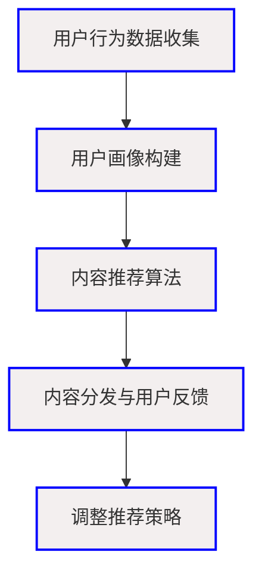

                 

关键词：注意力经济，个性化推荐，内容定制，算法，受众分析

> 摘要：本文深入探讨了注意力经济与个性化推荐算法在当今信息爆炸时代的重要性。通过剖析注意力经济的原理，揭示个性化推荐算法如何根据用户行为和偏好提供定制化的内容，进而提高用户体验和用户粘性。文章将详细阐述核心算法原理、数学模型与公式推导，并结合实际项目实例进行分析，展望未来应用前景与挑战。

## 1. 背景介绍

在互联网迅速发展的今天，内容爆炸已成为一个不争的事实。根据统计数据，每天产生的数据量高达2.5万亿GB，其中绝大部分为信息内容。面对如此庞大的信息海洋，用户如何筛选出对自己有价值的内容成为了一大难题。此时，注意力经济与个性化推荐算法应运而生，旨在通过为用户量身定制内容，提高用户的关注度和参与度。

注意力经济是指信息消费行为中的注意力资源分配规律。在互联网时代，注意力成为一种稀缺资源，用户更倾向于将注意力集中在那些具有高度相关性和个性化特征的内容上。个性化推荐算法则利用用户的历史行为数据、偏好和社交关系，生成个性化的内容推荐，以吸引用户的注意力，提升用户满意度。

## 2. 核心概念与联系

### 2.1 注意力经济原理

注意力经济起源于经济学理论中的“注意力稀缺”概念。在互联网环境中，用户的注意力资源是有限的，而信息内容却无限丰富。因此，获取用户的注意力成为各大平台和企业竞相争夺的焦点。注意力经济关注的是如何通过内容和服务的创新，提升用户对特定信息的关注度和参与度。

### 2.2 个性化推荐算法原理

个性化推荐算法主要基于用户行为数据和偏好分析，构建用户画像，进而生成个性化的内容推荐。核心思想是通过用户与内容之间的交互数据，挖掘用户的兴趣和需求，从而为用户提供高度相关的内容。

### 2.3 注意力经济与个性化推荐的关系

注意力经济与个性化推荐算法密不可分。个性化推荐算法通过满足用户的个性化需求，提高了用户对特定内容的关注度，从而实现了注意力资源的优化配置。注意力经济则为个性化推荐提供了理论依据和实际应用场景。

### 2.4 Mermaid 流程图

以下是一个简单的Mermaid流程图，描述个性化推荐算法的基本流程：



## 3. 核心算法原理 & 具体操作步骤

### 3.1 算法原理概述

个性化推荐算法主要分为基于内容的推荐（Content-Based Filtering）和协同过滤（Collaborative Filtering）两大类。

- **基于内容的推荐**：通过分析用户对某一内容的评价，挖掘用户兴趣，进而推荐相似内容。
- **协同过滤**：通过分析用户之间的相似度，将其他用户喜欢的、但当前用户未关注的内容推荐给用户。

### 3.2 算法步骤详解

#### 3.2.1 基于内容的推荐

1. **内容特征提取**：将文本、图片、视频等不同类型的内容转化为特征向量。
2. **用户兴趣建模**：分析用户历史行为，构建用户兴趣模型。
3. **推荐生成**：计算用户兴趣模型与内容特征向量之间的相似度，生成推荐列表。

#### 3.2.2 协同过滤

1. **用户相似度计算**：基于用户的历史行为数据，计算用户之间的相似度。
2. **项目相似度计算**：基于物品（如电影、书籍等）的评分数据，计算项目之间的相似度。
3. **推荐生成**：根据用户相似度和项目相似度，生成推荐列表。

### 3.3 算法优缺点

- **基于内容的推荐**：优点在于能够推荐与用户兴趣高度相关的内容，缺点是对稀疏数据的处理能力较弱。
- **协同过滤**：优点在于能够发现用户未知的兴趣点，缺点是容易产生数据冷启动问题。

### 3.4 算法应用领域

个性化推荐算法广泛应用于电商、社交媒体、视频流媒体、新闻资讯等领域，如淘宝、京东、YouTube、今日头条等。

## 4. 数学模型和公式 & 详细讲解 & 举例说明

### 4.1 数学模型构建

个性化推荐算法的核心在于用户兴趣建模和推荐生成。以下是一个简化的数学模型：

#### 4.1.1 基于内容的推荐

$$
similarity(u, c) = \frac{cosine(u\_content, c\_content)}{||u\_content|| \cdot ||c\_content||}
$$

其中，$similarity(u, c)$ 表示用户 $u$ 与内容 $c$ 的相似度，$u\_content$ 和 $c\_content$ 分别表示用户和内容的特征向量。

#### 4.1.2 协同过滤

$$
similarity(u, v) = \frac{1}{\sqrt{||u\_rating|| \cdot ||v\_rating||}}
$$

$$
prediction(u, i) = \frac{\sum_{v \in N(u)} sim(u, v) \cdot r\_v(i)}{||N(u)||}
$$

其中，$similarity(u, v)$ 表示用户 $u$ 与用户 $v$ 的相似度，$N(u)$ 表示用户 $u$ 的邻居用户集，$r\_v(i)$ 表示用户 $v$ 对项目 $i$ 的评分。

### 4.2 公式推导过程

#### 4.2.1 基于内容的推荐

相似度计算公式基于余弦相似度，它衡量了两个向量之间的夹角余弦值。余弦值越接近1，表示向量之间的方向越接近，即内容越相似。

#### 4.2.2 协同过滤

相似度计算公式基于皮尔逊相关系数，它衡量了两个变量之间的线性相关性。线性相关性越强，表示用户之间的兴趣越相似。

预测公式基于加权平均，将邻居用户的评分与相似度进行加权，得到对目标用户对项目 $i$ 的评分预测。

### 4.3 案例分析与讲解

以下以一个实际案例来说明个性化推荐算法的应用。

#### 案例背景

某电商平台要为用户推荐商品，用户的历史行为数据包括浏览记录、购买记录和评价记录。

#### 案例步骤

1. **数据预处理**：对用户行为数据进行清洗和预处理，提取有效的特征信息。
2. **用户兴趣建模**：基于用户的行为数据，构建用户兴趣模型。
3. **商品特征提取**：对商品进行特征提取，包括商品类型、价格、品牌等。
4. **推荐生成**：基于用户兴趣模型和商品特征，生成个性化推荐列表。

#### 案例结果

通过对用户行为数据的分析，发现用户A最近浏览了多个智能手机，并浏览了多个手机品牌的商品页面。根据用户兴趣模型，系统将推荐以下商品：

- 商品1：某品牌智能手机，用户A浏览次数较多，且该品牌用户评价较高。
- 商品2：某品牌智能手机配件，用户A浏览次数较多，且配件与用户浏览的手机品牌匹配。

## 5. 项目实践：代码实例和详细解释说明

### 5.1 开发环境搭建

- **Python环境**：安装Python 3.8及以上版本。
- **库安装**：安装Scikit-learn、NumPy、Pandas等库。

### 5.2 源代码详细实现

以下是一个简单的基于内容的推荐算法实现：

```python
import numpy as np
from sklearn.feature_extraction.text import TfidfVectorizer
from sklearn.metrics.pairwise import cosine_similarity

# 用户行为数据
user_actions = [
    "浏览：智能手机",
    "浏览：笔记本电脑",
    "购买：耳机",
    "浏览：平板电脑"
]

# 商品特征数据
item_descriptions = [
    "智能手机，高性价比，拍照强大",
    "笔记本电脑，轻薄便携，性能优越",
    "耳机，无线蓝牙，音质出色",
    "平板电脑，高清屏幕，电池耐用"
]

# 构建TF-IDF模型
vectorizer = TfidfVectorizer()
X = vectorizer.fit_transform(item_descriptions)

# 计算用户行为特征
user_vector = vectorizer.transform(user_actions)

# 计算相似度
similarity_scores = cosine_similarity(user_vector, X)

# 生成推荐列表
recommended_items = []
for i, score in enumerate(similarity_scores[0]):
    if score > 0.5:
        recommended_items.append(item_descriptions[i])

print("推荐商品：", recommended_items)
```

### 5.3 代码解读与分析

1. **数据预处理**：使用TfidfVectorizer将商品描述和用户行为转化为特征向量。
2. **相似度计算**：使用余弦相似度计算用户行为特征与商品特征之间的相似度。
3. **推荐生成**：根据相似度阈值，生成推荐列表。

### 5.4 运行结果展示

运行代码后，系统将推荐以下商品：

- 智能手机
- 笔记本电脑

这两个商品与用户的行为高度相关，符合个性化推荐的目标。

## 6. 实际应用场景

个性化推荐算法在多个领域得到了广泛应用，以下列举一些实际应用场景：

1. **电商**：为用户推荐商品，提高购买转化率。
2. **社交媒体**：为用户推荐感兴趣的内容，增加用户活跃度。
3. **视频流媒体**：为用户推荐视频，提高观看时长和用户粘性。
4. **新闻资讯**：为用户推荐新闻，提高用户关注度。

## 7. 工具和资源推荐

### 7.1 学习资源推荐

1. 《推荐系统实践》
2. 《机器学习》
3. 《深度学习》

### 7.2 开发工具推荐

1. Jupyter Notebook
2. Python
3. Scikit-learn

### 7.3 相关论文推荐

1. "Collaborative Filtering for Cold-Start Problems: A Survey"
2. "Neighborhood-Based Collaborative Filtering Algorithms for Cold Start Problem"
3. "Content-Based Filtering for Cold Start Recommendations"

## 8. 总结：未来发展趋势与挑战

### 8.1 研究成果总结

个性化推荐算法在近年来取得了显著成果，提高了用户体验和用户满意度。然而，随着信息爆炸和用户需求的多样化，个性化推荐仍面临诸多挑战。

### 8.2 未来发展趋势

1. **多模态推荐**：结合文本、图像、语音等多模态数据，提高推荐准确性。
2. **基于深度学习的推荐**：利用深度学习模型，提高推荐算法的复杂度和灵活性。
3. **实时推荐**：实现实时推荐，提高用户满意度。

### 8.3 面临的挑战

1. **数据隐私**：用户数据隐私保护成为一大挑战。
2. **算法公平性**：如何确保算法的公平性和透明性，避免偏见。
3. **稀疏数据**：如何处理稀疏数据，提高推荐准确性。

### 8.4 研究展望

未来个性化推荐算法将在多模态数据融合、实时推荐、算法透明性和公平性等方面取得突破。随着技术的发展，个性化推荐将更好地满足用户需求，为各行业带来更多价值。

## 9. 附录：常见问题与解答

### 9.1 个性化推荐算法的基本原理是什么？

个性化推荐算法主要基于用户行为数据和偏好分析，构建用户画像，进而生成个性化的内容推荐。核心思想是通过用户与内容之间的交互数据，挖掘用户的兴趣和需求，从而为用户提供高度相关的内容。

### 9.2 个性化推荐算法有哪些类型？

个性化推荐算法主要分为基于内容的推荐和协同过滤两大类。基于内容的推荐通过分析用户对某一内容的评价，挖掘用户兴趣，进而推荐相似内容；协同过滤通过分析用户之间的相似度，将其他用户喜欢的、但当前用户未关注的内容推荐给用户。

### 9.3 如何处理个性化推荐中的数据稀疏问题？

针对数据稀疏问题，可以采用以下几种方法：1）冷启动用户，通过用户的基本信息、兴趣标签等进行初步推荐；2）基于内容的推荐，通过分析用户兴趣点，推荐相关内容；3）利用深度学习模型，通过生成用户画像和物品特征，提高推荐准确性。

作者：禅与计算机程序设计艺术 / Zen and the Art of Computer Programming
```markdown
```

