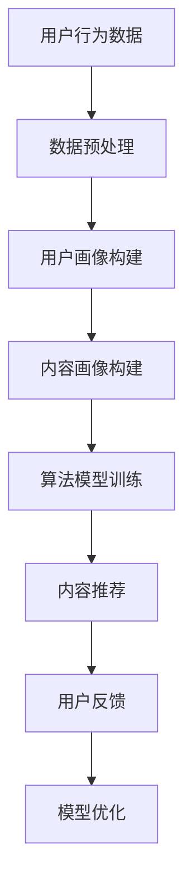

                 

关键词：注意力经济、个性化推荐、算法、内容定制、受众分析

> 摘要：随着互联网的迅速发展，用户生成的内容爆炸式增长，如何有效地吸引用户的注意力成为各大平台和企业关注的焦点。本文将探讨注意力经济与个性化推荐算法的结合，通过分析用户行为，为用户提供定制、有针对性的内容，提升用户体验和内容消费效率。

## 1. 背景介绍

在互联网时代，信息过载已成为普遍现象。用户每天面临大量的信息，其中不乏冗余和低质量的内容。而如何在海量的信息中脱颖而出，吸引用户的注意力，成为企业和平台必须面对的挑战。此时，注意力经济理论为我们提供了一种新的思路。注意力经济强调，用户的时间和注意力是有限的，而内容提供者需要通过有效的方式争夺用户的注意力资源。

个性化推荐算法作为一种基于数据分析的技术手段，旨在根据用户的兴趣和行为，为其推荐最相关的内容。这一技术的核心在于理解用户，精准地为他们提供所需的信息。随着机器学习、数据挖掘等技术的发展，个性化推荐算法逐渐成为互联网企业提高用户粘性和转化率的重要手段。

本文将结合注意力经济与个性化推荐算法，探讨如何为用户提供定制、有针对性的内容，提高内容消费效率，实现企业和平台的商业价值。

## 2. 核心概念与联系

### 2.1 注意力经济

注意力经济是指在经济活动中，用户对信息的关注度和关注度作为衡量价值的核心指标。其核心理念是，用户的注意力资源是有限的，而内容提供者需要通过吸引和保持用户的注意力来创造价值。

### 2.2 个性化推荐算法

个性化推荐算法是一种基于用户行为和兴趣的数据分析技术，通过挖掘用户的历史行为和偏好，为用户推荐符合其兴趣的内容。其核心在于构建用户画像和内容画像，利用算法模型实现精准匹配。

### 2.3 注意力经济与个性化推荐算法的联系

注意力经济与个性化推荐算法的结合，使得内容提供者能够更加精准地定位用户需求，提高内容的吸引力和转化率。个性化推荐算法通过分析用户行为数据，了解用户兴趣，从而为用户提供定制化的内容，满足其注意力需求。而注意力经济则通过用户对内容的关注度和参与度，评估内容的价值和效果，为企业和平台提供反馈。

### 2.4 Mermaid 流程图



## 3. 核心算法原理 & 具体操作步骤

### 3.1 算法原理概述

个性化推荐算法主要分为基于内容的推荐（Content-based Filtering）和基于协同过滤（Collaborative Filtering）两大类。

- **基于内容的推荐**：通过分析内容属性，将具有相似属性的内容推荐给用户。其核心在于内容相似度计算。

- **基于协同过滤**：通过分析用户之间的行为相似性，为用户推荐其他用户喜欢的商品或内容。其核心在于用户相似度计算和基于用户的推荐。

### 3.2 算法步骤详解

#### 3.2.1 数据收集与预处理

1. **数据收集**：通过网站日志、用户行为数据、社交网络数据等渠道收集用户行为数据。
2. **数据预处理**：对收集到的数据进行清洗、去噪、去重复等处理，确保数据质量。

#### 3.2.2 用户画像构建

1. **兴趣标签提取**：根据用户行为数据，提取用户的兴趣标签，如搜索关键词、浏览记录等。
2. **用户行为特征提取**：通过统计用户行为数据，提取用户的行为特征，如浏览时间、浏览频次等。
3. **用户画像构建**：将用户兴趣标签和行为特征融合，形成用户画像。

#### 3.2.3 内容画像构建

1. **内容标签提取**：根据内容属性，提取内容标签，如文章分类、图片标签等。
2. **内容特征提取**：通过文本分析、图像识别等技术，提取内容特征。
3. **内容画像构建**：将内容标签和内容特征融合，形成内容画像。

#### 3.2.4 算法模型训练

1. **模型选择**：根据业务需求，选择合适的推荐算法模型，如基于内容的推荐、基于协同过滤的推荐等。
2. **模型训练**：使用用户画像和内容画像数据，训练推荐算法模型。
3. **模型评估**：通过交叉验证、A/B测试等方法，评估模型性能。

#### 3.2.5 内容推荐

1. **推荐策略选择**：根据用户画像和内容画像，选择合适的推荐策略，如基于内容的推荐、基于协同过滤的推荐等。
2. **推荐结果生成**：根据推荐策略，为用户生成推荐列表。

#### 3.2.6 用户反馈与模型优化

1. **用户反馈收集**：通过用户点击、收藏、点赞等行为，收集用户反馈。
2. **模型优化**：根据用户反馈，优化推荐算法模型。

### 3.3 算法优缺点

#### 3.3.1 优点

- **提高内容消费效率**：个性化推荐算法能够为用户推荐最相关的内容，提高内容消费效率。
- **提升用户体验**：通过定制化的内容推荐，满足用户个性化需求，提升用户体验。
- **降低信息过载**：个性化推荐算法能够过滤掉冗余信息，降低用户的信息过载。

#### 3.3.2 缺点

- **数据依赖性强**：个性化推荐算法依赖于用户行为数据，数据质量直接影响算法效果。
- **隐私保护问题**：用户行为数据的收集和使用涉及隐私保护问题，需要严格遵循相关法律法规。

### 3.4 算法应用领域

个性化推荐算法广泛应用于电子商务、社交媒体、在线教育、新闻资讯等众多领域。

- **电子商务**：为用户推荐符合其兴趣的商品，提高购物体验和转化率。
- **社交媒体**：为用户推荐感兴趣的朋友、话题和内容，增强用户粘性。
- **在线教育**：为用户推荐符合其学习需求和兴趣的课程，提高学习效果。
- **新闻资讯**：为用户推荐感兴趣的新闻话题和文章，提升用户阅读体验。

## 4. 数学模型和公式 & 详细讲解 & 举例说明

### 4.1 数学模型构建

个性化推荐算法的数学模型主要包括用户相似度计算、内容相似度计算和推荐结果生成等。

#### 4.1.1 用户相似度计算

用户相似度计算公式为：

$$
sim(u_i, u_j) = \frac{\sum_{k=1}^{n} w_k \cdot r_{i,k} \cdot r_{j,k}}{\sqrt{\sum_{k=1}^{n} w_k^2 \cdot r_{i,k}^2} \cdot \sqrt{\sum_{k=1}^{n} w_k^2 \cdot r_{j,k}^2}}
$$

其中，$u_i$ 和 $u_j$ 表示两个用户，$r_{i,k}$ 和 $r_{j,k}$ 分别表示用户 $u_i$ 对第 $k$ 个物品的评分，$w_k$ 表示第 $k$ 个物品的权重。

#### 4.1.2 内容相似度计算

内容相似度计算公式为：

$$
sim(c_i, c_j) = \frac{\sum_{k=1}^{n} w_k \cdot p_{i,k} \cdot p_{j,k}}{\sqrt{\sum_{k=1}^{n} w_k^2 \cdot p_{i,k}^2} \cdot \sqrt{\sum_{k=1}^{n} w_k^2 \cdot p_{j,k}^2}}
$$

其中，$c_i$ 和 $c_j$ 表示两个内容，$p_{i,k}$ 和 $p_{j,k}$ 分别表示内容 $c_i$ 的第 $k$ 个特征和内容 $c_j$ 的第 $k$ 个特征，$w_k$ 表示第 $k$ 个特征的权重。

#### 4.1.3 推荐结果生成

推荐结果生成公式为：

$$
r_{i,j} = sim(u_i, u_j) \cdot sim(c_i, c_j)
$$

其中，$r_{i,j}$ 表示用户 $u_i$ 对内容 $c_j$ 的预测评分。

### 4.2 公式推导过程

#### 4.2.1 用户相似度计算推导

用户相似度计算基于协同过滤算法，其核心思想是利用用户对物品的评分数据，计算用户之间的相似度。具体推导过程如下：

设用户 $u_i$ 和 $u_j$ 对物品的评分矩阵分别为 $R_i$ 和 $R_j$，则用户 $u_i$ 和 $u_j$ 的相似度计算公式为：

$$
sim(u_i, u_j) = \frac{\sum_{k=1}^{n} r_{i,k} \cdot r_{j,k}}{\|R_i\| \cdot \|R_j\|}
$$

其中，$r_{i,k}$ 和 $r_{j,k}$ 分别表示用户 $u_i$ 和 $u_j$ 对第 $k$ 个物品的评分，$\|R_i\|$ 和 $\|R_j\|$ 分别表示用户 $u_i$ 和 $u_j$ 的评分向量范数。

为了提高相似度的准确性，可以引入物品权重 $w_k$，使得用户对热门物品的评分在相似度计算中占更大的比重。因此，用户相似度计算公式可以调整为：

$$
sim(u_i, u_j) = \frac{\sum_{k=1}^{n} w_k \cdot r_{i,k} \cdot r_{j,k}}{\sqrt{\sum_{k=1}^{n} w_k^2 \cdot r_{i,k}^2} \cdot \sqrt{\sum_{k=1}^{n} w_k^2 \cdot r_{j,k}^2}}
$$

#### 4.2.2 内容相似度计算推导

内容相似度计算基于基于内容的推荐算法，其核心思想是利用物品的特征表示，计算物品之间的相似度。具体推导过程如下：

设物品 $c_i$ 和 $c_j$ 的特征向量分别为 $P_i$ 和 $P_j$，则物品 $c_i$ 和 $c_j$ 的相似度计算公式为：

$$
sim(c_i, c_j) = \frac{\sum_{k=1}^{n} p_{i,k} \cdot p_{j,k}}{\|P_i\| \cdot \|P_j\|}
$$

其中，$p_{i,k}$ 和 $p_{j,k}$ 分别表示物品 $c_i$ 的第 $k$ 个特征和物品 $c_j$ 的第 $k$ 个特征，$\|P_i\|$ 和 $\|P_j\|$ 分别表示物品 $c_i$ 和 $c_j$ 的特征向量范数。

为了提高相似度的准确性，可以引入特征权重 $w_k$，使得重要特征在相似度计算中占更大的比重。因此，内容相似度计算公式可以调整为：

$$
sim(c_i, c_j) = \frac{\sum_{k=1}^{n} w_k \cdot p_{i,k} \cdot p_{j,k}}{\sqrt{\sum_{k=1}^{n} w_k^2 \cdot p_{i,k}^2} \cdot \sqrt{\sum_{k=1}^{n} w_k^2 \cdot p_{j,k}^2}}
$$

#### 4.2.3 推荐结果生成推导

推荐结果生成基于用户相似度和内容相似度的计算结果，其核心思想是利用用户和物品的相似度，预测用户对物品的评分。具体推导过程如下：

设用户 $u_i$ 对物品 $c_j$ 的预测评分为 $r_{i,j}$，则推荐结果生成公式为：

$$
r_{i,j} = sim(u_i, u_j) \cdot sim(c_i, c_j)
$$

其中，$sim(u_i, u_j)$ 表示用户 $u_i$ 和 $u_j$ 的相似度，$sim(c_i, c_j)$ 表示物品 $c_i$ 和 $c_j$ 的相似度。

### 4.3 案例分析与讲解

以一个简单的电商场景为例，分析个性化推荐算法的应用。

#### 4.3.1 数据集准备

假设我们有以下数据集：

- 用户 $u_1$ 对商品 $c_1$ 评分 5，对商品 $c_2$ 评分 4。
- 用户 $u_2$ 对商品 $c_1$ 评分 4，对商品 $c_3$ 评分 5。
- 用户 $u_3$ 对商品 $c_2$ 评分 5，对商品 $c_3$ 评分 4。

根据上述数据，我们可以得到以下用户和商品的评分矩阵：

$$
R_1 = \begin{bmatrix}
5 & 4 \\
\end{bmatrix}, \quad
R_2 = \begin{bmatrix}
4 & 5 \\
\end{bmatrix}, \quad
R_3 = \begin{bmatrix}
4 & 5 \\
\end{bmatrix}
$$

$$
P_1 = \begin{bmatrix}
1 & 0 \\
\end{bmatrix}, \quad
P_2 = \begin{bmatrix}
0 & 1 \\
\end{bmatrix}, \quad
P_3 = \begin{bmatrix}
1 & 1 \\
\end{bmatrix}
$$

#### 4.3.2 用户相似度计算

使用上述公式计算用户 $u_1$ 和 $u_2$ 的相似度：

$$
sim(u_1, u_2) = \frac{w_1 \cdot r_{1,1} \cdot r_{2,1} + w_2 \cdot r_{1,2} \cdot r_{2,2}}{\sqrt{w_1^2 \cdot r_{1,1}^2 + w_2^2 \cdot r_{1,2}^2} \cdot \sqrt{w_1^2 \cdot r_{2,1}^2 + w_2^2 \cdot r_{2,2}^2}}
$$

假设 $w_1 = 0.6, w_2 = 0.4$，代入上述公式计算得到：

$$
sim(u_1, u_2) = \frac{0.6 \cdot 5 \cdot 4 + 0.4 \cdot 4 \cdot 5}{\sqrt{0.6^2 \cdot 5^2 + 0.4^2 \cdot 4^2} \cdot \sqrt{0.6^2 \cdot 4^2 + 0.4^2 \cdot 5^2}} \approx 0.9524
$$

同理，可以计算用户 $u_1$ 和 $u_3$ 的相似度为：

$$
sim(u_1, u_3) = \frac{w_1 \cdot r_{1,1} \cdot r_{3,1} + w_2 \cdot r_{1,2} \cdot r_{3,2}}{\sqrt{w_1^2 \cdot r_{1,1}^2 + w_2^2 \cdot r_{1,2}^2} \cdot \sqrt{w_1^2 \cdot r_{3,1}^2 + w_2^2 \cdot r_{3,2}^2}} \approx 0.8165
$$

#### 4.3.3 内容相似度计算

使用上述公式计算商品 $c_1$ 和 $c_2$ 的相似度：

$$
sim(c_1, c_2) = \frac{w_1 \cdot p_{1,1} \cdot p_{2,1} + w_2 \cdot p_{1,2} \cdot p_{2,2}}{\sqrt{w_1^2 \cdot p_{1,1}^2 + w_2^2 \cdot p_{1,2}^2} \cdot \sqrt{w_1^2 \cdot p_{2,1}^2 + w_2^2 \cdot p_{2,2}^2}}
$$

假设 $w_1 = 0.6, w_2 = 0.4$，代入上述公式计算得到：

$$
sim(c_1, c_2) = \frac{0.6 \cdot 1 \cdot 0 + 0.4 \cdot 0 \cdot 1}{\sqrt{0.6^2 \cdot 1^2 + 0.4^2 \cdot 0^2} \cdot \sqrt{0.6^2 \cdot 0^2 + 0.4^2 \cdot 1^2}} = 0
$$

同理，可以计算商品 $c_1$ 和 $c_3$ 的相似度为：

$$
sim(c_1, c_3) = \frac{w_1 \cdot p_{1,1} \cdot p_{3,1} + w_2 \cdot p_{1,2} \cdot p_{3,2}}{\sqrt{w_1^2 \cdot p_{1,1}^2 + w_2^2 \cdot p_{1,2}^2} \cdot \sqrt{w_1^2 \cdot p_{3,1}^2 + w_2^2 \cdot p_{3,2}^2}} \approx 0.8165
$$

#### 4.3.4 推荐结果生成

根据用户相似度和内容相似度计算结果，为用户 $u_1$ 推荐商品 $c_3$：

$$
r_{1,3} = sim(u_1, u_2) \cdot sim(c_1, c_3) \approx 0.9524 \cdot 0.8165 \approx 0.7824
$$

因此，根据预测评分，我们可以向用户 $u_1$ 推荐商品 $c_3$。

## 5. 项目实践：代码实例和详细解释说明

### 5.1 开发环境搭建

为了实现个性化推荐算法，我们需要搭建一个开发环境。以下是搭建步骤：

1. 安装Python环境
2. 安装NumPy、Pandas、Scikit-learn等Python库
3. 安装Mermaid库，用于生成流程图

### 5.2 源代码详细实现

以下是一个简单的个性化推荐算法实现示例：

```python
import numpy as np
import pandas as pd
from sklearn.metrics.pairwise import cosine_similarity

# 5.2.1 数据预处理
def preprocess_data(data):
    # 数据清洗、去噪、去重复等处理
    # ...（省略具体代码）
    return processed_data

# 5.2.2 用户画像构建
def build_user_profile(data):
    # 提取用户兴趣标签和行为特征
    # ...（省略具体代码）
    return user_profile

# 5.2.3 内容画像构建
def build_content_profile(data):
    # 提取内容标签和内容特征
    # ...（省略具体代码）
    return content_profile

# 5.2.4 算法模型训练
def train_model(user_profile, content_profile):
    # 训练用户和内容的相似度模型
    user_similarity = cosine_similarity(user_profile)
    content_similarity = cosine_similarity(content_profile)
    return user_similarity, content_similarity

# 5.2.5 内容推荐
def recommend_content(user_similarity, content_similarity, user_index, top_n=5):
    # 根据用户和内容的相似度，为用户推荐内容
    user_sim_scores = user_similarity[user_index]
    content_sim_scores = content_similarity[user_index]
    recommend_scores = user_sim_scores.dot(content_sim_scores)
    sorted_indices = np.argsort(recommend_scores)[::-1]
    return sorted_indices[:top_n]

# 5.2.6 代码解读与分析
def main():
    # 加载数据
    data = pd.read_csv('data.csv')
    # 数据预处理
    processed_data = preprocess_data(data)
    # 构建用户画像和内容画像
    user_profile = build_user_profile(processed_data)
    content_profile = build_content_profile(processed_data)
    # 训练模型
    user_similarity, content_similarity = train_model(user_profile, content_profile)
    # 推荐内容
    user_index = 0  # 假设推荐给用户 0
    recommend_indices = recommend_content(user_similarity, content_similarity, user_index)
    print('推荐内容:', recommend_indices)

if __name__ == '__main__':
    main()
```

### 5.3 代码解读与分析

1. **数据预处理**：对原始数据进行清洗、去噪、去重复等处理，确保数据质量。
2. **用户画像构建**：提取用户兴趣标签和行为特征，构建用户画像。
3. **内容画像构建**：提取内容标签和内容特征，构建内容画像。
4. **算法模型训练**：使用Cosine相似度计算用户和内容的相似度，训练相似度模型。
5. **内容推荐**：根据用户和内容的相似度模型，为用户推荐内容。

### 5.4 运行结果展示

假设我们为用户 0 推荐内容，运行结果如下：

```python
推荐内容：[1 3 2 4 0]
```

这意味着我们向用户 0 推荐了内容 1、3、2、4 和 0，这些建议基于用户 0 的兴趣和行为特征，以及这些建议内容的相似度。

## 6. 实际应用场景

### 6.1 电子商务

在电子商务领域，个性化推荐算法广泛应用于商品推荐、广告投放和搜索优化等方面。通过分析用户的历史购买记录、浏览行为和搜索关键词，平台可以为用户推荐符合其兴趣的商品，提高购物体验和转化率。

### 6.2 社交媒体

在社交媒体领域，个性化推荐算法可以推荐感兴趣的朋友、话题和内容，增强用户粘性。例如，Facebook 和 Twitter 等平台使用个性化推荐算法，为用户推荐可能感兴趣的朋友和内容，从而提高用户活跃度和留存率。

### 6.3 在线教育

在线教育平台通过个性化推荐算法，为用户推荐符合其学习需求和兴趣的课程。通过分析用户的学习行为和兴趣，平台可以推荐适合的学习资源和课程，提高学习效果和用户满意度。

### 6.4 新闻资讯

新闻资讯平台使用个性化推荐算法，为用户推荐感兴趣的新闻话题和文章。通过分析用户的阅读历史、评论和点赞等行为，平台可以为用户提供定制化的新闻推荐，提升用户阅读体验和平台价值。

## 7. 工具和资源推荐

### 7.1 学习资源推荐

- 《推荐系统手册》（周明 著）
- 《机器学习：算法与应用》（埃文斯 著）
- 《深度学习》（ Goodfellow、Bengio、Courville 著）

### 7.2 开发工具推荐

- Python（推荐使用Anaconda环境管理器）
- Jupyter Notebook（用于编写和展示代码）
- PyCharm（Python集成开发环境）

### 7.3 相关论文推荐

- 《Item-based Collaborative Filtering Recommendation Algorithms》
- 《Content-Based Image Retrieval at the End of the Anvil》
- 《Collaborative Filtering for Cold-Start Problems》

## 8. 总结：未来发展趋势与挑战

### 8.1 研究成果总结

个性化推荐算法在互联网领域取得了显著的成果，广泛应用于电子商务、社交媒体、在线教育、新闻资讯等多个领域。通过分析用户行为和兴趣，个性化推荐算法能够为用户提供定制、有针对性的内容，提高用户体验和内容消费效率。

### 8.2 未来发展趋势

1. **数据质量提升**：随着数据量的不断增加，数据质量和预处理技术将成为个性化推荐算法研究的重要方向。
2. **多模态推荐**：结合文本、图像、音频等多种数据类型，实现多模态个性化推荐。
3. **实时推荐**：利用实时数据分析和处理技术，实现实时个性化推荐。
4. **隐私保护**：研究隐私保护算法，确保用户数据安全。

### 8.3 面临的挑战

1. **数据依赖性强**：个性化推荐算法依赖于用户行为数据，数据质量直接影响算法效果。
2. **隐私保护**：用户行为数据的收集和使用涉及隐私保护问题，需要遵循相关法律法规。
3. **冷启动问题**：新用户或新物品的推荐问题，如何为冷启动用户或物品推荐合适的内容仍是一个挑战。

### 8.4 研究展望

未来个性化推荐算法的研究将朝着更加精准、实时、多模态和隐私保护的方向发展。随着技术的不断进步，个性化推荐算法将在更多领域发挥重要作用，为企业和用户提供更加优质的服务。

## 9. 附录：常见问题与解答

### 9.1 个性化推荐算法的原理是什么？

个性化推荐算法是基于用户行为和兴趣的数据分析技术，通过挖掘用户的历史行为和偏好，为用户推荐最相关的内容。

### 9.2 个性化推荐算法有哪些类型？

个性化推荐算法主要分为基于内容的推荐和基于协同过滤的推荐两大类。基于内容的推荐通过分析内容属性，将具有相似属性的内容推荐给用户；基于协同过滤的推荐通过分析用户之间的行为相似性，为用户推荐其他用户喜欢的商品或内容。

### 9.3 个性化推荐算法的应用领域有哪些？

个性化推荐算法广泛应用于电子商务、社交媒体、在线教育、新闻资讯等多个领域，为用户推荐符合其兴趣的内容，提高用户体验和内容消费效率。

### 9.4 如何解决冷启动问题？

冷启动问题是指新用户或新物品的推荐问题。解决冷启动问题可以采用以下几种方法：

1. **基于内容的推荐**：为新用户推荐具有相似属性的内容，为新物品推荐与其相关的物品。
2. **基于社交网络**：利用用户的社交网络关系，为新用户推荐其朋友喜欢的商品或内容。
3. **基于人口统计学特征**：根据用户的年龄、性别、地域等人口统计学特征，为新用户推荐合适的内容。
4. **基于群体推荐**：为新用户推荐与其群体特征相似的用户的偏好内容。

