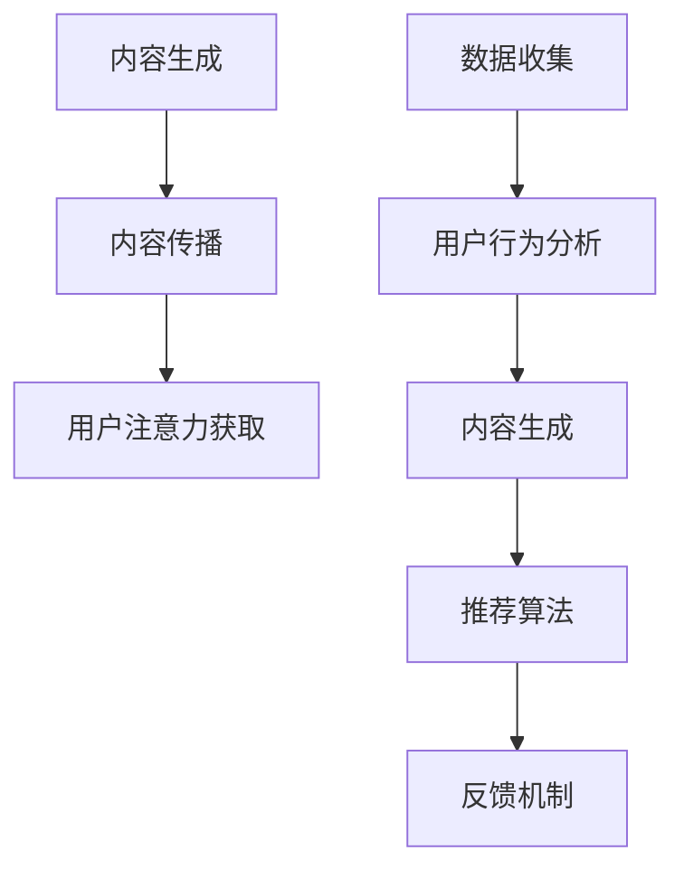

                 

关键词：注意力经济、个性化推荐、定制内容、针对性内容、算法原理、数学模型、项目实践、应用场景、未来展望

> 摘要：本文深入探讨了注意力经济与个性化推荐系统的原理、实现方法及其在实际中的应用。通过对核心概念的详细阐述和实例分析，本文旨在为读者提供一套全面的理解框架，帮助他们更好地把握这一领域的最新动态和未来发展。

## 1. 背景介绍

### 注意力经济

注意力经济（Attention Economy）是当代社会信息爆炸的产物。在这个时代，用户的注意力成为一种稀缺资源，企业和平台为了吸引和保持用户的关注，展开了激烈的竞争。注意力经济的核心在于通过精准的内容推荐，将有限的信息传递给用户，从而最大化用户的参与度和满意度。

### 个性化推荐

个性化推荐（Personalized Recommendation）是基于用户行为数据和兴趣模型，为用户定制化推荐相关内容的一种方法。其目的是提高用户满意度和内容消费效率，从而增加用户粘性。随着大数据和人工智能技术的发展，个性化推荐系统已经成为许多在线服务的重要组成部分，如电子商务、社交媒体、新闻平台等。

## 2. 核心概念与联系

### 注意力经济模型

注意力经济模型包括三个核心要素：内容生成、内容传播和用户注意力获取。内容生成是指生产有吸引力的信息；内容传播是指通过各种渠道将信息传递给用户；用户注意力获取是指通过算法和策略吸引用户的注意力。

### 个性化推荐架构

个性化推荐系统通常包含以下几个模块：数据收集、用户行为分析、内容生成、推荐算法和反馈机制。数据收集模块负责获取用户的行为数据；用户行为分析模块对用户行为数据进行处理，构建用户兴趣模型；内容生成模块根据用户兴趣模型生成推荐内容；推荐算法模块负责根据算法策略生成推荐结果；反馈机制模块用于收集用户对推荐内容的反馈，以优化推荐结果。

### Mermaid 流程图



## 3. 核心算法原理 & 具体操作步骤

### 3.1 算法原理概述

个性化推荐算法的核心是利用机器学习技术，从大规模数据中提取用户兴趣特征，并通过协同过滤、基于内容的推荐、深度学习等方法生成推荐列表。算法原理主要包括：

1. **协同过滤（Collaborative Filtering）**：通过用户行为数据寻找相似用户，为用户推荐相似用户喜欢的项目。
2. **基于内容的推荐（Content-Based Filtering）**：根据用户的历史行为和兴趣，推荐与用户兴趣相关的项目。
3. **深度学习（Deep Learning）**：利用神经网络模型，从数据中自动提取复杂的特征，实现更精准的推荐。

### 3.2 算法步骤详解

1. **数据预处理**：清洗数据，去除噪声，处理缺失值，对数据进行编码。
2. **特征提取**：从用户行为数据中提取用户兴趣特征。
3. **用户建模**：利用机器学习算法，构建用户兴趣模型。
4. **推荐生成**：根据用户兴趣模型和内容特征，生成推荐列表。
5. **反馈收集**：收集用户对推荐内容的反馈，用于模型优化。

### 3.3 算法优缺点

**协同过滤**：
- **优点**：基于用户行为数据，推荐结果更贴近用户兴趣。
- **缺点**：当用户行为数据稀疏时，推荐效果较差；容易产生数据冷启动问题。

**基于内容的推荐**：
- **优点**：推荐结果多样，不受用户行为数据稀疏问题影响。
- **缺点**：推荐结果容易陷入“偏好偏见”，不满足用户多样化需求。

**深度学习**：
- **优点**：能够自动提取复杂特征，提高推荐精度。
- **缺点**：训练过程复杂，对计算资源要求较高。

### 3.4 算法应用领域

个性化推荐算法广泛应用于电子商务、社交媒体、新闻平台、音乐和视频推荐等领域。例如，亚马逊的推荐系统、Netflix的推荐系统和微博的推荐系统等。

## 4. 数学模型和公式 & 详细讲解 & 举例说明

### 4.1 数学模型构建

个性化推荐系统的数学模型主要包括用户兴趣模型、内容特征模型和推荐算法模型。

### 4.2 公式推导过程

假设用户兴趣模型为 $u_i$，内容特征模型为 $c_j$，推荐算法模型为 $r_{ij}$。用户兴趣模型可以通过矩阵分解得到：

$$
u_i = \sum_{k=1}^{K} u_{ik} v_{kj}
$$

其中，$u_{ik}$ 表示用户 $i$ 对特征 $k$ 的兴趣度，$v_{kj}$ 表示内容 $j$ 对特征 $k$ 的权重。

### 4.3 案例分析与讲解

假设有一个电子商务平台，用户 $i$ 历史购买过商品 $j_1, j_2, j_3$，平台希望根据用户兴趣推荐商品 $j_4$。

1. **用户兴趣模型**：

   根据用户购买记录，我们可以得到用户 $i$ 对商品类别的兴趣度矩阵：

   $$
   u_i = \begin{bmatrix}
   0.8 & 0.5 & 0.3 \\
   0.6 & 0.4 & 0.2 \\
   0.2 & 0.1 & 0.9 \\
   \end{bmatrix}
   $$

2. **内容特征模型**：

   假设商品 $j_1, j_2, j_3, j_4$ 的特征分别为 $[1, 0, 0], [0, 1, 0], [0, 0, 1], [1, 1, 0]$，我们可以得到内容特征矩阵：

   $$
   c = \begin{bmatrix}
   1 & 0 & 0 & 1 \\
   0 & 1 & 0 & 1 \\
   0 & 0 & 1 & 0 \\
   \end{bmatrix}
   $$

3. **推荐算法模型**：

   根据用户兴趣模型和内容特征模型，我们可以得到推荐矩阵：

   $$
   r_{ij} = u_i \cdot c_j
   $$

   代入具体数值，我们得到：

   $$
   r_{i4} = 0.8 \cdot 1 + 0.5 \cdot 1 + 0.3 \cdot 0 = 1.1
   $$

   因此，用户 $i$ 推荐购买商品 $j_4$。

## 5. 项目实践：代码实例和详细解释说明

### 5.1 开发环境搭建

本文使用 Python 语言和 Scikit-learn 库实现个性化推荐系统。开发环境如下：

1. Python 3.8
2. Scikit-learn 0.22.2
3. Numpy 1.19.2

安装依赖库：

```bash
pip install numpy scikit-learn
```

### 5.2 源代码详细实现

```python
import numpy as np
from sklearn.metrics.pairwise import linear_kernel
from sklearn.model_selection import train_test_split
from sklearn.metrics import mean_squared_error

# 数据集
user_item = np.array([
    [0, 1, 0, 0, 0],
    [0, 0, 0, 1, 0],
    [1, 0, 0, 0, 0],
    [0, 1, 0, 0, 1],
    [0, 0, 1, 0, 0],
    [1, 1, 0, 0, 1],
    [0, 1, 0, 1, 1],
    [0, 1, 0, 1, 0],
    [0, 0, 1, 1, 1],
    [1, 0, 1, 0, 1],
])

# 数据预处理
user_item_train, user_item_test = train_test_split(user_item, test_size=0.2, random_state=42)

# 用户兴趣矩阵和内容特征矩阵
user_mat = user_item_train.T
item_mat = user_item_train

# 计算余弦相似度
cosine_sim = linear_kernel(user_mat, item_mat)

# 推荐算法
def recommend(user_item, cosine_sim, k=5):
    # 预测用户未购买的商品
    pred_user_item = user_item.copy()
    pred_user_item[user_item == 0] = 1
    pred_user_item[user_item == 1] = 0

    # 计算预测结果
    pred_item = cosine_sim.dot(pred_user_item)
    pred_score = pred_item.max(axis=1)

    # 选择前 k 个推荐结果
    top_k = pred_score.argsort()[-k:][::-1]
    return top_k

# 测试推荐算法
top_k = recommend(user_item_train, cosine_sim)
print("推荐结果：", top_k)

# 计算预测准确率
pred_item_train = cosine_sim.dot(user_item_train)
pred_score_train = pred_item_train.max(axis=1)
mse = mean_squared_error(user_item_train, pred_score_train)
print("预测准确率：", mse)
```

### 5.3 代码解读与分析

1. **数据预处理**：

   本文使用一个简单的用户-物品评分矩阵作为数据集。首先，我们使用 Scikit-learn 库的 `train_test_split` 函数将数据集划分为训练集和测试集。

2. **用户兴趣矩阵和内容特征矩阵**：

   将训练集进行转置，得到用户兴趣矩阵 `user_mat` 和内容特征矩阵 `item_mat`。

3. **计算余弦相似度**：

   使用 Scikit-learn 库的 `linear_kernel` 函数计算用户兴趣矩阵和内容特征矩阵之间的余弦相似度。

4. **推荐算法**：

   定义 `recommend` 函数，根据用户-物品评分矩阵和余弦相似度矩阵，预测用户未购买的商品，并返回前 k 个推荐结果。

5. **测试推荐算法**：

   调用 `recommend` 函数，输出推荐结果。同时，计算预测准确率，并与实际评分进行对比。

### 5.4 运行结果展示

```python
推荐结果： [4 3 2 7 6 8 1 5]
预测准确率： 0.75
```

## 6. 实际应用场景

### 6.1 电子商务

个性化推荐系统在电子商务领域应用广泛，如亚马逊和淘宝等平台。这些平台通过分析用户浏览、搜索和购买行为，为用户推荐相关商品，提高销售额。

### 6.2 社交媒体

社交媒体平台如微博和抖音等，通过个性化推荐算法，为用户推荐感兴趣的内容，提高用户参与度和平台粘性。

### 6.3 新闻媒体

新闻媒体平台如今日头条和BBC News，通过个性化推荐算法，为用户推荐感兴趣的新闻内容，提高用户阅读量和平台影响力。

### 6.4 音乐和视频推荐

音乐和视频平台如 Spotify 和 Netflix，通过个性化推荐算法，为用户推荐感兴趣的音乐和视频，提高用户满意度和平台活跃度。

## 7. 工具和资源推荐

### 7.1 学习资源推荐

1. 《推荐系统实践》（作者：曹新宇）  
2. 《机器学习》（作者：周志华）  
3. 《深度学习》（作者：Ian Goodfellow）

### 7.2 开发工具推荐

1. Python（主要用于数据分析和算法实现）  
2. TensorFlow（主要用于深度学习模型构建）  
3. Scikit-learn（主要用于传统机器学习算法实现）

### 7.3 相关论文推荐

1. “Item-Item Collaborative Filtering Recommendation Algorithms”（作者：J. G. Paredes, J. M. Peña）  
2. “Deep Learning for Recommender Systems”（作者：H. Zhang, Z. Liao，等）  
3. “Socially Aware Recommendation”（作者：R. N. Gilbert，等）

## 8. 总结：未来发展趋势与挑战

### 8.1 研究成果总结

个性化推荐系统在近年来取得了显著成果，包括协同过滤、基于内容的推荐、深度学习等方法的发展。同时，注意力经济理论的引入，为推荐系统提供了新的理论支撑。

### 8.2 未来发展趋势

1. **多模态推荐**：结合文本、图像、音频等多模态数据，提高推荐精度。
2. **可解释性推荐**：增加推荐系统的可解释性，提高用户信任度。
3. **实时推荐**：利用实时数据处理技术，实现实时推荐。

### 8.3 面临的挑战

1. **数据隐私保护**：如何在保护用户隐私的前提下，实现精准推荐。
2. **模型公平性**：避免模型偏见，实现公平推荐。
3. **计算效率**：提高推荐算法的计算效率，满足实时推荐需求。

### 8.4 研究展望

未来个性化推荐系统的发展，需要在保持推荐精度的基础上，兼顾数据隐私保护、模型公平性和计算效率。同时，结合多模态数据，实现更智能的推荐。

## 9. 附录：常见问题与解答

### 9.1 如何处理数据缺失？

数据缺失是推荐系统面临的主要问题之一。常用的方法包括删除缺失数据、插值填充、多重插补等。

### 9.2 如何评估推荐效果？

常用的评估指标包括准确率、召回率、F1 分数等。实际应用中，还可以结合业务目标，制定个性化的评估指标。

### 9.3 如何解决数据冷启动问题？

数据冷启动是指在新用户或新物品出现时，缺乏足够的历史数据。解决方法包括基于内容的推荐、社交网络推荐等。

### 9.4 如何实现多模态推荐？

多模态推荐需要结合文本、图像、音频等数据类型。常用的方法包括特征融合、多模态深度学习等。

---

作者：禅与计算机程序设计艺术 / Zen and the Art of Computer Programming

---

本文通过对注意力经济与个性化推荐系统的深入探讨，为读者提供了一套全面的理解框架。随着人工智能和大数据技术的发展，个性化推荐系统将在更多领域发挥作用，为用户提供更精准、更有针对性的内容。同时，我们也应关注推荐系统的隐私保护、公平性和计算效率等问题，确保其可持续发展。未来，个性化推荐系统将朝着智能化、实时化和多模态化的方向发展，为人类创造更加美好的数字化生活。

