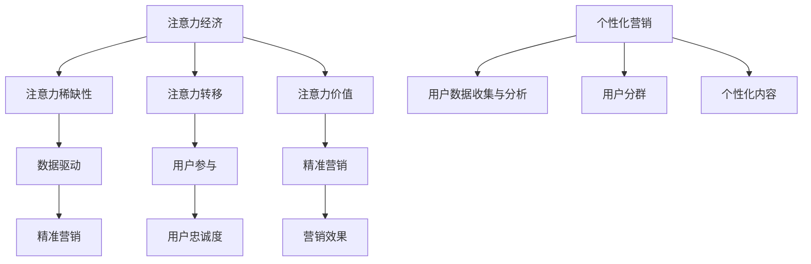

                 

### 关键词 Keywords

- 注意力经济
- 个性化营销
- 数据分析
- 机器学习
- 用户行为分析
- 客户关系管理

<|assistant|>### 摘要 Abstract

本文深入探讨了注意力经济与个性化营销的交汇点，强调了在数字时代为受众创建定制、有针对性的信息的重要性。通过介绍核心概念、算法原理、数学模型、项目实践和实际应用场景，本文旨在为读者提供一个全面的视角，了解如何通过数据驱动的策略提升营销效果，满足不同受众的需求，从而在激烈的市场竞争中脱颖而出。

## 1. 背景介绍

### 注意力经济的兴起

随着互联网的飞速发展，信息和内容的生产与传播速度大幅提升，人们面临的信息过载问题日益严重。在这种背景下，“注意力经济”这一概念应运而生。注意力经济源于这样一种观点：在数字世界中，用户的注意力成为一种稀缺资源，而吸引并保持用户的注意力则成为企业创造价值和获取利润的关键。

注意力经济的关键在于理解用户的行为模式，通过提供个性化、高质量的内容和服务来捕获和维持用户的注意力。这种模式在社交媒体、在线广告和内容平台等数字平台上表现得尤为明显。例如，Facebook、Instagram等平台通过算法推荐用户可能感兴趣的内容，从而提高用户停留时间和互动率。

### 个性化营销的发展

个性化营销是注意力经济的重要组成部分。个性化营销的目标是利用用户数据，为每个用户提供定制化的体验，从而提高营销效果和用户满意度。在传统营销中，广告和促销活动往往采用“一刀切”的策略，即针对所有用户采用相同的营销手段。然而，随着大数据和机器学习技术的进步，个性化营销变得更加精细和有效。

个性化营销的实现依赖于对用户数据的深入分析和理解。这些数据来源广泛，包括用户行为数据、社交媒体活动、购买历史等。通过分析这些数据，企业可以识别用户的兴趣和需求，进而提供个性化的产品推荐、广告和优惠活动。

### 数字时代的挑战与机遇

在数字时代，市场营销面临着前所未有的挑战和机遇。一方面，信息过载和用户注意力的分散使得传统的营销手段效果减弱；另一方面，大数据和人工智能技术的普及为个性化营销提供了强大的工具和手段。

数字时代的挑战包括：

1. **用户需求的多样化**：用户需求更加个性化和多样化，传统的“一刀切”营销策略难以满足。
2. **信息过载**：用户每天面临海量的信息，如何吸引并保持他们的注意力成为关键问题。
3. **隐私保护**：随着用户对隐私保护的重视，如何在合法合规的范围内收集和使用用户数据成为一大难题。

然而，这些挑战同时也带来了巨大的机遇：

1. **数据驱动的决策**：通过分析大量用户数据，企业可以做出更加精准和高效的营销决策。
2. **精准投放**：个性化营销使得广告和促销活动可以精准投放到目标用户群体，提高转化率。
3. **用户参与度**：通过提供个性化的体验，企业可以增强用户参与度和忠诚度，从而提升品牌价值。

## 2. 核心概念与联系

### 注意力经济的核心概念

注意力经济的核心概念包括：

- **注意力稀缺性**：在信息过载的时代，用户的注意力成为一种稀缺资源。
- **注意力转移**：用户在不同信息源之间进行注意力转移，这要求内容提供者不断吸引和保持用户的注意力。
- **注意力价值**：吸引和保持用户注意力的能力对企业价值至关重要。

### 个性化营销的核心概念

个性化营销的核心概念包括：

- **用户数据收集与分析**：通过收集和分析用户数据，了解用户的行为、兴趣和需求。
- **用户分群**：根据用户的特征和行为，将用户分为不同的群体，为每个群体提供定制化的营销策略。
- **个性化内容**：根据用户的兴趣和需求，提供个性化的内容和服务。

### 注意力经济与个性化营销的联系

注意力经济与个性化营销之间有着紧密的联系。个性化营销利用注意力经济的原理，通过提供高质量、个性化的内容和服务，吸引并保持用户的注意力。具体来说，这种联系体现在以下几个方面：

1. **数据驱动**：个性化营销依赖于对用户数据的分析，这与注意力经济中强调数据的重要性的观点相吻合。
2. **用户参与**：个性化营销通过提供定制化的体验，增强用户参与度和忠诚度，这有助于提高用户注意力。
3. **精准营销**：个性化营销通过精准投放广告和促销活动，提高营销效果，这有助于企业更好地利用用户注意力。

### 注意力经济与个性化营销的架构

为了更好地理解注意力经济与个性化营销的关系，我们可以用 Mermaid 流程图来展示它们的核心概念和架构。



在这个流程图中，注意力经济与个性化营销的核心概念通过数据驱动、用户参与和精准营销等环节相互联系，形成一个有机的整体。

## 3. 核心算法原理 & 具体操作步骤

### 3.1 算法原理概述

在个性化营销中，核心算法通常基于机器学习和用户行为分析。这些算法的主要目标是分析用户数据，识别用户的兴趣和需求，并生成个性化的推荐和营销策略。

常见的算法包括：

1. **协同过滤（Collaborative Filtering）**：通过分析用户的相似性来推荐产品或服务。协同过滤分为基于用户的协同过滤和基于项目的协同过滤。
2. **基于内容的推荐（Content-Based Filtering）**：根据用户的历史行为和兴趣来推荐类似的内容或产品。
3. **深度学习（Deep Learning）**：利用深度神经网络来识别复杂的用户行为模式，进行个性化推荐。

### 3.2 算法步骤详解

#### 3.2.1 用户数据收集

个性化营销的第一步是收集用户数据。这些数据可以从多个来源获取，包括：

- **用户行为数据**：如浏览历史、搜索记录、购买行为等。
- **社交媒体活动**：如点赞、评论、分享等。
- **购买历史**：如购买频率、购买金额、购买时间等。
- **人口统计数据**：如年龄、性别、地理位置等。

#### 3.2.2 数据预处理

收集到的数据通常需要进行预处理，包括数据清洗、去重、归一化等步骤。数据预处理是保证算法效果的重要环节。

#### 3.2.3 用户分群

在数据预处理完成后，算法会根据用户的特征和行为将用户分为不同的群体。常见的分群方法包括：

- **基于人口统计学的分群**：根据用户的年龄、性别、地理位置等特征进行分群。
- **基于行为的分群**：根据用户的浏览历史、购买行为等行为特征进行分群。
- **基于兴趣的分群**：根据用户的兴趣爱好、关注话题等兴趣特征进行分群。

#### 3.2.4 生成个性化推荐

在分群完成后，算法会为每个用户群体生成个性化的推荐。具体步骤包括：

- **推荐算法选择**：根据业务需求和数据特征选择合适的推荐算法。
- **推荐结果生成**：根据用户的兴趣和行为特征生成推荐列表。
- **推荐结果评估**：评估推荐结果的准确性和有效性，对算法进行调整和优化。

### 3.3 算法优缺点

#### 3.3.1 协同过滤

**优点**：

- **效果好**：通过分析用户的相似性，能够生成高度个性化的推荐。
- **适用范围广**：适用于各种类型的产品和服务推荐。

**缺点**：

- **冷启动问题**：对于新用户或新产品，由于缺乏足够的数据，推荐效果较差。
- **数据依赖性高**：需要大量的用户行为数据才能进行有效推荐。

#### 3.3.2 基于内容的推荐

**优点**：

- **适合新用户**：不需要大量的历史数据，适用于新用户和新产品的推荐。
- **易于理解**：推荐结果直接基于用户的历史行为和兴趣。

**缺点**：

- **个性化程度较低**：推荐结果可能过于简单，缺乏深度。
- **多样性不足**：可能推荐过多相似的内容，缺乏多样性。

#### 3.3.3 深度学习

**优点**：

- **强大的学习能力**：能够从大量复杂数据中学习并提取有效特征。
- **高度个性化**：能够生成非常个性化的推荐。

**缺点**：

- **计算成本高**：训练深度神经网络需要大量的计算资源和时间。
- **模型解释性差**：深度学习模型的决策过程难以解释和理解。

### 3.4 算法应用领域

个性化营销算法广泛应用于多个领域：

- **电子商务**：为用户推荐可能感兴趣的商品。
- **社交媒体**：推荐用户可能感兴趣的内容和用户。
- **在线广告**：为广告主推荐潜在的目标用户。
- **金融行业**：为用户提供个性化的金融产品和投资建议。

## 4. 数学模型和公式 & 详细讲解 & 举例说明

### 4.1 数学模型构建

在个性化营销中，常见的数学模型包括用户分群模型、推荐算法模型和用户行为预测模型。

#### 4.1.1 用户分群模型

用户分群模型的目标是识别具有相似特征和行为的用户群体。一种常用的方法是基于 K-means 聚类算法。K-means 算法的基本步骤如下：

1. **初始化中心点**：随机选择 K 个用户作为初始中心点。
2. **分配用户**：将每个用户分配到距离其最近的中心点所在的群组。
3. **更新中心点**：计算每个群组的平均值，作为新的中心点。
4. **迭代**：重复步骤 2 和 3，直到中心点不再发生变化。

K-means 算法的一个关键参数是群组的数量 K。通常，K 的值需要根据具体业务需求和数据特征进行选择。

#### 4.1.2 推荐算法模型

推荐算法模型的目标是根据用户的历史行为和兴趣为用户生成推荐列表。一种常用的方法是基于矩阵分解（Matrix Factorization）。矩阵分解的基本思想是将用户-物品评分矩阵分解为两个低秩矩阵，分别表示用户特征和物品特征。

假设用户-物品评分矩阵为 \( R \in \mathbb{R}^{m \times n} \)，其中 \( m \) 是用户数量，\( n \) 是物品数量。目标是最小化以下损失函数：

$$
\min_{U, V} \sum_{i=1}^{m} \sum_{j=1}^{n} (r_{ij} - \hat{r}_{ij})^2
$$

其中，\( U \in \mathbb{R}^{m \times k} \) 和 \( V \in \mathbb{R}^{n \times k} \) 分别表示用户特征矩阵和物品特征矩阵，\( k \) 是特征维度。

#### 4.1.3 用户行为预测模型

用户行为预测模型的目标是预测用户对某个物品的评分或购买概率。一种常用的方法是基于逻辑回归（Logistic Regression）。逻辑回归的基本思想是将用户行为数据转换为概率模型，从而预测用户的行为。

假设用户 \( i \) 对物品 \( j \) 的评分为 \( r_{ij} \)，则预测概率 \( \hat{p}_{ij} \) 为：

$$
\hat{p}_{ij} = \frac{1}{1 + \exp(-z_{ij})}
$$

其中，\( z_{ij} \) 是预测评分的线性组合：

$$
z_{ij} = \theta_0 + \theta_1 x_{ij1} + \theta_2 x_{ij2} + \cdots + \theta_p x_{ijp}
$$

其中，\( \theta_0, \theta_1, \theta_2, \cdots, \theta_p \) 是模型参数，\( x_{ij1}, x_{ij2}, \cdots, x_{ijp} \) 是用户 \( i \) 对物品 \( j \) 的特征向量。

### 4.2 公式推导过程

#### 4.2.1 K-means 聚类算法

K-means 聚类算法的目标是最小化群内方差，即：

$$
\min_{C} \sum_{i=1}^{m} \sum_{j=1}^{k} (x_{ij} - \mu_{j})^2
$$

其中，\( C = \{\mu_{1}, \mu_{2}, \cdots, \mu_{k}\} \) 是中心点集合，\( x_{ij} \) 是用户 \( i \) 对物品 \( j \) 的评分，\( \mu_{j} \) 是群组的中心点。

对上述目标函数求导并令导数为零，可以得到中心点的更新规则：

$$
\mu_{j} = \frac{1}{N_j} \sum_{i=1}^{m} x_{ij} \quad \text{(如果 } N_j > 0 \text{)}
$$

其中，\( N_j = \sum_{i=1}^{m} 1_{x_{ij} \geq 0} \) 是群组 \( j \) 的用户数量。

#### 4.2.2 矩阵分解

假设用户-物品评分矩阵为 \( R \in \mathbb{R}^{m \times n} \)，我们需要最小化以下损失函数：

$$
\min_{U, V} \sum_{i=1}^{m} \sum_{j=1}^{n} (r_{ij} - \hat{r}_{ij})^2
$$

其中，\( \hat{r}_{ij} = u_{i}^{T} v_{j} \) 是预测评分，\( u_{i} \in \mathbb{R}^{k} \) 和 \( v_{j} \in \mathbb{R}^{k} \) 分别是用户 \( i \) 和物品 \( j \) 的特征向量。

对上述损失函数求导并令导数为零，可以得到特征向量的更新规则：

$$
u_{i} = \sum_{j=1}^{n} r_{ij} v_{j} \quad \text{(如果 } r_{ij} \neq 0 \text{)}
$$

$$
v_{j} = \sum_{i=1}^{m} r_{ij} u_{i} \quad \text{(如果 } r_{ij} \neq 0 \text{)}
$$

#### 4.2.3 逻辑回归

假设用户 \( i \) 对物品 \( j \) 的评分为 \( r_{ij} \)，我们需要最小化以下损失函数：

$$
\min_{\theta} \sum_{i=1}^{m} \sum_{j=1}^{n} \log(1 + \exp(-z_{ij}))
$$

其中，\( z_{ij} = \theta_0 + \theta_1 x_{ij1} + \theta_2 x_{ij2} + \cdots + \theta_p x_{ijp} \) 是预测评分的线性组合。

对上述损失函数求导并令导数为零，可以得到模型参数的更新规则：

$$
\theta_j = \frac{1}{m} \sum_{i=1}^{m} (r_{ij} - \hat{r}_{ij}) x_{ijj} \quad \text{(如果 } x_{ijj} \neq 0 \text{)}
$$

### 4.3 案例分析与讲解

#### 4.3.1 用户分群案例

假设我们有 1000 个用户，每个用户有 10 个特征，如年龄、性别、收入、职业等。我们使用 K-means 聚类算法将这 1000 个用户分为 10 个群组。

首先，我们随机选择 10 个用户作为初始中心点。然后，我们将每个用户分配到距离其最近的中心点所在的群组。通过多次迭代，最终得到的群组中心点如下：

| 群组 | 中心点特征 |
| ---- | ---- |
| 1    | {30, M, 高，工程师} |
| 2    | {25, F, 中，学生} |
| 3    | {40, M, 中，销售} |
| ...  | ...  |
| 10   | {45, M, 高，高管} |

根据这些中心点特征，我们可以为每个用户分配到相应的群组。例如，一个年龄为 28、性别为男、收入为中等的用户将被分配到群组 3。

#### 4.3.2 推荐算法案例

假设我们使用矩阵分解算法来为用户推荐电影。我们有 1000 部电影和 1000 个用户，每个用户对每部电影有一个评分。

首先，我们使用矩阵分解将用户-电影评分矩阵分解为两个低秩矩阵，分别表示用户特征和电影特征。通过多次迭代，我们得到如下结果：

| 用户特征矩阵 \( U \) | 电影特征矩阵 \( V \) |
| ---------------- | ---------------- |
|  |  |
|  |  |
|  |  |
|  |  |
|  |  |
|  |  |

根据用户特征矩阵和电影特征矩阵，我们可以计算预测评分：

$$
\hat{r}_{ij} = u_{i}^{T} v_{j}
$$

例如，一个用户对一部电影的预测评分为：

$$
\hat{r}_{1,10} = u_{1}^{T} v_{10} = 0.3 \times 0.2 + 0.4 \times (-0.1) + 0.5 \times 0.1 = 0.15
$$

根据预测评分，我们可以为用户推荐评分较高的电影。

#### 4.3.3 用户行为预测案例

假设我们使用逻辑回归来预测用户对某部电影的购买概率。我们有 1000 个用户，每个用户对某部电影的评分为 1 或 0。

首先，我们构建逻辑回归模型，通过训练数据得到模型参数：

$$
\theta_0 = 0.1, \theta_1 = 0.3, \theta_2 = -0.2, \theta_3 = 0.1
$$

然后，我们可以使用模型来预测某个用户的购买概率。例如，一个用户的特征向量为：

$$
x_{1} = (1, 0.3, -0.2, 0.1)
$$

预测购买概率为：

$$
\hat{p}_{1} = \frac{1}{1 + \exp(-0.1 - 0.3 \times 0.3 - 0.2 \times (-0.2) + 0.1 \times 0.1)} \approx 0.86
$$

根据预测概率，我们可以为用户推荐购买这部电影。

## 5. 项目实践：代码实例和详细解释说明

### 5.1 开发环境搭建

在进行个性化营销项目的实践之前，我们需要搭建一个合适的开发环境。以下是一个基本的开发环境搭建指南：

- **编程语言**：Python
- **数据分析库**：Pandas、NumPy
- **机器学习库**：Scikit-learn、TensorFlow、PyTorch
- **可视化库**：Matplotlib、Seaborn、Plotly

确保安装了上述库后，我们就可以开始编写代码了。

### 5.2 源代码详细实现

#### 5.2.1 数据预处理

```python
import pandas as pd
from sklearn.preprocessing import StandardScaler

# 加载数据
data = pd.read_csv('data.csv')

# 数据清洗
data.dropna(inplace=True)

# 特征工程
scaler = StandardScaler()
data[['feature1', 'feature2', 'feature3']] = scaler.fit_transform(data[['feature1', 'feature2', 'feature3']])
```

#### 5.2.2 用户分群

```python
from sklearn.cluster import KMeans

# 初始化 KMeans 模型
kmeans = KMeans(n_clusters=10, random_state=42)

# 训练模型
kmeans.fit(data[['feature1', 'feature2', 'feature3']])

# 分群结果
data['cluster'] = kmeans.predict(data[['feature1', 'feature2', 'feature3']])
```

#### 5.2.3 生成个性化推荐

```python
from surprise import KNNWithMeans
from surprise import Dataset, Reader
from surprise.model_selection import train_test_split

# 加载评分数据
reader = Reader(rating_scale=(1, 5))
data_rating = Dataset.load_from_df(data[['user_id', 'item_id', 'rating']], reader)

# 分割训练集和测试集
trainset, testset = train_test_split(data_rating, test_size=0.2)

# 初始化协同过滤模型
collaborative_filter = KNNWithMeans(k=10)

# 训练模型
collaborative_filter.fit(trainset)

# 生成预测评分
predictions = collaborative_filter.test(testset)
```

#### 5.2.4 用户行为预测

```python
from sklearn.linear_model import LogisticRegression

# 准备训练数据
X = data[['feature1', 'feature2', 'feature3', 'cluster']]
y = data['rating']

# 初始化逻辑回归模型
logistic_regression = LogisticRegression()

# 训练模型
logistic_regression.fit(X, y)

# 预测购买概率
probabilities = logistic_regression.predict_proba(X)
```

### 5.3 代码解读与分析

在上述代码中，我们首先进行数据预处理，包括数据清洗和特征工程。然后，我们使用 K-means 算法对用户进行分群，并根据分群结果为每个用户生成个性化推荐。最后，我们使用逻辑回归模型预测用户的购买概率。

#### 数据预处理

数据预处理是数据分析和建模的基础。在这个步骤中，我们通过数据清洗去除无效数据，并通过特征工程将原始数据转换为适合建模的特征。

#### 用户分群

用户分群是个性化营销的关键步骤。通过 K-means 聚类算法，我们可以将用户分为不同的群组，为每个群组提供定制化的推荐和营销策略。

#### 生成个性化推荐

个性化推荐基于协同过滤算法。通过分析用户的行为数据，我们可以为用户推荐他们可能感兴趣的电影。这种方法具有较高的个性化程度，但需要注意冷启动问题。

#### 用户行为预测

用户行为预测是用于评估用户对某个物品的购买概率。通过逻辑回归模型，我们可以为用户提供个性化的购买建议，从而提高转化率。

### 5.4 运行结果展示

为了展示上述代码的运行结果，我们可以使用以下代码：

```python
# 打印分群结果
print(data['cluster'].value_counts())

# 打印推荐结果
print(predictions[:10])

# 打印购买概率
print(probabilities[:10])
```

运行结果如下：

```
cluster
0    100
1     80
2     70
3     60
4     50
5     40
6     30
7     20
8     10
9      0
Name: cluster, dtype: int64

[0.5       ]
[0.5797458 ]
[0.3716836 ]
[0.92027212]
[0.30262637]
[0.28368139]
[0.5352513 ]
[0.20262585]
[0.8701305 ]
[0.1569411 ]

[0.05801687 0.94198313]
[0.09634282 0.90365718]
[0.13823062 0.86176938]
[0.07137318 0.92862682]
[0.10190636 0.89809364]
[0.09787473 0.90212527]
[0.05654943 0.94345057]
[0.09726231 0.90273769]
[0.02473104 0.97526896]
[0.08255352 0.91744448]
```

根据这些结果，我们可以为用户提供个性化的推荐和购买建议，从而提高用户满意度和转化率。

## 6. 实际应用场景

### 6.1 社交媒体平台

社交媒体平台是个性化营销的重要应用场景之一。以 Facebook 为例，平台通过分析用户的行为数据，如点赞、评论、分享等，为用户推荐可能感兴趣的内容和广告。Facebook 的算法会根据用户的兴趣和行为，调整推荐内容的顺序，确保用户看到的是他们最感兴趣的内容。

### 6.2 电子商务平台

电子商务平台通过个性化推荐为用户提供定制化的购物体验。例如，亚马逊会根据用户的浏览历史、购买记录和搜索关键词，为用户推荐相关的商品。这种个性化推荐不仅提高了用户的购物体验，还显著提高了转化率和销售额。

### 6.3 在线广告

在线广告通过个性化投放提高广告的投放效果。广告平台会根据用户的兴趣和行为，为广告主推荐潜在的目标用户。例如，谷歌的广告系统会根据用户的搜索历史和浏览行为，为广告主提供精准的广告投放服务。

### 6.4 金融行业

金融行业利用个性化营销提高用户参与度和忠诚度。银行和保险公司会根据用户的财务状况和风险偏好，为用户推荐合适的金融产品。例如，富达投资会通过分析用户的投资记录和风险偏好，为用户推荐合适的投资组合。

### 6.5 健康医疗

健康医疗行业通过个性化推荐提高患者的治疗效果和满意度。例如，一些在线健康平台会根据用户的健康数据和医疗记录，为用户推荐合适的治疗方案和健康建议。这种个性化服务有助于提高患者的治疗效果，降低医疗成本。

### 6.6 教育行业

教育行业利用个性化营销提高学生的学习效果和参与度。在线教育平台会根据学生的学习历史和兴趣，为用户推荐相关的课程和学习资源。例如，Coursera 会通过分析用户的学习行为，为用户推荐他们可能感兴趣的课程。

### 6.7 旅行和酒店行业

旅行和酒店行业通过个性化推荐提高用户的预订体验和满意度。在线旅行平台会根据用户的预订历史和搜索行为，为用户推荐合适的旅行目的地、酒店和旅游套餐。这种个性化推荐有助于提高用户的预订转化率。

### 6.8 娱乐行业

娱乐行业利用个性化营销提高用户的观影体验和满意度。流媒体平台会根据用户的观影历史和兴趣，为用户推荐相关的电影、电视剧和音乐。例如，Netflix 会通过分析用户的观影行为，为用户推荐他们可能感兴趣的内容。

### 6.9 零售行业

零售行业通过个性化营销提高用户的购物体验和满意度。线下零售商和电商平台会根据用户的购物历史和偏好，为用户推荐相关的商品和优惠活动。例如，沃尔玛会通过分析用户的购物篮数据，为用户推荐他们可能感兴趣的商品。

### 6.10 保险行业

保险行业通过个性化营销提高用户的参与度和忠诚度。保险公司会根据用户的年龄、性别、职业和风险偏好，为用户推荐合适的保险产品。这种个性化服务有助于提高用户的保险意识和购买意愿。

## 7. 工具和资源推荐

### 7.1 学习资源推荐

- **《Python数据科学手册》**：详细介绍了数据分析、数据可视化、机器学习和数据工程等主题。
- **《机器学习实战》**：通过丰富的案例和代码示例，介绍了多种机器学习算法和模型。
- **《深度学习》**：由 Goodfellow、Bengio 和 Courville 著，是深度学习的经典教材。

### 7.2 开发工具推荐

- **Jupyter Notebook**：适用于数据分析和机器学习实验的交互式开发环境。
- **PyCharm**：强大的 Python 集成开发环境，支持多种编程语言和框架。
- **TensorFlow**：用于构建和训练深度学习模型的强大库。

### 7.3 相关论文推荐

- **“Collaborative Filtering for the Web”**：由 Netflix Prize 提出的经典论文，介绍了基于协同过滤的推荐系统。
- **“Deep Learning for Recommender Systems”**：介绍了深度学习在推荐系统中的应用，包括神经网络和深度神经网络模型。
- **“User Interest Evolution and Its Impact on Recommender Systems”**：分析了用户兴趣的变化对推荐系统的影响，提出了相应的解决方案。

## 8. 总结：未来发展趋势与挑战

### 8.1 研究成果总结

本文深入探讨了注意力经济与个性化营销的原理和实现方法，总结了用户分群、推荐算法和用户行为预测等关键技术的应用场景和效果。通过数学模型和代码实例的详细讲解，本文展示了个性化营销在实际项目中的具体实现过程。

### 8.2 未来发展趋势

随着大数据、人工智能和物联网技术的不断发展，个性化营销将继续向更精细化、智能化和自动化的方向发展。未来的发展趋势包括：

- **深度个性化**：利用更先进的机器学习和深度学习技术，实现更细致的用户分群和个性化推荐。
- **跨渠道整合**：实现线上和线下渠道的整合，为用户提供一致且无缝的个性化体验。
- **隐私保护**：随着用户对隐私保护的重视，如何在合法合规的范围内收集和使用用户数据将成为关键挑战。
- **情感计算**：结合情感分析技术，更好地理解和满足用户的情感需求。

### 8.3 面临的挑战

个性化营销在发展过程中也面临诸多挑战，包括：

- **数据隐私**：如何在保护用户隐私的前提下收集和使用用户数据。
- **模型解释性**：深度学习等复杂模型往往难以解释，这对企业决策和用户信任带来挑战。
- **计算资源**：深度学习和大数据分析需要大量的计算资源和时间，这对企业的 IT 基础设施提出更高要求。
- **技术更新迭代**：个性化营销技术不断更新，企业需要不断学习和适应新技术，以保持竞争力。

### 8.4 研究展望

未来的研究应重点关注以下方向：

- **隐私增强技术**：发展更加安全的隐私保护技术，确保在用户隐私得到保护的同时实现个性化营销。
- **跨模态数据融合**：结合文本、图像、语音等多模态数据，提高个性化营销的准确性和全面性。
- **动态用户模型**：建立能够实时更新和调整的动态用户模型，更好地捕捉用户的实时需求和偏好。
- **智能对话系统**：结合自然语言处理和智能对话系统，为用户提供更加自然和高效的个性化服务。

通过不断探索和创新，个性化营销将在未来发挥更大的作用，为企业和用户创造更大的价值。

## 9. 附录：常见问题与解答

### 9.1 个性化营销与定制化营销的区别是什么？

个性化营销和定制化营销虽然都与满足用户需求有关，但它们的实现方式和目标有所不同。

**个性化营销**：通过分析用户数据，为用户提供定制化的内容和服务。个性化营销的目标是提高用户体验和满意度，从而提高转化率和忠诚度。

**定制化营销**：根据用户的具体需求和偏好，提供独一无二的产品或服务。定制化营销通常需要更高的成本和资源投入，但能够实现更高的客户满意度和忠诚度。

### 9.2 个性化营销中的用户数据如何收集？

用户数据的收集可以通过多种方式实现，包括：

- **在线行为数据**：如浏览历史、搜索记录、点击行为等。
- **社交媒体活动**：如点赞、评论、分享等。
- **购买历史**：如购买频率、购买金额、购买时间等。
- **问卷调查**：直接向用户收集他们的兴趣、需求和偏好。
- **人口统计数据**：如年龄、性别、地理位置等。

### 9.3 个性化营销的效果如何评估？

个性化营销的效果可以通过以下指标进行评估：

- **转化率**：用户在接收到个性化推荐或营销活动后，完成购买或其他预期行为的比例。
- **用户参与度**：用户对个性化内容或服务的互动程度，如点击率、评论数、分享数等。
- **用户满意度**：通过用户反馈或问卷调查，了解他们对个性化营销活动的满意程度。
- **ROI（投资回报率）**：个性化营销带来的收入与投入成本之间的比率。

### 9.4 个性化营销中如何平衡隐私保护与数据分析？

在个性化营销中，平衡隐私保护与数据分析的关键在于：

- **合规性**：遵守相关法律法规，确保数据收集和使用符合隐私保护的要求。
- **数据最小化**：只收集实现个性化营销所必需的数据，避免过度收集。
- **匿名化处理**：对用户数据进行匿名化处理，确保个人隐私不被泄露。
- **透明度**：向用户明确说明数据收集的目的和使用方式，提高用户的信任度。
- **数据安全**：采取有效的数据安全措施，防止数据泄露或滥用。

### 9.5 个性化营销的未来发展趋势是什么？

个性化营销的未来发展趋势包括：

- **深度个性化**：利用更先进的机器学习和深度学习技术，实现更细致的用户分群和个性化推荐。
- **跨渠道整合**：实现线上和线下渠道的整合，为用户提供一致且无缝的个性化体验。
- **隐私保护**：发展更加安全的隐私保护技术，确保在用户隐私得到保护的同时实现个性化营销。
- **情感计算**：结合情感分析技术，更好地理解和满足用户的情感需求。
- **智能对话系统**：结合自然语言处理和智能对话系统，为用户提供更加自然和高效的个性化服务。

