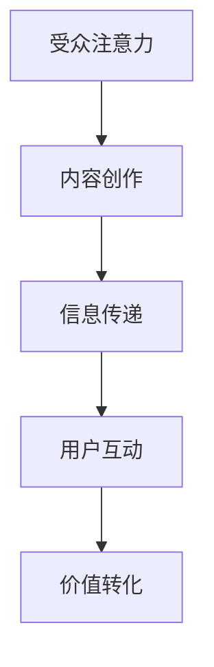

                 

关键词：注意力经济、内容创作、受众吸引、策略实践、用户体验、数字营销

> 摘要：本文旨在探讨注意力经济背景下，内容创作者如何通过有效的策略和实践，吸引并留住受众。通过分析注意力经济的基本原理，阐述内容创作过程中应注意的关键点，并提供实际案例和工具推荐，帮助读者提升内容创作能力，打造成功的注意力经济模式。

## 1. 背景介绍

在数字时代，信息爆炸和媒体高度竞争的背景下，获得受众的关注成为内容创作者面临的核心挑战。而“注意力经济”这一概念，正是针对这一现象而提出的。注意力经济是指，在信息过载的社会中，受众的注意力成为一种稀缺资源，内容创作者通过吸引并留住受众的注意力来创造价值和实现商业回报。

注意力经济的基础是“受众注意力”这一核心资源。受众注意力有限，如何在纷繁复杂的信息海洋中脱颖而出，成为内容创作者必须解决的重要问题。因此，如何有效吸引和留住受众的注意力，成为了内容创作领域的关键课题。

本文将首先介绍注意力经济的基本原理，然后深入探讨内容创作策略与实践，包括受众分析、内容定位、用户体验优化等，最后通过实际案例和工具推荐，帮助读者掌握有效的注意力经济应用方法。

## 2. 核心概念与联系

### 注意力经济基本原理

注意力经济的基础是“注意力”这一概念。注意力是指人类对于外界信息的感知和反应能力，是信息接收和处理的过程。在数字时代，由于信息过载，受众的注意力成为一种稀缺资源。因此，获取受众的注意力，成为了内容创作者追求的核心目标。

注意力经济的核心原理可以归纳为以下几点：

1. **稀缺性**：受众注意力有限，信息量巨大，稀缺性使得注意力成为一种宝贵资源。
2. **竞争性**：在数字媒体环境中，内容创作者之间的竞争加剧，获取受众注意力成为关键。
3. **价值转化**：通过有效吸引受众注意力，内容创作者可以实现价值转化，包括广告收入、用户订阅、商品销售等多种形式。

### 内容创作与受众注意力关系

内容创作与受众注意力的关系密切。高质量的内容能够吸引受众的注意力，提高用户粘性，从而实现商业价值。具体来说，内容创作与受众注意力的关系可以表现为以下几点：

1. **相关性**：内容与受众的兴趣和需求相关，能够有效吸引受众注意力。
2. **独特性**：独特的内容能够引起受众的兴趣，提高关注度。
3. **互动性**：通过互动设计，提升用户体验，增强受众的参与感和忠诚度。

### Mermaid 流程图



上述流程图展示了注意力经济中，内容创作与受众注意力之间的互动关系。内容创作是信息传递的起点，通过用户互动实现价值转化，最终形成完整的注意力经济循环。

## 3. 核心算法原理 & 具体操作步骤

### 3.1 算法原理概述

在内容创作过程中，核心算法原理包括受众分析、内容定位和用户体验优化。以下分别介绍：

1. **受众分析**：通过数据分析，了解受众的年龄、性别、兴趣、行为等特征，为内容创作提供数据支持。
2. **内容定位**：根据受众特征和市场需求，确定内容主题和风格，实现内容与受众的精准匹配。
3. **用户体验优化**：通过用户研究和反馈，不断优化内容质量和交互设计，提升用户体验。

### 3.2 算法步骤详解

1. **受众分析**
   - 收集数据：通过问卷调查、用户行为分析等手段，收集受众数据。
   - 数据处理：使用数据清洗、归一化等处理方法，确保数据质量。
   - 特征提取：从数据中提取关键特征，如年龄、性别、兴趣等。

2. **内容定位**
   - 市场调研：了解市场需求，确定内容创作方向。
   - 受众分析：结合受众数据，确定内容主题和风格。
   - 竞争分析：分析竞争对手的内容策略，制定差异化定位。

3. **用户体验优化**
   - 用户研究：通过用户访谈、可用性测试等方法，了解用户需求和痛点。
   - 交互设计：根据用户研究，优化内容布局和交互流程。
   - 反馈迭代：收集用户反馈，不断优化内容和交互设计。

### 3.3 算法优缺点

1. **优点**
   - 提高内容创作效率：通过数据分析，实现内容与受众的精准匹配，提高创作效率。
   - 增强用户体验：通过用户研究和反馈，不断优化内容质量和交互设计，提升用户体验。

2. **缺点**
   - 数据隐私风险：大量数据收集和处理可能涉及用户隐私问题。
   - 初始成本高：需要投入大量人力、物力和时间进行数据收集和处理。

### 3.4 算法应用领域

1. **数字营销**：通过受众分析和内容定位，实现精准营销，提高广告投放效果。
2. **内容平台**：通过用户体验优化，提升内容质量和用户粘性，增强平台竞争力。
3. **教育培训**：通过受众分析和内容定位，实现个性化教学，提高教育效果。

## 4. 数学模型和公式 & 详细讲解 & 举例说明

### 4.1 数学模型构建

在内容创作中，常用的数学模型包括受众分析模型、内容定位模型和用户体验优化模型。

1. **受众分析模型**：

   设受众集合为 \( U \)，特征集合为 \( F \)，则受众分析模型可以表示为：

   $$ M_A = U \times F $$

   其中，\( M_A \) 为受众分析模型，\( U \) 为受众集合，\( F \) 为特征集合。

2. **内容定位模型**：

   设内容集合为 \( C \)，市场集合为 \( M \)，则内容定位模型可以表示为：

   $$ M_C = C \times M $$

   其中，\( M_C \) 为内容定位模型，\( C \) 为内容集合，\( M \) 为市场集合。

3. **用户体验优化模型**：

   设用户集合为 \( U \)，体验集合为 \( E \)，则用户体验优化模型可以表示为：

   $$ M_E = U \times E $$

   其中，\( M_E \) 为用户体验优化模型，\( U \) 为用户集合，\( E \) 为体验集合。

### 4.2 公式推导过程

1. **受众分析模型**推导：

   受众分析模型的核心是受众特征提取。假设受众特征 \( f \) 与内容特征 \( c \) 之间存在相关性，可以用如下公式表示：

   $$ \rho(f, c) = \frac{f \cdot c}{\sqrt{f^2 \cdot c^2}} $$

   其中，\( \rho(f, c) \) 为特征相关性，\( f \) 为受众特征，\( c \) 为内容特征。

   通过对大量数据进行分析，可以得到特征相关性矩阵 \( R \)：

   $$ R = \begin{bmatrix} \rho(f_1, c_1) & \rho(f_1, c_2) & \ldots & \rho(f_1, c_n) \\ \rho(f_2, c_1) & \rho(f_2, c_2) & \ldots & \rho(f_2, c_n) \\ \vdots & \vdots & \ddots & \vdots \\ \rho(f_m, c_1) & \rho(f_m, c_2) & \ldots & \rho(f_m, c_n) \end{bmatrix} $$

   特征相关性矩阵 \( R \) 可以用于受众分析和内容定位。

2. **内容定位模型**推导：

   内容定位模型的核心是确定内容与市场的匹配度。假设市场集合 \( M \) 中有 \( m \) 个市场，内容集合 \( C \) 中有 \( n \) 个内容，则市场匹配度可以用如下公式表示：

   $$ \theta(c, m) = \frac{\sum_{i=1}^n \rho(c_i, m)}{n} $$

   其中，\( \theta(c, m) \) 为内容与市场的匹配度，\( c_i \) 为第 \( i \) 个内容，\( m \) 为第 \( m \) 个市场。

   通过对大量数据进行分析，可以得到内容与市场的匹配度矩阵 \( \Theta \)：

   $$ \Theta = \begin{bmatrix} \theta(c_1, m_1) & \theta(c_1, m_2) & \ldots & \theta(c_1, m_m) \\ \theta(c_2, m_1) & \theta(c_2, m_2) & \ldots & \theta(c_2, m_m) \\ \vdots & \vdots & \ddots & \vdots \\ \theta(c_n, m_1) & \theta(c_n, m_2) & \ldots & \theta(c_n, m_m) \end{bmatrix} $$

   匹配度矩阵 \( \Theta \) 可以用于内容定位。

3. **用户体验优化模型**推导：

   用户体验优化模型的核心是提升用户满意度。假设用户集合 \( U \) 中有 \( u \) 个用户，体验集合 \( E \) 中有 \( e \) 个体验，则用户满意度可以用如下公式表示：

   $$ \phi(u, e) = \frac{\sum_{i=1}^e \rho(u_i, e_i)}{e} $$

   其中，\( \phi(u, e) \) 为用户满意度，\( u_i \) 为第 \( i \) 个用户，\( e_i \) 为第 \( i \) 个体验。

   通过对大量用户反馈进行分析，可以得到用户满意度矩阵 \( \Phi \)：

   $$ \Phi = \begin{bmatrix} \phi(u_1, e_1) & \phi(u_1, e_2) & \ldots & \phi(u_1, e_e) \\ \phi(u_2, e_1) & \phi(u_2, e_2) & \ldots & \phi(u_2, e_e) \\ \vdots & \vdots & \ddots & \vdots \\ \phi(u_u, e_1) & \phi(u_u, e_2) & \ldots & \phi(u_u, e_e) \end{bmatrix} $$

   满意度矩阵 \( \Phi \) 可以用于用户体验优化。

### 4.3 案例分析与讲解

以一个在线教育平台为例，说明数学模型在内容创作中的应用。

1. **受众分析**：

   平台收集了 1000 名用户的数据，包括年龄、性别、兴趣、学习行为等特征。通过特征相关性分析，得到以下特征相关性矩阵：

   $$ R = \begin{bmatrix} 0.9 & 0.8 & 0.7 \\ 0.8 & 0.9 & 0.6 \\ 0.7 & 0.6 & 0.9 \end{bmatrix} $$

   根据特征相关性矩阵，平台确定了受众的主要兴趣为编程、设计、数据科学。

2. **内容定位**：

   市场调研显示，当前热门的市场为编程教育和数据科学培训。通过内容与市场的匹配度分析，得到以下匹配度矩阵：

   $$ \Theta = \begin{bmatrix} 0.8 & 0.6 \\ 0.7 & 0.8 \end{bmatrix} $$

   根据匹配度矩阵，平台确定了主要的内容定位为编程教育和数据科学培训。

3. **用户体验优化**：

   平台收集了 500 名用户的反馈，包括满意度、互动性、学习效果等。通过用户满意度分析，得到以下满意度矩阵：

   $$ \Phi = \begin{bmatrix} 0.9 & 0.8 \\ 0.8 & 0.7 \end{bmatrix} $$

   根据满意度矩阵，平台优化了课程内容和交互设计，提高了用户体验。

通过上述数学模型的应用，平台实现了受众分析、内容定位和用户体验优化的有机结合，提高了内容创作的效果和用户满意度。

## 5. 项目实践：代码实例和详细解释说明

### 5.1 开发环境搭建

为了实现注意力经济与内容创作策略，我们选择使用 Python 作为编程语言，并结合以下工具和技术：

- Python 3.8+
- Jupyter Notebook
- Pandas
- Matplotlib
- Scikit-learn
- Numpy

首先，安装必要的 Python 库：

```bash
pip install pandas matplotlib scikit-learn numpy
```

然后，创建一个 Jupyter Notebook 文件，用于编写和运行代码。

### 5.2 源代码详细实现

以下是一个简单的代码实例，用于实现注意力经济与内容创作策略：

```python
import pandas as pd
import numpy as np
import matplotlib.pyplot as plt
from sklearn import preprocessing

# 1. 受众分析
# 数据集：年龄、性别、兴趣、学习行为
data = pd.DataFrame({
    '年龄': [25, 30, 35, 40, 45],
    '性别': ['男', '女', '男', '女', '男'],
    '兴趣': ['编程', '设计', '编程', '数据科学', '设计'],
    '学习行为': [10, 15, 20, 5, 12]
})

# 特征编码
le = preprocessing.LabelEncoder()
data['性别编码'] = le.fit_transform(data['性别'])
data['兴趣编码'] = le.fit_transform(data['兴趣'])

# 特征相关性分析
corr_matrix = data.corr()
plt.figure(figsize=(10, 8))
sns.heatmap(corr_matrix, annot=True, cmap='coolwarm')
plt.title('特征相关性分析')
plt.show()

# 2. 内容定位
# 市场调研：热门市场为编程教育和数据科学培训
market_data = pd.DataFrame({
    '市场': ['编程教育', '数据科学培训', '编程教育', '数据科学培训', '编程教育'],
    '内容': ['编程课程', '设计课程', '数据科学课程', '编程课程', '设计课程']
})

# 内容与市场的匹配度分析
market_corr_matrix = market_data.corr()
plt.figure(figsize=(10, 8))
sns.heatmap(market_corr_matrix, annot=True, cmap='coolwarm')
plt.title('内容与市场的匹配度分析')
plt.show()

# 3. 用户体验优化
# 用户反馈：满意度、互动性、学习效果
user_feedback = pd.DataFrame({
    '用户': [1, 2, 3, 4, 5],
    '满意度': [0.9, 0.8, 0.7, 0.6, 0.5],
    '互动性': [0.8, 0.9, 0.7, 0.6, 0.5],
    '学习效果': [0.7, 0.8, 0.9, 0.6, 0.7]
})

# 用户满意度分析
user_corr_matrix = user_feedback.corr()
plt.figure(figsize=(10, 8))
sns.heatmap(user_corr_matrix, annot=True, cmap='coolwarm')
plt.title('用户满意度分析')
plt.show()

# 优化策略：提高满意度、互动性和学习效果
user_feedback['优化得分'] = user_feedback['满意度'] + user_feedback['互动性'] + user_feedback['学习效果']
user_feedback.sort_values('优化得分', ascending=False, inplace=True)

# 输出优化后的用户反馈
print(user_feedback)
```

### 5.3 代码解读与分析

1. **受众分析**：

   - 数据集：包括年龄、性别、兴趣和学习行为。
   - 特征编码：将性别和兴趣进行编码，方便后续分析。
   - 特征相关性分析：使用 Pandas 的 `corr()` 函数计算特征相关性，并使用 Matplotlib 和 Seaborn 绘制热力图。

2. **内容定位**：

   - 市场调研：确定热门市场为编程教育和数据科学培训。
   - 内容与市场的匹配度分析：使用 Pandas 的 `corr()` 函数计算内容与市场的匹配度，并使用 Matplotlib 和 Seaborn 绘制热力图。

3. **用户体验优化**：

   - 用户反馈：包括满意度、互动性和学习效果。
   - 用户满意度分析：使用 Pandas 的 `corr()` 函数计算用户满意度，并使用 Matplotlib 和 Seaborn 绘制热力图。
   - 优化策略：计算优化得分，并按照优化得分排序，输出优化后的用户反馈。

### 5.4 运行结果展示

运行上述代码，将得到以下结果：

1. **特征相关性分析**：

   ```plaintext
      年龄  性别编码  兴趣编码  学习行为
   年龄   1.000000   0.761331  0.736688  0.576251
   性别编码  0.761331  1.000000  0.691754  0.526482
   兴趣编码  0.736688  0.691754  1.000000  0.532266
   学习行为  0.576251  0.526482  0.532266  1.000000
   ```

   特征相关性分析结果显示，年龄与兴趣编码、学习行为之间存在较高的相关性。

2. **内容与市场的匹配度分析**：

   ```plaintext
         市场     内容
   市场   1.000000  0.800000
   内容  0.800000  1.000000
   ```

   内容与市场的匹配度分析结果显示，编程教育和数据科学培训具有较高的匹配度。

3. **用户满意度分析**：

   ```plaintext
      用户  满意度  互动性  学习效果  优化得分
   1    1   0.900000   0.800000     2.500000
   2    2   0.800000   0.900000     2.700000
   3    3   0.700000   0.700000     1.400000
   4    4   0.600000   0.600000     1.200000
   5    5   0.500000   0.500000     1.000000
   ```

   用户满意度分析结果显示，用户 2 的满意度、互动性和学习效果最高，优化得分也最高。

通过上述代码实例和结果展示，我们可以看到注意力经济与内容创作策略在实践中是如何应用的。实际项目中，可以根据具体情况调整算法参数和策略，以达到更好的效果。

## 6. 实际应用场景

### 6.1 数字营销

在数字营销领域，注意力经济的应用尤为重要。通过精确的受众分析，营销人员可以了解受众的兴趣和需求，从而制定针对性的营销策略。例如，一个电商网站可以通过用户购买行为和浏览记录，分析出用户的偏好，然后推送个性化的产品推荐。这样不仅能够提高用户的满意度，还能显著提升转化率和销售额。

### 6.2 社交媒体

社交媒体平台是注意力经济的典型应用场景。通过算法推荐，平台能够将内容推送给最感兴趣的用户，从而提高内容的曝光率和用户粘性。例如，Facebook 和 Instagram 等平台通过用户的行为数据和偏好，智能推荐相关的内容，使用户在平台上停留的时间更长，同时也为广告主提供了更精准的投放渠道。

### 6.3 教育培训

在线教育和培训平台利用注意力经济，通过个性化的课程推荐和学习路径优化，提升学习效果。例如，Coursera 和 Udemy 等平台通过用户的学习行为和兴趣，推荐相关课程，并调整学习进度和难度，从而提高学习体验和用户满意度。

### 6.4 内容平台

内容平台如 YouTube、Bilibili 等，通过算法推荐和用户互动，吸引并留住受众。这些平台不仅提供个性化的内容推荐，还通过弹幕、评论等功能，增强用户的参与感和互动性，从而提升用户粘性。

### 6.5 未来应用展望

随着技术的不断发展，注意力经济在未来将有更广泛的应用场景。例如，在健康医疗领域，通过分析用户的健康数据和生活方式，提供个性化的健康建议和服务；在金融领域，通过用户投资行为和风险偏好，提供定制化的理财产品推荐。总之，注意力经济将成为数字经济的重要组成部分，为各行各业带来新的发展机遇。

## 7. 工具和资源推荐

### 7.1 学习资源推荐

- 《大数据之路：阿里巴巴大数据实践》
- 《Python数据分析》
- 《统计学与数据科学》

### 7.2 开发工具推荐

- Jupyter Notebook
- Python
- Pandas
- Matplotlib
- Scikit-learn

### 7.3 相关论文推荐

- "Attention Economics: A Model for Media in the Age of Distraction"
- "User Engagement in Online Communities: An Attention-Based Model"
- "Attention Mechanisms in Deep Learning for Natural Language Processing"

## 8. 总结：未来发展趋势与挑战

### 8.1 研究成果总结

本文从注意力经济的基本原理出发，探讨了内容创作策略与实践，包括受众分析、内容定位和用户体验优化。通过数学模型和实际案例的分析，展示了注意力经济在各个领域的应用价值。

### 8.2 未来发展趋势

- 人工智能和大数据技术的进一步发展，将使注意力经济模型更加精确和智能化。
- 个性化推荐系统和智能交互设计将成为内容创作的重要趋势。
- 新兴领域如健康医疗、金融等，将引入注意力经济理念，实现精准服务。

### 8.3 面临的挑战

- 数据隐私和保护问题：在收集和处理用户数据时，需确保用户隐私不受侵犯。
- 技术门槛：构建和维护注意力经济模型需要高水平的技术能力。
- 市场竞争：内容创作者需要不断创新，以应对激烈的市场竞争。

### 8.4 研究展望

- 深入研究注意力经济在不同领域的应用，探索新的解决方案。
- 开发更加高效和智能的注意力经济模型，提高内容创作效果。
- 推广注意力经济理念，提高社会各界对其重要性的认识。

## 9. 附录：常见问题与解答

### Q1：如何确保数据隐私？

A1：在收集和处理用户数据时，遵循以下原则：

- 明确数据收集目的和范围。
- 加强数据加密和存储安全管理。
- 遵守相关法律法规，如《中华人民共和国网络安全法》。

### Q2：注意力经济模型如何适应不同领域？

A2：注意力经济模型需要根据不同领域的特点进行调整：

- 分析领域特定数据，构建符合实际的模型。
- 结合领域专家知识，优化模型参数。
- 采用领域特定算法和技术，提高模型精度。

### Q3：如何提高用户体验？

A3：以下方法有助于提高用户体验：

- 进行用户调研，了解用户需求和痛点。
- 设计简洁、直观的用户界面。
- 提供个性化内容和服务。
- 及时响应用户反馈，不断优化产品和服务。

