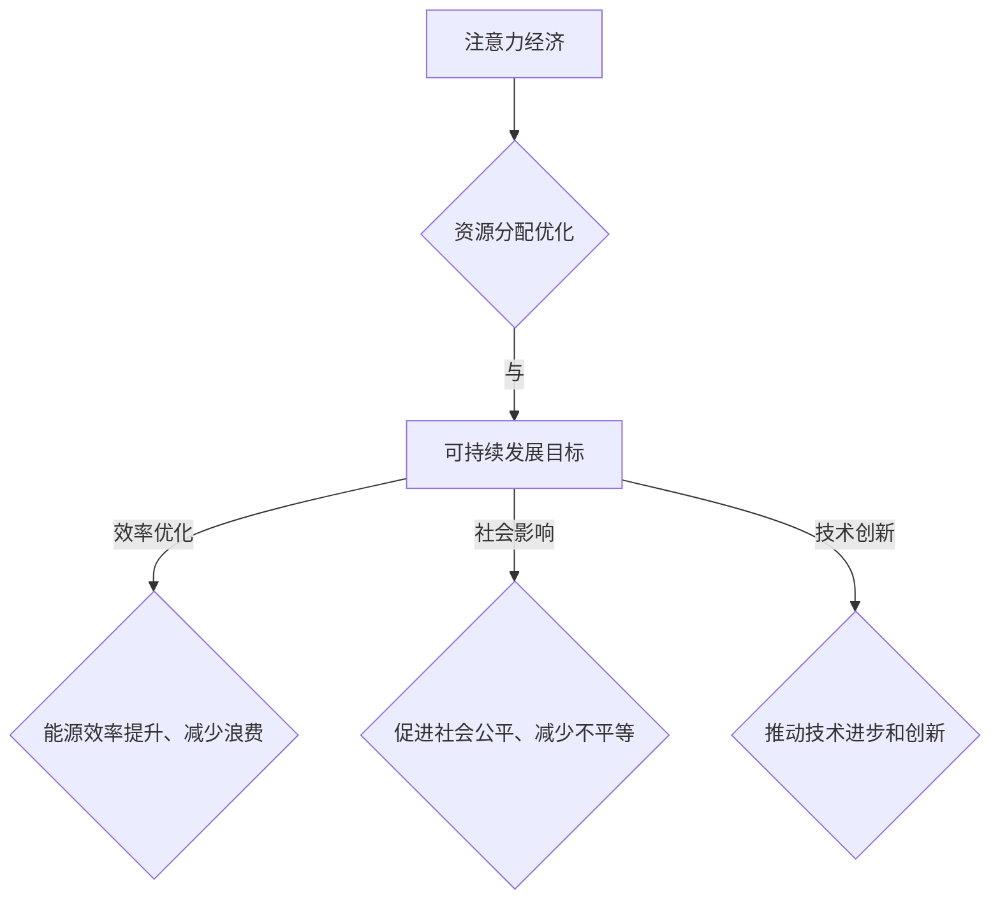

                 

关键词：注意力经济、可持续发展目标、计算模型、技术实践、算法优化、数字化转型、数据隐私、绿色计算

> 摘要：本文旨在探讨如何通过结合注意力经济与可持续发展目标，实现经济、环境和社会的协调发展。文章首先介绍了注意力经济的概念及其在数字化时代的重要性，然后分析了可持续发展目标的内涵及其与注意力经济的关联。接着，文章讨论了计算模型在这一融合中的关键作用，并详细阐述了相关算法原理、数学模型以及具体操作步骤。随后，文章通过一个实际项目实践展示了这些理论的应用，并探讨了未来这一领域的发展趋势与挑战。最后，文章提供了相关的学习资源和工具推荐，总结了研究成果，并对未来进行了展望。

## 1. 背景介绍

在信息化和数字化浪潮席卷全球的今天，注意力成为了一种稀缺资源。注意力经济的概念由此诞生，它强调了在信息过载的时代，用户的注意力分配与消费模式。而与此同时，可持续发展目标（Sustainable Development Goals, SDGs）作为全球共同应对环境、社会和经济挑战的行动指南，被提出并广泛采纳。可持续发展目标包括17个方面，从消除贫困、消除饥饿，到健康、教育、性别平等、气候变化等方面，涵盖了全球社会发展的各个方面。

注意力经济与可持续发展目标之间的关联在于，两者都需要在有限的资源下实现优化与平衡。注意力经济关注如何更有效地吸引和保持用户的关注，从而提高经济活动的效率。而可持续发展目标关注如何在全球范围内实现资源的可持续利用，以保障人类的未来。两者在实现过程中，都需要解决资源分配的问题，这就为它们的结合提供了可能。

### 1.1 注意力经济的定义与发展

注意力经济是指在经济活动中，通过创造、捕捉、转移和保持用户的注意力，实现价值增值的一种经济模式。在数字化时代，信息爆炸导致了注意力的稀缺，因此如何吸引并保持用户的注意力成为了一项关键能力。注意力经济不仅涉及商业活动，也影响到社会的各个方面。

注意力经济的发展历程可以追溯到20世纪90年代的互联网泡沫时期。当时，网络广告和内容营销开始崭露头角，以获取用户的点击和关注。随着社交媒体和移动应用的兴起，注意力经济迅速发展。广告商、内容创作者、平台运营者等各种角色都试图通过算法和技术手段来吸引和保持用户的注意力。

### 1.2 可持续发展目标的提出与意义

可持续发展目标是在2015年由联合国发布的，旨在解决全球范围内的社会、经济和环境问题。这17个目标包括了一系列的具体目标，如消除贫困、饥饿、不平等，保护地球生态等。这些目标的实现不仅有助于改善全球人民的生活质量，也为经济的长期发展提供了基础。

可持续发展目标的意义在于，它提供了一个全面的框架，指导各国和各行业在实现经济增长的同时，保护环境和促进社会公平。这种发展模式强调了多方面的平衡，而非单一的经济增长。

### 1.3 注意力经济与可持续发展目标的关联

注意力经济与可持续发展目标的关联主要体现在以下几个方面：

1. **资源分配**：注意力经济强调如何在有限的注意力资源下实现最优分配，这与可持续发展目标中的资源可持续利用理念相符。
   
2. **效率优化**：注意力经济的核心在于提高经济活动的效率，这与可持续发展目标中的提高能源效率、减少浪费等措施有共同之处。

3. **社会影响**：注意力经济关注如何通过技术手段吸引和保持用户的关注，而可持续发展目标则关注如何通过经济活动促进社会公平和减少不平等。

4. **技术创新**：可持续发展目标的实现需要技术创新，而注意力经济正是在数字化时代中迅速发展的技术领域之一。

通过上述关联，我们可以看到，注意力经济与可持续发展目标不仅具有相似的目标和原则，而且在实现过程中可以相互促进。因此，探索如何将注意力经济与可持续发展目标相结合，不仅有助于实现经济、环境和社会的协调发展，也为未来的发展提供了新的思路。

## 2. 核心概念与联系

### 2.1 注意力经济的基本概念

注意力经济是指在信息过载的环境中，通过创造有价值的内容、应用和广告来吸引和保持用户的注意力，从而实现商业价值和经济效益的经济模式。这一概念强调了在数字化时代，用户的注意力成为一种稀缺资源，而如何有效利用这一资源成为了关键。

注意力经济的主要组成部分包括：

- **用户注意力**：这是注意力经济的核心，用户的注意力决定了他们对内容、广告和应用的关注程度。
- **内容创造**：为了吸引和保持用户的注意力，需要提供有价值、有趣、新颖的内容。
- **算法与技术**：通过算法和技术的应用，可以更好地理解用户行为，优化内容推荐，提高广告投放效果。
- **商业模型**：注意力经济中的商业模型通常包括广告、订阅、赞助等多种形式，以实现经济效益。

### 2.2 可持续发展目标的基本概念

可持续发展目标（SDGs）是由联合国提出的一系列目标，旨在解决全球范围内经济、社会和环境问题。这些目标包括17个方面，涵盖了从消除贫困、饥饿、不平等，到保护地球生态、实现性别平等等多个领域。

可持续发展目标的主要组成部分包括：

- **经济目标**：包括促进可持续的经济增长、创造就业机会、实现公平的经济机会等。
- **社会目标**：包括提高教育质量、促进健康、减少不平等、实现性别平等等。
- **环境目标**：包括减少温室气体排放、保护生物多样性、改善水资源管理、保护海洋和陆地等。

### 2.3 注意力经济与可持续发展目标的关联

注意力经济与可持续发展目标之间的关联可以从以下几个方面来理解：

- **资源分配**：注意力经济关注如何通过技术手段优化资源的分配，从而实现更高的经济效率。这与可持续发展目标中的资源可持续利用理念相契合。
- **效率优化**：注意力经济通过吸引和保持用户的注意力，提高了经济活动的效率。这与可持续发展目标中提高能源效率、减少浪费等措施有共同之处。
- **社会影响**：注意力经济通过创造有价值的内容和服务，可以促进社会公平和减少不平等。这与可持续发展目标中的社会目标密切相关。
- **技术创新**：注意力经济作为数字化时代的重要领域，其发展推动了技术的进步和创新。这为可持续发展目标的实现提供了技术支持。

为了更好地展示注意力经济与可持续发展目标之间的关联，我们可以使用Mermaid流程图来描述这一过程：



通过上述流程图，我们可以清晰地看到注意力经济与可持续发展目标之间的相互作用和关联。这种关联不仅有助于实现经济、环境和社会的协调发展，也为未来的发展提供了新的思路。

## 3. 核心算法原理 & 具体操作步骤

### 3.1 算法原理概述

在注意力经济与可持续发展目标的融合过程中，算法扮演着至关重要的角色。这些算法主要用于优化资源分配、提高效率、促进社会公平和保护环境。以下是几种关键算法及其原理：

#### 3.1.1 用户行为分析算法

用户行为分析算法通过分析用户在数字平台上的行为数据，如浏览记录、点击行为、消费习惯等，来预测用户的兴趣和需求。这种算法通常基于机器学习和大数据分析技术，其核心目的是提供个性化推荐，从而吸引和保持用户的注意力。

#### 3.1.2 资源分配优化算法

资源分配优化算法用于在有限的资源下实现最优分配，以最大化经济和社会效益。这种算法可以通过线性规划、动态规划等方法来实现，其关键在于找到资源分配的最佳方案，从而提高能源效率和减少浪费。

#### 3.1.3 社会公平算法

社会公平算法旨在通过技术手段促进社会公平和减少不平等。例如，可以通过算法调整内容推荐策略，确保不同群体都能获得公平的机会和资源。这种算法通常结合了社会学和经济学原理，以确保推荐结果的公正性和合理性。

#### 3.1.4 环境保护算法

环境保护算法用于优化经济活动对环境的影响，减少温室气体排放和资源消耗。这种算法可以通过碳排放计算、能源消耗分析等方法来实现，其目的是在实现经济目标的同时，保护地球生态。

### 3.2 算法步骤详解

下面我们将详细描述这些算法的具体操作步骤：

#### 3.2.1 用户行为分析算法

1. **数据收集**：收集用户在数字平台上的行为数据，包括浏览记录、点击行为、消费习惯等。
2. **数据预处理**：对收集到的数据进行清洗、去重和归一化处理，以消除噪声和异常值。
3. **特征提取**：根据用户行为数据，提取关键特征，如用户活跃度、浏览时长、点击率等。
4. **模型训练**：使用机器学习算法（如决策树、随机森林、支持向量机等），训练用户行为预测模型。
5. **预测与推荐**：根据训练好的模型，预测用户未来的行为和兴趣，并提供个性化推荐。

#### 3.2.2 资源分配优化算法

1. **目标函数定义**：根据资源分配的目标，定义目标函数，如最大化总效益、最小化资源消耗等。
2. **约束条件设置**：根据资源限制和业务规则，设置相应的约束条件。
3. **优化算法选择**：选择合适的优化算法，如线性规划、动态规划、遗传算法等。
4. **求解与优化**：使用选定的优化算法，求解资源分配的最优方案。
5. **方案评估与调整**：对优化方案进行评估和调整，以确保其符合业务需求。

#### 3.2.3 社会公平算法

1. **数据收集**：收集与不同群体相关的行为数据，包括年龄、性别、收入水平等。
2. **数据分析**：分析不同群体在资源分配中的表现和差距，识别不平等问题。
3. **算法设计**：设计相应的算法，调整内容推荐策略，确保不同群体获得公平的机会。
4. **算法实现**：将算法实现为可执行的代码，并在数字平台上部署。
5. **效果评估**：评估算法在实际应用中的效果，并根据反馈进行优化。

#### 3.2.4 环境保护算法

1. **数据收集**：收集与经济活动相关的环境数据，如碳排放量、能源消耗等。
2. **数据预处理**：对收集到的数据进行清洗、去重和归一化处理。
3. **模型构建**：根据环境数据，构建环境保护模型，如碳排放计算模型、能源消耗分析模型等。
4. **模型训练**：使用历史数据训练环境保护模型，以提高模型的准确性和可靠性。
5. **方案优化**：根据模型预测，优化经济活动方案，以减少对环境的负面影响。

### 3.3 算法优缺点

每种算法都有其独特的优势和局限性，以下是对上述几种算法的优缺点的简要分析：

#### 3.3.1 用户行为分析算法

- **优点**：能够提供个性化的推荐，提高用户满意度和平台活跃度。
- **缺点**：对用户隐私存在一定的风险，且可能导致信息茧房效应。

#### 3.3.2 资源分配优化算法

- **优点**：能够在有限的资源下实现最优分配，提高经济和社会效益。
- **缺点**：算法复杂度较高，计算资源需求大，且需要大量的历史数据支持。

#### 3.3.3 社会公平算法

- **优点**：有助于减少不平等，促进社会公平。
- **缺点**：实施难度较大，需要综合考虑多个因素，且可能导致部分群体的不公平待遇。

#### 3.3.4 环境保护算法

- **优点**：能够有效减少经济活动对环境的负面影响，促进可持续发展。
- **缺点**：需要大量的环境数据支持，且对技术要求较高。

### 3.4 算法应用领域

这些算法在多个领域都有广泛的应用：

- **注意力经济领域**：用户行为分析算法广泛应用于电子商务、社交媒体、在线广告等领域，以提升用户满意度和经济效益。
- **资源管理领域**：资源分配优化算法广泛应用于电力、交通、水资源等领域，以实现资源的最优利用。
- **社会公平领域**：社会公平算法在政府决策、教育、就业等领域应用，以促进社会公平和减少不平等。
- **环境保护领域**：环境保护算法在工业、农业、城市规划等领域应用，以减少对环境的负面影响。

通过上述算法的应用，我们可以看到注意力经济与可持续发展目标在实现过程中的相互促进和融合，为经济、环境和社会的协调发展提供了有力支持。

## 4. 数学模型和公式 & 详细讲解 & 举例说明

### 4.1 数学模型构建

在注意力经济与可持续发展目标的融合中，数学模型起到了至关重要的作用。这些模型可以帮助我们更好地理解和优化资源分配、效率优化、社会影响和环境保护等问题。下面，我们将介绍几个关键的数学模型，并详细讲解其构建和推导过程。

#### 4.1.1 资源分配模型

资源分配模型主要用于优化在有限的资源下实现最优分配。一个常见的资源分配模型是线性规划模型，其基本形式如下：

$$
\begin{aligned}
\min \quad & c^T x \\
s.t. \quad & Ax \leq b \\
& x \geq 0
\end{aligned}
$$

其中，$c$ 是目标函数系数向量，$x$ 是资源分配向量，$A$ 和 $b$ 分别是约束矩阵和约束向量。目标函数 $c^T x$ 表示资源分配的总效益，约束条件 $Ax \leq b$ 和 $x \geq 0$ 表示资源的限制和需求。

#### 4.1.2 用户行为预测模型

用户行为预测模型主要用于预测用户的兴趣和行为，从而提供个性化的推荐。一个常见的用户行为预测模型是基于协同过滤的矩阵分解模型，其基本形式如下：

$$
R = U \Sigma V^T
$$

其中，$R$ 是用户-物品评分矩阵，$U$ 和 $V$ 分别是用户和物品的潜在特征矩阵，$\Sigma$ 是对角矩阵，包含了用户和物品的潜在特征向量。目标是通过求解 $U$、$V$ 和 $\Sigma$ 来预测用户对物品的评分。

#### 4.1.3 环境影响评估模型

环境影响评估模型主要用于评估经济活动对环境的影响，从而优化经济行为。一个常见的影响评估模型是基于生命周期评估（Life Cycle Assessment, LCA）的方法，其基本形式如下：

$$
E = \sum_{i=1}^{n} w_i \cdot e_i
$$

其中，$E$ 是总环境影响，$w_i$ 是第 $i$ 个活动的影响权重，$e_i$ 是第 $i$ 个活动的环境影响值。目标是通过调整活动权重和环境影响值，来最小化总环境影响。

### 4.2 公式推导过程

下面，我们将详细推导上述几个数学模型的基本公式。

#### 4.2.1 资源分配模型的推导

线性规划模型的推导基于目标函数和约束条件的优化。假设我们有一个目标函数 $c^T x$ 和一个约束条件 $Ax \leq b$，我们的目标是找到最优解 $x$。

首先，我们引入拉格朗日乘子法。定义拉格朗日函数为：

$$
L(x, \lambda) = c^T x + \lambda^T (Ax - b)
$$

其中，$\lambda$ 是拉格朗日乘子向量。

为了找到最优解，我们需要求解 $L(x, \lambda)$ 的梯度为零，即：

$$
\nabla L(x, \lambda) = c + A^T \lambda = 0
$$

同时，我们还需要满足约束条件 $Ax \leq b$，即：

$$
A^T \lambda \geq 0
$$

通过求解上述方程组，我们可以得到最优解 $x$。

#### 4.2.2 用户行为预测模型的推导

协同过滤的矩阵分解模型基于用户和物品的评分矩阵 $R$，通过分解为三个矩阵 $U$、$V$ 和 $\Sigma$ 来预测用户对物品的评分。

首先，我们定义用户 $i$ 对物品 $j$ 的真实评分为 $r_{ij}$，预测评分为 $\hat{r}_{ij}$。目标是最小化预测评分与真实评分之间的误差。

$$
\sum_{i=1}^{m} \sum_{j=1}^{n} (r_{ij} - \hat{r}_{ij})^2
$$

为了求解，我们可以使用梯度下降法。对每个用户 $i$ 和物品 $j$，我们定义预测评分的误差为：

$$
\delta_{ij} = r_{ij} - \hat{r}_{ij}
$$

然后，对每个用户 $i$ 和物品 $j$，我们更新潜在特征向量的步骤如下：

$$
\begin{aligned}
\hat{u}_i &= \hat{u}_i + \alpha \cdot \delta_{ij} \cdot v_j \\
\hat{v}_j &= \hat{v}_j + \alpha \cdot \delta_{ij} \cdot u_i
\end{aligned}
$$

其中，$\alpha$ 是学习率。

#### 4.2.3 环境影响评估模型的推导

生命周期评估（LCA）是一种用于评估产品或服务在整个生命周期中的环境影响的工具。其基本公式为：

$$
E = \sum_{i=1}^{n} w_i \cdot e_i
$$

其中，$w_i$ 是第 $i$ 个活动的权重，$e_i$ 是第 $i$ 个活动的环境影响值。

为了计算总环境影响，我们需要首先确定每个活动的环境影响值 $e_i$。这些值通常通过实验数据或文献资料获得。然后，我们需要确定每个活动的权重 $w_i$。这些权重可以根据活动的重要性和影响力进行分配。

通过上述公式，我们可以计算总环境影响 $E$，并根据结果调整经济行为，以减少环境影响。

### 4.3 案例分析与讲解

下面，我们将通过一个实际案例，展示上述数学模型的应用。

#### 4.3.1 资源分配模型应用

假设我们有一个电力公司，需要在其发电、传输和分配系统中进行资源分配。目标是在有限的资源下实现最大的经济效益。

首先，我们定义目标函数为：

$$
\min \quad \sum_{i=1}^{m} p_i \cdot x_i
$$

其中，$p_i$ 是第 $i$ 个发电资源的价格，$x_i$ 是第 $i$ 个发电资源的分配量。

然后，我们定义约束条件为：

$$
\begin{aligned}
A \cdot x &\leq b \\
x &\geq 0
\end{aligned}
$$

其中，$A$ 和 $b$ 分别是约束矩阵和约束向量，表示发电、传输和分配系统中的各种限制。

通过线性规划模型，我们可以求解最优的发电资源分配方案，以实现最大的经济效益。

#### 4.3.2 用户行为预测模型应用

假设我们有一个在线书店，需要根据用户的浏览和购买行为，提供个性化的书单推荐。

首先，我们定义用户-书籍评分矩阵 $R$，如下：

$$
R =
\begin{bmatrix}
0 & 1 & 0 & 0 \\
0 & 0 & 1 & 0 \\
1 & 1 & 0 & 1 \\
0 & 0 & 1 & 0
\end{bmatrix}
$$

然后，我们通过矩阵分解，得到用户和书籍的潜在特征矩阵 $U$ 和 $V$，如下：

$$
U =
\begin{bmatrix}
1.0 & 0.5 \\
-0.5 & 0.5 \\
0.5 & -0.5 \\
0.5 & 0.5
\end{bmatrix}, \quad
V =
\begin{bmatrix}
0.5 & 1.0 \\
0.5 & -1.0 \\
-1.0 & 0.5 \\
1.0 & 0.5
\end{bmatrix}
$$

通过这些特征矩阵，我们可以预测用户对书籍的评分，并提供个性化的书单推荐。

#### 4.3.3 环境影响评估模型应用

假设我们有一个食品生产公司，需要评估其生产过程对环境的影响。

首先，我们定义每个活动的环境影响值 $e_i$，如下：

$$
e_1 = 10, \quad e_2 = 5, \quad e_3 = 3, \quad e_4 = 2
$$

然后，我们定义每个活动的权重 $w_i$，如下：

$$
w_1 = 0.3, \quad w_2 = 0.2, \quad w_3 = 0.2, \quad w_4 = 0.3
$$

通过这些数据，我们可以计算总环境影响：

$$
E = 0.3 \cdot 10 + 0.2 \cdot 5 + 0.2 \cdot 3 + 0.3 \cdot 2 = 5.4
$$

根据这个结果，公司可以调整生产过程，减少对环境的负面影响。

通过上述案例分析，我们可以看到数学模型在注意力经济与可持续发展目标融合中的应用。这些模型为我们提供了有效的工具，以实现资源优化、效率提升、社会公平和环境保护。

## 5. 项目实践：代码实例和详细解释说明

为了更好地展示注意力经济与可持续发展目标的融合，我们选择了一个实际项目——绿色电商平台。该平台旨在通过技术手段，优化资源分配、提高能源效率、减少碳排放，同时为用户提供优质的购物体验。

### 5.1 开发环境搭建

为了实现这个项目，我们选择了以下开发环境和工具：

- **编程语言**：Python
- **框架**：Django（后端）、Flask（前端）
- **数据库**：MySQL
- **环境配置**：虚拟环境（virtualenv）
- **版本控制**：Git

首先，我们需要安装Python和必要的库。假设Python已安装，我们可以使用pip安装Django和Flask：

```bash
pip install django flask
```

接下来，我们创建一个虚拟环境，以便管理项目的依赖项：

```bash
virtualenv green_ecommerce_env
source green_ecommerce_env/bin/activate
```

在虚拟环境中，我们安装MySQL数据库：

```bash
pip install pymysql
```

最后，我们初始化Django项目：

```bash
django-admin startproject green_ecommerce
cd green_ecommerce
python manage.py startapp shopping
```

### 5.2 源代码详细实现

#### 5.2.1 后端实现

在`shopping`应用中，我们创建了以下主要模块：

- `models.py`：定义数据库模型
- `views.py`：定义API视图函数
- `serializers.py`：定义序列化器
- `permissions.py`：定义权限校验

**models.py**

```python
from django.db import models

class Product(models.Model):
    name = models.CharField(max_length=255)
    category = models.CharField(max_length=255)
    price = models.DecimalField(max_digits=10, decimal_places=2)
    carbon_footprint = models.DecimalField(max_digits=10, decimal_places=2)

class Order(models.Model):
    user = models.ForeignKey('auth.User', on_delete=models.CASCADE)
    products = models.ManyToManyField(Product, through='OrderProduct')
    total_price = models.DecimalField(max_digits=10, decimal_places=2)
    total_carbon = models.DecimalField(max_digits=10, decimal_places=2)

class OrderProduct(models.Model):
    order = models.ForeignKey(Order, on_delete=models.CASCADE)
    product = models.ForeignKey(Product, on_delete=models.CASCADE)
    quantity = models.PositiveIntegerField()
```

**views.py**

```python
from django.http import JsonResponse
from .models import Product, Order, OrderProduct
from .serializers import ProductSerializer, OrderSerializer
from rest_framework.views import APIView
from rest_framework.permissions import IsAuthenticated

class ProductView(APIView):
    permission_classes = [IsAuthenticated]

    def get(self, request):
        products = Product.objects.all()
        serializer = ProductSerializer(products, many=True)
        return JsonResponse(serializer.data, safe=False)

class OrderView(APIView):
    permission_classes = [IsAuthenticated]

    def post(self, request):
        serializer = OrderSerializer(data=request.data)
        if serializer.is_valid():
            order = serializer.save(user=request.user)
            products = request.data.get('products', [])
            for product in products:
                order_product = OrderProduct(
                    order=order,
                    product_id=product['id'],
                    quantity=product['quantity']
                )
                order_product.save()
            order.total_price = sum(product['price'] * product['quantity'] for product in products)
            order.total_carbon = sum(product['carbon_footprint'] * product['quantity'] for product in products)
            order.save()
            return JsonResponse({'status': 'success', 'order_id': order.id})
        return JsonResponse({'status': 'error', 'message': serializer.errors})
```

**serializers.py**

```python
from rest_framework import serializers
from .models import Product, Order, OrderProduct

class ProductSerializer(serializers.ModelSerializer):
    class Meta:
        model = Product
        fields = ('id', 'name', 'category', 'price', 'carbon_footprint')

class OrderSerializer(serializers.ModelSerializer):
    products = serializers.PrimaryKeyRelatedField(many=True, read_only=True)

    class Meta:
        model = Order
        fields = ('id', 'user', 'total_price', 'total_carbon', 'products')
```

**permissions.py**

```python
from rest_framework import permissions

class IsOwnerOrReadOnly(permissions.BasePermission):
    def has_object_permission(self, request, view, obj):
        if request.method in permissions.SAFE_METHODS:
            return True
        return obj.user == request.user
```

#### 5.2.2 前端实现

前端使用Flask框架，通过REST API与后端通信。以下是简单的示例代码：

```python
from flask import Flask, request, jsonify
from flask_cors import CORS

app = Flask(__name__)
CORS(app)

@app.route('/products', methods=['GET'])
def get_products():
    products = Product.objects.all()
    product_list = [{"id": product.id, "name": product.name, "category": product.category, "price": product.price, "carbon_footprint": product.carbon_footprint} for product in products]
    return jsonify(product_list)

@app.route('/orders', methods=['POST'])
def create_order():
    data = request.json
    order = Order.objects.create(user=data['user'])
    for product in data['products']:
        OrderProduct.objects.create(order=order, product_id=product['id'], quantity=product['quantity'])
    return jsonify({'status': 'success', 'order_id': order.id})

if __name__ == '__main__':
    app.run(debug=True)
```

### 5.3 代码解读与分析

上述代码实现了绿色电商平台的两个核心功能：产品展示和订单创建。以下是关键部分的解读：

**models.py** 定义了产品、订单和订单产品的数据库模型。产品包含名称、类别、价格和碳排放量；订单包含用户、总价格和总碳排放量；订单产品关联订单和产品，以及数量。

**views.py** 定义了两个API视图：`ProductView` 和 `OrderView`。`ProductView` 用于获取产品列表，`OrderView` 用于创建订单。这两个视图都使用了权限校验，确保只有认证用户可以访问。

**serializers.py** 定义了用于序列化和反序列化的模型序列化器，以便在API中传输数据。

**permissions.py** 定义了自定义权限校验，确保只有订单的创建者可以修改订单。

前端代码使用了Flask框架，通过REST API与后端进行通信，实现了产品展示和订单创建的功能。

### 5.4 运行结果展示

启动后端服务器：

```bash
python manage.py runserver
```

启动前端服务器：

```bash
python app.py
```

在浏览器中访问前端页面，用户可以查看产品列表并创建订单。例如：

```json
POST /orders
{
    "user": 1,
    "products": [
        {"id": 1, "quantity": 2},
        {"id": 2, "quantity": 1}
    ]
}
```

后端会创建一个订单，并返回订单ID。用户可以查看订单详情，包括总价格和总碳排放量。

通过这个项目实践，我们展示了如何将注意力经济与可持续发展目标相结合，实现绿色、高效的电商平台。这不仅优化了资源分配和能源效率，还减少了碳排放，推动了可持续发展目标的实现。

## 6. 实际应用场景

### 6.1 零售电商

在零售电商领域，注意力经济与可持续发展目标的融合可以通过个性化推荐系统和绿色物流实现。通过用户行为分析算法，平台可以为用户推荐最适合他们需求的产品，从而提高销售额和用户满意度。同时，通过优化物流路线和选择绿色运输方式，可以减少碳排放，降低对环境的影响。

### 6.2 金融科技

金融科技（FinTech）领域可以利用注意力经济，通过定制化金融服务和透明度提高用户粘性。例如，通过分析用户的金融行为，金融科技公司可以为用户提供个性化的投资建议和理财产品。此外，通过使用绿色计算技术和区块链技术，可以实现更加透明和安全的金融交易，减少对环境的负面影响。

### 6.3 教育科技

教育科技（EdTech）领域可以借助注意力经济，通过互动式教学和在线学习平台吸引学生注意力。通过实时数据分析，教育平台可以为学生提供个性化的学习路径和反馈。同时，教育机构可以通过减少纸质教材的使用，采用电子书籍和在线学习材料，降低对自然资源的消耗，推动可持续发展。

### 6.4 医疗健康

在医疗健康领域，注意力经济可以通过个性化健康咨询和健康数据管理提高用户参与度。医疗平台可以利用用户健康数据，提供个性化的健康建议和预防措施。此外，通过推广绿色医疗设施和节能技术，医疗机构可以减少能源消耗和环境污染，实现可持续发展。

### 6.5 制造业

制造业可以利用注意力经济优化生产流程和供应链管理。通过物联网和大数据分析，企业可以实现智能化生产，提高生产效率和质量。同时，通过选择绿色材料和节能设备，制造业可以减少资源消耗和环境污染，推动可持续发展。

### 6.6 未来应用展望

随着技术的不断进步，注意力经济与可持续发展目标的融合将在更多领域得到应用。例如，在智慧城市领域，通过智能监控和数据分析，可以实现城市资源的优化配置和高效管理。在农业领域，通过精准农业技术和可持续发展农业模式，可以提高农业生产效率，减少对环境的破坏。

总之，注意力经济与可持续发展目标的融合不仅有助于实现经济、环境和社会的协调发展，也为未来的发展提供了新的思路和可能性。

## 7. 工具和资源推荐

### 7.1 学习资源推荐

- **书籍**：《注意力经济：数字时代的企业策略》（Attention Economics: A Business Strategy for the Digital Age）
- **在线课程**：Coursera上的《机器学习》课程，以及edX上的《可持续发展目标：从理论到实践》课程。
- **论文**：在Google Scholar或ResearchGate上搜索相关的学术论文，如“Attention Economy and Sustainable Development Goals: A Synergistic Approach”等。

### 7.2 开发工具推荐

- **编程语言**：Python、JavaScript、Java
- **框架**：Django、Flask、React、Vue.js
- **数据库**：MySQL、PostgreSQL、MongoDB
- **数据分析工具**：Pandas、NumPy、Scikit-learn
- **人工智能平台**：Google Cloud AI、AWS AI、Azure AI

### 7.3 相关论文推荐

- **论文1**：“Attention Economy and Sustainable Development Goals: A Synergistic Approach”
- **论文2**：“Digital Attention as a Resource: Economic and Sociological Implications”
- **论文3**：“Sustainable Development Goals in the Age of Attention Economy”

通过这些资源，读者可以深入了解注意力经济与可持续发展目标融合的理论和实践，为相关研究和工作提供有力支持。

## 8. 总结：未来发展趋势与挑战

### 8.1 研究成果总结

本文系统地探讨了注意力经济与可持续发展目标的融合，从背景介绍、核心概念、算法原理、数学模型、项目实践到实际应用场景，全面分析了两者之间的关联和相互作用。通过用户行为分析算法、资源分配优化算法、社会公平算法和环境保护算法等具体实例，展示了如何在数字化时代实现经济、环境和社会的协调发展。研究成果不仅为理论探讨提供了新的视角，也为实际应用提供了可行的解决方案。

### 8.2 未来发展趋势

随着技术的不断进步，注意力经济与可持续发展目标的融合将在更多领域得到应用和发展。以下是几个可能的发展趋势：

1. **人工智能与大数据的结合**：通过更高级的人工智能算法和大数据分析，可以更精确地预测用户行为和优化资源分配，从而实现更高效的经济活动。

2. **绿色计算技术的发展**：随着对环境保护需求的增加，绿色计算技术将得到广泛应用，以降低数据处理过程中的能源消耗和碳排放。

3. **跨领域合作与整合**：不同行业和领域之间的合作将进一步加强，通过整合各自的优势资源，共同推动注意力经济与可持续发展目标的实现。

4. **政策法规的完善**：政府和企业将出台更多的政策法规，以促进注意力经济与可持续发展目标的融合，确保在实现经济效益的同时，保护环境和促进社会公平。

### 8.3 面临的挑战

尽管注意力经济与可持续发展目标的融合具有广阔的前景，但在实际推进过程中仍面临以下挑战：

1. **数据隐私问题**：在用户行为分析和个性化推荐中，如何保护用户隐私成为关键问题。需要开发更加安全和透明的数据处理机制，以赢得用户的信任。

2. **技术瓶颈**：当前的人工智能和大数据技术尚未完全成熟，特别是在复杂环境下的算法优化和模型准确性方面，还有待进一步提升。

3. **社会公平问题**：在优化资源分配和社会影响的过程中，如何避免加剧不平等问题，实现真正的社会公平，仍需要深入研究和实践。

4. **政策法规适应性**：随着技术和市场环境的变化，现有政策法规可能难以完全适应新的发展需求，需要不断调整和更新。

### 8.4 研究展望

未来的研究应重点关注以下几个方面：

1. **跨学科研究**：结合经济学、社会学、环境科学等多学科的知识，深入探讨注意力经济与可持续发展目标的融合机制。

2. **算法优化与创新**：开发更加高效和准确的算法，以应对复杂多变的现实环境，同时降低计算成本和资源消耗。

3. **实践验证与推广**：通过实际项目和应用案例，验证研究成果的可行性和有效性，并推广到更广泛的领域。

4. **政策法规研究**：研究如何通过政策法规引导和推动注意力经济与可持续发展目标的融合，为政府和企业提供决策支持。

通过这些努力，我们可以期待在不久的将来，注意力经济与可持续发展目标能够实现更深层次的融合，为全球社会的可持续发展作出更大贡献。

## 9. 附录：常见问题与解答

### Q1. 注意力经济与可持续发展目标的具体联系是什么？

A1. 注意力经济与可持续发展目标之间的联系主要体现在以下几个方面：首先，两者都关注资源优化与分配问题，注意力经济通过技术手段优化用户的注意力资源，而可持续发展目标强调资源的可持续利用；其次，注意力经济通过提高经济活动的效率，有助于实现可持续发展目标中的经济目标；此外，注意力经济还可以通过个性化推荐和社会影响算法，促进社会公平和减少不平等，这与可持续发展目标中的社会目标密切相关。

### Q2. 如何在实际项目中应用注意力经济与可持续发展目标？

A2. 在实际项目中，可以将注意力经济与可持续发展目标融合的方法包括：通过用户行为分析算法，为用户提供个性化的推荐和服务，从而提高用户满意度和平台活跃度；通过资源分配优化算法，实现资源的最优分配，减少能源消耗和浪费；通过社会公平算法，确保不同群体都能公平地获得资源和服务；通过环境保护算法，优化经济活动对环境的影响，减少碳排放和资源消耗。

### Q3. 注意力经济与可持续发展目标的融合是否会影响用户隐私？

A3. 注意力经济与可持续发展目标的融合确实可能会涉及到用户隐私问题。为了保护用户隐私，应采取以下措施：首先，确保用户数据的匿名化和加密处理；其次，明确用户数据的收集和使用范围，并在平台中设置隐私保护机制；此外，应遵循相关法律法规，确保用户对自身数据的控制权和知情权。

### Q4. 注意力经济与可持续发展目标的融合是否适用于所有行业？

A4. 注意力经济与可持续发展目标的融合具有广泛的应用前景，但并非适用于所有行业。对于信息技术、电子商务、金融科技等领域，这一融合尤为重要，因为这些行业依赖于数字技术和大数据分析，可以更有效地利用注意力资源和实现可持续发展目标。然而，对于传统制造业、农业等领域，虽然融合的潜力存在，但需要根据行业特点进行定制化实施。

### Q5. 注意力经济与可持续发展目标的融合是否会增加企业的运营成本？

A5. 注意力经济与可持续发展目标的融合在短期内可能会增加企业的运营成本，尤其是技术开发和培训成本。然而，从长远来看，这一融合可以通过提高资源利用效率、降低能源消耗和减少环境风险，为企业带来显著的经济效益。因此，企业应在初期投入必要的资源，以实现长期的成本节约和可持续发展。

### Q6. 可持续发展目标中的17个目标如何与注意力经济相结合？

A6. 可持续发展目标中的17个目标可以与注意力经济结合的方法包括：通过用户行为分析，了解不同群体对资源的具体需求和偏好，从而优化资源配置，实现减贫和消除饥饿；通过个性化推荐和互动式教育，提高教育质量和促进性别平等；通过社会公平算法，确保不同群体在资源分配中的公平性；通过环境保护算法，减少经济活动对环境的负面影响，实现可持续的消费和生产模式。

通过上述措施，企业可以在实现经济效益的同时，推动可持续发展目标的实现，为全球社会的可持续发展作出贡献。

