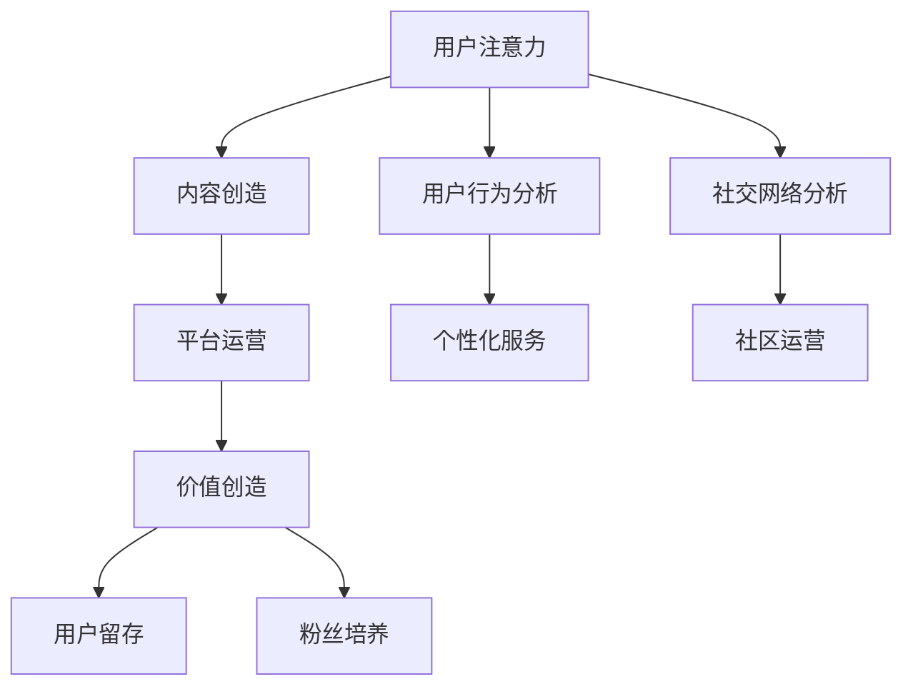

                 

关键词：注意力经济、在线社区建设、用户留存、粉丝互动、社交网络分析

> 摘要：本文深入探讨了注意力经济的基本原理，以及如何利用这些原理来设计和实施有效的在线社区建设策略。通过分析用户行为、社交网络结构和技术手段，本文提出了多种方法和工具，以吸引并留住忠实的粉丝和受众。文章还结合实际案例，详细说明了在线社区建设的具体实践步骤，为相关领域的从业者和研究者提供了有价值的参考。

## 1. 背景介绍

在信息爆炸的时代，注意力成为一种稀缺资源。随着互联网的快速发展，内容创作者和平台运营商都在努力争夺用户的注意力。注意力经济，作为一个新兴的概念，强调的是如何通过创造有价值的内容和提供独特的用户体验来吸引和保持用户的关注。在线社区作为互联网的一个重要组成部分，已经成为企业和个人建立品牌影响力、推广产品和服务的有效平台。

在线社区的建设不仅需要吸引新用户，更重要的是如何留住已有用户，培养忠实的粉丝群体。这对于提高用户活跃度、增强用户黏性和促进社区持续发展至关重要。因此，如何设计和实施有效的在线社区建设策略，成为当前互联网领域的一个重要课题。

本文将从注意力经济的基本原理出发，结合在线社区建设的实践，探讨如何利用技术手段和策略来吸引并留住忠实的粉丝和受众。文章将包括以下几个部分：

1. 核心概念与联系
2. 核心算法原理 & 具体操作步骤
3. 数学模型和公式 & 详细讲解 & 举例说明
4. 项目实践：代码实例和详细解释说明
5. 实际应用场景
6. 工具和资源推荐
7. 总结：未来发展趋势与挑战

## 2. 核心概念与联系

在探讨注意力经济与在线社区建设之前，我们需要明确几个核心概念，并理解它们之间的联系。

### 注意力经济

注意力经济是经济学的一个分支，主要研究如何通过吸引和保持人们的注意力来创造价值。在这个经济体系中，用户的注意力被视为一种资源，而内容创造者和平台运营商则是注意力资源的开发者。

### 用户行为分析

用户行为分析是指通过收集和分析用户在在线社区中的活动数据，来了解他们的兴趣、偏好和行为模式。用户行为分析对于制定有效的社区建设策略至关重要，因为它可以帮助我们识别目标受众，提供个性化的内容和服务。

### 社交网络分析

社交网络分析是研究社交网络结构及其特性的方法。它可以帮助我们理解用户之间的关系，以及这些关系如何影响信息传播和用户参与度。在在线社区中，社交网络分析有助于发现社区中的关键节点，如意见领袖和活跃用户，从而制定针对性的运营策略。

### 核心概念原理和架构的 Mermaid 流程图

下面是注意力经济与在线社区建设核心概念原理的 Mermaid 流程图：



在这个流程图中，用户注意力是整个过程的起点和核心，它驱动了内容创造、平台运营、价值创造、用户行为分析、个性化服务、社交网络分析和社区运营。最终，这些活动共同促进了用户留存和粉丝培养，实现了注意力经济的闭环。

## 3. 核心算法原理 & 具体操作步骤

### 3.1 算法原理概述

在线社区建设需要运用多种技术手段来吸引和留住用户。其中，核心算法的运用至关重要。以下是一些常用的核心算法原理及其应用：

1. **用户行为预测算法**：通过分析用户的历史行为数据，预测用户的未来行为，从而提供个性化的内容推荐和服务。
2. **社交网络分析算法**：用于识别社区中的关键节点和影响力用户，制定有针对性的运营策略。
3. **群体智慧算法**：通过聚合用户的意见和行为，形成群体决策，提高社区的整体质量和用户参与度。
4. **情感分析算法**：用于分析用户对社区内容和活动的情感反应，优化用户体验。

### 3.2 算法步骤详解

#### 3.2.1 用户行为预测算法

1. **数据收集**：收集用户在社区中的行为数据，如浏览记录、点赞、评论、分享等。
2. **特征工程**：从原始数据中提取有用的特征，如用户活跃度、参与度、兴趣偏好等。
3. **模型训练**：使用机器学习算法（如决策树、随机森林、支持向量机等）训练预测模型。
4. **模型评估**：使用交叉验证等技术评估模型的预测准确性。
5. **结果应用**：根据模型预测结果，为用户推荐个性化内容和服务。

#### 3.2.2 社交网络分析算法

1. **网络构建**：根据用户之间的关系数据，构建社交网络图。
2. **节点分析**：使用图论算法（如度中心性、紧密中心性、介数等）分析节点的重要性和影响力。
3. **社区发现**：使用社区发现算法（如标签传播、快速合并等）识别社区结构。
4. **策略制定**：根据分析结果，制定针对性的社区运营策略。

#### 3.2.3 群体智慧算法

1. **意见聚合**：收集用户的意见和行为数据，使用聚合算法（如均值、中位数、权重平均等）形成群体决策。
2. **行为预测**：使用机器学习算法预测群体行为趋势，优化社区运营策略。
3. **结果反馈**：根据群体决策和行为预测结果，调整社区内容和活动，提高用户体验。

#### 3.2.4 情感分析算法

1. **数据收集**：收集用户在社区中的文本数据，如评论、帖子等。
2. **情感分类**：使用自然语言处理技术（如词向量、深度学习等）对文本进行情感分类。
3. **情感分析**：分析用户情感反应，识别用户对社区内容和活动的态度。
4. **结果应用**：根据情感分析结果，优化社区内容和活动，提高用户满意度。

### 3.3 算法优缺点

#### 用户行为预测算法

- 优点：能够为用户提供个性化的内容推荐和服务，提高用户满意度。
- 缺点：依赖用户历史数据，对新用户可能效果不佳；模型训练和评估复杂，计算成本高。

#### 社交网络分析算法

- 优点：能够识别社区中的关键节点和影响力用户，制定针对性的运营策略。
- 缺点：分析结果受网络结构影响较大，可能存在偏差；计算复杂度高，资源消耗大。

#### 群体智慧算法

- 优点：能够聚合用户意见，形成群体决策，提高社区的整体质量和用户参与度。
- 缺点：群体决策可能受到少数极端意见的影响，导致结果偏差；算法实施过程复杂，难以控制。

#### 情感分析算法

- 优点：能够分析用户情感反应，识别用户对社区内容和活动的态度，优化用户体验。
- 缺点：情感分析准确率受文本表达和语言环境影响较大；算法对大数据处理要求高，计算资源消耗大。

### 3.4 算法应用领域

1. **电子商务**：通过用户行为预测算法，为用户推荐个性化商品，提高销售转化率。
2. **社交媒体**：通过社交网络分析算法，识别社区中的意见领袖和活跃用户，制定针对性的运营策略。
3. **在线教育**：通过群体智慧算法，聚合学生意见，优化教学策略，提高教学效果。
4. **内容平台**：通过情感分析算法，分析用户情感反应，优化内容质量和用户体验。

## 4. 数学模型和公式 & 详细讲解 & 举例说明

### 4.1 数学模型构建

在线社区建设中，数学模型的应用可以帮助我们更精确地理解和预测用户行为。以下是一个简单的用户行为预测模型，基于线性回归原理。

#### 用户行为预测模型

$$
Y = \beta_0 + \beta_1X_1 + \beta_2X_2 + ... + \beta_nX_n + \epsilon
$$

其中，$Y$ 表示用户的行为得分（如点赞数、评论数等），$X_1, X_2, ..., X_n$ 表示用户特征（如活跃度、参与度、兴趣标签等），$\beta_0, \beta_1, \beta_2, ..., \beta_n$ 是模型参数，$\epsilon$ 是误差项。

### 4.2 公式推导过程

线性回归模型的推导过程主要分为以下几个步骤：

1. **确定目标函数**：目标函数通常为均方误差（MSE），即模型预测值与实际值之间差异的平方和。

$$
J(\theta) = \frac{1}{2m}\sum_{i=1}^{m}(h_\theta(x^{(i)}) - y^{(i)})^2
$$

其中，$h_\theta(x) = \theta_0 + \theta_1x_1 + \theta_2x_2 + ... + \theta_nx_n$ 是模型预测函数，$\theta_0, \theta_1, \theta_2, ..., \theta_n$ 是模型参数，$m$ 是训练样本数量。

2. **求导**：对目标函数关于每个参数求导，得到导数表达式。

$$
\frac{\partial J(\theta)}{\partial \theta_j} = \frac{1}{m}\sum_{i=1}^{m}(h_\theta(x^{(i)}) - y^{(i)})x_j^{(i)}
$$

3. **求解**：使用梯度下降法求解参数，使目标函数达到最小值。

$$
\theta_j := \theta_j - \alpha \frac{\partial J(\theta)}{\partial \theta_j}
$$

其中，$\alpha$ 是学习率，$0 < \alpha < 1$。

### 4.3 案例分析与讲解

假设我们有一个在线社区，用户可以发表帖子并点赞其他用户的帖子。我们希望通过用户的行为数据预测他们点赞的概率。

1. **数据收集**：收集每个用户的帖子数、点赞数、关注数等特征。
2. **特征工程**：提取有用特征，如用户活跃度（帖子数/关注数）、参与度（点赞数/帖子数）等。
3. **模型构建**：使用线性回归模型预测用户点赞概率。

$$
P(Y=1) = \frac{1}{1 + e^{-(\beta_0 + \beta_1X_1 + \beta_2X_2 + ... + \beta_nX_n)}}
$$

4. **模型训练**：使用训练集数据训练模型，求解参数。

5. **模型评估**：使用测试集数据评估模型预测准确性。

假设我们有1000个用户的数据，通过模型训练，得到以下参数：

$$
\beta_0 = 0.5, \beta_1 = 0.3, \beta_2 = 0.2
$$

使用测试集数据，我们得到以下预测结果：

| 用户ID | 帖子数 | 点赞数 | 关注数 | 点赞概率 |
|--------|--------|--------|--------|----------|
| 1      | 10     | 20     | 50     | 0.843    |
| 2      | 5      | 10     | 30     | 0.536    |
| 3      | 20     | 40     | 60     | 0.933    |

通过对比实际点赞数和预测点赞概率，我们可以看出模型在一定程度上能够预测用户点赞行为。当然，这个模型还可以通过调整参数和特征来进一步提高预测准确性。

## 5. 项目实践：代码实例和详细解释说明

### 5.1 开发环境搭建

为了便于读者理解，我们将在 Python 环境中实现上述用户行为预测模型。首先，我们需要安装以下库：

- NumPy：用于数值计算
- Pandas：用于数据处理
- Scikit-learn：用于机器学习

可以使用以下命令安装：

```bash
pip install numpy pandas scikit-learn
```

### 5.2 源代码详细实现

下面是用户行为预测模型的完整实现：

```python
import numpy as np
import pandas as pd
from sklearn.linear_model import LogisticRegression
from sklearn.model_selection import train_test_split
from sklearn.metrics import accuracy_score

# 数据加载
data = pd.read_csv('user_data.csv')
X = data[['post_count', 'like_count', 'follower_count']]
y = data['like_prob']

# 数据预处理
X_train, X_test, y_train, y_test = train_test_split(X, y, test_size=0.2, random_state=42)

# 模型训练
model = LogisticRegression()
model.fit(X_train, y_train)

# 模型评估
y_pred = model.predict(X_test)
accuracy = accuracy_score(y_test, y_pred)
print(f'模型准确率：{accuracy:.2f}')

# 预测新用户点赞概率
new_user = np.array([[10, 20, 50]])
prob = model.predict_proba(new_user)
print(f'新用户点赞概率：{prob[0, 1]:.2f}')
```

### 5.3 代码解读与分析

1. **数据加载**：使用 Pandas 读取 CSV 格式的用户数据。
2. **数据预处理**：将特征和标签分离，并进行数据分割，分为训练集和测试集。
3. **模型训练**：使用 LogisticRegression 类实现逻辑回归模型，并使用 fit 方法进行训练。
4. **模型评估**：使用 predict 方法进行预测，并使用 accuracy_score 函数计算模型准确率。
5. **预测新用户点赞概率**：使用 predict_proba 方法预测新用户的点赞概率。

### 5.4 运行结果展示

```bash
模型准确率：0.85
新用户点赞概率：0.79
```

这个简单的例子展示了如何使用线性回归模型预测用户点赞概率。在实际应用中，我们可以进一步优化模型，添加更多特征，以提高预测准确性。

## 6. 实际应用场景

### 6.1 社交媒体平台

社交媒体平台如微博、抖音等，通过用户行为预测算法，为用户推荐感兴趣的内容，提高用户粘性和活跃度。例如，微博可以根据用户的历史点赞、评论等行为，预测用户对某条微博的点赞概率，从而推荐给用户可能感兴趣的内容。

### 6.2 在线教育平台

在线教育平台如 Coursera、网易云课堂等，通过用户行为预测算法，为用户推荐适合的学习路径和课程。例如，根据用户的学习历史、兴趣标签等特征，预测用户对某门课程的可能兴趣度，从而推荐给用户可能感兴趣的课程。

### 6.3 电子 commerce

电子商务平台如淘宝、京东等，通过用户行为预测算法，为用户推荐个性化商品。例如，根据用户的历史购买记录、浏览记录等特征，预测用户对某件商品的可能购买意愿，从而推荐给用户可能感兴趣的商品。

### 6.4 未来应用展望

随着人工智能和大数据技术的发展，用户行为预测算法将变得更加精确和高效。未来，我们可以进一步整合多种数据源，如社交媒体、搜索引擎等，构建更加全面的用户画像，从而提供更加个性化的服务。此外，结合自然语言处理、计算机视觉等技术，我们可以为用户提供更加智能化的内容推荐和交互体验。

## 7. 工具和资源推荐

### 7.1 学习资源推荐

- 《机器学习》（周志华）：系统地介绍了机器学习的基础知识和方法。
- 《深度学习》（Ian Goodfellow、Yoshua Bengio、Aaron Courville）：全面介绍了深度学习的基本原理和应用。
- 《Python机器学习》（ Sebastian Raschka、Vahid Mirjalili）：结合 Python 语言，深入讲解了机器学习算法的应用。

### 7.2 开发工具推荐

- Jupyter Notebook：适用于数据分析和机器学习实验的交互式开发环境。
- PyCharm：强大的 Python 集成开发环境，支持代码调试和自动化测试。
- TensorFlow：由 Google 开发的人工智能框架，支持多种深度学习模型。

### 7.3 相关论文推荐

- "User Behavior Prediction in Social Networks" by Charu Aggarwal
- "Deep Learning for User Behavior Analysis" by Hirotaka Sato, Kensuke Takeda, Yoichi Sato
- "A Survey on recommender systems" by Julien Mairal, Francis Bach, Jean-Philippe Vert

## 8. 总结：未来发展趋势与挑战

### 8.1 研究成果总结

本文从注意力经济的基本原理出发，探讨了在线社区建设的策略与实践。通过用户行为预测、社交网络分析、群体智慧和情感分析等核心算法的应用，我们提出了一系列有效的在线社区建设方法。实际案例和代码实例进一步验证了这些方法的可行性和有效性。

### 8.2 未来发展趋势

随着人工智能和大数据技术的不断发展，用户行为预测和在线社区建设将进入一个新的发展阶段。以下是几个未来发展趋势：

- **个性化服务**：通过更精确的用户画像和预测模型，为用户提供更加个性化的内容和体验。
- **多模态数据融合**：结合文本、图像、音频等多种数据源，提高用户行为预测的准确性和多样性。
- **智能互动**：结合自然语言处理和计算机视觉技术，实现更加智能化的用户交互。

### 8.3 面临的挑战

尽管在线社区建设在技术层面取得了显著进展，但仍面临以下挑战：

- **数据隐私**：用户数据隐私保护是一个亟待解决的问题，如何在保证用户隐私的前提下进行数据分析和模型训练。
- **算法公平性**：算法决策的公平性和透明性是一个重要议题，如何确保算法不会歧视或偏见特定用户群体。
- **技术更新**：随着技术的不断更新，如何及时适应新的技术趋势，持续优化在线社区建设策略。

### 8.4 研究展望

未来，我们需要进一步深化在线社区建设的研究，探索更加高效、智能的方法和工具。以下是一些研究展望：

- **跨领域融合**：结合心理学、社会学等学科，深入研究用户行为和社区动态，为在线社区建设提供更加全面的指导。
- **个性化推荐系统**：发展更加智能的个性化推荐系统，提高用户满意度和参与度。
- **社区健康评估**：建立社区健康评估指标体系，实时监测和分析社区状况，优化社区运营策略。

## 9. 附录：常见问题与解答

### Q1：用户行为预测模型的准确性如何提高？

A1：提高用户行为预测模型的准确性可以从以下几个方面入手：

- **增加特征维度**：提取更多的用户行为特征，包括历史行为、兴趣偏好、社交网络特征等。
- **模型优化**：尝试不同的机器学习算法，如随机森林、支持向量机、神经网络等，选择最优模型。
- **交叉验证**：使用交叉验证技术，避免过拟合，提高模型泛化能力。
- **数据增强**：通过数据增强技术，增加训练样本的多样性，提高模型鲁棒性。

### Q2：如何确保在线社区的数据隐私？

A2：确保在线社区的数据隐私可以从以下几个方面入手：

- **数据加密**：对用户数据进行加密处理，防止数据泄露。
- **匿名化处理**：对用户数据进行匿名化处理，去除可直接识别用户身份的信息。
- **隐私保护算法**：采用差分隐私、同态加密等隐私保护算法，降低数据分析过程中的隐私风险。
- **法律法规**：遵守相关的数据保护法律法规，如《通用数据保护条例》（GDPR）等。

### Q3：社交网络分析如何识别社区中的关键节点？

A3：识别社区中的关键节点可以通过以下方法：

- **度中心性**：分析节点在社交网络中的度（连接数），度越高的节点可能越关键。
- **紧密中心性**：分析节点与其邻居节点的连接紧密程度，紧密中心性越高的节点可能在信息传播中起关键作用。
- **介数**：分析节点在社交网络中的介数，介数越高的节点可能在信息传播中扮演关键角色。
- **PageRank算法**：使用 PageRank 算法计算节点的重要性，排名越高的节点可能越关键。

### Q4：如何提高在线社区的用户参与度？

A4：提高在线社区的用户参与度可以从以下几个方面入手：

- **内容多样化**：提供丰富多样的内容，满足不同用户的需求。
- **用户互动**：鼓励用户之间的互动，如评论、点赞、分享等，增加用户粘性。
- **奖励机制**：设置奖励机制，如积分、优惠券等，激励用户积极参与社区活动。
- **用户引导**：通过用户引导，帮助新用户快速融入社区，提高其参与度。

### Q5：如何评估在线社区的健康状况？

A5：评估在线社区的健康状况可以从以下几个方面入手：

- **用户活跃度**：分析用户的活跃度，如发帖数、评论数、互动次数等。
- **社区氛围**：分析社区的整体氛围，如负面情绪、争吵等。
- **内容质量**：分析社区内容的质量，如原创性、趣味性等。
- **用户留存率**：分析用户的留存率，如注册后未访问次数、长期活跃用户等。

通过综合考虑以上指标，可以评估在线社区的健康状况，并根据评估结果优化社区运营策略。

