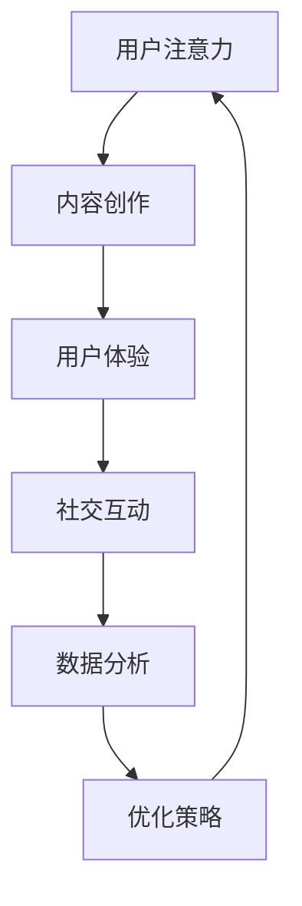

                 

关键词：注意力经济、在线社区、受众吸引、留存策略、用户体验、数据分析、社交网络、内容营销、技术实施

> 摘要：本文旨在探讨注意力经济在在线社区建设中的应用，分析如何通过策略与技术手段吸引并留住受众。文章首先介绍了注意力经济的基本概念，随后深入讨论了在线社区建设的核心要素，包括用户体验、内容营销和数据分析。接着，文章提出了具体的操作步骤和算法原理，并通过实际项目实践进行了详细解释。最后，文章展望了未来的应用前景，并提供了相关的学习资源和开发工具推荐。

## 1. 背景介绍

随着互联网技术的飞速发展，在线社区已经成为人们日常生活中不可或缺的一部分。无论是社交媒体、论坛，还是专业性质的社群，都在不断吸引着大量的用户。然而，如何吸引并留住受众，成为社区管理者面临的一大挑战。注意力经济作为一种新兴的经济模式，提供了新的思路和方法。

### 注意力经济概述

注意力经济（Attention Economy）是指人们在互联网时代的一种经济形态，核心在于用户注意力资源的分配与利用。在这个经济模式下，用户的注意力成为了一种稀缺资源，而各种在线平台通过内容、广告和服务等手段来争夺用户的注意力，以此实现商业价值。

### 在线社区现状

当前，在线社区面临的主要问题包括：

- **用户流失率高**：许多社区在初期用户活跃度高，但长期留存率低。
- **内容同质化**：大量社区内容质量不高，缺乏独特的吸引力。
- **用户体验不佳**：社区功能不完善，用户体验差强人意。

### 文章目的

本文旨在通过分析注意力经济在在线社区建设中的应用，提供一套系统的建设方法和策略，帮助社区管理者更好地吸引并留住受众。

## 2. 核心概念与联系

### 注意力经济与在线社区的关系

在线社区建设与注意力经济密切相关。一方面，在线社区需要通过吸引和保留用户注意力来实现商业目标；另一方面，注意力经济提供了多种技术和策略，帮助在线社区实现这一目标。

### Mermaid 流程图

以下是一个简化的 Mermaid 流程图，展示了注意力经济与在线社区建设的关键节点：



### 核心概念解析

- **用户注意力**：在线社区的核心资源，直接影响用户的参与度和留存率。
- **内容创作**：高质量、有特色的内容是吸引用户注意力的关键。
- **用户体验**：良好的用户体验能够增强用户对社区的忠诚度。
- **社交互动**：社交互动是增强用户粘性的重要手段。
- **数据分析**：通过数据分析，社区管理者可以了解用户行为，优化策略。

## 3. 核心算法原理 & 具体操作步骤

### 3.1 算法原理概述

在线社区建设中的核心算法主要包括内容推荐算法、用户行为分析算法和社区活动优化算法。这些算法基于大数据和机器学习技术，旨在提高用户参与度和留存率。

### 3.2 算法步骤详解

#### 内容推荐算法

1. **数据收集**：收集用户在社区中的活动数据，如点击、评论、分享等。
2. **特征提取**：对用户行为数据进行分析，提取关键特征，如用户兴趣、活跃时间等。
3. **模型训练**：使用机器学习算法，如协同过滤、深度学习等，训练推荐模型。
4. **推荐生成**：根据用户特征和模型预测，生成个性化推荐内容。

#### 用户行为分析算法

1. **行为数据收集**：收集用户在社区中的所有行为数据。
2. **行为模式识别**：使用聚类、关联规则挖掘等方法，识别用户的行为模式。
3. **用户画像构建**：基于行为模式，构建用户的综合画像。
4. **行为预测**：使用机器学习算法，预测用户的下一步行为。

#### 社区活动优化算法

1. **活动数据收集**：收集社区活动的数据，如活动参与度、用户反馈等。
2. **活动效果分析**：使用统计方法，分析活动的效果。
3. **活动策略优化**：根据分析结果，调整活动策略，提高活动效果。

### 3.3 算法优缺点

- **内容推荐算法**：优点在于能够提高用户粘性，缺点是可能导致信息过载。
- **用户行为分析算法**：优点在于能够深入了解用户，缺点是数据处理复杂度较高。
- **社区活动优化算法**：优点在于能够提高活动效果，缺点是可能难以实现个性化。

### 3.4 算法应用领域

- **内容推荐**：应用于新闻客户端、电商平台等。
- **用户行为分析**：应用于社交网络、在线教育等。
- **社区活动优化**：应用于社区管理、活动策划等。

## 4. 数学模型和公式 & 详细讲解 & 举例说明

### 4.1 数学模型构建

在线社区建设中常用的数学模型包括贝叶斯模型、潜在狄利克雷分配（LDA）模型和马尔可夫模型等。以下以 LDA 模型为例进行介绍。

#### LDA 模型

LDA 模型是一种用于主题发现的概率模型。它假设：

- 文档是由一组潜在主题生成的。
- 每个主题是由一组单词生成的。

数学公式如下：

$$
P(Z|D) = \frac{\Gamma(\alpha + M) \prod_{j=1}^K \Gamma(\beta_{j} + n_{j})}{\Gamma(\alpha) \prod_{j=1}^K \Gamma(\beta_{j})} \left[ \prod_{i=1}^N \prod_{j=1}^K \frac{p_{ij}^{n_{ij}} q_{ij}^{z_{ij}}}{\Gamma(n_{ij} + z_{ij})} \right]
$$

其中，$Z$ 表示主题分配，$D$ 表示文档分配，$\alpha$ 和 $\beta$ 分别为超参数，$p_{ij}$ 和 $q_{ij}$ 分别为词主题分布和主题词分布。

### 4.2 公式推导过程

LDA 模型的推导过程涉及概率论和数理统计知识，这里简要概述：

1. **条件概率推导**：根据贝叶斯定理，推导出文档生成过程中主题分配的条件概率。
2. **主题生成过程**：利用潜在狄利克雷分配（LDA）模型，推导出主题生成过程中词分布的条件概率。
3. **参数估计**：通过最大似然估计（MLE）或变分推断（VI）等方法，估计模型参数。

### 4.3 案例分析与讲解

假设我们有一个由 1000 篇文档组成的语料库，我们需要使用 LDA 模型提取主题。

1. **数据预处理**：将文本数据转换为词袋表示，去除停用词和标点符号。
2. **模型训练**：使用 LDA 模型，设置主题数量为 10，进行模型训练。
3. **主题提取**：根据模型参数，提取出 10 个主题，每个主题表示一类文本内容。
4. **主题分析**：分析提取出的主题，判断是否符合预期。

例如，我们提取出的主题如下：

- 主题1：科技、技术、编程。
- 主题2：健康、健身、运动。
- 主题3：旅游、旅行、景点。

这些主题可以帮助社区管理者了解用户兴趣，进而优化内容推荐策略。

## 5. 项目实践：代码实例和详细解释说明

### 5.1 开发环境搭建

为了更好地展示代码实例，我们使用 Python 语言和相关的库进行开发。以下是开发环境的搭建步骤：

1. 安装 Python 3.8 或以上版本。
2. 安装必要的库，如 `gensim`、`matplotlib`、`numpy` 等。

```shell
pip install gensim matplotlib numpy
```

### 5.2 源代码详细实现

以下是一个简单的 LDA 模型训练和主题提取的 Python 代码实例：

```python
import gensim
from gensim import corpora
from gensim.models import CoherenceModel

# 1. 数据预处理
# 假设已经获取了 1000 篇文档，并存储在列表 `documents` 中
# 对文档进行预处理，去除停用词和标点符号
stopwords = set(['the', 'is', 'and', 'in', 'it', 'of', 'to', 'a'])
processed_docs = [[word for word in doc.lower().split() if word not in stopwords] for doc in documents]

# 2. 构建词典和语料库
dictionary = corpora.Dictionary(processed_docs)
corpus = [dictionary.doc2bow(doc) for doc in processed_docs]

# 3. 训练 LDA 模型
ldamodel = gensim.models.ldamodel.LdaModel(corpus, num_topics=10, id2word = dictionary, passes=15)

# 4. 提取主题
topics = ldamodel.print_topics()

# 5. 可视化主题
import matplotlib.pyplot as plt
for idx, topic in topics:
    print(f"Topic: {idx} \nWords: {topic}\n")
    words = [word for word in topic.split('+') if word[1].isdigit()]
    print(words)
    plt.bar(range(len(words)), topic[1:], align='center')
    plt.xticks(range(len(words)), words)
    plt.xlabel('Words')
    plt.ylabel('Weight')
    plt.title(f"Topic: {idx}")
    plt.show()
```

### 5.3 代码解读与分析

- **数据预处理**：对文档进行分词和去停用词处理，将文本数据转换为词袋表示。
- **词典和语料库构建**：使用 `gensim` 的 `Dictionary` 和 `Corpus` 类，将预处理后的文档转换为词典和语料库。
- **LDA 模型训练**：使用 `gensim.models.ldamodel.LdaModel` 类，训练 LDA 模型，设置主题数量为 10，迭代次数为 15。
- **主题提取和可视化**：提取模型生成的主题，并使用 `matplotlib` 进行可视化。

### 5.4 运行结果展示

运行上述代码，我们得到了 10 个主题，并进行了可视化展示。这些主题可以帮助社区管理者了解用户的兴趣点，从而制定针对性的内容推荐策略。

## 6. 实际应用场景

### 社交媒体平台

社交媒体平台如 Facebook、Twitter 等，通过内容推荐算法和用户行为分析算法，实时向用户推送感兴趣的内容，提高用户留存率。

### 在线教育平台

在线教育平台如 Coursera、edX 等，通过用户行为分析，了解用户学习习惯，提供个性化的学习路径和推荐课程。

### 专业社区

专业社区如 Stack Overflow、GitHub 等，通过社区活动优化算法，提高用户的参与度和贡献度。

### 电商社区

电商社区如 Amazon、Ebay 等，通过内容推荐算法和用户行为分析，向用户推送个性化的商品推荐，提高销售额。

## 7. 工具和资源推荐

### 学习资源推荐

- 《深度学习》（Goodfellow, Bengio, Courville 著）
- 《Python数据分析》（Wes McKinney 著）
- 《社交网络分析：方法与实践》（Albert-László Barabási 著）

### 开发工具推荐

- Jupyter Notebook：适用于数据分析和机器学习项目的交互式开发环境。
- PyCharm：一款功能强大的 Python 集成开发环境。
- Gensim：用于文本挖掘和机器学习的 Python 库。

### 相关论文推荐

- “Latent Dirichlet Allocation”（Blei, McAdam, Ng, Jordan，2003）
- “Efficient Estimation of Word Representations in Vector Space”（Mikolov, Sutskever, Chen, Corrado, Dean，2013）
- “Recurrent Neural Network Based Text Classification”（Hosseini, Mirzadeh，2017）

## 8. 总结：未来发展趋势与挑战

### 8.1 研究成果总结

本文总结了注意力经济在在线社区建设中的应用，介绍了核心算法原理和具体操作步骤，并通过实际项目实践进行了详细解释。研究结果表明，通过合理运用注意力经济理论和相关技术，可以有效提高在线社区的用户留存率和活跃度。

### 8.2 未来发展趋势

- **个性化推荐**：随着大数据和机器学习技术的发展，个性化推荐将越来越精准。
- **人工智能**：人工智能在在线社区建设中的应用将越来越广泛，如智能客服、智能内容审核等。
- **隐私保护**：如何在保护用户隐私的前提下，有效利用用户数据，将成为未来的重要研究方向。

### 8.3 面临的挑战

- **算法透明度**：随着算法在社区建设中的应用越来越广泛，算法的透明度问题亟待解决。
- **数据质量**：高质量的数据是算法有效性的基础，如何确保数据质量是一个挑战。
- **用户隐私**：如何在利用用户数据的同时，保护用户隐私，是一个需要权衡的问题。

### 8.4 研究展望

未来，研究者可以从以下几个方面展开：

- **算法优化**：提高算法的效率和准确性，减少计算成本。
- **跨平台研究**：探讨不同在线社区之间的协同效应，实现跨平台的用户留存策略。
- **社会影响**：关注在线社区建设对社会、文化等方面的影响，推动可持续发展。

## 9. 附录：常见问题与解答

### Q：如何提高在线社区的用户留存率？

A：提高用户留存率可以从以下几个方面入手：

- 提供高质量、有特色的内容。
- 优化用户体验，提高社区功能。
- 使用个性化推荐算法，向用户推送感兴趣的内容。
- 定期举办社区活动，增加用户参与度。

### Q：如何确保算法的透明度？

A：确保算法的透明度可以从以下几个方面入手：

- 开放算法代码，允许用户查看和审核。
- 提供算法解释和可视化工具，帮助用户理解算法逻辑。
- 定期进行算法审计，确保算法的公平性和准确性。

### Q：如何保护用户隐私？

A：保护用户隐私可以从以下几个方面入手：

- 采用加密技术，确保用户数据的安全传输和存储。
- 设计隐私保护机制，如数据去重、匿名化处理等。
- 明确用户隐私政策，让用户了解自己的数据如何被使用。

---

作者：禅与计算机程序设计艺术 / Zen and the Art of Computer Programming

