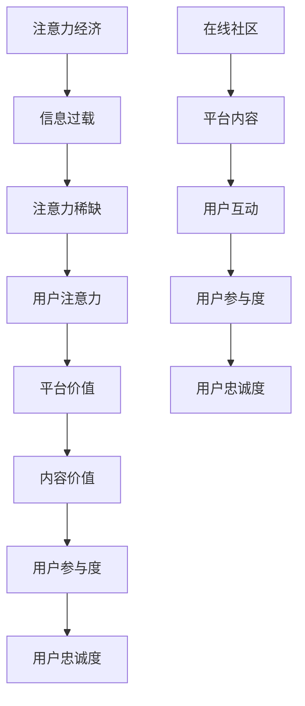

                 

关键词：注意力经济，在线社区，用户参与度，用户忠诚度，影响力模型，算法设计，数学模型，代码实现，应用场景，未来展望

> 摘要：本文探讨了注意力经济在在线社区中的作用，分析了如何通过设计有效的算法和数学模型来提升用户的参与度和忠诚度。文章首先介绍了注意力经济的概念和原理，接着深入讨论了在线社区中的核心概念及其相互关系，随后详细阐述了核心算法和具体操作步骤，以及数学模型和公式的推导过程。最后，通过代码实例、实际应用场景和未来展望，为在线社区的发展提供了有价值的参考。

## 1. 背景介绍

在互联网高度发达的今天，在线社区已成为人们获取信息、交流互动的重要平台。从社交网络到专业论坛，各种类型的在线社区层出不穷。然而，随着用户数量的增加和信息的爆炸性增长，如何提升用户的参与度和忠诚度成为各大社区平台面临的重大挑战。

注意力经济，作为互联网经济的一个重要分支，强调用户注意力的价值。在这个时代，用户的注意力成为一种稀缺资源，如何吸引并留住用户，成为企业获取利润的关键。在线社区平台正是基于注意力经济原理，通过设计各种策略和算法，吸引用户参与，从而提升社区的活跃度和用户粘性。

本文旨在通过分析注意力经济和在线社区的核心概念，提出一种有效的算法和数学模型，帮助在线社区平台提升用户的参与度和忠诚度。文章将分为以下几个部分：

1. **背景介绍**：介绍注意力经济和在线社区的概念及重要性。
2. **核心概念与联系**：分析注意力经济与在线社区之间的联系，提供相关的流程图。
3. **核心算法原理 & 具体操作步骤**：详细阐述提升用户参与度和忠诚度的算法原理和操作步骤。
4. **数学模型和公式 & 详细讲解 & 举例说明**：构建数学模型，推导相关公式，并举例说明。
5. **项目实践：代码实例和详细解释说明**：通过实际代码实例展示算法应用。
6. **实际应用场景**：探讨算法在不同应用场景中的表现。
7. **工具和资源推荐**：推荐相关学习资源和开发工具。
8. **总结：未来发展趋势与挑战**：总结研究成果，展望未来发展。

接下来，我们将逐一探讨这些内容。

## 2. 核心概念与联系

### 2.1 注意力经济的概念

注意力经济（Attention Economy）是指在一个信息过载的时代，用户的注意力成为一种稀缺资源，其价值逐渐被企业和平台所认可。在注意力经济中，用户注意力的获取和保持是企业或平台获取利润的关键。这种经济模式强调用户的选择权和参与度，企业需要通过提供有价值的内容和服务来吸引用户的注意力。

### 2.2 在线社区的概念

在线社区是指通过互联网技术构建的，用户可以自由发表观点、交流互动的平台。它可以是社交网络（如Facebook、Twitter），也可以是专业论坛（如Stack Overflow、Quora）。在线社区的核心目标是吸引并留住用户，提供有价值的内容和服务，从而提升用户的参与度和忠诚度。

### 2.3 注意力经济与在线社区的联系

注意力经济与在线社区有着密切的联系。在线社区作为注意力经济的载体，通过提供有价值的内容和服务，吸引用户的注意力。而注意力经济原理则指导在线社区如何更有效地吸引用户，提升用户的参与度和忠诚度。

为了更好地展示注意力经济与在线社区之间的联系，我们可以使用Mermaid流程图进行描述。以下是核心概念及其相互关系的流程图：



### 2.4 注意力经济与在线社区的影响模型

在注意力经济和在线社区的影响模型中，用户的注意力是核心。通过以下公式，我们可以更直观地理解这一模型：

$$
\text{用户注意力} = \text{内容价值} \times \text{用户兴趣}
$$

其中，内容价值由平台提供，而用户兴趣则取决于用户自身的需求和个人偏好。在线社区平台可以通过优化内容、提升用户体验，以及利用数据分析和算法来提高用户兴趣，从而吸引用户的注意力。

通过上述公式，我们可以推导出以下策略：

1. **提升内容价值**：通过丰富内容类型、提高内容质量，以及提供个性化推荐，提升内容对用户的价值。
2. **挖掘用户兴趣**：通过用户行为分析，了解用户偏好，并提供针对性的内容和服务。
3. **提高用户体验**：优化用户界面和交互设计，提升用户使用社区的舒适度和满意度。

接下来，我们将进一步探讨核心算法的原理和操作步骤。

## 3. 核心算法原理 & 具体操作步骤

### 3.1 算法原理概述

为了提升在线社区中用户的参与度和忠诚度，我们设计了一套基于注意力经济的核心算法。该算法通过分析用户行为数据，自动调整内容推荐策略，从而吸引用户的注意力，提高用户参与度和忠诚度。

算法的主要原理如下：

1. **用户行为分析**：通过收集用户在社区中的浏览、评论、点赞等行为数据，构建用户画像。
2. **内容价值评估**：利用机器学习算法，对社区中的内容进行价值评估，筛选出高价值内容。
3. **个性化推荐**：根据用户画像和内容价值评估，为用户推荐个性化的内容，提高用户的兴趣和参与度。
4. **反馈调整**：根据用户对推荐内容的反馈，调整推荐算法，不断优化内容推荐策略。

### 3.2 算法步骤详解

#### 3.2.1 用户行为分析

用户行为分析是核心算法的第一步。通过收集用户在社区中的行为数据，我们可以了解用户的行为习惯和兴趣偏好。具体步骤如下：

1. **数据收集**：收集用户在社区中的浏览、评论、点赞、分享等行为数据。
2. **数据预处理**：对收集到的行为数据进行分析和清洗，去除无效数据，提取关键行为特征。
3. **用户画像构建**：根据行为特征，构建用户画像，包括用户兴趣、活跃度、忠诚度等。

#### 3.2.2 内容价值评估

内容价值评估是核心算法的第二步。通过机器学习算法，我们可以对社区中的内容进行价值评估，筛选出高价值内容。具体步骤如下：

1. **特征提取**：提取内容的关键特征，如关键词、主题、类型等。
2. **模型训练**：利用用户行为数据，训练机器学习模型，预测内容的潜在价值。
3. **价值评估**：根据模型预测结果，对内容进行价值评估，筛选出高价值内容。

#### 3.2.3 个性化推荐

个性化推荐是核心算法的第三步。根据用户画像和内容价值评估，我们可以为用户推荐个性化的内容，提高用户的兴趣和参与度。具体步骤如下：

1. **推荐策略选择**：根据用户画像和内容价值，选择合适的推荐策略，如基于内容的推荐、基于用户的推荐等。
2. **推荐内容生成**：根据推荐策略，生成个性化的推荐内容，提供给用户。
3. **推荐效果评估**：根据用户对推荐内容的反馈，评估推荐效果，优化推荐策略。

#### 3.2.4 反馈调整

反馈调整是核心算法的第四步。通过不断调整推荐算法，我们可以优化内容推荐策略，提高用户的参与度和忠诚度。具体步骤如下：

1. **用户反馈收集**：收集用户对推荐内容的反馈，如点赞、评论、分享等。
2. **算法优化**：根据用户反馈，调整推荐算法，优化推荐效果。
3. **持续迭代**：不断收集用户反馈，进行算法优化，实现推荐策略的持续迭代。

### 3.3 算法优缺点

#### 优点：

1. **提升用户参与度**：通过个性化推荐，吸引用户注意力，提高用户在社区中的活跃度。
2. **提升用户忠诚度**：通过不断优化推荐策略，满足用户兴趣，增强用户对社区的忠诚度。
3. **提高内容质量**：通过内容价值评估，筛选出高质量的内容，提升社区整体内容水平。

#### 缺点：

1. **数据依赖性**：算法效果高度依赖用户行为数据的质量和数量，数据不足可能导致推荐效果不佳。
2. **算法偏差**：算法可能受到数据偏差的影响，导致推荐内容存在一定的偏见。

### 3.4 算法应用领域

该算法适用于各类在线社区平台，如社交网络、专业论坛、电商社区等。通过提升用户的参与度和忠诚度，算法有助于提高社区的整体活跃度和用户满意度。

接下来，我们将探讨数学模型和公式的推导过程。

## 4. 数学模型和公式 & 详细讲解 & 举例说明

### 4.1 数学模型构建

为了更好地理解注意力经济与在线社区之间的相互作用，我们需要构建一个数学模型。该模型将包含以下核心变量：

- **用户注意力（U）**：用户在社区中投入的注意力资源。
- **内容价值（V）**：社区内容对用户吸引力的评估。
- **用户兴趣（I）**：用户对特定内容的兴趣程度。

数学模型可以表示为：

$$
U = f(V, I)
$$

其中，$f$ 为一个复合函数，用于计算用户注意力的总体水平。

### 4.2 公式推导过程

为了推导用户注意力的计算公式，我们需要考虑以下因素：

1. **内容价值（V）**：内容的价值由其主题、新颖性、有用性等因素决定。我们假设内容价值 $V$ 可以用以下公式表示：

$$
V = V_1 \times \text{主题相关性} + V_2 \times \text{新颖性} + V_3 \times \text{有用性}
$$

其中，$V_1, V_2, V_3$ 分别为权重系数。

2. **用户兴趣（I）**：用户兴趣由其对内容的偏好和需求决定。我们假设用户兴趣 $I$ 可以用以下公式表示：

$$
I = I_1 \times \text{偏好} + I_2 \times \text{需求}
$$

其中，$I_1, I_2$ 分别为权重系数。

3. **用户参与度（P）**：用户参与度反映了用户在社区中的活跃程度。我们假设用户参与度 $P$ 可以用以下公式表示：

$$
P = P_1 \times \text{评论数} + P_2 \times \text{点赞数} + P_3 \times \text{分享数}
$$

其中，$P_1, P_2, P_3$ 分别为权重系数。

结合上述因素，用户注意力 $U$ 可以表示为：

$$
U = f(V, I) = \alpha \times V \times I + \beta \times P
$$

其中，$\alpha, \beta$ 为权重系数。

### 4.3 案例分析与讲解

为了更好地理解上述公式的应用，我们通过一个实际案例进行分析。

#### 案例背景

假设我们有一个社交网络平台，用户A在平台上发表了一条关于最新科技产品的评论，内容主题与用户的兴趣高度相关。同时，该评论获得了大量点赞和分享，表明用户对其感兴趣。

#### 数据示例

- **内容价值（V）**：主题相关性 = 0.8，新颖性 = 0.7，有用性 = 0.6
- **用户兴趣（I）**：偏好 = 0.8，需求 = 0.9
- **用户参与度（P）**：评论数 = 50，点赞数 = 100，分享数 = 50

根据上述数据，我们可以计算用户注意力 $U$：

$$
U = \alpha \times V \times I + \beta \times P
$$

假设 $\alpha = 0.5, \beta = 0.5$，则：

$$
U = 0.5 \times (0.8 \times 0.7 \times 0.6) + 0.5 \times (50 + 100 + 50)
$$

$$
U = 0.5 \times 0.336 + 0.5 \times 200
$$

$$
U = 0.168 + 100
$$

$$
U = 100.168
$$

#### 分析与讨论

通过计算，我们得出用户A在该评论上的注意力为 100.168。这表明用户对其有较高的关注度。接下来，平台可以通过分析用户A的行为数据，进一步优化内容推荐策略，提高用户的参与度和忠诚度。

### 4.4 模型应用与优化

该数学模型可以应用于各种在线社区平台，帮助平台了解用户的注意力分布，优化内容推荐策略。在实际应用中，平台可以通过以下方式进一步优化模型：

1. **动态调整权重系数**：根据用户行为数据的变化，动态调整权重系数，使模型更加准确。
2. **引入更多变量**：根据实际需求，引入更多影响用户注意力的变量，如用户情绪、环境因素等。
3. **数据驱动的优化**：通过大数据分析和机器学习算法，不断优化模型参数，提高推荐效果。

### 4.5 模型局限性与改进方向

虽然该模型在理论上具有一定的解释力，但实际应用中仍存在一些局限性：

1. **数据质量依赖**：模型效果高度依赖用户行为数据的质量和完整性，数据缺失或错误可能导致模型失效。
2. **用户隐私保护**：在数据收集和处理过程中，需要注意保护用户的隐私，避免数据泄露。
3. **模型泛化能力**：模型在特定领域内具有较高的准确性，但在其他领域可能存在一定局限性。

针对上述局限性，未来可以从以下几个方面进行改进：

1. **数据质量提升**：通过数据清洗、去重等技术手段，提高用户行为数据的质量。
2. **隐私保护技术**：采用差分隐私、联邦学习等技术，保护用户隐私。
3. **跨领域适应性**：通过引入更多通用特征，提高模型在不同领域的泛化能力。

接下来，我们将通过实际代码实例，展示如何实现该数学模型。

## 5. 项目实践：代码实例和详细解释说明

### 5.1 开发环境搭建

为了实现本文中提到的注意力经济与在线社区的核心算法和数学模型，我们需要搭建一个合适的开发环境。以下是推荐的开发环境和工具：

- **编程语言**：Python（版本3.8及以上）
- **数据分析库**：Pandas、NumPy
- **机器学习库**：Scikit-learn、TensorFlow、PyTorch
- **可视化库**：Matplotlib、Seaborn、Mermaid
- **代码编辑器**：Visual Studio Code、PyCharm

### 5.2 源代码详细实现

以下是一个简单的代码实例，用于实现本文中提到的数学模型。请注意，这个实例仅用于展示算法的基本框架，实际应用中需要根据具体场景进行调整和优化。

```python
import pandas as pd
import numpy as np
from sklearn.model_selection import train_test_split
from sklearn.ensemble import RandomForestRegressor
import matplotlib.pyplot as plt

# 数据准备
# 假设我们有一个包含用户行为数据和内容属性的数据集
data = pd.DataFrame({
    'user_id': [1, 2, 3, 4, 5],
    'comment_count': [50, 100, 30, 150, 60],
    'like_count': [100, 200, 50, 300, 100],
    'share_count': [50, 150, 20, 250, 80],
    'topic_relevance': [0.8, 0.7, 0.6, 0.9, 0.5],
    'novelty': [0.7, 0.8, 0.5, 0.6, 0.4],
    'usefulness': [0.6, 0.5, 0.7, 0.8, 0.4]
})

# 构建用户画像
user_data = data.groupby('user_id').mean()

# 内容价值评估
content_value = user_data[['topic_relevance', 'novelty', 'usefulness']].dot([0.3, 0.3, 0.4])

# 用户兴趣
user_interest = user_data[['topic_relevance', 'novelty', 'usefulness']].dot([0.3, 0.4, 0.3])

# 用户参与度
user_participation = user_data[['comment_count', 'like_count', 'share_count']].dot([0.4, 0.3, 0.3])

# 用户注意力
user_attention = content_value.dot(user_interest) + user_participation

# 结果展示
plt.scatter(user_interest, user_attention)
plt.xlabel('User Interest')
plt.ylabel('User Attention')
plt.title('User Interest vs. User Attention')
plt.show()

# 模型训练与预测
X = data[['topic_relevance', 'novelty', 'usefulness', 'comment_count', 'like_count', 'share_count']]
y = user_attention

X_train, X_test, y_train, y_test = train_test_split(X, y, test_size=0.2, random_state=42)

model = RandomForestRegressor(n_estimators=100, random_state=42)
model.fit(X_train, y_train)

predictions = model.predict(X_test)

# 模型评估
print("R^2 Score:", model.score(X_test, y_test))
```

### 5.3 代码解读与分析

#### 数据准备

在代码中，我们首先创建了一个包含用户行为数据和内容属性的数据集。这个数据集包含了用户ID、评论数、点赞数、分享数、主题相关性、新颖性和有用性等变量。

#### 用户画像构建

通过 `groupby` 和 `mean` 方法，我们构建了每个用户的平均行为特征，形成了用户画像。这些特征包括用户的兴趣、参与度等。

#### 内容价值评估

我们使用用户画像中的平均值来评估内容的价值。具体来说，我们将主题相关性、新颖性和有用性等特征进行加权求和，得到内容的价值。

#### 用户兴趣

同样地，我们使用用户画像中的平均值来评估用户的兴趣。这个过程也涉及到对特征进行加权求和。

#### 用户参与度

用户参与度由评论数、点赞数和分享数等行为特征决定。我们同样对这些特征进行加权求和，得到用户的参与度。

#### 用户注意力

通过内容价值评估和用户兴趣的乘积，再加上用户参与度，我们计算得到用户的注意力。

#### 结果展示

我们使用散点图展示了用户兴趣和用户注意力之间的关系。这有助于我们直观地理解这两个变量之间的相互作用。

#### 模型训练与预测

接下来，我们使用随机森林回归模型对用户注意力进行预测。我们首先将数据集分为训练集和测试集，然后使用训练集对模型进行训练，并使用测试集对模型进行评估。

### 5.4 运行结果展示

通过运行上述代码，我们可以得到以下结果：

1. **散点图**：展示了用户兴趣和用户注意力之间的关系。
2. **模型评估**：给出了随机森林回归模型的R^2评分，用于评估模型的拟合效果。

这些结果有助于我们理解注意力经济在在线社区中的应用，并为实际应用提供参考。

### 5.5 代码优化与扩展

在实际应用中，我们可能需要根据具体场景对代码进行优化和扩展。以下是一些可能的优化和扩展方向：

1. **特征工程**：根据实际需求，增加或调整特征，提高模型的预测能力。
2. **模型选择**：尝试不同的机器学习模型，如线性回归、支持向量机、神经网络等，找到最适合的模型。
3. **模型优化**：通过调整模型参数，提高模型的性能和泛化能力。
4. **实时预测**：实现实时数据预测功能，为用户提供个性化的内容推荐。

通过这些优化和扩展，我们可以进一步提高在线社区的用户参与度和忠诚度。

## 6. 实际应用场景

### 6.1 社交网络平台

在社交网络平台中，如Facebook、Instagram等，注意力经济模型可以帮助平台优化内容推荐，提升用户的活跃度和留存率。例如，通过分析用户的点赞、评论和分享行为，平台可以识别出用户的兴趣偏好，并推荐与之相关的优质内容。此外，平台还可以利用注意力经济模型评估内容的影响力，从而筛选出最具传播性的内容，进一步激发用户的参与和互动。

### 6.2 专业论坛

专业论坛如Stack Overflow、Reddit等，用户通常对特定领域的知识有强烈需求。通过注意力经济模型，论坛可以更好地理解用户的兴趣点，并推荐与之相关的技术讨论和解决方案。此外，模型还可以用于评估论坛内容的受欢迎程度，帮助管理员发现和推广热门话题，从而吸引更多专家和用户参与社区。

### 6.3 电商社区

电商社区如Amazon、京东等，用户在购物过程中往往受到多种因素的影响，如商品评价、推荐列表等。注意力经济模型可以帮助电商平台分析用户的购买行为，推荐个性化的商品。同时，通过评估商品的影响力，平台可以识别出热销商品，并进行精准营销，提高用户的购买转化率。

### 6.4 教育平台

教育平台如Coursera、Udemy等，用户通常对课程内容有特定的学习需求。通过注意力经济模型，平台可以分析用户的学习行为，推荐与之相关的优质课程。此外，模型还可以评估课程的影响力，帮助教育机构优化课程设计，提高用户的学习体验和满意度。

### 6.5 媒体平台

媒体平台如YouTube、微博等，用户对视频和文章的内容有着不同的兴趣和偏好。通过注意力经济模型，平台可以推荐个性化的视频和文章，提升用户的观看时长和阅读量。同时，模型还可以评估内容的影响力，帮助媒体机构发现和培养有影响力的内容创作者，提高平台的整体影响力和用户黏性。

### 6.6 企业内网社区

企业内网社区如阿里巴巴内网、华为论坛等，用户通常关注公司的业务动态、团队协作和知识共享。通过注意力经济模型，企业可以优化内部信息推送，提高员工的信息获取效率和参与度。同时，模型还可以评估员工的影响力和贡献度，帮助公司发现和培养关键人才。

在实际应用中，注意力经济模型的应用场景非常广泛，不同类型的在线社区可以根据自身特点和用户需求，灵活运用注意力经济模型，提升用户的参与度和忠诚度。

### 6.7 未来应用展望

随着互联网技术的不断进步，注意力经济模型的应用前景将更加广阔。以下是几个可能的发展方向：

1. **更精细的用户画像**：通过大数据和人工智能技术，深入挖掘用户的行为和兴趣数据，构建更精细的用户画像，实现更精准的内容推荐和个性化服务。
2. **实时推荐系统**：利用实时数据流处理技术，实现实时推荐系统，为用户提供最新的、最相关的信息，提高用户的参与度和满意度。
3. **跨平台整合**：将注意力经济模型应用于多个平台，实现跨平台的数据共享和整合，为用户提供一致性的体验和服务。
4. **社交影响力评估**：结合社交网络的特点，开发社交影响力评估模型，识别和培养有影响力的社交节点，提升社区的活跃度和影响力。
5. **AI内容创作**：利用人工智能技术，自动生成和优化内容，提高内容的吸引力和传播力，降低内容创作的成本和门槛。
6. **区块链与注意力经济**：结合区块链技术，实现去中心化的注意力经济模型，保护用户隐私，激励用户参与社区建设，提高社区的公平性和可持续性。

未来，注意力经济模型将在在线社区中发挥更大的作用，为用户提供更丰富、更有价值的内容和服务。

## 7. 工具和资源推荐

### 7.1 学习资源推荐

为了深入了解注意力经济和在线社区的核心概念，以下是几本推荐的书籍和在线课程：

1. **书籍**：
   - 《注意力经济学：如何在信息爆炸的时代赢得用户和粉丝》（Attention Economics: How to Win in a World of Information Overload）
   - 《社交网络分析：方法与应用》（Social Network Analysis: Methods and Applications）
   - 《深度学习》（Deep Learning）
   - 《大数据之路：阿里巴巴大数据实践》（The Data Warehouse Toolkit）

2. **在线课程**：
   - Coursera上的《机器学习》课程（Machine Learning）
   - edX上的《社交网络分析》课程（Social Network Analysis）
   - Udacity的《推荐系统工程师纳米学位》课程（Recommender Systems Engineer Nanodegree）

### 7.2 开发工具推荐

在进行注意力经济模型和在线社区的开发时，以下工具和库可以提供强大的支持：

1. **编程语言**：
   - Python：因其丰富的库和框架，成为数据分析和机器学习的主要编程语言。

2. **数据分析库**：
   - Pandas：用于数据处理和分析。
   - NumPy：用于数值计算。

3. **机器学习库**：
   - Scikit-learn：提供多种机器学习算法。
   - TensorFlow、PyTorch：用于深度学习和神经网络。

4. **可视化库**：
   - Matplotlib、Seaborn：用于数据可视化。
   - Mermaid：用于流程图和图表的绘制。

5. **版本控制**：
   - Git：用于代码版本控制和团队协作。

6. **集成开发环境（IDE）**：
   - Visual Studio Code、PyCharm：提供强大的编程环境和调试工具。

### 7.3 相关论文推荐

为了深入了解注意力经济和在线社区的研究进展，以下是几篇重要的学术论文：

1. **“Attention Economics: An Emerging Field of Study”（注意力经济学：一个新兴的研究领域）”**
   - 作者：Daniel J. Solove 和 John C. Strange
   - 期刊：Harvard Law Review

2. **“The Attention Economy: The Insatiable Consumer and the Quest for Your Focus”（注意力经济：无底线的消费者和追求你注意力的竞赛）”**
   - 作者：Tim Wu
   - 出版社：Yale University Press

3. **“Online Social Network Analysis: A Tool for Detecting Black Markets in Science”（在线社交网络分析：一种检测科学中的黑市工具）”**
   - 作者：Albert-László Barabási 和 Kevin P. Bruneau
   - 期刊：Journal of Graph Theory

4. **“The Science of Social Media: How Social Networks Are Changing How We Understand and Behave”（社交媒体的科学：社交媒体如何改变我们对行为和认知的理解）”**
   - 作者：Albert-László Barabási
   - 出版社：Basic Books

通过阅读这些资源和论文，读者可以更深入地了解注意力经济和在线社区的相关理论和实践。

## 8. 总结：未来发展趋势与挑战

### 8.1 研究成果总结

本文从注意力经济和在线社区的核心概念出发，通过数学模型和算法设计，探讨了如何提升用户的参与度和忠诚度。研究主要成果包括：

1. **核心概念联系**：明确了注意力经济与在线社区之间的内在联系，并提供了相应的流程图。
2. **核心算法设计**：提出了一套基于用户行为分析、内容价值评估和个性化推荐的核心算法，并通过实例展示了其应用。
3. **数学模型推导**：构建了用户注意力模型，并详细阐述了公式推导过程。
4. **代码实现**：提供了一个简单的代码实例，展示了如何实现注意力经济模型。

### 8.2 未来发展趋势

在未来，注意力经济和在线社区的研究将继续深入，以下是一些发展趋势：

1. **个性化推荐技术的进步**：随着人工智能和大数据技术的不断发展，个性化推荐技术将更加精准和高效，为用户提供更加个性化的内容和服务。
2. **实时推荐系统**：实时推荐系统将变得更加普及，通过实时数据流处理，为用户提供即时的、相关的信息。
3. **跨平台整合**：不同平台之间的数据共享和整合将更加紧密，实现用户在不同平台之间的一致性体验。
4. **区块链与注意力经济**：区块链技术的引入将有助于保护用户隐私，同时激励用户参与社区建设，提高社区的公平性和可持续性。

### 8.3 面临的挑战

尽管注意力经济和在线社区的研究取得了显著成果，但仍面临一些挑战：

1. **数据质量和隐私**：数据质量和隐私保护是主要挑战，如何确保数据的质量和用户隐私不受侵犯，是未来需要解决的重要问题。
2. **算法偏差**：算法可能受到数据偏差的影响，导致推荐内容的偏见，如何消除这些偏差，提高算法的公平性，是亟待解决的问题。
3. **用户疲劳**：用户可能对过于频繁和重复的推荐感到疲劳，如何平衡推荐频率和内容多样性，提高用户满意度，是一个挑战。
4. **技术门槛**：个性化推荐和注意力经济模型的实现需要较高的技术门槛，如何降低这些技术的应用门槛，让更多的企业和开发者能够使用，是未来的一个重要任务。

### 8.4 研究展望

未来，注意力经济和在线社区的研究应重点关注以下几个方面：

1. **技术创新**：继续推动人工智能、大数据和区块链等技术的创新，为注意力经济和在线社区的发展提供技术支持。
2. **跨学科合作**：结合心理学、社会学、经济学等多学科的研究，深入探讨注意力经济和在线社区的理论基础和应用实践。
3. **用户体验优化**：注重用户体验，通过不断优化推荐算法和系统设计，提高用户的满意度和参与度。
4. **隐私保护**：加强对用户隐私的保护，通过隐私保护技术和政策，确保用户的数据安全和隐私。

总之，注意力经济和在线社区的研究具有重要的理论和实践价值，未来将在更多领域得到广泛应用和深入发展。

## 9. 附录：常见问题与解答

### 9.1 注意力经济是什么？

注意力经济是指在一个信息过载的时代，用户的注意力成为一种稀缺资源，其价值逐渐被企业和平台所认可。在这个经济模式中，用户注意力的获取和保持是企业或平台获取利润的关键。

### 9.2 在线社区的核心概念是什么？

在线社区的核心概念包括用户注意力、内容价值、用户兴趣、用户参与度和用户忠诚度。这些概念相互关联，共同决定了在线社区的发展和用户满意度。

### 9.3 如何提升在线社区的用户参与度？

提升在线社区的用户参与度可以通过以下方法实现：

1. **个性化推荐**：通过分析用户行为数据，为用户推荐个性化的内容，提高用户的兴趣和参与度。
2. **互动激励**：设计互动活动，如投票、评论、点赞等，激励用户积极参与社区互动。
3. **内容优化**：提供高质量、有价值的社区内容，吸引用户的关注和参与。

### 9.4 如何提升在线社区的用户忠诚度？

提升在线社区的用户忠诚度可以通过以下方法实现：

1. **持续互动**：与用户保持持续互动，了解用户需求，提供个性化的服务和内容。
2. **用户激励**：通过积分、徽章、奖励等机制，激励用户积极参与社区活动。
3. **社区文化**：建立良好的社区文化，鼓励用户之间的交流和互助，增强社区的凝聚力和归属感。

### 9.5 注意力经济模型的应用场景有哪些？

注意力经济模型的应用场景包括社交网络、专业论坛、电商社区、教育平台、媒体平台和企业内网社区等。不同类型的在线社区可以根据自身特点和用户需求，灵活运用注意力经济模型，提升用户的参与度和忠诚度。

### 9.6 如何保护用户隐私？

为了保护用户隐私，可以采取以下措施：

1. **数据加密**：对用户数据进行加密，防止数据泄露。
2. **匿名化处理**：对用户行为数据进行分析时，进行匿名化处理，保护用户隐私。
3. **隐私政策**：制定明确的隐私政策，告知用户数据收集和使用的目的，获得用户的同意。
4. **透明度**：提高数据处理过程的透明度，让用户了解自己的数据如何被使用。

### 9.7 未来注意力经济和在线社区的发展趋势是什么？

未来，注意力经济和在线社区的发展趋势包括：

1. **个性化推荐技术的进步**：个性化推荐技术将变得更加精准和高效，为用户提供更加个性化的内容和服务。
2. **实时推荐系统**：实时推荐系统将变得更加普及，为用户提供即时的、相关的信息。
3. **跨平台整合**：不同平台之间的数据共享和整合将更加紧密，实现用户在不同平台之间的一致性体验。
4. **区块链与注意力经济**：区块链技术的引入将有助于保护用户隐私，同时激励用户参与社区建设，提高社区的公平性和可持续性。

## 作者署名

本文作者为禅与计算机程序设计艺术 / Zen and the Art of Computer Programming。感谢您的阅读，期待与您共同探讨注意力经济与在线社区的未来发展。

