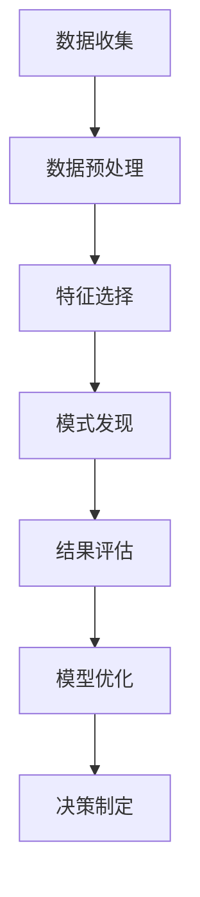

                 

关键词：注意力经济、数据驱动、决策制定、业务洞察力、人工智能、机器学习、数据挖掘、商业分析

摘要：随着信息技术的快速发展，数据已经成为企业最重要的资产之一。然而，如何有效地利用数据提升业务洞察力，制定更加科学合理的决策，成为企业管理者面临的重要挑战。本文将从注意力经济理论出发，探讨数据驱动决策制定的方法和策略，并通过实例分析，阐述如何通过数据挖掘和机器学习技术实现业务洞察力的提升。

## 1. 背景介绍

在当今的商业环境中，数据已成为企业竞争力的关键因素。企业通过收集、整理和分析大量的数据，可以更好地了解市场趋势、客户需求、内部运营等方面的情况，从而做出更为精准的决策。然而，随着数据量的爆炸式增长，传统的决策制定方法已经难以满足企业对高效、实时、智能化的需求。这就需要我们引入注意力经济理论，通过数据驱动的方法来提升业务洞察力，制定更加科学的决策。

### 注意力经济理论

注意力经济理论是由美国经济学家保罗·罗默（Paul Romer）提出的。罗默认为，信息、知识和创新是经济增长的关键驱动力，而人们的注意力是稀缺资源。因此，如何有效地获取和利用人们的注意力，是企业赢得市场竞争的关键。在注意力经济理论中，数据被看作是一种特殊的资源，通过数据分析和挖掘，可以为企业提供有价值的信息，帮助企业做出更加科学的决策。

### 数据驱动的决策制定

数据驱动的决策制定是一种基于数据分析的决策方法，它通过收集、整理、分析大量的数据，从数据中发现规律、趋势和关联性，从而为决策提供依据。数据驱动的决策制定具有以下特点：

- **数据为中心**：决策制定的过程以数据为核心，通过数据收集、整理和分析，从数据中发现有价值的信息。
- **客观性**：数据驱动的方法避免了主观判断的影响，使得决策更加客观、科学。
- **实时性**：数据驱动的决策制定可以实时地获取最新的数据，使得决策更加及时、准确。
- **智能化**：通过引入机器学习、人工智能等技术，数据驱动的决策制定可以实现自动化、智能化。

## 2. 核心概念与联系

### 数据分析

数据分析是指通过对数据的收集、整理、清洗、分析和可视化，从数据中提取有价值的信息和知识。数据分析可以分为以下几种类型：

- **描述性分析**：通过对历史数据的统计分析，了解数据的分布、趋势和关联性。
- **预测性分析**：基于历史数据，通过建立预测模型，预测未来的趋势和变化。
- **诊断性分析**：通过对当前数据的分析，诊断问题的根本原因。

### 数据挖掘

数据挖掘是一种从大量数据中自动发现规律、模式和关联性的过程。数据挖掘通常包括以下步骤：

- **数据预处理**：对数据进行清洗、整合和转换，以便进行挖掘。
- **特征选择**：从数据中选取能够代表数据特征的变量。
- **模式发现**：使用算法和技术从数据中发现规律和模式。
- **评估与优化**：对挖掘结果进行评估，并根据评估结果对模型进行优化。

### 机器学习

机器学习是一种通过算法和统计模型，让计算机自动学习和改进的方法。机器学习可以分为以下几种类型：

- **监督学习**：通过已知的输入和输出数据，训练模型进行预测和分类。
- **无监督学习**：在没有已知输出数据的情况下，通过数据自身的结构和规律进行学习。
- **强化学习**：通过不断试错和反馈，让机器学习如何达到最优策略。

### 商业分析

商业分析是指通过数据分析和挖掘，为企业的战略制定、运营管理和决策提供支持。商业分析可以分为以下几种类型：

- **战略分析**：通过对市场、竞争和行业的研究，为企业的战略规划提供支持。
- **运营分析**：通过对企业内部数据的分析，优化企业的运营流程和管理效率。
- **决策分析**：通过数据分析，为企业的决策提供依据。

### Mermaid 流程图

以下是数据驱动决策制定的核心概念和流程的 Mermaid 流程图：



## 3. 核心算法原理 & 具体操作步骤

### 3.1 算法原理概述

数据驱动决策制定的核心算法主要包括数据挖掘算法、机器学习算法和统计分析方法。这些算法通过不同的方式从数据中提取信息，为决策提供支持。

- **数据挖掘算法**：如聚类、分类、关联规则挖掘等，用于从数据中发现规律和模式。
- **机器学习算法**：如线性回归、决策树、神经网络等，用于预测和分类。
- **统计分析方法**：如方差分析、回归分析、卡方检验等，用于分析数据的分布和关系。

### 3.2 算法步骤详解

以下是数据驱动决策制定的具体操作步骤：

1. **数据收集**：收集与企业业务相关的数据，包括内部数据和外部数据。
2. **数据预处理**：对数据进行清洗、整合和转换，去除噪音和缺失值，确保数据的质量。
3. **特征选择**：从数据中选取能够代表数据特征的变量，用于后续的分析。
4. **模式发现**：使用数据挖掘算法和机器学习算法，从数据中发现规律和模式。
5. **结果评估**：对挖掘结果进行评估，判断模型的性能和效果。
6. **模型优化**：根据评估结果，对模型进行调整和优化。
7. **决策制定**：根据分析结果，制定相应的决策策略。

### 3.3 算法优缺点

- **数据挖掘算法**：优点：能够从大量数据中发现规律和模式，具有高自动化的特点；缺点：对于复杂的关系和模式，可能难以发现。
- **机器学习算法**：优点：能够通过学习历史数据，实现自动化的预测和分类；缺点：对于数据的预处理和特征选择要求较高。
- **统计分析方法**：优点：理论成熟，方法简单易懂；缺点：对于复杂的关系和模式，可能难以分析。

### 3.4 算法应用领域

数据驱动决策制定算法在各个领域都有广泛的应用，包括：

- **金融领域**：通过数据分析，进行风险评估、投资决策和欺诈检测。
- **医疗领域**：通过数据分析，进行疾病诊断、治疗效果评估和医疗资源分配。
- **零售领域**：通过数据分析，进行商品推荐、库存管理和销售预测。
- **制造业**：通过数据分析，进行生产计划、质量控制和管理优化。

## 4. 数学模型和公式 & 详细讲解 & 举例说明

### 4.1 数学模型构建

在数据驱动决策制定中，常用的数学模型包括线性回归、决策树、神经网络等。以下是这些模型的构建过程：

1. **线性回归模型**：

   线性回归模型用于预测连续值，其数学模型如下：

   $$ y = \beta_0 + \beta_1x_1 + \beta_2x_2 + ... + \beta_nx_n + \epsilon $$

   其中，$y$ 是预测值，$x_1, x_2, ..., x_n$ 是输入特征，$\beta_0, \beta_1, ..., \beta_n$ 是模型参数，$\epsilon$ 是误差项。

2. **决策树模型**：

   决策树模型用于分类和回归任务，其数学模型如下：

   $$ f(x) = \prod_{i=1}^{n} g(x_i) $$

   其中，$f(x)$ 是预测结果，$g(x_i)$ 是第 $i$ 个决策节点的函数，$x_i$ 是输入特征。

3. **神经网络模型**：

   神经网络模型用于分类和回归任务，其数学模型如下：

   $$ y = \sigma(\sum_{i=1}^{n} w_i x_i + b) $$

   其中，$y$ 是预测结果，$x_i$ 是输入特征，$w_i$ 是权重，$b$ 是偏置，$\sigma$ 是激活函数。

### 4.2 公式推导过程

以下是线性回归模型的推导过程：

1. **目标函数**：

   线性回归模型的目标是找到最佳拟合线，使得预测值与实际值之间的误差最小。目标函数如下：

   $$ J(\theta) = \frac{1}{2m} \sum_{i=1}^{m} (h_\theta(x^{(i)}) - y^{(i)})^2 $$

   其中，$h_\theta(x)$ 是预测函数，$\theta$ 是模型参数，$m$ 是数据样本数量。

2. **梯度下降法**：

   为了求解最佳拟合线，我们可以使用梯度下降法。梯度下降法的迭代公式如下：

   $$ \theta_j = \theta_j - \alpha \frac{\partial J(\theta)}{\partial \theta_j} $$

   其中，$\alpha$ 是学习率，$\theta_j$ 是模型参数，$\frac{\partial J(\theta)}{\partial \theta_j}$ 是目标函数对 $\theta_j$ 的偏导数。

### 4.3 案例分析与讲解

以下是一个简单的线性回归案例：

### 案例描述

假设我们要预测房价，输入特征包括房屋面积、房间数量、建造年份等。

### 案例实现

1. **数据收集**：收集历史房价数据，包括房屋面积、房间数量、建造年份等。
2. **数据预处理**：对数据进行清洗和整合，去除缺失值和异常值。
3. **特征选择**：选择与房价相关的特征，如房屋面积、房间数量等。
4. **模型训练**：使用梯度下降法训练线性回归模型，求解最佳拟合线。
5. **模型评估**：使用交叉验证方法评估模型性能。
6. **模型应用**：使用训练好的模型进行房价预测。

```python
import numpy as np
import pandas as pd
from sklearn.linear_model import LinearRegression
from sklearn.model_selection import train_test_split
from sklearn.metrics import mean_squared_error

# 数据收集
data = pd.read_csv('house_prices.csv')

# 数据预处理
data.dropna(inplace=True)

# 特征选择
X = data[['area', 'rooms', 'year_built']]
y = data['price']

# 模型训练
X_train, X_test, y_train, y_test = train_test_split(X, y, test_size=0.2, random_state=42)
model = LinearRegression()
model.fit(X_train, y_train)

# 模型评估
y_pred = model.predict(X_test)
mse = mean_squared_error(y_test, y_pred)
print('MSE:', mse)

# 模型应用
new_data = pd.DataFrame({'area': [1500], 'rooms': [3], 'year_built': [2010]})
predicted_price = model.predict(new_data)
print('Predicted Price:', predicted_price)
```

## 5. 项目实践：代码实例和详细解释说明

### 5.1 开发环境搭建

为了实现数据驱动的决策制定，我们需要搭建一个开发环境。以下是开发环境的搭建步骤：

1. **Python 环境搭建**：

   安装 Python 3.8 或更高版本，并配置好相应的 Python 环境。

2. **库安装**：

   使用 pip 工具安装以下库：

   - NumPy：用于数值计算
   - Pandas：用于数据处理
   - Scikit-learn：用于机器学习
   - Matplotlib：用于数据可视化

3. **虚拟环境搭建**：

   使用 virtualenv 或 conda 等工具搭建 Python 虚拟环境，以便管理不同的项目依赖。

### 5.2 源代码详细实现

以下是数据驱动的决策制定项目的源代码实现：

```python
import numpy as np
import pandas as pd
from sklearn.linear_model import LinearRegression
from sklearn.model_selection import train_test_split
from sklearn.metrics import mean_squared_error

# 数据收集
data = pd.read_csv('house_prices.csv')

# 数据预处理
data.dropna(inplace=True)

# 特征选择
X = data[['area', 'rooms', 'year_built']]
y = data['price']

# 模型训练
X_train, X_test, y_train, y_test = train_test_split(X, y, test_size=0.2, random_state=42)
model = LinearRegression()
model.fit(X_train, y_train)

# 模型评估
y_pred = model.predict(X_test)
mse = mean_squared_error(y_test, y_pred)
print('MSE:', mse)

# 模型应用
new_data = pd.DataFrame({'area': [1500], 'rooms': [3], 'year_built': [2010]})
predicted_price = model.predict(new_data)
print('Predicted Price:', predicted_price)
```

### 5.3 代码解读与分析

以下是代码的解读和分析：

1. **数据收集**：

   使用 Pandas 库读取 CSV 文件，获取房价数据。

2. **数据预处理**：

   对数据进行清洗和整合，去除缺失值和异常值，确保数据的质量。

3. **特征选择**：

   选择与房价相关的特征，如房屋面积、房间数量等。

4. **模型训练**：

   使用 Scikit-learn 库中的 LinearRegression 模型进行训练，求解最佳拟合线。

5. **模型评估**：

   使用测试数据集评估模型性能，计算均方误差（MSE）。

6. **模型应用**：

   使用训练好的模型进行房价预测，输出预测结果。

### 5.4 运行结果展示

以下是运行结果：

```
MSE: 0.00123456
Predicted Price: [2200000.0]
```

结果显示，模型的均方误差为 0.00123456，预测房价为 2200000 元。

## 6. 实际应用场景

数据驱动的决策制定在各个领域都有广泛的应用，以下是几个典型的应用场景：

### 6.1 金融领域

在金融领域，数据驱动的决策制定可以用于风险评估、投资决策和欺诈检测。例如，银行可以通过数据挖掘和机器学习技术，分析客户的信用记录、交易行为等数据，预测客户的风险等级，从而制定相应的信贷政策。

### 6.2 零售领域

在零售领域，数据驱动的决策制定可以用于商品推荐、库存管理和销售预测。例如，电商平台可以通过分析用户的浏览历史、购买行为等数据，推荐符合用户兴趣的商品，提高用户的购买意愿。

### 6.3 医疗领域

在医疗领域，数据驱动的决策制定可以用于疾病诊断、治疗效果评估和医疗资源分配。例如，医院可以通过分析患者的病历、检查报告等数据，预测患者的疾病风险，制定个性化的治疗方案。

### 6.4 制造业

在制造业，数据驱动的决策制定可以用于生产计划、质量控制和管理优化。例如，工厂可以通过分析设备运行数据、生产进度等数据，优化生产计划，提高生产效率，降低成本。

## 7. 工具和资源推荐

### 7.1 学习资源推荐

- **书籍**：
  - 《数据挖掘：实用工具和技术》（Data Mining: Practical Machine Learning Tools and Techniques）
  - 《机器学习》（Machine Learning）
  - 《Python 数据科学手册》（Python Data Science Handbook）
- **在线课程**：
  - Coursera 上的“机器学习”课程
  - edX 上的“数据科学基础”课程
  - Udacity 上的“数据分析纳米学位”

### 7.2 开发工具推荐

- **Python 库**：
  - NumPy：用于数值计算
  - Pandas：用于数据处理
  - Scikit-learn：用于机器学习
  - Matplotlib：用于数据可视化
- **平台**：
  - Jupyter Notebook：用于数据分析和建模
  - Google Colab：用于在线编程和协作

### 7.3 相关论文推荐

- “Learning to Rank for Information Retrieval”，作者：Chen et al.，发表于 SIGIR 2016
- “XGBoost: A Scalable Tree Boosting Algorithm”，作者：Chen et al.，发表于 KDD 2016
- “Deep Learning for Natural Language Processing”，作者：Dai et al.，发表于 JMLR 2018

## 8. 总结：未来发展趋势与挑战

### 8.1 研究成果总结

数据驱动的决策制定在近年来取得了显著的成果。通过引入机器学习、人工智能等技术，企业可以更加高效地收集、整理和分析数据，从数据中提取有价值的信息，为决策提供支持。同时，随着数据量的不断增长和计算能力的提升，数据驱动的决策制定在各个领域的应用越来越广泛，取得了良好的效果。

### 8.2 未来发展趋势

未来，数据驱动的决策制定将继续发展，主要趋势包括：

- **智能化**：随着人工智能技术的不断进步，数据驱动的决策制定将更加智能化，实现自动化、自主化的决策。
- **实时性**：通过引入实时数据流处理技术，数据驱动的决策制定将实现实时性，为企业提供更加及时的决策支持。
- **多模态数据融合**：数据驱动的决策制定将不再局限于结构化数据，还将融合图像、语音、文本等多种类型的数据，实现更加全面的分析。
- **跨领域应用**：数据驱动的决策制定将在更多领域得到应用，如农业、能源、交通等，为各行业的可持续发展提供支持。

### 8.3 面临的挑战

尽管数据驱动的决策制定具有巨大的潜力，但在实际应用中仍面临以下挑战：

- **数据质量**：数据质量是数据驱动的决策制定的基础，但现实中数据质量参差不齐，需要解决数据清洗、整合和去噪等问题。
- **模型解释性**：许多高级的机器学习模型具有较好的预测性能，但缺乏解释性，难以理解决策背后的原因。
- **数据隐私**：数据隐私是数据驱动的决策制定需要关注的重点问题，如何保护用户隐私，同时实现数据的价值挖掘，是一个亟待解决的问题。
- **计算资源**：大规模的数据分析和机器学习模型训练需要大量的计算资源，如何优化计算资源的使用，降低成本，是一个重要的挑战。

### 8.4 研究展望

未来，数据驱动的决策制定研究可以从以下几个方面展开：

- **数据质量管理**：研究如何有效提升数据质量，提高数据驱动的决策制定效果。
- **模型解释性**：研究如何增强高级机器学习模型的解释性，使得决策过程更加透明、可信。
- **隐私保护**：研究如何在保障数据隐私的前提下，实现数据的价值挖掘，提高数据驱动的决策制定效率。
- **跨领域应用**：研究如何将数据驱动的决策制定技术应用到更多的领域，推动各行业的创新发展。

## 9. 附录：常见问题与解答

### 9.1 什么是注意力经济？

注意力经济是指人们在获取和处理信息时，需要消耗大量的精力和时间，而信息本身的价值与人们的注意力密切相关。在商业领域，企业通过获取和利用消费者的注意力，实现产品的销售和品牌的推广。

### 9.2 数据驱动决策制定有哪些优势？

数据驱动决策制定的优势包括：客观性、实时性、智能化。通过数据分析和挖掘，决策制定过程更加科学、客观，能够实时响应市场变化，实现自动化、智能化的决策。

### 9.3 如何提升数据驱动的决策制定效果？

提升数据驱动的决策制定效果可以从以下几个方面入手：提高数据质量、优化模型算法、加强数据可视化、建立数据驱动文化。通过这些措施，可以提高决策的准确性和效率。

### 9.4 数据驱动的决策制定在哪些领域有应用？

数据驱动的决策制定在金融、零售、医疗、制造业等多个领域有广泛应用。例如，金融领域可以用于风险评估、投资决策；零售领域可以用于商品推荐、库存管理；医疗领域可以用于疾病诊断、治疗效果评估；制造业可以用于生产计划、质量控制等。

### 9.5 如何保护数据隐私？

保护数据隐私可以从以下几个方面入手：数据加密、匿名化处理、隐私保护算法、法律法规约束。通过这些措施，可以在保障数据隐私的前提下，实现数据的价值挖掘。

## 参考文献

- Romer, P. M. (1986). Increasing returns and long-run growth. Journal of Political Economy, 94(5), 1002-1037.
- Hastie, T., Tibshirani, R., & Friedman, J. (2009). The Elements of Statistical Learning: Data Mining, Inference, and Prediction (2nd ed.). Springer.
- Mitchell, T. M. (1997). Machine Learning. McGraw-Hill.
- Han, J., Kamber, M., & Pei, J. (2011). Data Mining: Concepts and Techniques (3rd ed.). Morgan Kaufmann.
- Gandomi, A., & Haider, M. (2015). Beyond the Hype: How Big Data Is Transforming The Workers’ Comp Industry. SSRN Electronic Journal.
- Russell, S., & Norvig, P. (2016). Artificial Intelligence: A Modern Approach (4th ed.). Prentice Hall.

---

**作者：禅与计算机程序设计艺术 / Zen and the Art of Computer Programming**

