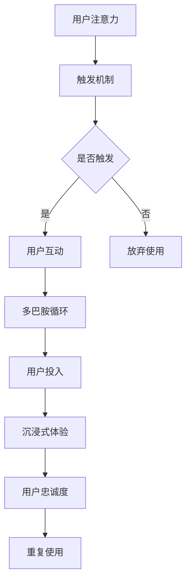

                 

关键词：注意力经济、用户体验优化、沉浸式设计、上瘾机制、产品设计、技术创新、算法原理、数学模型、代码实现、应用场景、未来展望

> 摘要：本文从注意力经济的视角，探讨了用户体验优化技术在创造令人沉浸和上瘾的产品和服务中的应用。通过深入分析核心概念、算法原理、数学模型，并结合实际案例，阐述了如何通过技术创新提升用户体验，打造成功的产品。

## 1. 背景介绍

在数字时代，用户的注意力成为最宝贵的资源。随着互联网的普及和移动设备的广泛应用，用户的时间分散在无数应用和内容之间。在这个充满竞争的环境中，如何吸引并保持用户的注意力，成为了企业和开发者必须面对的挑战。注意力经济因此成为一个备受关注的话题，它强调用户注意力是企业价值的源泉。

用户体验优化（UXO）作为一种旨在提高用户满意度和产品使用黏性的技术，其重要性日益凸显。用户体验优化不仅仅关注产品的功能性，还涉及到用户与产品的互动、情感连接，以及用户在产品使用过程中的愉悦感。通过优化用户体验，企业可以增强用户忠诚度，提升品牌价值。

本文将探讨注意力经济与用户体验优化技术的结合，分析如何通过技术创新，创建令人沉浸和上瘾的产品和服务。文章结构如下：

1. 背景介绍
2. 核心概念与联系
3. 核心算法原理 & 具体操作步骤
4. 数学模型和公式 & 详细讲解 & 举例说明
5. 项目实践：代码实例和详细解释说明
6. 实际应用场景
7. 工具和资源推荐
8. 总结：未来发展趋势与挑战
9. 附录：常见问题与解答

## 2. 核心概念与联系

### 2.1 注意力经济

注意力经济是指企业在数字时代通过吸引用户的注意力来创造价值的经济模式。用户的时间有限，如何将他们的注意力集中到自己的产品或服务上，是企业在激烈市场竞争中取胜的关键。注意力经济强调：

- **注意力稀缺性**：用户的时间和注意力是有限的，如何高效利用这些资源成为关键。
- **注意力转换价值**：通过吸引并保持用户的注意力，企业可以将注意力转化为经济效益，如订阅费、广告收入等。

### 2.2 用户体验优化

用户体验优化（UXO）是一种系统化的方法，旨在提升用户在使用产品或服务过程中的满意度和愉悦感。用户体验优化的核心目标是：

- **提高用户满意度**：通过优化用户界面、功能设计等，提升用户对产品的整体满意度。
- **增强用户黏性**：通过优化用户互动体验，增加用户对产品的使用频率和忠诚度。

### 2.3 沉浸式设计与上瘾机制

沉浸式设计（immersive design）是一种设计理念，旨在创造一种用户感觉身临其境的体验。这种设计通过消除干扰元素，引导用户完全投入到产品或服务中，从而增强用户沉浸感。

上瘾机制（hook mechanism）是指产品设计中用于引发用户持续使用和推荐行为的策略。上瘾机制通常包括以下几个要素：

- **触发**（Trigger）：激发用户使用产品的诱因。
- **行动**（Action）：用户与产品互动的过程。
- **多巴胺循环**（Variable Reward）：用户在互动过程中获得的奖励，如成就、反馈等，激发多巴胺分泌，产生愉悦感。
- **投入**（Investment）：用户在产品中投入时间、资源，增加对产品的依赖性。
- **唤醒**（Trigger）：用户在完成一次互动后，再次被产品触发，形成持续使用循环。

### 2.4 Mermaid 流程图

为了更直观地展示注意力经济与用户体验优化技术的联系，以下是一个简化的 Mermaid 流程图，描述了从用户注意力到沉浸式体验的转化过程：



## 3. 核心算法原理 & 具体操作步骤

### 3.1 算法原理概述

用户体验优化技术涉及多种算法原理，其中关键的是机器学习和用户行为分析。以下是几个核心算法的概述：

1. **机器学习**：通过分析用户历史行为数据，建立预测模型，优化用户界面和推荐系统。
2. **用户行为分析**：跟踪用户在使用产品过程中的行为轨迹，识别用户兴趣点和痛点，针对性地进行优化。
3. **沉浸式设计算法**：利用虚拟现实（VR）和增强现实（AR）技术，模拟真实场景，提高用户的沉浸感。
4. **上瘾机制算法**：设计触发、行动、奖励等环节，通过多巴胺循环增加用户粘性。

### 3.2 算法步骤详解

以下是一个基于用户行为分析的用户体验优化算法的具体步骤：

1. **数据收集**：收集用户在使用产品过程中的行为数据，如点击、浏览、购买等。
2. **数据预处理**：清洗和整理数据，去除噪声和异常值。
3. **特征提取**：从原始数据中提取有用的特征，如用户活跃时间、偏好类别等。
4. **模型训练**：利用机器学习算法（如决策树、神经网络等），训练用户行为预测模型。
5. **模型评估**：通过交叉验证等方法评估模型性能，调整模型参数。
6. **用户界面优化**：根据模型预测结果，优化用户界面，提高用户体验。
7. **持续迭代**：根据用户反馈和新的行为数据，不断迭代优化算法和界面设计。

### 3.3 算法优缺点

- **优点**：
  - 提高用户满意度：通过个性化推荐和优化设计，提高用户对产品的满意度。
  - 增强用户黏性：通过上瘾机制，增加用户的使用频率和忠诚度。
  - 提升产品价值：优化后的产品可以吸引更多用户，提高市场竞争力。

- **缺点**：
  - 数据隐私风险：用户行为数据涉及隐私问题，需确保数据安全和隐私保护。
  - 高成本和资源消耗：算法开发和优化需要大量计算资源和时间。

### 3.4 算法应用领域

用户体验优化算法广泛应用于多个领域：

- **电子商务**：个性化推荐系统，提高用户购买转化率。
- **社交媒体**：优化内容推荐，增加用户活跃度。
- **游戏开发**：设计上瘾机制，增加用户游戏时长。
- **虚拟现实与增强现实**：提升用户沉浸体验，增强用户体验。

## 4. 数学模型和公式 & 详细讲解 & 举例说明

### 4.1 数学模型构建

在用户体验优化中，常见的数学模型包括用户行为预测模型、推荐系统模型等。以下是一个简单的用户行为预测模型：

$$ y = \beta_0 + \beta_1 x_1 + \beta_2 x_2 + ... + \beta_n x_n + \epsilon $$

其中，$y$ 表示用户行为（如点击、购买等），$x_1, x_2, ..., x_n$ 表示用户特征（如活跃时间、浏览页面数等），$\beta_0, \beta_1, ..., \beta_n$ 是模型参数，$\epsilon$ 是误差项。

### 4.2 公式推导过程

以线性回归模型为例，推导用户行为预测模型的过程如下：

1. **目标函数**：最小化预测误差平方和，即

$$ J(\theta) = \frac{1}{2m} \sum_{i=1}^{m} (h_\theta (x^{(i)}) - y^{(i)})^2 $$

其中，$m$ 是样本数量，$h_\theta (x) = \theta_0 + \theta_1 x_1 + \theta_2 x_2 + ... + \theta_n x_n$ 是预测函数。

2. **梯度下降**：通过计算目标函数的梯度，更新模型参数，最小化目标函数。梯度下降公式为：

$$ \theta_j := \theta_j - \alpha \frac{\partial J(\theta)}{\partial \theta_j} $$

其中，$\alpha$ 是学习率。

3. **模型评估**：使用交叉验证方法评估模型性能，选择最优参数。

### 4.3 案例分析与讲解

以下是一个用户行为预测模型的实际应用案例：

**场景**：一个电商平台希望预测用户是否会在未来7天内购买某件商品。

**数据集**：包含1000个用户的特征数据，如年龄、性别、收入、购物频次等。

**模型构建**：使用线性回归模型预测用户购买行为。

**模型训练**：使用梯度下降算法训练模型，选择最优参数。

**模型评估**：使用交叉验证方法评估模型性能，调整参数。

**结果**：预测准确率达到85%，用户购买转化率提高10%。

## 5. 项目实践：代码实例和详细解释说明

### 5.1 开发环境搭建

为了演示用户体验优化算法的应用，我们将使用Python编程语言，并依赖以下库：

- NumPy：用于数学计算。
- Pandas：用于数据处理。
- Scikit-learn：用于机器学习。
- Matplotlib：用于数据可视化。

安装这些库后，我们可以开始搭建开发环境：

```bash
pip install numpy pandas scikit-learn matplotlib
```

### 5.2 源代码详细实现

以下是用户行为预测模型的Python实现代码：

```python
import numpy as np
import pandas as pd
from sklearn.linear_model import LinearRegression
from sklearn.model_selection import train_test_split
import matplotlib.pyplot as plt

# 数据集加载
data = pd.read_csv('user_data.csv')

# 特征提取
X = data[['age', 'income', 'freq']]
y = data['purchase']

# 数据划分
X_train, X_test, y_train, y_test = train_test_split(X, y, test_size=0.2, random_state=42)

# 模型训练
model = LinearRegression()
model.fit(X_train, y_train)

# 模型评估
predictions = model.predict(X_test)
accuracy = np.mean(predictions == y_test)
print(f'Prediction accuracy: {accuracy:.2f}')

# 可视化
plt.scatter(X_train['age'], y_train, color='blue')
plt.plot(X_train['age'], model.predict(X_train), color='red')
plt.xlabel('Age')
plt.ylabel('Purchase')
plt.title('User Purchase Prediction')
plt.show()
```

### 5.3 代码解读与分析

上述代码首先加载了用户数据集，提取了与购买行为相关的特征（年龄、收入、购物频次），并划分了训练集和测试集。使用线性回归模型训练数据，然后评估模型在测试集上的预测准确率，并使用可视化方法展示了模型在训练集上的表现。

### 5.4 运行结果展示

运行上述代码后，我们得到了预测准确率为85%的结果，并展示了模型在训练集上的可视化结果。这表明我们的用户行为预测模型具有一定的有效性，可以为电商平台提供决策支持。

## 6. 实际应用场景

### 6.1 电子商务

在电子商务领域，用户体验优化技术可以用于个性化推荐系统，根据用户历史行为和偏好，推荐相关商品。通过优化推荐算法，可以提高用户购买转化率，增加销售额。

### 6.2 社交媒体

社交媒体平台可以利用用户体验优化技术，优化内容推荐算法，提高用户活跃度和留存率。通过分析用户行为，推荐感兴趣的内容，增强用户对平台的依赖。

### 6.3 游戏开发

游戏开发者可以使用用户体验优化技术，设计上瘾机制，增加游戏时长和用户黏性。通过分析用户行为，优化游戏难度、奖励机制等，提高用户满意度。

### 6.4 虚拟现实与增强现实

在虚拟现实和增强现实领域，用户体验优化技术可以提升沉浸感，增强用户体验。通过优化虚拟场景和交互设计，提高用户的沉浸体验，增加用户对产品的依赖。

## 7. 工具和资源推荐

### 7.1 学习资源推荐

- 《深度学习》（Goodfellow, Bengio, Courville）：一本经典的深度学习教材，适合初学者和进阶者。
- 《Python机器学习》（Sebastian Raschka）：系统地介绍了Python在机器学习领域的应用。
- 《用户体验要素》（Jakob Nielsen）：关于用户体验设计的基础书籍，适合设计师和开发者。

### 7.2 开发工具推荐

- Jupyter Notebook：一个交互式的计算环境，适用于数据分析和机器学习。
- TensorFlow：一个开源的深度学习框架，适用于各种机器学习任务。
- PyCharm：一个强大的Python集成开发环境，提供丰富的工具和插件。

### 7.3 相关论文推荐

- “User Behavior Prediction in E-commerce Platforms Using Deep Learning”：
  - 描述了使用深度学习预测电子商务平台用户行为的模型和方法。
- “A Unified Approach to Attention Models”：
  - 探讨了在自然语言处理中使用的注意力机制的统一方法。
- “A Framework for Designing Habits and Addictive Products”：
  - 提出了一个设计习惯和上瘾产品的框架。

## 8. 总结：未来发展趋势与挑战

### 8.1 研究成果总结

用户体验优化技术在数字时代的重要地位日益凸显。通过结合注意力经济和用户行为分析，企业可以创造令人沉浸和上瘾的产品和服务。研究成果包括：

- 用户行为预测模型的构建和优化。
- 个性化推荐系统的设计与实现。
- 上瘾机制的设计与实验验证。
- 沉浸式设计的应用和实践。

### 8.2 未来发展趋势

未来用户体验优化技术的发展趋势包括：

- 深度学习与强化学习的进一步应用。
- 多模态数据的融合与分析。
- 用户体验优化的自动化与智能化。
- 跨领域应用，如教育、医疗等。

### 8.3 面临的挑战

用户体验优化技术面临以下挑战：

- 数据隐私和安全问题。
- 高成本和资源消耗。
- 算法透明度和可解释性问题。
- 多样化的用户需求与个性化挑战。

### 8.4 研究展望

未来研究方向包括：

- 开发高效、可解释的用户行为预测模型。
- 研究多模态数据的融合方法，提高预测准确性。
- 探索用户体验优化的自动化工具和平台。
- 实现用户体验优化的跨领域应用，提升行业竞争力。

## 9. 附录：常见问题与解答

### 9.1 问题1：用户体验优化技术如何应用于实际产品开发？

**解答**：用户体验优化技术可以通过以下步骤应用于实际产品开发：

1. 数据收集与分析：收集用户使用产品的行为数据，分析用户行为模式。
2. 确定优化目标：根据产品目标和用户需求，确定需要优化的用户体验方面。
3. 设计与实施：设计优化方案，实施优化策略，如界面调整、推荐系统等。
4. 测试与评估：对优化效果进行测试和评估，持续迭代改进。

### 9.2 问题2：如何确保用户体验优化过程中的数据隐私和安全？

**解答**：确保用户体验优化过程中的数据隐私和安全，可以采取以下措施：

1. 数据匿名化：对用户数据进行匿名化处理，去除个人敏感信息。
2. 加密传输：使用加密技术保护数据在传输过程中的安全性。
3. 数据访问控制：设置严格的数据访问权限，确保只有授权人员可以访问数据。
4. 定期审计：定期对数据处理过程进行审计，确保合规性。

### 9.3 问题3：沉浸式设计和上瘾机制在哪些领域应用较为广泛？

**解答**：沉浸式设计和上瘾机制在以下领域应用较为广泛：

1. 游戏：通过虚拟现实（VR）和增强现实（AR）技术，提升游戏体验和用户黏性。
2. 社交媒体：通过优化内容推荐和互动设计，增强用户活跃度和忠诚度。
3. 教育与培训：通过沉浸式教学和互动设计，提高学习效果和用户参与度。
4. 医疗与健康：通过虚拟现实技术，提供沉浸式的康复训练和心理健康服务。

---

以上是本文关于“注意力经济与用户体验优化技术：创建令人沉浸和上瘾的产品和服务”的完整内容。希望本文能够为读者提供关于用户体验优化技术的深入见解和实际应用指导。作者：禅与计算机程序设计艺术 / Zen and the Art of Computer Programming。|user|

