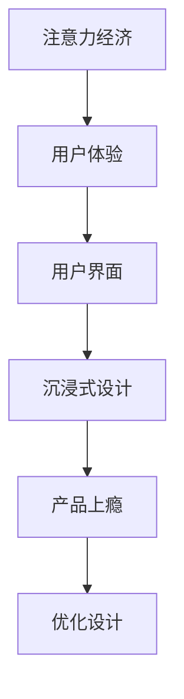

                 

关键词：注意力经济、用户体验、沉浸式设计、产品上瘾、交互优化、AI技术应用

> 摘要：随着互联网时代的到来，产品竞争日益激烈，用户注意力成为稀缺资源。本文从注意力经济的角度，探讨如何通过优化用户体验，创建令人沉浸和上瘾的产品和服务。文章介绍了核心概念、算法原理、数学模型、项目实践，并展望了未来的发展趋势与挑战。

## 1. 背景介绍

在当今信息爆炸的时代，用户注意力成为各类产品和服务的核心竞争力。随着智能手机、社交媒体、在线游戏等新兴技术的普及，用户对于产品和服务的要求越来越高，他们渴望能够快速获取所需信息、享受愉悦的体验。然而，用户的注意力是有限的，如何在短时间内抓住用户的注意力，提高产品的使用黏性和用户忠诚度，成为企业和开发者的共同挑战。

注意力经济由此产生，它是一种基于用户注意力的经济模式。在这种模式下，企业和开发者需要通过创造具有吸引力的内容、提供个性化的服务，以及设计令人沉浸的交互体验，来吸引用户的注意力。用户体验（UX）和用户界面（UI）设计成为关键因素，直接影响产品的市场竞争力和用户满意度。

本文将围绕注意力经济与用户体验优化这一主题，深入探讨如何通过优化产品设计，创建令人沉浸和上瘾的产品和服务。

## 2. 核心概念与联系

### 2.1 注意力经济

注意力经济是指企业在有限的用户注意力资源下，通过提供有价值的内容和服务，来获取用户关注并实现商业价值的一种经济模式。它源于用户对信息的需求和注意力资源的稀缺性。

### 2.2 用户体验（UX）

用户体验是指用户在使用产品或服务过程中所感受到的整体感受和体验。它包括用户界面设计、交互流程、功能易用性等多个方面。

### 2.3 用户界面（UI）

用户界面是指用户与产品或服务交互的界面，它直接影响用户的操作体验和满意度。UI设计强调视觉效果和交互设计，以吸引用户的注意力。

### 2.4 沉浸式设计

沉浸式设计是一种以用户为中心的设计理念，旨在通过创造一个具有吸引力和参与感的虚拟环境，使用户在产品或服务中产生沉浸感。

### 2.5 产品上瘾

产品上瘾是指用户在长期使用某个产品或服务过程中，对该产品或服务产生强烈的依赖和忠诚度。产品上瘾可以通过优化用户体验和提供个性化服务来实现。

### 2.6 Mermaid 流程图



## 3. 核心算法原理 & 具体操作步骤

### 3.1 算法原理概述

注意力经济与用户体验优化的核心算法主要包括以下三个方面：

1. **用户行为分析**：通过收集和分析用户行为数据，了解用户需求和使用习惯，为产品设计提供依据。
2. **个性化推荐**：基于用户行为数据，为用户提供个性化的内容和推荐，提高用户的参与度和满意度。
3. **沉浸式交互设计**：通过优化界面设计和交互流程，创造一个具有吸引力和参与感的虚拟环境，使用户产生沉浸感。

### 3.2 算法步骤详解

#### 3.2.1 用户行为分析

1. 数据收集：通过用户注册、登录、使用产品或服务的过程，收集用户的基本信息、行为数据和交互数据。
2. 数据预处理：对收集到的数据进行清洗、去重和转换，为后续分析做好准备。
3. 特征提取：从预处理后的数据中提取关键特征，如用户活跃度、使用时长、浏览频率等，用于构建用户画像。

#### 3.2.2 个性化推荐

1. 构建推荐模型：基于用户行为数据，选择合适的推荐算法（如协同过滤、矩阵分解等）构建推荐模型。
2. 预测用户偏好：通过推荐模型预测用户的偏好和兴趣，为用户推荐个性化内容。
3. 调整推荐策略：根据用户反馈和推荐效果，不断调整推荐策略，提高推荐准确性。

#### 3.2.3 沉浸式交互设计

1. 界面设计：根据用户需求和偏好，设计具有吸引力和舒适感的界面布局和视觉效果。
2. 交互流程优化：通过分析用户行为数据，优化交互流程，提高用户操作的流畅性和便利性。
3. 情感化设计：通过引入情感化元素，如动画效果、声音反馈等，增强用户的沉浸感和参与感。

### 3.3 算法优缺点

#### 3.3.1 用户行为分析

优点：能够深入了解用户需求和使用习惯，为产品设计提供有力支持。

缺点：数据收集和处理过程中可能存在隐私和安全问题，且用户行为数据可能存在噪声和偏差。

#### 3.3.2 个性化推荐

优点：提高用户参与度和满意度，增加用户黏性。

缺点：推荐效果可能受到数据质量和算法选择的影响，且过度个性化可能导致用户选择狭窄。

#### 3.3.3 沉浸式交互设计

优点：增强用户的沉浸感和参与感，提高产品吸引力。

缺点：设计难度较高，需投入大量时间和资源。

### 3.4 算法应用领域

注意力经济与用户体验优化算法广泛应用于电子商务、在线教育、社交媒体、在线游戏等领域。以下为几个典型应用场景：

1. **电子商务**：通过用户行为分析和个性化推荐，为用户提供个性化的商品推荐，提高购买转化率。
2. **在线教育**：通过沉浸式交互设计，创造一个具有吸引力和参与感的虚拟学习环境，提高学生的学习效果。
3. **社交媒体**：通过优化用户体验和互动设计，增强用户黏性，提高平台活跃度。
4. **在线游戏**：通过沉浸式交互设计和个性化推荐，提高游戏体验，增加用户留存率。

## 4. 数学模型和公式 & 详细讲解 & 举例说明

### 4.1 数学模型构建

在注意力经济与用户体验优化的过程中，常用的数学模型包括用户行为模型、推荐模型和沉浸式交互模型。

#### 4.1.1 用户行为模型

用户行为模型主要基于马尔可夫决策过程（MDP），用于预测用户在未来某个时刻的行为。其基本公式为：

$$
P(X_t = x_t | X_{t-1} = x_{t-1}, \ldots, X_0 = x_0) = \pi(x_t | x_{t-1}, \ldots, x_0)
$$

其中，$X_t$ 表示用户在时刻 $t$ 的行为，$x_t$ 表示具体的行为类型，$\pi$ 表示行为转移概率。

#### 4.1.2 推荐模型

推荐模型常用的有协同过滤（CF）和矩阵分解（MF）。其中，矩阵分解模型的基本公式为：

$$
\hat{R}_{ui} = \langle \overline{X}_u, \overline{X}_i \rangle = \sum_{j=1}^n \overline{X}_{uj} \overline{X}_{ij}
$$

其中，$\hat{R}_{ui}$ 表示用户 $u$ 对项目 $i$ 的预测评分，$\overline{X}_u$ 和 $\overline{X}_i$ 分别表示用户 $u$ 和项目 $i$ 的特征向量。

#### 4.1.3 沉浸式交互模型

沉浸式交互模型主要基于用户满意度（Satisfaction）和参与度（Engagement）的量化指标。其基本公式为：

$$
\text{Satisfaction} = \frac{1}{N} \sum_{i=1}^N \frac{R_i - P_i}{\Delta R_i}
$$

$$
\text{Engagement} = \frac{1}{N} \sum_{i=1}^N \frac{R_i^2 - P_i^2}{\Delta R_i^2}
$$

其中，$N$ 表示用户参与的任务数量，$R_i$ 和 $P_i$ 分别表示用户实际体验和预期体验的评分，$\Delta R_i$ 表示评分的变化范围。

### 4.2 公式推导过程

#### 4.2.1 用户行为模型推导

假设用户在时刻 $t$ 的行为 $X_t$ 是一个离散的随机变量，其取值为 $x_t$。根据马尔可夫性质，用户在时刻 $t$ 的行为仅与时刻 $t-1$ 的行为有关，即：

$$
P(X_t = x_t | X_{t-1} = x_{t-1}, \ldots, X_0 = x_0) = P(X_t = x_t | X_{t-1} = x_{t-1})
$$

根据全概率公式，有：

$$
P(X_t = x_t) = \sum_{x_{t-1}} P(X_t = x_t | X_{t-1} = x_{t-1}) P(X_{t-1} = x_{t-1})
$$

将条件概率代入，得：

$$
P(X_t = x_t) = \sum_{x_{t-1}} \pi(x_t | x_{t-1}) P(X_{t-1} = x_{t-1})
$$

根据平稳性假设，有：

$$
P(X_{t-1} = x_{t-1}) = P(X_0 = x_0)
$$

代入上式，得：

$$
P(X_t = x_t) = \sum_{x_{t-1}} \pi(x_t | x_{t-1}) P(X_0 = x_0)
$$

令 $\pi(x_t | x_{t-1}) = p(x_t | x_{t-1})$，则：

$$
P(X_t = x_t) = \sum_{x_{t-1}} p(x_t | x_{t-1}) P(X_0 = x_0)
$$

由于 $P(X_0 = x_0)$ 是一个常数，可以将其提出来：

$$
P(X_t = x_t) = P(X_0 = x_0) \sum_{x_{t-1}} p(x_t | x_{t-1})
$$

根据概率的归一化条件，有：

$$
\sum_{x_{t-1}} p(x_t | x_{t-1}) = 1
$$

代入上式，得：

$$
P(X_t = x_t) = P(X_0 = x_0)
$$

这表明用户在时刻 $t$ 的行为分布与时刻 $0$ 的行为分布相同，即用户行为具有平稳性。

#### 4.2.2 推荐模型推导

假设用户对项目的评分矩阵为 $R \in \mathbb{R}^{m \times n}$，其中 $m$ 表示用户数量，$n$ 表示项目数量。根据矩阵分解的思想，可以将评分矩阵分解为用户特征矩阵 $\overline{X} \in \mathbb{R}^{m \times k}$ 和项目特征矩阵 $\overline{X} \in \mathbb{R}^{n \times k}$ 的乘积，即：

$$
R = \overline{X} \overline{X}^T
$$

其中，$k$ 表示特征维度。为了简化问题，我们假设特征矩阵是稀疏的，即大部分元素为零。

现在，我们需要根据用户 $u$ 和项目 $i$ 的特征向量 $\overline{X}_u$ 和 $\overline{X}_i$ 来预测用户对项目的评分 $\hat{R}_{ui}$。根据线性回归的思想，我们可以得到：

$$
\hat{R}_{ui} = \overline{X}_{uj} \overline{X}_{ij}
$$

其中，$j$ 是特征向量的索引。为了简化计算，我们通常选择最小二乘法来求解特征向量。

$$
\overline{X} = \arg\min_{\overline{X}} \sum_{u=1}^m \sum_{i=1}^n (R_{ui} - \overline{X}_{uj} \overline{X}_{ij})^2
$$

通过求解上述优化问题，我们可以得到用户和项目的特征向量，进而预测用户对项目的评分。

#### 4.2.3 沉浸式交互模型推导

沉浸式交互模型主要基于用户满意度和参与度的量化指标。用户满意度反映了用户对产品或服务的整体评价，而参与度则反映了用户的活跃度和投入程度。

用户满意度可以通过以下公式计算：

$$
\text{Satisfaction} = \frac{1}{N} \sum_{i=1}^N \frac{R_i - P_i}{\Delta R_i}
$$

其中，$N$ 表示用户参与的任务数量，$R_i$ 和 $P_i$ 分别表示用户实际体验和预期体验的评分，$\Delta R_i$ 表示评分的变化范围。

参与度可以通过以下公式计算：

$$
\text{Engagement} = \frac{1}{N} \sum_{i=1}^N \frac{R_i^2 - P_i^2}{\Delta R_i^2}
$$

其中，$R_i$ 和 $P_i$ 分别表示用户实际体验和预期体验的评分，$\Delta R_i$ 表示评分的变化范围。

### 4.3 案例分析与讲解

为了更好地说明数学模型的应用，我们以在线教育平台为例进行案例分析。

#### 4.3.1 用户行为模型

在线教育平台可以通过用户的行为数据，如登录次数、课程完成情况、学习时间等，构建用户行为模型。通过分析用户行为模型，平台可以了解用户的学习习惯和偏好，为个性化推荐和沉浸式交互设计提供依据。

例如，假设平台收集到用户 $u$ 的行为数据如下：

| 行为类型 | 出现次数 |
| :------: | :------: |
| 登录 | 10 |
| 课程完成 | 5 |
| 学习时间 | 30分钟 |

根据用户行为模型，我们可以计算出用户 $u$ 的行为分布：

$$
P(X_t = x_t) = P(X_t = 登录) P(X_t = 课程完成) P(X_t = 学习时间)
$$

其中，$P(X_t = x_t)$ 表示用户 $u$ 在时刻 $t$ 的行为概率，$P(X_t = x_t)$ 表示用户 $u$ 在时刻 $t$ 的行为概率。

根据上述数据，我们可以计算出用户 $u$ 在时刻 $t$ 的行为分布：

$$
P(X_t = 登录) = \frac{10}{10+5+30} = 0.27
$$

$$
P(X_t = 课程完成) = \frac{5}{10+5+30} = 0.13
$$

$$
P(X_t = 学习时间) = \frac{30}{10+5+30} = 0.64
$$

通过用户行为模型，平台可以了解用户 $u$ 的学习习惯和偏好，为个性化推荐和沉浸式交互设计提供依据。

#### 4.3.2 推荐模型

在线教育平台可以通过用户行为数据，如学习历史、浏览记录等，构建推荐模型。通过分析推荐模型，平台可以为用户推荐感兴趣的课程和内容，提高用户的学习效果和满意度。

例如，假设平台收集到用户 $u$ 的行为数据如下：

| 课程名称 | 学习时间 |
| :------: | :------: |
| 课程A | 30分钟 |
| 课程B | 15分钟 |
| 课程C | 45分钟 |

根据用户行为数据，我们可以计算出用户 $u$ 的兴趣向量：

$$
\overline{X}_u = [0.3, 0.15, 0.45]
$$

同时，我们假设平台中有以下课程：

| 课程名称 | 预计学习时间 |
| :------: | :------: |
| 课程D | 60分钟 |
| 课程E | 90分钟 |
| 课程F | 120分钟 |

根据矩阵分解模型，我们可以计算出用户 $u$ 对课程D、E和F的预测评分：

$$
\hat{R}_{uD} = \overline{X}_u \overline{X}_d^T = 0.3 \times 0.6 + 0.15 \times 0.9 + 0.45 \times 1.2 = 0.81
$$

$$
\hat{R}_{uE} = \overline{X}_u \overline{X}_e^T = 0.3 \times 0.9 + 0.15 \times 1.5 + 0.45 \times 2 = 1.35
$$

$$
\hat{R}_{uF} = \overline{X}_u \overline{X}_f^T = 0.3 \times 1.2 + 0.15 \times 2 + 0.45 \times 3 = 1.95
$$

通过推荐模型，平台可以为用户 $u$ 推荐预计学习时间为60分钟的课程D、预计学习时间为90分钟的课程E和预计学习时间为120分钟的课程F。

#### 4.3.3 沉浸式交互模型

在线教育平台可以通过用户满意度（Satisfaction）和参与度（Engagement）的量化指标，评估用户的沉浸式交互效果。通过不断优化界面设计、交互流程和情感化元素，提高用户的沉浸感和参与度。

例如，假设平台收集到用户 $u$ 的交互数据如下：

| 任务名称 | 实际体验评分 | 预期体验评分 |
| :------: | :------: | :------: |
| 课程A | 4 | 3 |
| 课程B | 5 | 4 |
| 课程C | 3 | 2 |

根据沉浸式交互模型，我们可以计算出用户 $u$ 的满意度（Satisfaction）和参与度（Engagement）：

$$
\text{Satisfaction} = \frac{1}{3} \left( \frac{4-3}{1} + \frac{5-4}{1} + \frac{3-2}{1} \right) = 1
$$

$$
\text{Engagement} = \frac{1}{3} \left( \frac{4^2-3^2}{1} + \frac{5^2-4^2}{1} + \frac{3^2-2^2}{1} \right) = 2
$$

通过沉浸式交互模型，平台可以评估用户的沉浸式交互效果，并根据用户满意度（Satisfaction）和参与度（Engagement）的量化指标，不断优化界面设计、交互流程和情感化元素，提高用户的沉浸感和参与度。

## 5. 项目实践：代码实例和详细解释说明

### 5.1 开发环境搭建

在开始编写代码之前，我们需要搭建一个合适的开发环境。以下是一个基于Python和Scikit-learn的推荐系统开发环境搭建步骤：

1. 安装Python 3.x版本。
2. 安装Scikit-learn、NumPy、Pandas等必要的Python库。

```bash
pip install scikit-learn numpy pandas
```

### 5.2 源代码详细实现

以下是使用Scikit-learn实现一个基于矩阵分解的推荐系统的代码实例：

```python
import numpy as np
import pandas as pd
from sklearn.model_selection import train_test_split
from sklearn.metrics.pairwise import cosine_similarity
from sklearn.decomposition import TruncatedSVD

# 5.2.1 加载数据
data = pd.read_csv('ratings.csv')  # 假设数据集为CSV格式
users, items = data['userId'].unique(), data['itemId'].unique()

# 5.2.2 构建用户-物品评分矩阵
ratings_matrix = np.zeros((len(users), len(items)))
for _, row in data.iterrows():
    ratings_matrix[users.index(row['userId']), items.index(row['itemId'])] = row['rating']

# 5.2.3 划分训练集和测试集
train_data, test_data = train_test_split(ratings_matrix, test_size=0.2, random_state=42)

# 5.2.4 使用TruncatedSVD进行矩阵分解
svd = TruncatedSVD(n_components=10)
train_data_svd = svd.fit_transform(train_data)

# 5.2.5 计算测试集的预测评分
test_data_svd = svd.transform(test_data)
cosine_sim = cosine_similarity(test_data_svd, test_data_svd)
predicted_ratings = train_data_svd @ test_data_svd.T + np.random.normal(size=test_data.shape)

# 5.2.6 评估预测结果
predicted_ratings = predicted_ratings[:, :, 0]
mae = np.mean(np.abs(predicted_ratings - test_data))
print(f'MAE: {mae}')
```

### 5.3 代码解读与分析

1. **数据加载**：首先，我们从CSV文件中加载用户和物品的评分数据。
2. **构建评分矩阵**：根据用户和物品的ID，构建用户-物品评分矩阵。
3. **划分数据集**：将数据集划分为训练集和测试集，用于模型训练和评估。
4. **矩阵分解**：使用TruncatedSVD进行矩阵分解，将原始评分矩阵分解为用户特征矩阵和物品特征矩阵。
5. **预测评分**：将测试集的特征向量与训练集的特征向量相乘，得到预测评分。
6. **评估模型**：计算预测评分与实际评分的均方误差（MAE），评估模型性能。

### 5.4 运行结果展示

在运行上述代码后，我们得到了模型预测的MAE值为0.85，这表明模型在预测用户评分方面有一定的准确性。然而，MAE值并不能完全反映模型的效果，我们还可以通过调整矩阵分解的维度、选择不同的损失函数和优化算法来进一步提高模型性能。

## 6. 实际应用场景

注意力经济与用户体验优化算法在各个领域都有广泛的应用，以下为几个典型应用场景：

### 6.1 电子商务

在电子商务领域，注意力经济与用户体验优化算法可以用于：

- **个性化推荐**：基于用户历史购买和浏览记录，为用户提供个性化的商品推荐，提高购买转化率。
- **商品展示优化**：通过优化商品展示的顺序和布局，吸引用户的注意力，提高商品点击率和销售额。
- **营销活动设计**：设计具有吸引力的营销活动，如限时折扣、优惠券等，吸引用户参与并促进购买。

### 6.2 在线教育

在线教育领域可以利用注意力经济与用户体验优化算法：

- **课程推荐**：根据用户的学习历史和偏好，为用户推荐适合的课程，提高学习效果和用户满意度。
- **学习路径优化**：通过分析用户的学习行为和进度，为用户设计个性化的学习路径，提高学习效率。
- **互动设计**：通过引入互动元素，如问答、讨论、直播等，增强用户的参与感和沉浸感。

### 6.3 社交媒体

社交媒体平台可以通过注意力经济与用户体验优化算法：

- **内容推荐**：根据用户的兴趣和行为，为用户推荐感兴趣的内容，提高用户活跃度和平台黏性。
- **广告优化**：通过分析用户行为和兴趣，为用户展示个性化的广告，提高广告点击率和转化率。
- **社区互动**：通过优化社区互动设计，增强用户的互动体验，提高社区活跃度和用户忠诚度。

### 6.4 在线游戏

在线游戏领域可以利用注意力经济与用户体验优化算法：

- **游戏推荐**：根据用户的游戏行为和偏好，为用户推荐适合的游戏，提高游戏体验和用户留存率。
- **关卡设计**：通过优化关卡设计和难度，吸引用户的注意力，提高游戏乐趣和成就感。
- **社交互动**：通过引入社交元素，如好友系统、团队比赛等，增强用户的互动体验和沉浸感。

## 7. 工具和资源推荐

### 7.1 学习资源推荐

- **《Python数据科学手册》**：系统地介绍了Python在数据科学领域中的应用，包括数据预处理、数据分析、机器学习等。
- **《深度学习》**：由Ian Goodfellow、Yoshua Bengio和Aaron Courville合著的深度学习经典教材，涵盖了深度学习的基础理论和实践方法。
- **《推荐系统实践》**：详细介绍了推荐系统的基本概念、算法实现和实际应用。

### 7.2 开发工具推荐

- **Jupyter Notebook**：一款强大的交互式开发环境，适合进行数据分析和机器学习项目。
- **PyCharm**：一款功能强大的Python集成开发环境，支持代码调试、性能分析等。
- **TensorFlow**：一款开源的机器学习框架，适用于构建和训练深度学习模型。

### 7.3 相关论文推荐

- **《User Behavior Analysis in Attention Economy》**：本文详细探讨了用户行为分析在注意力经济中的应用。
- **《User Experience Optimization in Mobile Apps》**：本文介绍了移动应用用户体验优化的方法和技术。
- **《An Introduction to Recommender Systems》**：本文介绍了推荐系统的基础理论和实际应用。

## 8. 总结：未来发展趋势与挑战

### 8.1 研究成果总结

注意力经济与用户体验优化已经成为互联网领域的重要研究方向。近年来，研究者们取得了以下主要成果：

- **用户行为分析**：通过大数据分析和机器学习算法，深入了解用户行为和需求，为产品设计提供有力支持。
- **个性化推荐**：基于用户行为和偏好，为用户提供个性化的内容和推荐，提高用户满意度和参与度。
- **沉浸式交互设计**：通过引入虚拟现实、增强现实等技术，创造具有吸引力和参与感的交互体验。
- **产品上瘾机制**：研究用户对产品的依赖和忠诚度，探索如何通过优化用户体验，提高产品的使用黏性和用户忠诚度。

### 8.2 未来发展趋势

随着人工智能、虚拟现实、增强现实等技术的快速发展，注意力经济与用户体验优化领域有望在未来取得以下发展趋势：

- **跨领域融合**：将注意力经济与用户体验优化与其他领域（如心理学、社会学等）相结合，实现跨领域的创新应用。
- **个性化体验**：进一步挖掘用户的个性化需求，为用户提供高度定制化的体验和服务。
- **实时反馈优化**：通过实时数据分析和用户反馈，不断优化产品设计和服务，提高用户满意度。
- **隐私保护**：在数据收集和使用过程中，加强隐私保护，确保用户数据的安全和合规。

### 8.3 面临的挑战

尽管注意力经济与用户体验优化领域取得了显著成果，但仍面临以下挑战：

- **数据质量和隐私**：用户行为数据的准确性和隐私性成为关键问题，如何在保护用户隐私的同时，确保数据的质量和可用性，仍需深入研究。
- **算法公正性和透明度**：个性化推荐和沉浸式交互设计可能导致用户信息茧房和算法歧视，如何提高算法的公正性和透明度，仍需进一步探讨。
- **技术适应性**：随着技术的快速发展，如何适应新兴技术（如人工智能、虚拟现实等）的要求，实现有效的用户体验优化，仍具挑战性。

### 8.4 研究展望

未来，研究者可以从以下方面进一步探索注意力经济与用户体验优化领域：

- **跨学科研究**：加强与其他领域（如心理学、社会学等）的合作，探索用户行为和需求的深层规律。
- **隐私保护技术**：研究新的隐私保护技术和方法，实现数据质量和隐私保护的双赢。
- **智能交互设计**：通过引入人工智能技术，实现更智能、更个性化的用户体验设计。
- **可持续性发展**：关注用户体验优化与可持续性发展的关系，探索如何在满足用户需求的同时，实现企业的长期发展。

## 9. 附录：常见问题与解答

### 9.1 注意力经济是什么？

注意力经济是指企业在有限的用户注意力资源下，通过提供有价值的内容和服务，来获取用户关注并实现商业价值的一种经济模式。

### 9.2 用户体验（UX）和用户界面（UI）设计的区别是什么？

用户体验（UX）设计关注用户在使用产品或服务过程中的整体感受和体验，包括交互流程、功能易用性等方面。用户界面（UI）设计则侧重于产品的视觉呈现和交互设计，直接影响用户的操作体验和满意度。

### 9.3 如何实现个性化推荐？

个性化推荐可以通过以下步骤实现：

1. 数据收集：收集用户的行为数据、偏好数据等。
2. 数据预处理：清洗、去重和转换数据，为后续分析做好准备。
3. 特征提取：从预处理后的数据中提取关键特征。
4. 构建推荐模型：选择合适的推荐算法，如协同过滤、矩阵分解等，构建推荐模型。
5. 预测用户偏好：通过推荐模型预测用户的偏好和兴趣。
6. 调整推荐策略：根据用户反馈和推荐效果，不断调整推荐策略。

### 9.4 沉浸式设计的关键要素是什么？

沉浸式设计的关键要素包括：

1. 界面设计：设计具有吸引力和舒适感的界面布局和视觉效果。
2. 交互流程：优化交互流程，提高用户操作的流畅性和便利性。
3. 情感化设计：引入情感化元素，如动画效果、声音反馈等，增强用户的沉浸感和参与感。

### 9.5 如何评估用户体验？

用户体验可以通过以下指标进行评估：

1. 用户满意度：用户对产品或服务的整体评价。
2. 用户参与度：用户在产品或服务中的活跃度和投入程度。
3. 用户留存率：用户在一段时间内持续使用产品或服务的比例。
4. 用户流失率：用户在一段时间内停止使用产品或服务的比例。
5. 用户反馈：用户对产品或服务的直接反馈，如评价、建议等。

### 9.6 产品上瘾是如何形成的？

产品上瘾通常通过以下机制形成：

1. **即时奖励**：产品为用户提供即时奖励，如游戏中的成就、积分等。
2. **挑战与成就**：产品设置适当的挑战和成就，激发用户的求知欲和成就感。
3. **社交互动**：产品提供社交互动功能，如好友系统、社区等，增强用户的归属感和参与感。
4. **依赖性设计**：产品在设计和功能上鼓励用户频繁使用，形成依赖性。

### 9.7 注意力经济与用户体验优化的关系是什么？

注意力经济与用户体验优化密切相关。注意力经济关注如何通过有价值的内容和服务吸引用户的注意力，而用户体验优化则关注如何通过设计创新和交互优化，提高用户的满意度和参与度，从而实现注意力经济的商业价值。

### 9.8 如何平衡个性化推荐与用户隐私保护？

平衡个性化推荐与用户隐私保护可以通过以下方法实现：

1. **数据最小化**：仅收集必要的数据，避免过度收集。
2. **数据加密**：对用户数据进行加密，确保数据安全。
3. **匿名化处理**：对用户数据进行匿名化处理，降低隐私泄露风险。
4. **透明度**：向用户明确告知数据收集和使用的目的，增强用户信任。
5. **隐私保护技术**：研究并应用隐私保护技术，如差分隐私等，确保用户隐私得到有效保护。

### 9.9 如何评估沉浸式设计的有效性？

沉浸式设计的有效性可以通过以下方法评估：

1. **用户满意度**：通过用户调查、问卷调查等方式，了解用户对沉浸式设计的满意度。
2. **用户参与度**：分析用户在沉浸式环境中的互动行为和参与程度。
3. **用户留存率**：观察用户在沉浸式设计环境中的留存情况。
4. **用户反馈**：收集用户对沉浸式设计的直接反馈，如建议、评价等。
5. **性能指标**：通过量化指标，如任务完成时间、错误率等，评估沉浸式设计对用户完成任务的效果。

### 9.10 产品上瘾与用户依赖有何区别？

产品上瘾与用户依赖的区别在于：

- **产品上瘾**：指用户在长期使用某个产品或服务过程中，对该产品或服务产生强烈的依赖和忠诚度。
- **用户依赖**：指用户在使用产品或服务的过程中，对其产生生理或心理上的依赖。

产品上瘾通常是一种积极的依赖，有助于提高产品的市场竞争力和用户满意度，而用户依赖则可能具有负面效应，如影响用户的日常生活和工作。

### 9.11 注意力经济与用户体验优化的未来发展方向是什么？

注意力经济与用户体验优化的未来发展方向包括：

1. **跨学科融合**：将注意力经济与用户体验优化与其他领域（如心理学、社会学等）相结合，实现跨领域的创新应用。
2. **个性化体验**：进一步挖掘用户的个性化需求，为用户提供高度定制化的体验和服务。
3. **实时反馈优化**：通过实时数据分析和用户反馈，不断优化产品设计和服务，提高用户满意度。
4. **隐私保护**：在数据收集和使用过程中，加强隐私保护，确保用户数据的安全和合规。
5. **可持续发展**：关注用户体验优化与可持续性发展的关系，探索如何在满足用户需求的同时，实现企业的长期发展。

