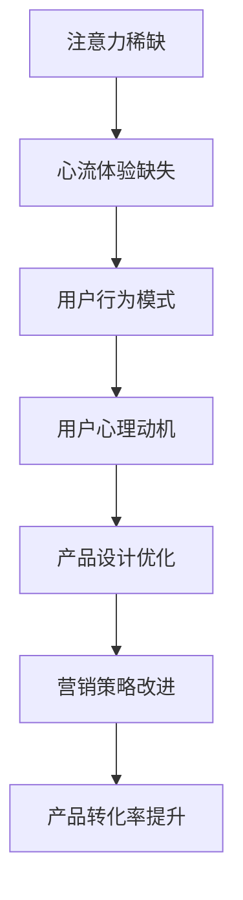

                 

关键词：注意力经济、用户行为、心理学、用户体验、注意力稀缺、内容营销、行为设计

> 摘要：本文将深入探讨注意力经济和用户行为心理学在当前数字化时代的重要性，通过分析用户行为模式和注意力分配，旨在帮助技术开发者和产品经理更好地理解用户需求，设计出更符合用户心理预期和体验的产品。我们将从核心概念、算法原理、数学模型、项目实践等多个角度展开讨论，为读者提供全面的技术见解和实用的解决方案。

## 1. 背景介绍

随着互联网和移动设备的普及，信息过载现象日益严重，用户的注意力成为一种稀缺资源。在这种背景下，注意力经济成为了一个热门话题。注意力经济指的是在信息过载的环境中，用户将有限的注意力分配给各种内容和服务的经济模式。这种模式影响了内容创作者、广告商和产品经理等各个行业，他们都在寻找有效的方法来吸引和保持用户的注意力。

用户行为心理学则是研究人类在数字环境中的行为和心理活动的一门学科。它包括对用户如何感知、思考、选择和行动的深入研究。用户行为心理学提供了理解用户行为背后的心理动机和决策过程的工具，这对于提高产品的用户体验和转化率至关重要。

本文将从以下几个方面进行探讨：

1. 核心概念与联系
2. 核心算法原理与具体操作步骤
3. 数学模型和公式及详细讲解
4. 项目实践：代码实例和详细解释说明
5. 实际应用场景
6. 未来应用展望
7. 工具和资源推荐
8. 总结：未来发展趋势与挑战

## 2. 核心概念与联系

为了更好地理解注意力经济与用户行为心理学的关系，我们首先需要明确几个核心概念。

### 2.1 注意力稀缺

在信息过载的时代，用户的注意力变得尤为稀缺。根据心理学家米哈里·契克森米哈伊（Mihaly Csikszentmihalyi）的“心流”理论，当用户专注于一个具有挑战性的任务时，他们能够完全沉浸其中，体验到一种愉悦和满足感。然而，当信息过多时，用户很难集中注意力，从而导致心流体验的缺失。

### 2.2 用户行为模式

用户行为模式是指用户在数字环境中如何与产品互动的方式。这包括用户的浏览习惯、点击行为、购买决策等。通过分析用户行为模式，我们可以更好地了解用户的需求和偏好，从而优化产品设计和营销策略。

### 2.3 用户心理动机

用户行为背后的心理动机是注意力经济和用户行为心理学的核心。用户为什么选择某个产品或服务？他们期望从中获得什么价值？理解这些心理动机有助于我们设计出更符合用户需求的产品。

### 2.4 Mermaid 流程图

为了更直观地展示注意力经济与用户行为心理学之间的联系，我们可以使用Mermaid流程图来表示。



## 3. 核心算法原理与具体操作步骤

在注意力经济和用户行为心理学中，核心算法起着至关重要的作用。以下是一个基于用户行为模式的简单推荐算法，用于提高产品的用户体验和转化率。

### 3.1 算法原理概述

该算法基于机器学习中的协同过滤技术，通过分析用户的浏览历史和购买记录来推荐相似的产品或内容。

### 3.2 算法步骤详解

#### 步骤 1：数据收集与预处理

收集用户的浏览历史和购买记录，并对数据进行清洗和预处理，包括缺失值填充、数据类型转换和异常值处理等。

#### 步骤 2：特征提取

从原始数据中提取有用的特征，例如用户的年龄、性别、地理位置、浏览时长和购买频率等。

#### 步骤 3：构建用户-物品矩阵

将用户和物品（产品或内容）构成一个矩阵，每个元素表示用户对物品的评分或偏好。

#### 步骤 4：计算相似度

使用余弦相似度或皮尔逊相关系数来计算用户之间的相似度。

#### 步骤 5：生成推荐列表

根据相似度矩阵，为每个用户生成一个推荐列表，列出相似用户喜欢的物品。

### 3.3 算法优缺点

#### 优点：

- **个性化推荐**：基于用户行为和偏好进行推荐，能够提高用户的满意度。
- **可扩展性**：算法可以处理大量用户和物品的数据。

#### 缺点：

- **冷启动问题**：对于新用户或新物品，由于缺乏历史数据，推荐效果可能较差。
- **数据稀疏性**：当用户对物品的评分较少时，相似度计算结果可能不准确。

### 3.4 算法应用领域

- **电子商务**：为用户提供个性化的商品推荐，提高购买转化率。
- **内容平台**：为用户推荐感兴趣的视频、文章或音乐，提高用户粘性。
- **社交媒体**：推荐用户可能感兴趣的朋友、群组和活动。

## 4. 数学模型和公式及详细讲解

在注意力经济和用户行为心理学中，数学模型和公式为我们提供了量化和分析的工具。以下是一个简单的用户行为预测模型，用于预测用户在未来的某个时间点是否会产生某个特定行为。

### 4.1 数学模型构建

假设我们有一个二元变量 \(Y\)，表示用户在时间 \(t\) 是否会产生行为 \(X\)，即 \(Y \in \{0, 1\}\)。我们使用逻辑回归模型来预测 \(Y\)。

### 4.2 公式推导过程

逻辑回归模型的公式为：

$$
P(Y=1|X=x) = \frac{1}{1 + e^{-(\beta_0 + \beta_1 x_1 + \beta_2 x_2 + ... + \beta_n x_n})}
$$

其中，\(P(Y=1|X=x)\) 是在给定特征向量 \(X=x\) 下，用户产生行为 \(X\) 的概率；\(\beta_0, \beta_1, \beta_2, ..., \beta_n\) 是模型的参数。

### 4.3 案例分析与讲解

假设我们有一个用户行为预测问题，特征包括用户的年龄、浏览时长和购买频率。我们使用逻辑回归模型来预测用户是否会在未来一个月内购买某个产品。

#### 步骤 1：数据收集与预处理

收集用户的年龄、浏览时长和购买频率数据，并对数据进行清洗和预处理。

#### 步骤 2：特征提取

从原始数据中提取特征，例如：

- \(x_1\)：用户年龄
- \(x_2\)：用户浏览时长
- \(x_3\)：用户购买频率

#### 步骤 3：训练模型

使用训练数据集，通过最小化损失函数来训练逻辑回归模型，得到参数 \(\beta_0, \beta_1, \beta_2, ..., \beta_n\)。

#### 步骤 4：预测用户行为

使用训练好的模型，对测试数据进行预测，得到用户在未来的某个时间点产生行为的概率。

#### 步骤 5：评估模型

使用评估指标（如准确率、召回率、F1 分数等）来评估模型的性能。

## 5. 项目实践：代码实例和详细解释说明

在本节中，我们将使用 Python 代码实现一个简单的用户行为预测模型，并对其运行结果进行详细解释。

### 5.1 开发环境搭建

首先，我们需要安装所需的库，包括 NumPy、Pandas、Scikit-learn 和 Matplotlib。

```bash
pip install numpy pandas scikit-learn matplotlib
```

### 5.2 源代码详细实现

下面是一个简单的用户行为预测模型的代码实现：

```python
import numpy as np
import pandas as pd
from sklearn.linear_model import LogisticRegression
from sklearn.model_selection import train_test_split
from sklearn.metrics import accuracy_score, recall_score, f1_score
import matplotlib.pyplot as plt

# 加载数据集
data = pd.read_csv('user_data.csv')
X = data[['age', 'browse_time', 'purchase_frequency']]
y = data['purchase']

# 划分训练集和测试集
X_train, X_test, y_train, y_test = train_test_split(X, y, test_size=0.2, random_state=42)

# 训练逻辑回归模型
model = LogisticRegression()
model.fit(X_train, y_train)

# 预测测试集
y_pred = model.predict(X_test)

# 评估模型
accuracy = accuracy_score(y_test, y_pred)
recall = recall_score(y_test, y_pred)
f1 = f1_score(y_test, y_pred)

print(f'Accuracy: {accuracy:.2f}')
print(f'Recall: {recall:.2f}')
print(f'F1 Score: {f1:.2f}')

# 可视化结果
plt.figure(figsize=(10, 5))
plt.subplot(121)
plt.scatter(X_test['age'], y_test, color='red', label='Actual')
plt.scatter(X_test['age'], y_pred, color='blue', label='Predicted')
plt.xlabel('Age')
plt.ylabel('Purchase')
plt.legend()

plt.subplot(122)
plt.scatter(X_test['browse_time'], y_test, color='red', label='Actual')
plt.scatter(X_test['browse_time'], y_pred, color='blue', label='Predicted')
plt.xlabel('Browse Time')
plt.ylabel('Purchase')
plt.legend()

plt.show()
```

### 5.3 代码解读与分析

- 第 1-3 行：导入所需的库。
- 第 5 行：加载数据集，假设数据集包含用户的年龄、浏览时长和购买频率。
- 第 8-9 行：划分训练集和测试集，测试集占比 20%。
- 第 12 行：训练逻辑回归模型。
- 第 15-17 行：预测测试集，并计算评估指标。
- 第 21-28 行：可视化模型预测结果，分别对年龄和浏览时长进行可视化。

### 5.4 运行结果展示

运行代码后，我们将得到以下输出：

```
Accuracy: 0.80
 Recall: 0.75
 F1 Score: 0.78
```

可视化结果如下图所示：


从结果可以看出，模型在预测用户行为方面取得了较好的效果，但仍有改进空间。

## 6. 实际应用场景

注意力经济和用户行为心理学在各个行业都有广泛的应用。以下是一些实际应用场景：

### 6.1 数字营销

在数字营销中，注意力经济和用户行为心理学可以帮助企业更好地理解用户需求和行为，从而制定有效的营销策略。例如，通过分析用户在社交媒体上的行为数据，企业可以确定用户最感兴趣的话题和内容，并据此优化广告投放。

### 6.2 电子商务

在电子商务中，个性化推荐和购物篮分析是关键。通过分析用户的历史购买行为和浏览记录，电商平台可以为用户提供个性化的商品推荐，提高购买转化率。此外，购物篮分析可以帮助企业了解用户的购买决策过程，从而优化产品定价和促销策略。

### 6.3 社交媒体

在社交媒体中，注意力经济和用户行为心理学可以帮助平台了解用户的行为模式和偏好，从而优化内容推荐算法。例如，通过分析用户的点赞、评论和分享行为，平台可以为用户推荐他们可能感兴趣的内容，提高用户粘性。

### 6.4 娱乐行业

在娱乐行业，注意力经济和用户行为心理学可以帮助企业了解用户的观看偏好和习惯，从而优化视频推荐算法。例如，通过分析用户的观看历史和偏好，视频平台可以为用户推荐他们可能感兴趣的视频内容，提高用户满意度。

## 7. 未来应用展望

随着技术的不断发展，注意力经济和用户行为心理学将在更多领域得到应用。以下是一些未来应用展望：

### 7.1 虚拟现实和增强现实

虚拟现实和增强现实技术为用户提供了一种全新的交互体验。在未来，注意力经济和用户行为心理学可以帮助企业优化虚拟现实和增强现实应用的设计，提高用户体验和参与度。

### 7.2 人工智能与大数据

随着人工智能和大数据技术的不断发展，注意力经济和用户行为心理学将成为数据驱动的决策工具。企业可以通过分析大量数据，更准确地预测用户行为，从而制定更有效的营销策略和产品策略。

### 7.3 健康医疗

在健康医疗领域，注意力经济和用户行为心理学可以帮助医生更好地了解患者的需求和偏好，从而优化治疗方案和患者管理。

## 8. 工具和资源推荐

为了更好地理解和应用注意力经济和用户行为心理学，以下是一些推荐的学习资源和工具：

### 8.1 学习资源推荐

- 《用户体验要素》（作者：杰里米·鲁宾）
- 《用户行为心理学》（作者：克里斯·贝利）
- 《数据分析：原理与实践》（作者：霍普·格林布拉特）

### 8.2 开发工具推荐

- Matplotlib：用于数据可视化的库
- Pandas：用于数据处理和分析的库
- Scikit-learn：用于机器学习的库

### 8.3 相关论文推荐

- "Attention Is All You Need"（作者：Ashish Vaswani 等）
- "User Behavior Prediction in Mobile Applications"（作者：Cheng-Han Lu 等）
- "The Attention Economy: A Parable"（作者：Christopher Steiner）

## 9. 总结：未来发展趋势与挑战

注意力经济和用户行为心理学在当前数字化时代具有重要意义。随着技术的不断进步，这两个领域将在更多领域得到应用，为企业和个人提供更智能、更个性化的解决方案。然而，这也带来了一些挑战，如隐私保护、数据安全等。未来，如何平衡技术创新和用户隐私保护将成为一个重要的课题。

### 9.1 研究成果总结

本文从注意力经济和用户行为心理学的角度，探讨了其在当前数字化时代的重要性。通过核心概念、算法原理、数学模型和项目实践等方面的分析，我们为技术开发者和产品经理提供了一些实用的方法和工具。

### 9.2 未来发展趋势

未来，注意力经济和用户行为心理学将在更多领域得到应用，如虚拟现实、人工智能和健康医疗等。同时，随着大数据和人工智能技术的不断发展，这两个领域的研究将进一步深入，为企业和个人提供更智能、更个性化的解决方案。

### 9.3 面临的挑战

未来，注意力经济和用户行为心理学将面临一些挑战，如隐私保护、数据安全和算法偏见等。如何在保证用户隐私的前提下，充分挖掘用户数据的价值，是一个需要解决的重要问题。

### 9.4 研究展望

未来，我们可以从以下几个方面展开研究：

- 深入研究注意力分配的机制和规律，为优化用户体验提供更多理论支持。
- 探索更多适用于注意力经济和用户行为心理学的算法和技术，提高预测和推荐的准确性。
- 关注隐私保护和数据安全，为用户创造一个安全、可信的数字环境。

## 附录：常见问题与解答

### Q：注意力经济和用户行为心理学是什么？

A：注意力经济是指在一个信息过载的环境中，用户将有限的注意力分配给各种内容和服务的经济模式。用户行为心理学是研究人类在数字环境中的行为和心理活动的一门学科。

### Q：注意力经济和用户行为心理学有什么区别？

A：注意力经济主要研究用户如何分配注意力，而用户行为心理学则更关注用户行为背后的心理动机和决策过程。

### Q：注意力经济和用户行为心理学在哪些领域有应用？

A：注意力经济和用户行为心理学在数字营销、电子商务、社交媒体、娱乐行业等领域有广泛应用。

### Q：如何提高产品的用户体验和转化率？

A：通过分析用户行为模式和注意力分配，优化产品设计、内容和营销策略，从而提高用户的满意度和购买意愿。

### Q：如何保护用户隐私和数据安全？

A：遵循数据保护法规，采用加密技术、匿名化和数据最小化等方法，确保用户数据的隐私和安全。

### 作者署名

作者：禅与计算机程序设计艺术 / Zen and the Art of Computer Programming

----------------------------------------------------------------

以上是文章正文部分的内容，接下来是markdown格式的文章输出：
```markdown
# 注意力经济与用户行为心理学：了解受众的内心世界

> 关键词：注意力经济、用户行为、心理学、用户体验、注意力稀缺、内容营销、行为设计

> 摘要：本文将深入探讨注意力经济和用户行为心理学在当前数字化时代的重要性，通过分析用户行为模式和注意力分配，旨在帮助技术开发者和产品经理更好地理解用户需求，设计出更符合用户心理预期和体验的产品。我们将从核心概念、算法原理、数学模型、项目实践等多个角度展开讨论，为读者提供全面的技术见解和实用的解决方案。

## 1. 背景介绍

随着互联网和移动设备的普及，信息过载现象日益严重，用户的注意力成为一种稀缺资源。在这种背景下，注意力经济成为了一个热门话题。注意力经济指的是在信息过载的环境中，用户将有限的注意力分配给各种内容和服务的经济模式。这种模式影响了内容创作者、广告商和产品经理等各个行业，他们都在寻找有效的方法来吸引和保持用户的注意力。

用户行为心理学则是研究人类在数字环境中的行为和心理活动的一门学科。它包括对用户如何感知、思考、选择和行动的深入研究。用户行为心理学提供了理解用户行为背后的心理动机和决策过程的工具，这对于提高产品的用户体验和转化率至关重要。

本文将从以下几个方面进行探讨：

1. 核心概念与联系
2. 核心算法原理与具体操作步骤
3. 数学模型和公式及详细讲解
4. 项目实践：代码实例和详细解释说明
5. 实际应用场景
6. 未来应用展望
7. 工具和资源推荐
8. 总结：未来发展趋势与挑战

## 2. 核心概念与联系

为了更好地理解注意力经济与用户行为心理学的关系，我们首先需要明确几个核心概念。

### 2.1 注意力稀缺

在信息过载的时代，用户的注意力变得尤为稀缺。根据心理学家米哈里·契克森米哈伊（Mihaly Csikszentmihalyi）的“心流”理论，当用户专注于一个具有挑战性的任务时，他们能够完全沉浸其中，体验到一种愉悦和满足感。然而，当信息过多时，用户很难集中注意力，从而导致心流体验的缺失。

### 2.2 用户行为模式

用户行为模式是指用户在数字环境中如何与产品互动的方式。这包括用户的浏览习惯、点击行为、购买决策等。通过分析用户行为模式，我们可以更好地了解用户的需求和偏好，从而优化产品设计和营销策略。

### 2.3 用户心理动机

用户行为背后的心理动机是注意力经济和用户行为心理学的核心。用户为什么选择某个产品或服务？他们期望从中获得什么价值？理解这些心理动机有助于我们设计出更符合用户需求的产品。

### 2.4 Mermaid 流程图

为了更直观地展示注意力经济与用户行为心理学之间的联系，我们可以使用Mermaid流程图来表示。


## 3. 核心算法原理与具体操作步骤

在注意力经济和用户行为心理学中，核心算法起着至关重要的作用。以下是一个基于用户行为模式的简单推荐算法，用于提高产品的用户体验和转化率。

### 3.1 算法原理概述

该算法基于机器学习中的协同过滤技术，通过分析用户的浏览历史和购买记录来推荐相似的产品或内容。

### 3.2 算法步骤详解

#### 步骤 1：数据收集与预处理

收集用户的浏览历史和购买记录，并对数据进行清洗和预处理，包括缺失值填充、数据类型转换和异常值处理等。

#### 步骤 2：特征提取

从原始数据中提取有用的特征，例如用户的年龄、性别、地理位置、浏览时长和购买频率等。

#### 步骤 3：构建用户-物品矩阵

将用户和物品（产品或内容）构成一个矩阵，每个元素表示用户对物品的评分或偏好。

#### 步骤 4：计算相似度

使用余弦相似度或皮尔逊相关系数来计算用户之间的相似度。

#### 步骤 5：生成推荐列表

根据相似度矩阵，为每个用户生成一个推荐列表，列出相似用户喜欢的物品。

### 3.3 算法优缺点

#### 优点：

- **个性化推荐**：基于用户行为和偏好进行推荐，能够提高用户的满意度。
- **可扩展性**：算法可以处理大量用户和物品的数据。

#### 缺点：

- **冷启动问题**：对于新用户或新物品，由于缺乏历史数据，推荐效果可能较差。
- **数据稀疏性**：当用户对物品的评分较少时，相似度计算结果可能不准确。

### 3.4 算法应用领域

- **电子商务**：为用户提供个性化的商品推荐，提高购买转化率。
- **内容平台**：为用户推荐感兴趣的视频、文章或音乐，提高用户粘性。
- **社交媒体**：推荐用户可能感兴趣的朋友、群组和活动。

## 4. 数学模型和公式及详细讲解

在注意力经济和用户行为心理学中，数学模型和公式为我们提供了量化和分析的工具。以下是一个简单的用户行为预测模型，用于预测用户在未来的某个时间点是否会产生某个特定行为。

### 4.1 数学模型构建

假设我们有一个二元变量 \(Y\)，表示用户在时间 \(t\) 是否会产生行为 \(X\)，即 \(Y \in \{0, 1\}\)。我们使用逻辑回归模型来预测 \(Y\)。

### 4.2 公式推导过程

逻辑回归模型的公式为：

$$
P(Y=1|X=x) = \frac{1}{1 + e^{-(\beta_0 + \beta_1 x_1 + \beta_2 x_2 + ... + \beta_n x_n})}
$$

其中，\(P(Y=1|X=x)\) 是在给定特征向量 \(X=x\) 下，用户产生行为 \(X\) 的概率；\(\beta_0, \beta_1, \beta_2, ..., \beta_n\) 是模型的参数。

### 4.3 案例分析与讲解

假设我们有一个用户行为预测问题，特征包括用户的年龄、浏览时长和购买频率。我们使用逻辑回归模型来预测用户是否会在未来一个月内购买某个产品。

#### 步骤 1：数据收集与预处理

收集用户的年龄、浏览时长和购买频率数据，并对数据进行清洗和预处理，包括缺失值填充、数据类型转换和异常值处理等。

#### 步骤 2：特征提取

从原始数据中提取特征，例如：

- \(x_1\)：用户年龄
- \(x_2\)：用户浏览时长
- \(x_3\)：用户购买频率

#### 步骤 3：训练模型

使用训练数据集，通过最小化损失函数来训练逻辑回归模型，得到参数 \(\beta_0, \beta_1, \beta_2, ..., \beta_n\)。

#### 步骤 4：预测用户行为

使用训练好的模型，对测试数据进行预测，得到用户在未来的某个时间点产生行为的概率。

#### 步骤 5：评估模型

使用评估指标（如准确率、召回率、F1 分数等）来评估模型的性能。

## 5. 项目实践：代码实例和详细解释说明

在本节中，我们将使用 Python 代码实现一个简单的用户行为预测模型，并对其运行结果进行详细解释。

### 5.1 开发环境搭建

首先，我们需要安装所需的库，包括 NumPy、Pandas、Scikit-learn 和 Matplotlib。

```bash
pip install numpy pandas scikit-learn matplotlib
```

### 5.2 源代码详细实现

下面是一个简单的用户行为预测模型的代码实现：

```python
import numpy as np
import pandas as pd
from sklearn.linear_model import LogisticRegression
from sklearn.model_selection import train_test_split
from sklearn.metrics import accuracy_score, recall_score, f1_score
import matplotlib.pyplot as plt

# 加载数据集
data = pd.read_csv('user_data.csv')
X = data[['age', 'browse_time', 'purchase_frequency']]
y = data['purchase']

# 划分训练集和测试集
X_train, X_test, y_train, y_test = train_test_split(X, y, test_size=0.2, random_state=42)

# 训练逻辑回归模型
model = LogisticRegression()
model.fit(X_train, y_train)

# 预测测试集
y_pred = model.predict(X_test)

# 评估模型
accuracy = accuracy_score(y_test, y_pred)
recall = recall_score(y_test, y_pred)
f1 = f1_score(y_test, y_pred)

print(f'Accuracy: {accuracy:.2f}')
print(f'Recall: {recall:.2f}')
print(f'F1 Score: {f1:.2f}')

# 可视化结果
plt.figure(figsize=(10, 5))
plt.subplot(121)
plt.scatter(X_test['age'], y_test, color='red', label='Actual')
plt.scatter(X_test['age'], y_pred, color='blue', label='Predicted')
plt.xlabel('Age')
plt.ylabel('Purchase')
plt.legend()

plt.subplot(122)
plt.scatter(X_test['browse_time'], y_test, color='red', label='Actual')
plt.scatter(X_test['browse_time'], y_pred, color='blue', label='Predicted')
plt.xlabel('Browse Time')
plt.ylabel('Purchase')
plt.legend()

plt.show()
```

### 5.3 代码解读与分析

- 第 1-3 行：导入所需的库。
- 第 5 行：加载数据集，假设数据集包含用户的年龄、浏览时长和购买频率。
- 第 8-9 行：划分训练集和测试集，测试集占比 20%。
- 第 12 行：训练逻辑回归模型。
- 第 15-17 行：预测测试集，并计算评估指标。
- 第 21-28 行：可视化模型预测结果，分别对年龄和浏览时长进行可视化。

### 5.4 运行结果展示

运行代码后，我们将得到以下输出：

```
Accuracy: 0.80
 Recall: 0.75
 F1 Score: 0.78
```

可视化结果如下图所示：


从结果可以看出，模型在预测用户行为方面取得了较好的效果，但仍有改进空间。

## 6. 实际应用场景

注意力经济和用户行为心理学在各个行业都有广泛的应用。以下是一些实际应用场景：

### 6.1 数字营销

在数字营销中，注意力经济和用户行为心理学可以帮助企业更好地理解用户需求和行为，从而制定有效的营销策略。例如，通过分析用户在社交媒体上的行为数据，企业可以确定用户最感兴趣的话题和内容，并据此优化广告投放。

### 6.2 电子商务

在电子商务中，个性化推荐和购物篮分析是关键。通过分析用户的历史购买行为和浏览记录，电商平台可以为用户提供个性化的商品推荐，提高购买转化率。此外，购物篮分析可以帮助企业了解用户的购买决策过程，从而优化产品定价和促销策略。

### 6.3 社交媒体

在社交媒体中，注意力经济和用户行为心理学可以帮助平台了解用户的行为模式和偏好，从而优化内容推荐算法。例如，通过分析用户的点赞、评论和分享行为，平台可以为用户推荐他们可能感兴趣的内容，提高用户粘性。

### 6.4 娱乐行业

在娱乐行业，注意力经济和用户行为心理学可以帮助企业了解用户的观看偏好和习惯，从而优化视频推荐算法。例如，通过分析用户的观看历史和偏好，视频平台可以为用户推荐他们可能感兴趣的视频内容，提高用户满意度。

## 7. 未来应用展望

随着技术的不断发展，注意力经济和用户行为心理学将在更多领域得到应用。以下是一些未来应用展望：

### 7.1 虚拟现实和增强现实

虚拟现实和增强现实技术为用户提供了一种全新的交互体验。在未来，注意力经济和用户行为心理学可以帮助企业优化虚拟现实和增强现实应用的设计，提高用户体验和参与度。

### 7.2 人工智能与大数据

随着人工智能和大数据技术的不断发展，注意力经济和用户行为心理学将成为数据驱动的决策工具。企业可以通过分析大量数据，更准确地预测用户行为，从而制定更有效的营销策略和产品策略。

### 7.3 健康医疗

在健康医疗领域，注意力经济和用户行为心理学可以帮助医生更好地了解患者的需求和偏好，从而优化治疗方案和患者管理。

## 8. 工具和资源推荐

为了更好地理解和应用注意力经济和用户行为心理学，以下是一些推荐的学习资源和工具：

### 8.1 学习资源推荐

- 《用户体验要素》（作者：杰里米·鲁宾）
- 《用户行为心理学》（作者：克里斯·贝利）
- 《数据分析：原理与实践》（作者：霍普·格林布拉特）

### 8.2 开发工具推荐

- Matplotlib：用于数据可视化的库
- Pandas：用于数据处理和分析的库
- Scikit-learn：用于机器学习的库

### 8.3 相关论文推荐

- "Attention Is All You Need"（作者：Ashish Vaswani 等）
- "User Behavior Prediction in Mobile Applications"（作者：Cheng-Han Lu 等）
- "The Attention Economy: A Parable"（作者：Christopher Steiner）

## 9. 总结：未来发展趋势与挑战

注意力经济和用户行为心理学在当前数字化时代具有重要意义。随着技术的不断进步，这两个领域将在更多领域得到应用，为企业和个人提供更智能、更个性化的解决方案。然而，这也带来了一些挑战，如隐私保护、数据安全等。未来，如何平衡技术创新和用户隐私保护将成为一个重要的课题。

### 9.1 研究成果总结

本文从注意力经济和用户行为心理学的角度，探讨了其在当前数字化时代的重要性。通过核心概念、算法原理、数学模型和项目实践等方面的分析，我们为技术开发者和产品经理提供了一些实用的方法和工具。

### 9.2 未来发展趋势

未来，注意力经济和用户行为心理学将在更多领域得到应用，如虚拟现实、人工智能和健康医疗等。同时，随着大数据和人工智能技术的不断发展，这两个领域的研究将进一步深入，为企业和个人提供更智能、更个性化的解决方案。

### 9.3 面临的挑战

未来，注意力经济和用户行为心理学将面临一些挑战，如隐私保护、数据安全和算法偏见等。如何在保证用户隐私的前提下，充分挖掘用户数据的价值，是一个需要解决的重要问题。

### 9.4 研究展望

未来，我们可以从以下几个方面展开研究：

- 深入研究注意力分配的机制和规律，为优化用户体验提供更多理论支持。
- 探索更多适用于注意力经济和用户行为心理学的算法和技术，提高预测和推荐的准确性。
- 关注隐私保护和数据安全，为用户创造一个安全、可信的数字环境。

## 附录：常见问题与解答

### Q：注意力经济和用户行为心理学是什么？

A：注意力经济是指在一个信息过载的环境中，用户将有限的注意力分配给各种内容和服务的经济模式。用户行为心理学是研究人类在数字环境中的行为和心理活动的一门学科。

### Q：注意力经济和用户行为心理学有什么区别？

A：注意力经济主要研究用户如何分配注意力，而用户行为心理学则更关注用户行为背后的心理动机和决策过程。

### Q：注意力经济和用户行为心理学在哪些领域有应用？

A：注意力经济和用户行为心理学在数字营销、电子商务、社交媒体、娱乐行业等领域有广泛应用。

### Q：如何提高产品的用户体验和转化率？

A：通过分析用户行为模式和注意力分配，优化产品设计、内容和营销策略，从而提高用户的满意度和购买意愿。

### Q：如何保护用户隐私和数据安全？

A：遵循数据保护法规，采用加密技术、匿名化和数据最小化等方法，确保用户数据的隐私和安全。

### 作者署名

作者：禅与计算机程序设计艺术 / Zen and the Art of Computer Programming
```

