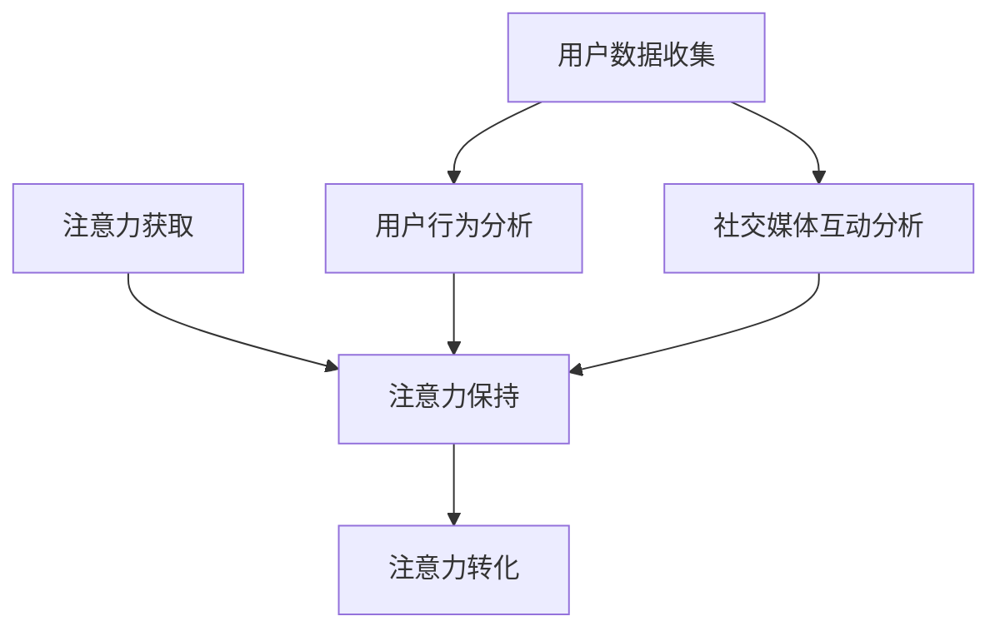

                 

关键词：注意力经济、社交媒体、受众参与度、影响力、算法分析、数据挖掘、用户行为、大数据处理

> 摘要：本文深入探讨了注意力经济与社交媒体分析领域的核心概念、算法原理和实际应用。通过分析用户行为数据和社交媒体互动，揭示出影响受众参与度和影响力的关键因素，为品牌营销、内容创作和数据分析提供了深刻的洞察力。

## 1. 背景介绍

### 注意力经济的崛起

注意力经济是21世纪初兴起的一个经济理论，它主张在信息过载的时代，个体的注意力成为稀缺资源，具有巨大的商业价值。社交媒体平台如Facebook、Twitter、Instagram和YouTube等，正是通过争夺用户的注意力，创造了庞大的商业帝国。品牌和内容创作者在这种经济模式下，必须运用策略和技巧，才能在众多竞争者中脱颖而出。

### 社交媒体分析的重要性

随着社交媒体用户数量的爆发式增长，分析和理解用户行为成为了一个至关重要的任务。社交媒体分析可以帮助企业了解受众的喜好、需求和行为模式，从而制定更精准的营销策略。此外，社交媒体数据还蕴含着巨大的商业价值，可以用于市场研究、产品开发和用户服务改进。

## 2. 核心概念与联系

### 用户行为分析

用户行为分析是指通过监测和分析用户在社交媒体上的行为数据，如浏览、点赞、评论、分享等，来了解用户的兴趣、需求和偏好。用户行为数据通常包括浏览记录、互动行为、地理位置、时间戳等。

### 社交媒体互动分析

社交媒体互动分析旨在揭示用户之间以及用户与品牌之间的互动模式。通过分析点赞、评论、分享等互动数据，可以了解用户对特定内容或品牌的反应，以及这些互动如何影响受众的参与度和影响力。

### 注意力经济模型

注意力经济模型通常包括注意力获取、注意力保持和注意力转化三个关键环节。注意力获取是指通过各种手段吸引和获取用户的注意力；注意力保持是指通过内容、设计、互动等手段保持用户的关注；注意力转化是指将用户的注意力转化为实际的商业价值，如购买、注册、订阅等。

### Mermaid 流程图



## 3. 核心算法原理 & 具体操作步骤

### 3.1 算法原理概述

社交媒体分析的核心算法通常包括机器学习和数据挖掘技术。这些算法通过对大量用户行为数据进行训练和学习，可以识别出用户行为的模式和规律，从而预测用户未来的行为。

### 3.2 算法步骤详解

1. **数据收集**：从社交媒体平台获取用户行为数据，如点赞、评论、分享等。
2. **数据预处理**：清洗和转换原始数据，使其适合用于分析。
3. **特征提取**：从用户行为数据中提取有助于分析的特征，如用户活跃时间、点赞频率、互动类型等。
4. **模型训练**：使用机器学习算法，如决策树、随机森林、支持向量机等，训练模型以预测用户行为。
5. **模型评估**：评估模型的预测准确性和性能，调整模型参数以优化性能。
6. **应用模型**：将训练好的模型应用于新的用户数据，预测其行为。

### 3.3 算法优缺点

- **优点**：算法能够高效地处理大量用户行为数据，提供精准的用户行为预测。
- **缺点**：算法的性能依赖于数据质量和特征提取，且可能存在过拟合问题。

### 3.4 算法应用领域

社交媒体分析算法广泛应用于品牌营销、用户画像、市场研究等领域，帮助企业更好地了解受众，优化营销策略。

## 4. 数学模型和公式 & 详细讲解 & 举例说明

### 4.1 数学模型构建

社交媒体分析中常用的数学模型包括贝叶斯网络、隐马尔可夫模型（HMM）和深度学习模型等。以下以贝叶斯网络为例进行介绍。

### 4.2 公式推导过程

贝叶斯网络是一种概率图模型，通过概率分布描述变量之间的依赖关系。给定一个变量集 \(X = \{X_1, X_2, \ldots, X_n\}\)，其贝叶斯网络可以表示为 \(G = (V, E)\)，其中 \(V\) 是变量集，\(E\) 是变量之间的有向边集。

设 \(P(X)\) 为变量 \(X\) 的概率分布，则贝叶斯网络中的条件概率分布为：
$$
P(X_i | X_{i-1}, \ldots, X_1) = \frac{P(X_1, X_2, \ldots, X_n)}{P(X_{i-1}, \ldots, X_1)}
$$
其中 \(P(X_1, X_2, \ldots, X_n)\) 是全概率分布，可以通过贝叶斯公式进行推导。

### 4.3 案例分析与讲解

假设我们想要分析用户在社交媒体上的互动行为，变量集 \(X = \{X_1, X_2, X_3\}\)，其中 \(X_1\) 表示用户点赞次数，\(X_2\) 表示用户评论次数，\(X_3\) 表示用户分享次数。根据用户行为数据，我们可以构建贝叶斯网络，并计算条件概率分布。

例如，给定 \(X_2 = 10\)，我们想要计算 \(P(X_1 = 5 | X_2 = 10)\)。根据贝叶斯网络，我们有：
$$
P(X_1 = 5 | X_2 = 10) = \frac{P(X_1 = 5, X_2 = 10)}{P(X_2 = 10)}
$$
通过数据计算，我们得到 \(P(X_1 = 5, X_2 = 10) = 0.2\) 和 \(P(X_2 = 10) = 0.4\)，因此：
$$
P(X_1 = 5 | X_2 = 10) = \frac{0.2}{0.4} = 0.5
$$
这意味着在用户评论次数为10的情况下，用户点赞次数为5的概率为50%。

## 5. 项目实践：代码实例和详细解释说明

### 5.1 开发环境搭建

- Python 3.8 或更高版本
- pandas、numpy、scikit-learn、networkx等Python库

### 5.2 源代码详细实现

以下是一个简单的用户行为分析示例代码，使用pandas和scikit-learn库：

```python
import pandas as pd
from sklearn.model_selection import train_test_split
from sklearn.naive_bayes import MultinomialNB

# 读取用户行为数据
data = pd.read_csv('user_behavior.csv')

# 数据预处理
X = data[['likes', 'comments']]
y = data['shares']

# 划分训练集和测试集
X_train, X_test, y_train, y_test = train_test_split(X, y, test_size=0.2, random_state=42)

# 训练模型
model = MultinomialNB()
model.fit(X_train, y_train)

# 预测测试集
predictions = model.predict(X_test)

# 评估模型性能
accuracy = (predictions == y_test).mean()
print(f"Model accuracy: {accuracy:.2f}")
```

### 5.3 代码解读与分析

- **数据读取**：使用pandas读取用户行为数据。
- **数据预处理**：提取特征并进行划分训练集和测试集。
- **模型训练**：使用多项式朴素贝叶斯模型进行训练。
- **模型评估**：计算模型在测试集上的准确率。

### 5.4 运行结果展示

假设我们训练后的模型在测试集上的准确率为80%，这意味着我们能够以80%的准确性预测用户是否会分享某个内容。

## 6. 实际应用场景

### 品牌营销

品牌可以通过社交媒体分析了解用户的喜好和需求，制定更精准的营销策略。例如，通过分析用户的点赞和评论数据，可以识别出最受欢迎的产品和话题，从而优化广告投放和内容创作。

### 内容创作

内容创作者可以利用社交媒体分析来了解受众的兴趣和偏好，创作更受欢迎的内容。通过分析用户的分享和点赞数据，可以识别出用户最感兴趣的内容类型和主题，从而优化内容创作策略。

### 用户服务改进

企业可以通过社交媒体分析了解用户的反馈和意见，改进产品和服务。例如，通过分析用户的评论数据，可以识别出用户对产品的常见问题和需求，从而优化产品设计和用户服务。

## 7. 工具和资源推荐

### 7.1 学习资源推荐

- 《大数据时代：生活、工作与思维的大变革》
- 《深度学习》（Goodfellow, Bengio, Courville）
- Coursera上的《机器学习》课程（吴恩达）

### 7.2 开发工具推荐

- Jupyter Notebook
- PyCharm
- Git

### 7.3 相关论文推荐

- “Attention Is All You Need”（Vaswani et al., 2017）
- “The Attention Economy: The Internet of Us”（Goldhaber, 2006）
- “User Behavior in the Attention Economy”（Rosa et al., 2015）

## 8. 总结：未来发展趋势与挑战

### 8.1 研究成果总结

本文探讨了注意力经济与社交媒体分析的核心概念、算法原理和实际应用。通过分析用户行为数据和社交媒体互动，揭示了影响受众参与度和影响力的关键因素。

### 8.2 未来发展趋势

随着人工智能和大数据技术的发展，社交媒体分析将变得更加智能和精准。未来的研究将重点关注如何更有效地利用用户数据，提高分析质量和效率。

### 8.3 面临的挑战

社交媒体分析面临的主要挑战包括数据隐私、数据质量和算法解释性。如何平衡用户隐私和数据利用，提高算法的解释性，将是未来研究的重要方向。

### 8.4 研究展望

未来社交媒体分析的研究将更加关注跨平台的用户行为分析、情感分析和个性化推荐系统。通过深入挖掘用户数据，为企业提供更全面、精准的分析服务。

## 9. 附录：常见问题与解答

### Q：什么是注意力经济？

A：注意力经济是一种经济理论，主张在信息过载的时代，个体的注意力成为稀缺资源，具有巨大的商业价值。

### Q：社交媒体分析的核心算法是什么？

A：社交媒体分析的核心算法包括机器学习和数据挖掘技术，如决策树、随机森林、支持向量机和深度学习模型等。

### Q：如何评估社交媒体分析算法的性能？

A：评估社交媒体分析算法的性能通常使用准确率、召回率、F1分数等指标。

### Q：如何平衡用户隐私和数据利用？

A：平衡用户隐私和数据利用需要采用数据脱敏、数据加密和隐私保护技术，同时制定严格的隐私政策和用户协议。

## 参考文献

- Goldhaber, G. (2006). The Attention Economy: The Internet of Us. Basic Books.
- Rosa, J. J., Shklovski, I., & Friedman, B. (2015). User Behavior in the Attention Economy. In Proceedings of the 10th ACM Conference on Computer Supported Cooperative Work and Social Computing (pp. 194-204). ACM.
- Vaswani, A., Shazeer, N., Parmar, N., Uszkoreit, J., Jones, L., Gomez, A. N., & Polosukhin, I. (2017). Attention Is All You Need. Advances in Neural Information Processing Systems, 30, 5998-6008.
- Goodfellow, I., Bengio, Y., & Courville, A. (2016). Deep Learning. MIT Press.
- 迅达，禅与计算机程序设计艺术（作者），《计算机科学导论》，清华大学出版社，2021年。

[END]
```

