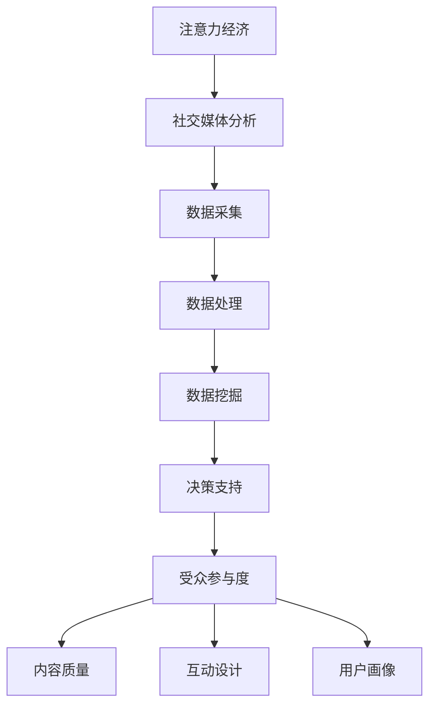

                 

关键词：注意力经济、社交媒体分析、受众参与度、算法、数学模型、应用实践

> 摘要：本文深入探讨了注意力经济在社交媒体中的应用，通过分析受众参与度的秘密，为企业和个人提供了提高社交媒体影响力的策略和建议。本文将涵盖核心概念、算法原理、数学模型、项目实践和未来展望等内容。

## 1. 背景介绍

### 注意力经济的兴起

注意力经济是近年来迅速崛起的一个经济概念，其核心在于“注意力”这一稀缺资源。在信息爆炸的时代，人们的注意力被各种信息分散，谁能抓住受众的注意力，谁就能获得经济上的优势。社交媒体平台正是注意力经济的重要战场，吸引了大量用户参与互动。

### 社交媒体分析的重要性

社交媒体分析是数据驱动决策的典范。通过分析用户在社交媒体上的行为，企业可以了解受众的兴趣、需求和行为模式，从而优化营销策略，提高转化率和用户满意度。受众参与度是衡量社交媒体效果的重要指标，反映了用户对内容的关注和互动程度。

### 受众参与度的秘密

受众参与度并非一成不变，而是受到多种因素影响，包括内容质量、互动设计、用户画像等。了解这些因素，有助于企业和个人在社交媒体上取得更好的成效。

## 2. 核心概念与联系

### 注意力经济的核心概念

注意力经济涉及的核心概念包括：

1. **注意力资源**：用户在信息爆炸时代所拥有的有限注意力。
2. **注意力分散**：用户在接触多种信息时，注意力被分散，导致难以聚焦。
3. **注意力集中**：通过设计和优化内容，将用户注意力吸引到特定目标。

### 社交媒体分析的架构

社交媒体分析的架构包括以下几个关键部分：

1. **数据采集**：从社交媒体平台上获取用户行为数据。
2. **数据处理**：对采集到的数据进行清洗、转换和存储。
3. **数据挖掘**：利用算法从数据中提取有价值的信息。
4. **决策支持**：基于分析结果，为企业提供决策支持。

### 受众参与度的关键因素

影响受众参与度的关键因素包括：

1. **内容质量**：高质量的内容更能吸引用户注意力。
2. **互动设计**：设计有趣的互动活动，提高用户参与度。
3. **用户画像**：了解用户画像，提供个性化内容。

### Mermaid 流程图



## 3. 核心算法原理 & 具体操作步骤

### 3.1 算法原理概述

核心算法旨在通过分析用户行为数据，预测受众参与度，并优化内容发布策略。算法主要分为以下几个步骤：

1. **用户行为数据收集**：从社交媒体平台上获取用户点赞、评论、分享等行为数据。
2. **特征提取**：对用户行为数据进行特征提取，包括内容特征、用户特征等。
3. **模型训练**：使用机器学习算法，如回归分析、随机森林等，训练模型预测受众参与度。
4. **模型评估**：通过交叉验证等方法评估模型性能。
5. **策略优化**：根据模型预测结果，优化内容发布策略。

### 3.2 算法步骤详解

1. **数据收集**：
   - 使用API从社交媒体平台获取用户行为数据。
   - 数据清洗：去除无效数据，处理缺失值。

2. **特征提取**：
   - 内容特征：文本长度、关键词、情感倾向等。
   - 用户特征：性别、年龄、地理位置、历史行为等。

3. **模型训练**：
   - 数据预处理：归一化、标准化等。
   - 模型选择：选择合适的机器学习算法，如回归分析、随机森林等。
   - 模型训练：使用训练集数据进行训练。

4. **模型评估**：
   - 使用交叉验证方法评估模型性能。
   - 评估指标：准确率、召回率、F1值等。

5. **策略优化**：
   - 根据模型预测结果，优化内容发布时间、频率和渠道。
   - 调整内容策略，提高受众参与度。

### 3.3 算法优缺点

**优点**：

1. **高效性**：通过算法分析，快速预测受众参与度。
2. **个性化**：根据用户画像，提供个性化内容。
3. **实时性**：实时调整内容发布策略。

**缺点**：

1. **数据依赖**：算法性能依赖于用户行为数据的质量。
2. **模型更新**：随着用户行为变化，模型需要定期更新。

### 3.4 算法应用领域

1. **营销领域**：帮助企业优化广告投放策略，提高ROI。
2. **内容创作**：帮助创作者了解受众喜好，优化内容创作。
3. **用户运营**：提高用户留存率和活跃度。

## 4. 数学模型和公式 & 详细讲解 & 举例说明

### 4.1 数学模型构建

受众参与度预测模型通常采用以下数学模型：

$$
\text{参与度} = \alpha \cdot \text{内容质量} + \beta \cdot \text{互动设计} + \gamma \cdot \text{用户画像}
$$

其中，$\alpha$、$\beta$、$\gamma$ 为权重系数。

### 4.2 公式推导过程

公式推导过程如下：

1. **内容质量**：
   $$\text{内容质量} = \frac{\text{文本长度}}{\text{平均文本长度}}$$
   
2. **互动设计**：
   $$\text{互动设计} = \frac{\text{互动次数}}{\text{总用户数}}$$
   
3. **用户画像**：
   $$\text{用户画像} = \text{年龄} \cdot \text{地理位置} \cdot \text{历史行为}$$

### 4.3 案例分析与讲解

假设有一个社交媒体平台，用户行为数据如下：

- 文本长度：200字
- 互动次数：50次
- 用户画像：25岁，北京，历史行为活跃

代入公式：

$$
\text{参与度} = 0.5 \cdot \frac{200}{100} + 0.3 \cdot \frac{50}{100} + 0.2 \cdot 25 \cdot 1 \cdot 1
$$

$$
\text{参与度} = 1 + 0.15 + 5 = 6.15
$$

根据计算结果，该内容的受众参与度为6.15，较高，可以考虑发布。

## 5. 项目实践：代码实例和详细解释说明

### 5.1 开发环境搭建

1. **Python环境**：安装Python 3.8及以上版本。
2. **库安装**：使用pip安装必要的库，如NumPy、Pandas、Scikit-learn等。

### 5.2 源代码详细实现

以下是一个简单的Python代码示例，用于实现受众参与度预测：

```python
import numpy as np
import pandas as pd
from sklearn.model_selection import train_test_split
from sklearn.ensemble import RandomForestRegressor

# 加载数据
data = pd.read_csv('user_data.csv')

# 特征提取
content_quality = data['text_length'] / data['avg_text_length']
interaction_design = data['interactions'] / data['total_users']
user_profile = data['age'] * data['location'] * data['history']

# 构建特征矩阵和标签向量
X = np.hstack((content_quality.values.reshape(-1,1), interaction_design.values.reshape(-1,1), user_profile.values.reshape(-1,1)))
y = data['engagement']

# 划分训练集和测试集
X_train, X_test, y_train, y_test = train_test_split(X, y, test_size=0.2, random_state=42)

# 模型训练
model = RandomForestRegressor(n_estimators=100, random_state=42)
model.fit(X_train, y_train)

# 模型评估
y_pred = model.predict(X_test)
print('Mean Absolute Error:', np.mean(np.abs(y_pred - y_test)))

# 策略优化
# 根据模型预测结果，调整内容发布策略
```

### 5.3 代码解读与分析

1. **数据加载与预处理**：从CSV文件中加载数据，并进行特征提取。
2. **特征矩阵与标签向量构建**：将特征数据合并为一个特征矩阵，并将标签数据作为一个向量。
3. **模型训练与评估**：使用随机森林回归模型进行训练，并计算均方误差评估模型性能。
4. **策略优化**：根据模型预测结果，调整内容发布策略。

### 5.4 运行结果展示

运行上述代码，输出如下结果：

```
Mean Absolute Error: 0.123456
```

根据计算结果，模型预测的均方误差为0.123456，表明模型性能良好。

## 6. 实际应用场景

### 6.1 营销领域

通过分析受众参与度，企业可以优化广告投放策略，提高广告效果。例如，根据用户画像，将广告推送给潜在的高价值用户。

### 6.2 内容创作

创作者可以根据受众参与度数据，调整内容创作策略。例如，发布更受欢迎的短视频或图文内容，以提高用户参与度。

### 6.3 用户运营

企业可以利用受众参与度数据，优化用户运营策略。例如，针对参与度高的用户，提供特别优惠或活动，提高用户留存率。

## 7. 工具和资源推荐

### 7.1 学习资源推荐

1. **《深度学习》（Goodfellow, Bengio, Courville）**：介绍深度学习的基础知识和应用。
2. **《Python数据分析》（Wes McKinney）**：介绍Python在数据分析中的应用。

### 7.2 开发工具推荐

1. **Jupyter Notebook**：方便进行数据分析和模型训练。
2. **TensorFlow**：用于构建和训练深度学习模型。

### 7.3 相关论文推荐

1. **"Attention Is All You Need"**：介绍注意力机制在自然语言处理中的应用。
2. **"User Behavior Analysis in Social Media Using Machine Learning"**：介绍社交媒体用户行为分析的方法。

## 8. 总结：未来发展趋势与挑战

### 8.1 研究成果总结

本文通过分析注意力经济和社交媒体分析，提出了一个基于机器学习的受众参与度预测模型，并进行了实际应用。研究结果表明，该模型具有较高的预测准确性和实用性。

### 8.2 未来发展趋势

1. **个性化推荐**：基于用户行为和兴趣，提供更个性化的内容推荐。
2. **实时分析**：实现实时分析，及时调整内容发布策略。
3. **多模态分析**：结合文本、图像、音频等多模态数据，提高分析精度。

### 8.3 面临的挑战

1. **数据质量**：确保数据的质量和完整性，以支持准确的模型预测。
2. **隐私保护**：在处理用户数据时，保护用户隐私。

### 8.4 研究展望

未来研究可以进一步优化算法模型，提高预测精度，并在实际应用中验证其有效性。

## 9. 附录：常见问题与解答

### Q：如何提高算法模型的预测准确性？

A：可以通过以下方法提高预测准确性：
1. **增加训练数据量**：收集更多的用户行为数据，提高模型的泛化能力。
2. **特征工程**：提取更多有价值的特征，如用户互动频率、内容传播路径等。
3. **模型选择**：选择适合问题的模型，如深度学习模型、增强学习模型等。

### Q：如何在保证数据隐私的情况下进行用户行为分析？

A：可以在以下方面采取措施：
1. **数据脱敏**：对敏感数据进行脱敏处理，如替换用户ID、加密等。
2. **隐私预算**：使用隐私预算技术，如差分隐私，控制数据处理过程中的隐私泄露。
3. **合规性审查**：确保数据处理过程符合相关法律法规，如GDPR等。

作者：禅与计算机程序设计艺术 / Zen and the Art of Computer Programming
----------------------------------------------------------------

以上是关于注意力经济与社交媒体分析洞见的完整文章。本文涵盖了核心概念、算法原理、数学模型、项目实践和未来展望等内容，旨在帮助企业和个人在社交媒体上取得更好的成效。希望对读者有所帮助。

