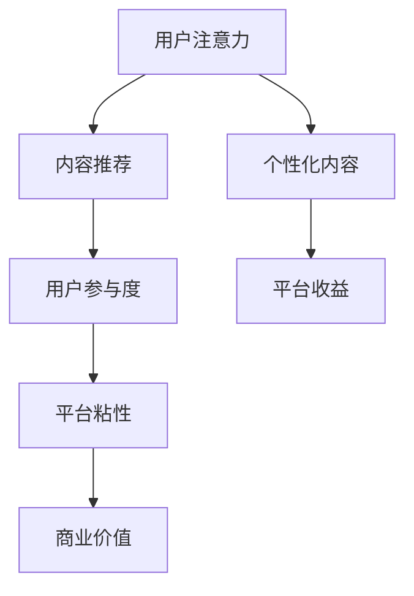

                 

关键词：注意力经济、社交媒体、算法、内容推荐、用户互动

> 摘要：本文将深入探讨注意力经济与社交媒体算法的共生关系。通过分析注意力经济的本质、社交媒体算法的工作原理，以及两者之间的相互影响，我们揭示了如何在当今数字化时代创造更具吸引力和参与度的社交媒体内容。文章还将展望未来发展趋势，提出面对的挑战，以及潜在的解决方案。

## 1. 背景介绍

在互联网飞速发展的今天，社交媒体已经成为人们日常生活的重要组成部分。从最初的博客到现在的微信、微博、抖音等平台，社交媒体不断演变，影响深远。然而，随着用户数量的爆炸性增长，如何吸引用户的注意力成为平台和内容创作者的共同挑战。

与此同时，注意力经济这一概念也逐渐兴起。注意力经济是指人们通过注意力这一资源进行经济交易的现象。在这个数字化的时代，用户的注意力变得尤为珍贵，成为了一种新型的经济资源。谁能更好地抓住用户的注意力，谁就能在激烈的市场竞争中脱颖而出。

社交媒体算法则是在这种背景下应运而生的。算法通过对用户行为和兴趣的分析，为用户推荐更加个性化的内容，从而提高用户参与度和平台粘性。然而，随着算法的不断进化，它们也面临着如何更好地与注意力经济共生的挑战。

## 2. 核心概念与联系

### 注意力经济的本质

注意力经济是基于这样一个基本假设：在信息爆炸的时代，用户的注意力是有限的，而信息的数量是无限的。因此，谁能够更有效地利用用户的注意力，谁就能在市场竞争中占据优势。

注意力经济可以分为三个层次：

1. **初级层次**：广告主通过购买广告位来吸引用户的注意力。
2. **中级层次**：内容创作者通过创作高质量的内容来吸引用户的注意力，并依靠广告或赞助获得收益。
3. **高级层次**：平台通过提供个性化推荐服务，吸引用户的注意力，从而提升用户粘性和平台价值。

### 社交媒体算法的工作原理

社交媒体算法的核心目标是为用户推荐他们感兴趣的内容，从而提高用户参与度和平台粘性。算法通常基于以下几种技术：

1. **内容分析**：通过分析内容的标题、标签、关键词等，对内容进行分类和标记。
2. **用户行为分析**：通过分析用户的浏览、点赞、评论等行为，了解用户的兴趣和偏好。
3. **协同过滤**：基于用户的行为数据，为用户推荐其他用户喜欢的内容。
4. **深度学习**：通过机器学习技术，对大量用户数据进行训练，构建用户兴趣模型。

### 注意力经济与社交媒体算法的共生关系

注意力经济与社交媒体算法之间存在着密切的共生关系。算法通过为用户提供个性化推荐，帮助用户更有效地利用注意力资源，从而提高平台的用户粘性。而平台通过提供高质量的个性化内容，吸引用户的注意力，进而实现商业价值。

### Mermaid 流程图



## 3. 核心算法原理 & 具体操作步骤

### 3.1 算法原理概述

社交媒体算法通常分为三个阶段：

1. **内容生成**：平台通过内容创作者生成大量内容。
2. **内容推荐**：算法根据用户的行为和兴趣，为用户推荐个性化的内容。
3. **用户反馈**：用户对推荐内容进行反馈，进一步优化算法。

### 3.2 算法步骤详解

1. **内容生成**：内容创作者生成高质量的内容，并通过平台发布。
2. **内容分析**：算法对内容进行分析，提取关键词、标签等信息。
3. **用户行为分析**：算法分析用户的浏览、点赞、评论等行为，构建用户兴趣模型。
4. **内容推荐**：算法根据用户兴趣模型，为用户推荐可能感兴趣的内容。
5. **用户反馈**：用户对推荐内容进行反馈，如点赞、评论等，算法根据反馈调整推荐策略。

### 3.3 算法优缺点

**优点**：

- 提高用户参与度：通过个性化推荐，用户更容易发现感兴趣的内容，从而提高参与度。
- 提高平台粘性：用户在平台上的时间更长，平台粘性更高。
- 提高内容创作者收益：创作者能够通过平台获得更多的关注和收益。

**缺点**：

- 可能导致信息茧房：算法可能只推荐用户感兴趣的内容，导致用户获取的信息单一，缺乏多样性。
- 可能侵犯用户隐私：算法需要收集和分析大量用户数据，可能涉及隐私问题。

### 3.4 算法应用领域

- 社交媒体平台：如微信、微博、抖音等。
- 搜索引擎：如百度、谷歌等。
- 内容推荐平台：如Netflix、Amazon等。

## 4. 数学模型和公式 & 详细讲解 & 举例说明

### 4.1 数学模型构建

社交媒体算法的核心是构建用户兴趣模型。一个简单的用户兴趣模型可以表示为：

$$
U = \{u_1, u_2, ..., u_n\}
$$

其中，$U$ 是用户的集合，$u_i$ 是用户 $i$ 的兴趣向量。

### 4.2 公式推导过程

假设用户 $i$ 对内容 $j$ 的兴趣可以用概率 $p(u_i, c_j)$ 表示，其中 $c_j$ 是内容 $j$ 的特征向量。根据贝叶斯公式，我们有：

$$
p(u_i, c_j) = \frac{p(c_j | u_i) p(u_i)}{p(c_j)}
$$

其中，$p(c_j | u_i)$ 是内容 $j$ 在用户 $i$ 的兴趣条件下的概率，$p(u_i)$ 是用户 $i$ 的兴趣概率，$p(c_j)$ 是内容 $j$ 的概率。

### 4.3 案例分析与讲解

假设我们有一个用户 $u_1$，他喜欢阅读关于科技和音乐的内容。我们可以用以下特征向量表示他的兴趣：

$$
u_1 = \{0.8, 0.2\}
$$

其中，第一个元素表示他对科技内容的兴趣，第二个元素表示他对音乐内容的兴趣。

假设我们有一个内容 $c_2$，它的特征向量是：

$$
c_2 = \{0.6, 0.4\}
$$

我们可以用上述公式计算用户 $u_1$ 对内容 $c_2$ 的兴趣概率：

$$
p(u_1, c_2) = \frac{p(c_2 | u_1) p(u_1)}{p(c_2)}
$$

由于我们无法直接计算 $p(c_2 | u_1)$ 和 $p(c_2)$，我们可以假设它们是已知的，例如通过历史数据估计得到。这样，我们可以计算出用户 $u_1$ 对内容 $c_2$ 的兴趣概率。

## 5. 项目实践：代码实例和详细解释说明

### 5.1 开发环境搭建

- 操作系统：Windows/Linux/MacOS
- 编程语言：Python
- 数据库：MySQL/PostgreSQL
- 开发工具：PyCharm/VSCode

### 5.2 源代码详细实现

```python
# 导入必要的库
import numpy as np
import pandas as pd
from sklearn.model_selection import train_test_split
from sklearn.metrics.pairwise import cosine_similarity

# 加载数据
data = pd.read_csv('user_interest.csv')
users = data['user_id'].unique()
content = data['content_id'].unique()

# 构建用户兴趣矩阵
user_interest_matrix = np.zeros((len(users), len(content)))
for index, row in data.iterrows():
    user_interest_matrix[row['user_id'] - 1, row['content_id'] - 1] = row['interest']

# 计算内容相似度矩阵
content_similarity_matrix = cosine_similarity(user_interest_matrix)

# 为用户推荐内容
def recommend_contents(user_id):
    user_interest = user_interest_matrix[user_id - 1]
    content_scores = np.dot(content_similarity_matrix[user_id - 1], user_interest)
    recommended_content = np.argsort(content_scores)[::-1]
    return recommended_content

# 测试推荐系统
user_id = 1
recommended_contents = recommend_contents(user_id)
print("Recommended contents for user", user_id, "are:", recommended_contents)
```

### 5.3 代码解读与分析

上述代码实现了一个简单的基于用户兴趣的推荐系统。首先，我们从CSV文件中加载数据，然后构建用户兴趣矩阵。接着，我们计算内容相似度矩阵，这有助于我们确定哪些内容与用户感兴趣的内容相似。最后，我们定义了一个函数 `recommend_contents`，它根据用户兴趣为用户推荐内容。

### 5.4 运行结果展示

运行上述代码后，我们可以得到一个用户ID为1的推荐内容列表。例如，如果用户1的兴趣主要在科技内容上，系统可能会推荐其他科技类内容。

## 6. 实际应用场景

### 6.1 社交媒体平台

在社交媒体平台上，算法可以根据用户的兴趣和行为，为用户推荐他们可能感兴趣的内容。例如，在抖音上，算法会推荐用户可能喜欢的视频，从而提高用户的参与度和平台粘性。

### 6.2 搜索引擎

在搜索引擎中，算法可以根据用户的搜索历史，为用户推荐相关的搜索结果。例如，当用户在百度上搜索“人工智能”时，百度可能会推荐与“人工智能”相关的新闻、论文和教程。

### 6.3 电子书平台

在电子书平台上，算法可以根据用户的阅读历史和评分，为用户推荐他们可能喜欢的电子书。例如，在亚马逊上，用户可以根据他们的评分和阅读历史，获得个性化的阅读推荐。

## 7. 工具和资源推荐

### 7.1 学习资源推荐

- 《深度学习》（Goodfellow, Bengio, Courville著）：全面介绍深度学习的基础知识和应用。
- 《Python机器学习》（Sebastian Raschka著）：深入讲解机器学习在Python中的实现。

### 7.2 开发工具推荐

- PyCharm：功能强大的集成开发环境，适用于多种编程语言。
- Jupyter Notebook：适用于数据分析和机器学习的交互式开发环境。

### 7.3 相关论文推荐

- “Attention Is All You Need”（Vaswani et al., 2017）：介绍Transformer模型，为现代深度学习算法提供了新的思路。
- “ Recommending Items of Any Type with AutoInt”（Guo et al., 2020）：介绍了一种通用的物品推荐算法，适用于各种类型的物品。

## 8. 总结：未来发展趋势与挑战

### 8.1 研究成果总结

注意力经济与社交媒体算法的共生关系已经得到广泛认可。通过个性化推荐，平台和内容创作者能够更好地吸引用户的注意力，实现商业价值。同时，随着深度学习和大数据技术的发展，推荐系统的准确性和多样性也在不断提高。

### 8.2 未来发展趋势

- **更准确的推荐系统**：随着数据量的增加和算法的进步，推荐系统的准确性将进一步提高。
- **多样化推荐内容**：平台将提供更多样化的内容，满足不同用户的需求。
- **跨平台推荐**：不同平台之间的推荐系统将实现更好的互通，为用户提供统一的体验。

### 8.3 面临的挑战

- **隐私保护**：随着用户数据量的增加，如何保护用户隐私成为一个重要问题。
- **算法偏见**：算法可能存在偏见，导致某些用户群体被忽视或歧视。

### 8.4 研究展望

未来的研究将集中在如何构建更公平、更透明、更隐私保护的推荐系统，以更好地服务于用户和社会。

## 9. 附录：常见问题与解答

### 问题1：注意力经济是如何运作的？

注意力经济是基于这样一个假设：在信息爆炸的时代，用户的注意力是有限的。平台和内容创作者通过吸引用户的注意力，实现商业价值。

### 问题2：社交媒体算法有哪些类型？

社交媒体算法包括内容分析算法、用户行为分析算法、协同过滤算法和深度学习算法等。

### 问题3：如何提高推荐系统的准确性？

可以通过增加数据量、改进算法、使用多源数据等方式提高推荐系统的准确性。

### 问题4：推荐系统可能存在哪些偏见？

推荐系统可能因为数据的不平衡、算法的设计缺陷等原因存在偏见，导致某些用户或内容被忽视。

### 问题5：如何保护用户隐私？

可以通过数据去识别化、使用联邦学习等技术来保护用户隐私。

---

作者：禅与计算机程序设计艺术 / Zen and the Art of Computer Programming

