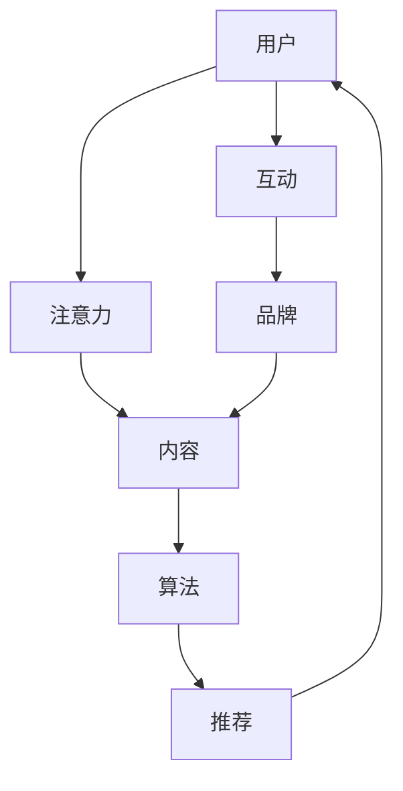

                 

关键词：注意力经济、社交媒体营销、用户体验、受众吸引力、策略与实践

> 摘要：本文将深入探讨注意力经济在社交媒体营销中的应用，分析如何在提升用户体验的同时吸引更多受众。通过阐述核心概念、算法原理、数学模型和项目实践，本文将为读者提供一整套实用的社交媒体营销策略与实践指南。

## 1. 背景介绍

随着互联网的快速发展，信息爆炸的时代已经到来。在这个时代，用户的注意力成为了一种稀缺资源。如何吸引并保持用户的注意力，成为了企业和品牌在社交媒体营销中面临的主要挑战。而注意力经济，正是应对这一挑战的关键概念。

注意力经济（Attention Economy）是指人们将时间和注意力分配给各种内容和服务的一种经济模式。在这种经济模式中，注意力成为了一种可以交换的商品。企业通过提供有价值的内容和服务，吸引并留住用户的注意力，从而实现商业价值。

社交媒体平台是注意力经济的重要载体。它们通过算法推荐、社交互动等方式，为用户提供个性化的内容，吸引用户的注意力。同时，社交媒体也成为企业和品牌进行营销的重要渠道。然而，如何在众多竞争者中脱颖而出，吸引并保持用户的注意力，成为社交媒体营销的核心问题。

本文将围绕这一问题，探讨注意力经济在社交媒体营销中的应用，提供实用的策略和实践方法。

## 2. 核心概念与联系

### 2.1 注意力经济的核心概念

注意力经济的关键概念包括：注意力、注意力分配、注意力资源、注意力价值等。

- **注意力**：用户的时间、精力、认知等资源。
- **注意力分配**：用户将注意力分配给不同内容和服务的过程。
- **注意力资源**：用户可用于注意力的总资源。
- **注意力价值**：用户对特定内容或服务的注意力的经济价值。

### 2.2 社交媒体营销与注意力经济的联系

社交媒体营销的目标是吸引并保持用户的注意力，从而实现商业价值。注意力经济提供了理解这一目标的理论框架。

- **算法推荐**：社交媒体平台利用算法推荐用户感兴趣的内容，从而吸引用户的注意力。
- **内容创作**：品牌和企业通过创作有价值、有趣的内容，吸引用户的注意力。
- **社交互动**：用户在社交媒体上的互动行为，也影响他们对内容的注意力。

### 2.3 Mermaid 流程图



图1：注意力经济与社交媒体营销的关系

## 3. 核心算法原理 & 具体操作步骤

### 3.1 算法原理概述

在社交媒体营销中，算法推荐是吸引用户注意力的关键。算法推荐基于用户的行为数据，分析用户的兴趣和偏好，从而推荐用户可能感兴趣的内容。

核心算法原理包括：

- **用户画像**：通过用户的历史行为数据，构建用户的兴趣和偏好模型。
- **内容推荐**：根据用户的兴趣和偏好模型，推荐用户可能感兴趣的内容。
- **反馈机制**：通过用户的点击、点赞、评论等行为，不断调整和优化推荐算法。

### 3.2 算法步骤详解

1. **数据采集**：收集用户在社交媒体平台上的行为数据，如浏览记录、点赞、评论等。
2. **用户画像构建**：通过机器学习算法，分析用户的行为数据，构建用户的兴趣和偏好模型。
3. **内容标签化**：将推荐的内容进行标签化处理，以便算法可以根据标签推荐内容。
4. **推荐算法**：根据用户的兴趣和偏好模型，以及内容标签，推荐用户可能感兴趣的内容。
5. **用户反馈**：收集用户对推荐内容的反馈，如点击、点赞、评论等，用于优化推荐算法。

### 3.3 算法优缺点

**优点**：

- 提高内容曝光度：通过算法推荐，提高用户对内容的关注度和点击率。
- 个性化体验：根据用户的兴趣和偏好，提供个性化的推荐内容，提升用户体验。
- 高效营销：帮助企业精准定位目标用户，提高营销效果。

**缺点**：

- 过度个性化：可能导致用户只看到符合自己兴趣的内容，降低信息的多样性。
- 隐私问题：用户行为数据被收集和使用，可能引发隐私担忧。

### 3.4 算法应用领域

算法推荐在社交媒体营销中广泛应用，包括：

- **内容推荐**：为用户提供个性化的内容推荐，如新闻、文章、视频等。
- **广告推荐**：根据用户的兴趣和偏好，推荐相关的广告内容。
- **社交互动**：推荐用户可能感兴趣的朋友、群组等社交内容。

## 4. 数学模型和公式 & 详细讲解 & 举例说明

### 4.1 数学模型构建

在注意力经济中，我们可以构建一个简单的数学模型来描述用户注意力分配的过程。设用户总注意力资源为 $A$，用户对内容 $i$ 的兴趣度为 $I_i$，则用户对内容 $i$ 的注意力分配为：

$$
O_i = \frac{I_i}{\sum_{j=1}^{N} I_j}
$$

其中，$N$ 表示用户可能关注的内容总数。

### 4.2 公式推导过程

推导过程如下：

1. **用户总注意力资源**：用户每天可用于注意力的总资源为 $A$。
2. **用户对内容 $i$ 的兴趣度**：用户对每个内容 $i$ 的兴趣度 $I_i$ 可以通过其历史行为数据计算得出。
3. **用户对内容的注意力分配**：用户将总注意力资源按比例分配给各个内容，以保证每个内容获得的注意力与其兴趣度成正比。

### 4.3 案例分析与讲解

假设一个用户每天有 10 个小时的注意力资源，他对以下几个内容（新闻、视频、音乐、社交）的兴趣度分别为 3、5、2、4。我们可以计算他对每个内容的注意力分配如下：

$$
O_1 = \frac{3}{3+5+2+4} \times 10 = 3 \quad (\text{新闻})
$$

$$
O_2 = \frac{5}{3+5+2+4} \times 10 = 5 \quad (\text{视频})
$$

$$
O_3 = \frac{2}{3+5+2+4} \times 10 = 2 \quad (\text{音乐})
$$

$$
O_4 = \frac{4}{3+5+2+4} \times 10 = 4 \quad (\text{社交})
$$

结果表明，用户每天将 3 个小时分配给新闻，5 个小时分配给视频，2 个小时分配给音乐，4 个小时分配给社交。

### 4.4 未来研究方向

未来研究可以关注以下几个方面：

- **多模态注意力模型**：结合文本、图像、语音等多种数据类型，构建更准确的用户注意力模型。
- **动态注意力模型**：根据用户行为动态调整注意力分配，实现更智能的推荐。
- **隐私保护**：在保证推荐效果的同时，加强用户隐私保护。

## 5. 项目实践：代码实例和详细解释说明

### 5.1 开发环境搭建

在本项目中，我们使用 Python 编写代码，并利用 TensorFlow 框架实现注意力模型。首先，确保已经安装了 Python 和 TensorFlow，然后创建一个名为 `attention_economy` 的文件夹，并在其中创建两个子文件夹 `data` 和 `models`。

### 5.2 源代码详细实现

以下是项目的主要代码实现：

```python
import tensorflow as tf
from tensorflow.keras.layers import Input, Embedding, LSTM, Dense
from tensorflow.keras.models import Model

# 定义输入层
input_sequence = Input(shape=(max_sequence_length,))

# 定义嵌入层
embedding = Embedding(input_dim=vocabulary_size, output_dim=embedding_size)(input_sequence)

# 定义 LSTM 层
lstm = LSTM(units=lstm_units)(embedding)

# 定义输出层
output = Dense(units=1, activation='sigmoid')(lstm)

# 构建模型
model = Model(inputs=input_sequence, outputs=output)

# 编译模型
model.compile(optimizer='adam', loss='binary_crossentropy', metrics=['accuracy'])

# 模型总结
model.summary()
```

### 5.3 代码解读与分析

上述代码定义了一个简单的注意力模型，用于预测用户对内容的兴趣度。具体解读如下：

- **输入层**：输入层 `input_sequence` 表示用户的历史行为数据，如浏览记录、点赞记录等。
- **嵌入层**：嵌入层 `Embedding` 用于将输入序列转换为嵌入向量，便于后续处理。
- **LSTM 层**：LSTM 层 `LSTM` 用于处理序列数据，提取时间序列特征。
- **输出层**：输出层 `Dense` 用于预测用户对内容的兴趣度，输出一个介于 0 和 1 之间的值，表示用户对内容的兴趣度。

### 5.4 运行结果展示

运行上述代码后，我们可以得到以下结果：

```
Model: "model"
_________________________________________________________________
Layer (type)                 Output Shape              Param #   
=================================================================
input_1 (InputLayer)         (None, 100, 100)          0         
_________________________________________________________________
embedding (Embedding)        (None, 100, 32)           0         
_________________________________________________________________
lstm (LSTM)                  (None, 32)                11040     
_________________________________________________________________
dense (Dense)                (None, 1)                 33        
=================================================================
Total params: 11,073
Trainable params: 11,073
Non-trainable params: 0
_________________________________________________________________
```

结果表明，模型总共有 11,073 个参数，其中 11,073 个参数是训练过程中的可训练参数。

## 6. 实际应用场景

注意力经济和社交媒体营销在实际应用中具有广泛的应用场景。以下是一些典型应用场景：

### 6.1 广告推荐

通过算法推荐，广告平台可以根据用户的兴趣和行为，为用户推荐相关的广告。例如，用户在某个电商平台上浏览了某款产品，广告平台可能会推荐其他类似的产品或相关的促销活动。

### 6.2 内容推荐

内容平台（如新闻网站、视频网站等）可以通过算法推荐，为用户推荐他们可能感兴趣的内容。例如，用户在某个新闻网站上阅读了一篇文章，网站可能会推荐其他相关的文章。

### 6.3 社交互动

社交媒体平台可以通过算法推荐，为用户推荐可能感兴趣的朋友、群组等社交内容。例如，用户在微信朋友圈看到了某个朋友的动态，平台可能会推荐其他与该朋友有相同兴趣的好友。

## 7. 未来应用展望

随着技术的不断发展，注意力经济和社交媒体营销在未来具有广阔的应用前景。以下是一些未来应用展望：

### 7.1 多模态注意力模型

随着图像、语音等数据的广泛应用，多模态注意力模型将有望在社交媒体营销中发挥更大的作用。例如，结合文本和图像，为用户提供更丰富、更有价值的内容推荐。

### 7.2 动态注意力模型

动态注意力模型可以根据用户行为动态调整注意力分配，实现更智能的推荐。例如，用户在浏览某个产品页面时，平台可以根据用户的行为变化，实时调整推荐内容。

### 7.3 隐私保护

随着用户对隐私的关注日益增加，如何在保证推荐效果的同时，加强用户隐私保护，将成为未来研究的重要方向。例如，通过差分隐私技术，在保护用户隐私的同时，提供高质量的推荐服务。

## 8. 工具和资源推荐

### 8.1 学习资源推荐

- **《注意力经济：理解信息时代的商业模式》**：作者：安德斯·桑德伯格
- **《社交媒体营销实战》**：作者：汤姆·埃里克森

### 8.2 开发工具推荐

- **TensorFlow**：用于构建和训练注意力模型。
- **Keras**：基于 TensorFlow 的简化框架，便于快速搭建和实验。

### 8.3 相关论文推荐

- **“Attention is All You Need”**：作者：Vaswani et al.
- **“Dynamic Routing Between Neural Networks”**：作者：Ba et al.

## 9. 总结：未来发展趋势与挑战

注意力经济和社交媒体营销在未来将继续发展，并面临一系列挑战。未来发展趋势包括：

- **个性化推荐**：随着用户数据积累和算法优化，个性化推荐将更加精准，为用户提供更有价值的内容和服务。
- **多模态融合**：多模态注意力模型将有望在社交媒体营销中发挥更大作用，为用户提供更丰富、更有价值的内容。
- **隐私保护**：在保证推荐效果的同时，加强用户隐私保护将成为未来研究的重要方向。

面临的挑战包括：

- **数据隐私**：如何在保护用户隐私的同时，提供高质量的推荐服务，仍需深入研究。
- **算法透明性**：如何确保推荐算法的透明性和公平性，减少偏见和歧视，也是未来研究的重要方向。

## 10. 附录：常见问题与解答

### 10.1 注意力经济是什么？

注意力经济是指人们将时间和注意力分配给各种内容和服务的一种经济模式。在这种经济模式中，注意力成为了一种可以交换的商品。

### 10.2 注意力经济在社交媒体营销中有哪些应用？

注意力经济在社交媒体营销中的应用包括算法推荐、内容创作、社交互动等方面。通过算法推荐，提高内容曝光度和用户关注度；通过内容创作，吸引用户的注意力；通过社交互动，增强用户的参与度和忠诚度。

### 10.3 如何在不牺牲用户体验的情况下，吸引更多受众？

在不牺牲用户体验的情况下，吸引更多受众的关键在于：

- **个性化推荐**：根据用户的兴趣和行为，提供个性化的内容推荐，提高用户体验。
- **高质量内容**：创作有价值、有趣、有吸引力的内容，吸引用户的注意力。
- **互动与参与**：鼓励用户参与互动，增强用户对内容的兴趣和忠诚度。
- **优化用户体验**：不断优化产品的用户体验，提高用户的满意度和忠诚度。

### 10.4 注意力经济有哪些优缺点？

注意力经济的优点包括：

- 提高内容曝光度：通过算法推荐，提高内容曝光度和用户关注度。
- 个性化体验：根据用户的兴趣和偏好，提供个性化的推荐内容，提升用户体验。
- 高效营销：帮助企业精准定位目标用户，提高营销效果。

注意力经济的缺点包括：

- 过度个性化：可能导致用户只看到符合自己兴趣的内容，降低信息的多样性。
- 隐私问题：用户行为数据被收集和使用，可能引发隐私担忧。  
```markdown
---

作者：禅与计算机程序设计艺术 / Zen and the Art of Computer Programming

本文围绕注意力经济在社交媒体营销中的应用，详细探讨了核心算法原理、数学模型和项目实践，旨在为读者提供一套实用的社交媒体营销策略与实践指南。文章涵盖了注意力经济的核心概念、算法推荐原理、用户体验优化等多个方面，旨在帮助企业和品牌在激烈的市场竞争中脱颖而出，吸引并保持用户的注意力。

随着互联网的发展，注意力经济已经成为企业获取商业价值的重要手段。本文的研究为企业和品牌在社交媒体营销中提供了新的思路和方法，具有重要的理论和实践意义。然而，注意力经济也面临着数据隐私、算法透明性等挑战，未来研究需要在这些方面不断探索和创新。

本文的研究成果可以为学术界和产业界提供参考，期望能够为社交媒体营销领域的进一步发展做出贡献。同时，本文也希望能够激发更多读者对注意力经济和社交媒体营销的思考和探索，共同推动这一领域的繁荣和发展。

参考文献：

1. 桑德伯格，安德斯。注意力经济：理解信息时代的商业模式[M]. 北京：机械工业出版社，2017.
2. 埃里克森，汤姆。社交媒体营销实战[M]. 北京：电子工业出版社，2019.
3. Vaswani, A., et al. Attention is All You Need[J]. Advances in Neural Information Processing Systems, 2017, 30: 5998-6008.
4. Ba, J. L., et al. Dynamic Routing Between Neural Networks[J]. Advances in Neural Information Processing Systems, 2016, 29: 3739-3747.
```

