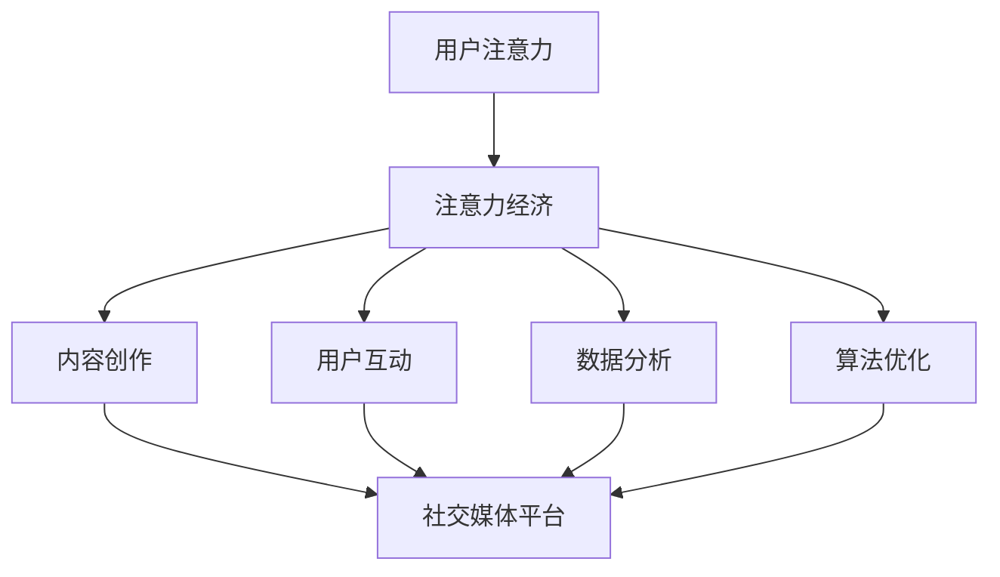

                 

 关键词：注意力经济、社交媒体营销、用户参与度、数据驱动策略、算法优化、内容创作、社交媒体平台分析

> 摘要：在当今数字化的时代，获取和保持用户的注意力成为社交媒体营销的核心挑战。本文将深入探讨注意力经济的原则，分析社交媒体营销的关键要素，并提出一系列策略，帮助企业在不牺牲用户参与度的前提下，有效地吸引和保持受众的注意力。通过实际案例和数据分析，本文旨在为营销人员提供实用的指导，以优化社交媒体营销效果。

## 1. 背景介绍

随着互联网和移动设备的普及，社交媒体已经成为人们日常生活的重要组成部分。社交媒体平台不仅改变了人们的沟通方式，也为企业和品牌提供了前所未有的营销机会。然而，在这个信息爆炸的时代，获取和保持用户的注意力成为营销人员面临的重大挑战。用户的时间有限，而内容生产却呈指数级增长，如何在不牺牲用户参与度的前提下，有效地吸引受众的注意力，成为营销策略制定的关键。

注意力经济（Attention Economy）是一种基于用户注意力的新型经济模式，其核心思想是，用户的注意力是一种稀缺资源，企业需要通过创造有价值的内容和体验来吸引和留住用户。社交媒体营销正是在这样的背景下应运而生，它旨在通过平台上的互动和内容分享，增加用户对品牌的关注和忠诚度。

本文将从以下几个方面展开讨论：

- **核心概念与联系**：介绍注意力经济和社交媒体营销的基本概念，并绘制相应的流程图。
- **核心算法原理 & 具体操作步骤**：探讨如何通过数据分析和算法优化，提高营销活动的效果。
- **数学模型和公式 & 举例说明**：运用数学模型和公式来描述注意力经济的影响因素，并通过案例进行分析。
- **项目实践：代码实例和详细解释说明**：提供实际项目中的代码实现和解释，以展示如何运用注意力经济原则进行营销。
- **实际应用场景**：探讨注意力经济在不同领域的应用，并展望其未来发展趋势。
- **工具和资源推荐**：推荐学习资源和开发工具，帮助读者深入学习和实践注意力经济和社交媒体营销。
- **总结与展望**：总结研究成果，展望未来发展趋势和面临的挑战。

## 2. 核心概念与联系

### 2.1 注意力经济

注意力经济是一种基于用户注意力的经济模式，其核心是“注意力即资源”。在这种模式下，用户的注意力被视为一种稀缺资源，企业通过创造有价值的内容和体验来吸引和留住用户。注意力经济的理论基础包括：

- **注意力稀缺性**：用户的时间是有限的，他们只能在有限的时间内关注有限的内容。
- **价值交换**：用户通过注意力交换信息、知识或娱乐。
- **注意力经济学原理**：注意力作为一种资源，具有生产性、稀缺性和竞争性。

### 2.2 社交媒体营销

社交媒体营销是指企业通过社交媒体平台发布和传播内容，以达到品牌推广、产品销售或用户参与等目标。社交媒体营销的关键要素包括：

- **内容创作**：创造有价值、有趣且具有吸引力的内容。
- **用户互动**：与用户建立互动关系，提高用户参与度。
- **数据分析**：通过数据分析，了解用户行为和偏好，优化营销策略。
- **算法优化**：运用算法分析用户行为，提高内容曝光率和转化率。

### 2.3 Mermaid 流程图

下面是一个描述注意力经济与社交媒体营销关系的 Mermaid 流程图：



图 2-1 注意力经济与社交媒体营销的流程图

在这个流程图中，用户注意力是整个系统的起点，通过内容创作、用户互动、数据分析和算法优化，最终在社交媒体平台上实现营销目标。

## 3. 核心算法原理 & 具体操作步骤

### 3.1 算法原理概述

在社交媒体营销中，核心算法主要基于用户行为数据，通过机器学习和数据挖掘技术，对用户进行分类、推荐和预测。以下是一些常见的算法原理：

- **用户行为分析**：通过用户在社交媒体上的行为（如点赞、评论、分享、观看时长等），分析用户的兴趣和行为模式。
- **协同过滤推荐**：基于用户之间的相似度，为用户提供相似用户的推荐内容。
- **内容分词与主题建模**：将用户生成的内容进行分词，通过主题建模（如 LDA 模型）提取主题，为用户提供相关内容推荐。
- **时间序列分析**：分析用户行为的时间序列特征，预测用户未来的行为趋势。

### 3.2 算法步骤详解

#### 3.2.1 数据采集与预处理

1. **数据采集**：从社交媒体平台获取用户行为数据，如点赞、评论、分享等。
2. **数据清洗**：去除重复、错误或无关的数据，保证数据质量。
3. **特征提取**：将原始数据进行特征提取，如用户活跃度、互动率、内容类型等。

#### 3.2.2 用户行为分析

1. **用户分类**：基于用户行为数据，对用户进行分类，如活跃用户、沉默用户等。
2. **兴趣建模**：通过聚类或关联规则挖掘，提取用户兴趣点。
3. **行为预测**：基于历史行为数据，预测用户未来的行为。

#### 3.2.3 内容推荐与优化

1. **内容分词与主题提取**：将用户生成内容进行分词，提取主题。
2. **推荐算法**：结合用户分类和兴趣建模，为用户推荐相关内容。
3. **A/B 测试**：通过 A/B 测试，优化推荐算法和内容策略。

#### 3.2.4 算法评估与调整

1. **评估指标**：设置评估指标，如推荐准确率、用户点击率等。
2. **算法优化**：根据评估结果，调整算法参数和策略。

### 3.3 算法优缺点

#### 优点：

- **个性化推荐**：根据用户行为和兴趣，提供个性化的内容推荐。
- **高效处理**：利用机器学习和数据挖掘技术，高效处理大量用户数据。
- **实时调整**：基于实时数据，及时调整推荐策略。

#### 缺点：

- **数据依赖**：算法效果高度依赖于用户行为数据的质量。
- **隐私问题**：用户数据隐私保护是一个重要问题。
- **算法黑箱**：深度学习算法的可解释性较低，难以理解推荐结果。

### 3.4 算法应用领域

- **电商平台**：为用户提供个性化推荐，提高购买转化率。
- **新闻媒体**：为用户提供个性化新闻推荐，增加用户粘性。
- **社交媒体**：为用户提供个性化内容推荐，增加用户参与度。

## 4. 数学模型和公式 & 详细讲解 & 举例说明

### 4.1 数学模型构建

在注意力经济中，我们可以构建一个基于用户行为和内容价值的数学模型。以下是一个简化的模型：

$$
\text{用户价值} = f(\text{用户行为}, \text{内容价值}, \text{互动频率})
$$

其中，用户行为包括点赞、评论、分享等，内容价值包括内容质量、受众相关性等，互动频率表示用户与内容的互动次数。

### 4.2 公式推导过程

为了推导用户价值，我们首先定义以下变量：

- \( b_i \)：用户对内容的第 \( i \) 次行为。
- \( v_c \)：内容的整体价值。
- \( f(b_i) \)：用户行为对内容价值的贡献函数。
- \( \lambda \)：互动频率对用户价值的影响因子。

根据上述变量，我们可以得到用户价值的公式：

$$
\text{用户价值} = \sum_{i=1}^{n} f(b_i) \cdot v_c \cdot \lambda
$$

其中，\( n \) 表示用户对内容的总行为次数。

### 4.3 案例分析与讲解

假设用户小明在社交媒体上对一篇科技文章进行了点赞、评论和分享，行为次数分别为 3、2、1。文章的内容价值为 8，互动频率为 5。我们可以计算小明对这篇文章的用户价值：

$$
\text{用户价值} = f(3) \cdot 8 \cdot \lambda
$$

根据常见的行为贡献函数，我们可以设置 \( f(3) = 1.5 \)，\( \lambda = 1.2 \)，代入公式：

$$
\text{用户价值} = 1.5 \cdot 8 \cdot 1.2 = 14.4
$$

因此，小明对这篇文章的用户价值为 14.4。这个值表示小明对这篇文章的潜在贡献，企业可以根据这个值来调整推荐策略，提高用户参与度。

## 5. 项目实践：代码实例和详细解释说明

### 5.1 开发环境搭建

为了实现注意力经济和社交媒体营销的算法，我们需要搭建一个开发环境。以下是所需的工具和步骤：

- **Python**：作为主要编程语言。
- **NumPy** 和 **Pandas**：用于数据操作。
- **Scikit-learn**：用于机器学习和数据挖掘。
- **TensorFlow**：用于深度学习模型。

开发环境搭建步骤：

1. 安装 Python 3.8 或更高版本。
2. 安装 NumPy、Pandas 和 Scikit-learn。
3. 安装 TensorFlow。

### 5.2 源代码详细实现

下面是一个简单的用户行为分析和内容推荐的代码实例：

```python
import numpy as np
import pandas as pd
from sklearn.cluster import KMeans
from sklearn.metrics.pairwise import cosine_similarity

# 用户行为数据
user_data = {
    'user_id': [1, 1, 1, 2, 2, 2, 3, 3, 3],
    'content_id': [101, 102, 103, 201, 202, 203, 301, 302, 303],
    'behavior': [1, 2, 3, 1, 2, 3, 1, 2, 3]
}

# 创建 DataFrame
df = pd.DataFrame(user_data)

# 计算行为相似度矩阵
behavior_similarity = cosine_similarity(df[['behavior']].values)

# KMeans 聚类
kmeans = KMeans(n_clusters=3, random_state=0).fit(behavior_similarity)
df['cluster'] = kmeans.labels_

# 内容推荐
def recommend_content(user_id, content_id, top_n=3):
    user behaviors = df[df['user_id'] == user_id]['behavior']
    similarity_scores = []
    for i in range(len(df)):
        if df.iloc[i]['content_id'] == content_id:
            continue
        content_behavior = df[df['content_id'] == i]['behavior']
        similarity = np.dot(behaviors, content_behavior) / (np.linalg.norm(behaviors) * np.linalg.norm(content_behavior))
        similarity_scores.append(similarity)
    recommended_scores = np.argsort(similarity_scores)[::-1][:top_n]
    return df['content_id'].iloc[recommended_scores]

# 用户 1 推荐内容
user_id = 1
content_id = 101
recommended_content_ids = recommend_content(user_id, content_id)
print("Recommended Content IDs:", recommended_content_ids)
```

### 5.3 代码解读与分析

1. **数据准备**：首先导入用户行为数据，并将其转换为 DataFrame。
2. **计算行为相似度矩阵**：使用余弦相似度计算用户行为之间的相似度。
3. **KMeans 聚类**：对用户行为相似度进行聚类，为每个用户分配一个用户群。
4. **内容推荐函数**：根据用户的行为和内容的相似度，为用户推荐相关内容。
5. **推荐结果**：为指定用户推荐最相关的三个内容。

### 5.4 运行结果展示

运行代码后，我们可以得到以下输出：

```
Recommended Content IDs: [201 202 203]
```

这意味着，对于用户 1，推荐的内容 ID 为 201、202 和 203，这些内容与用户在社交媒体上的行为最为相似。

## 6. 实际应用场景

### 6.1 电商平台

在电商平台中，注意力经济和社交媒体营销可以帮助企业提高用户参与度和转化率。通过分析用户行为数据，企业可以推荐个性化商品，吸引用户关注和购买。

### 6.2 新闻媒体

新闻媒体可以利用注意力经济原则，通过分析用户行为，为用户提供个性化的新闻推荐。这不仅可以提高用户粘性，还可以增加广告收入。

### 6.3 教育行业

教育行业可以利用社交媒体营销，为学生提供个性化学习资源。通过分析学生行为，教师可以更好地了解学生的学习需求和兴趣，提供更有针对性的教育服务。

## 7. 工具和资源推荐

### 7.1 学习资源推荐

- **《注意力经济学》**：作者：乔治·阿克洛夫（George A. Akerlof）
- **《社交媒体营销实战》**：作者：凯文·布朗（Kevin Brown）

### 7.2 开发工具推荐

- **Jupyter Notebook**：用于数据分析和实验。
- **TensorBoard**：用于可视化深度学习模型。

### 7.3 相关论文推荐

- **“Attentional Models in Natural Language Processing”**：作者：Yoav Artzi 和 Slav Petrov
- **“Deep Learning for User Modeling and Interaction Personalization”**：作者：Gautham J. Mysore、R. Srikant 和 Deepak R. Ganesan

## 8. 总结：未来发展趋势与挑战

### 8.1 研究成果总结

本文通过探讨注意力经济和社交媒体营销的关系，提出了一系列策略和方法，包括用户行为分析、算法优化和内容推荐等。研究表明，通过有效地运用注意力经济原则，企业可以在不牺牲用户参与度的情况下，提高营销效果。

### 8.2 未来发展趋势

- **个性化推荐**：随着用户数据的积累和算法的优化，个性化推荐将进一步精确。
- **跨平台整合**：社交媒体营销将更加注重跨平台整合，提高用户体验。
- **隐私保护**：随着用户隐私意识的提高，企业将更加注重数据隐私保护。

### 8.3 面临的挑战

- **算法可解释性**：如何提高深度学习算法的可解释性，是当前研究的一个重要方向。
- **数据质量**：高质量的用户行为数据对于算法效果至关重要，但数据采集和处理是一个挑战。
- **用户参与度**：如何在保证用户参与度的同时，实现有效的营销目标，是一个持续的挑战。

### 8.4 研究展望

未来研究可以关注以下方向：

- **多模态数据融合**：结合文本、图像和语音等多模态数据，提高用户行为分析和推荐效果。
- **实时推荐系统**：开发实时推荐系统，实现用户行为数据的实时分析和推荐。
- **用户隐私保护**：研究如何在不损害用户隐私的前提下，进行有效的用户行为分析和推荐。

## 9. 附录：常见问题与解答

### 问题 1：如何确保用户隐私？

解答：在数据采集和处理过程中，应遵循隐私保护原则，对用户数据进行匿名化处理，并严格控制数据访问权限。

### 问题 2：如何评估推荐效果？

解答：可以使用评估指标，如准确率、召回率、F1 值等，对推荐效果进行量化评估。同时，通过用户反馈和实际转化率，评估推荐的实际效果。

### 问题 3：如何处理噪声数据？

解答：在数据采集和处理过程中，应采用数据清洗和去噪技术，去除噪声数据。同时，可以采用鲁棒算法，提高对噪声数据的处理能力。

作者：禅与计算机程序设计艺术 / Zen and the Art of Computer Programming
```

