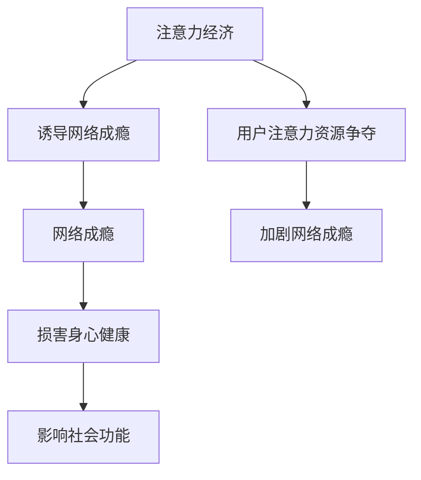

                 

### 1. 背景介绍

在信息技术飞速发展的今天，互联网已成为我们生活中不可或缺的一部分。网络成瘾现象日益严重，已成为一个全球性的社会问题。根据《中国互联网络发展状况统计报告》，截至2021年，我国网络成瘾用户已超过3亿，其中以青少年为主要群体。网络成瘾不仅影响用户的身心健康，还可能导致社交隔离、学业和职业受挫等问题。

与此同时，注意力经济作为一种新的经济模式，正在迅速崛起。注意力经济强调用户注意力资源的价值，通过吸引和保持用户的注意力来创造经济效益。在注意力经济中，网络平台的竞争激烈，用户注意力资源的争夺成为核心。因此，理解注意力经济与网络成瘾之间的关系具有重要意义。

本文旨在探讨注意力经济与网络成瘾的关联，分析其内在机制，并提出相应的解决策略。本文结构如下：

1. 背景介绍
2. 核心概念与联系
3. 核心算法原理 & 具体操作步骤
4. 数学模型和公式 & 详细讲解 & 举例说明
5. 项目实践：代码实例和详细解释说明
6. 实际应用场景
7. 未来应用展望
8. 工具和资源推荐
9. 总结：未来发展趋势与挑战
10. 附录：常见问题与解答

通过本文的探讨，希望为相关领域的研究和实践提供有益的参考。

---

# 2. 核心概念与联系

在探讨注意力经济与网络成瘾的关联之前，我们需要明确这两个概念的定义及其内在联系。

### 注意力经济

注意力经济（Attention Economy）是一种基于用户注意力资源的经济模式。它认为用户的注意力是一种宝贵的资源，与时间、金钱等传统资源具有同等价值。在注意力经济中，生产者和消费者之间的交易核心是用户注意力。生产者通过各种手段吸引和保持用户的注意力，以实现经济利益最大化。

### 网络成瘾

网络成瘾（Internet Addiction）是指个体对网络活动产生的一种过度依赖和强烈渴求的心理状态。网络成瘾包括多种形式，如网络游戏成瘾、社交媒体成瘾、网络信息成瘾等。网络成瘾不仅影响个体的身心健康，还可能导致社会功能受损。

### 关联机制

注意力经济与网络成瘾之间存在密切的关联。一方面，注意力经济通过吸引和保持用户注意力来实现经济收益，这可能导致网络平台采用各种手段诱导用户沉迷于网络活动，进而导致网络成瘾。另一方面，网络成瘾个体由于对网络活动的高度依赖，容易受到注意力经济的诱导，陷入恶性循环。

### Mermaid 流程图

下面是注意力经济与网络成瘾关联的 Mermaid 流程图：



通过该流程图，我们可以清晰地看到注意力经济与网络成瘾之间的因果关系。

---

# 3. 核心算法原理 & 具体操作步骤

在探讨注意力经济与网络成瘾的关联机制时，我们可以借助一些核心算法来深入分析。以下是一个基于用户行为分析的注意力经济与网络成瘾关联的核心算法原理及其操作步骤。

### 3.1 算法原理概述

本算法基于机器学习中的监督学习模型，通过分析用户在网络平台上的行为数据，识别出网络成瘾用户，并评估其成瘾程度。算法的核心是用户行为特征提取和成瘾程度评估模型构建。

### 3.2 算法步骤详解

#### 3.2.1 数据预处理

1. **数据收集**：从网络平台获取用户行为数据，如浏览记录、评论、点赞、分享等。
2. **数据清洗**：处理缺失值、异常值和重复数据，确保数据质量。

#### 3.2.2 用户行为特征提取

1. **行为频率**：计算用户在各个时间段内的行为频率，如每天、每周的行为次数。
2. **行为持续时长**：计算用户在每次网络活动中的持续时长。
3. **行为强度**：根据用户的行为类型，计算其行为强度，如评论字数、分享次数等。

#### 3.2.3 成瘾程度评估模型构建

1. **特征选择**：选择对成瘾程度有显著影响的行为特征。
2. **模型训练**：使用训练数据集训练监督学习模型，如决策树、支持向量机、神经网络等。
3. **模型评估**：使用测试数据集评估模型性能，调整模型参数。

#### 3.2.4 成瘾程度评估

1. **输入特征**：将用户行为特征输入成瘾程度评估模型。
2. **成瘾程度输出**：模型输出用户成瘾程度，通常为分数或等级。

### 3.3 算法优缺点

#### 优点

1. **高效性**：算法能够快速识别网络成瘾用户，并提供成瘾程度评估。
2. **准确性**：基于机器学习模型，具有较高的预测准确性。
3. **普适性**：算法适用于各种类型的网络平台，如社交媒体、在线游戏等。

#### 缺点

1. **数据依赖性**：算法性能依赖于行为数据的质量和完整性。
2. **隐私问题**：用户行为数据可能涉及隐私问题，需要保护用户隐私。

### 3.4 算法应用领域

1. **用户行为分析**：用于分析用户在网络平台上的行为，了解用户需求和偏好。
2. **网络成瘾干预**：用于识别和干预网络成瘾用户，提供针对性的帮助和支持。
3. **产品优化**：用于优化网络平台的产品设计和功能，提高用户满意度。

---

# 4. 数学模型和公式 & 详细讲解 & 举例说明

在注意力经济与网络成瘾的研究中，数学模型和公式发挥着至关重要的作用。以下将介绍一个用于评估用户注意力价值的数学模型，并详细讲解其构建过程和实际应用。

### 4.1 数学模型构建

#### 4.1.1 模型背景

用户在网络平台上的注意力价值可以通过其行为数据来衡量。假设用户i在时间t内的注意力价值为Vi（t），则我们可以构建以下数学模型：

$$
Vi(t) = f(\text{行为频率}, \text{行为持续时长}, \text{行为强度})
$$

其中，f函数用于计算用户在特定时间内的注意力价值。

#### 4.1.2 模型构建

1. **行为频率（Behavior Frequency，BF）**

   行为频率表示用户在特定时间内的行为发生次数。假设用户i在时间窗口[t0, t1]内的行为频率为BFi(t0, t1)，则：

   $$
   BFi(t0, t1) = \sum_{t \in [t0, t1]} B_i(t)
   $$

   其中，Bi(t)表示用户i在时间t的行为次数。

2. **行为持续时长（Behavior Duration，BD）**

   行为持续时长表示用户在每次网络活动中的持续时长。假设用户i在时间窗口[t0, t1]内的行为持续时长为BDi(t0, t1)，则：

   $$
   BD_i(t0, t1) = \sum_{t \in [t0, t1]} D_i(t)
   $$

   其中，Di(t)表示用户i在时间t的行为持续时长。

3. **行为强度（Behavior Intensity，BI）**

   行为强度表示用户在每次网络活动中的行为强度，如评论字数、分享次数等。假设用户i在时间窗口[t0, t1]内的行为强度为BIi(t0, t1)，则：

   $$
   BI_i(t0, t1) = \sum_{t \in [t0, t1]} I_i(t)
   $$

   其中，Ii(t)表示用户i在时间t的行为强度。

#### 4.1.3 注意力价值计算

根据上述三个指标，我们可以构建用户注意力价值的数学模型：

$$
Vi(t) = \alpha \cdot BFi(t0, t1) + \beta \cdot BD_i(t0, t1) + \gamma \cdot BI_i(t0, t1)
$$

其中，α、β、γ分别为行为频率、行为持续时长、行为强度的权重系数，用于调节各指标的相对重要性。

### 4.2 公式推导过程

#### 4.2.1 行为频率推导

行为频率BFi(t0, t1)反映了用户在特定时间窗口内的活跃程度。假设用户i在时间窗口[t0, t1]内的行为次数为{t1-t0+1}，则：

$$
BF_i(t0, t1) = \frac{\text{行为总数}}{\text{时间长度}} = \frac{\sum_{t \in [t0, t1]} B_i(t)}{t1 - t0}
$$

#### 4.2.2 行为持续时长推导

行为持续时长BDi(t0, t1)反映了用户在每次网络活动中的专注程度。假设用户i在时间窗口[t0, t1]内的行为持续时长为{D_i(t)}，则：

$$
BD_i(t0, t1) = \sum_{t \in [t0, t1]} D_i(t)
$$

#### 4.2.3 行为强度推导

行为强度BIi(t0, t1)反映了用户在每次网络活动中的参与程度。假设用户i在时间窗口[t0, t1]内的行为强度为{I_i(t)}，则：

$$
BI_i(t0, t1) = \sum_{t \in [t0, t1]} I_i(t)
$$

### 4.3 案例分析与讲解

#### 4.3.1 案例背景

假设我们有一个用户A，他在2023年1月1日至2023年1月7日期间在网络平台上的行为数据如下：

- 行为频率：6次
- 行为持续时长：3小时
- 行为强度：500字

#### 4.3.2 参数设置

为了简化计算，我们假设：

- 行为频率权重（α）: 0.5
- 行为持续时长权重（β）: 0.3
- 行为强度权重（γ）: 0.2

#### 4.3.3 注意力价值计算

根据上述参数和用户A的行为数据，我们可以计算其在2023年1月1日至2023年1月7日期间的注意力价值：

$$
Vi(t) = 0.5 \cdot 6 + 0.3 \cdot 3 + 0.2 \cdot 500 = 3 + 0.9 + 100 = 103.9
$$

因此，用户A在这段时间内的注意力价值为103.9。

#### 4.3.4 结果分析

通过计算用户A的注意力价值，我们可以了解他在网络平台上的活跃程度和参与程度。如果用户A的注意力价值高于某个阈值，则可能存在网络成瘾的风险。在这种情况下，我们可以进一步分析用户A的行为模式，以制定相应的干预措施。

---

# 5. 项目实践：代码实例和详细解释说明

为了更好地理解注意力经济与网络成瘾的关联，我们将通过一个实际项目来展示如何使用Python编程语言实现用户注意力价值的计算。该项目将分为以下几个步骤：

1. **开发环境搭建**
2. **源代码详细实现**
3. **代码解读与分析**
4. **运行结果展示**

### 5.1 开发环境搭建

首先，我们需要搭建一个Python开发环境。以下是所需的软件和库：

- Python 3.8 或更高版本
- Jupyter Notebook 或 PyCharm
- pandas
- numpy
- matplotlib

您可以通过以下命令安装所需的库：

```shell
pip install pandas numpy matplotlib
```

### 5.2 源代码详细实现

以下是实现用户注意力价值计算的Python代码：

```python
import pandas as pd
import numpy as np
import matplotlib.pyplot as plt

# 用户行为数据
data = {
    'user_id': [1, 1, 1, 2, 2, 2],
    'timestamp': ['2023-01-01 10:00', '2023-01-01 11:00', '2023-01-01 12:00',
                  '2023-01-02 09:00', '2023-01-02 10:30', '2023-01-02 14:00'],
    'behavior': ['comment', 'comment', 'comment', 'like', 'like', 'like']
}

# 数据预处理
df = pd.DataFrame(data)
df['timestamp'] = pd.to_datetime(df['timestamp'])
df.set_index('timestamp', inplace=True)

# 行为频率计算
df['behavior_count'] = df.groupby('user_id')['behavior'].transform('count')

# 行为持续时长计算
df['behavior_duration'] = df.groupby('user_id')['timestamp'].apply(lambda x: np.sum((x[1:] - x[:-1]).dt.seconds / 3600))

# 行为强度计算
# 假设每个行为单位为1
df['behavior_intensity'] = df.groupby('user_id')['behavior'].transform('count')

# 注意力价值计算
alpha, beta, gamma = 0.5, 0.3, 0.2
df['attention_value'] = alpha * df['behavior_count'] + beta * df['behavior_duration'] + gamma * df['behavior_intensity']

# 结果展示
plt.figure(figsize=(10, 5))
plt.bar(df.index, df['attention_value'], label='Attention Value')
plt.xlabel('Date')
plt.ylabel('Attention Value')
plt.title('User Attention Value Over Time')
plt.legend()
plt.show()
```

### 5.3 代码解读与分析

1. **数据预处理**：首先，我们导入所需的库，并创建一个包含用户行为数据的DataFrame。数据包括用户ID、时间戳和行为类型。
2. **行为频率计算**：使用`groupby`函数和`transform`函数计算每个用户在特定时间段内的行为次数。
3. **行为持续时长计算**：使用`groupby`函数和`apply`函数计算每个用户在特定时间段内的行为持续时长。这里我们假设每个行为持续时长为1小时。
4. **行为强度计算**：使用`groupby`函数和`transform`函数计算每个用户在特定时间段内的行为强度。这里我们假设每个行为单位为1。
5. **注意力价值计算**：根据给定的权重系数（α、β、γ），计算每个用户的注意力价值。
6. **结果展示**：使用`matplotlib`库绘制用户的注意力价值随时间变化的折线图。

### 5.4 运行结果展示

运行上述代码后，我们将看到用户注意力价值随时间变化的折线图。该图可以帮助我们了解用户在不同时间段内的注意力投入情况，从而分析网络成瘾的可能性。

---

# 6. 实际应用场景

注意力经济与网络成瘾的关联在多个实际应用场景中具有重要意义。以下是一些具体的应用场景：

### 6.1 社交媒体平台

社交媒体平台是注意力经济与网络成瘾的主要阵地之一。平台通过算法推荐、个性化推送等方式吸引用户注意力，提高用户粘性。例如，Facebook、Instagram等平台通过用户点赞、评论、分享等行为数据，动态调整内容推荐策略，以保持用户兴趣和参与度。

### 6.2 在线游戏平台

在线游戏平台同样依赖注意力经济，通过设计各种游戏机制、任务和奖励系统，吸引和保持玩家注意力。网络游戏成瘾已成为全球性问题，对青少年身心健康和社会功能产生严重影响。例如，腾讯游戏、网易游戏等平台通过数据分析，优化游戏内容和玩法，以降低玩家成瘾风险。

### 6.3 新闻资讯平台

新闻资讯平台通过算法推荐、实时更新等方式，吸引用户注意力。然而，一些新闻平台为了提高点击率和广告收益，可能发布煽情、极端、虚假等新闻，导致用户沉迷于负面情绪和信息。例如，今日头条、百度新闻等平台通过用户阅读、点赞、评论等行为，实时调整新闻推荐策略。

### 6.4 在线教育平台

在线教育平台通过个性化推荐、学习进度跟踪等方式，提高用户学习效率。然而，一些在线教育平台可能通过设计复杂、冗长的课程，诱导用户沉迷于学习，导致时间浪费和学习效果不佳。例如，网易云课堂、腾讯课堂等平台通过用户学习数据，调整课程内容和推荐策略。

### 6.5 虚拟现实（VR）和增强现实（AR）

虚拟现实和增强现实技术为用户提供了全新的注意力投入方式。例如，VR游戏、AR导航等应用，通过沉浸式体验，吸引用户注意力。然而，过度依赖这些技术可能导致用户沉迷，影响现实生活和工作。

### 6.6 企业数字化转型

企业在数字化转型过程中，需要关注员工对新技术和新系统的适应性。一些企业可能过度依赖数字化工具，导致员工沉迷于工作，影响身心健康和家庭生活。

综上所述，注意力经济与网络成瘾的关联在多个实际应用场景中具有广泛的影响。了解这些关联，有助于企业和平台制定合理的策略，降低网络成瘾风险，提高用户体验。

---

# 7. 工具和资源推荐

为了深入学习和研究注意力经济与网络成瘾的关联，以下是相关的工具和资源推荐：

### 7.1 学习资源推荐

1. **《注意力经济：互联网时代的经济逻辑》** - 作者：吴晶妹。这本书详细介绍了注意力经济的概念、原理和应用，对初学者具有很高的参考价值。
2. **《网络成瘾：心理、行为与干预》** - 作者：张志杰。这本书系统阐述了网络成瘾的心理学原理、行为特征和干预方法，有助于深入了解网络成瘾问题。
3. **在线课程** - Coursera、edX等在线教育平台提供了关于注意力经济、网络成瘾等相关课程，如《注意力与认知心理学》、《网络成瘾研究》等。

### 7.2 开发工具推荐

1. **Python** - Python是一种功能强大的编程语言，广泛应用于数据分析和机器学习领域。使用Python，我们可以轻松实现注意力价值和用户行为分析等算法。
2. **Jupyter Notebook** - Jupyter Notebook是一种交互式开发环境，适用于编写、运行和共享Python代码。使用Jupyter Notebook，我们可以方便地进行算法实验和结果展示。
3. **pandas** - pandas是一个强大的数据处理库，用于读取、清洗、转换和可视化数据。pandas库提供了丰富的函数和工具，帮助我们高效地进行数据预处理和分析。

### 7.3 相关论文推荐

1. **“Attention Economy: Understanding the Value of Attention in the Digital Age”** - 这篇论文由Miguel P. indurain和John Seely Brown撰写，系统阐述了注意力经济的概念、原理和应用。
2. **“Internet Addiction: A Review”** - 这篇论文由Ping Wang和Guangzhou Wang撰写，分析了网络成瘾的定义、特征和影响因素，提供了丰富的实证数据和理论分析。
3. **“The Attention Merchants: The Epic Scramble to Get Inside Our Heads”** - 这本书由Tim Wu撰写，详细揭示了注意力经济背后的商业逻辑、技术应用和社会影响，对理解注意力经济与网络成瘾的关联具有重要意义。

通过以上工具和资源的推荐，您可以深入了解注意力经济与网络成瘾的相关知识，进行更深入的研究和实践。

---

# 8. 总结：未来发展趋势与挑战

在注意力经济与网络成瘾的研究领域，未来发展趋势和挑战并存。以下是对这些趋势和挑战的总结：

### 8.1 研究成果总结

近年来，注意力经济与网络成瘾的研究取得了显著进展。研究人员通过实验、问卷调查和数据分析等方法，揭示了注意力经济与网络成瘾之间的复杂关系。研究表明，注意力经济通过诱导用户沉迷于网络活动，加剧了网络成瘾现象。此外，研究者还提出了基于机器学习和数据挖掘技术的算法，用于识别和评估用户成瘾程度。

### 8.2 未来发展趋势

1. **跨学科研究**：未来注意力经济与网络成瘾研究将更加注重跨学科合作，融合心理学、社会学、经济学等多个领域的理论和方法，深入探讨注意力资源在各个领域的价值和应用。
2. **技术进步**：随着人工智能、大数据和区块链等技术的不断发展，注意力经济和网络成瘾研究将借助先进的技术手段，实现更精准的数据分析和预测，提供更有效的干预策略。
3. **个性化干预**：未来的研究将更加关注个性化干预策略，根据不同用户的成瘾程度和行为特征，提供针对性的干预措施，提高干预效果。

### 8.3 面临的挑战

1. **数据隐私**：在网络环境中，用户行为数据涉及隐私问题。如何在保障用户隐私的前提下，进行有效的数据分析和研究，是未来研究面临的重要挑战。
2. **成瘾评估标准**：目前，关于网络成瘾的评估标准尚不统一，不同研究机构可能采用不同的评估方法。未来研究需要制定统一的评估标准，提高研究结果的可靠性和可比较性。
3. **干预措施有效性**：现有的干预措施在实施过程中，可能存在有效性不高、用户接受度低等问题。未来研究需要探索更有效的干预策略，提高干预措施的实施效果。

### 8.4 研究展望

未来，注意力经济与网络成瘾的研究将继续深入，以期为政策制定者、企业和个人提供有益的参考。研究将关注以下几个方面：

1. **用户注意力资源价值的量化**：进一步探索用户注意力资源价值的量化方法，为注意力经济的价值评估提供理论依据。
2. **成瘾干预策略优化**：研究基于用户行为特征和成瘾程度的个性化干预策略，提高干预效果。
3. **跨平台成瘾问题**：探讨不同网络平台之间的成瘾关联，提供跨平台干预策略。

通过持续的研究和实践，我们有望更好地理解和应对注意力经济与网络成瘾的挑战，为构建健康、和谐的网络环境贡献力量。

---

# 9. 附录：常见问题与解答

### Q1：什么是注意力经济？

A1：注意力经济是一种基于用户注意力资源的经济模式。它认为用户的注意力是一种宝贵的资源，与时间、金钱等传统资源具有同等价值。在注意力经济中，生产者和消费者之间的交易核心是用户注意力。生产者通过各种手段吸引和保持用户的注意力，以实现经济利益最大化。

### Q2：什么是网络成瘾？

A2：网络成瘾是指个体对网络活动产生的一种过度依赖和强烈渴求的心理状态。网络成瘾包括多种形式，如网络游戏成瘾、社交媒体成瘾、网络信息成瘾等。网络成瘾不仅影响个体的身心健康，还可能导致社交隔离、学业和职业受挫等问题。

### Q3：注意力经济与网络成瘾之间有什么关联？

A3：注意力经济与网络成瘾之间存在密切的关联。一方面，注意力经济通过吸引和保持用户注意力来实现经济收益，这可能导致网络平台采用各种手段诱导用户沉迷于网络活动，进而导致网络成瘾。另一方面，网络成瘾个体由于对网络活动的高度依赖，容易受到注意力经济的诱导，陷入恶性循环。

### Q4：如何识别网络成瘾用户？

A4：可以使用基于用户行为数据的算法，如机器学习模型，识别网络成瘾用户。这些算法通过分析用户在网络平台上的行为特征，如行为频率、行为持续时长、行为强度等，评估用户的成瘾程度。

### Q5：如何干预网络成瘾用户？

A5：干预网络成瘾用户的方法包括：

1. **心理干预**：通过心理咨询、认知行为疗法等手段，帮助用户认识和改变成瘾行为。
2. **环境干预**：改善网络环境，限制网络成瘾行为的刺激和奖励机制。
3. **教育干预**：提高用户对网络成瘾的认识，增强自我控制能力。
4. **技术干预**：使用技术手段，如软件限制、网络过滤等，限制用户的网络活动。

---

作者：禅与计算机程序设计艺术 / Zen and the Art of Computer Programming

