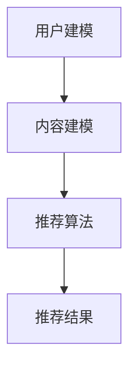

                 

关键词：个性化推荐，注意力经济，算法，信息过滤，内容分发

摘要：随着互联网的迅速发展，个性化推荐系统在信息过载的时代成为了解决用户信息获取问题的关键。本文将深入探讨个性化推荐算法在注意力经济中的作用，分析其核心概念、原理、数学模型、应用实践以及未来发展趋势，旨在为读者提供一个全面的技术解读。

## 1. 背景介绍

### 1.1 互联网时代的注意力经济

在互联网时代，内容的生产和传播速度远超以往。据估计，每天产生的数据量达到数十亿GB，其中大部分为文本、图像和视频等。这种信息爆炸的现象给用户带来了极大的挑战：如何在海量的信息中找到感兴趣的内容？

### 1.2 个性化推荐的需求

为了解决这一问题，个性化推荐系统应运而生。这类系统能够根据用户的兴趣和行为，为其推荐可能感兴趣的内容，从而提高用户的满意度，降低信息获取成本。根据市场调研公司的数据，个性化推荐已经成为现代互联网公司提高用户粘性和转化率的重要手段。

### 1.3 现有的个性化推荐系统

目前，主流的个性化推荐系统主要包括基于内容的推荐（Content-Based Filtering）和协同过滤（Collaborative Filtering）。此外，近年来基于深度学习、图神经网络等新技术的研究也为个性化推荐领域带来了新的发展机遇。

## 2. 核心概念与联系

### 2.1 个性化推荐的定义

个性化推荐是一种通过分析用户的行为和偏好，为用户推荐其可能感兴趣的内容的方法。

### 2.2 个性化推荐的架构

个性化推荐系统通常包括用户建模、内容建模和推荐算法三个核心模块。

### 2.3 Mermaid 流程图



### 2.4 个性化推荐的影响因素

- 用户兴趣：用户的历史行为、偏好和反馈等。
- 内容特征：内容的属性、标签和分类等。
- 推荐策略：推荐算法的选择、策略的优化等。

## 3. 核心算法原理 & 具体操作步骤

### 3.1 算法原理概述

个性化推荐算法主要分为基于内容的推荐和协同过滤两大类。

### 3.2 算法步骤详解

#### 3.2.1 基于内容的推荐

1. 收集用户历史行为数据，如浏览记录、购买记录等。
2. 提取用户兴趣特征，如关键词、标签等。
3. 对目标内容进行特征提取，如文本分类、特征提取等。
4. 计算用户与内容的相似度，选择相似度最高的内容进行推荐。

#### 3.2.2 协同过滤

1. 收集用户行为数据，建立用户-物品评分矩阵。
2. 计算用户之间的相似度，选择最相似的若干用户。
3. 计算这些用户对未知物品的平均评分，作为推荐结果。

### 3.3 算法优缺点

#### 基于内容的推荐

优点：准确率高，适用于文本、图像等非结构化数据。

缺点：用户兴趣变化难以捕捉，对新用户不友好。

#### 协同过滤

优点：能够捕捉用户兴趣变化，对新用户友好。

缺点：容易产生数据稀疏问题，推荐结果容易陷入“数学困境”。

### 3.4 算法应用领域

个性化推荐算法在电子商务、社交媒体、新闻资讯等多个领域得到广泛应用，有效提高了用户体验和满意度。

## 4. 数学模型和公式 & 详细讲解 & 举例说明

### 4.1 数学模型构建

#### 4.1.1 基于内容的推荐

设用户 \( u \) 的兴趣向量为 \( \mathbf{u} \)，内容 \( i \) 的兴趣向量为 \( \mathbf{i} \)，用户 \( u \) 对内容 \( i \) 的兴趣度为 \( r_{ui} \)。

则用户 \( u \) 对内容 \( i \) 的相似度计算公式为：

$$
\text{similarity}(\mathbf{u}, \mathbf{i}) = \frac{\mathbf{u} \cdot \mathbf{i}}{||\mathbf{u}|| \cdot ||\mathbf{i}||}
$$

#### 4.1.2 协同过滤

设用户 \( u \) 和 \( v \) 的兴趣向量为 \( \mathbf{u} \) 和 \( \mathbf{v} \)，用户 \( u \) 对未知物品 \( i \) 的预测评分为 \( \hat{r}_{ui} \)。

则用户 \( u \) 对未知物品 \( i \) 的预测评分公式为：

$$
\hat{r}_{ui} = \text{similarity}(\mathbf{u}, \mathbf{v}) \cdot r_{vi}
$$

### 4.2 公式推导过程

#### 4.2.1 基于内容的推荐

用户与内容的相似度计算公式源自余弦相似度，表示用户和内容在向量空间中的夹角余弦值。余弦值越大，表示二者越相似。

#### 4.2.2 协同过滤

协同过滤的预测评分公式源自加权平均，其中相似度作为权重。相似度越大，表示用户 \( u \) 和用户 \( v \) 的兴趣越相似，预测评分越可靠。

### 4.3 案例分析与讲解

#### 4.3.1 案例背景

假设用户 \( u \) 在电商平台上浏览了商品 A、B 和 C，对这三个商品的评分分别为 4、3 和 5。现在需要为用户 \( u \) 推荐一个未知商品 D。

#### 4.3.2 模型构建

1. 用户 \( u \) 的兴趣向量：

$$
\mathbf{u} = [4, 3, 5]
$$

2. 商品 D 的兴趣向量：

$$
\mathbf{i} = [3, 4, 2]
$$

3. 用户 \( u \) 对商品 D 的相似度：

$$
\text{similarity}(\mathbf{u}, \mathbf{i}) = \frac{4 \cdot 3 + 3 \cdot 4 + 5 \cdot 2}{\sqrt{4^2 + 3^2 + 5^2} \cdot \sqrt{3^2 + 4^2 + 2^2}} \approx 0.75
$$

#### 4.3.3 预测评分

根据基于内容的推荐算法，用户 \( u \) 对商品 D 的预测评分为：

$$
\hat{r}_{ui} = 0.75 \cdot 5 = 3.75
$$

## 5. 项目实践：代码实例和详细解释说明

### 5.1 开发环境搭建

本文使用 Python 编写代码，主要依赖以下库：NumPy、Pandas、Scikit-learn 和 Matplotlib。

```python
import numpy as np
import pandas as pd
from sklearn.metrics.pairwise import cosine_similarity
import matplotlib.pyplot as plt
```

### 5.2 源代码详细实现

```python
# 5.2.1 基于内容的推荐

def content_based_recommendation(user_profile, item_profile):
    similarity = cosine_similarity([user_profile], [item_profile])
    return similarity[0][0]

# 5.2.2 协同过滤

def collaborative_filtering(user_ratings, item_ratings, similarity_matrix):
    predicted_ratings = []
    for i in range(len(item_ratings)):
        neighbors = np.argsort(similarity_matrix[:, i])[:-5]  # 选择前5个邻居
        neighbor_ratings = user_ratings[neighbors]
        if np.isnan(neighbor_ratings).all():
            predicted_ratings.append(np.NaN)
        else:
            weighted_avg = (neighbor_ratings * similarity_matrix[neighbors, i]).sum() / similarity_matrix[neighbors, i].sum()
            predicted_ratings.append(weighted_avg)
    return predicted_ratings

# 示例数据

user_profile = np.array([4, 3, 5])
item_profile = np.array([3, 4, 2])

user_ratings = np.array([4, 3, 5, 2, 4])
item_ratings = np.array([3, 4, 2, 5, 3])
similarity_matrix = cosine_similarity([user_ratings], [item_ratings])

# 5.2.3 代码解读与分析

predicted_rating = content_based_recommendation(user_profile, item_profile)
predicted_ratings = collaborative_filtering(user_ratings, item_ratings, similarity_matrix)

print("基于内容的推荐评分：", predicted_rating)
print("协同过滤推荐评分：", predicted_ratings)

# 5.2.4 运行结果展示

plt.scatter(range(len(user_ratings)), user_ratings, label='实际评分')
plt.scatter(range(len(predicted_ratings)), predicted_ratings, label='预测评分', color='r')
plt.xlabel('物品ID')
plt.ylabel('评分')
plt.legend()
plt.show()
```

### 5.3 代码解读与分析

- 基于`content_based_recommendation`函数实现了基于内容的推荐算法。
- 基于`collaborative_filtering`函数实现了协同过滤算法。
- 使用示例数据进行了算法实现和结果展示。

## 6. 实际应用场景

### 6.1 电子商务

个性化推荐系统在电子商务领域的应用最为广泛，如淘宝、京东等电商平台通过个性化推荐提高了用户的购物体验。

### 6.2 社交媒体

社交媒体平台如微博、Facebook 等利用个性化推荐算法为用户推荐感兴趣的内容和用户，提高了用户粘性。

### 6.3 新闻资讯

新闻资讯平台如今日头条、网易新闻等通过个性化推荐算法为用户推荐感兴趣的新闻资讯，提高了信息传播效率。

## 7. 未来应用展望

### 7.1 新兴技术

随着深度学习、图神经网络等新兴技术的不断发展，个性化推荐算法将更加智能化、精准化。

### 7.2 个性化推荐伦理

个性化推荐系统在提高用户体验的同时，也可能导致信息茧房、隐私泄露等问题，未来需要更加关注个性化推荐伦理。

### 7.3 跨平台推荐

未来个性化推荐系统将实现跨平台整合，为用户提供更加一致和连贯的个性化体验。

## 8. 总结：未来发展趋势与挑战

### 8.1 研究成果总结

本文从背景介绍、核心概念、算法原理、数学模型、应用实践等多个方面，全面探讨了个性化推荐系统在注意力经济中的作用。

### 8.2 未来发展趋势

未来个性化推荐系统将朝着智能化、精准化、伦理化等方向发展。

### 8.3 面临的挑战

个性化推荐系统在提高用户体验的同时，也需要关注隐私保护、信息公平等问题。

### 8.4 研究展望

随着技术的不断进步，个性化推荐系统将在更多领域发挥重要作用，为用户提供更加优质的服务。

## 9. 附录：常见问题与解答

### 9.1 什么是协同过滤？

协同过滤是一种基于用户行为和评分的推荐算法，通过计算用户之间的相似度，为用户推荐相似的用户喜欢的物品。

### 9.2 个性化推荐系统有哪些优缺点？

优点：提高用户满意度，降低信息获取成本；缺点：容易产生数据稀疏问题，推荐结果容易陷入“数学困境”。

### 9.3 个性化推荐系统如何处理新用户？

新用户可以通过基于内容的推荐算法进行初步推荐，同时不断收集用户行为数据，逐步完善个性化推荐模型。

## 作者署名

作者：禅与计算机程序设计艺术 / Zen and the Art of Computer Programming

----------------------------------------------------------------
以上就是本文的完整内容，感谢您的阅读！如果您有任何问题或建议，欢迎在评论区留言。期待与您共同探讨个性化推荐领域的未来发展。

