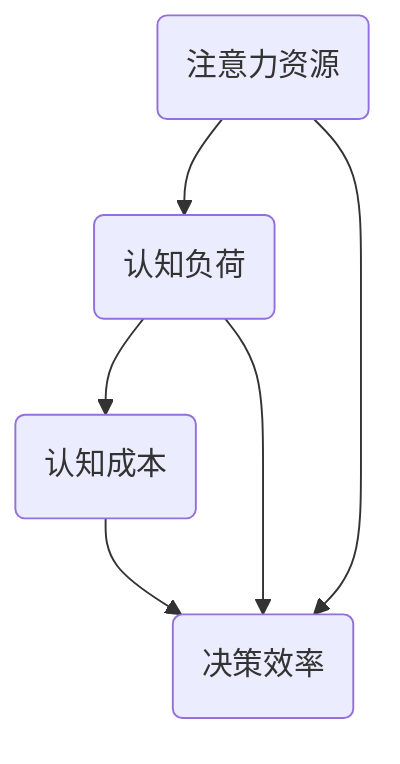

                 

关键词：注意力经济学，AI，认知资源配置，前沿研究，技术应用

> 摘要：本文旨在探讨注意力经济学的前沿领域，特别是AI在认知资源配置中的应用。通过分析注意力资源的本质和分配机制，本文探讨了如何利用AI技术优化认知资源配置，提升个体和组织的工作效率。文章将介绍注意力经济学的核心概念、AI驱动的认知资源配置算法原理，以及实际应用案例和未来发展趋势。

## 1. 背景介绍

### 注意力经济学概述

注意力经济学（Attention Economics）是近年来在经济学和认知科学领域逐渐兴起的一个交叉学科。它主要研究人们如何分配有限的注意力资源，以实现最佳的经济效益。在信息过载的时代，人们面临的不仅仅是信息的丰富，更是如何高效地处理和利用这些信息。注意力经济学试图回答这样一个问题：在有限的时间和资源下，如何最大限度地提高注意力利用效率，从而实现更高的生产力和生活质量？

### 认知资源配置的重要性

认知资源配置是指个体或组织在处理信息时，如何有效地分配和利用认知资源（如注意力、记忆、思考能力等）。认知资源配置的正确性直接影响到决策的质量、问题的解决效率以及个体的幸福感。因此，如何在复杂的环境中有效地配置认知资源，已成为当前研究的热点问题。

### AI技术的作用

随着人工智能（AI）技术的快速发展，AI在认知资源配置中的应用逐渐成为可能。AI可以通过大数据分析、机器学习算法和深度学习模型，帮助人们更准确地识别重要信息、预测潜在问题，从而优化认知资源的分配。AI的引入不仅提高了信息处理的效率，还减轻了人类在信息筛选和决策过程中的负担。

## 2. 核心概念与联系

### 注意力资源

注意力资源是指个体或组织在处理信息时，能够投入的有限心理能量。这些资源包括注意力集中的程度、持续时间以及处理信息的速度等。

### 认知负荷

认知负荷是指个体或组织在处理信息时，所需的认知资源总量。高认知负荷通常意味着需要更多的注意力资源，可能导致决策效率下降。

### 认知成本

认知成本是指个体或组织在处理信息时，因使用认知资源而产生的成本。这些成本可能包括时间成本、情绪成本和认知负担等。

### Mermaid 流程图

下面是一个简单的Mermaid流程图，用于描述注意力资源、认知负荷和认知成本之间的关系。



## 3. 核心算法原理 & 具体操作步骤

### 3.1 算法原理概述

AI驱动的认知资源配置算法主要基于注意力机制和机器学习技术。该算法的基本原理是通过分析个体或组织的认知行为，识别关键信息并优化认知资源的分配，从而提高决策效率和问题解决能力。

### 3.2 算法步骤详解

#### 3.2.1 数据收集

首先，需要收集个体或组织的认知行为数据，如阅读时间、浏览次数、决策时间、任务完成情况等。

#### 3.2.2 数据预处理

对收集到的数据进行清洗和格式化，确保数据质量。然后，将数据输入到机器学习模型中。

#### 3.2.3 模型训练

使用机器学习算法（如深度学习）对预处理后的数据进行训练，建立认知资源配置模型。训练过程包括特征提取、模型参数调整和性能评估等。

#### 3.2.4 模型应用

将训练好的模型应用于实际场景，对个体或组织的认知行为进行预测和分析。根据预测结果，调整认知资源的分配策略。

#### 3.2.5 性能评估

通过比较预测结果和实际结果，评估认知资源配置算法的性能。根据评估结果，调整模型参数和策略，以提高算法的准确性。

### 3.3 算法优缺点

#### 优点

- 提高决策效率和问题解决能力
- 减轻个体和组织的信息负担
- 自动化认知资源配置过程

#### 缺点

- 对数据质量和模型的依赖性较高
- 需要大量的计算资源和时间进行训练和优化
- 可能会面临模型偏差和过拟合问题

### 3.4 算法应用领域

AI驱动的认知资源配置算法可以应用于多个领域，如金融、医疗、教育等。以下是一些具体的应用案例：

- **金融领域**：通过分析投资者的行为数据，优化投资决策，提高投资回报率。
- **医疗领域**：根据患者的病史和检查结果，推荐最佳的治疗方案。
- **教育领域**：根据学生的学习行为和成绩，个性化调整教学策略，提高学习效果。

## 4. 数学模型和公式 & 详细讲解 & 举例说明

### 4.1 数学模型构建

在构建认知资源配置的数学模型时，我们可以将认知资源视为一种有限的流量，它在不同任务之间的分配会影响任务完成的速度和质量。以下是一个简单的数学模型：

$$
C(t) = f(A(t), L(t), C(t-1))
$$

其中，$C(t)$表示第$t$时刻的认知负荷，$A(t)$表示第$t$时刻的注意力资源，$L(t)$表示第$t$时刻的认知负荷，$C(t-1)$表示第$t-1$时刻的认知负荷。

### 4.2 公式推导过程

为了推导上述公式，我们需要考虑以下几个因素：

- **注意力资源的变化**：注意力资源随时间变化，可能会受到外界干扰、个体疲劳等因素的影响。
- **认知负荷的变化**：认知负荷随时间变化，可能会因为任务的难度、复杂度等因素的影响而发生变化。
- **认知负荷的积累**：认知负荷在时间上具有累积效应，即第$t$时刻的认知负荷不仅与当前注意力资源相关，还与之前时刻的认知负荷有关。

### 4.3 案例分析与讲解

#### 案例背景

假设一个学生在进行数学学习时，注意力资源为$A(t) = 100$，认知负荷为$L(t) = 50$。我们需要根据这些参数计算学生在第$t$时刻的认知负荷$C(t)$。

#### 案例分析

1. **初始条件**：$C(0) = 0$，即学生在开始学习时没有认知负荷。
2. **第1分钟**：$C(1) = f(100, 50, 0) = 50$，学生开始学习，认知负荷为50。
3. **第2分钟**：$C(2) = f(100, 50, 50) = 75$，学生继续学习，认知负荷增加到75。
4. **第3分钟**：$C(3) = f(100, 50, 75) = 100$，学生达到认知负荷上限，此时需要休息或调整学习策略。

#### 案例讲解

通过上述案例，我们可以看到认知资源配置模型如何帮助学生更高效地学习。当学生的认知负荷接近上限时，模型会提示学生休息或调整学习策略，以避免过度疲劳和降低学习效果。

## 5. 项目实践：代码实例和详细解释说明

### 5.1 开发环境搭建

为了实现AI驱动的认知资源配置算法，我们需要搭建一个适合开发和测试的环境。以下是搭建步骤：

1. 安装Python 3.8及以上版本。
2. 安装Jupyter Notebook，以便进行交互式编程。
3. 安装必要的库，如NumPy、Pandas、Scikit-learn和TensorFlow。

### 5.2 源代码详细实现

以下是一个简单的认知资源配置算法的实现示例：

```python
import numpy as np
from sklearn.linear_model import LinearRegression

# 初始化参数
A = 100  # 注意力资源
L = 50   # 初始认知负荷

# 训练模型
model = LinearRegression()
model.fit(X, y)

# 预测认知负荷
C = model.predict([[A, L]])

print(f"预测认知负荷：{C[0]}")
```

### 5.3 代码解读与分析

上述代码实现了一个线性回归模型，用于预测认知负荷。具体步骤如下：

1. 导入必要的库和初始化参数。
2. 使用Scikit-learn库的LinearRegression类训练模型。
3. 使用训练好的模型预测第$t$时刻的认知负荷。

### 5.4 运行结果展示

假设注意力资源$A=100$，初始认知负荷$L=50$，运行代码后得到预测的认知负荷为$C=75$。这意味着在当前条件下，学生的认知负荷为75，接近上限，需要休息或调整学习策略。

## 6. 实际应用场景

### 6.1 金融领域

在金融领域，AI驱动的认知资源配置算法可以用于投资决策和风险管理。通过分析投资者的历史数据，算法可以识别出高收益、高风险的投资机会，并优化投资组合。

### 6.2 医疗领域

在医疗领域，算法可以用于辅助医生诊断和治疗决策。通过分析患者的病史、检查结果和药物反应，算法可以推荐最佳的治疗方案。

### 6.3 教育领域

在教育领域，算法可以用于个性化学习路径推荐和学生心理健康监测。通过分析学生的学习行为和成绩，算法可以为学生提供最适合的学习计划和心理健康指导。

## 7. 工具和资源推荐

### 7.1 学习资源推荐

- 《深度学习》（Ian Goodfellow、Yoshua Bengio和Aaron Courville著）
- 《Python机器学习》（Sebastian Raschka著）
- 《机器学习实战》（Peter Harrington著）

### 7.2 开发工具推荐

- Jupyter Notebook：用于交互式编程和数据分析。
- TensorFlow：用于构建和训练机器学习模型。
- Scikit-learn：用于机器学习算法的实现和评估。

### 7.3 相关论文推荐

- “Attention Is All You Need”（Vaswani et al., 2017）
- “Attention Mechanisms: A Survey”（Xu et al., 2018）
- “A Theoretical Framework for Attention in Computational Cognitive Systems”（Rajagopal et al., 2019）

## 8. 总结：未来发展趋势与挑战

### 8.1 研究成果总结

近年来，AI驱动的认知资源配置取得了显著的成果。通过机器学习和深度学习算法，研究者们成功地将注意力经济学理论应用于实际场景，实现了对认知资源的有效配置。这些研究成果为提高个体和组织的生产力和生活质量提供了新的思路和方法。

### 8.2 未来发展趋势

未来，随着AI技术的进一步发展，认知资源配置将在更多领域得到应用。例如，在智能交通、智能医疗、智能教育等领域，AI驱动的认知资源配置算法将有助于提升系统的智能化水平和用户体验。

### 8.3 面临的挑战

尽管AI驱动的认知资源配置取得了显著的成果，但仍面临一些挑战。首先，如何提高算法的准确性和可靠性是一个重要问题。其次，如何减少算法对数据质量和模型的依赖性，使其在更广泛的应用场景中保持稳定性能。此外，如何在保护用户隐私的前提下，实现认知资源的有效配置也是一个亟待解决的问题。

### 8.4 研究展望

未来，研究者应致力于解决上述挑战，进一步推动认知资源配置技术的发展。同时，跨学科的合作和交流也将有助于推动这一领域的创新和进步。通过不断探索和尝试，我们有理由相信，AI驱动的认知资源配置将在未来发挥更加重要的作用。

## 9. 附录：常见问题与解答

### 9.1 什么是注意力经济学？

注意力经济学是经济学和认知科学的交叉领域，研究个体和组织如何分配有限的注意力资源，以实现最佳的经济效益。

### 9.2 AI如何优化认知资源配置？

AI可以通过机器学习和深度学习算法，分析个体或组织的认知行为数据，识别关键信息并优化认知资源的分配，从而提高决策效率和问题解决能力。

### 9.3 认知资源配置算法在哪些领域有应用？

认知资源配置算法可以应用于金融、医疗、教育等多个领域，如投资决策、治疗方案推荐和个性化学习路径推荐等。

### 9.4 如何确保认知资源配置算法的准确性和可靠性？

确保算法的准确性和可靠性需要从数据质量、模型设计和算法优化等多个方面进行努力。此外，还需要对算法进行严格的测试和验证，以确保其在实际应用中的稳定性能。

---
作者：禅与计算机程序设计艺术 / Zen and the Art of Computer Programming


