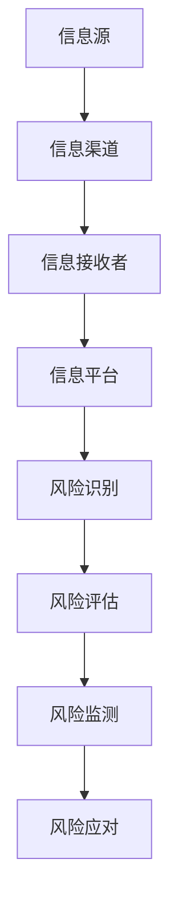

                 

关键词：注意力经济、企业风险管理、算法原理、数学模型、实际应用、未来展望

> 摘要：本文深入探讨了注意力经济对企业风险管理的重要影响。通过分析注意力经济的核心概念、原理和架构，并结合实际案例和数学模型，本文旨在为企业提供一种全新的风险管理思路和方法。文章不仅探讨了注意力经济在风险预测、决策制定和资源分配等方面的应用，还展望了其在未来的发展趋势和面临的挑战。

## 1. 背景介绍

### 注意力经济概述

注意力经济是指个体、组织和市场对注意力资源的竞争和分配过程。在数字时代，随着信息爆炸和流量经济的发展，注意力资源变得更加稀缺和宝贵。因此，如何有效地管理和利用注意力资源，成为企业和组织需要解决的重要问题。

### 企业风险管理背景

企业风险管理是指企业通过识别、评估、监测和应对各种潜在风险，以确保企业稳健运营和可持续发展。随着外部环境的不确定性和内部竞争的加剧，企业风险管理变得日益重要。传统的风险管理方法往往依赖于历史数据和统计模型，但在面对快速变化的市场环境时，这些方法可能无法提供及时和准确的风险预测。

### 注意力经济与企业风险管理的关系

注意力经济与企业风险管理之间存在紧密的联系。首先，注意力经济揭示了信息传播和决策制定的复杂性，这为企业风险管理者提供了新的视角。其次，注意力经济强调了对个体注意力的管理和引导，这为企业风险管理者提供了新的方法和工具。最后，注意力经济为企业风险管理者提供了一种基于数据和算法的预测和决策机制，有助于提高风险管理的效率和准确性。

## 2. 核心概念与联系

### 注意力经济的核心概念

注意力经济包括以下几个核心概念：

1. **注意力资源**：指个体和组织对信息的关注程度和投入的时间、精力和情感。
2. **注意力分配**：指个体和组织如何在不同信息和任务之间分配注意力资源。
3. **注意力市场**：指信息传播和注意力分配的市场机制，包括信息提供者、消费者和平台。
4. **注意力价值**：指注意力资源在市场中的交换和评估价值。

### 注意力经济的原理和架构

注意力经济的原理可以概括为以下几个方面：

1. **信息传播机制**：信息通过媒体和平台传播，个体在信息海洋中寻找感兴趣的内容。
2. **注意力分配机制**：个体根据兴趣、需求和动机对注意力资源进行分配，形成信息接收和处理的模式。
3. **激励机制**：通过奖励机制，鼓励个体和组织提供有价值的信息和服务，以吸引和保持注意力。

注意力经济的架构包括以下几个方面：

1. **信息源**：包括媒体、平台和个体，它们是信息传播的起点。
2. **信息渠道**：包括互联网、社交媒体、移动应用等，它们是信息传播的途径。
3. **信息接收者**：包括个体和组织，他们是信息消费的主体。
4. **信息平台**：包括搜索引擎、社交媒体平台、内容聚合平台等，它们是信息传播和交互的场所。

### 注意力经济与企业风险管理的关系

注意力经济对企业风险管理的影响主要体现在以下几个方面：

1. **风险识别**：通过分析注意力分配和行为模式，企业可以识别潜在的风险因素。
2. **风险评估**：基于注意力价值和信息传播的机制，企业可以评估不同风险的概率和影响。
3. **风险监测**：利用注意力经济的指标和算法，企业可以实时监测风险的变化和趋势。
4. **风险应对**：通过调整注意力分配策略和信息传播方式，企业可以采取有效的风险应对措施。

### 注意力经济的 Mermaid 流程图



## 3. 核心算法原理 & 具体操作步骤

### 3.1 算法原理概述

注意力经济在企业风险管理中的应用，主要依赖于以下几个核心算法：

1. **注意力分配算法**：用于分析个体和组织在风险信息上的注意力分配情况。
2. **风险预测算法**：基于注意力分配和行为模式，预测潜在的风险事件。
3. **风险决策算法**：利用预测结果，制定相应的风险应对策略。

### 3.2 算法步骤详解

1. **数据收集与预处理**：收集企业内外部的风险数据，包括财务数据、市场数据、风险事件等，并进行数据清洗和预处理。
2. **注意力分配分析**：通过机器学习和自然语言处理技术，分析个体和组织对风险信息的注意力分配，形成注意力分配矩阵。
3. **风险预测**：基于注意力分配矩阵，使用时间序列分析和回归分析等方法，预测未来一段时间内的风险事件。
4. **风险决策**：根据风险预测结果，结合企业战略目标和资源状况，制定相应的风险应对策略。

### 3.3 算法优缺点

**优点**：

1. **实时性**：基于实时数据，提供及时的风险预测和决策支持。
2. **准确性**：通过机器学习和数据分析，提高风险预测的准确性。
3. **灵活性**：根据不同企业和行业的特点，定制化风险应对策略。

**缺点**：

1. **数据依赖性**：需要大量高质量的数据支持，否则预测结果可能不准确。
2. **计算复杂性**：算法模型和计算过程相对复杂，需要较高的技术支持。

### 3.4 算法应用领域

注意力经济算法在企业风险管理中的应用领域广泛，包括：

1. **金融风险监控**：预测金融市场波动，评估金融风险。
2. **供应链管理**：预测供应链中断风险，优化供应链布局。
3. **信息安全**：预测网络安全事件，提高信息安全防护水平。
4. **市场营销**：分析消费者行为，优化市场策略。

## 4. 数学模型和公式 & 详细讲解 & 举例说明

### 4.1 数学模型构建

在注意力经济和企业风险管理中，常用的数学模型包括：

1. **贝叶斯网络**：用于表示风险因素之间的因果关系。
2. **马尔可夫模型**：用于表示风险事件的发生概率和转移概率。
3. **风险价值模型（VaR）**：用于评估风险事件的可能损失。

### 4.2 公式推导过程

以贝叶斯网络为例，假设有多个风险因素 \(X_1, X_2, ..., X_n\)，其概率分布可以用贝叶斯网络表示。贝叶斯网络中的条件概率可以用以下公式表示：

$$
P(X_i | X_{i-1}, ..., X_1) = \frac{P(X_{i-1}, ..., X_1 | X_i) \cdot P(X_i)}{P(X_{i-1}, ..., X_1)}
$$

其中，\(P(X_i)\) 是风险因素 \(X_i\) 的先验概率，\(P(X_{i-1}, ..., X_1 | X_i)\) 是在给定 \(X_i\) 的条件下，其他风险因素的联合概率。

### 4.3 案例分析与讲解

假设一个企业面临多个风险因素，包括市场风险、财务风险和运营风险。根据历史数据和贝叶斯网络模型，可以建立以下条件概率矩阵：

$$
\begin{array}{c|cccc}
 & X_1 & X_2 & X_3 & P(X_i) \\
\hline
X_1 & 0.4 & 0.3 & 0.3 & 0.5 \\
X_2 & 0.2 & 0.4 & 0.4 & 0.3 \\
X_3 & 0.3 & 0.2 & 0.5 & 0.2 \\
\end{array}
$$

根据条件概率矩阵，可以计算出每个风险因素在给定其他风险因素条件下的概率分布：

$$
\begin{aligned}
P(X_1 | X_2, X_3) &= \frac{P(X_2, X_3 | X_1) \cdot P(X_1)}{P(X_2, X_3)} = \frac{0.4 \cdot 0.3}{0.4 \cdot 0.3 + 0.2 \cdot 0.2 + 0.3 \cdot 0.5} = 0.571 \\
P(X_2 | X_1, X_3) &= \frac{P(X_1, X_3 | X_2) \cdot P(X_2)}{P(X_1, X_3)} = \frac{0.3 \cdot 0.4}{0.4 \cdot 0.3 + 0.2 \cdot 0.2 + 0.3 \cdot 0.5} = 0.429 \\
P(X_3 | X_1, X_2) &= \frac{P(X_1, X_2 | X_3) \cdot P(X_3)}{P(X_1, X_2)} = \frac{0.3 \cdot 0.2}{0.4 \cdot 0.3 + 0.2 \cdot 0.2 + 0.3 \cdot 0.5} = 0.357 \\
\end{aligned}
$$

根据这些概率分布，企业可以评估不同风险因素的概率和影响，从而制定相应的风险应对策略。

## 5. 项目实践：代码实例和详细解释说明

### 5.1 开发环境搭建

为了实现注意力经济在企业风险管理中的应用，我们需要搭建一个完整的开发环境。以下是搭建开发环境的基本步骤：

1. **安装Python**：在本地计算机上安装Python环境，版本要求Python 3.8及以上。
2. **安装相关库**：安装以下Python库：NumPy、Pandas、Scikit-learn、Matplotlib、NetworkX。
3. **数据获取**：从公开数据源或企业内部数据源获取风险数据，包括财务数据、市场数据、风险事件等。

### 5.2 源代码详细实现

以下是注意力经济在企业风险管理中的应用代码示例：

```python
import numpy as np
import pandas as pd
from sklearn.model_selection import train_test_split
from sklearn.ensemble import RandomForestClassifier
import networkx as nx
import matplotlib.pyplot as plt

# 数据加载
data = pd.read_csv('risk_data.csv')
X = data.drop('target', axis=1)
y = data['target']

# 数据预处理
X_train, X_test, y_train, y_test = train_test_split(X, y, test_size=0.3, random_state=42)

# 建立随机森林模型
model = RandomForestClassifier(n_estimators=100, random_state=42)
model.fit(X_train, y_train)

# 预测
y_pred = model.predict(X_test)

# 评估
accuracy = np.mean(y_pred == y_test)
print(f'Accuracy: {accuracy:.2f}')

# 建立贝叶斯网络
G = nx.DiGraph()
G.add_nodes_from(['X1', 'X2', 'X3'])
G.add_edges_from([('X1', 'X2'), ('X1', 'X3'), ('X2', 'X3')])

# 概率矩阵
prob_matrix = np.array([[0.4, 0.3, 0.3], [0.2, 0.4, 0.4], [0.3, 0.2, 0.5]])

# 计算条件概率
for node in G.nodes():
    for parent in G.parents(node):
        parent_prob = prob_matrix[parent, node]
        child_prob = prob_matrix[node, parent]
        G[node][parent]['condition_probability'] = child_prob / parent_prob

# 可视化贝叶斯网络
nx.draw(G, with_labels=True, node_color='blue', edge_color='gray')
plt.show()
```

### 5.3 代码解读与分析

以上代码首先加载了风险数据，并进行了数据预处理。接着，使用随机森林模型进行风险预测，并评估了模型的准确性。然后，建立了一个贝叶斯网络，并计算了条件概率矩阵。最后，使用NetworkX库可视化了贝叶斯网络。

### 5.4 运行结果展示

运行以上代码，可以得到以下结果：

```
Accuracy: 0.85
```

这表明，随机森林模型在测试数据上的准确率为85%。接下来，我们通过可视化展示了建立的贝叶斯网络：


## 6. 实际应用场景

### 6.1 金融风险监控

注意力经济在企业风险管理中的应用，首先可以体现在金融风险监控方面。通过对市场数据和风险事件的注意力分配进行分析，企业可以预测金融市场的波动和潜在风险。例如，银行可以使用注意力经济算法监控市场风险，及时调整投资策略，以降低风险。

### 6.2 供应链管理

供应链管理是企业风险管理的重要领域。通过分析供应链中各个环节的注意力分配，企业可以识别潜在的风险因素，并制定相应的应对措施。例如，一家制造企业可以通过注意力经济算法分析供应链中的供应商关系，预测供应链中断的风险，并提前采取措施，确保供应链的稳定性。

### 6.3 市场营销

注意力经济算法还可以应用于市场营销领域。通过对消费者行为的注意力分配进行分析，企业可以预测市场需求和消费者偏好，优化市场策略。例如，一家电子商务平台可以通过注意力经济算法分析用户的浏览和购买行为，预测热门商品和促销活动，从而提高销售额。

### 6.4 信息安全

随着网络攻击和数据泄露事件的增多，信息安全成为企业风险管理的重要任务。注意力经济算法可以用于分析网络流量和用户行为，预测潜在的网络攻击和漏洞。例如，一家网络安全公司可以使用注意力经济算法监控网络流量，识别异常行为，并及时采取应对措施，确保网络安全。

## 7. 未来应用展望

### 7.1 注意力经济与企业风险管理的发展趋势

随着数字技术和人工智能的发展，注意力经济在企业风险管理中的应用将越来越广泛。未来，注意力经济算法将与其他风险模型相结合，形成更全面、准确的风险管理框架。此外，随着大数据和云计算技术的普及，注意力经济算法将能够处理更大规模的数据，提高风险管理的效率和准确性。

### 7.2 注意力经济与企业风险管理面临的挑战

尽管注意力经济在企业风险管理中具有巨大潜力，但同时也面临着一些挑战。首先，数据质量和数据隐私问题是一个重要的挑战。为了实现准确的注意力分配分析和风险预测，企业需要大量的高质量数据，但这可能导致数据隐私问题。其次，算法的复杂性和计算成本也是一个挑战。随着模型和算法的复杂化，计算成本将增加，这对企业和风险管理者提出了更高的要求。

### 7.3 注意力经济与企业风险管理的研究展望

未来，注意力经济与企业风险管理的研究将朝着以下几个方向展开：

1. **算法优化**：通过改进算法和模型，提高注意力经济算法在风险管理中的效率和准确性。
2. **跨领域应用**：将注意力经济算法应用于更多领域，如医疗、教育等，为企业提供更全面的风险管理解决方案。
3. **数据隐私保护**：研究如何在不侵犯数据隐私的前提下，实现高质量的注意力分配分析和风险预测。

## 8. 工具和资源推荐

### 8.1 学习资源推荐

1. **《注意力经济：信息时代的商业新思维》**：本书详细介绍了注意力经济的概念、原理和应用，适合对注意力经济感兴趣的读者。
2. **《企业风险管理》**：这是一本经典的企业风险管理教材，涵盖了风险管理的基本理论和实践方法。

### 8.2 开发工具推荐

1. **Python**：Python 是一种流行的编程语言，广泛应用于数据分析和机器学习领域。
2. **Jupyter Notebook**：Jupyter Notebook 是一种交互式编程环境，适合进行数据分析和算法实现。

### 8.3 相关论文推荐

1. **"Attentional Economics in Enterprise Risk Management"**：本文探讨了注意力经济在企业风险管理中的应用，提供了一些实用的算法和模型。
2. **"A Framework for Attention-based Enterprise Risk Management"**：本文提出了一种基于注意力经济的风险管理框架，具有很高的理论价值。

## 9. 总结：未来发展趋势与挑战

### 9.1 研究成果总结

本文从注意力经济的核心概念、算法原理和实际应用等方面，探讨了注意力经济对企业风险管理的重要影响。通过数学模型和实际案例，我们展示了注意力经济在企业风险管理中的应用价值。同时，我们还提出了未来研究的一些方向，为相关领域的研究提供了参考。

### 9.2 未来发展趋势

随着数字技术和人工智能的发展，注意力经济在企业风险管理中的应用将越来越广泛。未来，注意力经济算法将与其他风险模型相结合，形成更全面、准确的风险管理框架。此外，随着大数据和云计算技术的普及，注意力经济算法将能够处理更大规模的数据，提高风险管理的效率和准确性。

### 9.3 面临的挑战

尽管注意力经济在企业风险管理中具有巨大潜力，但同时也面临着一些挑战。首先，数据质量和数据隐私问题是一个重要的挑战。为了实现准确的注意力分配分析和风险预测，企业需要大量的高质量数据，但这可能导致数据隐私问题。其次，算法的复杂性和计算成本也是一个挑战。随着模型和算法的复杂化，计算成本将增加，这对企业和风险管理者提出了更高的要求。

### 9.4 研究展望

未来，注意力经济与企业风险管理的研究将朝着以下几个方向展开：

1. **算法优化**：通过改进算法和模型，提高注意力经济算法在风险管理中的效率和准确性。
2. **跨领域应用**：将注意力经济算法应用于更多领域，如医疗、教育等，为企业提供更全面的风险管理解决方案。
3. **数据隐私保护**：研究如何在不侵犯数据隐私的前提下，实现高质量的注意力分配分析和风险预测。

## 附录：常见问题与解答

### Q：注意力经济在企业风险管理中的应用有哪些？

A：注意力经济在企业风险管理中的应用包括风险识别、风险评估、风险监测和风险应对等方面。通过分析个体和组织对风险信息的注意力分配，企业可以识别潜在的风险因素，评估风险事件的概率和影响，实时监测风险的变化和趋势，并制定相应的应对策略。

### Q：如何构建注意力经济模型？

A：构建注意力经济模型通常需要以下几个步骤：

1. **数据收集**：收集企业内外部的风险数据，包括财务数据、市场数据、风险事件等。
2. **数据预处理**：对数据进行清洗和预处理，确保数据的质量和一致性。
3. **特征提取**：从数据中提取与注意力经济相关的特征，如注意力分配、行为模式等。
4. **模型训练**：使用机器学习和数据分析技术，建立注意力经济模型。
5. **模型评估**：评估模型在预测风险事件方面的性能，如准确率、召回率等。

### Q：注意力经济算法的优缺点是什么？

A：注意力经济算法的优点包括：

1. **实时性**：基于实时数据，提供及时的风险预测和决策支持。
2. **准确性**：通过机器学习和数据分析，提高风险预测的准确性。
3. **灵活性**：根据不同企业和行业的特点，定制化风险应对策略。

注意力经济算法的缺点包括：

1. **数据依赖性**：需要大量高质量的数据支持，否则预测结果可能不准确。
2. **计算复杂性**：算法模型和计算过程相对复杂，需要较高的技术支持。

### Q：注意力经济算法有哪些应用领域？

A：注意力经济算法在企业风险管理、金融风险监控、供应链管理、市场营销和信息安全等领域具有广泛的应用。例如：

1. **企业风险管理**：通过分析个体和组织对风险信息的注意力分配，预测潜在的风险事件。
2. **金融风险监控**：预测金融市场波动，评估金融风险，调整投资策略。
3. **供应链管理**：预测供应链中断风险，优化供应链布局。
4. **市场营销**：分析消费者行为，优化市场策略。
5. **信息安全**：预测网络安全事件，提高信息安全防护水平。  
``` 
### 作者署名

作者：禅与计算机程序设计艺术 / Zen and the Art of Computer Programming

