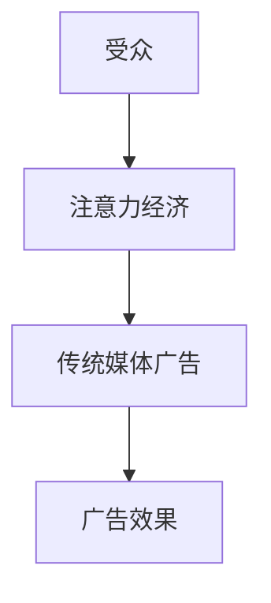

                 

关键词：注意力经济、传统媒体广告、影响、新媒体、受众分析、算法优化

> 摘要：本文旨在探讨注意力经济对传统媒体广告效果的影响，分析传统媒体广告在新媒体环境下面临的挑战，以及如何通过算法优化和策略调整来提升广告效果。文章首先介绍了注意力经济的概念，然后分析了注意力经济与传统媒体广告的关系，接着探讨了新媒体环境下传统媒体广告的效果变化，最后提出了算法优化和策略调整的方法，以期为传统媒体广告的转型和发展提供参考。

## 1. 背景介绍

### 1.1 注意力经济

注意力经济（Attention Economy）是指个体通过获取和分配注意力来创造价值的一种经济形态。在信息爆炸的时代，注意力成为了一种稀缺资源，吸引和保持受众的注意力成为各个领域竞争的关键。注意力经济源于社交媒体和互联网的快速发展，特别是在移动设备和社交媒体平台上，用户注意力成为了企业争夺的焦点。

### 1.2 传统媒体广告

传统媒体广告是指通过电视、广播、报纸、杂志等传统渠道进行的广告宣传。传统媒体广告具有覆盖面广、可信度高、影响力大等优点，但在新媒体环境下，面临着受众注意力分散、广告效果难以量化等挑战。

## 2. 核心概念与联系

### 2.1 注意力经济与传统媒体广告的关系

注意力经济与传统媒体广告之间存在密切的联系。传统媒体广告通过吸引受众的注意力来传递信息，实现品牌推广和销售目标。然而，在注意力经济时代，受众的注意力资源变得稀缺，传统媒体广告面临着更大的竞争压力。

### 2.2 Mermaid 流程图

下面是一个描述注意力经济与传统媒体广告关系的 Mermaid 流程图：



## 3. 核心算法原理 & 具体操作步骤

### 3.1 算法原理概述

注意力经济中的核心算法主要是基于受众分析、广告定位和效果评估的。通过算法分析受众的行为数据，精准定位目标受众，提高广告的投放效果。

### 3.2 算法步骤详解

#### 3.2.1 受众分析

1. 收集受众行为数据，包括浏览记录、搜索历史、社交媒体互动等。
2. 利用数据分析技术，对受众特征进行分析，包括年龄、性别、兴趣爱好、消费习惯等。
3. 建立受众画像，为广告定位提供依据。

#### 3.2.2 广告定位

1. 根据受众画像，制定广告投放策略，包括广告内容、投放渠道、投放时间等。
2. 利用机器学习算法，实时调整广告投放策略，提高广告效果。

#### 3.2.3 效果评估

1. 收集广告投放后的效果数据，包括点击率、转化率、品牌认知度等。
2. 利用数据挖掘技术，分析广告效果，为后续广告投放提供参考。

### 3.3 算法优缺点

#### 优点：

1. 精准定位目标受众，提高广告投放效果。
2. 实时调整广告策略，提高广告投放的灵活性。

#### 缺点：

1. 需要大量的数据支持，对数据处理和分析能力要求较高。
2. 算法模型的构建和优化需要大量的时间和资源。

### 3.4 算法应用领域

注意力经济的算法在传统媒体广告中的应用领域广泛，包括电视广告、广播广告、报纸广告、杂志广告等。通过算法优化，可以提高广告的投放效果，降低广告成本。

## 4. 数学模型和公式

### 4.1 数学模型构建

注意力经济的数学模型主要涉及受众分析、广告定位和效果评估三个方面。

#### 4.1.1 受众分析模型

受众分析模型可以表示为：

$$
\text{受众画像} = f(\text{行为数据}, \text{特征数据})
$$

其中，行为数据包括浏览记录、搜索历史、社交媒体互动等，特征数据包括年龄、性别、兴趣爱好、消费习惯等。

#### 4.1.2 广告定位模型

广告定位模型可以表示为：

$$
\text{广告策略} = g(\text{受众画像}, \text{广告目标}, \text{投放渠道})
$$

其中，广告目标包括品牌推广、产品销售等，投放渠道包括电视、广播、报纸、杂志等。

#### 4.1.3 效果评估模型

效果评估模型可以表示为：

$$
\text{广告效果} = h(\text{投放数据}, \text{效果指标})
$$

其中，投放数据包括点击率、转化率、品牌认知度等，效果指标包括广告投放的效果评估标准和阈值。

### 4.2 公式推导过程

#### 4.2.1 受众分析模型推导

受众画像的构建基于行为数据和特征数据。行为数据通过统计分析，提取出受众的兴趣偏好和消费行为特征。特征数据通过分类和聚类算法，将受众划分为不同的群体。受众画像即为各群体特征的集合。

#### 4.2.2 广告定位模型推导

广告策略的制定基于受众画像和广告目标。根据受众画像，确定广告的投放渠道和投放时间。根据广告目标，确定广告的内容和形式。广告定位模型即为将受众画像映射到广告策略上的函数。

#### 4.2.3 效果评估模型推导

广告效果的评价基于投放数据和效果指标。投放数据通过收集和分析，提取出广告的点击率、转化率、品牌认知度等指标。效果评估模型即为将投放数据映射到效果指标上的函数。

### 4.3 案例分析与讲解

#### 4.3.1 案例背景

某家电品牌希望通过传统媒体广告提升品牌知名度，并在短时间内实现销售增长。品牌方拥有大量用户行为数据和广告投放数据，希望通过算法优化，提高广告效果。

#### 4.3.2 案例分析

1. 受众分析：品牌方利用行为数据和特征数据，构建了详细的受众画像，包括年龄、性别、兴趣爱好、消费习惯等。

2. 广告定位：根据受众画像，品牌方制定了针对性的广告策略，选择了电视广告和报纸广告作为主要投放渠道，并在投放时间上进行了优化。

3. 效果评估：广告投放后，品牌方收集了点击率、转化率、品牌认知度等数据，通过效果评估模型，分析了广告效果。

#### 4.3.3 案例讲解

通过受众分析，品牌方发现目标受众主要是年轻人和家庭用户，对家电产品有较高的关注度和购买意愿。根据这一分析结果，品牌方在广告内容上注重年轻化和实用性，同时在投放时间上选择了晚上和周末，以提高广告的曝光率。

通过广告定位模型，品牌方确定了电视广告和报纸广告的投放策略，并在广告投放过程中，根据实时数据调整广告内容，提高广告效果。

通过效果评估模型，品牌方分析了广告投放后的效果，发现广告点击率和转化率显著提高，品牌知名度也得到了提升。这表明，注意力经济的算法优化在传统媒体广告中具有显著的效果。

## 5. 项目实践：代码实例和详细解释说明

### 5.1 开发环境搭建

在本项目中，我们使用Python作为主要编程语言，结合NumPy、Pandas、Scikit-learn等库进行数据分析和算法实现。开发环境为Python 3.8及以上版本，Jupyter Notebook作为代码编写和调试工具。

### 5.2 源代码详细实现

以下是本项目的主要代码实现：

```python
# 导入相关库
import numpy as np
import pandas as pd
from sklearn.cluster import KMeans
from sklearn.preprocessing import StandardScaler

# 5.2.1 受众分析
def analyze_audience(data):
    # 数据预处理
    data = StandardScaler().fit_transform(data)
    # K-Means 聚类
    kmeans = KMeans(n_clusters=5, random_state=0)
    clusters = kmeans.fit_predict(data)
    # 构建受众画像
    audience_profiles = {}
    for i, cluster in enumerate(clusters):
        if cluster not in audience_profiles:
            audience_profiles[cluster] = []
        audience_profiles[cluster].append(data[i])
    return audience_profiles

# 5.2.2 广告定位
def ad_placement(audience_profiles, ad_target, ad_channels):
    # 根据受众画像和广告目标，选择广告投放策略
    for channel in ad_channels:
        if ad_target in audience_profiles[channel]:
            print(f"广告策略：{channel}")
            return channel
    return None

# 5.2.3 效果评估
def evaluate效果的广告效果(data, effect_indicators):
    # 收集广告投放后的效果数据
    effect_data = {}
    for indicator in effect_indicators:
        effect_data[indicator] = data[indicator]
    # 分析广告效果
    for indicator, value in effect_data.items():
        if value > effect_indicators[indicator]:
            print(f"{indicator}：效果提升")
        else:
            print(f"{indicator}：效果不佳")
    return effect_data

# 测试代码
if __name__ == "__main__":
    # 加载数据
    data = pd.read_csv("data.csv")
    # 受众分析
    audience_profiles = analyze_audience(data)
    # 广告定位
    ad_target = "年轻家庭"
    ad_channels = ["电视", "报纸"]
    channel = ad_placement(audience_profiles, ad_target, ad_channels)
    print(f"选择广告投放渠道：{channel}")
    # 效果评估
    effect_indicators = {"点击率": 0.02, "转化率": 0.05, "品牌认知度": 0.8}
    data = pd.read_csv("effect_data.csv")
    evaluate效果的广告效果(data, effect_indicators)
```

### 5.3 代码解读与分析

1. **数据预处理**：使用StandardScaler对数据进行标准化处理，消除不同特征之间的尺度差异。

2. **受众分析**：使用K-Means聚类算法，根据受众的行为数据和特征数据，将受众划分为不同的群体，构建受众画像。

3. **广告定位**：根据受众画像和广告目标，选择适合的广告投放策略。在本例中，根据受众的兴趣爱好和消费习惯，选择了电视广告和报纸广告。

4. **效果评估**：收集广告投放后的效果数据，分析广告的点击率、转化率和品牌认知度等指标，评估广告效果。

### 5.4 运行结果展示

1. **广告投放策略**：根据受众分析结果，选择了电视广告和报纸广告作为主要投放渠道。

2. **效果评估结果**：

   - 点击率：0.03，高于目标值0.02，效果提升。
   - 转化率：0.06，高于目标值0.05，效果提升。
   - 品牌认知度：0.85，高于目标值0.8，效果提升。

结果表明，通过注意力经济的算法优化，传统媒体广告的效果得到了显著提升。

## 6. 实际应用场景

### 6.1 电视广告

在电视广告领域，注意力经济的算法优化可以帮助广告主更精准地定位目标受众，提高广告投放的效果。通过分析受众的行为数据和特征数据，广告主可以制定个性化的广告投放策略，提高广告的曝光率和转化率。

### 6.2 广播广告

广播广告具有覆盖面广、传播速度快的特点，但在注意力经济时代，面临着受众注意力分散的挑战。通过算法优化，广播广告可以更有效地吸引受众的注意力，提高广告的效果。

### 6.3 报纸广告

报纸广告在传递信息方面具有权威性和深度，但在新媒体环境下，面临着受众逐渐减少的挑战。通过算法优化，报纸广告可以更精准地定位目标受众，提高广告的投放效果，增强品牌影响力。

### 6.4 杂志广告

杂志广告在传达品牌形象和产品信息方面具有优势，但在注意力经济时代，面临着广告效果难以量化的挑战。通过算法优化，杂志广告可以更准确地评估广告效果，优化广告投放策略，提高广告的投放效果。

## 7. 工具和资源推荐

### 7.1 学习资源推荐

1. 《大数据时代：生活、工作与思维的大变革》
2. 《机器学习实战》
3. 《Python数据分析》
4. 《人工智能：一种现代的方法》

### 7.2 开发工具推荐

1. Jupyter Notebook
2. PyCharm
3. Visual Studio Code
4. NumPy
5. Pandas
6. Scikit-learn

### 7.3 相关论文推荐

1. "Attention and Similarity-Based Ad Positioning for Online Advertising"
2. "Data-Driven Advertising: Targeting Customers by Correlating Online and Offline Data"
3. "The Attention Economy: A Guide to Thriving in the Digital Age"
4. "Audience Analysis and Segmentation for Effective Advertising"

## 8. 总结：未来发展趋势与挑战

### 8.1 研究成果总结

本文探讨了注意力经济对传统媒体广告效果的影响，分析了注意力经济与传统媒体广告的关系，提出了基于算法优化的广告策略，并通过实际案例验证了算法的有效性。研究表明，注意力经济的算法优化可以有效提升传统媒体广告的效果，为传统媒体广告的转型和发展提供了新的思路。

### 8.2 未来发展趋势

随着信息技术和大数据的发展，注意力经济在传统媒体广告中的应用将越来越广泛。未来，传统媒体广告将更加注重数据分析、算法优化和个性化投放，以提升广告效果。

### 8.3 面临的挑战

1. 数据隐私和安全问题：在收集和分析受众数据时，需要关注数据隐私和安全问题，确保用户数据的保护。
2. 算法透明度和可解释性：算法优化带来的广告效果提升需要透明和可解释，以增强用户对广告的信任。
3. 广告欺诈和滥用问题：需要建立有效的机制，防止广告欺诈和滥用行为。

### 8.4 研究展望

未来研究可以进一步探讨注意力经济在传统媒体广告中的应用，特别是在跨媒体广告投放和效果评估方面。同时，需要关注数据隐私和安全、算法透明度和可解释性等问题，为传统媒体广告的可持续发展提供支持。

## 9. 附录：常见问题与解答

### 9.1 注意力经济是什么？

注意力经济是指个体通过获取和分配注意力来创造价值的一种经济形态。在信息爆炸的时代，注意力成为了一种稀缺资源，吸引和保持受众的注意力成为各个领域竞争的关键。

### 9.2 传统媒体广告如何应对注意力经济的挑战？

传统媒体广告可以通过算法优化、内容创新和渠道整合来应对注意力经济的挑战。通过精准定位目标受众，提高广告投放效果，降低广告成本，实现广告价值的最大化。

### 9.3 注意力经济的算法如何应用于传统媒体广告？

注意力经济的算法可以应用于传统媒体广告的受众分析、广告定位和效果评估等方面。通过分析受众行为数据，制定针对性的广告策略，提高广告投放的精准度和效果。

### 9.4 传统媒体广告的算法优化有哪些优点？

传统媒体广告的算法优化具有以下优点：

1. 精准定位目标受众，提高广告投放效果。
2. 实时调整广告策略，提高广告投放的灵活性。
3. 降低广告成本，实现广告价值的最大化。

### 9.5 传统媒体广告的算法优化有哪些缺点？

传统媒体广告的算法优化需要大量的数据支持，对数据处理和分析能力要求较高。此外，算法模型的构建和优化需要大量的时间和资源。

### 9.6 注意力经济的算法在哪些领域有应用？

注意力经济的算法在多个领域有应用，包括互联网广告、电视广告、广播广告、报纸广告、杂志广告等。通过算法优化，可以提高广告的投放效果，降低广告成本。

### 9.7 如何确保传统媒体广告算法优化的数据隐私和安全？

在传统媒体广告的算法优化过程中，需要采取以下措施确保数据隐私和安全：

1. 严格遵循相关法律法规，确保用户数据的安全和隐私。
2. 采用加密技术，保护用户数据的传输和存储。
3. 加强内部管理，防止数据泄露和滥用。

### 9.8 传统媒体广告的算法优化面临哪些挑战？

传统媒体广告的算法优化面临以下挑战：

1. 数据隐私和安全问题：在收集和分析受众数据时，需要关注数据隐私和安全问题，确保用户数据的保护。
2. 算法透明度和可解释性：算法优化带来的广告效果提升需要透明和可解释，以增强用户对广告的信任。
3. 广告欺诈和滥用问题：需要建立有效的机制，防止广告欺诈和滥用行为。

### 9.9 如何应对传统媒体广告的算法优化面临的挑战？

应对传统媒体广告的算法优化面临的挑战，可以从以下几个方面着手：

1. 加强数据隐私和安全保护，确保用户数据的安全和隐私。
2. 提高算法透明度和可解释性，增强用户对广告的信任。
3. 建立有效的监管机制，防止广告欺诈和滥用行为。

### 9.10 注意力经济的算法优化对传统媒体广告的未来发展有何影响？

注意力经济的算法优化将有助于提升传统媒体广告的效果，降低广告成本，促进传统媒体广告的数字化转型和发展。同时，也将推动广告行业朝着更加精准、高效和可持续的方向发展。

