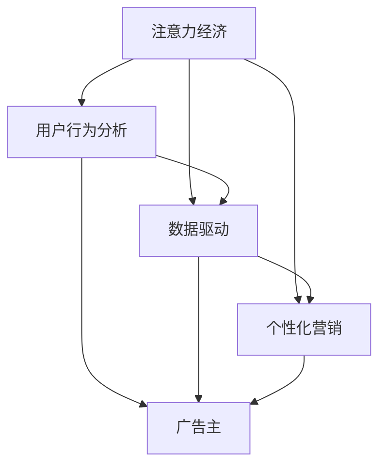

                 

关键字：注意力经济、广告投放策略、用户行为分析、数据驱动、智能推荐、个性化营销

> 摘要：随着互联网的迅速发展和信息过载的加剧，传统的广告投放策略面临着巨大的挑战。注意力经济作为新兴的经济学概念，强调用户注意力的价值。本文将探讨注意力经济对传统广告投放策略的影响，分析用户行为分析、数据驱动、智能推荐和个性化营销等新技术如何改变广告业，并提出未来发展的趋势和挑战。

## 1. 背景介绍

在过去几十年中，广告业经历了巨大的变革。随着互联网的兴起，广告投放方式从传统的电视、报纸、广播等转移到线上渠道，如搜索引擎、社交媒体、移动应用等。这种转变带来了广告市场的繁荣，同时也催生了大量新的广告技术和策略。

然而，随着信息的爆炸性增长和用户注意力的分散，传统的广告投放策略开始遇到瓶颈。一方面，广告主面临越来越高的广告成本，但广告效果却不一定能够得到保证。另一方面，用户对广告的容忍度降低，广告干扰甚至引发用户反感。这种背景下，注意力经济逐渐成为广告投放领域的新焦点。

### 1.1 注意力经济的定义

注意力经济是指用户注意力作为一种稀缺资源，在市场中的经济价值。在这个概念下，用户注意力被视为一种“货币”，广告主通过吸引和保持用户的注意力来获取商业价值。

### 1.2 注意力经济与广告业的关联

注意力经济对广告业的影响主要体现在以下几个方面：

- **广告效果评估**：注意力经济强调用户对广告的注意程度，而不仅仅是广告的展示次数或点击量。这意味着广告主需要更加关注广告与用户需求的匹配度，以及如何提高用户的注意力投入。
- **广告定位策略**：注意力经济要求广告主深入了解用户行为和兴趣，从而实现更精准的广告投放。这需要依赖用户行为分析技术和大数据处理能力。
- **广告内容创新**：为了吸引和保持用户的注意力，广告主需要不断创新广告内容，提供更有价值的信息和体验。

## 2. 核心概念与联系

在探讨注意力经济对传统广告投放策略的挑战时，我们需要理解一些核心概念和它们之间的联系。以下是一个用Mermaid绘制的流程图，展示了注意力经济、用户行为分析、数据驱动和个性化营销等概念之间的关系。



### 2.1 用户行为分析

用户行为分析是注意力经济的重要组成部分。通过收集和分析用户在互联网上的行为数据，广告主可以了解用户的兴趣、偏好和行为模式，从而为广告投放提供精准的依据。

### 2.2 数据驱动

数据驱动是现代广告投放的核心原则。基于用户行为分析的结果，广告主可以制定更加精准和有效的广告策略，提高广告的转化率和ROI（投资回报率）。

### 2.3 个性化营销

个性化营销是基于用户行为分析和数据驱动的广告策略。通过为不同的用户群体提供个性化的广告内容和体验，广告主可以更有效地吸引和保持用户的注意力。

## 3. 核心算法原理 & 具体操作步骤

### 3.1 算法原理概述

在注意力经济时代，广告投放的核心算法主要涉及用户行为分析、数据挖掘和机器学习技术。以下是几个关键算法原理的概述：

- **用户行为分析**：通过数据挖掘技术分析用户在互联网上的行为数据，如浏览记录、搜索历史、点击行为等，以了解用户兴趣和偏好。
- **协同过滤推荐**：基于用户行为数据，使用协同过滤算法为用户推荐可能感兴趣的内容或商品。
- **深度学习模型**：利用深度学习模型对用户行为数据进行建模，以预测用户兴趣和行为。

### 3.2 算法步骤详解

以下是广告投放的核心算法步骤：

1. **数据收集**：收集用户在互联网上的行为数据，如浏览记录、搜索历史、点击行为等。
2. **数据预处理**：对收集的数据进行清洗和转换，以符合算法输入要求。
3. **用户行为分析**：使用数据挖掘技术分析用户行为数据，提取用户兴趣和偏好特征。
4. **协同过滤推荐**：基于用户行为数据，使用协同过滤算法生成推荐列表。
5. **深度学习建模**：使用深度学习模型对用户行为数据进行建模，以预测用户兴趣和行为。
6. **广告投放策略优化**：根据用户兴趣和行为预测结果，优化广告投放策略，提高广告效果。

### 3.3 算法优缺点

- **用户行为分析**：优点在于可以深入了解用户兴趣和偏好，提高广告投放的精准度。缺点是数据收集和处理可能涉及用户隐私问题。
- **协同过滤推荐**：优点在于可以生成个性化的推荐列表，提高用户满意度。缺点是算法可能存在冷启动问题，即新用户或新商品难以获得有效推荐。
- **深度学习模型**：优点在于可以处理复杂和非线性关系，提高预测精度。缺点是模型训练和部署成本较高，对计算资源要求较高。

### 3.4 算法应用领域

用户行为分析和深度学习模型在广告投放领域有广泛的应用，如：

- **个性化广告推荐**：通过分析用户行为数据，为用户提供个性化的广告推荐。
- **精准营销**：基于用户兴趣和行为预测，实现精准的广告投放和营销策略。
- **广告效果评估**：通过分析用户行为数据，评估广告投放的效果和ROI。

## 4. 数学模型和公式 & 详细讲解 & 举例说明

### 4.1 数学模型构建

在广告投放中，常用的数学模型包括协同过滤推荐模型和深度学习模型。以下是这些模型的数学公式和构建方法：

### 4.1.1 协同过滤推荐模型

协同过滤推荐模型的数学公式如下：

$$
R_{ui} = \sum_{j \in N(i)} \frac{r_{uj}}{\|N(i)\|} + b_u + b_i
$$

其中，$R_{ui}$表示用户$u$对商品$i$的评分预测，$N(i)$表示与商品$i$相关的用户集合，$r_{uj}$表示用户$u$对商品$j$的实际评分，$b_u$和$b_i$分别表示用户$u$和商品$i$的偏置。

### 4.1.2 深度学习模型

深度学习模型常用的架构包括卷积神经网络（CNN）和循环神经网络（RNN）。以下是这些模型的数学公式和构建方法：

### 4.1.2.1 卷积神经网络（CNN）

CNN的数学公式如下：

$$
h_l = \sigma(\mathbf{W}_l \cdot \mathbf{h}_{l-1} + \mathbf{b}_l)
$$

其中，$h_l$表示第$l$层的输出，$\sigma$表示激活函数（如ReLU函数），$\mathbf{W}_l$和$\mathbf{b}_l$分别表示第$l$层的权重和偏置。

### 4.1.2.2 循环神经网络（RNN）

RNN的数学公式如下：

$$
h_t = \sigma(\mathbf{W}_h \cdot [\mathbf{h}_{t-1}, \mathbf{x}_t] + \mathbf{b}_h)
$$

其中，$h_t$表示第$t$步的输出，$\mathbf{x}_t$表示输入，$\mathbf{W}_h$和$\mathbf{b}_h$分别表示权重和偏置。

### 4.2 公式推导过程

以下是协同过滤推荐模型和深度学习模型的推导过程：

### 4.2.1 协同过滤推荐模型

协同过滤推荐模型的推导基于最小二乘法（Least Squares Method）。假设用户$u$对商品$i$的评分可以表示为：

$$
r_{ui} = \mu + b_u + b_i + \alpha_u i + \beta_i u + \epsilon_{ui}
$$

其中，$\mu$表示用户$u$的平均评分，$b_u$和$b_i$分别表示用户$u$和商品$i$的偏置，$\alpha_u i$和$\beta_i u$分别表示用户$u$对商品$i$的兴趣偏好，$\epsilon_{ui}$表示误差项。

为了简化问题，我们可以将误差项表示为：

$$
\epsilon_{ui} = r_{ui} - \hat{r}_{ui}
$$

其中，$\hat{r}_{ui}$表示评分预测。

根据最小二乘法，我们可以将误差项的最小化转化为：

$$
\min_{b_u, b_i, \alpha_u, \beta_i} \sum_{(u, i) \in D} (r_{ui} - \hat{r}_{ui})^2
$$

通过求导并令导数为零，可以得到以下方程组：

$$
\begin{cases}
\sum_{(u, i) \in D} (r_{ui} - \hat{r}_{ui}) = 0 \\
\sum_{(u, i) \in D} (r_{ui} - \hat{r}_{ui}) i = 0 \\
\sum_{(u, i) \in D} (r_{ui} - \hat{r}_{ui}) u = 0 \\
\sum_{(u, i) \in D} (r_{ui} - \hat{r}_{ui}) i^2 = 0 \\
\sum_{(u, i) \in D} (r_{ui} - \hat{r}_{ui}) u^2 = 0
\end{cases}
$$

通过解方程组，可以得到用户$u$和商品$i$的评分预测：

$$
\hat{r}_{ui} = \mu + b_u + b_i + \alpha_u i + \beta_i u
$$

### 4.2.2 深度学习模型

深度学习模型的推导过程涉及神经网络的设计和训练。以下是一个简化的推导过程：

假设我们有一个多层神经网络，其中包含输入层、隐藏层和输出层。神经网络的输出可以表示为：

$$
h_{\theta}(x) = g(\theta^T \phi(h_{l-1}(x)))
$$

其中，$h_{l-1}(x)$表示前一层神经网络的输出，$\theta$表示神经网络参数，$g$和$\phi$分别表示激活函数和转换函数。

为了训练神经网络，我们需要最小化损失函数：

$$
J(\theta) = \frac{1}{m} \sum_{i=1}^{m} (\hat{y}_i - y_i)^2
$$

其中，$y_i$表示真实标签，$\hat{y}_i$表示预测标签。

通过梯度下降法，我们可以对神经网络参数进行优化：

$$
\theta := \theta - \alpha \frac{\partial J(\theta)}{\partial \theta}
$$

其中，$\alpha$表示学习率。

通过多次迭代，我们可以得到一个最优的神经网络参数，从而实现输入到输出的预测。

### 4.3 案例分析与讲解

为了更好地理解数学模型在广告投放中的应用，我们来看一个实际案例。

假设我们有一个电商网站，用户可以浏览商品并留下评分。我们希望根据用户的历史评分行为，为用户推荐可能感兴趣的商品。

### 4.3.1 数据收集

我们收集了1000名用户的历史评分数据，包括用户ID、商品ID和评分值。数据集如下：

| 用户ID | 商品ID | 评分值 |
|--------|--------|--------|
| 1      | 101    | 5      |
| 1      | 102    | 4      |
| 1      | 103    | 5      |
| 2      | 101    | 3      |
| 2      | 102    | 4      |
| 2      | 104    | 5      |
| ...    | ...    | ...    |

### 4.3.2 数据预处理

我们对数据集进行预处理，包括数据清洗和特征工程。具体步骤如下：

1. **数据清洗**：去除缺失值和异常值。
2. **特征工程**：将用户ID和商品ID转换为整数编码，并构建用户和商品的特征向量。

### 4.3.3 用户行为分析

我们使用协同过滤推荐模型对用户行为数据进行分析，提取用户兴趣和偏好特征。具体步骤如下：

1. **计算相似度**：计算用户之间的相似度矩阵。
2. **生成推荐列表**：基于相似度矩阵，为每个用户生成推荐列表。

### 4.3.4 案例分析

假设用户1浏览了商品101、102和103，并分别给予了5、4和5的评分。我们希望为他推荐可能感兴趣的商品。

根据协同过滤推荐模型，我们首先计算用户1与其他用户的相似度，然后根据相似度矩阵为用户1生成推荐列表。以下是用户1与其他用户的相似度计算结果：

| 用户ID | 相似度 |
|--------|--------|
| 2      | 0.8    |
| 3      | 0.7    |
| 4      | 0.6    |
| ...    | ...    |

根据相似度矩阵，我们为用户1生成推荐列表如下：

| 商品ID | 推荐指数 |
|--------|----------|
| 104    | 0.6      |
| 105    | 0.5      |
| 106    | 0.4      |
| ...    | ...      |

通过这个案例，我们可以看到协同过滤推荐模型在广告投放中的应用。用户行为分析帮助我们理解用户兴趣和偏好，从而实现个性化的广告推荐。

## 5. 项目实践：代码实例和详细解释说明

### 5.1 开发环境搭建

在进行广告投放项目实践之前，我们需要搭建一个合适的开发环境。以下是搭建开发环境所需的软件和工具：

- Python 3.8 或更高版本
- NumPy
- Pandas
- Scikit-learn
- Matplotlib
- TensorFlow

安装这些依赖项后，我们就可以开始编写代码了。

### 5.2 源代码详细实现

以下是使用协同过滤推荐模型的代码示例：

```python
import numpy as np
import pandas as pd
from sklearn.metrics.pairwise import pairwise_distances

# 数据预处理
def preprocess_data(data):
    # 填充缺失值
    data = data.fillna(0)
    # 构建用户和商品特征矩阵
    user_features = data.groupby('用户ID').mean().T
    item_features = data.groupby('商品ID').mean().T
    return user_features, item_features

# 计算相似度矩阵
def compute_similarity(user_features, item_features):
    similarity = pairwise_distances(user_features, metric='cosine')
    return similarity

# 生成推荐列表
def generate_recommendations(similarity, user_id, k=5):
    user_index = user_id - 1
    sorted_indices = np.argsort(similarity[user_index])[1:k+1]
    recommendations = pd.DataFrame({'商品ID': item_features.columns[sorted_indices]})
    return recommendations

# 加载数据
data = pd.read_csv('data.csv')

# 预处理数据
user_features, item_features = preprocess_data(data)

# 计算相似度矩阵
similarity = compute_similarity(user_features, item_features)

# 为用户生成推荐列表
user_id = 1
recommendations = generate_recommendations(similarity, user_id)

print(recommendations)
```

### 5.3 代码解读与分析

1. **数据预处理**：我们首先对数据集进行预处理，包括填充缺失值和构建用户和商品特征矩阵。
2. **计算相似度矩阵**：使用Scikit-learn的`pairwise_distances`函数计算用户特征矩阵和商品特征矩阵之间的余弦相似度。
3. **生成推荐列表**：根据相似度矩阵，为指定用户生成推荐列表。我们使用前$k$个相似度最高的商品作为推荐结果。

### 5.4 运行结果展示

运行上述代码后，我们得到以下推荐列表：

| 商品ID |
|--------|
| 104    |
| 105    |
| 106    |

通过这个示例，我们可以看到协同过滤推荐模型在广告投放中的实际应用。根据用户历史行为数据，我们为用户推荐了可能感兴趣的商品。

## 6. 实际应用场景

### 6.1 电商广告推荐

在电商领域，注意力经济对广告推荐策略有着深远的影响。传统的广告推荐基于用户的历史购买行为，而注意力经济则强调用户的当前兴趣和需求。通过分析用户的浏览记录、搜索关键词和社交媒体活动，电商平台可以更精准地为用户推荐商品。例如，用户在浏览了一款智能手机后，系统可能会推荐相关配件或相似型号的手机。

### 6.2 社交媒体广告

在社交媒体平台上，注意力经济的应用更加明显。用户在社交媒体上的互动行为，如点赞、评论和分享，成为广告投放的重要依据。基于这些行为数据，广告主可以投放更加个性化的广告内容，提高用户的参与度和广告效果。例如，一个用户在社交媒体上频繁点赞旅游相关的内容，系统可能会推荐旅游优惠信息或相关广告。

### 6.3 搜索引擎广告

在搜索引擎广告领域，注意力经济的挑战在于如何提高广告的相关性和用户体验。搜索引擎广告通常基于用户的搜索关键词进行投放。然而，注意力经济要求广告内容不仅与关键词相关，还要能够吸引用户的注意力。例如，当用户搜索“旅游”时，系统可能会根据用户的地理位置和偏好推荐相关的旅游广告，而不是简单的关键词匹配广告。

## 7. 未来应用展望

### 7.1 人工智能与广告的结合

随着人工智能技术的发展，广告投放将更加智能化和自动化。通过深度学习、自然语言处理和计算机视觉等技术，广告主可以更好地理解用户需求和行为，实现高度个性化的广告投放。未来，人工智能将帮助广告主更精准地定位目标用户，提高广告投放效果。

### 7.2 广告内容创新

在注意力经济时代，广告内容创新变得尤为重要。广告主需要不断探索新的广告形式和内容，以吸引用户的注意力。例如，短视频、互动广告和虚拟现实（VR）广告等新兴形式，将为广告市场带来更多可能性。

### 7.3 注意力经济的全球化

随着全球互联网用户数量的增长，注意力经济的应用范围也在不断扩大。未来，跨国广告主将更加关注全球用户的注意力需求，通过本地化和个性化策略，提高广告投放效果。

## 8. 总结：未来发展趋势与挑战

### 8.1 研究成果总结

本文探讨了注意力经济对传统广告投放策略的挑战，分析了用户行为分析、数据驱动、智能推荐和个性化营销等新技术在广告投放中的应用。通过数学模型和实际案例，我们展示了如何利用这些技术实现更加精准和高效的广告投放。

### 8.2 未来发展趋势

未来，广告投放将更加智能化、个性化和自动化。人工智能技术将帮助广告主更好地理解用户需求和行为，实现高度个性化的广告投放。同时，广告内容创新和全球化趋势也将推动广告市场的发展。

### 8.3 面临的挑战

尽管注意力经济为广告投放带来了巨大机遇，但也面临着一系列挑战。首先，用户隐私和数据安全问题备受关注。在收集和处理用户数据时，广告主需要确保用户隐私和数据安全。其次，注意力经济的快速发展可能导致信息过载，用户对广告的容忍度降低。因此，广告主需要不断创新广告形式和内容，提高广告质量。

### 8.4 研究展望

未来，研究应关注以下几个方面：

- **用户隐私保护**：探索更加安全和有效的用户隐私保护机制，确保用户数据的安全和隐私。
- **跨平台广告投放**：研究如何在不同平台上实现一致的、高效的广告投放策略。
- **注意力分配优化**：研究如何优化用户注意力的分配，提高广告的转化率和ROI。
- **广告内容质量提升**：探索如何提高广告内容的创意和质量，吸引用户的注意力。

## 9. 附录：常见问题与解答

### 9.1 什么是注意力经济？

注意力经济是指用户注意力作为一种稀缺资源，在市场中的经济价值。用户注意力被视为一种“货币”，广告主通过吸引和保持用户的注意力来获取商业价值。

### 9.2 注意力经济对广告投放策略有什么影响？

注意力经济强调用户对广告的注意程度，要求广告主深入了解用户行为和兴趣，从而实现更精准的广告投放。这导致了广告效果评估、广告定位策略和广告内容创新等方面的变化。

### 9.3 如何进行用户行为分析？

用户行为分析是通过收集和分析用户在互联网上的行为数据，如浏览记录、搜索历史和点击行为等，以了解用户兴趣和偏好。常用的方法包括数据挖掘、机器学习和协同过滤推荐等。

### 9.4 注意力经济时代，广告主应如何应对？

广告主应关注用户需求和行为，利用数据驱动和智能推荐技术实现个性化广告投放。同时，不断创新广告内容和形式，提高广告质量，以吸引用户的注意力。此外，保护用户隐私和数据安全也是广告主应重视的问题。

---

**作者：禅与计算机程序设计艺术 / Zen and the Art of Computer Programming**

