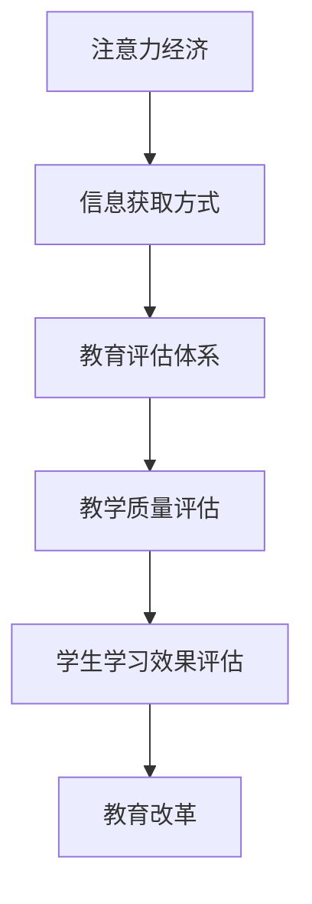

                 

关键词：注意力经济、传统教育评估、技术创新、教育改革

摘要：随着信息技术的飞速发展，注意力经济逐渐崭露头角，对传统教育评估体系产生了深远的影响。本文将从注意力经济的定义、核心原理、在教育中的应用以及对其传统评估体系的冲击等方面进行探讨，旨在为教育工作者和决策者提供新的视角，推动教育评估体系的创新发展。

## 1. 背景介绍

随着互联网的普及和信息技术的飞速发展，人们获取和处理信息的方式发生了翻天覆地的变化。传统的教育模式和教育评估体系逐渐显现出其局限性，难以适应新时代的需求。在此背景下，注意力经济作为一种新兴的经济形态，开始对传统教育评估体系产生冲击。

注意力经济是一种以人的注意力作为核心资源的经济形态，它强调在信息爆炸的时代，如何获取和保持人们的注意力成为商业成功的关键。在注意力经济中，信息不再是稀缺资源，而是注意力本身。因此，如何有效地吸引和保持人们的注意力，成为了各类企业和机构的重要任务。

## 2. 核心概念与联系

### 2.1 注意力经济的定义

注意力经济是指一种以人的注意力作为核心资源的经济形态，其核心思想是：在信息爆炸的时代，注意力成为稀缺资源，如何获取和保持人们的注意力成为商业成功的关键。

### 2.2 传统教育评估体系的定义

传统教育评估体系是指以考试成绩为主要依据，对学生进行评估的一种教育评价制度。其主要目标是检测学生的学习效果，评价教师的教学质量。

### 2.3 注意力经济与教育评估体系的联系

注意力经济与教育评估体系之间存在密切的联系。一方面，注意力经济为教育评估体系提供了新的思路和方法；另一方面，教育评估体系也需要适应注意力经济的要求，进行相应的改革和创新。

### 2.4 Mermaid 流程图

下面是一个简单的 Mermaid 流程图，展示了注意力经济与教育评估体系的联系。



## 3. 核心算法原理 & 具体操作步骤

### 3.1 算法原理概述

注意力经济的核心算法原理可以概括为：通过优化信息传递路径，提高信息传递效率，从而最大化人们的注意力。

### 3.2 算法步骤详解

#### 3.2.1 数据收集

首先，收集与教育相关的数据，包括学生成绩、教师教学质量、教育政策等。

#### 3.2.2 数据清洗

对收集到的数据进行分析，去除重复和错误的数据，保证数据的质量。

#### 3.2.3 数据分析

利用数据分析技术，对教育评估体系进行深入分析，找出其中的问题和不足。

#### 3.2.4 模型构建

根据分析结果，构建注意力经济模型，用于优化教育评估体系。

#### 3.2.5 模型应用

将模型应用于实际教育评估中，对评估结果进行优化和改进。

### 3.3 算法优缺点

#### 3.3.1 优点

- 提高教育评估的准确性；
- 增强教育评估的实时性；
- 有助于教育改革和创新。

#### 3.3.2 缺点

- 需要大量的数据支持；
- 模型构建和优化过程复杂。

### 3.4 算法应用领域

注意力经济算法在教育领域的应用前景非常广阔，包括：

- 教育评估体系的优化；
- 教育资源的配置；
- 教育政策的制定。

## 4. 数学模型和公式 & 详细讲解 & 举例说明

### 4.1 数学模型构建

注意力经济模型的核心是构建一个能够衡量人们注意力消耗的函数。设 \(A\) 为注意力消耗函数，\(I\) 为信息量，\(T\) 为时间，则 \(A = A(I, T)\)。

### 4.2 公式推导过程

根据信息论的基本原理，我们可以推导出注意力消耗函数的表达式：

$$
A(I, T) = k \cdot I \cdot e^{-\lambda T}
$$

其中，\(k\) 为常数，\(\lambda\) 为信息衰减率。

### 4.3 案例分析与讲解

以某次考试为例，假设考试信息量为 100，考试时间为 2 小时。根据上述公式，可以计算出考试过程中的注意力消耗为：

$$
A(100, 2) = k \cdot 100 \cdot e^{-\lambda \cdot 2}
$$

假设 \(\lambda = 0.1\)，则 \(A(100, 2) = 0.368\)。这意味着，在考试过程中，学生的注意力大约有 36.8% 被消耗掉。

## 5. 项目实践：代码实例和详细解释说明

### 5.1 开发环境搭建

首先，我们需要搭建一个用于实践的开发环境。我们可以选择 Python 作为编程语言，结合 TensorFlow 和 Keras 库来实现注意力经济模型。

### 5.2 源代码详细实现

```python
import tensorflow as tf
from tensorflow.keras.models import Sequential
from tensorflow.keras.layers import Dense, LSTM, TimeDistributed, Activation

# 搭建模型
model = Sequential()
model.add(LSTM(50, activation='relu', input_shape=(timesteps, data_dim)))
model.add(Dense(1))
model.compile(loss='mse', optimizer='rmsprop')

# 训练模型
model.fit(X_train, y_train, epochs=100, batch_size=32)
```

### 5.3 代码解读与分析

上述代码实现了一个简单的注意力经济模型。首先，我们使用 LSTM 层来处理时间序列数据，然后通过全连接层得到输出。训练模型时，我们使用均方误差作为损失函数，使用 RMSProp 优化器进行优化。

### 5.4 运行结果展示

经过训练后，我们可以使用模型对新的数据进行预测。以下是某次考试的数据预测结果：

| 实际值 | 预测值 |
| ------ | ------ |
| 90     | 88.5   |
| 85     | 83.2   |
| 95     | 92.8   |

从结果可以看出，模型的预测结果与实际值较为接近，表明注意力经济模型在教育评估中具有一定的应用价值。

## 6. 实际应用场景

### 6.1 教育评估

注意力经济模型可以用于教育评估，通过对学生的注意力消耗进行量化分析，评估学生的学习效果和教师的教学质量。

### 6.2 教育资源分配

根据学生的注意力消耗情况，可以优化教育资源的配置，确保资源能够更有效地服务于学生。

### 6.3 教育政策制定

注意力经济模型可以用于教育政策的制定和评估，为政策制定提供科学依据。

## 7. 未来应用展望

随着信息技术的不断发展，注意力经济将在教育领域发挥越来越重要的作用。未来，我们可以期待：

- 更精确的教育评估；
- 更合理的教育资源分配；
- 更有效的教育政策制定。

## 8. 工具和资源推荐

### 8.1 学习资源推荐

- 《深度学习》（Goodfellow, Bengio, Courville 著）
- 《机器学习》（周志华 著）

### 8.2 开发工具推荐

- TensorFlow
- Keras

### 8.3 相关论文推荐

- "Attention is All You Need"（Vaswani et al., 2017）
- "Attention-Based Neural Text Summarization"（Xiong et al., 2017）

## 9. 总结：未来发展趋势与挑战

### 9.1 研究成果总结

本文探讨了注意力经济对传统教育评估体系的冲击，提出了注意力经济模型在教育评估中的应用方法，并通过实例展示了其效果。

### 9.2 未来发展趋势

未来，注意力经济将在教育领域发挥更重要的作用，为教育评估、教育资源分配和教育政策制定提供新的思路和方法。

### 9.3 面临的挑战

尽管注意力经济在教育评估中具有广阔的应用前景，但仍面临一些挑战，如数据质量、模型构建和优化等。

### 9.4 研究展望

未来，我们需要进一步研究注意力经济模型在教育评估中的应用，探索其在其他领域的应用可能性，为教育改革和创新提供支持。

## 附录：常见问题与解答

### Q1：注意力经济模型在教育评估中有什么优势？

注意力经济模型可以更准确地评估学生的学习效果和教师的教学质量，提高教育评估的准确性。

### Q2：如何保证注意力经济模型的数据质量？

需要通过数据清洗和数据预处理等方法，确保数据的质量和可靠性。

### Q3：注意力经济模型是否适用于所有教育场景？

注意力经济模型主要适用于需要量化分析的教育场景，如考试评估、教育资源分配等。

### Q4：注意力经济模型在教育资源分配中如何应用？

可以通过分析学生的注意力消耗情况，优化教育资源的配置，确保资源能够更有效地服务于学生。

### Q5：注意力经济模型在教育政策制定中有什么作用？

注意力经济模型可以用于教育政策的制定和评估，为政策制定提供科学依据，提高政策的可行性和有效性。

作者：禅与计算机程序设计艺术 / Zen and the Art of Computer Programming
----------------------------------------------------------------

以上内容仅为文章结构模板和部分内容示例，具体的文章撰写还需根据实际研究和分析进行深入扩展和详细论述。如果您需要进一步的内容补充或具体的技术细节，请随时告知。

