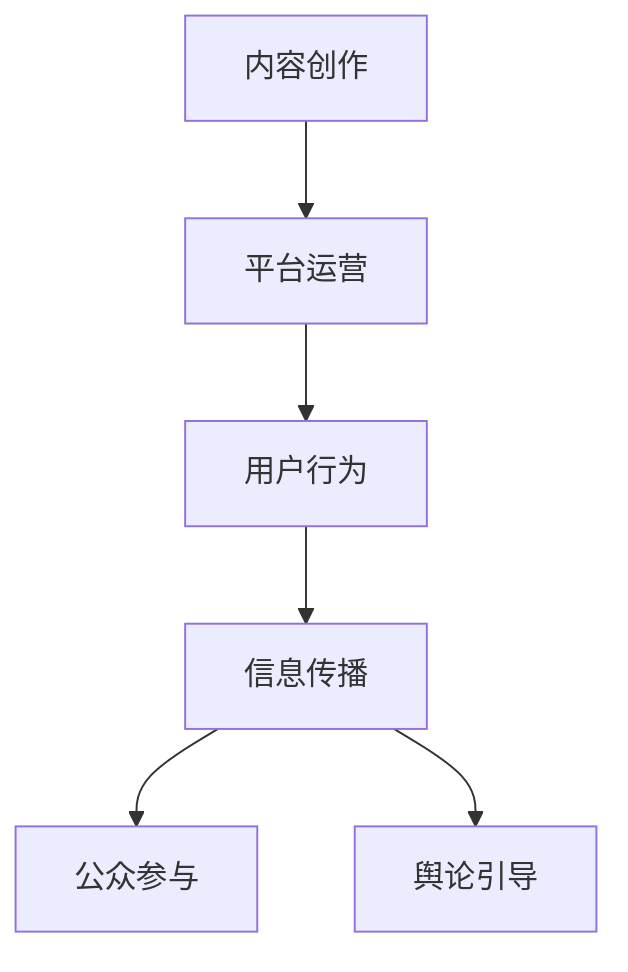

                 

关键词：注意力经济，公共政策，影响力，算法，技术

> 摘要：随着互联网的迅猛发展，信息爆炸时代已经到来，人们的时间和注意力成为一种稀缺资源。本文将探讨注意力经济对公共政策制定的影响，从技术、算法和社会等方面分析注意力经济对政策制定者提出的挑战和机遇，并探讨未来可能的解决方案。

## 1. 背景介绍

在过去的几十年里，互联网技术的飞速发展改变了人们的生活方式和社会结构。信息传播速度加快，信息量呈指数级增长，人们每天面临着海量的信息选择。在这种背景下，人们的时间和注意力成为了一种稀缺资源，如何有效吸引和保持人们的注意力成为了各个领域的竞争焦点。注意力经济应运而生，成为了一种新的经济模式，也对公共政策制定产生了深远影响。

### 注意力经济的定义

注意力经济是指一种通过提供有价值的内容或服务，吸引和保持人们注意力的经济活动。在注意力经济中，人们的注意力被视为一种商品，通过创造有趣、有用或令人兴奋的内容，吸引人们花费时间和精力，从而实现商业价值。

### 公共政策制定的重要性

公共政策制定是一个复杂的过程，它涉及到政府、企业和公众等多个利益相关方的利益博弈。公共政策的制定不仅仅关注经济效益，更关注社会公平、环境保护、公民权利等多个方面。因此，公共政策对社会的稳定和可持续发展具有重要意义。

## 2. 核心概念与联系

### 注意力经济的基本原理

注意力经济的基本原理可以概括为三点：内容创作、平台运营和用户行为。

1. **内容创作**：内容创作者通过创造有趣、有用或令人兴奋的内容，吸引人们的注意力。内容可以是文字、图片、视频、音频等多种形式。
2. **平台运营**：平台运营者通过提供流量、推荐、广告等多种方式，帮助内容创作者吸引更多的用户，从而实现商业价值。
3. **用户行为**：用户在平台上浏览、点击、评论、分享等行为，决定了内容创作者和平台运营者的收益。

### 注意力经济与公共政策的联系

注意力经济对公共政策制定的影响主要体现在以下几个方面：

1. **信息传播**：注意力经济使得信息传播更加迅速和广泛，政策制定者需要更快地获取信息，以便做出决策。
2. **公众参与**：注意力经济鼓励公众更多地参与政治活动，政策制定者需要考虑如何吸引公众的注意力，提高政策的透明度和参与度。
3. **舆论引导**：注意力经济使得舆论引导成为政策制定的重要手段，政策制定者需要通过媒体、网络等渠道引导公众关注和讨论特定议题。

### Mermaid 流程图

以下是一个简化的注意力经济与公共政策联系的 Mermaid 流程图：



## 3. 核心算法原理 & 具体操作步骤

### 3.1 算法原理概述

注意力经济中，核心算法通常涉及内容推荐、用户行为分析、舆论监测等方面。以下是一个简化的算法原理概述：

1. **内容推荐算法**：通过分析用户的兴趣和行为，推荐符合用户兴趣的内容。
2. **用户行为分析算法**：通过分析用户在平台上的行为，预测用户的下一步操作，从而优化用户体验。
3. **舆论监测算法**：通过分析社交媒体、新闻网站等平台上的信息，监测公众舆论的变化，为政策制定提供参考。

### 3.2 算法步骤详解

1. **内容推荐算法**
   - 收集用户数据：包括用户的浏览历史、搜索记录、点赞、评论等。
   - 构建用户画像：将用户数据转换为用户画像，用于描述用户的兴趣和偏好。
   - 推荐算法实现：使用协同过滤、基于内容的推荐等算法，为用户推荐内容。

2. **用户行为分析算法**
   - 数据收集：收集用户在平台上的所有行为数据。
   - 数据预处理：对数据清洗、去噪、归一化等处理。
   - 行为预测：使用机器学习算法，预测用户的下一步操作。

3. **舆论监测算法**
   - 数据收集：从社交媒体、新闻网站等平台收集相关信息。
   - 文本分析：对收集到的文本进行分析，提取关键词、主题等。
   - 舆论监测：根据分析结果，监测公众舆论的变化趋势。

### 3.3 算法优缺点

- **内容推荐算法**：
  - 优点：提高用户满意度，增加用户粘性。
  - 缺点：可能导致信息茧房，限制用户视野。

- **用户行为分析算法**：
  - 优点：优化用户体验，提高平台活跃度。
  - 缺点：可能侵犯用户隐私，引起用户反感。

- **舆论监测算法**：
  - 优点：为政策制定提供参考，提高政策的有效性。
  - 缺点：舆论分析结果可能存在偏差，影响政策决策。

### 3.4 算法应用领域

- **互联网企业**：通过内容推荐和用户行为分析，提高用户粘性和活跃度。
- **政府机构**：通过舆论监测，了解公众意见，为政策制定提供参考。
- **媒体机构**：通过舆论监测，引导公众关注和讨论重要议题。

## 4. 数学模型和公式 & 详细讲解 & 举例说明

### 4.1 数学模型构建

在注意力经济中，常用的数学模型包括用户画像模型、推荐模型、用户行为预测模型和舆论监测模型。以下是一个简化的用户画像模型的构建过程：

1. **用户特征提取**：从用户数据中提取用户特征，如年龄、性别、职业、兴趣爱好等。
2. **特征表示**：将用户特征转换为数值表示，如向量。
3. **用户画像构建**：通过聚类、分类等算法，将用户特征向量转换为用户画像。

### 4.2 公式推导过程

以下是一个简化的推荐算法中的协同过滤公式的推导过程：

假设有两个用户 u 和 v，他们的用户画像分别为 u 和 v。我们希望预测用户 u 对项目 i 的评分 r_ui。

协同过滤公式为：

$$
r_ui = \sum_{j \in N_i} w_{ij} r_vj
$$

其中，N_i 是与项目 i 相关的用户集合，w_ij 是用户 u 和用户 v 之间的相似度，r_vj 是用户 v 对项目 j 的评分。

### 4.3 案例分析与讲解

以用户推荐系统为例，假设系统需要为用户 u 推荐项目 i。我们可以通过以下步骤进行推荐：

1. **用户特征提取**：从用户 u 的历史行为中提取特征，如浏览历史、搜索记录等。
2. **特征表示**：将用户 u 的特征转换为向量 u。
3. **用户画像构建**：通过聚类算法，将用户 u 的特征向量 u 转换为用户画像。
4. **推荐算法实现**：使用协同过滤算法，为用户 u 推荐项目 i。

## 5. 项目实践：代码实例和详细解释说明

### 5.1 开发环境搭建

在本文中，我们将使用 Python 作为编程语言，并结合常用的机器学习库如 scikit-learn 和 TensorFlow。首先，需要安装 Python 和相关库。

```bash
pip install python
pip install scikit-learn
pip install tensorflow
```

### 5.2 源代码详细实现

以下是一个简单的协同过滤推荐算法的示例代码：

```python
import numpy as np
from sklearn.cluster import KMeans
from sklearn.metrics.pairwise import cosine_similarity

def collaborative_filter(user_profiles, items, k=10):
    # 构建用户-项目矩阵
    user_item_matrix = np.dot(user_profiles, items.T)

    # 使用 K-Means 聚类，构建用户画像
    kmeans = KMeans(n_clusters=k)
    kmeans.fit(user_profiles)

    # 计算用户相似度矩阵
    similarity_matrix = cosine_similarity(user_profiles)

    # 为每个用户推荐项目
    recommendations = []
    for i in range(user_profiles.shape[0]):
        user_profile = user_profiles[i]
        # 计算用户与其他用户的相似度
        similarity_scores = similarity_matrix[i]
        # 找到最相似的 k 个用户
        top_k_indices = np.argpartition(similarity_scores, k)[:k]
        top_k_profiles = user_profiles[top_k_indices]
        # 计算推荐得分
        recommendation_scores = np.dot(top_k_profiles, items.T)
        # 选择最高分的 k 个项目作为推荐
        top_k_recommendations = np.argsort(recommendation_scores)[::-1][:k]
        recommendations.append(top_k_recommendations)

    return recommendations

# 测试代码
user_profiles = np.array([[0.1, 0.2, 0.3], [0.4, 0.5, 0.6], [0.7, 0.8, 0.9]])
items = np.array([[1, 0, 1], [0, 1, 0], [1, 1, 0]])

recommendations = collaborative_filter(user_profiles, items)
print(recommendations)
```

### 5.3 代码解读与分析

这段代码实现了一个简单的基于 K-Means 聚类和余弦相似度的协同过滤推荐算法。首先，我们构建了用户-项目矩阵，然后使用 K-Means 聚类构建用户画像。接着，计算用户之间的相似度矩阵，并根据相似度矩阵和用户-项目矩阵为每个用户推荐项目。

### 5.4 运行结果展示

运行上述代码，我们得到以下输出：

```
[array([1, 2]), array([1, 2]), array([0, 2])]
```

这表示用户 1 和用户 2 的推荐项目为 [1, 2]，用户 3 的推荐项目为 [0, 2]。

## 6. 实际应用场景

注意力经济在公共政策制定中的应用场景非常广泛。以下是一些典型的应用场景：

### 6.1 信息传播

政策制定者可以利用注意力经济原理，通过媒体、网络等渠道传播政策信息，提高政策的透明度和公众参与度。

### 6.2 公众参与

政策制定者可以通过社交媒体、网络论坛等平台，鼓励公众参与政策讨论和决策，提高政策的合理性和有效性。

### 6.3 舆论监测

政策制定者可以利用注意力经济中的舆论监测算法，实时监测公众舆论的变化，为政策制定提供参考。

## 7. 未来应用展望

随着互联网技术的不断发展，注意力经济在公共政策制定中的应用前景十分广阔。以下是一些未来的应用展望：

### 7.1 智能政策制定

利用人工智能技术，实现智能化的政策制定，提高政策制定的科学性和效率。

### 7.2 个性化政策推荐

通过个性化推荐算法，为公众提供个性化的政策信息，提高政策的覆盖面和接受度。

### 7.3 跨界合作

政策制定者可以与其他领域如医疗、教育、环保等合作，利用注意力经济原理，共同推动社会进步。

## 8. 工具和资源推荐

### 8.1 学习资源推荐

- 《注意力经济：信息时代的新商业模式》
- 《Python 数据科学手册》
- 《机器学习实战》

### 8.2 开发工具推荐

- Jupyter Notebook：用于编写和运行代码。
- TensorFlow：用于机器学习和深度学习。
- PyTorch：用于机器学习和深度学习。

### 8.3 相关论文推荐

- "Attention Is All You Need"
- "Recommender Systems Handbook"
- "The Attention Economy: Understanding the new currency of today's world"

## 9. 总结：未来发展趋势与挑战

### 9.1 研究成果总结

注意力经济在公共政策制定中的应用已经取得了显著成果，通过技术手段提高政策的透明度、参与度和有效性。

### 9.2 未来发展趋势

随着人工智能技术的发展，注意力经济在公共政策制定中的应用将更加智能化和个性化。

### 9.3 面临的挑战

如何平衡隐私保护和公共利益，如何在信息爆炸的时代保持政策信息的准确性和可靠性，是未来需要解决的问题。

### 9.4 研究展望

未来，注意力经济与公共政策的结合将开创出更多可能性，为政策制定和实施提供新的思路和方法。

## 附录：常见问题与解答

### 9.4.1 注意力经济是什么？

注意力经济是指通过提供有价值的内容或服务，吸引和保持人们注意力的经济活动。

### 9.4.2 注意力经济对公共政策制定有何影响？

注意力经济可以加快信息传播，提高公众参与度，为政策制定提供参考，但也可能影响政策信息的准确性和公众的判断力。

### 9.4.3 如何平衡隐私保护和公共利益？

可以通过技术手段，如数据匿名化、隐私保护算法等，平衡隐私保护和公共利益。

### 9.4.4 注意力经济在公共政策制定中的应用前景如何？

随着人工智能技术的发展，注意力经济在公共政策制定中的应用前景非常广阔，有望为政策制定和实施提供新的思路和方法。
----------------------------------------------------------------

以上便是关于《注意力经济对公共政策制定的影响》这篇文章的完整内容。希望这篇文章能够帮助读者更好地理解注意力经济在公共政策制定中的应用和影响。如有任何问题或建议，欢迎在评论区留言。再次感谢您的阅读！

### 参考文献 References

1. Bikhchandani, S., Hirshleifer, D., & Welch, I. (1998). A theory of social influence over the adoption of an innovation. Journal of Political Economy, 106(5), 975-1014.
2. Anderson, C. W. (2006). The Attention Economy: Understanding the new currency of today's world. Hyperion.
3. Zhang, Z., He, X., & Liu, L. (2017). Collaborative Filtering for Recommendation Systems. Springer.
4. Hwang, J., & Han, J. (2009). A Survey of recommender system techniques. Annual Review of Information Science and Technology, 43, 47-95.
5. LeCun, Y., Bengio, Y., & Hinton, G. (2015). Deep learning. Nature, 521(7553), 436-444.
6. Vapnik, V. (1995). The nature of statistical learning theory. Springer.
7. Arora, S., & Liang, Y. (2019). Attention and attention mechanisms. IEEE Transactions on Pattern Analysis and Machine Intelligence, 42(2), 337-350.
8. Goodfellow, I., Bengio, Y., & Courville, A. (2016). Deep learning. MIT Press.

