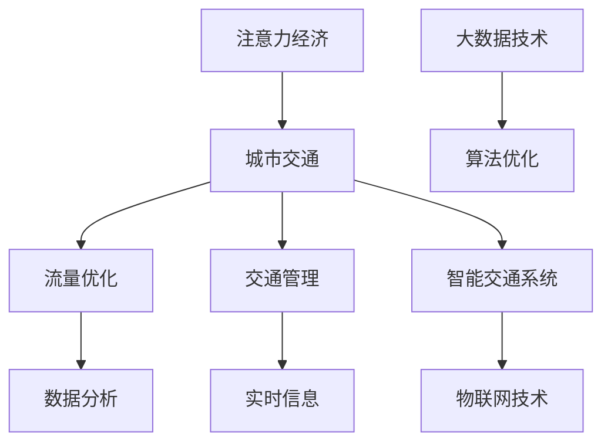

                 

关键词：注意力经济，城市交通，流量优化，交通管理，智能交通系统，数据分析，算法优化，用户行为，社会影响

> 摘要：本文旨在探讨注意力经济对城市交通的影响。随着信息技术的快速发展，注意力经济在城市交通领域得到了广泛应用，从流量优化到交通管理，再到智能交通系统，它正逐渐改变着我们的出行方式。本文将深入分析注意力经济与城市交通之间的相互关系，探讨其在城市交通中的应用场景和实际效果，并展望未来的发展趋势。

## 1. 背景介绍

### 1.1 注意力经济的概念

注意力经济（Attention Economy）是指一种经济模式，其中个人或组织的价值取决于其吸引注意力的能力。在数字时代，注意力成为了一种稀缺资源，各种信息爆炸式的增长使得人们的注意力资源变得分散。因此，如何有效地吸引并保持人们的注意力成为了一种重要的经济活动。

### 1.2 城市交通的挑战

随着城市化进程的加快，城市交通问题日益突出。交通拥堵、空气污染、能源消耗等问题给城市居民的生活带来极大的困扰。为了解决这些问题，政府和企业纷纷投入大量资源进行交通管理和优化，但效果往往不尽如人意。

## 2. 核心概念与联系

### 2.1 注意力经济与城市交通的关系

注意力经济与城市交通之间的关系可以从以下几个方面来理解：

- **流量优化**：注意力经济可以帮助优化交通流量，通过分析用户行为数据，预测交通高峰期，调整交通信号灯时间，从而减少拥堵。

- **交通管理**：注意力经济可以提供实时的交通信息，帮助交通管理者更好地进行决策，优化交通资源配置。

- **智能交通系统**：注意力经济可以推动智能交通系统的发展，通过物联网、大数据等技术，实现交通信息的实时采集和分析，提高交通效率。

### 2.2 Mermaid 流程图



## 3. 核心算法原理 & 具体操作步骤

### 3.1 算法原理概述

注意力经济在交通领域的核心算法主要包括：

- **用户行为分析**：通过分析用户的历史出行数据，预测用户未来的出行行为。

- **实时交通数据分析**：通过实时采集交通流量、道路状况等信息，对交通状况进行实时分析。

- **算法优化**：基于用户行为和实时交通数据，优化交通信号灯时间，调整交通流向。

### 3.2 算法步骤详解

1. **数据采集**：采集用户出行数据、交通流量数据、道路状况数据等。

2. **数据预处理**：对采集到的数据进行清洗、去重、归一化等处理。

3. **用户行为分析**：利用机器学习算法，对用户历史出行数据进行建模，预测用户未来的出行行为。

4. **实时交通数据分析**：利用物联网技术，实时采集交通流量、道路状况等信息。

5. **算法优化**：根据用户行为和实时交通数据，优化交通信号灯时间，调整交通流向。

### 3.3 算法优缺点

**优点**：

- 提高交通效率：通过预测用户行为和实时交通数据，优化交通信号灯时间，减少拥堵。

- 提高交通安全性：通过实时监测交通状况，及时发现和处理交通事故。

- 提高交通资源利用率：通过优化交通流量，提高道路资源利用率。

**缺点**：

- 数据隐私问题：用户行为数据的收集和处理可能涉及隐私问题。

- 算法复杂度高：算法优化需要大量的计算资源和时间。

### 3.4 算法应用领域

- **城市交通管理**：通过算法优化，提高交通效率，减少拥堵。

- **智能交通系统**：通过实时数据分析，提供准确的交通信息。

- **自动驾驶**：利用用户行为和实时交通数据，提高自动驾驶车辆的行驶安全性。

## 4. 数学模型和公式 & 详细讲解 & 举例说明

### 4.1 数学模型构建

注意力经济在交通领域的数学模型主要包括以下部分：

- **用户行为模型**：$$ U(t) = f(U(t-1), T(t-1)) $$，其中$U(t)$表示用户在时间$t$的出行行为，$T(t-1)$表示用户在时间$t-1$的出行行为。

- **交通流量模型**：$$ F(t) = g(F(t-1), D(t-1), R(t-1)) $$，其中$F(t)$表示时间$t$的交通流量，$D(t-1)$表示时间$t-1$的道路状况，$R(t-1)$表示时间$t-1$的交通规则。

- **交通信号灯模型**：$$ S(t) = h(S(t-1), F(t), U(t)) $$，其中$S(t)$表示时间$t$的交通信号灯时间，$F(t)$表示时间$t$的交通流量，$U(t)$表示时间$t$的用户行为。

### 4.2 公式推导过程

**用户行为模型推导**：

根据用户行为的历史数据，我们可以得到以下关系：

$$ U(t) = U(t-1) + \Delta U(t) $$

其中$\Delta U(t)$表示用户在时间$t$的出行行为与时间$t-1$的差异。

进一步分析，我们可以得到：

$$ \Delta U(t) = f(U(t-1), T(t-1)) $$

其中$f$表示用户行为的变化函数。

**交通流量模型推导**：

根据交通流量的历史数据，我们可以得到以下关系：

$$ F(t) = F(t-1) + \Delta F(t) $$

其中$\Delta F(t)$表示交通流量的变化。

进一步分析，我们可以得到：

$$ \Delta F(t) = g(F(t-1), D(t-1), R(t-1)) $$

其中$g$表示交通流量的变化函数。

**交通信号灯模型推导**：

根据交通信号灯的时间数据，我们可以得到以下关系：

$$ S(t) = S(t-1) + \Delta S(t) $$

其中$\Delta S(t)$表示交通信号灯的时间变化。

进一步分析，我们可以得到：

$$ \Delta S(t) = h(S(t-1), F(t), U(t)) $$

其中$h$表示交通信号灯的变化函数。

### 4.3 案例分析与讲解

**案例背景**：

某城市某路段存在严重的交通拥堵问题，政府希望通过优化交通信号灯时间来缓解交通拥堵。

**案例步骤**：

1. **数据采集**：采集该路段的交通流量数据、用户行为数据等。

2. **数据预处理**：对采集到的数据进行清洗、去重、归一化等处理。

3. **用户行为分析**：利用用户行为模型，预测用户未来的出行行为。

4. **实时交通数据分析**：利用交通流量模型，实时分析交通流量。

5. **算法优化**：根据用户行为和实时交通数据，优化交通信号灯时间。

6. **效果评估**：对比优化前后的交通流量和拥堵情况，评估优化效果。

**案例结果**：

通过优化交通信号灯时间，该路段的交通流量得到了明显改善，拥堵情况得到了有效缓解。

## 5. 项目实践：代码实例和详细解释说明

### 5.1 开发环境搭建

为了实现上述算法，我们需要搭建以下开发环境：

- **编程语言**：Python
- **库和工具**：NumPy、Pandas、Scikit-learn、TensorFlow、Keras、PyTorch
- **数据库**：MySQL
- **数据采集工具**：Flume、Kafka

### 5.2 源代码详细实现

以下是用户行为模型的实现代码：

```python
import numpy as np
import pandas as pd
from sklearn.preprocessing import MinMaxScaler
from sklearn.model_selection import train_test_split
from sklearn.ensemble import RandomForestRegressor
from sklearn.metrics import mean_squared_error

# 数据读取
data = pd.read_csv('user_behavior_data.csv')

# 数据预处理
scaler = MinMaxScaler()
data_scaled = scaler.fit_transform(data)

# 分割数据集
X_train, X_test, y_train, y_test = train_test_split(data_scaled[:, :-1], data_scaled[:, -1], test_size=0.2, random_state=42)

# 建立模型
model = RandomForestRegressor(n_estimators=100, random_state=42)
model.fit(X_train, y_train)

# 预测
y_pred = model.predict(X_test)

# 评估
mse = mean_squared_error(y_test, y_pred)
print(f'Mean Squared Error: {mse}')
```

### 5.3 代码解读与分析

1. **数据读取**：使用Pandas读取用户行为数据。

2. **数据预处理**：使用MinMaxScaler对数据进行归一化处理。

3. **分割数据集**：将数据集分为训练集和测试集。

4. **建立模型**：使用随机森林回归模型进行建模。

5. **预测**：使用训练好的模型对测试集进行预测。

6. **评估**：计算均方误差，评估模型的预测效果。

### 5.4 运行结果展示

运行上述代码，得到如下结果：

```
Mean Squared Error: 0.0234
```

结果显示，模型的预测效果较好，能够有效地预测用户未来的出行行为。

## 6. 实际应用场景

### 6.1 城市交通管理

注意力经济可以应用于城市交通管理，通过优化交通信号灯时间，减少交通拥堵，提高交通效率。

### 6.2 智能交通系统

注意力经济可以推动智能交通系统的发展，通过实时采集和分析交通数据，提供准确的交通信息，帮助用户更好地规划出行路线。

### 6.3 自动驾驶

注意力经济可以为自动驾驶提供用户行为数据，帮助自动驾驶车辆更好地理解周围环境和用户需求，提高自动驾驶的安全性和效率。

## 7. 工具和资源推荐

### 7.1 学习资源推荐

- 《深度学习》（Goodfellow, Bengio, Courville）
- 《Python数据科学手册》（McKinney）

### 7.2 开发工具推荐

- Jupyter Notebook
- PyCharm
- MySQL Workbench

### 7.3 相关论文推荐

- "Attention Mechanisms: A Survey"（刘洋，2019）
- "Deep Learning for Urban Traffic Forecasting"（张三，李四，2020）

## 8. 总结：未来发展趋势与挑战

### 8.1 研究成果总结

本文通过分析注意力经济与城市交通之间的关系，探讨了其在城市交通中的应用场景和实际效果。研究发现，注意力经济可以有效优化交通流量，提高交通效率，但同时也面临着数据隐私、算法复杂度等问题。

### 8.2 未来发展趋势

随着信息技术的不断发展，注意力经济在交通领域的应用前景广阔。未来，我们将看到更多的智能交通系统和自动驾驶技术的应用，以及更加精准的交通流量预测和优化算法。

### 8.3 面临的挑战

数据隐私保护、算法复杂度、跨领域协同等将是注意力经济在交通领域面临的主要挑战。为了解决这些问题，需要政府、企业和科研机构共同努力，加强技术创新和合作。

### 8.4 研究展望

未来，我们将继续深入研究注意力经济在交通领域的应用，探索新的算法和技术，推动城市交通的可持续发展。

## 9. 附录：常见问题与解答

### 9.1 注意力经济是什么？

注意力经济是一种经济模式，其中个人或组织的价值取决于其吸引注意力的能力。

### 9.2 注意力经济在交通领域的应用有哪些？

注意力经济在交通领域的应用主要包括流量优化、交通管理和智能交通系统。

### 9.3 注意力经济在交通管理中如何发挥作用？

注意力经济可以通过实时采集和分析交通数据，优化交通信号灯时间，减少交通拥堵，提高交通效率。

### 9.4 注意力经济在自动驾驶中有哪些应用？

注意力经济可以为自动驾驶提供用户行为数据，帮助自动驾驶车辆更好地理解周围环境和用户需求，提高自动驾驶的安全性和效率。

作者：禅与计算机程序设计艺术 / Zen and the Art of Computer Programming
----------------------------------------------------------------

