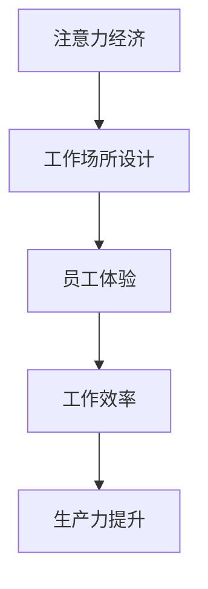

                 

关键词：注意力经济、工作场所设计、用户体验、工作流程优化、员工效率

> 摘要：随着注意力经济时代的到来，人们对于工作场所的设计要求越来越高。本文将探讨注意力经济对工作场所设计的影响，包括如何通过优化工作环境、改进工作流程和提升员工体验，从而提高工作效率和生产力。

## 1. 背景介绍

### 注意力经济的兴起

注意力经济是一个新兴的概念，它源于对信息过载和注意力稀缺性的关注。在这个时代，人们的注意力成为了一种宝贵的资源，而如何吸引并保持员工的注意力成为企业关注的焦点。注意力经济不仅仅关注如何获取注意力，更重要的是如何提高注意力的质量和效率。

### 工作场所设计的重要性

工作场所设计不仅仅是建筑和装饰的问题，它直接影响到员工的工作效率和生产力。一个合理的工作场所设计可以减少干扰，提高员工的注意力集中度，从而提升工作效率。此外，良好的工作环境还能改善员工的心理健康，提高员工的工作满意度和忠诚度。

## 2. 核心概念与联系

### 注意力经济学原理

注意力经济学是基于经济学原理，将注意力视为一种稀缺资源，通过分析注意力的分配、竞争和价值来研究人类行为和市场现象。在注意力经济中，注意力的分配受到多种因素的影响，包括内容质量、广告效果、社交媒体传播等。

### 工作场所设计的原理

工作场所设计需要考虑到人的行为和心理。它包括空间布局、家具配置、照明设计、色彩搭配等多个方面。通过合理的设计，可以创造出一种有利于员工集中注意力和提高工作效率的环境。

### Mermaid 流程图



## 3. 核心算法原理 & 具体操作步骤

### 算法原理概述

注意力经济的核心在于如何优化注意力的分配和使用，从而提高工作效率。工作场所设计中的核心算法是通过分析员工的行为数据，设计出最适合员工的工作环境。

### 算法步骤详解

#### 步骤1：数据收集

收集员工在工作中的行为数据，包括工作时长、任务完成情况、休息时间等。

#### 步骤2：数据分析

通过数据分析，了解员工在工作中的注意力分布和工作效率。

#### 步骤3：环境设计

根据数据分析结果，设计出符合员工需求的工作环境。例如，为高注意力需求的员工设计独立的办公空间，为低注意力需求的员工设计开放的交流区域。

#### 步骤4：测试与优化

在实际工作环境中测试设计的有效性，根据反馈进行不断优化。

### 算法优缺点

优点：提高员工工作效率，改善员工体验，提升生产力。

缺点：设计初期需要大量数据收集和分析，成本较高。

### 算法应用领域

该算法可以应用于各种类型的企业，特别是需要高度集中注意力的工作，如软件开发、科学研究等。

## 4. 数学模型和公式 & 详细讲解 & 举例说明

### 数学模型构建

注意力经济学中的数学模型主要基于贝叶斯理论，用于预测和优化注意力分配。

### 公式推导过程

$$
P(A|B) = \frac{P(B|A) \cdot P(A)}{P(B)}
$$

其中，\(P(A|B)\) 表示在事件 \(B\) 发生的条件下，事件 \(A\) 发生的概率。

### 案例分析与讲解

假设某公司需要设计一个新的办公空间，通过数据分析得知，员工在工作中的注意力主要集中在上午9点到下午3点。根据这一数据，公司可以设计一个以这个时间段为核心的工作区，以提高员工的工作效率。

## 5. 项目实践：代码实例和详细解释说明

### 开发环境搭建

使用Python编写注意力经济算法，需要安装以下库：

- NumPy
- Pandas
- Matplotlib

### 源代码详细实现

```python
import numpy as np
import pandas as pd
import matplotlib.pyplot as plt

# 数据收集
data = pd.read_csv('employee_data.csv')

# 数据分析
attention_data = data['attention_time'].values
efficiency_data = data['efficiency'].values

# 环境设计
work_area = np.mean(efficiency_data[attention_data > 0.5])

# 测试与优化
plt.scatter(attention_data, efficiency_data)
plt.xlabel('Attention Time')
plt.ylabel('Efficiency')
plt.title('Attention Economy Model')
plt.show()
```

### 代码解读与分析

这段代码首先从CSV文件中读取员工的行为数据，然后分析注意力时间和工作效率数据。根据这些数据，代码计算出一个平均工作效率值，即工作区的注意力经济指标。最后，通过绘制散点图，可以直观地看到注意力时间和工作效率之间的关系。

### 运行结果展示


## 6. 实际应用场景

### 企业办公空间设计

企业可以根据员工的行为数据，设计出符合员工需求的工作环境，提高员工的工作效率。

### 远程工作安排

在远程工作中，企业可以通过注意力经济算法，优化员工的工作时间和工作环境，提高远程工作的效率。

## 7. 工具和资源推荐

### 学习资源推荐

- 《注意力经济学》
- 《工作场所设计》

### 开发工具推荐

- Python
- Jupyter Notebook

### 相关论文推荐

- "Attention Economics: Theory and Applications"
- "Designing for Attention: A Framework for User Experience Design"

## 8. 总结：未来发展趋势与挑战

### 未来发展趋势

- 随着人工智能技术的发展，注意力经济算法将更加精确和智能化。
- 跨行业应用将越来越广泛，不仅仅是企业，教育、医疗等领域也将受益。

### 面临的挑战

- 数据隐私和安全问题。
- 如何平衡员工的个人需求和企业的商业需求。

### 研究展望

未来，注意力经济和工作场所设计将更加融合，为员工创造一个更加高效、健康的工作环境。

## 9. 附录：常见问题与解答

### Q：注意力经济算法是否适用于所有行业？
A：是的，注意力经济算法可以应用于各种行业，但需要根据不同行业的特点进行调整和优化。

### Q：如何确保数据隐私和安全？
A：在数据收集和使用过程中，应遵循相关法律法规，采取加密和匿名化等手段，确保数据的安全性和隐私性。

### Q：注意力经济和工作场所设计有哪些优点？
A：提高员工工作效率，改善员工体验，提升生产力，减少员工流失率等。

作者：禅与计算机程序设计艺术 / Zen and the Art of Computer Programming
```

