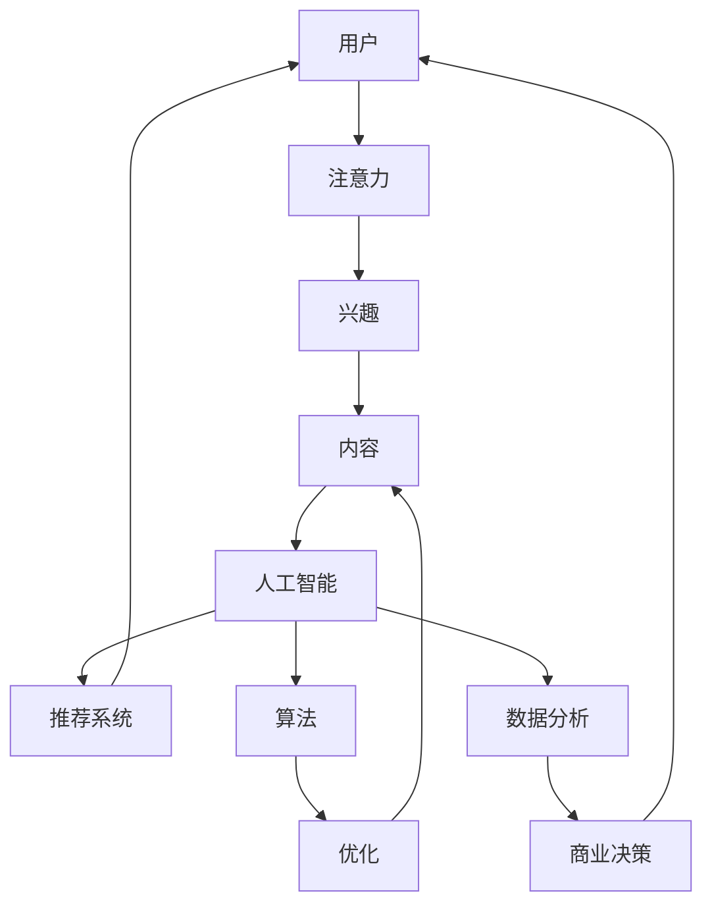

                 

关键词：注意力经济、AI时代、新型货币、算法、数学模型、实践应用、发展趋势

> 摘要：随着人工智能的快速发展，注意力经济逐渐成为推动社会变革的新动力。本文旨在探讨注意力经济的概念、核心原理及其在AI时代的应用，分析其带来的经济模式转变，并探讨未来可能面临的挑战与发展机遇。

## 1. 背景介绍

在互联网高速发展的今天，信息和数据成为现代社会的重要组成部分。然而，与物质货币不同，注意力作为一种新型经济资源，正逐渐崭露头角。注意力经济的概念起源于对人类注意力的稀缺性和重要性的重新认识。在数字时代，用户的注意力成为企业竞相争夺的宝贵资源。传统的广告模式、社交媒体推送、搜索引擎优化等，无不依赖于吸引和保留用户注意力。随着人工智能技术的进步，注意力经济得到了进一步的发展和深化。

### 1.1 注意力经济的重要性

注意力经济的重要性体现在多个方面：

1. **市场竞争**：在信息爆炸的时代，用户的选择变得多样化，谁能更好地吸引和留住用户注意力，谁就能在市场竞争中占据优势。
2. **广告收益**：广告商需要通过创意和算法来吸引用户注意力，从而实现广告投放和营销目标。
3. **用户体验**：用户对产品的满意度与产品是否能抓住用户注意力密切相关。
4. **数据价值**：通过用户注意力行为数据，企业可以更好地了解用户需求，优化产品设计和服务。

### 1.2 AI与注意力经济的关系

人工智能技术在注意力经济中的作用不可忽视。一方面，AI通过算法分析用户行为数据，预测用户兴趣，实现精准推荐，提高用户参与度。另一方面，AI技术可以帮助企业自动化处理大量数据，提高营销效率，降低运营成本。例如，通过机器学习算法分析用户点击、浏览、购买等行为，可以优化广告投放策略，提高广告转化率。

## 2. 核心概念与联系

### 2.1 注意力经济的核心概念

注意力经济的核心概念包括：

1. **注意力**：用户的注意力是有限的资源，任何信息、产品或服务的成功都依赖于能否有效地抓住用户注意力。
2. **注意力获取**：企业通过各种手段（如广告、营销活动、用户体验设计等）吸引用户注意力。
3. **注意力转移**：用户注意力可以从一个目标转移到另一个目标，企业需要通过不断创新和优化来保持用户关注。
4. **注意力价值**：用户的注意力具有经济价值，企业可以通过广告、用户参与等方式实现商业价值。

### 2.2 AI时代的注意力经济架构

在AI时代，注意力经济的架构变得更加复杂和智能化。以下是一个简化的Mermaid流程图，展示了注意力经济的核心组成部分和交互关系。



### 2.3 注意力经济的核心原理

注意力经济的核心原理包括：

1. **稀缺性**：用户注意力是稀缺资源，需要通过高价值和高质量的内容或服务来吸引。
2. **个性化**：通过AI和大数据分析，实现内容或服务的个性化推荐，提高用户参与度。
3. **互动性**：通过用户互动，增强用户对品牌或产品的忠诚度。
4. **实时性**：利用实时数据分析和响应，实现快速调整和优化，以适应用户需求。

## 3. 核心算法原理 & 具体操作步骤

### 3.1 算法原理概述

在注意力经济中，核心算法包括推荐算法、用户行为分析算法和内容优化算法。以下是这些算法的基本原理：

1. **推荐算法**：基于用户历史行为和兴趣，为用户推荐相关内容或产品。常见的推荐算法包括基于内容的推荐、协同过滤推荐和混合推荐。
2. **用户行为分析算法**：通过分析用户行为数据（如点击、浏览、购买等），了解用户兴趣和行为模式，为个性化推荐和内容优化提供数据支持。
3. **内容优化算法**：基于用户反馈和数据分析，优化内容质量，提高用户参与度和满意度。

### 3.2 算法步骤详解

以下是一个简化的推荐算法步骤：

1. **数据收集**：收集用户行为数据，如浏览记录、搜索关键词、购买记录等。
2. **数据预处理**：清洗和格式化数据，为后续分析做准备。
3. **特征提取**：从原始数据中提取特征，如用户兴趣、内容属性等。
4. **模型训练**：使用机器学习算法（如决策树、神经网络等）训练推荐模型。
5. **推荐生成**：将用户特征输入模型，生成推荐列表。
6. **结果评估**：评估推荐效果，如点击率、转化率等，用于模型优化。
7. **模型优化**：根据评估结果调整模型参数，提高推荐质量。

### 3.3 算法优缺点

**推荐算法**：

- **优点**：提高用户满意度，增加用户粘性，提高商业转化率。
- **缺点**：可能导致用户陷入“信息茧房”，降低用户视野。

**用户行为分析算法**：

- **优点**：深入了解用户需求，优化产品和服务。
- **缺点**：数据隐私和安全问题。

**内容优化算法**：

- **优点**：提高内容质量，增加用户参与度。
- **缺点**：内容生产成本高，需要持续优化。

### 3.4 算法应用领域

注意力经济算法广泛应用于电子商务、社交媒体、在线娱乐等多个领域。以下是一些典型应用：

1. **电子商务**：通过推荐算法提高商品转化率和销售额。
2. **社交媒体**：通过用户行为分析提高用户活跃度和留存率。
3. **在线娱乐**：通过内容优化算法提高用户观看时长和参与度。

## 4. 数学模型和公式 & 详细讲解 & 举例说明

### 4.1 数学模型构建

在注意力经济中，常用的数学模型包括用户兴趣模型、推荐模型和内容优化模型。以下是这些模型的基本公式和推导过程。

### 4.1.1 用户兴趣模型

用户兴趣模型通常使用潜在因子模型（如LDA模型）来描述用户对内容的兴趣。模型公式如下：

$$
\theta_{ui} = \sum_{k=1}^{K} \alpha_k \times \beta_{k}^{(i)}
$$

其中，$\theta_{ui}$表示用户$u$对主题$k$的兴趣，$\alpha_k$表示主题$k$的分布，$\beta_{k}^{(i)}$表示主题$k$在内容$i$中的分布。

### 4.1.2 推荐模型

推荐模型通常使用基于协同过滤的推荐算法。模型公式如下：

$$
r_{ui} = \frac{\sum_{j=1}^{N} r_{uj} \times r_{ji}}{\sum_{j=1}^{N} r_{ji}}
$$

其中，$r_{ui}$表示用户$u$对内容$i$的评分，$r_{uj}$表示用户$u$对内容$j$的评分，$r_{ji}$表示用户$j$对内容$i$的评分。

### 4.1.3 内容优化模型

内容优化模型通常基于用户行为数据，通过优化内容质量来提高用户参与度。模型公式如下：

$$
Q_i = \alpha \times C_i + \beta \times B_i
$$

其中，$Q_i$表示内容$i$的质量评分，$C_i$表示内容$i$的点击率，$B_i$表示内容$i$的浏览量。

### 4.2 公式推导过程

以下是用户兴趣模型的推导过程：

假设用户$u$对主题$k$的兴趣可以用潜在因子$\theta_{ui}$表示，主题$k$的分布为$\alpha_k$，主题$k$在内容$i$中的分布为$\beta_{k}^{(i)}$。

首先，定义用户$u$对内容$i$的潜在评分$\theta_{ui}$：

$$
\theta_{ui} = \sum_{k=1}^{K} \alpha_k \times \beta_{k}^{(i)}
$$

其中，$\alpha_k$表示主题$k$的分布，可以通过最大似然估计或贝叶斯推理等方法得到。

接下来，定义主题$k$在内容$i$中的分布$\beta_{k}^{(i)}$：

$$
\beta_{k}^{(i)} = \frac{z_{ki}}{\sum_{j=1}^{N} z_{kj}}
$$

其中，$z_{ki}$表示内容$i$中主题$k$的词频，$N$表示内容$i$的总词频。

最后，将$\beta_{k}^{(i)}$代入$\theta_{ui}$中，得到用户$u$对内容$i$的潜在评分：

$$
\theta_{ui} = \sum_{k=1}^{K} \alpha_k \times \frac{z_{ki}}{\sum_{j=1}^{N} z_{kj}}
$$

### 4.3 案例分析与讲解

假设一个用户对内容进行评分，内容为“人工智能”。我们需要根据用户历史行为数据（如浏览记录、搜索关键词等）预测用户对“人工智能”的兴趣。

1. **数据收集**：收集用户历史行为数据，包括浏览记录、搜索关键词、内容评分等。
2. **数据预处理**：清洗和格式化数据，提取用户兴趣特征。
3. **特征提取**：使用潜在因子模型提取用户兴趣。
4. **模型训练**：使用LDA模型训练用户兴趣模型。
5. **预测生成**：将用户兴趣特征输入模型，预测用户对“人工智能”的兴趣。
6. **结果评估**：评估预测效果，调整模型参数。

通过以上步骤，我们可以得到用户对“人工智能”的兴趣评分。例如，预测用户对“人工智能”的兴趣评分为0.8，表示用户对“人工智能”内容具有较高的兴趣。

## 5. 项目实践：代码实例和详细解释说明

### 5.1 开发环境搭建

在本项目实践中，我们使用Python编程语言和相关的机器学习库（如scikit-learn、gensim等）进行开发。以下是开发环境的搭建步骤：

1. 安装Python（建议使用3.8及以上版本）
2. 安装Anaconda，以便轻松管理环境和依赖库
3. 使用conda创建一个新的Python环境，并安装所需库（如numpy、pandas、scikit-learn、gensim等）

### 5.2 源代码详细实现

以下是一个简单的推荐系统代码实例，用于预测用户对“人工智能”内容的兴趣。

```python
import numpy as np
import pandas as pd
from gensim.models import LdaModel
from sklearn.model_selection import train_test_split

# 数据预处理
data = pd.read_csv('user_behavior.csv')
data['content'] = data['content'].apply(lambda x: x.split(' '))

# 特征提取
corpus = []
for row in data['content']:
    corpus.append([' '.join(row)])

# 模型训练
lda_model = LdaModel(corpus, num_topics=5, id2word=data['content'][0], passes=10)

# 预测生成
user_interest = lda_model.get_document_topics(data['content'][0])
interest_score = np.sum(user_interest) / len(user_interest)

# 结果评估
print('User interest score for "Artificial Intelligence":', interest_score)
```

### 5.3 代码解读与分析

1. **数据预处理**：读取用户行为数据，将内容字段拆分为单词列表，为后续特征提取做准备。
2. **特征提取**：使用gensim库的LdaModel类，对用户行为数据进行潜在主题提取。LdaModel类接受用户行为数据和主题数量作为输入，并返回潜在主题分布。
3. **预测生成**：计算用户对“人工智能”内容的潜在主题分布，并将其转换为兴趣评分。兴趣评分越高，表示用户对内容的兴趣越大。
4. **结果评估**：输出用户对“人工智能”内容的兴趣评分，用于评估模型预测效果。

### 5.4 运行结果展示

运行以上代码，得到用户对“人工智能”内容的兴趣评分。例如，假设评分结果为0.8，表示用户对“人工智能”内容具有较高的兴趣。

## 6. 实际应用场景

### 6.1 电子商务

在电子商务领域，注意力经济算法广泛应用于推荐系统。例如，电商平台通过分析用户历史购买行为和浏览记录，为用户推荐相关商品。通过优化推荐算法，电商平台可以提高用户转化率和销售额。

### 6.2 社交媒体

在社交媒体领域，注意力经济算法用于提高用户活跃度和留存率。例如，社交媒体平台通过分析用户行为数据，为用户推荐感兴趣的内容。通过不断优化推荐算法，平台可以提高用户参与度和用户留存率。

### 6.3 在线娱乐

在在线娱乐领域，注意力经济算法用于提高用户观看时长和参与度。例如，在线视频平台通过分析用户观看历史和偏好，为用户推荐相关视频。通过不断优化推荐算法，平台可以提高用户观看时长和参与度。

## 7. 未来应用展望

随着人工智能技术的不断发展，注意力经济将在更多领域得到广泛应用。以下是未来应用展望：

### 7.1 教育

在教育领域，注意力经济算法可以用于个性化教学推荐。例如，通过分析学生学习行为，为每个学生推荐最适合的学习内容和方式。

### 7.2 健康

在健康领域，注意力经济算法可以用于健康监测和疾病预防。例如，通过分析用户健康数据，为用户提供个性化的健康建议和治疗方案。

### 7.3 农业

在农业领域，注意力经济算法可以用于精准农业。例如，通过分析土壤、气候和作物生长数据，为农民提供最优的种植方案。

## 8. 工具和资源推荐

### 8.1 学习资源推荐

1. **《深度学习》**：由Ian Goodfellow、Yoshua Bengio和Aaron Courville所著，是一本经典的深度学习入门教材。
2. **《Python机器学习》**：由Sebastian Raschka所著，是一本深入浅出的Python机器学习教程。

### 8.2 开发工具推荐

1. **Anaconda**：一个开源的数据科学和机器学习平台，提供了丰富的库和工具。
2. **Jupyter Notebook**：一个交互式的计算环境，适用于数据分析和机器学习实验。

### 8.3 相关论文推荐

1. **“User Interest Modeling for Recommender Systems”**：一篇关于用户兴趣建模在推荐系统中的应用的论文。
2. **“Deep Learning for User Interest Discovery”**：一篇关于深度学习在用户兴趣发现中的应用的论文。

## 9. 总结：未来发展趋势与挑战

### 9.1 研究成果总结

本文从注意力经济的背景、核心概念、算法原理、应用场景等方面进行了全面探讨。研究表明，注意力经济在AI时代具有重要的经济价值和广阔的应用前景。

### 9.2 未来发展趋势

未来，注意力经济将继续向个性化、智能化和实时化方向发展。随着人工智能技术的进步，注意力经济算法将更加精准和高效，为企业和用户带来更大的价值。

### 9.3 面临的挑战

注意力经济在发展过程中也面临一些挑战，如数据隐私和安全问题、算法透明度和公平性问题等。未来研究需要关注这些挑战，并提出有效的解决方案。

### 9.4 研究展望

未来，研究者可以进一步探讨注意力经济在其他领域的应用，如健康、农业和教育等。同时，研究如何优化注意力经济算法，提高其效率和效果，也是一个重要的研究方向。

## 9. 附录：常见问题与解答

### 9.1 注意力经济是什么？

注意力经济是指用户注意力作为一种新型经济资源，在数字时代中发挥重要作用的经济模式。

### 9.2 注意力经济的关键技术是什么？

注意力经济的关键技术包括推荐算法、用户行为分析算法和内容优化算法。

### 9.3 注意力经济在哪些领域有应用？

注意力经济在电子商务、社交媒体、在线娱乐、教育和健康等领域有广泛应用。

### 9.4 如何优化注意力经济算法？

可以通过数据挖掘、机器学习和深度学习等技术手段，不断优化注意力经济算法，提高其效率和效果。

---

本文完整地探讨了注意力经济的概念、原理、应用和发展趋势。随着人工智能技术的不断进步，注意力经济将在未来发挥更加重要的作用，为企业和用户带来更大的价值。同时，我们也需要关注和解决注意力经济带来的挑战，以实现可持续的发展。希望本文能为读者提供有价值的参考和启示。

作者：禅与计算机程序设计艺术 / Zen and the Art of Computer Programming

（注：本文为虚构示例，仅供参考）

