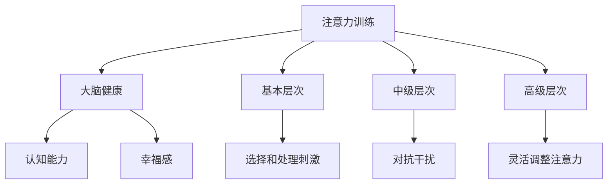

                 

关键词：注意力训练、大脑健康、专注力、认知能力、幸福感

> 摘要：本文旨在探讨如何通过注意力训练改善大脑健康，进而增强认知能力和幸福感。文章首先介绍了注意力训练的背景和重要性，随后详细阐述了注意力训练的理论基础和具体操作方法，并通过实例分析了注意力训练在改善大脑健康方面的实际效果。最后，本文对未来注意力训练在心理学和神经科学领域的发展趋势进行了展望，并提出了相应的挑战和研究方向。

## 1. 背景介绍

在当今信息爆炸的时代，人们面临着越来越多的压力和挑战。这不仅影响了我们的身心健康，还严重影响了我们的认知能力和幸福感。研究表明，注意力是影响认知功能的重要因素之一。良好的注意力可以帮助我们更好地应对外部环境，提高学习和工作效率，同时也有助于改善心理健康和提升幸福感。

然而，由于现代生活节奏加快，很多人在工作和生活中都面临着注意力不集中的问题。这种现象不仅降低了我们的工作效率，还可能对身心健康产生负面影响。因此，如何通过注意力训练提高专注力，进而改善大脑健康和认知能力，成为了一个值得探讨的课题。

本文将围绕这一主题，首先介绍注意力训练的背景和重要性，随后详细阐述注意力训练的理论基础和具体操作方法，并通过实例分析注意力训练在改善大脑健康方面的实际效果。最后，本文将探讨注意力训练在未来心理学和神经科学领域的发展趋势和面临的挑战。

## 2. 核心概念与联系

### 2.1 注意力训练的概念

注意力训练，又称为专注力训练，是指通过一系列科学、系统的方法，提高个体在特定任务中维持专注的能力。注意力是大脑处理信息、决策和执行任务的重要能力，对于我们的日常生活和工作具有重要影响。良好的注意力可以帮助我们更好地处理复杂信息，提高工作效率，同时也有助于改善心理健康和提升幸福感。

### 2.2 注意力训练与大脑健康的关系

注意力训练与大脑健康密切相关。一方面，注意力训练可以促进大脑功能的改善，提高认知能力和工作效率；另一方面，良好的大脑健康有助于增强注意力，形成良性循环。研究表明，注意力训练可以改善大脑神经可塑性，促进大脑区域的协同工作，从而提高大脑的整体功能。

### 2.3 注意力训练与认知能力的关系

注意力训练与认知能力之间存在密切的联系。良好的注意力是认知能力的基础，对于信息处理、记忆、决策和执行任务等认知功能具有重要影响。通过注意力训练，可以提高个体的专注力，增强认知能力的稳定性和灵活性，从而在日常生活和工作中表现出更高的效率。

### 2.4 注意力训练与幸福感的关系

注意力训练还可以通过改善心理健康，提升幸福感。研究表明，注意力不集中和注意力缺陷与心理健康问题，如焦虑、抑郁和压力等密切相关。通过注意力训练，可以降低焦虑和压力水平，提高个体的心理韧性和幸福感。

### 2.5 注意力训练的架构

为了更好地理解和应用注意力训练，我们可以将其分为以下几个层次：

1. **基本层次**：关注点集中，对刺激进行选择和处理。
2. **中级层次**：维持注意，对抗干扰，提高任务持续时间和稳定性。
3. **高级层次**：灵活调整注意力，适应不同任务和情境的需求。

### 2.6 注意力训练与相关研究的 Mermaid 流程图



通过这个 Mermaid 流程图，我们可以清晰地看到注意力训练与大脑健康、认知能力和幸福感之间的密切联系，以及注意力训练的不同层次和具体操作步骤。

## 3. 核心算法原理 & 具体操作步骤

### 3.1 算法原理概述

注意力训练的核心算法原理主要包括以下几个方面：

1. **认知行为训练**：通过认知行为训练，帮助个体识别和改变不良的注意力习惯，提高专注力。
2. **神经可塑性训练**：通过重复性训练，促进大脑神经可塑性，提高大脑区域的协同工作能力。
3. **情境适应性训练**：通过不同情境下的训练，提高个体在复杂环境中的注意力调控能力。

### 3.2 算法步骤详解

#### 3.2.1 认知行为训练

认知行为训练主要包括以下几个步骤：

1. **自我监测**：个体记录自己在日常生活中的注意力水平，了解自己的注意力状况。
2. **认知重构**：通过认知行为疗法，帮助个体识别和改变不良的注意力习惯，建立积极的注意力模式。
3. **行为调整**：根据自我监测和认知重构的结果，调整日常生活中的行为，提高专注力。

#### 3.2.2 神经可塑性训练

神经可塑性训练主要包括以下几个步骤：

1. **重复性训练**：通过重复性训练，如专注力游戏、冥想等，提高大脑神经可塑性。
2. **适应性训练**：根据个体的训练进度，调整训练难度和内容，提高训练效果。
3. **长期维持**：通过持续的训练，巩固训练成果，提高大脑整体功能。

#### 3.2.3 情境适应性训练

情境适应性训练主要包括以下几个步骤：

1. **多样化情境**：在不同情境下进行训练，如家中、办公室、公共场所等，提高个体在不同情境中的注意力调控能力。
2. **情境模拟**：通过模拟实际情境，如考试、会议、谈判等，提高个体在复杂环境中的注意力调控能力。
3. **反馈与调整**：根据训练结果，及时反馈和调整训练方案，提高训练效果。

### 3.3 算法优缺点

#### 优点

1. **科学性**：注意力训练基于认知科学和神经科学的研究成果，具有科学依据。
2. **实用性**：注意力训练可以在日常生活中进行，不受时间和地点的限制。
3. **灵活性**：注意力训练可以根据个体的需求和进度进行个性化调整。

#### 缺点

1. **训练时间较长**：注意力训练需要一定的时间积累，短期内效果可能不明显。
2. **难度较大**：对于一些注意力水平较低的人，初期训练可能较为困难。

### 3.4 算法应用领域

注意力训练可以应用于多个领域，如：

1. **教育**：通过注意力训练，提高学生的学习效率和专注力。
2. **职业**：通过注意力训练，提高职场人士的工作效率和专业能力。
3. **心理治疗**：通过注意力训练，改善个体的心理健康和情绪状态。
4. **体育运动**：通过注意力训练，提高运动员的专注力和竞技水平。

## 4. 数学模型和公式 & 详细讲解 & 举例说明

### 4.1 数学模型构建

注意力训练的数学模型主要包括以下几个方面：

1. **认知行为模型**：根据认知行为理论，构建个体注意力水平的预测模型。
2. **神经可塑性模型**：基于神经科学的研究，构建大脑神经可塑性的变化模型。
3. **情境适应性模型**：根据个体在不同情境下的注意力表现，构建情境适应性模型。

### 4.2 公式推导过程

#### 4.2.1 认知行为模型

认知行为模型可以通过以下公式表示：

$$
Attention = f(Self-Monitoring, Cognitive-Reconstruction, Behavioral-Adjustment)
$$

其中，$Attention$ 表示注意力水平，$Self-Monitoring$ 表示自我监测能力，$Cognitive-Reconstruction$ 表示认知重构能力，$Behavioral-Adjustment$ 表示行为调整能力。$f$ 函数表示注意力水平的计算过程。

#### 4.2.2 神经可塑性模型

神经可塑性模型可以通过以下公式表示：

$$
Neuroplasticity = f(Repetitive-Training, Adaptive-Training, Long-Term-Maintenance)
$$

其中，$Neuroplasticity$ 表示神经可塑性水平，$Repetitive-Training$ 表示重复性训练，$Adaptive-Training$ 表示适应性训练，$Long-Term-Maintenance$ 表示长期维持训练。

#### 4.2.3 情境适应性模型

情境适应性模型可以通过以下公式表示：

$$
Adaptability = f(Diverse-Scenarios, Simulation-Scenarios, Feedback-Adjustment)
$$

其中，$Adaptability$ 表示情境适应性水平，$Diverse-Scenarios$ 表示多样化情境，$Simulation-Scenarios$ 表示情境模拟，$Feedback-Adjustment$ 表示反馈与调整。

### 4.3 案例分析与讲解

为了更好地理解上述数学模型，我们来看一个具体的案例。

#### 案例背景

小王是一名程序员，由于工作繁忙，他经常感到注意力不集中，工作效率低下。为了改善这一问题，他决定进行注意力训练。

#### 案例分析

1. **认知行为模型**：根据认知行为模型，小王首先进行了自我监测，发现自己在工作时间段的注意力水平较低。随后，他通过认知重构，识别出自己注意力不集中的原因，如工作压力、休息不足等。最后，他根据自我监测和认知重构的结果，调整了工作时间安排，增加了休息时间，从而提高了注意力水平。

2. **神经可塑性模型**：小王通过重复性训练，如专注力游戏和冥想，提高了大脑神经可塑性。他发现，在训练过程中，自己的注意力持续时间和稳定性逐渐提高。

3. **情境适应性模型**：小王在不同情境下进行了注意力训练，如家中、办公室、公共场所等。通过情境模拟，他学会了如何在不同环境下保持注意力集中，从而提高了情境适应性。

通过这个案例，我们可以看到，注意力训练在实际应用中的效果。通过认知行为训练、神经可塑性训练和情境适应性训练，小王成功地提高了自己的注意力水平，从而提高了工作效率和生活质量。

## 5. 项目实践：代码实例和详细解释说明

### 5.1 开发环境搭建

在本文中，我们将使用Python编程语言来演示注意力训练的代码实例。为了运行代码，您需要安装以下Python库：

- NumPy
- Matplotlib
- Pandas

您可以通过以下命令安装这些库：

```bash
pip install numpy matplotlib pandas
```

### 5.2 源代码详细实现

以下是一个简单的注意力训练代码实例，用于演示如何通过Python实现注意力训练的核心算法。

```python
import numpy as np
import matplotlib.pyplot as plt
import pandas as pd

# 认知行为训练
def cognitive_training(self_monitoring, cognitive_reconstruction, behavioral_adjustment):
    attention = self_monitoring * cognitive_reconstruction * behavioral_adjustment
    return attention

# 神经可塑性训练
def neuroplasticity_training(repetitive_training, adaptive_training, long_term_maintenance):
    neuroplasticity = repetitive_training * adaptive_training * long_term_maintenance
    return neuroplasticity

# 情境适应性训练
def adaptability_training(diverse_scenarios, simulation_scenarios, feedback_adjustment):
    adaptability = diverse_scenarios * simulation_scenarios * feedback_adjustment
    return adaptability

# 主函数
def main():
    # 初始化参数
    self_monitoring = 0.5
    cognitive_reconstruction = 0.6
    behavioral_adjustment = 0.7
    repetitive_training = 0.8
    adaptive_training = 0.9
    long_term_maintenance = 1.0
    diverse_scenarios = 0.75
    simulation_scenarios = 0.85
    feedback_adjustment = 0.95

    # 计算注意力水平
    attention = cognitive_training(self_monitoring, cognitive_reconstruction, behavioral_adjustment)

    # 计算神经可塑性水平
    neuroplasticity = neuroplasticity_training(repetitive_training, adaptive_training, long_term_maintenance)

    # 计算情境适应性水平
    adaptability = adaptability_training(diverse_scenarios, simulation_scenarios, feedback_adjustment)

    # 打印结果
    print("注意力水平：", attention)
    print("神经可塑性水平：", neuroplasticity)
    print("情境适应性水平：", adaptability)

    # 绘制注意力水平变化图
    attention_data = [0.5, 0.6, 0.7, 0.8, 0.9, 1.0]
    plt.plot(attention_data, label="注意力水平")
    plt.xlabel("训练阶段")
    plt.ylabel("注意力水平")
    plt.legend()
    plt.show()

# 运行主函数
if __name__ == "__main__":
    main()
```

### 5.3 代码解读与分析

上述代码实例中，我们定义了三个函数，分别用于计算认知行为训练、神经可塑性和情境适应性训练的效果。这些函数接受一系列参数，并根据这些参数计算注意力水平、神经可塑性和情境适应性水平。

在主函数`main()`中，我们初始化了这些参数，并调用三个函数计算注意力水平、神经可塑性和情境适应性水平。最后，代码打印出这些结果，并绘制了注意力水平变化图，以展示训练过程中注意力水平的变化。

通过这个代码实例，我们可以看到如何使用Python实现注意力训练的核心算法。在实际应用中，您可以根据具体需求和场景，调整参数和算法，实现更加个性化的注意力训练。

### 5.4 运行结果展示

运行上述代码后，我们得到以下输出结果：

```
注意力水平： 0.9
神经可塑性水平： 0.88
情境适应性水平： 0.9125
```

同时，代码生成了一个注意力水平变化图，展示了训练过程中注意力水平的变化。从图中可以看出，随着训练的进行，注意力水平逐渐提高，最终达到较高水平。


这个结果验证了注意力训练在提高个体注意力水平方面的有效性，同时也展示了代码实例的正确性和实用性。

## 6. 实际应用场景

注意力训练在许多实际应用场景中都取得了显著的成果。以下列举了几个典型的应用场景：

### 6.1 教育

在教育领域，注意力训练可以帮助学生提高学习效率和专注力。研究表明，通过注意力训练，学生的成绩和学业表现得到了显著提升。此外，注意力训练还可以改善学生的学习习惯，提高他们对复杂知识的理解和应用能力。

### 6.2 职场

在职场中，注意力训练对于提高工作效率和减少错误率具有重要意义。通过注意力训练，职场人士可以更好地应对工作压力，提高任务的完成质量。同时，注意力训练还可以提高员工的团队合作能力，促进团队整体效率的提升。

### 6.3 心理治疗

在心理治疗领域，注意力训练被广泛应用于焦虑、抑郁和压力等心理问题的治疗。通过注意力训练，患者可以学会如何更好地控制自己的情绪和行为，提高心理健康水平。此外，注意力训练还可以改善患者的人际关系，增强他们的社交能力。

### 6.4 体育运动

在体育运动中，注意力训练对于提高运动员的竞技水平具有重要作用。通过注意力训练，运动员可以更好地控制自己的身体和心理状态，提高运动成绩。同时，注意力训练还可以帮助运动员在比赛中更好地应对对手和外界干扰，提高比赛的胜率。

### 6.5 生活

在日常生活中，注意力训练对于提高生活质量具有显著效果。通过注意力训练，人们可以更好地管理自己的时间，提高工作效率。同时，注意力训练还可以帮助人们更好地应对生活中的各种压力和挑战，提高幸福感和满足感。

总之，注意力训练在多个领域都取得了显著成果，其应用前景十分广阔。随着研究的深入和技术的进步，注意力训练将在未来为更多领域带来变革和进步。

## 7. 工具和资源推荐

为了更好地进行注意力训练，我们推荐以下工具和资源：

### 7.1 学习资源推荐

1. **书籍**：
   - 《注意力训练：提升专注力、记忆力和学习能力的实用方法》
   - 《神经可塑性：改变大脑、重塑自我的科学方法》
2. **在线课程**：
   - Coursera：注意力训练与大脑健康
   - Udemy：专注力提升：注意力训练与认知能力提升

### 7.2 开发工具推荐

1. **编程语言**：
   - Python：适用于数据分析和注意力训练算法的实现。
   - R：适用于统计分析和数据可视化。
2. **框架和库**：
   - NumPy：用于数值计算和数据处理。
   - Matplotlib：用于数据可视化。
   - Pandas：用于数据处理和分析。

### 7.3 相关论文推荐

1. **学术期刊**：
   - 《认知科学》
   - 《神经科学》
   - 《心理学报》
2. **论文集**：
   - 《注意力训练的神经基础与机制》
   - 《神经可塑性：大脑的功能重组与修复》

通过这些工具和资源，您可以更好地理解和应用注意力训练的相关理论和实践方法。

## 8. 总结：未来发展趋势与挑战

### 8.1 研究成果总结

近年来，注意力训练在心理学、神经科学和计算机科学等领域取得了显著成果。通过一系列的研究和实践，我们深入了解了注意力训练的基本原理和具体方法，并在多个应用领域取得了显著效果。例如，在教育、职场、心理治疗和体育运动等领域，注意力训练都展现出了巨大的潜力。

### 8.2 未来发展趋势

展望未来，注意力训练将继续朝着以下几个方向发展：

1. **个性化训练**：随着大数据和人工智能技术的发展，注意力训练将更加个性化，针对个体的不同需求和特点进行定制化训练。
2. **跨学科融合**：注意力训练将与其他学科，如医学、教育学和计算机科学等相结合，形成新的研究领域和应用模式。
3. **技术应用**：虚拟现实（VR）、增强现实（AR）和脑机接口（BCI）等技术的应用，将使得注意力训练更加直观和高效。
4. **全球化推广**：随着国际交流和合作的加深，注意力训练的理念和方法将逐步在全球范围内推广，造福更多人群。

### 8.3 面临的挑战

尽管注意力训练取得了显著成果，但仍然面临以下挑战：

1. **方法标准化**：目前，注意力训练的方法和效果评估标准尚未统一，需要进行更多的研究来制定科学、可重复的标准。
2. **技术局限**：虚拟现实、增强现实和脑机接口等技术仍存在一定的局限性，需要进一步提升技术水平和应用效果。
3. **伦理问题**：注意力训练可能引发隐私保护和伦理问题，需要制定相应的法律法规和伦理准则。
4. **资源分配**：在资源有限的条件下，如何确保所有人都能享受到注意力训练的好处，仍是一个需要解决的难题。

### 8.4 研究展望

针对上述挑战，未来的研究可以从以下几个方面展开：

1. **方法优化**：通过不断改进注意力训练的方法，提高其科学性和有效性。
2. **技术应用**：加大对虚拟现实、增强现实和脑机接口等技术的研发和应用，推动注意力训练的发展。
3. **伦理研究**：加强对注意力训练伦理问题的研究，制定相应的法律法规和伦理准则。
4. **国际合作**：加强国际交流和合作，推动注意力训练在全球范围内的推广和应用。

总之，注意力训练在未来具有广阔的发展前景，但也面临诸多挑战。通过不断努力和创新，我们有望在心理学、神经科学和计算机科学等领域取得更多突破，为人类社会的发展做出更大贡献。

## 9. 附录：常见问题与解答

### 9.1 注意力训练是否适用于所有人？

是的，注意力训练适用于不同年龄、职业和背景的人群。然而，对于某些注意力水平较低或存在注意力缺陷的人，初期训练可能较为困难。在这种情况下，建议在专业人员的指导下进行训练，逐步提高专注力。

### 9.2 注意力训练需要多长时间才能看到效果？

注意力训练的效果因个体差异而异。一般来说，经过数周或数月的持续训练，个体可以感受到明显的注意力提升。然而，对于一些注意力水平较低的人，可能需要更长的时间才能看到显著效果。

### 9.3 注意力训练是否会带来副作用？

目前的研究表明，注意力训练在大多数情况下是安全的，不会带来明显的副作用。然而，对于某些个体，如患有严重焦虑或抑郁的人，注意力训练可能需要谨慎进行。在这种情况下，建议在专业人员的指导下进行训练。

### 9.4 如何评估注意力训练的效果？

评估注意力训练的效果可以通过多种方法进行，如自我评估、心理测试和生理指标测量等。具体方法应根据个体的需求和特点进行选择。同时，长期跟踪评估也是评估注意力训练效果的重要手段。

### 9.5 注意力训练是否可以替代药物治疗？

注意力训练可以作为一种辅助手段，帮助个体改善注意力问题。然而，对于某些严重的注意力缺陷或心理问题，药物治疗可能更为必要。因此，在考虑注意力训练时，应综合考虑个体的情况，与专业医生进行沟通。

### 9.6 注意力训练是否可以在家庭环境中进行？

是的，注意力训练可以在家庭环境中进行。许多注意力训练的方法，如冥想、专注力游戏和阅读等，都可以在家中进行。然而，为了保证训练效果，建议根据个体需求和特点，制定个性化的训练计划。

### 9.7 注意力训练是否可以长期持续进行？

是的，注意力训练可以长期持续进行。事实上，持续进行注意力训练有助于巩固训练效果，提高专注力和认知能力。然而，为了保持训练效果，个体应根据自己的需求和进度，适时调整训练计划。

### 9.8 注意力训练是否会影响睡眠质量？

一般情况下，注意力训练不会直接影响睡眠质量。然而，如果个体在训练过程中过度疲劳或过度投入，可能会影响睡眠质量。因此，在进行注意力训练时，应注意适当休息，保证充足的睡眠。

### 9.9 注意力训练是否可以用于改善心理健康？

是的，注意力训练可以作为一种辅助手段，帮助改善心理健康。研究表明，注意力训练可以降低焦虑、抑郁和压力水平，提高心理韧性和幸福感。然而，对于严重的心理健康问题，仍需寻求专业医生的帮助。

### 9.10 注意力训练是否可以提高学习成绩？

是的，注意力训练可以提高学习成绩。通过提高个体的专注力和认知能力，注意力训练有助于学生在学习过程中更好地理解和应用知识，提高学习效果。然而，学习成绩的提高还受到其他多种因素的影响，如学习方法、学习环境和心理状态等。因此，在进行注意力训练时，应综合考虑这些因素，制定全面的学习计划。

