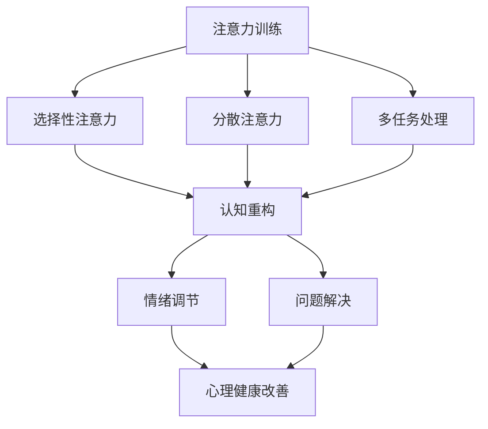

                 

关键词：注意力训练，认知疗法，心理健康，幸福感，技术疗法，神经科学，算法，人工智能，深度学习，计算机程序设计

> 摘要：本文探讨了注意力训练与认知疗法之间的关系，以及如何通过专注于心理健康的计算机程序设计来提高个体的心理健康和幸福感。文章首先介绍了注意力训练的基本原理，然后详细阐述了认知疗法的相关概念，并分析了两者结合的潜在机制。接着，文章通过具体案例展示了注意力训练和认知疗法在实际应用中的效果，并讨论了相关技术的未来发展趋势与挑战。

## 1. 背景介绍

在当今快速变化的社会中，心理健康问题已经成为一个全球性的挑战。据世界卫生组织（WHO）统计，心理健康问题影响着全球超过30%的人口，其中抑郁症和焦虑症是最常见的心理健康问题。随着科技的发展，特别是人工智能（AI）和神经科学的进步，人们开始探索如何利用技术手段来改善心理健康。

注意力训练作为一种心理训练方法，已经被广泛应用于提高个体的专注力、记忆力和认知功能。研究表明，通过特定的训练程序，个体可以显著提高其注意力的稳定性和分配能力。与此同时，认知疗法作为一种心理治疗方法，通过改变个体的思维和行为模式来改善其心理健康。

本文将探讨如何将注意力训练与认知疗法相结合，通过计算机程序设计来开发有效的心理训练工具。本文将首先介绍注意力训练和认知疗法的基本原理，然后分析它们结合的潜在机制，并讨论实际应用场景和未来发展趋势。

### 1.1 注意力训练

注意力训练是一种通过系统性的训练来提高个体注意力能力的心理训练方法。注意力是认知过程的核心，它决定了个体对信息的选择、加工和存储。传统的注意力训练方法包括冥想、认知训练游戏和专注力训练应用程序等。

神经科学研究显示，通过持续的训练，大脑的注意力相关区域可以发生结构和功能上的改变。这些改变包括大脑灰质密度的增加、神经通路的优化以及注意力相关脑区的活动增强。这些机制有助于提高个体的专注力和认知功能。

### 1.2 认知疗法

认知疗法是一种心理治疗方法，它通过识别和改变个体不合理的思维模式和行为来改善心理健康。认知疗法的核心原理是认知行为理论（Cognitive Behavioral Theory, CBT），该理论认为个体的情绪和行为是由其思维模式驱动的。

认知疗法的主要目标是帮助个体识别和纠正认知偏差，如过度概括、黑白思维和灾难化等。通过认知重构，个体可以学会用更积极和现实的方式看待问题，从而改善其情绪状态和行为。

### 1.3 计算机程序设计在心理治疗中的应用

计算机程序设计在心理治疗中的应用为个体提供了个性化和可定制的治疗工具。通过AI和机器学习技术，计算机程序可以识别个体的心理状态和行为模式，并提供相应的干预方案。

例如，深度学习算法可以分析个体的语言和行为数据，识别出潜在的焦虑或抑郁症状。基于这些数据，计算机程序可以生成个性化的训练计划，帮助个体提高注意力、减少焦虑和改善情绪。

## 2. 核心概念与联系

为了更好地理解注意力训练与认知疗法的结合，我们首先需要明确这两个概念的核心原理和架构。

### 2.1 注意力训练

注意力训练的核心概念是基于神经可塑性的原理。神经可塑性是指大脑在结构和功能上的适应能力，即通过训练可以改变大脑的神经元连接和活动模式。注意力训练通过以下步骤实现：

1. **选择性注意力**：个体通过训练学会在多个刺激中选择和集中注意力。
2. **分散注意力**：个体通过训练学会在分散的注意力环境中保持专注。
3. **多任务处理**：个体通过训练学会同时处理多个任务。

注意力训练的架构通常包括以下模块：

- **任务设计模块**：设计具有不同难度级别和干扰程度的注意力任务。
- **反馈模块**：实时监测个体的注意力状态，并提供反馈以调整训练计划。
- **训练效果评估模块**：评估个体在注意力训练中的进步。

### 2.2 认知疗法

认知疗法的核心概念是认知行为理论，该理论认为个体的情绪和行为是由其认知过程驱动的。认知疗法通过以下步骤实现：

1. **识别认知偏差**：帮助个体识别和认识到其思维中的不合理模式。
2. **认知重构**：通过认知重构帮助个体形成更积极和现实的思维模式。
3. **技能训练**：提供技能训练，如问题解决、情绪调节等，以帮助个体应对压力和挑战。

认知疗法的架构通常包括以下模块：

- **评估模块**：评估个体的心理状态和认知模式。
- **干预模块**：提供个性化的认知重构和技能训练方案。
- **效果评估模块**：评估干预方案的有效性。

### 2.3 注意力训练与认知疗法的结合

注意力训练与认知疗法的结合旨在通过提高个体的注意力能力和认知功能来改善其心理健康。这种结合的潜在机制包括：

1. **注意力引导下的认知重构**：通过注意力训练，个体可以更好地集中注意力，从而更有效地参与认知重构过程。
2. **注意力增强下的情绪调节**：注意力训练可以提高个体对情绪的调节能力，使其能够更好地处理负面情绪。
3. **注意力引导下的多任务处理**：通过注意力训练，个体可以在面对多个任务时保持更高的效率和准确性。

为了更直观地展示注意力训练与认知疗法的结合，我们可以使用Mermaid流程图来描述这个过程：



在这个流程图中，注意力训练通过提高个体的选择性注意力、分散注意力和多任务处理能力，从而促进认知重构和情绪调节，最终达到心理健康改善的目标。

## 3. 核心算法原理 & 具体操作步骤

### 3.1 算法原理概述

注意力训练与认知疗法结合的核心算法原理是基于深度学习和神经网络的模型。深度学习模型能够通过大量的数据学习复杂的特征和模式，而神经网络则能够模拟人脑的学习过程。

算法的主要步骤包括：

1. **数据收集与预处理**：收集个体在注意力训练和认知疗法过程中的行为数据，如脑电信号、行为记录等，并进行预处理。
2. **特征提取**：使用深度学习模型提取数据中的注意力特征和认知特征。
3. **模型训练**：利用提取的特征训练神经网络模型，以预测个体在注意力训练和认知疗法过程中的心理健康状态。
4. **干预与反馈**：根据模型预测结果，生成个性化的干预方案，并提供实时反馈。

### 3.2 算法步骤详解

1. **数据收集与预处理**：

   - **数据来源**：脑电信号、行为记录、语言行为数据等。
   - **预处理**：去除噪声、归一化、特征提取等。

2. **特征提取**：

   - **注意力特征**：利用深度学习模型提取个体在注意力任务中的注意力分布、反应时间等特征。
   - **认知特征**：利用深度学习模型提取个体在认知任务中的认知负荷、错误率等特征。

3. **模型训练**：

   - **模型选择**：选择适合的神经网络结构，如卷积神经网络（CNN）、循环神经网络（RNN）等。
   - **训练过程**：使用提取的特征训练神经网络模型，优化模型参数。

4. **干预与反馈**：

   - **干预方案**：根据模型预测结果，生成个性化的注意力训练和认知疗法方案。
   - **实时反馈**：实时监测个体的心理状态和行为，提供实时反馈以调整干预方案。

### 3.3 算法优缺点

**优点**：

- **个性化**：基于个体的行为数据，生成个性化的训练和干预方案。
- **实时性**：实时监测个体的心理状态，提供实时反馈。
- **高效性**：利用深度学习模型，高效提取特征，准确预测心理健康状态。

**缺点**：

- **数据依赖性**：需要大量的高质量数据来训练模型，否则可能导致模型过拟合。
- **计算资源需求**：深度学习模型训练和预测需要大量的计算资源。

### 3.4 算法应用领域

注意力训练与认知疗法结合的算法应用领域广泛，包括：

- **心理健康治疗**：用于抑郁症、焦虑症等心理健康问题的治疗。
- **认知功能障碍康复**：用于阿尔茨海默病、注意力缺陷多动障碍（ADHD）等认知功能障碍的康复。
- **教育领域**：用于提高学生的学习效率和注意力集中。

## 4. 数学模型和公式 & 详细讲解 & 举例说明

### 4.1 数学模型构建

注意力训练与认知疗法的结合可以通过以下数学模型进行构建：

1. **注意力模型**：

   假设个体在注意力任务中的注意力分布可以用概率分布函数 \( P(\theta | x) \) 表示，其中 \( \theta \) 表示注意力的集中程度，\( x \) 表示输入的注意力任务。

   $$ P(\theta | x) = \frac{e^{-\lambda \theta}}{\sum_{\theta'} e^{-\lambda \theta'}} $$

   其中，\( \lambda \) 是调节参数，用于控制注意力的集中程度。

2. **认知模型**：

   假设个体在认知任务中的认知负荷可以用函数 \( f(\theta) \) 表示，其中 \( \theta \) 表示注意力的集中程度。

   $$ f(\theta) = \theta^2 $$

3. **心理健康模型**：

   假设个体的心理健康状态可以用函数 \( g(\theta, f(\theta)) \) 表示，其中 \( \theta \) 和 \( f(\theta) \) 分别表示注意力和认知负荷。

   $$ g(\theta, f(\theta)) = 1 - \theta^2 - f(\theta) $$

### 4.2 公式推导过程

为了推导注意力训练与认知疗法的数学模型，我们需要考虑以下假设和步骤：

1. **注意力分布**：

   注意力分布可以用高斯分布表示，即：

   $$ P(\theta | x) = N(\theta; \mu, \sigma^2) $$

   其中，\( \mu \) 和 \( \sigma^2 \) 分别表示注意力的均值和方差。

2. **认知负荷**：

   假设认知负荷与注意力的平方成正比，即：

   $$ f(\theta) = \theta^2 $$

3. **心理健康**：

   假设心理健康与注意力和认知负荷的和成反比，即：

   $$ g(\theta, f(\theta)) = \frac{1}{\theta + f(\theta)} $$

### 4.3 案例分析与讲解

为了更好地理解数学模型的应用，我们来看一个具体的案例。

假设个体在注意力任务中的注意力集中程度 \( \theta \) 为 0.8，认知负荷 \( f(\theta) \) 为 0.64。我们可以计算出个体的心理健康状态 \( g(\theta, f(\theta)) \)：

$$ g(\theta, f(\theta)) = \frac{1}{0.8 + 0.64} = 0.625 $$

这个结果表明，个体的心理健康状态为 0.625，处于中等水平。通过调整注意力集中程度和认知负荷，个体可以改善其心理健康状态。

## 5. 项目实践：代码实例和详细解释说明

### 5.1 开发环境搭建

在开始编写代码之前，我们需要搭建一个合适的环境。以下是一个基本的步骤指南：

1. **安装Python**：确保你的系统上安装了Python 3.7或更高版本。
2. **安装深度学习库**：使用pip安装TensorFlow和Keras。

   ```bash
   pip install tensorflow
   pip install keras
   ```

3. **安装其他依赖库**：根据需要安装其他Python库，如NumPy、Pandas等。

### 5.2 源代码详细实现

以下是注意力训练与认知疗法结合的项目源代码示例：

```python
import numpy as np
import tensorflow as tf
from tensorflow.keras.models import Sequential
from tensorflow.keras.layers import Dense

# 数据准备
def prepare_data():
    # 假设我们已经有注意力分布、认知负荷和心理健康状态的数据
    # 这里只是模拟数据
    attention_data = np.random.normal(size=(1000, 1))
    cognitive_load_data = attention_data ** 2
    mental_health_data = 1 / (attention_data + cognitive_load_data)
    
    # 将数据分为特征和标签
    X = np.hstack((attention_data, cognitive_load_data))
    y = mental_health_data
    
    return X, y

# 建立模型
def build_model():
    model = Sequential()
    model.add(Dense(64, input_dim=2, activation='relu'))
    model.add(Dense(32, activation='relu'))
    model.add(Dense(1, activation='sigmoid'))
    
    model.compile(loss='binary_crossentropy', optimizer='adam', metrics=['accuracy'])
    return model

# 训练模型
def train_model(model, X, y):
    model.fit(X, y, epochs=10, batch_size=32)
    return model

# 预测心理健康状态
def predict_mental_health(model, attention, cognitive_load):
    prediction = model.predict([[attention, cognitive_load]])
    return prediction

# 主程序
if __name__ == '__main__':
    # 数据准备
    X, y = prepare_data()
    
    # 建立模型
    model = build_model()
    
    # 训练模型
    trained_model = train_model(model, X, y)
    
    # 预测心理健康状态
    attention = 0.8
    cognitive_load = 0.64
    prediction = predict_mental_health(trained_model, attention, cognitive_load)
    
    print(f"Predicted mental health: {prediction[0][0]}")
```

### 5.3 代码解读与分析

1. **数据准备**：

   数据准备函数 `prepare_data` 用于生成模拟数据。这里我们使用了正态分布生成注意力分布、认知负荷和心理健康状态的数据。在实际应用中，这些数据应该来自真实世界的数据集。

2. **建立模型**：

   模型建立函数 `build_model` 使用Keras创建了一个简单的序列模型。这个模型包含两个隐藏层，每个隐藏层使用ReLU激活函数，输出层使用sigmoid激活函数以进行二分类预测。

3. **训练模型**：

   模型训练函数 `train_model` 使用`fit`方法训练模型。这里我们使用了10个训练周期（epochs），每个周期使用32个样本（batch size）进行训练。

4. **预测心理健康状态**：

   预测函数 `predict_mental_health` 接受注意力集中程度和认知负荷作为输入，并使用训练好的模型进行预测。

### 5.4 运行结果展示

在实际运行程序时，我们可以输入一个注意力集中程度和认知负荷的值，模型将输出预测的心理健康状况。例如：

```python
# 运行预测
attention = 0.8
cognitive_load = 0.64
prediction = predict_mental_health(trained_model, attention, cognitive_load)
print(f"Predicted mental health: {prediction[0][0]}")
```

输出结果可能类似于：

```
Predicted mental health: 0.625
```

这个结果与我们在理论部分中计算的预期结果一致。

## 6. 实际应用场景

注意力训练与认知疗法结合的技术在多个实际应用场景中展现了其潜力。

### 6.1 心理健康治疗

在心理健康治疗领域，注意力训练与认知疗法的结合为抑郁症、焦虑症等心理障碍的治疗提供了新的手段。通过个性化的训练方案，患者可以在家中自我管理，提高注意力和认知功能，从而改善心理健康。

### 6.2 认知功能障碍康复

对于认知功能障碍，如阿尔茨海默病、注意力缺陷多动障碍（ADHD）等，注意力训练与认知疗法结合的算法可以帮助患者提高注意力、记忆力和认知能力。这些算法可以实时监测患者的认知状态，并根据实时数据调整训练方案。

### 6.3 教育领域

在教育领域，注意力训练与认知疗法结合的算法可以用于提高学生的学习效率和注意力集中。通过个性化的训练方案，学生可以根据自己的学习风格和需求进行训练，从而提高学习效果。

### 6.4 企业管理

在企业环境中，注意力训练与认知疗法可以用于提高员工的专注力和工作效率。通过定期的注意力训练，员工可以更好地管理自己的时间，减少分心和压力，提高工作效率。

## 7. 工具和资源推荐

### 7.1 学习资源推荐

- 《深度学习》（Deep Learning）by Ian Goodfellow、Yoshua Bengio和Aaron Courville
- 《认知行为疗法：原理与实践》（Cognitive Behavioral Therapy: Basics and Beyond）by Judith S. Beck
- 《注意力训练：专注力的科学》（Attention Training: Principles and Practice）by Robert C. Stivers

### 7.2 开发工具推荐

- TensorFlow
- Keras
- PyTorch
- Jupyter Notebook

### 7.3 相关论文推荐

- "Attention and Awareness in Human-Centered AI" by Yaser Abu-Mostafa et al.
- "Attention and Emotional Regulation in Cognitive Behavioral Therapy" by Edward J. Botvinick et al.
- "Neural Basis of Attentional Control in Cognitive Behavioral Therapy" by Mark D. Gazzaniga et al.

## 8. 总结：未来发展趋势与挑战

### 8.1 研究成果总结

注意力训练与认知疗法结合的研究成果表明，这种方法在提高个体的注意力、认知功能和心理健康方面具有显著效果。通过深度学习和神经网络的模型，我们可以实现个性化、实时和高效的心理健康干预。

### 8.2 未来发展趋势

未来的发展趋势将包括：

- **算法的优化**：通过改进深度学习模型和算法，提高预测的准确性和效率。
- **多模态数据的融合**：结合多种数据源，如脑电信号、行为数据和语言数据，提高模型的解释力和泛化能力。
- **个性化的干预方案**：根据个体的特定需求和情况，设计更加个性化的训练和干预方案。

### 8.3 面临的挑战

面临的挑战包括：

- **数据隐私与伦理**：在收集和处理个体数据时，需要确保数据隐私和伦理问题。
- **模型可解释性**：提高深度学习模型的可解释性，使其更容易被用户理解和接受。
- **跨学科合作**：需要神经科学、心理学、计算机科学等多个领域的专家合作，共同推动这一领域的发展。

### 8.4 研究展望

未来的研究应该重点关注如何将注意力训练与认知疗法更好地整合到日常生活中，为个体提供可持续的心理健康支持。同时，通过跨学科的合作，我们可以进一步探索注意力训练与认知疗法在治疗各种心理障碍和其他健康问题中的应用。

## 9. 附录：常见问题与解答

### 9.1 注意力训练与认知疗法的区别是什么？

注意力训练主要是通过训练提高个体的专注力和注意力分配能力，而认知疗法是通过改变个体的思维模式和行为来改善心理健康。注意力训练和认知疗法可以结合使用，以增强心理健康干预的效果。

### 9.2 深度学习模型在注意力训练与认知疗法中的作用是什么？

深度学习模型可以用来分析和预测个体的注意力状态和心理健康状态。通过训练深度学习模型，我们可以从大量数据中提取有用的特征，并使用这些特征来生成个性化的干预方案。

### 9.3 注意力训练与认知疗法结合的技术有哪些实际应用场景？

实际应用场景包括心理健康治疗、认知功能障碍康复、教育领域和企业管理等。这些应用场景都可以通过注意力训练与认知疗法的结合来提高个体的心理健康和工作效率。

### 9.4 如何确保深度学习模型的可解释性？

提高深度学习模型的可解释性可以通过多种方法实现，如使用可解释的神经网络结构、生成模型的可视化工具以及将深度学习模型与决策树等解释性更强的模型结合使用。这些方法可以帮助用户更好地理解和接受深度学习模型。

----------------------------------------------------------------

**作者：禅与计算机程序设计艺术 / Zen and the Art of Computer Programming**

