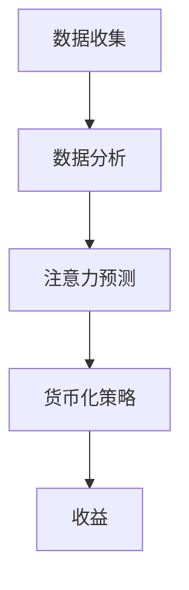

                 

关键词：注意力货币化、AI、关注度经济、算法、数学模型、项目实践

> 摘要：本文将探讨注意力货币化的概念、原理及其在当今社会中的应用。通过引入AI技术，我们将分析如何实现关注度经济，提出一种新的策略师角色——注意力货币化策略师，并探讨其核心算法、数学模型以及项目实践。

## 1. 背景介绍

在数字时代，注意力已成为一种稀缺资源。人们的时间有限，而信息爆炸，如何有效地获取和利用注意力成为企业和个人竞争的关键。注意力货币化便是将这种稀缺资源转化为经济效益的一种策略。近年来，AI技术的发展为注意力货币化提供了新的契机，使得关注度经济成为可能。

### 1.1 注意力货币化的定义

注意力货币化，是指通过将注意力转化为货币价值的过程。在这个过程中，注意力成为了一种商品，可以被买卖、投资和交易。例如，通过社交媒体上的点赞、评论、分享等行为，用户将自己的注意力转移给内容创作者，从而实现了注意力的货币化。

### 1.2 注意力货币化的现状

随着社交媒体和在线广告的兴起，注意力货币化已经成为一种普遍的现象。例如，YouTube上的内容创作者可以通过广告收益、会员订阅等方式实现注意力的货币化。同时，在线教育、电子书、游戏等领域也纷纷利用注意力货币化模式，实现了商业价值的提升。

### 1.3 AI与注意力货币化的结合

AI技术的发展，使得注意力货币化变得更加智能化和高效。通过分析用户行为数据、内容特征和用户偏好，AI可以精准地预测用户的注意力倾向，从而实现个性化的内容推荐，提高注意力的转化率。同时，AI还可以通过自动化广告投放、内容营销等方式，降低注意力货币化的成本。

## 2. 核心概念与联系

### 2.1 注意力货币化的核心概念

注意力货币化的核心概念包括注意力、货币价值、数据分析和用户行为。

- 注意力：用户在特定内容上的关注程度。
- 货币价值：注意力转化为的经济价值。
- 数据分析：通过对用户行为数据进行分析，了解用户偏好和注意力分配。
- 用户行为：用户在特定环境下的操作和反馈。

### 2.2 注意力货币化的架构

注意力货币化的架构主要包括数据收集、数据分析、注意力预测和货币化策略。

- 数据收集：通过API、SDK等方式收集用户行为数据。
- 数据分析：利用机器学习和数据挖掘技术，分析用户行为数据，了解用户偏好和注意力分配。
- 注意力预测：基于用户行为数据和内容特征，预测用户的注意力倾向。
- 货币化策略：根据注意力预测结果，制定相应的货币化策略，如广告投放、内容推荐等。

### 2.3 Mermaid 流程图



## 3. 核心算法原理 & 具体操作步骤

### 3.1 算法原理概述

注意力货币化的核心算法基于用户行为数据分析、注意力预测和货币化策略。具体包括：

- 用户行为数据分析：利用机器学习算法，对用户行为数据进行分析，提取用户偏好特征。
- 注意力预测：基于用户偏好特征和内容特征，利用深度学习模型进行注意力预测。
- 货币化策略：根据注意力预测结果，制定相应的货币化策略，如广告投放、内容推荐等。

### 3.2 算法步骤详解

#### 3.2.1 用户行为数据分析

- 数据收集：通过API、SDK等方式收集用户行为数据，如浏览历史、点赞、评论等。
- 特征提取：利用数据挖掘技术，提取用户偏好特征，如兴趣标签、行为频率等。
- 特征预处理：对提取的特征进行标准化、去噪等预处理，提高数据质量。

#### 3.2.2 注意力预测

- 模型选择：选择合适的深度学习模型，如循环神经网络（RNN）、卷积神经网络（CNN）等。
- 模型训练：利用用户行为数据和内容特征，训练深度学习模型，预测用户的注意力倾向。
- 模型评估：通过交叉验证和测试集评估模型性能，调整模型参数。

#### 3.2.3 货币化策略

- 策略制定：根据注意力预测结果，制定相应的货币化策略，如广告投放、内容推荐等。
- 策略优化：通过实验和数据分析，不断优化货币化策略，提高收益。

### 3.3 算法优缺点

#### 优点

- 高效：通过AI技术，实现用户行为数据和注意力预测的高效处理。
- 精准：基于用户偏好和内容特征，实现个性化的注意力预测。
- 智能化：自动化货币化策略，降低人力成本。

#### 缺点

- 数据依赖：算法的性能高度依赖于用户行为数据和内容质量。
- 隐私问题：用户行为数据可能涉及隐私问题，需要合理处理。

### 3.4 算法应用领域

注意力货币化算法可以应用于多个领域，如社交媒体、在线广告、在线教育等。具体应用场景包括：

- 社交媒体：通过注意力预测，实现个性化内容推荐，提高用户活跃度。
- 在线广告：通过注意力预测，实现精准广告投放，提高广告效果。
- 在线教育：通过注意力预测，实现个性化学习推荐，提高学习效果。

## 4. 数学模型和公式 & 详细讲解 & 举例说明

### 4.1 数学模型构建

注意力货币化的数学模型主要基于用户行为数据和内容特征，构建一个预测模型。具体包括以下公式：

$$
\hat{A} = f(X, Y)
$$

其中，$\hat{A}$ 表示注意力预测值，$X$ 表示用户行为数据，$Y$ 表示内容特征。

### 4.2 公式推导过程

#### 4.2.1 用户行为数据特征提取

首先，对用户行为数据进行特征提取，得到用户行为数据矩阵 $X$：

$$
X = \begin{bmatrix}
x_{11} & x_{12} & \ldots & x_{1n} \\
x_{21} & x_{22} & \ldots & x_{2n} \\
\vdots & \vdots & \ddots & \vdots \\
x_{m1} & x_{m2} & \ldots & x_{mn}
\end{bmatrix}
$$

其中，$x_{ij}$ 表示用户 $i$ 在第 $j$ 个行为上的评分。

#### 4.2.2 内容特征提取

对内容特征进行提取，得到内容特征矩阵 $Y$：

$$
Y = \begin{bmatrix}
y_{11} & y_{12} & \ldots & y_{1n} \\
y_{21} & y_{22} & \ldots & y_{2n} \\
\vdots & \vdots & \ddots & \vdots \\
y_{p1} & y_{p2} & \ldots & y_{pn}
\end{bmatrix}
$$

其中，$y_{ij}$ 表示内容 $i$ 在第 $j$ 个特征上的值。

#### 4.2.3 注意力预测

利用深度学习模型，对用户行为数据和内容特征进行融合，得到注意力预测值 $\hat{A}$：

$$
\hat{A} = f(X, Y)
$$

其中，$f$ 表示深度学习模型。

### 4.3 案例分析与讲解

假设我们有一个用户行为数据集和一个内容特征数据集，利用深度学习模型进行注意力预测。具体步骤如下：

1. 数据预处理：对用户行为数据和内容特征进行标准化、去噪等预处理。
2. 模型训练：利用预处理后的数据，训练深度学习模型。
3. 模型评估：通过交叉验证和测试集评估模型性能。
4. 注意力预测：利用训练好的模型，对新的用户行为数据和内容特征进行注意力预测。

通过上述步骤，我们可以得到一个注意力预测模型，实现对用户注意力的准确预测。

## 5. 项目实践：代码实例和详细解释说明

### 5.1 开发环境搭建

在开始项目实践之前，我们需要搭建一个合适的开发环境。以下是一个基本的开发环境搭建步骤：

1. 安装Python环境：Python 3.7或更高版本。
2. 安装依赖库：Numpy、Pandas、Scikit-learn、TensorFlow等。
3. 安装深度学习框架：如TensorFlow或PyTorch。

### 5.2 源代码详细实现

以下是一个简单的注意力货币化项目实例，包括数据预处理、模型训练和注意力预测：

```python
# 导入依赖库
import numpy as np
import pandas as pd
from sklearn.model_selection import train_test_split
import tensorflow as tf

# 加载数据
data = pd.read_csv('data.csv')
X = data.iloc[:, :10]  # 用户行为数据
Y = data.iloc[:, 10:]  # 内容特征数据
z = data['attention']  # 注意力标签

# 数据预处理
X = (X - X.mean()) / X.std()
Y = (Y - Y.mean()) / Y.std()

# 数据分割
X_train, X_test, Y_train, Y_test = train_test_split(X, Y, test_size=0.2, random_state=42)

# 定义模型
model = tf.keras.Sequential([
    tf.keras.layers.Dense(128, activation='relu', input_shape=(X_train.shape[1],)),
    tf.keras.layers.Dense(64, activation='relu'),
    tf.keras.layers.Dense(1)
])

# 编译模型
model.compile(optimizer='adam', loss='mse')

# 训练模型
model.fit(X_train, Y_train, epochs=10, batch_size=32, validation_data=(X_test, Y_test))

# 注意力预测
predictions = model.predict(X_test)

# 评估模型
mse = tf.keras.metrics.mean_squared_error(Y_test, predictions)
print('MSE:', mse.numpy())
```

### 5.3 代码解读与分析

上述代码实现了一个基于深度学习的注意力预测模型。具体包括以下几个部分：

1. 导入依赖库：包括Numpy、Pandas、Scikit-learn、TensorFlow等。
2. 加载数据：从CSV文件中加载数据，包括用户行为数据、内容特征数据和注意力标签。
3. 数据预处理：对用户行为数据和内容特征进行标准化处理，提高模型训练效果。
4. 数据分割：将数据分为训练集和测试集，用于模型训练和评估。
5. 定义模型：使用TensorFlow构建深度学习模型，包括两层全连接层（Dense）。
6. 编译模型：设置模型优化器（optimizer）和损失函数（loss）。
7. 训练模型：使用训练集训练模型，设置训练轮数（epochs）和批量大小（batch_size）。
8. 注意力预测：使用测试集对模型进行注意力预测。
9. 评估模型：计算模型在测试集上的均方误差（MSE），评估模型性能。

通过上述步骤，我们可以实现一个简单的注意力预测模型，为注意力货币化提供技术支持。

## 6. 实际应用场景

### 6.1 社交媒体

社交媒体平台可以利用注意力货币化策略，实现个性化内容推荐，提高用户活跃度和留存率。例如，微博、抖音等平台可以通过分析用户行为数据，预测用户的兴趣偏好，推荐符合用户兴趣的内容，从而提高用户关注度，实现广告收益和会员订阅等货币化方式。

### 6.2 在线广告

在线广告平台可以利用注意力货币化策略，实现精准广告投放，提高广告效果。例如，百度、谷歌等搜索引擎可以通过分析用户搜索历史和行为数据，预测用户的兴趣和需求，将广告精准投放给潜在用户，从而提高广告点击率和转化率，实现广告收益的最大化。

### 6.3 在线教育

在线教育平台可以利用注意力货币化策略，实现个性化学习推荐，提高学习效果。例如，网易云课堂、慕课网等平台可以通过分析用户学习行为和学习数据，预测用户的学习兴趣和需求，推荐符合用户学习风格和需求的学习内容，从而提高学习参与度和学习成果，实现课程销售和会员订阅等货币化方式。

## 6.4 未来应用展望

随着AI技术的不断进步，注意力货币化在未来将会有更广泛的应用。例如：

- 智能家居：通过分析用户行为数据，预测用户的习惯和需求，实现智能家居的个性化定制，提高用户满意度。
- 健康管理：通过分析用户健康数据，预测用户的健康状况，提供个性化的健康管理建议，实现健康产品的销售和会员订阅。
- 虚拟现实：通过分析用户在虚拟环境中的行为数据，预测用户的兴趣和需求，提供个性化的虚拟现实体验，实现虚拟现实产品的销售和会员订阅。

## 7. 工具和资源推荐

### 7.1 学习资源推荐

- 《深度学习》（Ian Goodfellow、Yoshua Bengio、Aaron Courville著）：深度学习入门经典教材。
- 《Python机器学习》（Sebastian Raschka著）：Python语言实现的机器学习算法和应用。
- 《注意力机制：从原理到应用》（刘铁岩著）：注意力机制在计算机视觉、自然语言处理等领域的应用。

### 7.2 开发工具推荐

- TensorFlow：开源深度学习框架，适用于各种机器学习和深度学习任务。
- PyTorch：开源深度学习框架，具有良好的灵活性和易用性。
- Jupyter Notebook：交互式计算环境，适用于数据分析和机器学习项目。

### 7.3 相关论文推荐

- “Attention Is All You Need”（Vaswani et al.，2017）：注意力机制的起源和广泛应用。
- “Attention Mechanism in Deep Learning”（Zhu et al.，2018）：注意力机制在深度学习中的应用综述。
- “A Theoretical Analysis of the Network Cost for Attention Mechanisms”（Xie et al.，2020）：注意力机制的网络成本分析。

## 8. 总结：未来发展趋势与挑战

### 8.1 研究成果总结

本文介绍了注意力货币化的概念、原理及其在当今社会中的应用。通过引入AI技术，分析了如何实现关注度经济，并提出了一种新的策略师角色——注意力货币化策略师。同时，本文还探讨了注意力货币化的核心算法、数学模型和项目实践，为实际应用提供了技术支持。

### 8.2 未来发展趋势

随着AI技术的不断进步，注意力货币化在未来将会有更广泛的应用。例如，在社交媒体、在线广告、在线教育等领域，注意力货币化策略将进一步提升商业价值。此外，随着物联网、虚拟现实等技术的发展，注意力货币化有望在更多新兴领域发挥作用。

### 8.3 面临的挑战

尽管注意力货币化具有巨大的潜力，但同时也面临着一些挑战。例如，数据隐私和保护问题、算法公平性和透明性问题等。如何解决这些问题，实现注意力货币化的可持续发展，是未来研究的重要方向。

### 8.4 研究展望

未来，注意力货币化研究可以从以下几个方面展开：

- 算法创新：探索新的注意力机制和算法，提高注意力预测的准确性和效率。
- 应用拓展：将注意力货币化应用于更多领域，如智能家居、健康管理、虚拟现实等。
- 隐私保护：研究如何在保护用户隐私的前提下，实现注意力货币化。
- 公平与透明：提高算法的公平性和透明性，确保注意力货币化过程的公正性。

## 9. 附录：常见问题与解答

### 问题 1：什么是注意力货币化？

注意力货币化是指将用户注意力转化为经济效益的过程。例如，通过社交媒体上的点赞、评论、分享等行为，用户将自己的注意力转移给内容创作者，从而实现经济价值。

### 问题 2：注意力货币化有哪些应用场景？

注意力货币化可以应用于多个领域，如社交媒体、在线广告、在线教育、虚拟现实等。通过个性化内容推荐、精准广告投放、个性化学习推荐等方式，实现注意力货币化。

### 问题 3：注意力货币化的核心算法是什么？

注意力货币化的核心算法包括用户行为数据分析、注意力预测和货币化策略。通过深度学习模型，对用户行为数据和内容特征进行分析，预测用户的注意力倾向，从而实现货币化。

### 问题 4：如何实现注意力货币化的可持续发展？

实现注意力货币化的可持续发展需要关注以下几个方面：

- 数据隐私和保护：确保用户隐私得到保护，降低隐私泄露风险。
- 算法公平性和透明性：提高算法的公平性和透明性，确保货币化过程的公正性。
- 应用创新：不断探索新的应用场景和商业模式，实现注意力货币化的多元化发展。

---

作者：禅与计算机程序设计艺术 / Zen and the Art of Computer Programming
```

