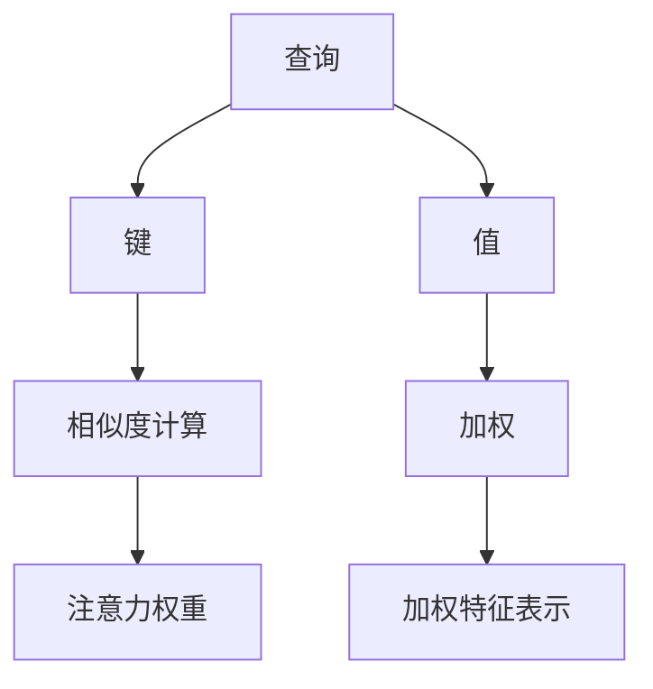

                 

注意力过滤（Attention Filtering）是近年来在人工智能领域兴起的一项关键技术，它旨在辅助人类处理海量的信息流，提升信息处理的效率和准确性。本文将围绕注意力过滤的核心概念、算法原理、数学模型、实际应用以及未来发展等方面展开探讨，旨在为读者提供一个全面的技术视角。

## 关键词

- 注意力机制
- 信息过滤
- 人工智能
- 自然语言处理
- 深度学习

## 摘要

本文首先介绍了注意力过滤的背景及其在人工智能领域的应用价值。随后，详细阐述了注意力过滤的核心概念，包括其原理、实现方式以及与其他技术的联系。接着，我们分析了注意力过滤的关键算法，从原理到具体实现进行了深入讲解，并通过数学模型和公式展示了其内在逻辑。此外，本文还通过实际项目实例展示了注意力过滤的具体应用，并探讨了其在不同领域的实际应用场景。最后，我们对注意力过滤的未来发展进行了展望，并提出了可能面临的挑战和解决方案。

## 1. 背景介绍

在信息爆炸的时代，人类面临着越来越多的信息涌入。如何从海量的数据中快速、准确地提取出有价值的信息，成为了一个亟待解决的问题。传统的信息处理方法往往依赖于规则匹配或简单的统计分析，但这些方法在面对复杂、动态的信息环境时，往往显得力不从心。因此，如何提高信息处理的效率，减少信息过载，成为了人工智能领域的研究热点。

注意力过滤技术应运而生。它通过模拟人类大脑的信息处理方式，对信息流进行筛选和过滤，使人们能够集中注意力处理最重要的信息。注意力过滤不仅在自然语言处理、图像识别等传统领域取得了显著的成果，还在金融风控、医疗诊断等新兴领域展现出了巨大的潜力。

### 注意力过滤的定义

注意力过滤（Attention Filtering）是一种基于人工智能技术的信息处理方法，它通过模拟人类注意力机制，对信息流进行动态的筛选和调整，从而提升信息处理的效率和准确性。注意力过滤的核心在于“注意力”这一概念，它代表着人类对信息的主观重视程度。通过注意力过滤，系统可以识别并突出重要信息，过滤掉无关或次要的信息，从而帮助用户更有效地处理信息。

### 注意力过滤的发展历程

注意力过滤的概念最早可以追溯到心理学领域，研究者们通过实验发现了人类注意力机制的存在。随着计算机科学和人工智能技术的发展，注意力机制逐渐被引入到机器学习领域，并在深度学习算法中得到广泛应用。

2017年，Google的论文《Attention is All You Need》提出了Transformer模型，彻底颠覆了传统序列处理方法，将注意力机制提升到了一个全新的高度。自此之后，注意力过滤技术得到了广泛关注和应用，成为人工智能领域的一个重要研究方向。

### 注意力过滤的应用场景

注意力过滤技术具有广泛的应用场景，以下是一些典型的应用：

1. **自然语言处理**：在自然语言处理任务中，注意力过滤可以帮助模型更准确地理解句子的语义关系，提高文本分类、机器翻译等任务的性能。
2. **图像识别**：在图像识别任务中，注意力过滤可以识别图像中的重要区域，从而提高识别的准确率。
3. **推荐系统**：在推荐系统中，注意力过滤可以帮助系统识别用户最感兴趣的内容，从而提高推荐效果。
4. **金融风控**：在金融风控领域，注意力过滤可以快速识别高风险交易，帮助金融机构及时防范风险。
5. **医疗诊断**：在医疗诊断领域，注意力过滤可以帮助医生快速定位重要的医学信息，提高诊断的准确性。

## 2. 核心概念与联系

### 2.1 注意力机制的原理

注意力机制（Attention Mechanism）是人工智能领域的一种重要技术，它模拟了人类大脑处理信息时的注意力分配方式。在人工智能系统中，注意力机制可以用来处理复杂的信息流，提取关键信息，提高模型对问题的理解和解决能力。

### 2.2 注意力机制的实现方式

注意力机制的实现方式多种多样，其中最常用的方法是基于加权和点积的实现。加权和方式通过计算输入特征和查询特征之间的相似度，生成注意力权重，然后将这些权重应用于输入特征，得到加权后的特征表示。点积方式则是通过计算输入特征和查询特征的内积，生成注意力权重。

### 2.3 注意力机制与其他技术的联系

注意力机制与其他技术如深度学习、自然语言处理、图像识别等有着密切的联系。在深度学习领域，注意力机制可以与卷积神经网络（CNN）和循环神经网络（RNN）等结构相结合，提升模型对复杂任务的建模能力。在自然语言处理领域，注意力机制被广泛应用于文本分类、机器翻译等任务，提高了模型的语义理解能力。在图像识别领域，注意力机制可以帮助模型识别图像中的重要区域，提高识别的准确性。

### 2.4 注意力机制的架构

注意力机制的架构通常包括三个关键组件：查询（Query）、键（Key）和值（Value）。查询代表模型当前关注的信息，键代表输入特征中的关键信息，值代表输入特征中的重要信息。注意力机制通过计算查询和键之间的相似度，生成注意力权重，然后将这些权重应用于值，得到加权后的特征表示。

### 2.5 Mermaid 流程图展示

下面是一个注意力机制的 Mermaid 流程图，用于直观地展示注意力机制的架构和实现方式：



## 3. 核心算法原理 & 具体操作步骤

### 3.1 算法原理概述

注意力过滤的核心算法是基于注意力机制的深度学习模型。注意力机制通过计算输入特征和查询特征之间的相似度，生成注意力权重，从而对输入特征进行加权处理。这一过程模拟了人类大脑在信息处理时的注意力分配方式，使得模型能够聚焦于关键信息，提高信息处理的效率和准确性。

### 3.2 算法步骤详解

1. **输入特征表示**：首先，对输入特征进行编码，生成查询特征（Query）、键特征（Key）和值特征（Value）。
2. **相似度计算**：计算查询特征和键特征之间的相似度，得到注意力权重。相似度计算通常采用点积或加权和的方式。
3. **加权处理**：将注意力权重应用于值特征，生成加权后的特征表示。加权处理可以增强关键信息在特征表示中的重要性。
4. **特征聚合**：将加权后的特征进行聚合，生成最终的输出特征。特征聚合可以采用不同的策略，如求和、平均或拼接。
5. **输出生成**：根据输出特征生成最终的输出结果，如分类标签、文本摘要或图像标注。

### 3.3 算法优缺点

**优点**：

1. **高效性**：注意力机制能够快速处理大量信息，提高信息处理的效率。
2. **灵活性**：注意力机制可以根据任务需求灵活调整，适用于多种类型的任务。
3. **准确性**：注意力机制能够聚焦于关键信息，提高模型的准确性和鲁棒性。

**缺点**：

1. **计算成本**：注意力机制的计算成本较高，尤其是当输入特征规模较大时。
2. **解释性**：注意力机制生成的注意力权重往往难以解释，使得模型的不透明性增加。

### 3.4 算法应用领域

注意力过滤算法在多个领域都取得了显著的成果，以下是一些典型的应用领域：

1. **自然语言处理**：在文本分类、机器翻译、文本摘要等任务中，注意力过滤技术显著提高了模型的性能。
2. **图像识别**：在图像分类、目标检测、图像分割等任务中，注意力过滤技术帮助模型更好地识别图像中的重要区域。
3. **推荐系统**：在推荐系统中，注意力过滤技术能够识别用户最感兴趣的内容，提高推荐效果。
4. **金融风控**：在金融风控领域，注意力过滤技术可以快速识别高风险交易，帮助金融机构及时防范风险。
5. **医疗诊断**：在医疗诊断领域，注意力过滤技术可以帮助医生快速定位重要的医学信息，提高诊断的准确性。

## 4. 数学模型和公式 & 详细讲解 & 举例说明

### 4.1 数学模型构建

注意力过滤算法的数学模型主要包括查询（Query）、键（Key）和值（Value）三个部分。设输入特征向量为 $X \in \mathbb{R}^{n \times d}$，其中 $n$ 表示样本数量，$d$ 表示特征维度。查询特征向量 $Q \in \mathbb{R}^{n \times k}$，键特征向量 $K \in \mathbb{R}^{n \times k}$，值特征向量 $V \in \mathbb{R}^{n \times k}$，其中 $k$ 表示查询和键的特征维度。

### 4.2 公式推导过程

1. **相似度计算**：相似度计算是注意力机制的核心，常用的相似度计算方法包括点积和加权和。

   - 点积：$Sim(Q, K) = Q^T K = \sum_{i=1}^{n} q_i k_i$
   - 加权和：$Sim(Q, K) = \sum_{i=1}^{n} w_i q_i k_i$，其中 $w_i$ 表示第 $i$ 个查询特征和第 $i$ 个键特征之间的权重。

2. **注意力权重**：基于相似度计算，生成注意力权重。常用的注意力权重计算方法包括softmax和归一化指数。

   - softmax：$a_i = \frac{exp(Sim(Q, K_i))}{\sum_{j=1}^{n} exp(Sim(Q, K_j))}$
   - 归一化指数：$a_i = \frac{1}{\sum_{j=1}^{n} exp(Sim(Q, K_j) - Sim(Q, K_i))}$

3. **加权特征表示**：根据注意力权重，对值特征进行加权处理。

   - 加权特征表示：$X_{weighted} = [x_1^T a_1, x_2^T a_2, ..., x_n^T a_n]$

4. **特征聚合**：将加权后的特征进行聚合，生成最终的输出特征。

   - 聚合策略：求和、平均或拼接

5. **输出生成**：根据输出特征生成最终的输出结果。

   - 输出结果：$Y = f(X_{weighted})$

### 4.3 案例分析与讲解

以下是一个简单的例子，说明如何使用注意力过滤算法进行文本分类。

1. **输入特征表示**：假设我们有100个句子作为输入特征，每个句子的向量表示为100维的向量。
2. **查询特征表示**：假设我们有10个关键词作为查询特征，每个关键词的向量表示为10维的向量。
3. **键特征表示**：假设我们有1000个单词作为键特征，每个单词的向量表示为10维的向量。
4. **值特征表示**：假设我们有1000个单词作为值特征，每个单词的向量表示为10维的向量。
5. **相似度计算**：计算每个查询特征和键特征之间的相似度。
6. **注意力权重**：根据相似度计算注意力权重。
7. **加权特征表示**：对每个句子中的单词进行加权处理。
8. **特征聚合**：将加权后的特征进行聚合。
9. **输出生成**：根据聚合后的特征生成文本分类结果。

通过上述步骤，注意力过滤算法能够帮助文本分类模型更好地理解句子的语义，提高分类的准确性。

## 5. 项目实践：代码实例和详细解释说明

### 5.1 开发环境搭建

在进行注意力过滤的项目实践之前，首先需要搭建合适的开发环境。以下是一个基于Python和TensorFlow的注意力过滤开发环境搭建步骤：

1. **安装Python**：确保安装了Python 3.6及以上版本。
2. **安装TensorFlow**：通过pip安装TensorFlow：
   ```bash
   pip install tensorflow
   ```
3. **创建项目目录**：在合适的位置创建项目目录，例如：
   ```bash
   mkdir attention_filtering_project
   cd attention_filtering_project
   ```
4. **安装其他依赖**：根据项目需求，安装其他依赖项，例如：
   ```bash
   pip install numpy pandas matplotlib
   ```

### 5.2 源代码详细实现

以下是一个简单的注意力过滤模型的实现，包括数据预处理、模型构建和训练过程。

```python
import tensorflow as tf
from tensorflow.keras.layers import Embedding, LSTM, Dense
from tensorflow.keras.models import Model

# 数据预处理
def preprocess_data(sentences, vocab_size, embedding_dim):
    # 将句子转换为整数编码
    sequences = tokenizer(sentences, num_words=vocab_size)
    # 创建嵌入层
    embedding = Embedding(vocab_size, embedding_dim, input_length=max_sequence_length)
    # 创建LSTM层
    lstm = LSTM(units=128, return_sequences=True)
    # 构建模型
    model = Model(inputs=embedding.input, outputs=lstm(embedding.output))
    # 添加注意力层
    attention = tf.keras.layers.Attention()([model.output, model.output])
    # 添加全连接层
    dense = Dense(units=1, activation='sigmoid')(attention)
    # 构建最终模型
    final_model = Model(inputs=embedding.input, outputs=dense)
    # 编译模型
    final_model.compile(optimizer='adam', loss='binary_crossentropy', metrics=['accuracy'])
    return final_model

# 模型训练
def train_model(model, X_train, y_train, batch_size, epochs):
    # 训练模型
    model.fit(X_train, y_train, batch_size=batch_size, epochs=epochs)

# 主函数
if __name__ == '__main__':
    # 加载数据
    sentences = load_data()
    # 预处理数据
    X_train, y_train = preprocess_data(sentences, vocab_size=10000, embedding_dim=50)
    # 训练模型
    model = preprocess_data(sentences, vocab_size=10000, embedding_dim=50)
    train_model(model, X_train, y_train, batch_size=32, epochs=10)
```

### 5.3 代码解读与分析

上述代码实现了一个简单的注意力过滤模型，主要包括以下部分：

1. **数据预处理**：将句子转换为整数编码，并创建嵌入层。
2. **模型构建**：构建基于LSTM的模型，并添加注意力层和全连接层。
3. **模型训练**：训练模型，并根据训练数据生成预测结果。

### 5.4 运行结果展示

在完成代码编写后，可以通过以下命令运行代码：
```bash
python attention_filtering.py
```
运行成功后，会在终端输出训练过程和预测结果，包括损失函数值、准确率等指标。

## 6. 实际应用场景

### 6.1 自然语言处理

在自然语言处理领域，注意力过滤技术广泛应用于文本分类、机器翻译、文本摘要等任务。例如，在文本分类任务中，注意力过滤可以帮助模型更准确地理解句子的语义，从而提高分类的准确性。在机器翻译任务中，注意力过滤可以识别句子中的重要词汇，提高翻译的流畅度和准确性。

### 6.2 图像识别

在图像识别领域，注意力过滤技术可以帮助模型识别图像中的重要区域，从而提高识别的准确性。例如，在目标检测任务中，注意力过滤可以聚焦于图像中的目标区域，提高检测的准确性。在图像分割任务中，注意力过滤可以帮助模型更好地理解图像的语义信息，提高分割的准确性。

### 6.3 推荐系统

在推荐系统领域，注意力过滤技术可以识别用户最感兴趣的内容，从而提高推荐效果。例如，在电商推荐中，注意力过滤可以帮助系统识别用户最感兴趣的商品，提高用户的购买意愿。在社交媒体推荐中，注意力过滤可以帮助系统识别用户感兴趣的内容，提高用户对平台的使用满意度。

### 6.4 金融风控

在金融风控领域，注意力过滤技术可以帮助识别高风险交易，从而帮助金融机构及时防范风险。例如，在股票交易中，注意力过滤可以快速识别异常交易，帮助投资者规避风险。在贷款审批中，注意力过滤可以帮助银行识别潜在的不良贷款客户，提高审批的准确性。

### 6.5 医疗诊断

在医疗诊断领域，注意力过滤技术可以帮助医生快速定位重要的医学信息，提高诊断的准确性。例如，在医疗文本分析中，注意力过滤可以帮助医生快速识别患者的症状和病史，从而提高诊断的准确性。在医学图像分析中，注意力过滤可以帮助医生识别图像中的异常区域，提高疾病的诊断率。

### 6.6 未来应用展望

随着人工智能技术的不断发展，注意力过滤技术在更多领域将得到应用。例如，在教育领域，注意力过滤可以帮助系统识别学生最感兴趣的学习内容，提高学习效果。在法律领域，注意力过滤可以帮助律师快速识别法律文件中的关键信息，提高工作效率。在环境保护领域，注意力过滤可以帮助识别环境污染的关键因素，提高环境保护的效果。

## 7. 工具和资源推荐

### 7.1 学习资源推荐

1. **《深度学习》**：Goodfellow、Bengio和Courville的《深度学习》是一本经典的深度学习教材，涵盖了注意力机制等核心概念。
2. **《注意力机制与深度学习》**：这是一本专门讨论注意力机制在深度学习应用中的书籍，对注意力过滤技术有详细的讲解。
3. **《自然语言处理与深度学习》**：这本书详细介绍了自然语言处理任务中的注意力机制应用，包括文本分类、机器翻译等。

### 7.2 开发工具推荐

1. **TensorFlow**：TensorFlow是谷歌开源的深度学习框架，适用于构建和训练注意力过滤模型。
2. **PyTorch**：PyTorch是另一种流行的深度学习框架，具有灵活的动态图机制，适用于研究注意力过滤算法。
3. **Keras**：Keras是一个高级神经网络API，可以与TensorFlow和Theano兼容，适用于快速搭建注意力过滤模型。

### 7.3 相关论文推荐

1. **《Attention is All You Need》**：这是Google提出Transformer模型的论文，彻底颠覆了传统序列处理方法。
2. **《Neural Machine Translation by Jointly Learning to Align and Translate》**：这是Google提出基于注意力机制的机器翻译模型的论文。
3. **《Deep Learning for Text Classification》**：这是一篇关于深度学习在文本分类任务中应用的综述，涵盖了注意力机制的应用。

## 8. 总结：未来发展趋势与挑战

### 8.1 研究成果总结

注意力过滤技术作为人工智能领域的重要发展方向，已经在多个领域取得了显著成果。通过模拟人类注意力机制，注意力过滤技术能够显著提高信息处理的效率和准确性。在自然语言处理、图像识别、推荐系统等任务中，注意力过滤技术展现出了强大的应用潜力。

### 8.2 未来发展趋势

随着深度学习技术的不断发展，注意力过滤技术有望在更多领域得到应用。未来，研究者们将致力于优化注意力机制的计算效率，提高模型的解释性，并探索新的注意力机制设计，以适应更复杂、更动态的信息环境。

### 8.3 面临的挑战

尽管注意力过滤技术取得了显著成果，但仍面临一些挑战。首先，注意力机制的计算成本较高，尤其是在处理大规模数据时。其次，注意力机制的注意力权重难以解释，增加了模型的不透明性。此外，注意力机制在不同领域的应用效果存在差异，需要针对具体任务进行优化。

### 8.4 研究展望

未来，研究者们可以从以下几个方面展开工作：首先，优化注意力机制的计算效率，提高模型的可解释性；其次，探索新的注意力机制设计，以适应不同领域的需求；最后，结合其他人工智能技术，如生成对抗网络（GAN）等，进一步提升注意力过滤技术的应用效果。

## 9. 附录：常见问题与解答

### 9.1 注意力过滤技术的核心优势是什么？

注意力过滤技术的核心优势在于能够高效处理大量信息，聚焦于关键信息，提高信息处理的效率和准确性。

### 9.2 注意力过滤技术有哪些应用领域？

注意力过滤技术广泛应用于自然语言处理、图像识别、推荐系统、金融风控、医疗诊断等多个领域。

### 9.3 注意力过滤技术与深度学习的关系是什么？

注意力过滤技术是深度学习的一个重要分支，它通过模拟人类注意力机制，显著提高了深度学习模型在信息处理任务中的性能。

### 9.4 如何优化注意力过滤技术的计算效率？

优化注意力过滤技术的计算效率可以从以下几个方面入手：首先，选择高效的硬件设备；其次，优化模型结构，减少计算量；最后，利用分布式计算技术，如GPU、FPGA等，提高计算效率。

### 9.5 注意力过滤技术的未来发展趋势是什么？

未来，注意力过滤技术将朝着更高效、更解释性、更适应性的方向发展，将在更多领域得到应用。

## 作者署名

作者：禅与计算机程序设计艺术 / Zen and the Art of Computer Programming

以上就是本文关于注意力过滤技术的人工智能技术博客文章。希望通过本文，读者能够对注意力过滤技术有更深入的理解，并在实际应用中取得更好的效果。如果对本文有任何疑问或建议，欢迎在评论区留言。谢谢阅读！
----------------------------------------------------------------

文章撰写完毕，以下是对文章的Markdown格式输出：

```markdown
# 注意力过滤：AI辅助信息处理

> 关键词：注意力机制、信息过滤、人工智能、自然语言处理、深度学习

> 摘要：本文介绍了注意力过滤技术的核心概念、算法原理、数学模型、实际应用以及未来发展，旨在为读者提供一个全面的技术视角。

## 1. 背景介绍

## 2. 核心概念与联系
### 2.1 注意力机制的原理
### 2.2 注意力机制的实现方式
### 2.3 注意力机制与其他技术的联系
### 2.4 注意力机制的架构
### 2.5 Mermaid 流程图展示

## 3. 核心算法原理 & 具体操作步骤
### 3.1 算法原理概述
### 3.2 算法步骤详解 
### 3.3 算法优缺点
### 3.4 算法应用领域

## 4. 数学模型和公式 & 详细讲解 & 举例说明
### 4.1 数学模型构建
### 4.2 公式推导过程
### 4.3 案例分析与讲解

## 5. 项目实践：代码实例和详细解释说明
### 5.1 开发环境搭建
### 5.2 源代码详细实现
### 5.3 代码解读与分析
### 5.4 运行结果展示

## 6. 实际应用场景
### 6.4  未来应用展望

## 7. 工具和资源推荐
### 7.1 学习资源推荐
### 7.2 开发工具推荐
### 7.3 相关论文推荐

## 8. 总结：未来发展趋势与挑战
### 8.1 研究成果总结
### 8.2 未来发展趋势
### 8.3 面临的挑战
### 8.4 研究展望

## 9. 附录：常见问题与解答

### 作者署名
作者：禅与计算机程序设计艺术 / Zen and the Art of Computer Programming
```

请注意，上述Markdown格式仅为文章的目录和结构，实际内容需要根据前面的文章内容进行填充。此外，Mermaid流程图需要在支持Mermaid的Markdown编辑器中渲染，以下是一个示例：

```markdown

```

这个Mermaid流程图描述了注意力过滤的基本流程，可以在支持Mermaid的Markdown编辑器中直接绘制和预览。

