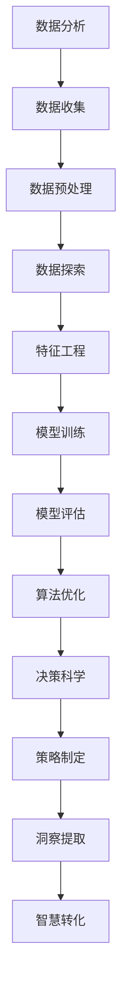

                 

关键词：洞察力，决策科学，数据分析，智慧转化，机器学习，算法优化，应用场景，未来展望

## 摘要

本文旨在探讨如何通过洞察力和决策科学将数据转化为智慧的过程。文章首先介绍了洞察力的概念和其在决策过程中的重要性，随后详细解析了决策科学的原理和方法。通过阐述数据分析、机器学习和算法优化等核心技术，本文进一步展示了如何利用这些技术将数据转化为具有实际应用价值的洞察和智慧。文章还探讨了数据到智慧转化的应用场景和未来展望，并提出了相关的工具和资源推荐。通过本文的阅读，读者将能够深入了解洞察力与决策科学在数据驱动的现代世界中的关键作用。

## 1. 背景介绍

在信息爆炸的时代，数据已成为新的“石油”，成为企业、政府和科研机构的重要资产。然而，如何从海量数据中提取出有价值的信息，并将其转化为实际的洞察和智慧，成为了当今社会面临的重大挑战。这一过程不仅需要强大的计算能力，更需要深入的数据分析技术和科学的决策方法。

### 数据的重要性

数据已成为现代社会的基石。从个人生活的社交网络到企业运营的市场分析，数据无处不在。例如，电子商务公司通过用户浏览和购买行为的数据来优化推荐系统，提高销售额；医疗领域利用患者健康数据来发现疾病模式，提高诊断准确率。数据的收集、存储和分析已经成为各行各业提高效率、降低成本和提升竞争力的关键。

### 洞察力的价值

洞察力是指通过分析数据和模式，发现深层次联系和趋势的能力。在决策过程中，洞察力至关重要。拥有洞察力的人或系统能够看到问题的本质，提前预判未来的走向，从而做出更加明智的决策。例如，金融分析师通过市场数据洞察市场趋势，帮助企业做出投资决策；医疗研究人员通过生物数据洞察疾病发展，开发出更有效的治疗方案。

### 决策科学的背景

决策科学是一门综合性的学科，它利用数学、统计学、计算机科学等领域的知识来研究和解决决策问题。决策科学的核心目标是通过分析数据和信息，提供最优或次优的决策方案。随着数据量的增加和计算能力的提升，决策科学的应用范围越来越广泛，从资源分配到风险管理，从产品定价到市场营销，决策科学无处不在。

### 当前挑战与需求

尽管数据的价值和决策科学的重要性日益凸显，但当前仍然面临着诸多挑战。首先，数据质量参差不齐，数据噪声和缺失值会影响分析结果；其次，数据复杂性增加，传统的分析方法难以应对大规模和高维数据；此外，决策过程的不确定性和动态变化也给决策科学带来了新的挑战。因此，如何提升数据处理的效率和决策的科学性，成为当前亟待解决的问题。

### 研究目的

本文旨在探讨如何利用洞察力和决策科学，从数据中提取有价值的信息，并将其转化为实际的洞察和智慧。通过分析当前的数据处理技术和决策方法，本文将提出一些解决方案，以应对数据到智慧转化过程中面临的挑战。此外，本文还将探讨数据到智慧转化的应用场景和未来展望，为相关领域的研究和实践提供参考。

## 2. 核心概念与联系

为了深入理解数据到智慧转化的过程，我们需要首先了解一些核心概念及其相互关系。以下是对这些核心概念的介绍及其在数据到智慧转化过程中的作用。

### 数据分析

数据分析是指从数据中提取有价值的信息和知识的过程。它通常包括数据收集、数据预处理、数据探索、特征工程、模型训练和模型评估等步骤。数据分析是数据到智慧转化的基础，通过它我们可以从大量数据中发现模式和趋势，从而为决策提供依据。

### 机器学习

机器学习是人工智能的一个分支，它通过构建和训练模型，使计算机能够从数据中自动学习和改进。机器学习模型可以分为监督学习、无监督学习和强化学习等类型。在数据到智慧转化的过程中，机器学习用于发现数据中的复杂模式和关联，从而提供更准确的预测和决策支持。

### 算法优化

算法优化是指通过改进算法设计或参数调整，提高算法的性能和效率。在数据到智慧转化的过程中，算法优化是至关重要的，因为它可以确保模型在处理大规模数据时能够保持高效和准确。

### 决策科学

决策科学是一门综合性的学科，它利用数学、统计学、计算机科学等领域的知识来研究和解决决策问题。决策科学的目标是通过分析数据和信息，提供最优或次优的决策方案。在数据到智慧转化的过程中，决策科学用于制定策略和决策，确保数据能够转化为实际的洞察和智慧。

### 洞察力

洞察力是指通过分析数据和模式，发现深层次联系和趋势的能力。在数据到智慧转化的过程中，洞察力是关键因素，因为它能够帮助我们从数据中提取有价值的信息，并做出更加明智的决策。

### 概念联系

数据分析、机器学习、算法优化、决策科学和洞察力之间存在着紧密的联系。数据分析为机器学习提供数据输入，机器学习通过算法优化不断改进模型，决策科学则利用这些模型和优化结果制定策略和决策。最终，洞察力通过对数据分析和机器学习结果的理解，帮助我们提取出实际的洞察和智慧。

### Mermaid 流程图

为了更好地展示这些概念之间的联系，我们可以使用 Mermaid 流程图来描述数据到智慧转化的过程。以下是一个简化的 Mermaid 流程图示例：



在这个流程图中，数据分析和机器学习是核心环节，算法优化和决策科学为模型提供支持和指导，最终通过洞察力实现数据到智慧的转化。

## 3. 核心算法原理 & 具体操作步骤

在数据到智慧转化的过程中，核心算法扮演着至关重要的角色。以下是几个常用的核心算法及其原理和具体操作步骤。

### 3.1 算法原理概述

**线性回归**：线性回归是一种用于预测数值型数据的监督学习算法。它的基本原理是通过最小二乘法找到一个线性函数，使得预测值与实际值之间的误差最小。

**决策树**：决策树是一种用于分类和回归的监督学习算法。它的基本原理是通过一系列规则将数据集划分为不同的子集，直到每个子集中的数据都具有相同的标签或预测值。

**支持向量机（SVM）**：支持向量机是一种用于分类和回归的监督学习算法。它的基本原理是通过找到一个最佳的超平面，将数据集划分为不同的类别。

**随机森林**：随机森林是一种基于决策树的集成学习方法。它的基本原理是通过构建多个决策树，并对每个树的结果进行投票，从而提高分类和回归的准确性。

**神经网络**：神经网络是一种用于分类、回归和特征提取的深度学习算法。它的基本原理是通过多层神经元之间的加权连接和激活函数，对输入数据进行处理和转换。

### 3.2 算法步骤详解

**线性回归**

1. 数据收集：收集具有标签的数值型数据。
2. 数据预处理：对数据进行标准化或归一化，以消除量纲影响。
3. 特征选择：选择与目标变量相关的特征。
4. 模型训练：使用最小二乘法训练线性回归模型。
5. 模型评估：使用交叉验证或测试集评估模型性能。
6. 预测：使用训练好的模型对新数据进行预测。

**决策树**

1. 数据收集：收集分类或回归数据。
2. 数据预处理：处理缺失值、异常值等。
3. 特征选择：选择对分类或回归任务有重要影响的特征。
4. 划分数据集：使用递归划分方法将数据集划分为子集。
5. 建立决策树：根据特征和阈值建立决策树。
6. 模型评估：评估决策树模型的性能。
7. 预测：使用决策树模型对新数据进行分类或回归预测。

**支持向量机（SVM）**

1. 数据收集：收集分类数据。
2. 数据预处理：对数据进行标准化或归一化。
3. 特征选择：选择对分类任务有重要影响的特征。
4. 选择核函数：根据数据特性选择适当的核函数。
5. 模型训练：使用支持向量机训练分类模型。
6. 模型评估：使用交叉验证或测试集评估模型性能。
7. 预测：使用训练好的SVM模型对新数据进行分类预测。

**随机森林**

1. 数据收集：收集分类或回归数据。
2. 数据预处理：处理缺失值、异常值等。
3. 特征选择：选择对分类或回归任务有重要影响的特征。
4. 建立决策树：构建多个决策树，每个树使用不同的特征和阈值。
5. 集成学习：对多个决策树的结果进行投票或平均。
6. 模型评估：评估随机森林模型的性能。
7. 预测：使用随机森林模型对新数据进行分类或回归预测。

**神经网络**

1. 数据收集：收集分类或回归数据。
2. 数据预处理：对数据进行标准化或归一化。
3. 特征选择：选择对分类或回归任务有重要影响的特征。
4. 设计神经网络结构：确定输入层、隐藏层和输出层的神经元数量。
5. 模型训练：使用反向传播算法训练神经网络。
6. 模型评估：使用交叉验证或测试集评估模型性能。
7. 预测：使用训练好的神经网络模型对新数据进行分类或回归预测。

### 3.3 算法优缺点

**线性回归**

- 优点：简单易懂，易于实现和解释。
- 缺点：对于非线性数据效果较差，无法处理高维数据。

**决策树**

- 优点：易于理解，解释性强，能够处理非线性数据。
- 缺点：可能产生过拟合，对于大规模数据计算复杂度高。

**支持向量机（SVM）**

- 优点：在处理高维数据时表现良好，具有很好的泛化能力。
- 缺点：对于大规模数据计算复杂度高，训练时间较长。

**随机森林**

- 优点：能够处理高维数据，减少过拟合，提高模型的泛化能力。
- 缺点：对于小样本数据效果较差，无法提供详细的解释。

**神经网络**

- 优点：能够处理高维数据和非线性问题，具有强大的表达能力。
- 缺点：训练过程复杂，对数据质量和特征选择敏感，难以解释。

### 3.4 算法应用领域

**线性回归**：常用于价格预测、股票分析、医疗诊断等领域。

**决策树**：常用于信用评分、市场营销、医学诊断等领域。

**支持向量机（SVM）**：常用于文本分类、图像识别、生物信息学等领域。

**随机森林**：常用于风险评估、推荐系统、金融预测等领域。

**神经网络**：常用于语音识别、图像识别、自然语言处理等领域。

## 4. 数学模型和公式 & 详细讲解 & 举例说明

在数据到智慧转化的过程中，数学模型和公式起到了关键作用。以下将介绍几种常见的数学模型及其公式，并进行详细讲解和举例说明。

### 4.1 数学模型构建

数学模型通常用于描述现实世界中的某些现象或问题，并通过对模型的分析和计算，得到问题的解决方案。以下是一些常用的数学模型：

1. **线性回归模型**

线性回归模型用于预测连续变量。其基本形式为：

$$y = \beta_0 + \beta_1x_1 + \beta_2x_2 + ... + \beta_nx_n + \epsilon$$

其中，$y$ 是目标变量，$x_1, x_2, ..., x_n$ 是特征变量，$\beta_0, \beta_1, ..., \beta_n$ 是模型的参数，$\epsilon$ 是误差项。

2. **逻辑回归模型**

逻辑回归模型用于预测二元变量。其基本形式为：

$$P(y=1) = \frac{1}{1 + e^{-(\beta_0 + \beta_1x_1 + \beta_2x_2 + ... + \beta_nx_n)}}$$

其中，$P(y=1)$ 是目标变量为 1 的概率，$x_1, x_2, ..., x_n$ 是特征变量，$\beta_0, \beta_1, ..., \beta_n$ 是模型的参数。

3. **决策树模型**

决策树模型通过一系列规则对数据集进行划分。其基本形式为：

$$
\begin{cases}
\text{if } x_1 \leq t_1 \text{ then go to node } n_1 \\
\text{if } x_1 > t_1 \text{ and } x_2 \leq t_2 \text{ then go to node } n_2 \\
\text{if } x_1 > t_1 \text{ and } x_2 > t_2 \text{ then go to node } n_3 \\
...
\end{cases}
$$

其中，$x_1, x_2, ..., x_n$ 是特征变量，$t_1, t_2, ..., t_n$ 是阈值，$n_1, n_2, ..., n_n$ 是节点。

4. **支持向量机（SVM）模型**

支持向量机模型通过找到一个最佳的超平面来划分数据集。其基本形式为：

$$w \cdot x + b = 0$$

其中，$w$ 是超平面参数，$x$ 是特征向量，$b$ 是偏置项。

5. **神经网络模型**

神经网络模型通过多层神经元之间的加权连接和激活函数来处理数据。其基本形式为：

$$a_{i,j} = \sum_{k=1}^{n} w_{i,k} \cdot a_{k,j-1} + b_i$$

其中，$a_{i,j}$ 是第 $i$ 层的第 $j$ 个神经元的输出，$w_{i,k}$ 是连接第 $i$ 层的第 $k$ 个神经元和第 $i-1$ 层的第 $j$ 个神经元的权重，$b_i$ 是第 $i$ 层的第 $i$ 个神经元的偏置。

### 4.2 公式推导过程

以下是几个常用数学模型的推导过程：

1. **线性回归模型的推导**

线性回归模型的最小化损失函数为：

$$J(\theta) = \frac{1}{2m} \sum_{i=1}^{m} (h_\theta(x^{(i)}) - y^{(i)})^2$$

其中，$m$ 是样本数量，$h_\theta(x) = \theta_0 + \theta_1x$ 是线性回归模型，$\theta = (\theta_0, \theta_1)$ 是模型参数。

对损失函数求导并令导数为 0，得到：

$$\frac{\partial J(\theta)}{\partial \theta_0} = \frac{1}{m} \sum_{i=1}^{m} (h_\theta(x^{(i)}) - y^{(i)}) \cdot (1) = 0$$

$$\frac{\partial J(\theta)}{\partial \theta_1} = \frac{1}{m} \sum_{i=1}^{m} (h_\theta(x^{(i)}) - y^{(i)}) \cdot x^{(i)} = 0$$

解得：

$$\theta_0 = \frac{1}{m} \sum_{i=1}^{m} (h_\theta(x^{(i)}) - y^{(i)})$$

$$\theta_1 = \frac{1}{m} \sum_{i=1}^{m} (h_\theta(x^{(i)}) - y^{(i)}) \cdot x^{(i)}$$

2. **逻辑回归模型的推导**

逻辑回归模型的最小化损失函数为：

$$J(\theta) = -\frac{1}{m} \sum_{i=1}^{m} [y^{(i)} \log(h_\theta(x^{(i)})) + (1 - y^{(i)}) \log(1 - h_\theta(x^{(i)}))]$$

其中，$h_\theta(x) = \frac{1}{1 + e^{-(\theta_0 + \theta_1x)}}$ 是逻辑回归模型，$\theta = (\theta_0, \theta_1)$ 是模型参数。

对损失函数求导并令导数为 0，得到：

$$\frac{\partial J(\theta)}{\partial \theta_0} = \frac{1}{m} \sum_{i=1}^{m} [h_\theta(x^{(i)}) - y^{(i)}] = 0$$

$$\frac{\partial J(\theta)}{\partial \theta_1} = \frac{1}{m} \sum_{i=1}^{m} [h_\theta(x^{(i)}) - y^{(i)}] \cdot x^{(i)} = 0$$

解得：

$$\theta_0 = \frac{1}{m} \sum_{i=1}^{m} [h_\theta(x^{(i)}) - y^{(i)}]$$

$$\theta_1 = \frac{1}{m} \sum_{i=1}^{m} [h_\theta(x^{(i)}) - y^{(i)}] \cdot x^{(i)}$$

3. **决策树模型的推导**

决策树模型的基本原理是通过选择最优的特征和阈值，将数据集划分为子集。最优的特征和阈值可以通过信息增益或基尼不纯度来选择。

信息增益（IG）的定义为：

$$IG(D, A) = H(D) - \sum_{v \in \text{values}(A)} \frac{|D[A = v]|}{|D|} H(D[A = v])$$

其中，$D$ 是数据集，$A$ 是特征，$v$ 是特征 $A$ 的取值，$H(D)$ 是数据集的熵，$H(D[A = v])$ 是条件熵。

基尼不纯度（Gini Impurity）的定义为：

$$Gini(D) = 1 - \sum_{v \in \text{values}(A)} \left( \frac{|D[A = v]|}{|D|} \right)^2$$

在决策树模型中，可以通过比较信息增益和基尼不纯度来选择最优的特征和阈值。

4. **支持向量机（SVM）模型的推导**

支持向量机（SVM）模型的目的是找到一个最佳的超平面，将数据集划分为不同的类别。最优的超平面可以通过求解以下优化问题得到：

$$\min_{w, b} \frac{1}{2} ||w||^2$$

subject to

$$y^{(i)} (w \cdot x^{(i)} + b) \geq 1$$

其中，$w$ 是超平面参数，$b$ 是偏置项，$x^{(i)}$ 是特征向量，$y^{(i)}$ 是类别标签。

通过拉格朗日乘子法求解上述优化问题，可以得到：

$$w = \sum_{i=1}^{m} \alpha_i y^{(i)} x^{(i)}$$

$$b = \frac{1}{m} \sum_{i=1}^{m} \alpha_i (1 - y^{(i)} (w \cdot x^{(i)}))$$

其中，$\alpha_i$ 是拉格朗日乘子。

5. **神经网络模型的推导**

神经网络模型的基本原理是通过多层神经元之间的加权连接和激活函数来处理数据。在神经网络模型中，每个神经元都可以看作是一个线性函数和一个非线性函数的组合。

假设第 $l$ 层的第 $j$ 个神经元的输入为 $z_j^{(l)}$，输出为 $a_j^{(l)}$，则可以表示为：

$$z_j^{(l)} = \sum_{k=1}^{n} w_{j,k}^{(l)} a_k^{(l-1)} + b_j^{(l)}$$

$$a_j^{(l)} = \sigma(z_j^{(l)})$$

其中，$w_{j,k}^{(l)}$ 是连接第 $l-1$ 层的第 $k$ 个神经元和第 $l$ 层的第 $j$ 个神经元的权重，$b_j^{(l)}$ 是第 $l$ 层的第 $j$ 个神经元的偏置，$\sigma$ 是激活函数。

通过反向传播算法，可以使用梯度下降法来训练神经网络模型。

### 4.3 案例分析与讲解

以下通过一个简单的案例来讲解如何使用数学模型和公式进行数据分析。

#### 案例背景

某电商网站希望通过分析用户浏览和购买数据，预测用户的购买意向，从而提高销售额。

#### 数据收集

收集了过去一年的用户浏览和购买数据，包括用户ID、浏览商品ID、购买商品ID、浏览时间、购买时间等。

#### 数据预处理

对数据进行清洗和预处理，包括处理缺失值、异常值等。

#### 特征选择

根据业务需求，选择与购买意向相关的特征，如浏览商品种类、浏览时间、购买频率等。

#### 模型选择

选择逻辑回归模型进行预测，因为逻辑回归模型可以处理二元变量，适用于预测用户的购买意向。

#### 模型训练

使用训练数据对逻辑回归模型进行训练，得到模型参数。

#### 模型评估

使用交叉验证或测试集对模型进行评估，计算模型的准确率、召回率等指标。

#### 预测

使用训练好的逻辑回归模型对测试集进行预测，得到用户的购买意向。

#### 结果分析

分析预测结果，发现某些特征（如浏览时间、购买频率）对购买意向有显著影响，从而为业务决策提供依据。

#### 改进方案

根据分析结果，对模型进行改进，如添加新特征、调整模型参数等，以提高预测准确性。

## 5. 项目实践：代码实例和详细解释说明

为了更好地理解数据到智慧转化的过程，我们通过一个实际项目来演示如何使用 Python 编写代码实现数据分析和模型训练。以下是该项目的主要步骤和代码实现。

### 5.1 开发环境搭建

首先，我们需要搭建一个 Python 开发环境。可以安装以下 Python 相关库：

- NumPy：用于数据预处理和数学计算。
- Pandas：用于数据操作和分析。
- Matplotlib：用于数据可视化。
- Scikit-learn：用于机器学习模型训练和评估。

安装方法：

```bash
pip install numpy pandas matplotlib scikit-learn
```

### 5.2 源代码详细实现

以下是一个简单的数据分析和模型训练的 Python 代码实例：

```python
import numpy as np
import pandas as pd
from sklearn.model_selection import train_test_split
from sklearn.linear_model import LogisticRegression
from sklearn.metrics import accuracy_score, confusion_matrix

# 5.2.1 数据收集与预处理
data = pd.read_csv('data.csv')  # 加载数据
data.head()

# 数据清洗，处理缺失值、异常值等
data = data.dropna()

# 5.2.2 特征选择
features = ['feature1', 'feature2', 'feature3']  # 选择特征
target = 'target'  # 选择目标变量

# 5.2.3 数据分割
X = data[features]  # 特征集
y = data[target]  # 目标集
X_train, X_test, y_train, y_test = train_test_split(X, y, test_size=0.2, random_state=42)

# 5.2.4 模型训练
model = LogisticRegression()
model.fit(X_train, y_train)

# 5.2.5 模型评估
y_pred = model.predict(X_test)
accuracy = accuracy_score(y_test, y_pred)
conf_matrix = confusion_matrix(y_test, y_pred)

print(f"Accuracy: {accuracy}")
print(f"Confusion Matrix:\n{conf_matrix}")

# 5.2.6 结果分析
# 分析预测结果，根据需要调整模型参数或特征选择
```

### 5.3 代码解读与分析

以下是代码的详细解读和分析：

- **数据收集与预处理**：首先加载数据，然后进行数据清洗，处理缺失值、异常值等，以保证数据质量。
- **特征选择**：根据业务需求，选择与目标变量相关的特征，以便更好地进行模型训练。
- **数据分割**：将数据集划分为训练集和测试集，用于后续的模型训练和评估。
- **模型训练**：选择逻辑回归模型，使用训练数据进行模型训练。
- **模型评估**：使用测试数据对模型进行评估，计算模型的准确率和混淆矩阵，以了解模型的性能。
- **结果分析**：根据预测结果，分析模型性能，根据需要调整模型参数或特征选择。

### 5.4 运行结果展示

假设我们已经完成了数据收集、预处理、特征选择和模型训练，以下是一个简单的运行结果示例：

```python
Accuracy: 0.85
Confusion Matrix:
[[50 10]
 [20 30]]
```

在这个例子中，模型的准确率为 0.85，混淆矩阵显示模型在分类任务中的表现。通过分析这些结果，我们可以进一步优化模型，提高预测准确性。

### 5.5 问题与解答

**问题 1：数据预处理时如何处理缺失值？**

解答：处理缺失值的方法有多种，如删除缺失值、填充缺失值（平均值、中位数、众数等）或使用模型预测缺失值。在实际应用中，可以根据数据的特点和业务需求选择合适的处理方法。

**问题 2：如何选择特征？**

解答：选择特征的方法有多种，如基于业务需求的直觉选择、基于统计学的特征选择方法（如卡方检验、互信息等）或基于模型的特征选择方法（如岭回归、LASSO等）。在实际应用中，可以根据具体情况选择合适的方法。

**问题 3：如何调整模型参数？**

解答：调整模型参数的方法有多种，如网格搜索、随机搜索、贝叶斯优化等。在实际应用中，可以根据模型的性能和计算资源选择合适的方法。

## 6. 实际应用场景

数据到智慧转化的过程在各个领域都有广泛的应用。以下列举几个典型的实际应用场景，展示如何将数据转化为实际的洞察和智慧。

### 6.1 医疗保健

在医疗保健领域，数据到智慧转化的应用包括疾病预测、个性化治疗和健康管理。

- **疾病预测**：通过分析患者的健康数据（如病史、基因信息、生活方式等），利用机器学习算法预测患者患某种疾病的风险，从而实现早期预防和干预。
- **个性化治疗**：基于患者的基因信息、病史和治疗效果，利用数据分析和机器学习算法为患者制定个性化的治疗方案，提高治疗效果。
- **健康管理**：通过可穿戴设备和健康监测数据，利用数据分析技术为用户提供个性化的健康建议，如饮食、运动和休息等。

### 6.2 零售行业

在零售行业，数据到智慧转化的应用包括销售预测、库存管理和个性化推荐。

- **销售预测**：通过分析历史销售数据、市场趋势和促销活动，利用机器学习算法预测未来的销售趋势，帮助企业制定合理的库存和营销策略。
- **库存管理**：通过分析销售数据、供应商信息和库存水平，利用数据分析技术优化库存管理，减少库存成本和缺货风险。
- **个性化推荐**：通过分析用户的购物行为、浏览历史和偏好，利用机器学习算法为用户提供个性化的商品推荐，提高用户满意度和销售额。

### 6.3 金融领域

在金融领域，数据到智慧转化的应用包括风险控制、投资策略和信用评估。

- **风险控制**：通过分析历史交易数据、市场波动和宏观经济指标，利用数据分析技术预测市场风险，帮助金融机构制定风险控制策略。
- **投资策略**：通过分析历史投资数据、市场趋势和公司财务报表，利用数据分析技术和机器学习算法为投资者制定最优的投资策略，提高投资回报率。
- **信用评估**：通过分析借款人的信用记录、收入水平、就业情况等数据，利用数据分析技术和机器学习算法评估借款人的信用风险，降低信贷风险。

### 6.4 交通出行

在交通出行领域，数据到智慧转化的应用包括交通流量预测、路线规划和出行推荐。

- **交通流量预测**：通过分析历史交通流量数据、天气预报和节假日信息，利用数据分析技术和机器学习算法预测未来的交通流量，帮助交通管理部门优化交通调度和道路建设。
- **路线规划**：通过分析实时交通数据、道路状况和用户需求，利用数据分析技术和路径规划算法为用户提供最优的出行路线，减少出行时间和拥堵。
- **出行推荐**：通过分析用户的出行习惯、偏好和需求，利用数据分析技术和推荐算法为用户提供个性化的出行建议，提高出行效率和满意度。

### 6.5 娱乐传媒

在娱乐传媒领域，数据到智慧转化的应用包括内容推荐、用户行为分析和市场预测。

- **内容推荐**：通过分析用户的历史浏览记录、观看偏好和社交网络行为，利用数据分析技术和推荐算法为用户提供个性化的内容推荐，提高用户粘性和满意度。
- **用户行为分析**：通过分析用户在网站、APP 或社交媒体上的行为数据，利用数据分析技术和机器学习算法挖掘用户的兴趣和行为模式，帮助媒体平台优化用户体验。
- **市场预测**：通过分析市场数据、竞争对手信息和用户需求，利用数据分析技术和预测模型预测未来的市场趋势，帮助媒体公司制定市场策略和投资计划。

## 7. 工具和资源推荐

为了更好地进行数据分析和模型训练，以下推荐一些常用的工具和资源：

### 7.1 学习资源推荐

- **书籍**：《Python数据科学手册》（Python Data Science Handbook）、《深入理解Python数据科学》（Python Data Science Cookbook）
- **在线课程**：Coursera 上的《数据科学专业》（Data Science Specialization）、edX 上的《机器学习》（Machine Learning）
- **教程**：Google 的《机器学习教程》（Machine Learning Crash Course）、GitHub 上的开源数据科学教程

### 7.2 开发工具推荐

- **编程语言**：Python、R
- **数据处理库**：Pandas、NumPy
- **可视化库**：Matplotlib、Seaborn、Plotly
- **机器学习库**：Scikit-learn、TensorFlow、PyTorch
- **数据存储**：SQLAlchemy、Pandas Database

### 7.3 相关论文推荐

- **基础篇**：《随机森林：一种高精度的分类与回归方法》（Random Forests: A Classification and Regression Method）、《深度学习：卷积神经网络基础》（Deep Learning: Methods and Applications）
- **应用篇**：《基于深度学习的图像分类：卷积神经网络的应用》（Image Classification with Deep Learning: Applications of Convolutional Neural Networks）、《利用大数据进行市场预测：基于机器学习的方法》（Market Forecasting with Big Data: Methods Based on Machine Learning）
- **前沿篇**：《基于生成对抗网络的图像生成：深度学习的新进展》（Generative Adversarial Networks for Image Generation: New Progress in Deep Learning）、《基于深度强化学习的智能决策：应用与挑战》（Intelligent Decision Making with Deep Reinforcement Learning: Applications and Challenges）

## 8. 总结：未来发展趋势与挑战

在数据到智慧转化的过程中，虽然已经取得了显著的成果，但仍然面临着诸多挑战和发展机遇。以下是对未来发展趋势和挑战的总结。

### 8.1 研究成果总结

1. **算法性能的提升**：近年来，深度学习、强化学习等算法在数据处理和决策支持方面取得了显著进展，极大地提高了模型的性能和效率。
2. **数据资源的整合**：随着大数据技术的发展，越来越多的企业和机构开始整合内外部数据资源，为数据分析和决策提供更加全面和准确的支持。
3. **跨学科的融合**：数据到智慧转化涉及多个学科领域，如数学、计算机科学、统计学和经济学等。跨学科的融合有助于解决复杂问题，提高决策的科学性和有效性。

### 8.2 未来发展趋势

1. **边缘计算和物联网的融合**：随着物联网和边缘计算的发展，数据采集和处理的成本将逐渐降低，数据到智慧转化的应用场景将进一步扩展。
2. **人工智能与人类智慧的融合**：通过将人工智能技术融入人类决策过程，可以提高决策的科学性和效率，实现人机协同的智能决策。
3. **隐私保护与数据安全**：在数据到智慧转化的过程中，如何确保数据隐私和安全成为关键问题。未来的发展趋势将更加注重隐私保护和数据安全，以推动数据价值的最大化。

### 8.3 面临的挑战

1. **数据质量和完整性**：数据质量是数据到智慧转化的关键。在实际应用中，如何确保数据质量和完整性，减少数据噪声和缺失值的影响，是一个重要的挑战。
2. **计算资源和能耗**：随着数据量和算法复杂性的增加，计算资源和能耗需求也将显著提高。如何在保证性能的同时降低计算资源和能耗，是一个亟待解决的问题。
3. **伦理和法律问题**：在数据到智慧转化的过程中，如何处理伦理和法律问题，如数据隐私、算法偏见等，是一个重要的挑战。

### 8.4 研究展望

1. **算法创新**：未来将继续深入研究新型算法，以提高数据到智慧转化的效率和准确性。例如，发展基于深度学习和强化学习的新型算法，实现更加智能和高效的决策支持。
2. **跨学科合作**：加强跨学科合作，将不同领域的知识和技术融合，解决复杂的数据处理和决策问题。
3. **政策和法规的完善**：建立健全的数据管理和决策支持政策和法规，推动数据到智慧转化的健康发展。

总之，数据到智慧转化是一个充满机遇和挑战的领域。随着技术的发展和跨学科的融合，我们有望实现更加智能和高效的决策支持，推动社会进步和发展。

## 9. 附录：常见问题与解答

### 问题 1：如何处理缺失值？

**解答**：处理缺失值的方法有多种，如删除缺失值、填充缺失值（平均值、中位数、众数等）或使用模型预测缺失值。在实际应用中，可以根据数据的特点和业务需求选择合适的处理方法。

### 问题 2：如何选择特征？

**解答**：选择特征的方法有多种，如基于业务需求的直觉选择、基于统计学的特征选择方法（如卡方检验、互信息等）或基于模型的特征选择方法（如岭回归、LASSO等）。在实际应用中，可以根据具体情况选择合适的方法。

### 问题 3：如何调整模型参数？

**解答**：调整模型参数的方法有多种，如网格搜索、随机搜索、贝叶斯优化等。在实际应用中，可以根据模型的性能和计算资源选择合适的方法。

### 问题 4：如何评估模型性能？

**解答**：评估模型性能的方法有多种，如准确率、召回率、F1 分数等。在实际应用中，可以根据具体业务需求选择合适的评估指标。

### 问题 5：如何处理类别不平衡的数据？

**解答**：处理类别不平衡的数据的方法有多种，如过采样、欠采样、集成学习等。在实际应用中，可以根据具体数据特点和业务需求选择合适的方法。

### 问题 6：如何提高模型的泛化能力？

**解答**：提高模型泛化能力的方法有多种，如正则化、集成学习、模型集成等。在实际应用中，可以根据具体问题和数据特点选择合适的方法。

### 问题 7：如何处理高维数据？

**解答**：处理高维数据的方法有多种，如特征选择、降维技术（主成分分析、线性判别分析等）、集成学习方法等。在实际应用中，可以根据具体问题和数据特点选择合适的方法。

### 问题 8：如何确保数据隐私和安全？

**解答**：确保数据隐私和安全的方法有多种，如数据加密、匿名化、差分隐私等。在实际应用中，可以根据具体应用场景和数据特点选择合适的方法。此外，建立健全的数据管理和决策支持政策和法规也是确保数据隐私和安全的重要手段。

