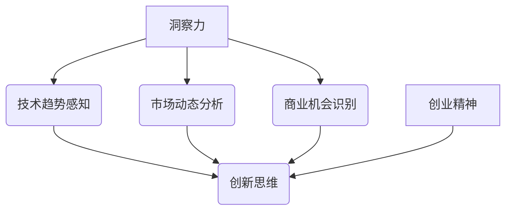

                 

关键词：洞察力，创业精神，商业机会，技术趋势，创新思维

> 摘要：本文旨在探讨洞察力和创业精神在发现商业机会中的重要性。通过分析技术和市场的动态变化，本文提出了一系列实用的方法和策略，帮助读者培养敏锐的商业洞察力，以在快速变化的市场中抓住机遇，实现创业梦想。

## 1. 背景介绍

在当今这个充满不确定性和变化的时代，技术进步和市场变革的速度之快，使得商业机会的发现和把握成为企业成功的关键。然而，并不是每个创业者或企业都能够准确地捕捉到这些机会。这背后，很大程度上取决于个人或团队的洞察力和创业精神。

洞察力是指对事物本质的深刻理解力，它不仅仅是对事实的观察，更是对趋势的预见和对未来可能性的洞察。创业精神则是一种追求创新、敢于冒险和持续探索的精神状态，它驱动着创业者不断探索新的商业机会。

本文将围绕这两个核心概念展开，探讨如何在信息技术领域中培养洞察力，激发创业精神，从而发现和把握商业机会。

## 2. 核心概念与联系

为了深入理解洞察力和创业精神，我们首先需要了解它们的概念和联系。以下是一个Mermaid流程图，展示了这两个概念及其相关元素。



### 2.1 洞察力的组成部分

- **技术趋势感知**：了解最新的技术进展和趋势，包括新兴技术、现有技术的改进和新应用场景。
- **市场动态分析**：对市场环境进行深入分析，包括消费者需求、竞争对手、市场容量和潜在风险。
- **商业机会识别**：通过技术和市场分析，识别出潜在的商业机会。

### 2.2 创业精神的内涵

- **创新思维**：敢于打破传统思维模式，勇于尝试新的方法和理念。
- **冒险精神**：面对未知和挑战，勇于冒险并承担风险。
- **持续探索**：不断探索和学习，以适应快速变化的环境。

## 3. 核心算法原理 & 具体操作步骤

### 3.1 算法原理概述

在洞察力的培养过程中，算法的应用起到了至关重要的作用。以下是一种基于数据分析和机器学习的洞察力培养算法原理概述。

### 3.2 算法步骤详解

1. **数据收集**：收集与技术和市场相关的数据，包括技术文献、市场报告、用户反馈等。
2. **数据预处理**：清洗和整合数据，为后续分析做准备。
3. **特征提取**：从数据中提取关键特征，用于模型训练。
4. **模型训练**：使用机器学习算法（如聚类、分类等）对特征进行训练，建立预测模型。
5. **模型评估**：评估模型的性能，包括准确性、召回率等指标。
6. **应用实践**：将训练好的模型应用于实际场景，如商业机会识别、市场预测等。

### 3.3 算法优缺点

- **优点**：
  - 提高洞察力的效率和准确性。
  - 能够处理大规模数据，发现潜在趋势和模式。
- **缺点**：
  - 需要大量数据和计算资源。
  - 模型训练和评估过程复杂，需要专业知识。

### 3.4 算法应用领域

- **商业机会识别**：通过分析市场数据，发现潜在的商业机会。
- **产品创新**：结合用户需求和最新技术，指导产品创新。
- **风险管理**：预测市场变化，降低企业风险。

## 4. 数学模型和公式 & 详细讲解 & 举例说明

在商业机会的发现过程中，数学模型和公式起到了重要的作用。以下是一个简化的数学模型，用于预测市场趋势。

### 4.1 数学模型构建

假设市场趋势可以通过以下公式预测：

$$
T(t) = A \cdot e^{kt} + B
$$

其中，$T(t)$ 表示市场趋势，$t$ 表示时间，$A$ 和 $B$ 为常数，$k$ 为趋势参数。

### 4.2 公式推导过程

1. **趋势假设**：假设市场趋势呈指数增长或下降。
2. **数据拟合**：使用历史数据进行拟合，确定常数 $A$ 和 $B$。
3. **趋势预测**：使用拟合得到的模型，预测未来的市场趋势。

### 4.3 案例分析与讲解

#### 案例：某产品市场需求预测

某公司生产一种新型智能家居产品，通过收集过去一年的销售数据，拟合出市场需求模型：

$$
T(t) = 1000 \cdot e^{0.1t} + 500
$$

假设当前时间为第10个月，预测未来3个月的需求量。

1. **计算当前市场需求**：

$$
T(10) = 1000 \cdot e^{0.1 \cdot 10} + 500 = 1570
$$

2. **预测未来需求**：

$$
T(11) = 1000 \cdot e^{0.1 \cdot 11} + 500 \approx 1730
$$

$$
T(12) = 1000 \cdot e^{0.1 \cdot 12} + 500 \approx 1890
$$

$$
T(13) = 1000 \cdot e^{0.1 \cdot 13} + 500 \approx 2060
$$

根据预测，未来3个月的需求量分别为1730、1890和2060。

## 5. 项目实践：代码实例和详细解释说明

以下是一个Python代码实例，用于实现上述数学模型的市场需求预测。

### 5.1 开发环境搭建

- Python版本：3.8及以上
- 库：NumPy，SciPy，Matplotlib

### 5.2 源代码详细实现

```python
import numpy as np
import matplotlib.pyplot as plt

# 模型参数
A = 1000
B = 500
k = 0.1

# 预测时间序列
t = np.linspace(1, 15, 15)

# 计算市场需求
T = A * np.exp(k * t) + B

# 绘图
plt.plot(t, T, label='Market Trend')
plt.xlabel('Time (Months)')
plt.ylabel('Demand')
plt.title('Demand Prediction')
plt.legend()
plt.show()
```

### 5.3 代码解读与分析

1. **参数设置**：定义模型参数 $A$，$B$ 和 $k$。
2. **时间序列**：生成时间序列 $t$，用于计算市场需求。
3. **计算市场需求**：使用公式计算市场需求 $T$。
4. **绘图**：绘制市场需求曲线，直观展示预测结果。

### 5.4 运行结果展示

运行上述代码，可以得到市场需求的时间序列曲线。根据曲线，可以直观地观察到市场需求随时间的变化趋势。

## 6. 实际应用场景

### 6.1 智能家居市场

智能家居市场是一个快速发展的领域，新技术和新产品的不断涌现，为创业者提供了丰富的商业机会。通过洞察力的培养，创业者可以准确地识别出市场需求，开发出符合用户期望的产品。

### 6.2 区块链应用

区块链技术的普及，使得其在金融、供应链管理、医疗等多个领域得到了广泛应用。创业者可以通过对区块链技术的深入研究和市场动态的分析，发现新的商业机会。

### 6.3 人工智能辅助教育

随着人工智能技术的进步，其在教育领域的应用也越来越广泛。创业者可以结合人工智能技术，开发出更加智能化的教育产品，提高教育质量。

## 7. 未来应用展望

### 7.1 技术趋势

随着5G、物联网、人工智能等技术的不断发展，未来商业机会将更加丰富。创业者需要保持敏锐的洞察力，及时抓住技术变革带来的机遇。

### 7.2 市场竞争

市场竞争将越来越激烈，创业者需要不断创新，提高产品和服务质量，以在竞争中脱颖而出。

### 7.3 风险管理

在快速变化的市场环境中，创业者需要具备良好的风险管理能力，降低企业风险。

## 8. 总结：未来发展趋势与挑战

在未来，洞察力和创业精神将成为企业成功的关键。创业者需要不断学习和探索，培养敏锐的商业洞察力，以在快速变化的市场中抓住机遇，实现创业梦想。

### 8.1 研究成果总结

本文通过分析技术和市场的动态变化，提出了一系列培养洞察力和创业精神的方法和策略。这些方法和策略有助于创业者发现和把握商业机会，实现创业目标。

### 8.2 未来发展趋势

未来，随着技术的不断进步和市场环境的变革，商业机会将更加多样化。创业者需要保持敏锐的洞察力，紧跟市场趋势，抓住机遇。

### 8.3 面临的挑战

在快速变化的市场环境中，创业者将面临诸多挑战，如技术风险、市场竞争等。需要具备良好的风险管理能力和持续创新的精神。

### 8.4 研究展望

未来，可以进一步研究如何通过人工智能技术提升商业洞察力，开发出更加智能化的商业分析工具，以帮助创业者更好地发现和把握商业机会。

## 9. 附录：常见问题与解答

### 9.1 什么是洞察力？

洞察力是指对事物本质的深刻理解力，它不仅仅是对事实的观察，更是对趋势的预见和对未来可能性的洞察。

### 9.2 创业精神包括哪些方面？

创业精神包括创新思维、冒险精神和持续探索等方面，它驱动着创业者不断探索新的商业机会。

### 9.3 如何培养洞察力？

通过学习最新的技术和市场动态，进行深入的思考和分析，不断积累经验和知识，可以培养敏锐的洞察力。

### 作者署名

作者：禅与计算机程序设计艺术 / Zen and the Art of Computer Programming
```

