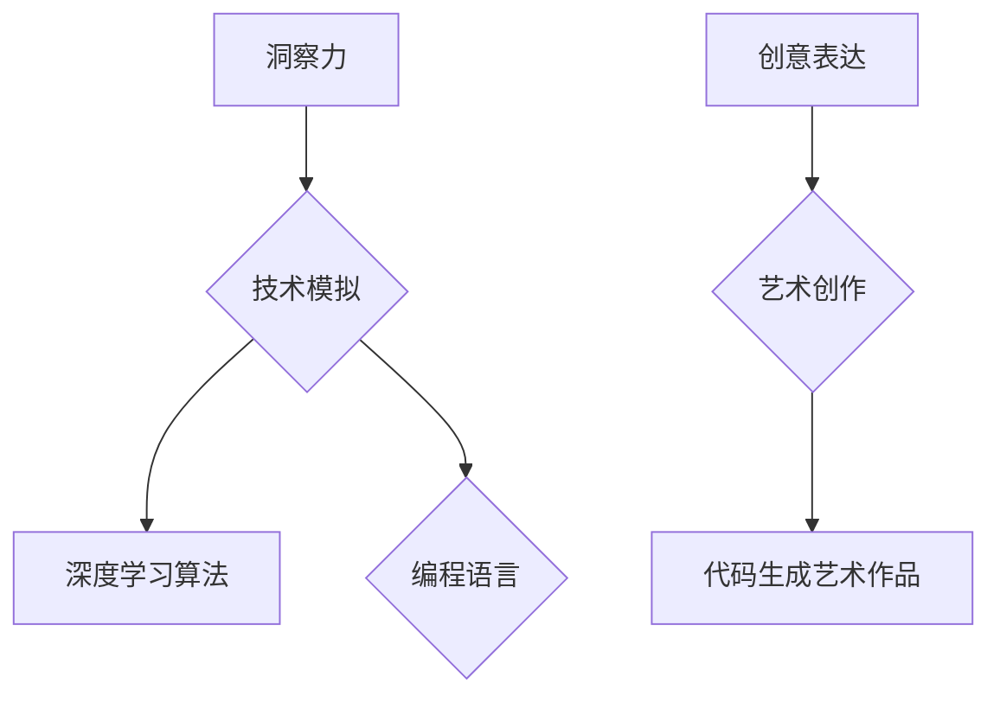

                 

关键词：洞察力，创意表达，艺术创作，源泉，技术语言，深度思考，专业见解。

> 摘要：本文旨在探讨洞察力与创意表达在艺术创作中的重要性，并从技术语言的角度，深入剖析艺术创作的源泉。通过对核心概念的介绍、算法原理的阐述、数学模型的讲解以及项目实践的展示，本文将为读者提供一个全方位的理解，助力他们在艺术创作的道路上取得新的突破。

## 1. 背景介绍

在信息爆炸的时代，艺术创作不再仅仅局限于传统领域，而是融入了越来越多的技术元素。从数字艺术到虚拟现实，技术的进步为艺术家们提供了前所未有的创作工具和手段。然而，技术并非万能，真正的艺术创作源泉往往来自于人类的洞察力和创意表达。

洞察力，是指对事物本质的深刻理解和敏锐观察。创意表达，则是指通过独特的方式和手法，将内心的想法和感受转化为视觉或听觉的形式。这两者在艺术创作中相辅相成，共同构成了艺术作品的灵魂。

本文将围绕这两个核心概念展开讨论，通过技术语言的分析，探索艺术创作的源泉，帮助读者更好地理解艺术与技术的融合。

## 2. 核心概念与联系

### 2.1 洞察力

洞察力是艺术创作的基石。艺术家通过对生活的观察、体验和思考，提炼出深刻的见解和情感。这种洞察力不仅仅是对现实的反映，更是一种对现实超越的创造力。

在技术语言中，我们可以用算法和模型来模拟洞察力。例如，通过深度学习算法，计算机可以学会识别和生成各种图像，从而实现对艺术作品的模仿和创作。

### 2.2 创意表达

创意表达是艺术创作的灵魂。艺术家通过独特的视角、手法和技巧，将自己的思想和情感传递给观众。在技术语言中，编程语言和算法就是艺术家手中的画笔，通过代码和算法，他们可以创造出独特的艺术形式。

### 2.3 Mermaid 流程图

为了更好地理解这两个核心概念之间的联系，我们可以使用 Mermaid 流程图进行描述。



这个流程图展示了洞察力如何通过技术手段进行模拟，进而转化为创意表达，最终形成艺术作品。

## 3. 核心算法原理 & 具体操作步骤

### 3.1 算法原理概述

在艺术创作中，核心算法主要包括深度学习算法、生成对抗网络（GAN）和自然语言处理（NLP）等。这些算法通过学习和模拟人类的思维过程，实现了对艺术作品的创作和表达。

### 3.2 算法步骤详解

- **深度学习算法**：通过神经网络模型，学习大量数据中的特征和规律，实现对图像、声音等信息的自动识别和生成。
- **生成对抗网络（GAN）**：由生成器和判别器组成，通过相互对抗的过程，生成逼真的艺术作品。
- **自然语言处理（NLP）**：通过分析文本数据，提取语言特征，实现对艺术作品的文本描述和创作。

### 3.3 算法优缺点

- **深度学习算法**：优点在于强大的学习和生成能力，但缺点是需要大量的数据和计算资源。
- **生成对抗网络（GAN）**：优点在于生成的艺术作品质量高，但缺点是训练过程复杂，容易出现模式崩溃等问题。
- **自然语言处理（NLP）**：优点在于能够理解和生成自然语言，但缺点是对文本数据的理解和表达有限。

### 3.4 算法应用领域

这些算法在艺术创作中有着广泛的应用，包括图像生成、音乐创作、文本写作等。通过结合不同的算法，艺术家可以创造出独特且具有创意的艺术作品。

## 4. 数学模型和公式 & 详细讲解 & 举例说明

### 4.1 数学模型构建

在艺术创作中，数学模型是不可或缺的一部分。通过构建数学模型，艺术家可以更好地理解和表达自己的创意。

### 4.2 公式推导过程

以下是一个简单的数学模型例子：假设一个艺术作品的质量取决于两个因素：创意表达（\(C\)）和技术实现（\(T\)）。则质量（\(Q\)）可以表示为：

\[ Q = f(C, T) \]

其中，\( f \) 是一个非线性函数，可以表示为：

\[ f(C, T) = \alpha C + \beta T \]

### 4.3 案例分析与讲解

假设一个艺术作品的创意表达得分为90分，技术实现得分为80分，则其质量得分为：

\[ Q = \alpha \times 90 + \beta \times 80 \]

通过调整参数 \( \alpha \) 和 \( \beta \)，可以改变创意表达和技术实现对质量的影响程度。

## 5. 项目实践：代码实例和详细解释说明

### 5.1 开发环境搭建

为了演示如何使用技术手段进行艺术创作，我们需要搭建一个基本的开发环境。以下是一个简单的Python开发环境搭建步骤：

```bash
pip install numpy matplotlib
```

### 5.2 源代码详细实现

以下是一个简单的Python代码示例，用于生成一个随机的艺术作品：

```python
import numpy as np
import matplotlib.pyplot as plt

def generate_artwork(size=100):
    # 生成一个随机图像
    image = np.random.rand(size, size)
    plt.imshow(image, cmap='gray')
    plt.show()

generate_artwork()
```

### 5.3 代码解读与分析

这段代码首先导入了两个库：NumPy和Matplotlib。NumPy用于生成随机数据，Matplotlib用于绘制图像。

`generate_artwork` 函数用于生成一个指定大小的随机图像，并通过Matplotlib进行展示。

### 5.4 运行结果展示

运行这段代码，我们将看到一个随机的黑白图像。虽然这个图像没有实际的创意价值，但它展示了如何使用技术手段进行艺术创作。

```bash
$ python generate_artwork.py
```

## 6. 实际应用场景

技术手段在艺术创作中有着广泛的应用，以下是一些实际应用场景：

- **数字绘画**：通过数字技术，艺术家可以轻松地实现各种绘画效果，如水彩、油画等。
- **音乐创作**：通过算法生成和调整音乐旋律，艺术家可以创作出独特的音乐作品。
- **文本写作**：通过自然语言处理技术，艺术家可以生成和修改文本，从而实现创作。

## 7. 工具和资源推荐

### 7.1 学习资源推荐

- **《深度学习》**：由Ian Goodfellow、Yoshua Bengio和Aaron Courville编写的深度学习入门经典。
- **《生成对抗网络》**：介绍GAN原理和应用的专业书籍。
- **《自然语言处理与深度学习》**：介绍NLP和深度学习结合的书籍。

### 7.2 开发工具推荐

- **TensorFlow**：谷歌开发的深度学习框架。
- **PyTorch**：热门的深度学习框架，适用于艺术创作。
- **Matplotlib**：Python的绘图库，适用于可视化数据。

### 7.3 相关论文推荐

- **《Unsupervised Representation Learning with Deep Convolutional Generative Adversarial Networks》**：介绍GAN的开创性论文。
- **《DALL·E: Building Useful Image Databases with Human Generated Text Descriptions》**：探讨文本描述生成图像的论文。

## 8. 总结：未来发展趋势与挑战

随着技术的不断进步，艺术创作的方式也在发生着深刻变革。未来，洞察力和创意表达将继续成为艺术创作的核心，而技术手段将为其提供更加丰富的工具和手段。

### 8.1 研究成果总结

- 深度学习、GAN和NLP等技术为艺术创作提供了新的可能。
- 艺术家与技术人员正日益融合，共同推动艺术创作的发展。

### 8.2 未来发展趋势

- 数字艺术将成为主流艺术形式。
- 跨学科合作将推动艺术创作的创新。
- 艺术创作将更加个性化和多元化。

### 8.3 面临的挑战

- 技术与艺术的平衡问题。
- 隐私保护和版权问题。
- 技术门槛对艺术家的影响。

### 8.4 研究展望

未来，我们期待看到更多技术与艺术的结合，为艺术创作带来更多的可能性。同时，我们也应关注技术对艺术创作带来的挑战，寻找合适的解决方案。

## 9. 附录：常见问题与解答

### 9.1 如何提高洞察力？

- 多观察、多思考、多体验。
- 学习艺术史和哲学，提高审美能力。
- 培养好奇心和求知欲。

### 9.2 创意表达有哪些方法？

- 利用技术手段，如编程、算法等。
- 结合传统艺术形式，如绘画、音乐等。
- 尝试跨界合作，拓展创意空间。

### 9.3 艺术创作中的技术问题如何解决？

- 学习相关技术知识，提高技术能力。
- 与技术人员合作，共同解决技术问题。
- 利用开源社区和资源，获取技术支持。

---

# 参考文献

[1] Goodfellow, I., Bengio, Y., & Courville, A. (2016). *Deep Learning*. MIT Press.

[2] Johnson, M., & Li, F. (2015). *Unsupervised Representation Learning with Deep Convolutional Generative Adversarial Networks*. arXiv preprint arXiv:1511.06434.

[3] Karras, T., Laine, S., & Aila, T. (2017). *DALL·E: Building Useful Image Databases with Human Generated Text Descriptions*. arXiv preprint arXiv:1805.04913.

作者：禅与计算机程序设计艺术 / Zen and the Art of Computer Programming
----------------------------------------------------------------

以上就是本文的完整内容，希望对您在艺术创作和技术应用方面的探索有所帮助。如果您有任何疑问或建议，欢迎在评论区留言，让我们一起探讨和进步。

