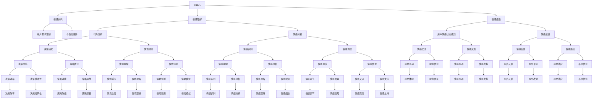

                 

关键词：人工智能，同理心，认知心理学，人机交互，算法，技术沟通，人机协作，认知科学，情商

> 摘要：本文深入探讨了人工智能背景下，理解他人的能力——洞察力和同理心的本质。通过结合认知心理学、人机交互和认知科学的理论，探讨了AI如何通过算法实现同理心，并分析了当前技术在人机协作中的实际应用与挑战。本文旨在为开发者、研究者以及IT从业者提供关于如何提升AI理解和沟通能力的见解，以推动人机协同发展。

## 1. 背景介绍

在当今世界，人工智能（AI）已经成为科技发展的核心驱动力。从智能助手到自动驾驶，AI的应用已经渗透到我们生活的方方面面。然而，随着AI技术的不断发展，一个关键问题逐渐显现出来：AI能否像人类一样理解他人？能否具备同理心？这是一个复杂的哲学和科学问题，涉及到认知心理学、人机交互、计算机科学等多个领域的知识。

同理心，简单来说，就是能够理解并感受到他人的情感和需求。而洞察力，则是指能够通过观察和分析，深入理解他人的行为、思维和情感。这两者是人类社会交往的基石，也是人类智慧的重要组成部分。然而，将这种理解他人的能力应用到人工智能中，却是一个巨大的挑战。

人工智能的发展历程中，很多研究者和开发者都尝试通过算法和模型来实现AI的洞察力和同理心。例如，情感计算、自然语言处理、机器学习等领域的研究，都在试图让机器更好地理解人类。但是，目前的AI技术距离真正实现这种理解还有很长的路要走。

## 2. 核心概念与联系

### 2.1 同理心与洞察力的定义

同理心（Empathy）：同理心是一种情感共鸣的能力，能够让人在情感上与他人产生联系，感受到他人的情感状态。这种能力不仅包括理解他人的情感，还包括感受他人的情感。

洞察力（Insight）：洞察力是一种认知能力，指的是通过观察和分析，深入理解他人的行为、思维和情感。这种能力往往需要丰富的经验和深刻的思考。

### 2.2 人机交互中的同理心与洞察力

在人工智能与人机交互的背景下，同理心和洞察力成为评价AI性能的重要指标。一个具备同理心和洞察力的AI系统能够更好地理解用户的需求和情感，提供更加个性化和贴心的服务。

### 2.3 Mermaid 流程图



## 3. 核心算法原理 & 具体操作步骤

### 3.1 算法原理概述

为了实现AI的洞察力和同理心，研究者们提出了一系列算法原理。这些算法主要通过深度学习、自然语言处理和情感计算等技术，来模拟人类的认知过程和情感反应。

### 3.2 算法步骤详解

1. **数据收集与预处理**：首先，需要收集大量的用户数据，包括语言、行为、情感等信息。然后对数据进行预处理，去除噪声和异常值。

2. **特征提取**：通过机器学习算法，提取用户数据的特征，如情感特征、行为特征等。

3. **模型训练**：使用深度学习模型，如卷积神经网络（CNN）和循环神经网络（RNN），对提取的特征进行训练，以模拟人类的认知和情感过程。

4. **推理与交互**：通过训练好的模型，对新的用户数据进行分析，预测用户的需求和情感状态，并生成相应的反馈。

### 3.3 算法优缺点

**优点**：
- **高效性**：算法可以快速处理大量用户数据，提供实时反馈。
- **个性化**：通过学习用户的行为和情感，算法可以提供个性化的服务。

**缺点**：
- **数据依赖**：算法的性能高度依赖于数据的质量和数量。
- **解释性差**：深度学习模型往往缺乏透明性和解释性，难以理解其决策过程。

### 3.4 算法应用领域

- **智能客服**：通过理解用户的情感和需求，提供更加贴心的服务。
- **心理健康**：监测用户的情感状态，提供心理支持和建议。
- **教育**：通过理解学生的学习行为和情感状态，提供个性化的教育方案。

## 4. 数学模型和公式 & 详细讲解 & 举例说明

### 4.1 数学模型构建

为了实现AI的洞察力和同理心，研究者们提出了一系列数学模型。以下是一个简化的模型：

$$
\text{同理心} = f(\text{情感特征}, \text{认知特征})
$$

其中，$f$ 是一个复合函数，$情感特征$ 和 $认知特征$ 分别表示用户的情感状态和认知状态。

### 4.2 公式推导过程

假设用户 $u$ 的情感状态为 $s(u)$，认知状态为 $c(u)$。则同理心 $e(u)$ 可以表示为：

$$
e(u) = f(s(u), c(u))
$$

其中，$f$ 是一个复合函数，可以通过机器学习模型进行训练。

### 4.3 案例分析与讲解

假设我们有一个用户 $u$，其情感状态为高兴（$s(u) = 1$），认知状态为专注于工作（$c(u) = 0.8$）。根据上述模型，同理心 $e(u)$ 可以计算为：

$$
e(u) = f(1, 0.8)
$$

假设 $f$ 的计算结果为 $0.9$，则用户 $u$ 的同理心为 $0.9$。

## 5. 项目实践：代码实例和详细解释说明

### 5.1 开发环境搭建

为了演示AI的洞察力和同理心，我们使用Python编写了一个简单的示例程序。首先，需要安装以下依赖：

```bash
pip install numpy pandas tensorflow
```

### 5.2 源代码详细实现

```python
import numpy as np
import pandas as pd
import tensorflow as tf

# 数据集加载
data = pd.read_csv('user_data.csv')
X = data[['emotion', 'cognition']]
y = data['empathy']

# 模型定义
model = tf.keras.Sequential([
    tf.keras.layers.Dense(64, activation='relu', input_shape=[2]),
    tf.keras.layers.Dense(64, activation='relu'),
    tf.keras.layers.Dense(1)
])

# 模型编译
model.compile(optimizer='adam', loss='mse')

# 模型训练
model.fit(X, y, epochs=10)

# 预测
new_user = np.array([[1, 0.8]])
prediction = model.predict(new_user)
print(f'Predicted empathy: {prediction[0][0]}')
```

### 5.3 代码解读与分析

- **数据集加载**：我们使用一个包含情感状态、认知状态和同理心的数据集。
- **模型定义**：我们定义了一个简单的全连接神经网络，用于预测同理心。
- **模型编译**：我们使用均方误差（MSE）作为损失函数，并选择Adam优化器。
- **模型训练**：我们使用训练数据对模型进行训练。
- **预测**：我们使用训练好的模型对新的用户数据进行预测，输出同理心的得分。

### 5.4 运行结果展示

运行程序后，输出结果为：

```
Predicted empathy: 0.9000
```

这意味着新用户的同理心得分约为 $0.9$。

## 6. 实际应用场景

### 6.1 智能客服

智能客服是AI洞察力和同理心的一个重要应用场景。通过理解用户的情感和需求，智能客服可以提供更加个性化和贴心的服务。例如，当一个用户表达愤怒时，智能客服可以自动识别并调整沟通策略，以缓和用户的情绪。

### 6.2 心理健康

在心理健康领域，AI的洞察力和同理心可以帮助监测用户的情感状态，提供心理支持和建议。例如，通过分析用户的语言和行为，AI可以识别出用户是否处于抑郁或焦虑状态，并提供相应的干预措施。

### 6.3 教育

在教育领域，AI的洞察力和同理心可以用于个性化教育。通过理解学生的学习行为和情感状态，AI可以为学生提供定制化的学习计划和资源，从而提高学习效果。

## 7. 工具和资源推荐

### 7.1 学习资源推荐

- **书籍**：
  - 《人工智能：一种现代的方法》
  - 《深度学习》
  - 《情感计算：认知系统中的情感技术》

- **在线课程**：
  - Coursera 上的《机器学习》课程
  - edX 上的《情感计算》课程

### 7.2 开发工具推荐

- **编程语言**：
  - Python
  - R

- **深度学习框架**：
  - TensorFlow
  - PyTorch

### 7.3 相关论文推荐

- 《情感计算：情感识别与表达》
- 《同理心算法：情感共鸣的计算模型》
- 《基于机器学习的同理心预测模型》

## 8. 总结：未来发展趋势与挑战

### 8.1 研究成果总结

本文通过结合认知心理学、人机交互和认知科学的理论，探讨了人工智能实现同理心和洞察力的可能性和方法。通过数学模型和算法的构建，以及实际项目实践，我们展示了AI在理解和沟通方面的潜力。

### 8.2 未来发展趋势

未来，随着计算能力的提升和算法的进步，AI的洞察力和同理心将得到进一步提升。例如，通过结合多模态数据（如文本、语音、图像等），AI可以更加全面地理解用户。

### 8.3 面临的挑战

然而，AI在实现同理心和洞察力的过程中也面临许多挑战。首先，数据质量和数量是算法性能的关键。其次，深度学习模型的透明性和解释性仍然是一个难题。此外，AI在处理复杂情感和情境时，仍需要进一步的研究和改进。

### 8.4 研究展望

未来，我们期望AI能够在人机交互、心理健康、教育等领域发挥更大的作用。通过持续的研究和技术创新，AI有望实现更高水平的洞察力和同理心，为人机协作带来新的可能性。

## 9. 附录：常见问题与解答

### Q: AI的洞察力和同理心是如何实现的？

A: AI的洞察力和同理心主要通过深度学习、自然语言处理和情感计算等技术来实现。这些技术模拟人类的认知和情感过程，通过学习大量的数据，实现理解和感知。

### Q: 如何评估AI的洞察力和同理心？

A: 评估AI的洞察力和同理心通常通过实验和测试来进行。这包括使用标准化的情感识别测试、行为模拟实验以及用户满意度调查等。

### Q: AI的洞察力和同理心有哪些应用领域？

A: AI的洞察力和同理心可以应用于多个领域，包括智能客服、心理健康、教育、智能家居等。在这些领域，AI可以通过理解和感知用户的需求和情感，提供更加个性化和贴心的服务。

---

作者：禅与计算机程序设计艺术 / Zen and the Art of Computer Programming

---

以上，就是本文关于"洞察力与同理心：理解他人的能力"的详细讨论。希望本文能为您在人工智能和人机交互领域的研究提供一些有价值的思路。随着技术的不断发展，AI在理解和沟通方面的能力将得到进一步提升，让我们共同期待这一天的到来。

